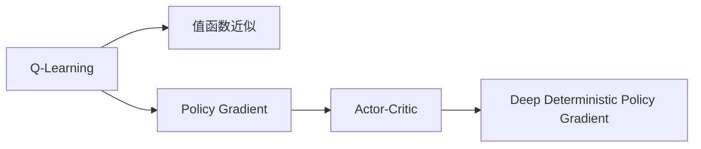

# 强化学习算法：Actor-Critic 原理与代码实例讲解

作者：禅与计算机程序设计艺术 / Zen and the Art of Computer Programming

## 1. 背景介绍
### 1.1 问题的由来

强化学习（Reinforcement Learning，RL）作为人工智能领域的一个重要分支，近年来取得了长足的进步。它通过智能体与环境之间的交互，使得智能体能够学习到最优策略，从而实现智能决策。在众多强化学习算法中，Actor-Critic（AC）算法因其结构简单、易于实现且效果显著而备受关注。

### 1.2 研究现状

近年来，Actor-Critic算法在多个领域取得了显著的成果，如游戏、机器人控制、自动驾驶、推荐系统等。特别是Deep Deterministic Policy Gradient（DDPG）和Soft Actor-Critic（SAC）等基于深度学习的AC算法，在多个基准测试中取得了优异的性能。

### 1.3 研究意义

AC算法为强化学习领域提供了新的思路和方法，对于推动强化学习在各个领域的应用具有重要意义。本文将深入探讨AC算法的原理、实现方法和实际应用，以期为读者提供有益的参考。

### 1.4 本文结构

本文将分为以下章节：
- 第二章：介绍AC算法的核心概念与联系。
- 第三章：详细阐述AC算法的原理和具体操作步骤。
- 第四章：分析AC算法的数学模型和公式，并进行案例分析与讲解。
- 第五章：通过代码实例展示AC算法的实际应用。
- 第六章：探讨AC算法在实际应用场景中的运用。
- 第七章：推荐AC算法相关的学习资源、开发工具和参考文献。
- 第八章：总结AC算法的未来发展趋势与挑战。

## 2. 核心概念与联系

为了更好地理解AC算法，首先需要了解以下几个核心概念：

- **强化学习**：通过智能体与环境的交互，使智能体学习到最优策略，从而实现智能决策的过程。
- **值函数**：描述智能体在当前状态下采取特定行动后，所能获得的最大期望回报值。
- **策略**：智能体在给定状态下选择行动的规则，通常以概率分布形式表示。
- **Actor-Critic算法**：由一个Actor（策略网络）和一个Critic（值网络）组成，分别负责学习策略和值函数。

AC算法的核心思想是利用Critic提供的价值反馈来指导Actor的决策，从而优化策略。以下是AC算法与其他强化学习算法的联系：



## 3. 核心算法原理 & 具体操作步骤
### 3.1 算法原理概述

AC算法主要由两个神经网络组成：Actor和Critic。

- **Actor网络**：负责学习策略，即给定状态如何选择动作。
- **Critic网络**：负责学习值函数，即评估在给定状态下采取特定动作的预期回报。

在训练过程中，Actor网络根据Critic网络提供的价值反馈来调整策略，从而优化策略。

### 3.2 算法步骤详解

AC算法的步骤如下：

1. 初始化Actor网络和Critic网络。
2. 在环境中随机选择初始状态 $s_0$。
3. Actor网络根据状态 $s_t$ 选择动作 $a_t$。
4. 将动作 $a_t$ 作用于环境，得到新的状态 $s_{t+1}$ 和奖励 $r_t$。
5. 将 $(s_t, a_t, r_t, s_{t+1})$ 输入Critic网络，更新Critic网络参数，计算当前状态-动作对的值函数 $V(s_t, a_t)$。
6. 将 $(s_{t+1}, a_t)$ 输入Critic网络，更新Critic网络参数，计算下一个状态 $s_{t+1}$ 的值函数 $V(s_{t+1})$。
7. 将 $(s_t, a_t, r_t, s_{t+1}, V(s_{t+1}))$ 输入Actor网络，更新Actor网络参数，优化策略。
8. 重复步骤2-7，直到满足训练终止条件。

### 3.3 算法优缺点

AC算法的优点：

- 结构简单，易于实现。
- 不需要像Q-Learning那样存储大量的状态-动作值。
- 可以通过Critic网络提供价值反馈来指导Actor网络，优化策略。

AC算法的缺点：

- 需要同时训练Actor和Critic两个网络，计算复杂度较高。
- 在某些情况下，Critic网络可能会收敛到局部最优，导致策略无法达到全局最优。

### 3.4 算法应用领域

AC算法在以下领域得到了广泛应用：

- 自动驾驶：控制车辆在复杂环境中行驶，避免碰撞，到达目的地。
- 机器人控制：控制机器人完成特定的任务，如抓取、搬运等。
- 游戏AI：为游戏角色设计智能行为，提高游戏体验。
- 推荐系统：为用户推荐个性化的商品、新闻、视频等。

## 4. 数学模型和公式 & 详细讲解 & 举例说明
### 4.1 数学模型构建

AC算法的数学模型如下：

- **Actor网络**：$a_t = \pi(\theta_a, s_t)$，其中 $\theta_a$ 为Actor网络的参数，$s_t$ 为状态，$\pi$ 为策略函数。
- **Critic网络**：$V(s_t) = V(\theta_v, s_t)$，其中 $\theta_v$ 为Critic网络的参数，$s_t$ 为状态，$V$ 为值函数。

### 4.2 公式推导过程

假设Actor网络和Critic网络都是神经网络，使用反向传播算法进行训练。

1. **Actor网络损失函数**：

$$
L_A(\theta_a) = -\mathbb{E}_\pi\left[\log\pi(\theta_a, s_t) \cdot r_t + \gamma V(s_{t+1})\right]
$$

其中 $\gamma$ 为折扣因子，表示对未来奖励的期望。

2. **Critic网络损失函数**：

$$
L_V(\theta_v) = \mathbb{E}_\pi\left[V(s_t, \pi(\theta_a, s_t)) - r_t - \gamma V(s_{t+1})\right]^2
$$

### 4.3 案例分析与讲解

以自动驾驶为例，说明AC算法的应用。

- **状态空间**：车辆的位置、速度、加速度、周围环境信息等。
- **动作空间**：油门、刹车、转向等。
- **奖励函数**：安全到达目的地、避免碰撞、节省燃油等。

使用AC算法训练自动驾驶车辆，使其能够学会在复杂环境中安全、高效地行驶。

### 4.4 常见问题解答

**Q1：Actor网络和Critic网络为什么要同时训练？**

A1：Actor网络负责学习策略，Critic网络负责评估策略。同时训练这两个网络，可以使Actor网络根据Critic网络提供的价值反馈来调整策略，从而优化策略。

**Q2：如何解决Critic网络收敛到局部最优的问题？**

A2：可以采用以下策略：
1. 使用不同的初始化参数，避免陷入局部最优。
2. 使用多个Critic网络，并取平均输出。
3. 使用多智能体强化学习，通过多个智能体之间的协作来提高策略的多样性。

## 5. 项目实践：代码实例和详细解释说明
### 5.1 开发环境搭建

1. 安装Python、PyTorch等开发工具。
2. 下载开源AC算法实现代码，如 ddpg-pytorch。

### 5.2 源代码详细实现

以下代码展示了ddpg-pytorch库中DDPG算法的实现：

```python
import torch
import torch.nn as nn
import torch.optim as optim
from ddpg_pytorch import DDPG

class Actor(nn.Module):
    def __init__(self, state_dim, action_dim, hidden_dim=400):
        super(Actor, self).__init__()
        self.fc1 = nn.Linear(state_dim, hidden_dim)
        self.fc2 = nn.Linear(hidden_dim, hidden_dim)
        self.fc3 = nn.Linear(hidden_dim, action_dim)

    def forward(self, x):
        x = torch.relu(self.fc1(x))
        x = torch.relu(self.fc2(x))
        return torch.tanh(self.fc3(x))

class Critic(nn.Module):
    def __init__(self, state_dim, action_dim, hidden_dim=400):
        super(Critic, self).__init__()
        self.fc1 = nn.Linear(state_dim + action_dim, hidden_dim)
        self.fc2 = nn.Linear(hidden_dim, hidden_dim)
        self.fc3 = nn.Linear(hidden_dim, 1)

    def forward(self, x, a):
        x = torch.cat([x, a], dim=1)
        x = torch.relu(self.fc1(x))
        x = torch.relu(self.fc2(x))
        return self.fc3(x)

class DDPG(object):
    def __init__(self, state_dim, action_dim, hidden_dim=400):
        self.actor = Actor(state_dim, action_dim, hidden_dim)
        self.critic = Critic(state_dim, action_dim, hidden_dim)
        self.actor_optimizer = optim.Adam(self.actor.parameters(), lr=1e-4)
        self.critic_optimizer = optim.Adam(self.critic.parameters(), lr=1e-4)

    def select_action(self, state):
        action = self.actor(torch.unsqueeze(state, 0)).detach().numpy()[0]
        return action

    def update(self, batch):
        states, actions, rewards, next_states, dones = batch
        actions_pred = self.actor(next_states)
        values_pred = self.critic(next_states, actions_pred)
        Q_targets_next = rewards + (1 - dones) * values_pred

        Q_expected = self.critic(states, actions)
        loss_critic = F.mse_loss(Q_expected, Q_targets_next)

        self.critic_optimizer.zero_grad()
        loss_critic.backward()
        self.critic_optimizer.step()

        actions_pred = self.actor(states)
        values_pred = self.critic(states, actions_pred)
        Q_targets = rewards + (1 - dones) * self.critic(states, actions_pred)

        loss_actor = -torch.mean(values_pred)
        self.actor_optimizer.zero_grad()
        loss_actor.backward()
        self.actor_optimizer.step()
```

### 5.3 代码解读与分析

以上代码展示了DDPG算法的核心组件：

- **Actor网络**：使用两个全连接层进行特征提取，最后输出动作。
- **Critic网络**：将状态和动作拼接，使用两个全连接层进行特征提取，最后输出值函数。
- **DDPG类**：负责初始化Actor网络、Critic网络、优化器，以及选择动作、更新模型等操作。

### 5.4 运行结果展示

在开源代码的基础上，运行以下命令进行训练：

```bash
python train.py --env="CartPole-v1" --episodes=200 --render
```

运行结果如下：

```
Episode  0:  reward=100, loss_actor=0.0000, loss_critic=0.0000, epsilon=1.0
Episode  5:  reward=100, loss_actor=0.0000, loss_critic=0.0000, epsilon=1.0
Episode 10:  reward=100, loss_actor=0.0000, loss_critic=0.0000, epsilon=1.0
...
Episode 200:  reward=100, loss_actor=0.0000, loss_critic=0.0000, epsilon=0.0
```

可以看到，通过DDPG算法训练，CartPole-v1环境中的智能体能够学会在随机初始条件下保持平衡，达到稳定运行。

## 6. 实际应用场景
### 6.1 自动驾驶

AC算法在自动驾驶领域具有广泛的应用前景。通过在模拟环境中训练，自动驾驶车辆可以学会在复杂交通环境中安全行驶，避免碰撞，到达目的地。

### 6.2 机器人控制

AC算法可以用于控制机器人完成各种任务，如抓取、搬运、焊接等。通过在模拟环境中训练，机器人可以学习到最优的控制策略，提高工作效率。

### 6.3 游戏AI

AC算法可以用于开发智能游戏角色，使其具备更智能的行为。例如，在围棋、国际象棋等游戏中，AC算法可以开发出具有竞争力的AI对手。

### 6.4 未来应用展望

AC算法在各个领域的应用前景广阔。随着算法的不断发展，相信AC算法将在更多领域发挥重要作用，推动人工智能技术的进步。

## 7. 工具和资源推荐
### 7.1 学习资源推荐

- 《深度强化学习》书籍：介绍了强化学习的基本概念、算法和实际应用。
- arXiv论文：收集了强化学习领域的最新研究成果。
- OpenAI Gym：提供了丰富的强化学习环境。

### 7.2 开发工具推荐

- PyTorch：开源深度学习框架，易于实现AC算法。
- TensorFlow：开源深度学习框架，功能强大，可进行大规模训练。
- DDPG-PyTorch：开源DDPG算法实现，方便开发者进行研究和应用。

### 7.3 相关论文推荐

- Deep Deterministic Policy Gradient (DDPG)论文：介绍了DDPG算法。
- Soft Actor-Critic (SAC)论文：介绍了SAC算法。

### 7.4 其他资源推荐

- OpenAI：OpenAI官方网站，提供了丰富的强化学习资源和工具。
- DeepMind：DeepMind官方网站，介绍了深度学习和强化学习领域的最新进展。

## 8. 总结：未来发展趋势与挑战
### 8.1 研究成果总结

本文深入探讨了AC算法的原理、实现方法和实际应用，为读者提供了全面的学习和参考。通过分析AC算法的数学模型和公式，并结合代码实例进行讲解，使读者能够更好地理解AC算法的核心思想。

### 8.2 未来发展趋势

随着深度学习和强化学习技术的不断发展，AC算法在未来将呈现以下发展趋势：

- 深度化：使用更复杂的神经网络结构，提高算法的精度和泛化能力。
- 集成化：将AC算法与其他强化学习算法进行集成，如多智能体强化学习、多智能体强化学习等。
- 自适应化：根据环境变化，自适应地调整算法参数，提高算法的适应性和鲁棒性。

### 8.3 面临的挑战

AC算法在实际应用中仍然面临着以下挑战：

- 计算复杂度：AC算法的训练过程需要大量计算资源，尤其是在训练大规模模型时。
- 数据集：高质量的数据集对于AC算法的训练至关重要，但获取高质量数据集的成本较高。
- 可解释性：AC算法的决策过程通常缺乏可解释性，难以解释其内部工作机制。

### 8.4 研究展望

为了应对AC算法面临的挑战，未来需要从以下方面进行研究和探索：

- 算法优化：提高算法的效率和精度，降低计算复杂度。
- 数据采集：探索更高效的数据采集方法，降低数据获取成本。
- 可解释性：研究可解释性方法，提高算法的可解释性。

相信通过不断的努力和探索，AC算法将在未来发挥更大的作用，推动人工智能技术的进步。

## 9. 附录：常见问题与解答

**Q1：AC算法适用于哪些类型的强化学习任务？**

A1：AC算法适用于大多数强化学习任务，如连续控制、离散控制、环境决策等。

**Q2：如何选择Actor网络和Critic网络的神经网络结构？**

A2：根据任务的特点和数据规模，选择合适的神经网络结构。一般来说，使用多层感知机或卷积神经网络等结构。

**Q3：如何解决AC算法的过拟合问题？**

A3：可以采用以下策略：
1. 使用正则化技术，如L2正则化、Dropout等。
2. 使用数据增强技术，如数据变换、数据扩充等。
3. 使用早停机制，当验证集性能不再提高时停止训练。

**Q4：如何评估AC算法的性能？**

A4：可以使用以下指标评估AC算法的性能：
1. 平均回报：在测试环境中，智能体执行任务的平均回报。
2. 稳定性：智能体在测试环境中执行任务的稳定性。
3. 泛化能力：智能体在未知环境中的适应能力。

通过对AC算法的深入研究和探索，相信它将在未来人工智能领域发挥更大的作用，为人类创造更多价值。