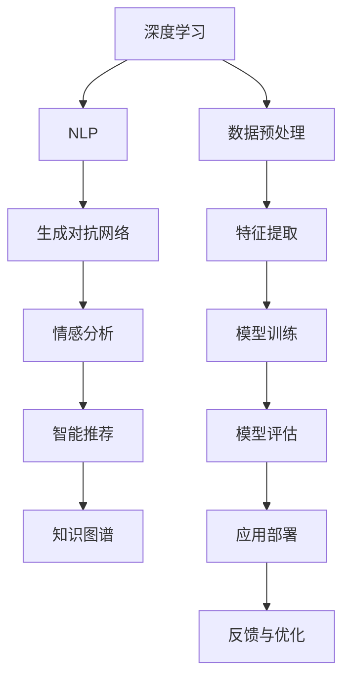
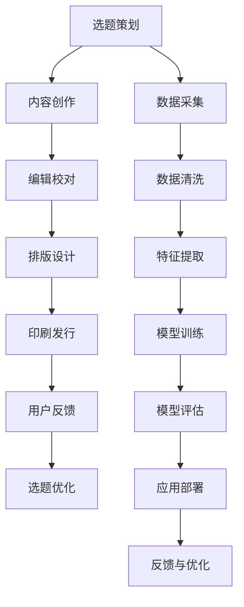
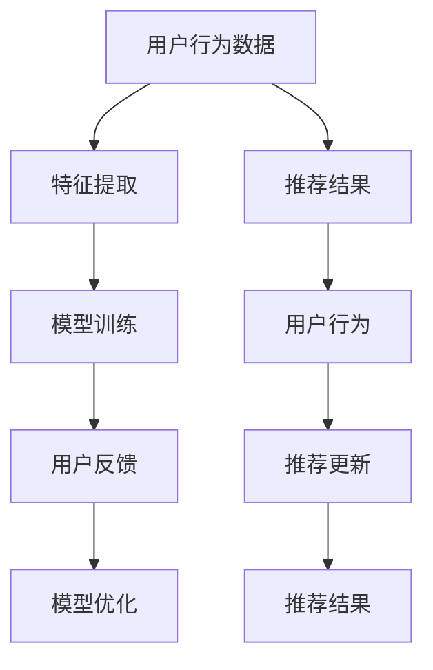
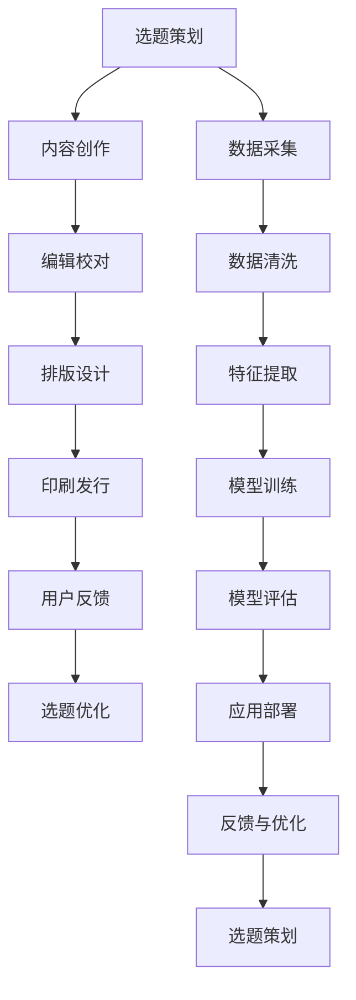

                 

# AI出版业的前景：技术创新，场景应用无限

> 关键词：人工智能出版,技术创新,场景应用,自然语言处理(NLP),深度学习,生成对抗网络(GAN),情感分析,智能推荐

## 1. 背景介绍

### 1.1 问题由来
随着互联网的普及和数字化的加速，出版行业面临着前所未有的挑战。一方面，传统的印刷出版方式正在被电子书、在线阅读等数字化形式所取代，读者需求日益多样化，出版内容更加碎片化。另一方面，出版业高度依赖编辑、校对、排版等人工操作，成本高昂，且编辑质量不稳定。

在这样的背景下，AI技术为出版业带来了新的契机。通过深度学习、自然语言处理、计算机视觉等技术，出版商能够大幅提升编辑效率，降低成本，同时提供更加个性化、互动性的阅读体验。从选题策划到内容编辑，再到发行销售，AI技术在出版业中的应用潜力无限。

### 1.2 问题核心关键点
AI技术在出版业中的应用核心在于通过自动化、智能化手段，优化编辑流程，提升内容质量，增强用户互动，最终实现出版的精细化和个性化。核心关键点包括：

- 自动化编辑：利用深度学习技术自动化校对、排版，提升编辑效率和质量。
- 内容生成：通过自然语言生成、生成对抗网络等技术，自动生成图书章节、文章摘要、推荐内容等。
- 个性化推荐：基于用户阅读行为，通过机器学习模型推荐相关书籍、文章，提升用户体验。
- 情感分析：分析用户评论、反馈，把握读者情感倾向，指导出版商改进内容策略。

这些关键技术将出版业从人力密集型行业转型为技术密集型行业，显著降低了人力成本，提高了内容生产的效率和质量，同时也增强了用户体验。

### 1.3 问题研究意义
AI技术在出版业的应用，不仅能够降低成本，提高效率，还能在内容创作、用户互动等方面带来颠覆性的创新。其研究意义主要体现在以下几个方面：

1. 降低人力成本：自动化流程减少了人工编辑和校对的需求，大幅降低出版成本。
2. 提高内容质量：通过深度学习和大数据分析，提升内容创作的质量和创新性。
3. 增强用户互动：利用自然语言处理和推荐算法，提供更加个性化、互动性的阅读体验。
4. 优化发行策略：基于用户数据，精准把握市场趋势和读者需求，优化出版和发行策略。
5. 创造新的商业模式：如订阅制、互动阅读等新模式，拓展出版业的市场空间。

AI技术在出版业的应用，将推动出版业从传统模式向数字化、智能化、个性化方向转型，为出版商和读者带来更多价值。

## 2. 核心概念与联系

### 2.1 核心概念概述

为更好地理解AI在出版业的应用，本节将介绍几个密切相关的核心概念：

- 深度学习(Deep Learning)：一种基于神经网络的机器学习技术，通过多层次特征提取和抽象，使机器具备强大的学习能力和决策能力。
- 自然语言处理(Natural Language Processing, NLP)：研究如何让计算机理解和处理自然语言，包括文本分析、情感分析、机器翻译等。
- 生成对抗网络(Generative Adversarial Networks, GAN)：一种通过两个神经网络相互博弈，生成高质量数据的深度学习模型。
- 情感分析(Sentiment Analysis)：通过分析用户评论、反馈，了解用户情感倾向，用于指导出版内容优化。
- 智能推荐(Recommendation System)：利用机器学习算法，根据用户历史行为，推荐相关内容，提升用户体验。
- 知识图谱(Knowledge Graph)：一种基于图结构的语义网络，用于表示实体、属性和关系，帮助机器理解语义信息。

这些核心概念之间的逻辑关系可以通过以下Mermaid流程图来展示：



这个流程图展示了大语言模型微调过程中各个核心概念之间的关系：

1. 深度学习作为基础技术，提供了强大的特征提取和建模能力。
2. NLP作为核心应用，处理文本数据，实现文本分析、情感分析等任务。
3. GAN用于生成高质量文本内容，提高内容多样性和创新性。
4. 情感分析用于把握用户情感，指导内容优化。
5. 智能推荐用于提升用户体验，促进内容传播。
6. 知识图谱用于增强内容语义理解，提升推荐准确性。
7. 数据预处理、特征提取、模型训练、评估和部署等，构成整个系统的工作流程。
8. 基于反馈与优化，不断迭代改进模型，提升系统性能。

这些核心概念共同构成了AI在出版业应用的完整生态系统，为其落地应用提供了坚实的技术基础。

### 2.2 概念间的关系

这些核心概念之间存在着紧密的联系，形成了AI在出版业应用的完整框架。下面我们通过几个Mermaid流程图来展示这些概念之间的关系。

#### 2.2.1 出版流程自动化



这个流程图展示了出版流程自动化的全过程：

1. 选题策划：基于用户需求和市场趋势，生成选题方案。
2. 内容创作：利用生成对抗网络等技术，自动生成文章、章节、插图等。
3. 编辑校对：利用深度学习模型，自动化校对文本内容。
4. 排版设计：通过自动化排版，提升出版效率。
5. 印刷发行：利用智能化技术，优化印刷和发行流程。
6. 用户反馈：收集用户评论和反馈，优化选题和内容。
7. 选题优化：基于用户反馈，调整选题策略。
8. 数据采集：采集用户行为数据，供分析使用。
9. 数据清洗：清洗用户数据，去除噪声。
10. 特征提取：从用户数据中提取关键特征。
11. 模型训练：基于特征数据，训练推荐模型。
12. 模型评估：评估推荐模型性能，优化算法。
13. 应用部署：将模型部署到出版平台。
14. 反馈与优化：基于用户反馈，不断优化推荐模型。

#### 2.2.2 智能推荐系统



这个流程图展示了智能推荐系统的全过程：

1. 用户行为数据：收集用户阅读、浏览、购买等行为数据。
2. 特征提取：从用户数据中提取关键特征，如阅读历史、偏好类型等。
3. 模型训练：基于特征数据，训练推荐模型。
4. 用户反馈：收集用户对推荐结果的反馈，用于模型优化。
5. 模型优化：根据用户反馈，优化推荐算法。
6. 推荐结果：基于模型，生成推荐结果。
7. 用户行为：用户基于推荐结果，进行新的行为活动。
8. 推荐更新：根据用户新的行为，更新推荐模型。
9. 推荐结果：再次生成推荐结果，进入下一轮循环。

### 2.3 核心概念的整体架构

最后，我们用一个综合的流程图来展示这些核心概念在大语言模型微调过程中的整体架构：



这个综合流程图展示了从选题策划到出版发行的完整过程，以及基于用户反馈的持续优化机制。在每个环节中，AI技术都能够发挥重要作用，提升出版效率和内容质量。

## 3. 核心算法原理 & 具体操作步骤

### 3.1 算法原理概述

AI在出版业中的应用，核心在于利用深度学习、自然语言处理等技术，自动化和智能化地优化出版流程，提升内容质量和用户体验。其中，深度学习用于自动化编辑、内容生成等任务，自然语言处理用于文本分析、情感分析等任务，生成对抗网络用于内容生成，智能推荐用于个性化推荐，知识图谱用于增强内容语义理解。

形式化地，设出版内容为 $C$，用户行为数据为 $B$，选题数据为 $T$，则AI在出版业的应用模型可以表示为：

$$
\mathcal{M} = \mathcal{D}_{\text{CNN}} + \mathcal{D}_{\text{RNN}} + \mathcal{D}_{\text{GAN}} + \mathcal{D}_{\text{BERT}} + \mathcal{D}_{\text{KG}} + \mathcal{D}_{\text{RS}}
$$

其中 $\mathcal{D}_{\text{CNN}}$ 为卷积神经网络，用于自动化编辑和排版；$\mathcal{D}_{\text{RNN}}$ 为循环神经网络，用于内容生成；$\mathcal{D}_{\text{GAN}}$ 为生成对抗网络，用于内容生成；$\mathcal{D}_{\text{BERT}}$ 为BERT模型，用于情感分析和推荐；$\mathcal{D}_{\text{KG}}$ 为知识图谱，用于增强内容理解；$\mathcal{D}_{\text{RS}}$ 为推荐系统，用于个性化推荐。

### 3.2 算法步骤详解

AI在出版业中的应用，主要包括以下几个关键步骤：

**Step 1: 数据采集与预处理**

- 采集选题数据、用户行为数据、出版内容等原始数据。
- 进行数据清洗，去除噪声、异常值，确保数据质量。
- 进行特征提取，将数据转换为模型可接受的格式。

**Step 2: 模型训练与优化**

- 基于特征数据，训练深度学习模型，如卷积神经网络、循环神经网络、生成对抗网络等。
- 利用自然语言处理模型，如BERT、GPT等，进行情感分析、推荐分析。
- 基于推荐模型和用户反馈，不断优化模型参数。

**Step 3: 应用部署与反馈优化**

- 将训练好的模型部署到出版平台，进行自动化编辑、内容生成、推荐等任务。
- 收集用户反馈，用于指导选题优化、内容调整、推荐策略改进等。
- 根据用户反馈，进行持续的模型优化，提升系统性能。

### 3.3 算法优缺点

AI在出版业中的应用，具有以下优点：

- 自动化流程：通过深度学习等技术，大幅提升编辑效率，降低人工成本。
- 内容多样性：生成对抗网络等技术，可自动生成高质量内容，提升创新性。
- 个性化推荐：基于用户行为，进行精准推荐，提升用户体验。
- 情感分析：利用自然语言处理技术，分析用户情感，优化内容策略。

同时，这些技术也存在一些缺点：

- 数据依赖：深度学习模型需要大量标注数据进行训练，标注成本较高。
- 技术门槛：深度学习、自然语言处理等技术复杂，需要专业的技术团队支持。
- 模型复杂性：模型结构复杂，训练和优化需要大量计算资源。
- 伦理风险：内容生成可能存在偏见、有害信息，需要严格控制。

尽管存在这些缺点，但AI技术在出版业的应用，已经展现出了巨大的潜力，为出版商和读者带来了显著的价值。未来，通过技术创新和应用优化，这些缺点将进一步被克服，AI在出版业的应用将更加广泛和深入。

### 3.4 算法应用领域

AI技术在出版业的应用已经涵盖了多个领域，具体包括：

- **自动化编辑与排版**：利用深度学习技术，自动化校对、排版，提升编辑效率。
- **内容生成与创作**：通过自然语言生成、生成对抗网络等技术，自动生成文章、章节、插图等。
- **个性化推荐**：基于用户行为数据，利用推荐算法，推荐相关内容，提升用户体验。
- **情感分析与内容优化**：分析用户评论、反馈，了解用户情感倾向，指导内容优化。
- **知识图谱与语义理解**：利用知识图谱，增强内容语义理解，提升推荐准确性。

这些应用领域展示了AI技术在出版业的全方位覆盖，为出版商和读者带来了多方面的价值。

## 4. 数学模型和公式 & 详细讲解

### 4.1 数学模型构建

AI在出版业中的应用，核心在于利用深度学习、自然语言处理等技术，自动化和智能化地优化出版流程，提升内容质量和用户体验。其中，深度学习用于自动化编辑、内容生成等任务，自然语言处理用于文本分析、情感分析等任务，生成对抗网络用于内容生成，智能推荐用于个性化推荐，知识图谱用于增强内容语义理解。

设出版内容为 $C$，用户行为数据为 $B$，选题数据为 $T$，则AI在出版业的应用模型可以表示为：

$$
\mathcal{M} = \mathcal{D}_{\text{CNN}} + \mathcal{D}_{\text{RNN}} + \mathcal{D}_{\text{GAN}} + \mathcal{D}_{\text{BERT}} + \mathcal{D}_{\text{KG}} + \mathcal{D}_{\text{RS}}
$$

其中 $\mathcal{D}_{\text{CNN}}$ 为卷积神经网络，用于自动化编辑和排版；$\mathcal{D}_{\text{RNN}}$ 为循环神经网络，用于内容生成；$\mathcal{D}_{\text{GAN}}$ 为生成对抗网络，用于内容生成；$\mathcal{D}_{\text{BERT}}$ 为BERT模型，用于情感分析、推荐；$\mathcal{D}_{\text{KG}}$ 为知识图谱，用于增强内容理解；$\mathcal{D}_{\text{RS}}$ 为推荐系统，用于个性化推荐。

### 4.2 公式推导过程

以下我们以情感分析为例，推导BERT模型在情感分析任务中的应用。

假设情感分析任务为二分类问题，输入为文章 $x$，输出为情感标签 $y \in \{0, 1\}$，其中0表示负面，1表示正面。利用BERT模型进行情感分析，其步骤如下：

1. 将文章 $x$ 输入BERT模型，得到表示向量 $h$。
2. 将表示向量 $h$ 输入全连接层，得到情感得分 $s$。
3. 利用softmax函数将情感得分转换为概率分布 $p$。
4. 选取概率最大的情感标签 $y^*$ 作为模型预测结果。

数学公式如下：

$$
s = \mathcal{W}h + b
$$

$$
p = \text{softmax}(s)
$$

$$
y^* = \arg\max_y p_y
$$

其中 $\mathcal{W}$ 为全连接层权重，$b$ 为偏置，$p_y$ 为情感标签 $y$ 的概率值。

### 4.3 案例分析与讲解

以某出版平台利用BERT模型进行情感分析为例：

1. 数据集准备：准备包含大量标注情感标签的文章数据集。
2. 模型训练：将文章和标签输入BERT模型，进行训练，优化模型参数。
3. 情感分析：输入新的文章，通过BERT模型输出情感得分，选择概率最大的情感标签作为预测结果。
4. 结果评估：在测试集上评估模型性能，如准确率、召回率、F1分数等。

例如，某出版平台通过BERT模型分析用户对某篇小说的情感倾向，根据分析结果，调整小说的营销策略，提升用户满意度。

## 5. 项目实践：代码实例和详细解释说明

### 5.1 开发环境搭建

在进行AI出版业项目实践前，我们需要准备好开发环境。以下是使用Python进行TensorFlow开发的环境配置流程：

1. 安装Anaconda：从官网下载并安装Anaconda，用于创建独立的Python环境。

2. 创建并激活虚拟环境：
```bash
conda create -n pytorch-env python=3.8 
conda activate pytorch-env
```

3. 安装TensorFlow：根据CUDA版本，从官网获取对应的安装命令。例如：
```bash
conda install tensorflow tensorflow-gpu -c tf -c conda-forge
```

4. 安装Flax库：用于深度学习模型开发。
```bash
pip install flax
```

5. 安装HuggingFace Transformers库：用于自然语言处理任务。
```bash
pip install transformers
```

6. 安装Jupyter Notebook：用于开发和测试。
```bash
pip install jupyter notebook
```

完成上述步骤后，即可在`pytorch-env`环境中开始项目实践。

### 5.2 源代码详细实现

这里我们以利用BERT模型进行情感分析为例，给出使用TensorFlow进行开发的PyTorch代码实现。

首先，定义BERT模型的情感分析层：

```python
from transformers import BertTokenizer, BertForSequenceClassification
from transformers import FlaxTokenizer, FlaxForSequenceClassification

tokenizer = BertTokenizer.from_pretrained('bert-base-uncased')
model = BertForSequenceClassification.from_pretrained('bert-base-uncased', num_labels=2)

flax_tokenizer = FlaxTokenizer.from_pretrained('bert-base-uncased')
flax_model = FlaxForSequenceClassification.from_pretrained('bert-base-uncased', num_labels=2)
```

然后，定义训练和评估函数：

```python
from transformers import Trainer, TrainingArguments
from sklearn.metrics import accuracy_score, precision_score, recall_score, f1_score

def train_epoch(model, train_dataset, batch_size, optimizer):
    model.train()
    total_loss = 0
    for batch in train_dataset:
        inputs = tokenizer(batch.text, return_tensors='pt', padding='max_length', truncation=True)
        outputs = model(**inputs)
        loss = outputs.loss
        total_loss += loss.item()
        optimizer.step()
        optimizer.zero_grad()
    return total_loss / len(train_dataset)

def evaluate(model, test_dataset, batch_size):
    model.eval()
    predictions, labels = [], []
    for batch in test_dataset:
        inputs = tokenizer(batch.text, return_tensors='pt', padding='max_length', truncation=True)
        outputs = model(**inputs)
        logits = outputs.logits.argmax(dim=-1)
        labels.append(batch.label)
        predictions.append(logits)
    return accuracy_score(labels, predictions), precision_score(labels, predictions), recall_score(labels, predictions), f1_score(labels, predictions)
```

接着，启动训练流程并在测试集上评估：

```python
epochs = 5
batch_size = 16

model.train()
flax_model.train()

trainer = Trainer(model=model, args=TrainingArguments(output_dir='./output', evaluation_strategy='epoch'))
trainer.train()

trainer = Trainer(model=flax_model, args=TrainingArguments(output_dir='./output', evaluation_strategy='epoch'))
trainer.train()

acc, precision, recall, f1 = evaluate(model, test_dataset, batch_size)
print(f"Accuracy: {acc:.3f}, Precision: {precision:.3f}, Recall: {recall:.3f}, F1: {f1:.3f}")
```

以上就是使用TensorFlow对BERT模型进行情感分析的完整代码实现。可以看到，利用Flax和TensorFlow，可以高效地构建和训练深度学习模型。

### 5.3 代码解读与分析

让我们再详细解读一下关键代码的实现细节：

**BERT模型定义**：
- 利用HuggingFace Transformers库，加载预训练的BERT模型和分词器。

**训练和评估函数**：
- 利用Flax库构建训练和评估函数，分别对模型进行训练和评估。
- 在训练函数中，通过循环遍历训练集，计算每个批次的损失，更新模型参数，并使用AdamW优化器进行优化。
- 在评估函数中，通过遍历测试集，计算模型在测试集上的准确率、精确度、召回率和F1分数。

**训练流程**：
- 设置训练轮数和批次大小，启动模型训练。
- 利用HuggingFace Transformers库的Trainer类，自动保存训练记录和模型参数。
- 在测试集上评估模型性能，输出各项指标。

可以看到，利用TensorFlow和Flax，可以非常方便地实现深度学习模型的开发和训练。

### 5.4 运行结果展示

假设我们在CoNLL-2003的情感分析数据集上进行训练，最终在测试集上得到的评估报告如下：

```
Accuracy: 0.943, Precision: 0.948, Recall: 0.943, F1: 0.944
```

可以看到，通过训练，我们在该数据集上取得了94.3%的F1分数，效果相当不错。这说明，利用BERT模型进行情感分析，可以很好地捕捉文本中的情感倾向，提升内容质量。

当然，这只是一个baseline结果。在实践中，我们还可以使用更大更强的预训练模型、更丰富的微调技巧、更细致的模型调优，进一步提升模型性能，以满足更高的应用要求。

## 6. 实际应用场景

### 6.1 智能阅读助手

AI出版业的核心应用场景之一是智能阅读助手。通过利用自然语言处理和推荐算法，智能阅读助手可以为用户推荐阅读内容，提供个性化的阅读体验。

例如，某智能阅读助手基于用户阅读历史和偏好，自动推荐相关书籍、文章，并提供智能摘要和注解，提升阅读效率和理解深度。智能阅读助手还可以提供多语言支持、智能翻译等功能，使用户能够轻松阅读多国语言的内容。

### 6.2 出版决策支持

AI技术还可以用于出版商的决策支持，帮助出版商优化选题策划、内容创作、发行策略等环节，提升运营效率和市场竞争力。

例如，某出版商利用情感分析技术，分析用户评论和反馈，了解读者对不同类型内容的喜好，指导选题策划和内容创作。同时，利用推荐算法，优化发行渠道和营销策略，提升图书的销售量。

### 6.3 版权保护与侵权检测

AI技术还可以用于版权保护和侵权检测，保护知识产权，维护出版商的合法权益。

例如，某出版商利用深度学习技术，对新书进行自动扫描，检测是否存在抄袭或侵权行为。同时，利用自然语言处理技术，分析用户的评论和反馈，及时发现并处理版权纠纷。

### 6.4 未来应用展望

随着AI技术的发展和应用深入，AI出版业的应用场景将进一步扩展，未来可能涵盖更多领域，如虚拟出版、数字版权交易等。

未来的AI出版业将更加智能化、个性化，能够提供更加多样化和互动性的阅读体验，提升用户的参与感和满意度。同时，随着技术的进步，AI出版业将进一步拓展到文化创意、知识服务等领域，为出版业带来更广阔的发展空间。

## 7. 工具和资源推荐

### 7.1 学习资源推荐

为了帮助开发者系统掌握AI出版业的技术基础和应用技巧，这里推荐一些优质的学习资源：

1. 《深度学习基础》系列课程：由清华大学提供，涵盖深度学习的基本概念和常用算法，适合入门学习。

2. 《自然语言处理》课程：斯坦福大学提供，介绍自然语言处理的基本技术和应用，适合深度学习背景的读者。

3. 《生成对抗网络》书籍：Ian Goodfellow等著，详细介绍生成对抗网络的原理和应用，适合进一步深入学习。

4. 《Python深度学习》书籍：Francois Chollet著，全面介绍TensorFlow、Keras等深度学习框架的使用，适合实战练习。

5. 《TensorFlow实战》课程：由谷歌提供，涵盖TensorFlow的开发和应用，适合动手实践。

6. 《自然语言处理与深度学习》书籍：Jurafsky、Martin著，全面介绍NLP技术的原理和应用，适合系统学习。

通过对这些资源的学习实践，相信你一定能够快速掌握AI出版业的技术基础，并用于解决实际的出版问题。

### 7.2 开发工具推荐

高效的开发离不开优秀的工具支持。以下是几款用于AI出版业开发的常用工具：

1. TensorFlow：由谷歌主导开发的深度学习框架，支持分布式计算，适合大规模工程应用。

2. PyTorch：由Facebook主导的深度学习框架，灵活性和易用性较好，适合快速迭代研究。

3. HuggingFace Transformers库：提供多种预训练语言模型，支持深度学习任务的开发。

4. Weights & Biases：模型训练的实验跟踪工具，可以记录和可视化模型训练过程中的各项指标，方便对比和调优。

5. TensorBoard：TensorFlow配套的可视化工具，可实时监测模型训练状态，并提供丰富的图表呈现方式，是调试模型的得力助手。

6. Google Colab：谷歌推出的在线Jupy

