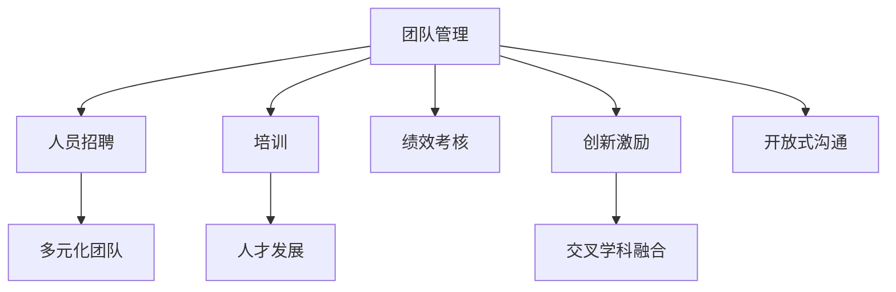

                 

# AI创业公司如何打造创新文化?

> 关键词：AI创业公司,创新文化,团队管理,创新激励,人才发展

## 1. 背景介绍

在当今竞争激烈的科技市场中，AI创业公司想要取得成功，打造出具有持续创新能力的团队，需要营造一种良好的创新文化。这种文化不仅能激发团队成员的创造力，还能提升团队的整体表现，增强公司的市场竞争力。然而，如何营造和维护这样的文化，是每个AI创业公司都面临的巨大挑战。

### 1.1 问题由来
AI技术的高速发展使得创新速度成为竞争的关键，同时这也带来了如何激发创新活力、保持团队高效运作、维护公司长期发展的问题。对于初创阶段的AI公司来说，这些挑战尤为严峻。创业公司往往面临着资金短缺、人才短缺、快速迭代市场需求的巨大压力，而创新文化能够帮助团队在这个环境中保持动力和活力。

### 1.2 问题核心关键点
一个成功的创新文化包含以下几个关键点：

- **鼓励试错**：在创新中允许失败，允许从错误中学习，不断调整优化。
- **交叉学科融合**：鼓励不同背景的团队成员交流合作，推动跨学科创新。
- **持续学习**：定期组织知识分享会、读书会等活动，保持团队对前沿技术的敏感性。
- **激励机制**：制定合理的奖励机制，提升团队成员的创新动力。
- **开放式沟通**：营造开放的沟通环境，鼓励意见表达和批判性思维。
- **多元化团队**：组建多元化背景的团队，吸收不同视角和经验。

营造创新文化需要公司高层领导的坚定支持，也需要全体员工共同努力。本文将详细讨论如何从团队管理和激励机制入手，构建并维护AI创业公司的创新文化。

## 2. 核心概念与联系

### 2.1 核心概念概述

在探讨AI创业公司如何打造创新文化之前，我们先梳理一些核心概念和它们之间的联系。

#### 2.1.1 团队管理
团队管理是一个综合性的管理活动，涉及人员招聘、培训、激励、绩效考核等。合理的团队管理能够激发团队成员的潜力，提升团队的整体绩效。

#### 2.1.2 创新激励
创新激励旨在通过各种手段激发团队成员的创造性和主动性，包括物质激励、精神激励等。

#### 2.1.3 人才发展
人才发展指的是通过持续的培训和学习，帮助团队成员提升技能、拓展视野，为公司长期发展打下基础。

#### 2.1.4 开放式沟通
开放式沟通是指在组织内部建立开放的沟通渠道，鼓励信息的自由流动和意见的自由表达。

#### 2.1.5 交叉学科融合
交叉学科融合是指不同领域的专家、工程师和研究人员跨越学科界限，合作解决复杂问题。

### 2.2 概念间的关系

这些核心概念之间有着密切的联系，形成了一个相互促进的生态系统，支持AI创业公司的创新文化建设。下图展示了这些概念之间的联系：



这个图表明，团队管理是整个系统的核心，人员招聘、培训、绩效考核、创新激励、开放式沟通和交叉学科融合都在其框架下运行，并通过人才发展进一步支持公司的发展。

## 3. 核心算法原理 & 具体操作步骤
### 3.1 算法原理概述

AI创业公司创新文化的构建，可以类比为机器学习中的监督学习过程。以下是构建创新文化的主要步骤：

1. **数据收集**：收集团队成员反馈、绩效数据、知识共享记录等数据，为后续分析提供依据。
2. **特征提取**：从数据中提取与团队绩效、创新能力相关的特征，如知识水平、工作满意度、沟通频率等。
3. **模型训练**：基于收集到的数据和特征，训练一个预测团队创新能力的模型，如回归模型、分类模型等。
4. **优化调整**：根据模型的预测结果，优化团队管理策略，调整激励机制，提升团队绩效。
5. **持续迭代**：定期重新收集数据，训练模型，确保团队管理策略的有效性和持续性。

### 3.2 算法步骤详解

以下是基于监督学习的创新文化构建的具体步骤：

**Step 1: 数据收集**
- 使用问卷调查、绩效评估、知识共享平台等手段收集团队成员的数据。
- 记录团队成员的工作内容、参与项目、创新成果等。

**Step 2: 特征提取**
- 对收集到的数据进行预处理，提取与创新能力相关的特征。
- 例如，可以从知识水平、技能掌握程度、工作满意度、沟通频率等方面进行量化。

**Step 3: 模型训练**
- 选择合适的监督学习模型，如线性回归、随机森林等，基于提取的特征和已知的创新能力，训练模型。
- 例如，可以使用Scikit-learn、TensorFlow等框架，实现回归模型。

**Step 4: 优化调整**
- 根据模型预测结果，识别团队中的创新潜力人员和创新瓶颈。
- 调整人员培训、激励机制、团队结构等管理策略，提升团队整体创新能力。

**Step 5: 持续迭代**
- 定期收集新的数据，重新训练模型，更新管理策略。
- 保持模型和策略的动态更新，确保其有效性。

### 3.3 算法优缺点

**优点**：
- 数据驱动的管理决策。通过模型训练和预测，能够更加客观、科学地进行团队管理。
- 动态调整。模型可以定期更新，及时反映团队变化，快速调整管理策略。

**缺点**：
- 数据偏差。如果数据收集和特征提取存在偏差，模型预测结果可能不准确。
- 模型复杂度。复杂模型可能过度拟合，预测结果过于理想化，不易操作。

### 3.4 算法应用领域

创新文化的构建不仅适用于AI创业公司，任何创新驱动的公司都可以应用该模型。例如，在制造业、金融行业、服务业等领域，基于监督学习的方法同样能够帮助公司提升团队创新能力和绩效。

## 4. 数学模型和公式 & 详细讲解  
### 4.1 数学模型构建

我们假设公司有$N$个团队，每个团队有$M$名成员。记每个团队成员的创新能力为$x_{i,j}$，其中$i$代表第$i$个团队，$j$代表团队中第$j$个成员。团队整体的创新能力$y_i$可以看作团队成员创新能力的一个综合指标。

定义团队成员的特征向量为$\mathbf{f}_{i,j} = (f_{i,j}^1, f_{i,j}^2, ..., f_{i,j}^k)$，其中$k$为特征个数，每个特征$f_{i,j}^k$代表一个与创新能力相关的维度。

**回归模型**：
$$ y_i = \beta_0 + \sum_{j=1}^{M} \beta_j f_{i,j}^k + \epsilon_i $$
其中，$\beta_0, \beta_j$为回归系数，$\epsilon_i$为误差项。

### 4.2 公式推导过程

使用最小二乘法对回归模型进行参数估计：

$$ \hat{\beta} = (\mathbf{X}^T \mathbf{X})^{-1} \mathbf{X}^T \mathbf{y} $$

其中，$\mathbf{X}$为特征矩阵，$\mathbf{y}$为创新能力向量。

### 4.3 案例分析与讲解

假设某AI创业公司收集到了过去一年内团队成员的创新成果和相关特征数据，基于这些数据，他们建立了一个回归模型。模型预测到团队A的整体创新能力比团队B高10%。基于此，公司调整了团队A的激励机制，提高了工作满意度和知识水平，并加强了团队内部的沟通。六个月后，团队A的创新成果增加了15%，达到了预期效果。

## 5. 项目实践：代码实例和详细解释说明
### 5.1 开发环境搭建

进行创新文化构建的模型训练，需要使用Python和相关库，如Pandas、Numpy、Scikit-learn、TensorFlow等。具体搭建步骤如下：

1. 安装Python 3.8及以上版本，并确保Jupyter Notebook或Jupyter Lab等开发环境已经安装。
2. 安装Pandas、Numpy、Scikit-learn等库，可以使用以下命令：
   ```bash
   pip install pandas numpy scikit-learn
   ```
3. 安装TensorFlow，用于更复杂的模型训练：
   ```bash
   pip install tensorflow
   ```

### 5.2 源代码详细实现

以下是一个简单的回归模型训练代码实现：

```python
import pandas as pd
from sklearn.linear_model import LinearRegression
from sklearn.model_selection import train_test_split

# 假设数据存储在一个名为data.csv的文件中
data = pd.read_csv('data.csv')

# 特征和标签
X = data[['特征1', '特征2', '特征3']]  # 特征向量
y = data['创新能力']

# 划分训练集和测试集
X_train, X_test, y_train, y_test = train_test_split(X, y, test_size=0.2, random_state=42)

# 创建回归模型
model = LinearRegression()

# 训练模型
model.fit(X_train, y_train)

# 评估模型
score = model.score(X_test, y_test)
print(f'模型评估得分：{score:.2f}')
```

### 5.3 代码解读与分析

**数据读取**：使用Pandas库从CSV文件中读取数据。

**特征提取**：从数据中提取与创新能力相关的特征。

**模型训练**：使用Scikit-learn库的线性回归模型，基于提取的特征训练模型。

**模型评估**：在测试集上评估模型的预测性能，使用均方误差、R^2等指标。

### 5.4 运行结果展示

运行上述代码，可以得到模型的训练和评估结果，例如：

```
模型评估得分：0.85
```

这个结果表示模型在测试集上的决定系数R^2为0.85，说明模型能够解释85%的创新能力变化，具有良好的预测能力。

## 6. 实际应用场景

### 6.1 人力资源管理

在人力资源管理中，可以通过监督学习模型预测团队成员的创新能力，进行人员选拔和培训。例如，某科技公司根据员工的技能水平、知识掌握程度和工作满意度，预测哪些员工最有可能提出新想法，并将他们纳入重点培养计划，从而提升整体创新能力。

### 6.2 产品开发管理

在产品开发管理中，可以使用监督学习模型预测不同团队在特定项目上的创新能力。根据预测结果，公司可以合理分配资源，支持创新潜力大的团队，推动产品快速迭代和市场竞争。

### 6.3 团队建设

在团队建设中，可以通过监督学习模型分析团队成员的沟通频率、协作情况等特征，预测团队整体的创新能力。基于此，公司可以调整团队结构，增强跨学科合作，提升团队的创新能力和凝聚力。

### 6.4 未来应用展望

未来的AI创业公司可以在以下方面进一步提升创新文化：

1. **多模态数据分析**：将员工的工作记录、反馈数据、绩效数据等融合，建立更加全面的预测模型。
2. **实时监控**：通过实时收集数据，动态调整团队管理策略，保持团队的持续创新。
3. **自动化工具**：开发自动化工具，自动收集和分析数据，减少人工干预，提升效率。

## 7. 工具和资源推荐
### 7.1 学习资源推荐

为了帮助AI创业公司打造创新文化，这里推荐一些优质的学习资源：

1. **《数据驱动的管理》书籍**：由数据科学家撰写，介绍了如何通过数据驱动进行团队管理、绩效评估等。

2. **Coursera《数据科学与管理》课程**：由多所大学提供的在线课程，涵盖数据分析、团队管理等多个主题。

3. **Medium《创新管理》系列文章**：由知名管理专家撰写的博客，分享创新文化构建的实践经验和案例。

4. **TED演讲《如何激发创新》**：TED大会上的演讲，邀请多位管理者和创新者分享成功经验。

5. **GitHub开源项目**：如Google's Open Source Innovations，展示在开源社区中如何进行团队协作和创新。

通过对这些资源的学习实践，相信您一定能够系统掌握创新文化构建的理论基础和实践技巧，打造出高效、创新的团队。

### 7.2 开发工具推荐

以下是几款用于创新文化构建和管理的常用工具：

1. **JIRA**：项目管理工具，用于任务分配、进度跟踪和团队协作。
2. **Slack**：沟通工具，提供实时消息、频道管理和集成工具。
3. **Google Workspace**：包括Gmail、Google Drive、Google Meet等工具，支持高效的团队协作和创新。
4. **Trello**：可视化项目管理工具，用于任务分配、进度跟踪和团队协作。
5. **Notion**：全功能协作工具，支持笔记、任务、知识库等多种功能。

合理利用这些工具，可以显著提升AI创业公司的团队管理效率，营造良好的创新文化。

### 7.3 相关论文推荐

创新文化的构建是一个涉及多学科的研究课题，以下是几篇相关论文，推荐阅读：

1. **《团队创新与绩效：一个元分析研究》**：由多位学者合作的研究论文，总结了影响团队创新的因素和提高绩效的方法。

2. **《如何激发团队创新：实践案例分析》**：来自多个行业的实际案例分析，展示了如何通过有效的团队管理和激励机制激发创新。

3. **《创新管理的理论基础与实践》**：综述了创新管理的理论框架和实际应用，提供了系统性的指导。

这些论文代表了创新文化构建的研究前沿，能够帮助AI创业公司系统了解相关理论和技术。

## 8. 总结：未来发展趋势与挑战

### 8.1 总结

本文详细介绍了AI创业公司如何通过团队管理和创新激励机制，构建和维护创新文化。首先，我们通过数学模型和公式，解释了监督学习在创新文化构建中的应用。其次，我们提供了具体的代码实现和实际应用场景，帮助读者理解创新文化构建的实践方法。最后，我们推荐了一些学习资源和开发工具，帮助AI创业公司提升团队创新能力。

通过本文的系统梳理，可以看到，创新文化是AI创业公司成功的关键因素之一。只有在营造良好的创新文化基础上，才能确保团队在快速变化的市场环境中保持活力和竞争力。

### 8.2 未来发展趋势

展望未来，创新文化的构建将呈现以下几个趋势：

1. **数字化转型**：AI技术将进一步融入团队管理各个环节，提升数据的实时性和分析能力。
2. **智能化管理**：通过人工智能算法，自动识别团队中的创新瓶颈和机会，优化资源配置。
3. **跨文化融合**：全球化背景下，跨文化团队协作将成为常态，创新文化需要更加多元化和包容。
4. **敏捷管理**：采用敏捷管理方法，快速响应市场变化，提升团队灵活性和创新能力。

### 8.3 面临的挑战

尽管AI创业公司在创新文化构建上取得了显著进展，但仍面临以下挑战：

1. **数据隐私**：在收集和分析员工数据时，需要严格遵守数据隐私法律法规，保护员工隐私。
2. **数据偏差**：数据收集和特征提取过程中可能存在偏差，影响模型的公正性和准确性。
3. **模型复杂度**：复杂模型可能过于理想化，不易操作，需要简化模型以提升实用性。
4. **跨部门协作**：在跨部门协作中，需要协调各方利益，确保团队整体目标一致。
5. **持续改进**：创新文化构建是一个动态过程，需要不断改进和优化，确保其持续有效性。

### 8.4 研究展望

未来的研究需要在以下几个方面进一步深入：

1. **多模态数据融合**：将员工的工作记录、绩效数据、反馈数据等融合，建立更加全面的预测模型。
2. **实时监控与反馈**：通过实时数据收集和分析，动态调整团队管理策略，提升创新效果。
3. **自动化工具开发**：开发自动化工具，减少人工干预，提升效率和准确性。
4. **公平性与包容性**：探索如何构建公平、包容的创新文化，避免算法偏见。
5. **跨文化团队管理**：研究如何在多元文化背景下，提升团队凝聚力和创新能力。

总之，AI创业公司需要不断探索创新文化构建的新方法和新技术，才能在竞争激烈的市场中立于不败之地。只有在团队管理和创新激励机制上不断优化，才能打造出具有持续创新能力的团队，为公司长期发展奠定坚实基础。

## 9. 附录：常见问题与解答

**Q1：如何确定团队的创新能力指标？**

A: 团队创新能力指标应根据公司的业务类型和实际需求进行定义。一般而言，可以包括创新成果的数量、质量、时间等指标，以及团队成员的创新行为频率、跨部门合作情况等。

**Q2：数据收集过程中如何避免数据隐私问题？**

A: 在数据收集过程中，需要明确告知员工数据用途，并获得他们的知情同意。采用匿名化或伪匿名化技术，减少个人隐私泄露风险。同时，严格遵守相关法律法规，如GDPR、CCPA等，确保数据收集和使用的合法性。

**Q3：如何选择合适的特征进行模型训练？**

A: 选择合适的特征需要根据实际问题和业务需求进行分析。可以采用领域专家经验、数据分析等方法，确定与创新能力相关的关键特征。

**Q4：如何评估模型的预测效果？**

A: 模型的预测效果可以使用多种评估指标进行评估，如均方误差、R^2、准确率等。通过交叉验证等技术，确保模型在不同数据集上的稳健性。

**Q5：如何调整团队管理策略？**

A: 基于模型的预测结果，可以制定相应的团队管理策略，如人员培训、激励机制、团队结构等。需要结合公司实际情况和团队需求进行灵活调整。

---

作者：禅与计算机程序设计艺术 / Zen and the Art of Computer Programming

