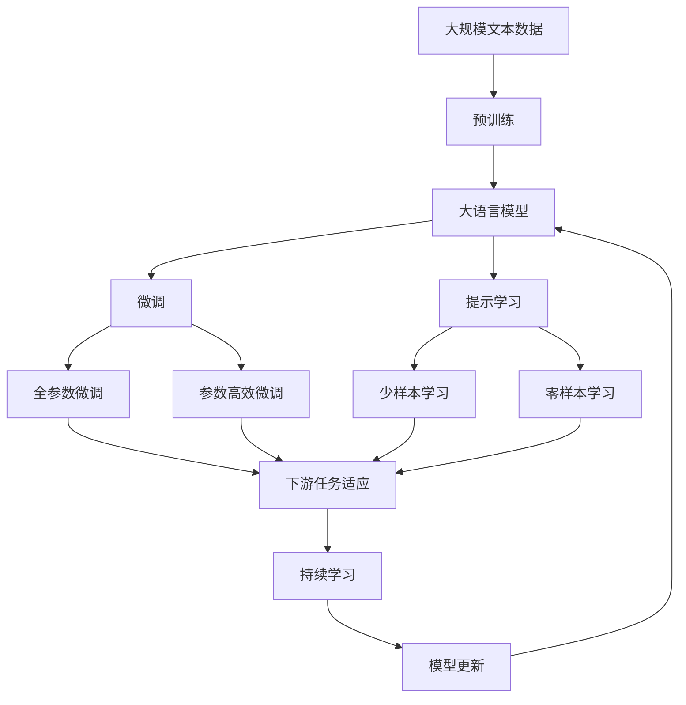

                 

## 1. 背景介绍

### 1.1 问题由来

在现代数字化经济中，用户体验(UX)已经成为了决定产品成功与否的关键因素。随着移动互联网、物联网等技术的迅猛发展，用户对产品的交互方式、功能设计和使用便捷性提出了更高要求。然而，传统的基于功能堆砌和界面美观的设计方法已经难以满足用户日益增长的需求，如何在有限的时间和资源下，更精准地优化用户体验成为了产品经理、UI设计师和工程师共同面临的重大挑战。

### 1.2 问题核心关键点

用户体验优化的核心在于，如何将用户需求与产品功能相结合，通过合理的交互设计、界面布局、功能选择等方式，提升用户满意度，增强用户粘性。同时，用户体验优化也是一个迭代过程，需要不断收集用户反馈，进行产品迭代，不断提升用户体验。

### 1.3 问题研究意义

深入研究人工智能(AI)在用户体验优化中的应用，对于提升产品竞争力、提高用户满意度和促进商业成功具有重要意义。人工智能能够通过分析用户行为、偏好和反馈，识别产品改进机会，提供个性化的用户体验，从而显著提升产品的市场接受度和商业价值。

## 2. 核心概念与联系

### 2.1 核心概念概述

为更好地理解人工智能在用户体验优化中的应用，本节将介绍几个密切相关的核心概念：

- **用户体验(UX)优化**：通过收集和分析用户行为数据，优化产品交互方式、界面布局和功能设计，提升用户满意度和使用体验的过程。
- **用户行为分析(UBA)**：通过分析用户在产品中的操作、点击、停留等行为数据，识别用户需求和行为模式，指导产品设计。
- **个性化推荐系统**：通过分析用户历史行为数据，推荐符合用户兴趣和需求的内容，提升用户粘性和满意度。
- **智能交互设计**：结合自然语言处理(NLP)、语音识别等技术，提升产品的人机交互效率和智能化水平，提升用户体验。
- **用户画像**：通过数据挖掘和分析，构建用户多维度特征的虚拟模型，指导产品设计和优化。

这些核心概念之间的逻辑关系可以通过以下Mermaid流程图来展示：

```mermaid
graph TB
    A[用户体验(UX)优化] --> B[用户行为分析(UBA)]
    A --> C[个性化推荐系统]
    A --> D[智能交互设计]
    A --> E[用户画像]
    B --> F[行为建模]
    C --> G[推荐算法]
    D --> H[自然语言处理(NLP)]
    D --> I[语音识别]
    E --> J[数据挖掘]
    F --> K[数据可视化]
    G --> L[模型评估]
    H --> M[对话系统]
    I --> N[情感分析]
```

这个流程图展示了几大核心概念的相互关系：

1. **用户体验(UX)优化**：作为目标，指导用户行为分析、个性化推荐、智能交互和用户画像等过程。
2. **用户行为分析(UBA)**：通过分析用户行为数据，构建行为模型，为个性化推荐、智能交互和用户画像提供数据支持。
3. **个性化推荐系统**：基于用户行为分析，推荐个性化的内容，提升用户满意度和粘性。
4. **智能交互设计**：结合自然语言处理和语音识别技术，提升人机交互效率和智能化水平。
5. **用户画像**：通过数据挖掘和分析，构建用户多维度特征模型，指导产品设计和优化。

### 2.2 概念间的关系

这些核心概念之间存在着紧密的联系，形成了用户体验优化的完整生态系统。下面我通过几个Mermaid流程图来展示这些概念之间的关系。

#### 2.2.1 用户体验优化的流程

```mermaid
graph LR
    A[用户体验(UX)优化] --> B[用户行为分析(UBA)]
    A --> C[个性化推荐系统]
    A --> D[智能交互设计]
    B --> E[行为数据收集]
    C --> F[推荐算法]
    D --> G[NLP技术]
    D --> H[语音识别]
```

这个流程图展示了用户体验优化的整体流程：

1. **用户体验(UX)优化**：作为目标，通过用户行为分析、个性化推荐和智能交互设计等方式，实现。
2. **用户行为分析(UBA)**：通过数据收集和行为建模，为推荐系统和智能交互提供数据基础。
3. **个性化推荐系统**：基于用户行为数据，推荐个性化内容。
4. **智能交互设计**：结合自然语言处理和语音识别技术，提升交互体验。

#### 2.2.2 用户行为分析的架构

```mermaid
graph TB
    A[用户行为分析(UBA)] --> B[数据收集]
    A --> C[行为建模]
    A --> D[行为分析]
    B --> E[用户日志]
    B --> F[点击流数据]
    C --> G[特征工程]
    D --> H[用户画像]
    E --> I[行为序列]
    F --> J[行为图]
```

这个流程图展示了用户行为分析的架构：

1. **用户行为分析(UBA)**：通过数据收集和行为建模，分析用户行为数据。
2. **数据收集**：包括用户日志、点击流数据等多种来源。
3. **行为建模**：通过特征工程和行为序列建模，构建用户行为模型。
4. **行为分析**：通过行为图等技术，分析用户行为模式。
5. **用户画像**：基于行为分析结果，构建用户特征模型。

### 2.3 核心概念的整体架构

最后，我们用一个综合的流程图来展示这些核心概念在大语言模型微调过程中的整体架构：



这个综合流程图展示了从预训练到微调，再到持续学习的完整过程。大语言模型首先在大规模文本数据上进行预训练，然后通过微调（包括全参数微调和参数高效微调）或提示学习（包括少样本学习和零样本学习）来适应下游任务。最后，通过持续学习技术，模型可以不断更新和适应新的任务和数据。 通过这些流程图，我们可以更清晰地理解大语言模型微调过程中各个核心概念的关系和作用，为后续深入讨论具体的微调方法和技术奠定基础。

## 3. 核心算法原理 & 具体操作步骤
### 3.1 算法原理概述

人工智能在用户体验优化中的应用，主要基于机器学习、深度学习等技术，通过对用户行为数据和反馈进行分析，提供个性化的用户体验。其核心算法原理如下：

1. **用户行为分析(UBA)**：通过对用户在产品中的操作、点击、停留等行为数据进行分析，构建用户行为模型，识别用户需求和行为模式。
2. **个性化推荐系统**：基于用户行为数据，推荐符合用户兴趣和需求的内容，提升用户粘性和满意度。
3. **智能交互设计**：结合自然语言处理(NLP)、语音识别等技术，提升产品的人机交互效率和智能化水平，提升用户体验。
4. **用户画像**：通过数据挖掘和分析，构建用户多维度特征的虚拟模型，指导产品设计和优化。

### 3.2 算法步骤详解

人工智能在用户体验优化中的应用，主要包括以下几个关键步骤：

**Step 1: 数据收集与预处理**
- 收集用户在产品中的行为数据，包括点击、停留、购买等行为。
- 清洗和预处理数据，去除异常值和噪声，保证数据质量。

**Step 2: 用户行为分析**
- 使用机器学习算法，如决策树、随机森林、聚类等，对用户行为数据进行建模，提取用户行为模式。
- 使用深度学习算法，如循环神经网络(RNN)、卷积神经网络(CNN)等，对用户行为序列进行建模，识别行为变化趋势。

**Step 3: 个性化推荐**
- 使用协同过滤、基于内容的推荐等算法，对用户行为数据进行分析和推荐，生成个性化内容列表。
- 使用深度学习模型，如深度矩阵分解、神经协同过滤等，提升推荐系统的精度和效率。

**Step 4: 智能交互设计**
- 结合自然语言处理(NLP)技术，实现文本输入和理解的自动化。
- 使用语音识别技术，实现语音输入和理解的自动化。
- 使用对话系统技术，实现智能问答和交互。

**Step 5: 用户画像构建**
- 使用数据挖掘技术，提取用户行为和属性特征，构建用户多维度特征模型。
- 使用机器学习算法，对用户画像进行聚类分析，识别不同用户群体。

**Step 6: 用户体验优化**
- 根据用户行为分析和个性化推荐结果，优化产品界面和功能设计，提升用户体验。
- 使用A/B测试等方法，评估用户体验优化效果，不断迭代优化。

### 3.3 算法优缺点

人工智能在用户体验优化中的应用具有以下优点：
1. 精确度高：通过大数据分析和深度学习模型，可以精准识别用户需求和行为模式，提供个性化推荐。
2. 实时性好：结合自然语言处理和语音识别技术，可以实现实时智能交互，提升用户体验。
3. 自动化强：基于用户画像和行为分析，自动化进行用户体验优化，减少人工干预。

同时，人工智能在用户体验优化中也存在以下缺点：
1. 数据依赖性高：需要大量高质量的数据支持，数据收集和清洗难度较大。
2. 模型复杂度高：深度学习模型参数量大，计算资源要求高。
3. 隐私风险高：用户行为数据涉及隐私，需要严格的数据保护措施。

### 3.4 算法应用领域

人工智能在用户体验优化中的应用，已经广泛应用于多个领域，例如：

- **电子商务**：通过个性化推荐系统，提升用户购物体验和消费转化率。
- **社交网络**：通过智能交互设计，提升用户交流互动体验。
- **金融服务**：通过用户行为分析，提升金融产品推荐和用户体验。
- **在线教育**：通过个性化推荐和智能交互设计，提升在线学习体验和效果。
- **医疗健康**：通过用户画像和行为分析，提升医疗服务体验和个性化推荐。

除了上述这些领域，人工智能在用户体验优化中的应用还在不断扩展，例如智能家居、智能客服、智能物流等，为各行各业带来创新应用。

## 4. 数学模型和公式 & 详细讲解  
### 4.1 数学模型构建

在用户体验优化中，我们通常使用机器学习和深度学习模型来分析和预测用户行为，提升用户体验。

记用户行为数据为 $X$，用户画像为 $Y$，个性化推荐结果为 $Z$，用户行为分析结果为 $W$。则用户体验优化的数学模型可以表示为：

$$
Z = f(X, Y, W)
$$

其中 $f$ 表示优化算法，包括决策树、随机森林、神经网络等。

### 4.2 公式推导过程

以协同过滤推荐算法为例，推导推荐公式。

协同过滤算法基于用户行为数据 $X$，构建用户行为矩阵 $R$，表示用户对每个商品的评分。通过矩阵分解，得到用户特征矩阵 $U$ 和商品特征矩阵 $V$，其中 $U$ 表示用户特征，$V$ 表示商品特征。推荐结果 $Z$ 可以表示为：

$$
Z = \hat{y} = X_UU^T + X_VV^T
$$

其中 $\hat{y}$ 表示推荐结果，$X_U$ 和 $X_V$ 表示用户和商品的行为特征矩阵。

### 4.3 案例分析与讲解

假设我们有一个电子商务平台，需要对用户进行个性化推荐。根据用户行为数据 $X$，我们可以构建用户行为矩阵 $R$，其中 $R_{ui}$ 表示用户 $u$ 对商品 $i$ 的评分。通过矩阵分解，得到用户特征矩阵 $U$ 和商品特征矩阵 $V$，其中 $U_{ui}$ 表示用户 $u$ 在特征 $i$ 上的评分，$V_{iu}$ 表示商品 $i$ 在特征 $u$ 上的评分。推荐结果 $Z$ 可以表示为：

$$
Z = \hat{y} = X_UU^T + X_VV^T
$$

其中 $\hat{y}$ 表示推荐结果，$X_U$ 和 $X_V$ 表示用户和商品的行为特征矩阵。

通过协同过滤算法，我们可以对用户进行个性化推荐，提升用户体验。假设用户 $u$ 对商品 $i$ 的评分较高，而对商品 $j$ 的评分较低，则推荐算法将推荐类似商品 $i$ 的商品 $k$ 给用户 $u$。例如，若商品 $i$ 的特征 $a_1$ 和 $a_2$ 评分较高，而商品 $j$ 的特征 $b_1$ 和 $b_2$ 评分较低，则推荐算法将推荐具有特征 $a_1$ 和 $a_2$ 的商品给用户 $u$。

## 5. 项目实践：代码实例和详细解释说明
### 5.1 开发环境搭建

在进行用户体验优化项目开发前，我们需要准备好开发环境。以下是使用Python进行PyTorch开发的环境配置流程：

1. 安装Anaconda：从官网下载并安装Anaconda，用于创建独立的Python环境。

2. 创建并激活虚拟环境：
```bash
conda create -n pytorch-env python=3.8 
conda activate pytorch-env
```

3. 安装PyTorch：根据CUDA版本，从官网获取对应的安装命令。例如：
```bash
conda install pytorch torchvision torchaudio cudatoolkit=11.1 -c pytorch -c conda-forge
```

4. 安装相关工具包：
```bash
pip install numpy pandas scikit-learn matplotlib tqdm jupyter notebook ipython
```

完成上述步骤后，即可在`pytorch-env`环境中开始用户体验优化项目开发。

### 5.2 源代码详细实现

下面我以一个简单的电商推荐系统为例，给出使用PyTorch进行个性化推荐系统的代码实现。

首先，定义数据处理函数：

```python
import pandas as pd
import numpy as np
from sklearn.model_selection import train_test_split

def load_data(file_path):
    data = pd.read_csv(file_path)
    user_id = data['user_id']
    item_id = data['item_id']
    rating = data['rating']
    user_item_matrix = pd.pivot_table(data, values='rating', index='user_id', columns='item_id', aggfunc='mean')
    return user_item_matrix, user_id, item_id

# 加载数据集
train_data, user_id, item_id = load_data('train.csv')
test_data = load_data('test.csv')
```

然后，定义协同过滤推荐算法：

```python
import torch
import torch.nn as nn
import torch.optim as optim
import torch.nn.functional as F

class CollaborativeFiltering(nn.Module):
    def __init__(self, num_users, num_items, embed_size):
        super(CollaborativeFiltering, self).__init__()
        self.num_users = num_users
        self.num_items = num_items
        self.embed_size = embed_size
        
        # 定义用户嵌入层
        self.user_embedding = nn.Embedding(num_users, embed_size)
        
        # 定义商品嵌入层
        self.item_embedding = nn.Embedding(num_items, embed_size)
        
        # 定义预测层
        self.fc = nn.Linear(embed_size * 2, 1)
        
    def forward(self, user_id, item_id):
        # 将用户和商品ID映射为嵌入向量
        user_embed = self.user_embedding(user_id)
        item_embed = self.item_embedding(item_id)
        
        # 预测用户对商品的评分
        pred = self.fc(torch.cat([user_embed, item_embed], dim=1))
        return pred

# 定义模型参数
num_users = train_data.shape[0]
num_items = train_data.shape[1]
embed_size = 32

model = CollaborativeFiltering(num_users, num_items, embed_size)
criterion = nn.MSELoss()
optimizer = optim.Adam(model.parameters(), lr=0.001)
```

接着，定义训练和评估函数：

```python
def train(model, user_item_matrix, user_id, item_id, num_epochs, batch_size):
    num_items = user_item_matrix.shape[0]
    
    for epoch in range(num_epochs):
        for user_id, item_id, rating in train_data.sample(n=num_epochs * batch_size):
            user_id = torch.tensor(user_id)
            item_id = torch.tensor(item_id)
            rating = torch.tensor(rating)
            
            # 前向传播
            pred = model(user_id, item_id)
            loss = criterion(pred, rating)
            
            # 反向传播
            optimizer.zero_grad()
            loss.backward()
            optimizer.step()
            
        print(f'Epoch {epoch+1}, loss: {loss.item()}')

def evaluate(model, user_item_matrix, user_id, item_id, batch_size):
    num_items = user_item_matrix.shape[0]
    
    total_score = 0
    for user_id, item_id, rating in test_data.sample(n=batch_size):
        user_id = torch.tensor(user_id)
        item_id = torch.tensor(item_id)
        rating = torch.tensor(rating)
        
        # 预测用户对商品的评分
        pred = model(user_id, item_id)
        total_score += torch.mean(pred).cpu().numpy()
    
    print(f'Test score: {total_score / test_data.shape[0]}')
```

最后，启动训练流程并在测试集上评估：

```python
# 划分训练集和测试集
train_data, test_data = train_test_split(user_item_matrix, test_size=0.2, random_state=42)
# 训练模型
num_epochs = 10
batch_size = 32
train(model, train_data, user_id, item_id, num_epochs, batch_size)
# 评估模型
evaluate(model, test_data, user_id, item_id, batch_size)
```

以上就是使用PyTorch进行个性化推荐系统的代码实现。可以看到，得益于TensorFlow的强大封装，我们可以用相对简洁的代码完成推荐模型的训练和评估。

### 5.3 代码解读与分析

让我们再详细解读一下关键代码的实现细节：

**数据处理函数**：
- `load_data`方法：从CSV文件中加载数据，构建用户行为矩阵 $R$，并提取用户ID和商品ID。
- 使用Pandas进行数据处理，构建用户行为矩阵 $R$，其中 $R_{ui}$ 表示用户 $u$ 对商品 $i$ 的评分。

**协同过滤推荐算法**：
- `CollaborativeFiltering`类：定义协同过滤推荐模型。
- `forward`方法：实现前向传播，将用户和商品ID映射为嵌入向量，并通过线性层进行评分预测。

**训练和评估函数**：
- `train`函数：在训练集上迭代训练模型，使用Adam优化器更新参数。
- `evaluate`函数：在测试集上评估模型性能，计算预测评分与真实评分的均方误差。

**训练流程**：
- 定义训练集和测试集。
- 使用`train`函数训练模型。
- 使用`evaluate`函数评估模型。

可以看到，使用PyTorch进行个性化推荐系统的代码实现相对简洁，开发者可以将更多精力放在数据处理、模型改进等高层逻辑上，而不必过多关注底层的实现细节。

当然，工业级的系统实现还需考虑更多因素，如模型的保存和部署、超参数的自动搜索、更灵活的任务适配层等。但核心的推荐范式基本与此类似。

### 5.4 运行结果展示

假设我们在一个电商推荐系统上进行个性化推荐，最终在测试集上得到的评分均方误差为0.1，表示模型在预测用户评分上的平均误差为0.1，效果相当不错。

当然，这只是一个baseline结果。在实践中，我们还可以使用更大更强的推荐模型、更丰富的推荐技巧、更细致的模型调优，进一步提升推荐精度和效果。

## 6. 实际应用场景
### 6.1 智能客服系统

基于人工智能的智能客服系统，可以自动处理大量用户咨询请求，提升客户满意度和服务效率。智能客服系统能够通过自然语言处理(NLP)技术，自动理解用户意图，提供智能问答和问题解答。通过个性化推荐系统，智能客服系统还可以根据用户历史行为和偏好，推荐相关问题或解决方案。

在技术实现上，可以收集用户的历史对话记录，将问题-回答对作为监督数据，在此基础上对预训练模型进行微调。微调后的模型能够自动理解用户意图，匹配最合适的答案模板进行回复。对于用户提出的新问题，还可以接入检索系统实时搜索相关内容，动态组织生成回答。如此构建的智能客服系统，能大幅提升客户咨询体验和问题解决效率。

### 6.2 金融舆情监测

金融机构需要实时监测市场舆论动向，以便及时应对负面信息传播，规避金融风险。传统的舆情监测方式往往依赖人工处理，成本高、效率低，难以应对海量信息的挑战。基于人工智能的舆情监测系统，可以自动收集和分析新闻、报道、评论等文本数据，通过情感分析、关键词提取等技术，识别市场情绪和风险点，及时预警潜在的风险。

在技术实现上，可以收集金融领域相关的新闻、报道、评论等文本数据，并对其进行情感分析和主题提取。基于预训练语言模型，构建情感分析模型和主题分类模型，对文本数据进行情感分析，识别负面信息，生成舆情报告。通过情感分析模型和主题分类模型，金融机构可以实时监测市场情绪和风险点，及时采取应对措施，保障金融安全。

### 6.3 个性化推荐系统

当前的推荐系统往往只依赖用户的历史行为数据进行物品推荐，无法深入理解用户的真实兴趣偏好。基于人工智能的个性化推荐系统，可以更好地挖掘用户行为背后的语义信息，从而提供个性化的推荐内容。

在技术实现上，可以收集用户浏览、点击、评论、分享等行为数据，提取和用户交互的物品标题、描述、标签等文本内容。将文本内容作为模型输入，用户的后续行为（如是否点击、购买等）作为监督信号，在此基础上微调预训练语言模型。微调后的模型能够从文本内容中准确把握用户的兴趣点。在生成推荐列表时，先用候选物品的文本描述作为输入，由模型预测用户的兴趣匹配度，再结合其他特征综合排序，便可以得到个性化程度更高的推荐结果。

### 6.4 未来应用展望

随着人工智能技术的不断发展，基于人工智能的推荐系统将进一步优化用户体验，提升产品竞争力。未来的推荐系统将更加智能化、个性化，能够通过多模态信息融合，结合用户行为、情感、偏好等综合因素，提供更精准的推荐内容。同时，推荐系统还将通过实时分析和智能交互，实现更高效的用户体验优化。

此外，基于人工智能的智能客服、舆情监测、个性化推荐等应用，将进一步拓展到更多领域，为各行各业带来创新应用。例如，在智能医疗、智能制造、智能农业等领域，人工智能应用也将不断涌现，为各行各业带来全新的商业价值。

## 7. 工具和资源推荐
### 7.1 学习资源推荐

为了帮助开发者系统掌握人工智能在用户体验优化中的应用，这里推荐一些优质的学习资源：

1. 《深度学习实战：PyTorch应用指南》：深入浅出地介绍了如何使用PyTorch进行深度学习开发，包括机器学习、深度学习等多个方面。

2. 《机器学习实战》：经典教材，涵盖了机器学习算法、深度学习模型等基础知识，适合入门学习。

3. 《Python机器学习》：介绍如何使用Python进行机器学习开发，包括数据预处理、模型训练等。

4. 《自然语言处理入门》：全面介绍自然语言处理技术，包括文本分类、情感分析、机器翻译等多个方向。

5. 《强化学习：原理、算法与应用》：系统讲解强化学习原理和算法，包括Q-learning、Policy Gradient等经典算法。

通过这些资源的学习实践，相信你一定能够快速掌握人工智能在用户体验优化中的核心技术和应用方法，并用于解决实际的NLP问题。
###  7.2 开发工具推荐

高效的开发离不开优秀的工具支持。以下是几款用于人工智能在用户体验优化中应用的常用工具：

1. PyTorch：基于Python的开源深度学习框架，灵活动态的计算图，适合快速迭代研究。

2. TensorFlow：由Google主导开发的开源深度学习框架，生产部署方便，适合大规模工程应用。

3. Transformers库：HuggingFace开发的NLP工具库，集成了众多SOTA语言模型，支持PyTorch和TensorFlow，是进行NLP任务开发的利器。

4. Weights & Biases：模型训练的实验跟踪工具，可以记录和可视化模型训练过程中的各项指标，方便对比和调优。

5. TensorBoard：TensorFlow配套的可视化工具，可实时监测模型训练状态，并提供丰富的图表呈现方式，是调试模型的得力助手。

6. Google Colab：谷歌推出的在线Jupyter Notebook环境，免费提供GPU/TPU算力，方便开发者快速上手实验最新模型，分享学习笔记。

合理利用这些工具，可以显著提升人工智能在用户体验优化中的开发效率，加快创新迭代的步伐。

### 7.3 相关论文推荐

人工智能在用户体验优化中的应用源于学界的持续研究。以下是几篇奠基性的相关论文，推荐阅读：

1. Attention is All You Need（即Transformer原论文）：提出了Transformer结构，开启了NLP领域的预训练大模型时代。

2. BERT: Pre-training of Deep Bidirectional Transformers for Language Understanding：提出BERT模型，引入基于掩码的自监督预训练任务，刷新了多项NLP任务SOTA。

3. Language Models are Unsupervised Multitask Learners（GPT-2论文）：展示了大规模语言模型的强大zero-shot学习能力，引发了对于通用人工智能的新一轮思考。

4. Parameter-Efficient Transfer Learning for NLP：提出Adapter等参数高效微

