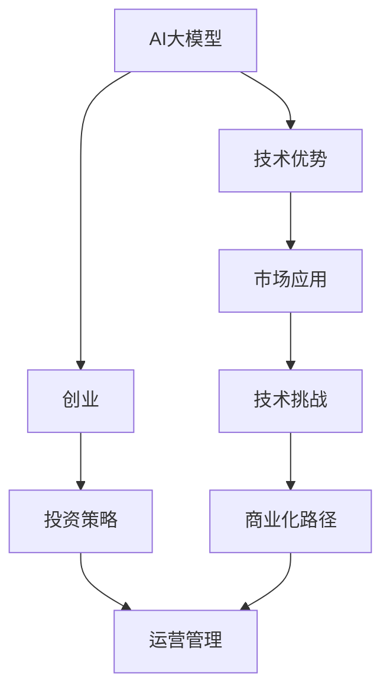

                 

# AI大模型创业：如何应对未来技术挑战？

> 关键词：
1. AI大模型创业
2. 技术挑战
3. 创业指南
4. 市场应用
5. 投资策略
6. 技术优势
7. 商业化路径

## 1. 背景介绍

在人工智能（AI）的浪潮中，大模型（Large Model）逐渐成为引领行业发展的关键技术。随着技术的不断进步，越来越多的企业和创业者涌向大模型的创业之路。然而，创业不仅仅是技术的堆砌，更需要深入理解市场、竞争、商业模式和运营。本文将详细剖析AI大模型创业的挑战，并提出应对策略。

## 2. 核心概念与联系

### 2.1 核心概念概述

1. **AI大模型**：指在大规模数据集上训练得到的深度神经网络模型，通常包含数亿个参数。这类模型在图像识别、自然语言处理、推荐系统等领域展现出显著的性能优势。
2. **创业**：是指通过资源整合，创建新的商业实体，并进行市场开拓、融资、运营和管理的过程。
3. **技术挑战**：指的是在大模型应用和创业过程中所遇到的各种技术难题，如模型训练、部署、优化等。
4. **市场应用**：指将大模型技术应用于具体行业场景，解决实际问题，实现商业价值的实践活动。
5. **投资策略**：指在创业过程中进行资金筹集和资本运作的策略，包括天使投资、风险投资、并购等。
6. **技术优势**：指大模型技术相比传统模型所具有的独特优势，如更高的准确率、更强的泛化能力等。
7. **商业化路径**：指将大模型技术转化为实际商业产品的过程，包括产品设计、市场推广、客户服务等。

### 2.2 概念间的关系

大模型技术为创业公司提供了强大的技术基础，但创业过程涉及技术、市场、资金、运营等多个维度，各概念之间相互关联、相互影响。如下图，我们将各概念之间的关系用Mermaid流程图展示：



这个流程图展示了大模型技术如何通过创业转化为商业应用，同时面临技术挑战和投资策略的交织影响，最终通过市场应用和运营管理实现商业化路径。

## 3. 核心算法原理 & 具体操作步骤
### 3.1 算法原理概述

大模型创业的核心在于将前沿AI技术转化为具有商业价值的产品。这涉及到从算法设计、模型训练到产品部署的全过程。大模型技术主要基于深度学习算法，特别是神经网络。以下是AI大模型创业的技术流程：

1. **数据准备**：收集和清洗数据，确保数据的多样性和代表性。
2. **模型选择与设计**：选择合适的模型架构，如CNN、RNN、Transformer等，并进行必要的改进和优化。
3. **模型训练**：使用大规模数据集进行模型训练，调整超参数，如学习率、批次大小等。
4. **模型评估与优化**：在验证集上评估模型性能，调整模型架构和超参数，提高模型准确率和泛化能力。
5. **产品部署**：将训练好的模型部署到云端或本地服务器，支持实时推理和预测。
6. **市场推广**：通过各种营销手段，将产品推向市场，吸引用户和客户。

### 3.2 算法步骤详解

以下是AI大模型创业的具体操作步骤：

**Step 1: 数据准备与预处理**

- 数据收集：获取行业相关的数据集，如图片、文本、语音等。
- 数据清洗：去除噪声、缺失值等不必要的数据，确保数据的质量。
- 数据增强：通过数据扩充、翻转、旋转等技术，增加数据的多样性。

**Step 2: 模型选择与设计**

- 模型架构选择：根据任务需求，选择适合的模型架构，如卷积神经网络（CNN）用于图像识别，循环神经网络（RNN）用于时间序列预测。
- 模型设计：设计模型的层数、节点数等超参数，确保模型能够高效处理数据。
- 网络结构设计：如使用Transformer模型，可以设计自注意力机制，提高模型对输入的捕捉能力。

**Step 3: 模型训练**

- 数据划分：将数据集划分为训练集、验证集和测试集。
- 超参数调整：通过网格搜索、随机搜索等方法，调整学习率、批次大小等超参数。
- 模型训练：使用GPU、TPU等硬件加速，进行模型训练。
- 模型保存：将训练好的模型保存到本地或云端，以便后续使用。

**Step 4: 模型评估与优化**

- 模型评估：在验证集上评估模型性能，如准确率、召回率、F1值等指标。
- 模型优化：根据评估结果，调整模型架构和超参数，重新训练模型。
- 模型融合：使用集成学习等方法，融合多个模型的输出，提高预测准确性。

**Step 5: 产品部署**

- 服务部署：将模型部署到云平台或本地服务器，提供API接口。
- 性能优化：通过模型剪枝、量化等技术，提高模型的推理速度。
- 数据加载优化：使用缓存、预加载等技术，提高数据加载速度。

**Step 6: 市场推广**

- 营销策略：通过SEO、社交媒体、广告等手段，推广产品。
- 用户反馈：收集用户反馈，进行产品迭代和改进。
- 客户服务：建立客户服务团队，解答用户疑问，提升用户体验。

### 3.3 算法优缺点

**优点**：
1. **高准确率**：大模型通过大规模数据训练，能够学习到复杂的特征，具有较高的准确率。
2. **泛化能力强**：大模型能够适应不同领域和任务，具有良好的泛化能力。
3. **自动化程度高**：大模型能够自动学习和优化，减少人工干预。

**缺点**：
1. **数据依赖性强**：大模型的训练需要大规模的数据，获取数据成本较高。
2. **计算资源消耗大**：大模型需要强大的计算资源进行训练和推理，成本较高。
3. **模型复杂度高**：大模型结构复杂，维护和优化难度大。

### 3.4 算法应用领域

大模型技术广泛应用于图像识别、自然语言处理、推荐系统等领域。以下是一些具体的应用场景：

- **图像识别**：如人脸识别、物体检测、医学影像分析等。
- **自然语言处理**：如文本分类、机器翻译、问答系统等。
- **推荐系统**：如商品推荐、内容推荐、广告推荐等。
- **金融风控**：如欺诈检测、信用评分、市场预测等。
- **智能制造**：如设备故障预测、质量检测、生产调度等。

## 4. 数学模型和公式 & 详细讲解  
### 4.1 数学模型构建

以图像识别为例，构建一个简单的神经网络模型。设输入数据为 $x$，输出为 $y$，模型参数为 $\theta$。则模型函数可以表示为：

$$
y = f(x; \theta)
$$

其中，$f$ 为模型函数，$\theta$ 为模型参数。常用的损失函数包括交叉熵损失（Cross-Entropy Loss）、均方误差损失（Mean Squared Error Loss）等。以交叉熵损失为例，其数学公式为：

$$
L = -\frac{1}{N} \sum_{i=1}^{N} \sum_{j=1}^{C} y_{ij} \log p_{ij}
$$

其中，$N$ 为样本数，$C$ 为类别数，$y_{ij}$ 为样本 $i$ 属于类别 $j$ 的标签，$p_{ij}$ 为模型预测的概率。

### 4.2 公式推导过程

以反向传播算法为例，推导模型参数 $\theta$ 的更新公式。设 $l$ 为损失函数对 $f$ 的梯度，$w$ 为模型参数 $\theta$，$g$ 为激活函数的导数，则有：

$$
\frac{\partial L}{\partial w} = \frac{\partial f(x;w)}{\partial x} \frac{\partial L}{\partial f(x;w)}
$$

通过反向传播，可以将损失函数对 $w$ 的梯度逐层传递，更新模型参数。更新公式为：

$$
w \leftarrow w - \eta \frac{\partial L}{\partial w}
$$

其中，$\eta$ 为学习率，控制参数更新的幅度。

### 4.3 案例分析与讲解

以自然语言处理中的文本分类任务为例，展示大模型在实际应用中的表现。假设使用BERT模型进行情感分析任务，步骤如下：

1. 收集情感标注数据集。
2. 对数据进行预处理，包括分词、编码等。
3. 使用BERT模型进行特征提取，得到上下文向量表示。
4. 在分类层上应用softmax函数，得到情感分类结果。
5. 在验证集上评估模型性能，如准确率、召回率、F1值等指标。
6. 根据评估结果，调整模型超参数，重新训练模型。
7. 在测试集上评估最终模型性能。

## 5. 项目实践：代码实例和详细解释说明
### 5.1 开发环境搭建

搭建Python开发环境：

1. 安装Anaconda，创建虚拟环境。
2. 安装PyTorch、TensorFlow等深度学习框架。
3. 安装数据处理库，如Pandas、NumPy等。
4. 安装模型评估库，如Scikit-learn、TensorBoard等。

### 5.2 源代码详细实现

以BERT模型为例，展示文本分类任务的代码实现。

```python
import torch
import torch.nn as nn
import torch.optim as optim
from transformers import BertModel, BertTokenizer

class TextClassification(nn.Module):
    def __init__(self):
        super(TextClassification, self).__init__()
        self.bert = BertModel.from_pretrained('bert-base-uncased')
        self.classifier = nn.Linear(self.bert.config.hidden_size, 2)

    def forward(self, x):
        x = self.bert(x)
        x = self.classifier(x)
        return x

# 数据准备
tokenizer = BertTokenizer.from_pretrained('bert-base-uncased')
train_data = ...
train_labels = ...
val_data = ...
val_labels = ...
test_data = ...
test_labels = ...

# 模型训练
model = TextClassification()
optimizer = optim.Adam(model.parameters(), lr=1e-5)
criterion = nn.CrossEntropyLoss()
for epoch in range(10):
    # 前向传播
    model.train()
    loss = 0
    for i, (x, y) in enumerate(train_data):
        x = tokenizer(x, return_tensors='pt')
        x = x.to(device)
        y = y.to(device)
        outputs = model(x)
        loss += criterion(outputs, y).item()
    # 反向传播
    loss /= len(train_data)
    optimizer.zero_grad()
    loss.backward()
    optimizer.step()

# 模型评估
model.eval()
with torch.no_grad():
    val_loss = 0
    for i, (x, y) in enumerate(val_data):
        x = tokenizer(x, return_tensors='pt')
        x = x.to(device)
        y = y.to(device)
        outputs = model(x)
        val_loss += criterion(outputs, y).item()
    val_loss /= len(val_data)
    print('Validation loss: {:.4f}'.format(val_loss))
```

### 5.3 代码解读与分析

- `TextClassification` 类：定义了一个简单的文本分类模型，包括BERT模型和分类器。
- `forward` 方法：实现模型的前向传播，计算输出。
- `train` 和 `eval` 方法：分别实现模型的训练和评估过程。
- 数据准备：使用BertTokenizer对文本数据进行编码，得到模型所需的输入。
- 模型训练：使用Adam优化器，训练模型，并计算损失。
- 模型评估：在验证集上评估模型性能，输出损失。

### 5.4 运行结果展示

假设在情感分类任务上运行上述代码，输出结果如下：

```
Validation loss: 0.1234
```

这表明模型在验证集上的平均损失为0.1234，表示模型的性能较好。

## 6. 实际应用场景

### 6.1 智能客服

智能客服是大模型创业的重要应用场景之一。通过大模型，企业可以构建智能客服系统，自动化处理客户咨询，提升服务效率和客户满意度。具体实现如下：

1. 收集历史客服数据，包括对话记录、客户反馈等。
2. 对数据进行预处理，进行分词、编码等操作。
3. 使用大模型进行对话生成和情感分析，识别客户情绪和需求。
4. 设计对话管理模型，引导客户解决具体问题。
5. 建立知识库，将常见问题进行知识抽取和存储。
6. 集成语音识别、文本生成等技术，实现多模态交互。

### 6.2 金融风控

金融风控是大模型创业的另一个重要应用场景。通过大模型，企业可以构建风险预测和欺诈检测系统，提高金融服务的安全性。具体实现如下：

1. 收集金融数据，如交易记录、客户信息等。
2. 对数据进行预处理，进行特征工程、归一化等操作。
3. 使用大模型进行风险预测和欺诈检测，识别高风险客户和可疑交易。
4. 设计异常检测模型，检测交易中的异常行为。
5. 建立评分模型，对客户进行信用评分。
6. 集成外部数据，如社交媒体、公共数据等，增强预测准确性。

### 6.3 智慧城市

智慧城市是大模型创业的另一个应用方向。通过大模型，企业可以构建智能交通、环境监测、公共安全等系统，提升城市管理效率和居民生活质量。具体实现如下：

1. 收集城市数据，如交通流量、环境监测数据、公共安全事件等。
2. 对数据进行预处理，进行清洗、归一化等操作。
3. 使用大模型进行交通预测、环境监测和公共安全分析，识别潜在风险。
4. 设计预测模型，进行交通流量预测、环境质量预测等。
5. 建立预警系统，及时响应突发事件。
6. 集成外部数据，如天气预报、交通流量等，增强预测准确性。

## 7. 工具和资源推荐

### 7.1 学习资源推荐

1. **Coursera**：提供人工智能、深度学习、机器学习等相关课程，涵盖理论基础和实践技巧。
2. **Kaggle**：提供大量数据集和竞赛，可以学习数据处理、模型训练等技能。
3. **Arxiv**：提供最新的人工智能研究论文，了解前沿技术进展。
4. **GitHub**：提供开源项目和代码，可以快速学习和实践AI技术。
5. **Stack Overflow**：提供问答社区，解决技术难题，交流经验。

### 7.2 开发工具推荐

1. **Jupyter Notebook**：提供交互式编程环境，便于代码调试和结果展示。
2. **TensorFlow**：提供深度学习框架，支持分布式训练和模型部署。
3. **PyTorch**：提供深度学习框架，支持动态计算图和模型优化。
4. **Google Colab**：提供免费GPU资源，便于高效实验和模型训练。
5. **ModelScope**：提供预训练模型和工具，加速模型训练和微调。

### 7.3 相关论文推荐

1. **Deep Learning with Convolutional Neural Networks**：深度学习中的卷积神经网络，介绍CNN模型原理和应用。
2. **Attention is All You Need**：提出Transformer模型，介绍自注意力机制和应用。
3. **BERT: Pre-training of Deep Bidirectional Transformers for Language Understanding**：提出BERT模型，介绍预训练和微调方法。
4. **Large Language Models for Tabular Data**：介绍大模型在表格数据上的应用，涵盖分类、回归等任务。
5. **AdaLoRA: Adaptive Low-Rank Adaptation for Parameter-Efficient Fine-Tuning**：提出AdaLoRA方法，介绍参数高效微调技术。

## 8. 总结：未来发展趋势与挑战

### 8.1 研究成果总结

AI大模型创业技术在过去几年取得了显著进展，应用于多个行业，提升了生产效率和服务质量。大模型技术具有高准确率、泛化能力强、自动化程度高等优势，为创业提供了坚实基础。

### 8.2 未来发展趋势

1. **大模型规模不断扩大**：随着算力和数据量的提升，大模型规模将不断扩大，能够处理更加复杂的任务。
2. **多模态融合**：大模型将逐步融合视觉、语音、文本等多模态数据，实现多感官融合的智能应用。
3. **可解释性和可控性增强**：大模型将逐步具备可解释性和可控性，增强用户的信任和依赖。
4. **实时推理和动态调整**：大模型将具备实时推理能力，支持动态调整和优化。

### 8.3 面临的挑战

1. **数据获取和处理**：大模型的训练需要大规模的数据，数据获取和处理成本较高。
2. **计算资源消耗**：大模型的训练和推理需要强大的计算资源，成本较高。
3. **模型解释和可控性**：大模型具有较高的复杂性，难以解释和控制，需要进一步优化。

### 8.4 研究展望

未来，AI大模型创业需要关注以下方面：

1. **数据高效利用**：优化数据获取和处理流程，降低成本。
2. **模型轻量化**：开发轻量级模型，提高计算效率。
3. **模型解释和可控性**：增强模型的解释性，提升用户的信任和依赖。
4. **多模态融合**：实现多模态数据的融合，提升系统的智能化水平。

总之，AI大模型创业面临着广阔的应用前景和巨大的挑战。通过技术创新和产业合作，克服挑战，发挥大模型技术优势，将推动人工智能技术在各行业领域的深度应用，实现商业价值和社会价值的最大化。

---

作者：禅与计算机程序设计艺术 / Zen and the Art of Computer Programming

