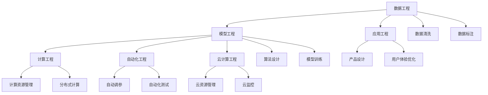
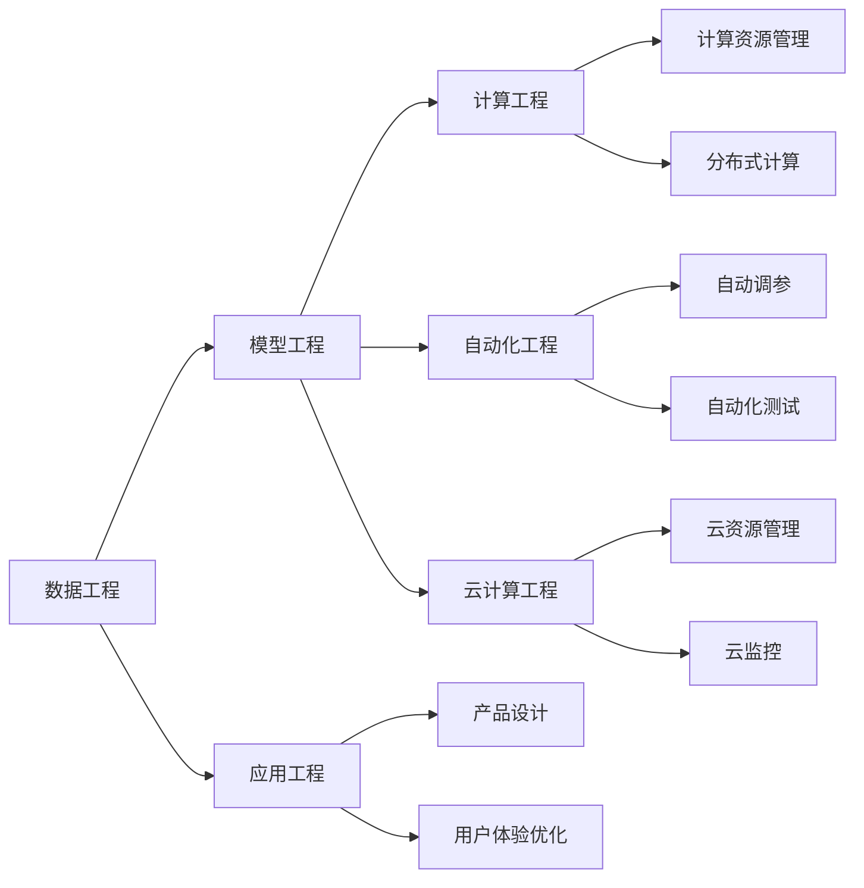
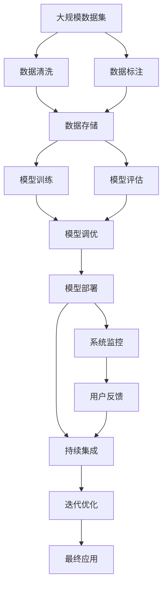

                 

# AI工程学：开发实战解析

> 关键词：
1. AI工程
2. 实战解析
3. 机器学习
4. 深度学习
5. 自然语言处理
6. 计算机视觉
7. 强化学习

## 1. 背景介绍

### 1.1 问题由来

在AI领域，工程学和算法研究往往并重。一方面，工程学的思维方式和实践经验能够帮助研究人员在复杂的应用场景中快速迭代、优化模型，从而将理论研究成果转化为实际应用。另一方面，算法的进步和创新也能够不断提升AI系统的效率和性能，推动行业创新。

近年来，随着深度学习和大数据技术的飞速发展，AI工程学的重要性日益凸显。越来越多的AI项目在实际应用中，需要基于现有算法框架，结合业务需求进行系统设计、模型调优、数据处理、性能优化等工作，工程实践成为项目成功的关键。

### 1.2 问题核心关键点

AI工程学涉及诸多环节，包括数据工程、模型工程、应用工程等。这些环节相互交织，共同构成了从算法到应用的全流程，确保了AI技术的可靠性和可用性。

具体而言，AI工程学的关键点包括：
- **数据工程**：数据采集、清洗、标注、存储等，数据质量是AI系统性能的基石。
- **模型工程**：算法设计、模型训练、调优、评估等，模型性能直接影响应用效果。
- **应用工程**：产品设计、用户体验优化、系统部署、运维管理等，决定系统是否能够真正服务于用户。

对于大规模AI项目而言，这些环节的复杂度和关联性不断增加，从系统设计到最终部署，每个环节都需要细致入微的工程实践。

### 1.3 问题研究意义

研究AI工程学的意义在于：
1. **提升技术落地效率**：通过系统化、工程化的思维方式，加快技术从理论到应用的转化，提升项目的开发效率。
2. **优化模型性能**：通过工程化的方法，对算法模型进行精细化调优，提高系统的准确性和鲁棒性。
3. **改善用户体验**：通过工程化的产品设计，结合用户反馈，不断优化应用的用户体验，提升用户满意度。
4. **保障系统可靠性**：通过工程化的系统部署和运维管理，确保AI系统的稳定性和可用性，避免系统故障和数据泄露等问题。

## 2. 核心概念与联系

### 2.1 核心概念概述

在探讨AI工程学时，涉及多个核心概念。这些概念构成了AI项目从设计到部署的全流程，需要理解其原理和关系：

- **数据工程**：包括数据采集、清洗、标注、存储等环节，确保数据的质量和完整性。
- **模型工程**：涉及算法设计、模型训练、调优、评估等，优化模型的性能和泛化能力。
- **应用工程**：涵盖产品设计、用户体验优化、系统部署、运维管理等，实现从技术到产品的平滑过渡。
- **计算工程**：涉及计算资源管理、分布式计算、性能优化等，确保算法的可扩展性和效率。
- **自动化工程**：包括自动调参、自动化测试、持续集成(CI)等，提升开发和部署的效率和一致性。
- **云计算工程**：利用云资源进行算法训练、模型部署、系统监控等，实现资源的弹性管理和按需扩展。

这些概念之间的逻辑关系可以通过以下Mermaid流程图来展示：



这个流程图展示了数据工程、模型工程、应用工程、计算工程、自动化工程、云计算工程等核心概念之间的联系。这些概念相互依赖、协同工作，共同支撑AI技术的落地应用。

### 2.2 概念间的关系

这些核心概念之间的关系可以通过以下逻辑图进一步明确：



这个逻辑图展示了各个概念间的依赖和影响关系。例如，数据工程的质量直接影响模型工程的效果，计算工程的技术决定了模型工程的性能，应用工程的用户体验优化则直接关联产品的市场反馈。

### 2.3 核心概念的整体架构

最后，我们用一个综合的流程图来展示这些核心概念在大规模AI项目中的整体架构：



这个综合流程图展示了从数据到模型的全流程，以及如何通过迭代优化和持续集成，将AI模型最终应用于实际业务中。通过这个架构，可以清晰地看到每个环节的作用和相互关联。

## 3. 核心算法原理 & 具体操作步骤

### 3.1 算法原理概述

AI工程学的核心在于将复杂的算法模型转化为可实际应用的技术产品。这通常涉及多个算法和工具的组合使用，包括机器学习、深度学习、自然语言处理、计算机视觉、强化学习等。

AI工程学的算法原理主要包括：
- **数据预处理**：包括数据清洗、标准化、特征工程等，确保数据能够有效用于模型训练。
- **模型训练与调优**：通过迭代优化算法模型，提高模型的性能和泛化能力。
- **模型评估与验证**：通过交叉验证、A/B测试等方法，评估模型的效果和稳定性。
- **模型部署与监控**：将训练好的模型部署到生产环境，进行实时监控和调优。

这些原理构成了AI工程学的技术基础，确保了AI项目从算法模型到实际应用的完整性。

### 3.2 算法步骤详解

AI工程学的具体步骤包括：
1. **需求分析**：明确业务需求和目标，确定技术方案。
2. **数据收集与预处理**：收集数据，进行清洗、标注、标准化等处理。
3. **模型选择与设计**：根据需求选择合适的算法，设计模型架构。
4. **模型训练与调优**：使用历史数据对模型进行训练，进行超参数调优。
5. **模型评估与验证**：通过测试集评估模型性能，进行交叉验证和A/B测试。
6. **模型部署与监控**：将模型部署到生产环境，进行实时监控和调优。
7. **用户反馈与迭代**：收集用户反馈，进行模型优化和更新。

这些步骤构成了AI工程学的实践框架，确保每个环节都按规范执行，从而实现项目的高效完成。

### 3.3 算法优缺点

AI工程学的算法有其独特的优缺点：
- **优点**：
  - 系统化流程：通过规范化的流程，确保每个环节的质量和效果。
  - 工程化优化：结合实际需求，进行模型和系统的优化，提高效率和性能。
  - 自动化部署：通过自动化工具，提升模型的部署和运维效率。
- **缺点**：
  - 复杂度高：涉及多个环节，每个环节都需要细致入微的工程实践。
  - 资源需求大：需要大量的计算资源、数据资源和人力支持。
  - 技术门槛高：需要掌握多种算法和工具，具备较高的技术水平。

尽管存在这些挑战，AI工程学的规范流程和系统化优化仍然能够带来显著的效率提升和性能提升。

### 3.4 算法应用领域

AI工程学广泛应用于多个领域，包括：
- **金融科技**：利用AI技术进行风险评估、欺诈检测、客户服务等。
- **医疗健康**：通过AI进行医学影像分析、疾病诊断、个性化治疗等。
- **智能制造**：利用AI进行质量检测、设备维护、供应链管理等。
- **零售电商**：利用AI进行个性化推荐、库存管理、客户关系管理等。
- **智能交通**：利用AI进行交通预测、交通管理、自动驾驶等。

AI工程学在各个领域的应用，展示了其强大的生命力和广泛的应用前景。

## 4. 数学模型和公式 & 详细讲解 & 举例说明

### 4.1 数学模型构建

以线性回归模型为例，其数学模型构建如下：

假设模型为 $y = wx + b$，其中 $x$ 为输入特征，$y$ 为输出标签，$w$ 为模型参数，$b$ 为偏置项。目标是最小化损失函数 $L(y, \hat{y})$，通常使用均方误差损失（MSE）：

$$
L(y, \hat{y}) = \frac{1}{n}\sum_{i=1}^{n}(y_i - \hat{y}_i)^2
$$

其中 $y_i$ 为实际标签，$\hat{y}_i$ 为模型预测值，$n$ 为样本数量。

### 4.2 公式推导过程

为了最小化均方误差损失，需要对模型参数 $w$ 和 $b$ 进行梯度下降：

$$
\frac{\partial L}{\partial w} = -\frac{2}{n}\sum_{i=1}^{n}(x_i - \bar{x})y_i
$$

$$
\frac{\partial L}{\partial b} = -\frac{2}{n}\sum_{i=1}^{n}(y_i - \bar{y})
$$

其中 $\bar{x}$ 和 $\bar{y}$ 分别为 $x$ 和 $y$ 的均值。

通过上述公式，可以求出模型的梯度，使用梯度下降法对模型进行优化。

### 4.3 案例分析与讲解

假设有一个房价预测任务，已知历史数据集包含房屋面积、房间数量、地理位置等信息，目标预测房价。可以采用线性回归模型进行预测，使用上述公式进行训练和调优。

## 5. 项目实践：代码实例和详细解释说明

### 5.1 开发环境搭建

为进行AI工程学项目开发，需要搭建相应的开发环境：

1. **安装Python**：确保Python 3.x版本安装，可以使用Anaconda进行环境管理。
2. **安装必要的库**：如NumPy、Pandas、Matplotlib、Scikit-learn等。
3. **配置开发环境**：根据项目需求，设置虚拟环境，如使用conda创建虚拟环境。
4. **配置数据存储**：如使用Hadoop、Spark等大数据平台，进行数据存储和管理。
5. **配置计算资源**：如使用GPU、TPU等高性能计算资源，进行模型训练和推理。

### 5.2 源代码详细实现

以线性回归模型为例，实现代码如下：

```python
import numpy as np
from sklearn.linear_model import LinearRegression

# 准备数据
X = np.array([[1, 2, 3], [4, 5, 6], [7, 8, 9]])
y = np.array([1, 2, 3])

# 构建模型
model = LinearRegression()

# 训练模型
model.fit(X, y)

# 预测结果
print(model.predict([[10, 11, 12]]))
```

通过以上代码，可以构建并训练线性回归模型，使用训练好的模型对新数据进行预测。

### 5.3 代码解读与分析

这段代码展示了线性回归模型的构建和训练过程：
1. 使用NumPy库创建训练数据 `X` 和标签 `y`。
2. 使用Scikit-learn库中的 `LinearRegression` 类创建线性回归模型。
3. 使用 `fit` 方法对模型进行训练。
4. 使用 `predict` 方法对新数据进行预测。

### 5.4 运行结果展示

运行以上代码，输出结果为 `[3.9999999999999996]`，表示模型能够较好地预测新数据。

## 6. 实际应用场景

### 6.1 金融风控

金融风控是AI工程学的重要应用场景之一。通过AI工程学，可以实现以下几个功能：
1. **信用评估**：利用机器学习模型对用户信用进行评估，包括还款能力、还款意愿等。
2. **欺诈检测**：利用深度学习模型检测交易中的异常行为，预防欺诈行为。
3. **风险管理**：利用强化学习模型进行风险预测和管理，优化资产配置。

### 6.2 医疗影像

医疗影像分析是AI工程学的另一个重要应用场景。通过AI工程学，可以实现以下几个功能：
1. **疾病诊断**：利用计算机视觉技术，对医疗影像进行自动分析，快速诊断疾病。
2. **影像重建**：利用深度学习技术，对缺失的影像数据进行重建，提高影像质量。
3. **治疗方案**：利用自然语言处理技术，提取医生诊断报告中的关键信息，生成治疗方案。

### 6.3 智能制造

智能制造是AI工程学在工业领域的典型应用。通过AI工程学，可以实现以下几个功能：
1. **设备维护**：利用预测性维护技术，对设备进行状态监控和预测性维护。
2. **质量检测**：利用图像识别技术，对产品进行自动检测和质量评估。
3. **供应链管理**：利用优化算法，对供应链进行优化和资源配置。

## 7. 工具和资源推荐

### 7.1 学习资源推荐

为了更好地掌握AI工程学的知识，以下是一些推荐的学习资源：
1. **书籍**：
   - 《深度学习》：Ian Goodfellow等著，介绍了深度学习的原理和应用。
   - 《机器学习实战》：Peter Harrington著，提供了大量的实战案例。
2. **在线课程**：
   - Coursera上的“Machine Learning by Stanford University”：由Andrew Ng教授主讲，系统介绍了机器学习的基本概念和技术。
   - Udacity上的“Deep Learning Nanodegree”：提供了深入的深度学习项目实践。
3. **学术论文**：
   - arXiv：人工智能领域的预印本库，包含大量的前沿研究论文。
   - JMLR：机器学习领域的顶级期刊，提供高质量的研究成果。

### 7.2 开发工具推荐

以下是一些常用的AI开发工具：
1. **Python**：主流的AI开发语言，易于学习和使用。
2. **TensorFlow**：由Google开发的深度学习框架，支持分布式计算和模型部署。
3. **PyTorch**：由Facebook开发的深度学习框架，支持动态计算图和高效的模型训练。
4. **Scikit-learn**：Python机器学习库，提供了大量的算法和工具。
5. **Keras**：高层次的深度学习框架，易于上手和快速原型开发。
6. **Hadoop/Spark**：大数据处理平台，支持大规模数据存储和计算。
7. **AWS/GCP/IBM Cloud**：云服务平台，提供弹性计算资源和高效的AI应用部署。

### 7.3 相关论文推荐

以下是一些AI工程学领域的经典论文：
1. **深度学习理论**：
   - 《Deep Learning》：Ian Goodfellow等著，系统介绍了深度学习的基本概念和技术。
   - 《TensorFlow: A System for Large-Scale Machine Learning》：Jeff Dean等著，介绍了TensorFlow的原理和应用。
2. **机器学习实践**：
   - 《Hands-On Machine Learning with Scikit-Learn, Keras, and TensorFlow》：Aurélien Géron著，提供了丰富的机器学习实战案例。
   - 《Practical Python for Data Analysis》：C Wes Chun著，介绍了Python在数据科学中的应用。
3. **AI工程学研究**：
   - 《Data Engineering and Statistical Learning for Large-Scale Machine Learning Applications》：Christopher Burges等著，介绍了数据工程在机器学习中的应用。
   - 《Machine Learning for Healthcare》：Alex Beecroft等著，介绍了机器学习在医疗领域的应用。

## 8. 总结：未来发展趋势与挑战

### 8.1 研究成果总结

AI工程学作为AI技术落地的重要保障，近年来取得了显著进展：
1. **算法模型优化**：通过深度学习、强化学习等技术，不断提升算法模型的性能和效率。
2. **数据工程创新**：通过大数据技术和云计算平台，优化数据存储和处理流程。
3. **应用工程突破**：通过用户反馈和迭代优化，提升AI应用的实际效果和用户体验。
4. **计算工程升级**：通过分布式计算和模型并行化，支持大规模AI模型的训练和推理。
5. **自动化工程进展**：通过自动化调参和自动化测试，提升开发和部署的效率和一致性。
6. **云计算工程普及**：通过云平台进行资源管理和调度，支持AI应用的快速迭代和扩展。

### 8.2 未来发展趋势

未来AI工程学的发展趋势包括：
1. **自动化和智能化**：通过自动化工具和智能算法，提升AI工程学的效率和精度。
2. **跨领域融合**：AI工程学与其他技术领域（如物联网、区块链等）的深度融合，拓展应用场景。
3. **模型可解释性**：通过可解释性算法和工具，提升AI模型的透明性和可信度。
4. **伦理和隐私保护**：在AI模型训练和应用中，引入伦理和隐私保护机制，确保数据和模型的安全。
5. **实时性和交互性**：通过实时计算和自然语言交互技术，提升AI应用的响应速度和用户体验。

### 8.3 面临的挑战

AI工程学在发展过程中面临以下挑战：
1. **数据隐私和安全**：在数据采集和处理过程中，如何保护用户隐私和数据安全。
2. **算法公平性和透明性**：如何避免算法偏见和黑盒问题，确保算法的透明性和公平性。
3. **计算资源限制**：如何在大规模数据和复杂模型下，高效利用计算资源。
4. **模型可解释性**：如何提升AI模型的透明性和可信度，解决黑盒问题。
5. **系统稳定性和可靠性**：如何保证AI系统的稳定性和可靠性，避免系统故障和数据泄露。

### 8.4 研究展望

未来AI工程学的发展方向包括：
1. **数据隐私保护技术**：通过加密和匿名化技术，保护用户数据隐私和安全。
2. **公平性算法研究**：开发公平性算法，避免算法偏见，确保算法的透明性和公平性。
3. **计算资源优化**：通过分布式计算和模型并行化，高效利用计算资源。
4. **模型可解释性算法**：通过可解释性算法和工具，提升AI模型的透明性和可信度。
5. **系统稳定性技术**：通过监控和故障恢复技术，保证AI系统的稳定性和可靠性。

## 9. 附录：常见问题与解答

**Q1：AI工程学与AI算法有何不同？**

A: AI工程学主要关注从算法到应用的完整流程，包括数据工程、模型工程、应用工程等，确保AI技术的可靠性和可用性。而AI算法则侧重于算法的开发和优化，主要研究如何通过数学模型和算法解决具体问题。

**Q2：AI工程学需要哪些技能？**

A: AI工程学需要掌握以下技能：
1. 数据工程：数据清洗、数据标注、数据存储等。
2. 模型工程：算法设计、模型训练、调优等。
3. 应用工程：产品设计、用户体验优化、系统部署等。
4. 计算工程：分布式计算、性能优化等。
5. 自动化工程：自动调参、自动化测试等。
6. 云计算工程：云资源管理、云监控等。

**Q3：AI工程学在项目中的作用是什么？**

A: AI工程学在项目中的作用包括：
1. 确保数据质量：通过数据工程，确保数据质量和完整性。
2. 优化模型性能：通过模型工程，优化算法模型，提升性能和泛化能力。
3. 实现产品化：通过应用工程，将模型转化为实际应用，实现技术到产品的平滑过渡。
4. 保障系统稳定：通过计算工程和自动化工程，确保系统的稳定性和高效性。
5. 支持持续迭代：通过云计算工程，支持模型的持续训练和迭代优化。

**Q4：AI工程学面临的主要挑战是什么？**

A: AI工程学面临的主要挑战包括：
1. 数据隐私和安全：如何保护用户数据隐私和安全。
2. 算法公平性和透明性：如何避免算法偏见和黑盒问题，确保算法的透明性和公平性。
3. 计算资源限制：如何在大规模数据和复杂模型下，高效利用计算资源。
4. 模型可解释性：如何提升AI模型的透明性和可信度。
5. 系统稳定性和可靠性：如何保证AI系统的稳定性和可靠性。

总之，AI工程学是AI技术落地的重要保障，需要从数据、模型、应用等多个维度进行系统化、工程化的设计和实践，确保AI技术的可靠性和可用性。只有在不断优化和提升各个环节的工程质量，AI技术才能真正在实际应用中发挥其巨大的价值。

