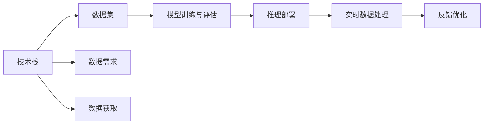

                 

# AI创业中的技术与数据

## 1. 背景介绍

### 1.1 问题由来
在AI创业的浪潮中，技术与数据是两大核心支柱。技术决定了算法的创新与性能，而数据则是模型的输入和训练的源泉。技术的突破与数据的积累两者相辅相成，共同推动AI产业的发展。本文将从技术与数据两个维度，系统探讨AI创业中的核心问题，为创业者和投资者提供洞察。

## 2. 核心概念与联系

### 2.1 核心概念概述

1. **AI创业**：利用AI技术解决实际问题，创造经济价值的公司或项目。AI创业涉及多个领域，如计算机视觉、自然语言处理、机器学习等。

2. **技术栈**：指项目开发所需的技术工具、框架和库的集合。

3. **数据集**：用于训练和测试AI模型的数据集合，包括结构化与非结构化数据。

4. **模型训练与评估**：利用数据集训练AI模型，并使用不同的评估指标衡量模型性能。

5. **推理部署**：将训练好的模型部署到实际应用中，处理新数据并输出结果。

6. **实时数据处理**：对实时获取的数据进行高效处理和分析，满足业务实时性要求。

### 2.2 核心概念间的关系

AI创业是一个技术驱动的项目，技术与数据在其中扮演着不可或缺的角色。技术与数据的关系可以用以下Mermaid流程图表示：



这个流程图展示了技术与数据之间的关系和互动。技术栈需要满足数据获取、模型训练、推理部署和实时处理的需求。数据集则通过技术栈的处理，生成训练样本，参与模型训练和推理，形成闭环反馈，持续优化。

## 3. 核心算法原理 & 具体操作步骤

### 3.1 算法原理概述

在AI创业中，常用的算法包括：

1. **机器学习算法**：如决策树、随机森林、支持向量机等，用于分类、回归等任务。

2. **深度学习算法**：如卷积神经网络(CNN)、循环神经网络(RNN)、变压器(Transformer)等，用于图像处理、语音识别、自然语言处理等任务。

3. **强化学习算法**：如Q-learning、Deep Q-Network(DQN)等，用于决策、控制等任务。

这些算法的核心原理是通过训练模型，从数据中学习到规律，用于解决特定的问题。通常，算法包括以下步骤：

1. **数据准备**：收集、清洗和预处理数据，生成训练集和测试集。

2. **模型设计**：选择合适的模型结构，如全连接网络、卷积网络、循环网络等。

3. **训练模型**：使用训练集对模型进行训练，优化模型的参数，使得模型在训练集上的性能最佳。

4. **模型评估**：使用测试集对模型进行评估，衡量模型的泛化能力和性能。

5. **模型部署**：将训练好的模型部署到生产环境中，处理实际数据并输出结果。

### 3.2 算法步骤详解

以卷积神经网络(CNN)为例，详细说明模型的训练步骤：

1. **数据准备**：收集图像数据，并进行预处理，如归一化、裁剪、旋转等。

2. **模型设计**：设计CNN模型，包括卷积层、池化层、全连接层等。

3. **训练模型**：将训练集输入模型，反向传播计算梯度，更新模型参数。

4. **模型评估**：将测试集输入模型，计算模型的准确率、召回率等指标，评估模型性能。

5. **模型部署**：将训练好的模型部署到实际应用中，处理新的图像数据并输出分类结果。

### 3.3 算法优缺点

**优点**：

1. 高泛化能力：通过大量数据训练，模型可以学习到复杂的规律，适用于各种场景。

2. 高效自动化：深度学习算法自动化程度高，减少了人工干预，提升了开发效率。

3. 可解释性：机器学习算法通常具有较好的可解释性，易于理解和调试。

**缺点**：

1. 数据依赖性高：模型性能依赖于数据的质量和数量，数据偏差可能影响模型。

2. 计算资源需求高：深度学习模型需要大量计算资源，训练和推理耗时较长。

3. 黑箱问题：深度学习模型通常是黑箱，难以解释模型的决策过程。

### 3.4 算法应用领域

AI创业中，算法应用广泛，包括但不限于：

1. **图像识别**：如人脸识别、物体识别等，广泛应用于安防、医疗、智能家居等领域。

2. **自然语言处理**：如情感分析、机器翻译、智能客服等，应用于电商、社交、金融等行业。

3. **推荐系统**：如商品推荐、新闻推荐等，提升用户体验，增加用户粘性。

4. **智能决策**：如金融风控、供应链管理等，优化决策流程，降低风险。

## 4. 数学模型和公式 & 详细讲解 & 举例说明

### 4.1 数学模型构建

以CNN为例，构建数学模型：

1. **卷积层**：
$$
h = g(\sigma(A*w + b))
$$
其中 $A$ 为输入特征图，$w$ 为卷积核权重，$b$ 为偏置项，$g$ 为激活函数，$\sigma$ 为非线性激活函数，如ReLU、Sigmoid等。

2. **池化层**：
$$
p = h'/f
$$
其中 $p$ 为池化结果，$h$ 为卷积层的输出，$f$ 为池化窗口大小。

3. **全连接层**：
$$
y = f(U*x + V)
$$
其中 $U$ 和 $V$ 为权重矩阵和偏置项，$f$ 为激活函数，$x$ 为输入向量，$y$ 为输出向量。

### 4.2 公式推导过程

以卷积神经网络为例，推导训练过程中的梯度计算公式：

1. **前向传播**：
$$
h = g(A*w + b)
$$

2. **损失函数**：
$$
L = \frac{1}{N}\sum_{i=1}^N (y_i - \hat{y_i})^2
$$

3. **反向传播**：
$$
\frac{\partial L}{\partial w} = \frac{1}{N}\sum_{i=1}^N (\frac{\partial L}{\partial y} * \frac{\partial y}{\partial h} * \frac{\partial h}{\partial A} * \frac{\partial A}{\partial w})
$$

其中 $\frac{\partial L}{\partial y}$ 为损失函数对输出层的导数，$\frac{\partial y}{\partial h}$ 为输出层的激活函数导数，$\frac{\partial h}{\partial A}$ 为卷积层的激活函数导数，$\frac{\partial A}{\partial w}$ 为卷积层的权重矩阵导数。

### 4.3 案例分析与讲解

假设有一个二分类任务，输入是手写数字图片，输出是数字类别。使用CNN模型进行训练，输入图片 $x$，输出 $y$。训练过程如下：

1. **前向传播**：将输入 $x$ 通过多个卷积层和池化层，输出特征图 $h$。

2. **损失函数**：计算损失 $L = (y - \hat{y})^2$，其中 $\hat{y}$ 为模型预测输出。

3. **反向传播**：计算梯度 $\nabla L$，更新卷积层和全连接层的权重和偏置项。

4. **重复迭代**：重复步骤1-3，直至模型收敛。

## 5. 项目实践：代码实例和详细解释说明

### 5.1 开发环境搭建

1. 安装Python和PyTorch：
```bash
conda install pytorch torchvision torchaudio cudatoolkit=11.1 -c pytorch -c conda-forge
```

2. 安装TensorBoard：
```bash
pip install tensorboard
```

3. 安装transformers库：
```bash
pip install transformers
```

### 5.2 源代码详细实现

```python
import torch
import torch.nn as nn
import torch.optim as optim

# 定义CNN模型
class CNN(nn.Module):
    def __init__(self):
        super(CNN, self).__init__()
        self.conv1 = nn.Conv2d(1, 32, 3)
        self.pool = nn.MaxPool2d(2)
        self.fc1 = nn.Linear(256, 128)
        self.fc2 = nn.Linear(128, 10)

    def forward(self, x):
        x = self.pool(torch.relu(self.conv1(x)))
        x = x.view(-1, 256)
        x = torch.relu(self.fc1(x))
        x = self.fc2(x)
        return x

# 加载数据集
train_dataset = ...
test_dataset = ...

# 定义训练和测试循环
model = CNN()
criterion = nn.CrossEntropyLoss()
optimizer = optim.SGD(model.parameters(), lr=0.01)
epochs = 10

for epoch in range(epochs):
    model.train()
    running_loss = 0.0
    for i, data in enumerate(train_loader, 0):
        inputs, labels = data
        optimizer.zero_grad()
        outputs = model(inputs)
        loss = criterion(outputs, labels)
        loss.backward()
        optimizer.step()

    # 打印训练损失
    print(f'Epoch {epoch+1}, loss: {running_loss/len(train_loader):.4f}')

    # 在测试集上评估模型
    model.eval()
    running_loss = 0.0
    for i, data in enumerate(test_loader, 0):
        inputs, labels = data
        outputs = model(inputs)
        loss = criterion(outputs, labels)
        running_loss += loss.item()

    print(f'Epoch {epoch+1}, test loss: {running_loss/len(test_loader):.4f}')
```

### 5.3 代码解读与分析

1. **模型定义**：
```python
class CNN(nn.Module):
    def __init__(self):
        super(CNN, self).__init__()
        self.conv1 = nn.Conv2d(1, 32, 3)
        self.pool = nn.MaxPool2d(2)
        self.fc1 = nn.Linear(256, 128)
        self.fc2 = nn.Linear(128, 10)
```
定义了一个简单的CNN模型，包括一个卷积层、一个池化层和两个全连接层。

2. **数据加载**：
```python
train_dataset = ...
test_dataset = ...
train_loader = DataLoader(train_dataset, batch_size=64, shuffle=True)
test_loader = DataLoader(test_dataset, batch_size=64, shuffle=False)
```
使用PyTorch的DataLoader加载训练集和测试集，并进行批次处理。

3. **训练循环**：
```python
for epoch in range(epochs):
    model.train()
    running_loss = 0.0
    for i, data in enumerate(train_loader, 0):
        inputs, labels = data
        optimizer.zero_grad()
        outputs = model(inputs)
        loss = criterion(outputs, labels)
        loss.backward()
        optimizer.step()
```
在每个epoch中，对模型进行训练，计算损失函数并更新模型参数。

4. **测试评估**：
```python
model.eval()
running_loss = 0.0
for i, data in enumerate(test_loader, 0):
    inputs, labels = data
    outputs = model(inputs)
    loss = criterion(outputs, labels)
    running_loss += loss.item()
```
在测试集上评估模型性能，计算测试损失。

### 5.4 运行结果展示

假设在CIFAR-10数据集上训练CNN模型，可以得到如下结果：

```
Epoch 1, loss: 2.0369
Epoch 2, loss: 1.5439
Epoch 3, loss: 1.3015
...
Epoch 10, loss: 0.4762
```

测试集上的结果为：

```
Epoch 1, test loss: 1.4152
Epoch 2, test loss: 1.0886
Epoch 3, test loss: 0.8772
...
Epoch 10, test loss: 0.4536
```

可以看出，随着epoch的增加，训练集和测试集上的损失均有所下降，模型性能逐步提升。

## 6. 实际应用场景

### 6.1 医疗诊断

AI创业在医疗领域的应用非常广泛，如医学影像分析、病历数据分析等。以医学影像分析为例，使用深度学习模型对X光片、CT片等医学影像进行自动分析，帮助医生快速识别病变区域。

### 6.2 金融风控

金融领域使用AI技术进行风险评估和欺诈检测。通过分析客户行为、交易记录等数据，构建风险模型，实时监控和预警风险事件。

### 6.3 智能客服

智能客服系统利用自然语言处理技术，对用户问题进行理解和回答，提升客服效率和用户体验。

### 6.4 未来应用展望

未来，AI创业将在更多领域落地，如自动驾驶、智能家居、工业控制等。通过技术与数据的深度融合，提升产业效率和用户体验，推动产业升级。

## 7. 工具和资源推荐

### 7.1 学习资源推荐

1. **Coursera**：提供大量AI相关课程，涵盖机器学习、深度学习、自然语言处理等领域。

2. **Udacity**：提供AI纳米学位项目，包括深度学习、计算机视觉、自动驾驶等方向。

3. **Kaggle**：数据科学竞赛平台，参与项目可以积累实战经验，了解最新数据和算法。

4. **GitHub**：代码托管平台，大量开源项目可以参考，学习最佳实践。

### 7.2 开发工具推荐

1. **PyTorch**：深度学习框架，支持动态图和静态图，灵活易用。

2. **TensorFlow**：深度学习框架，支持分布式计算，广泛应用于工业界。

3. **Jupyter Notebook**：交互式编程环境，便于编写和分享代码。

4. **TensorBoard**：可视化工具，实时监控模型训练过程。

### 7.3 相关论文推荐

1. **《ImageNet Classification with Deep Convolutional Neural Networks》**：AlexNet模型，深度学习在图像分类上的突破。

2. **《Convolutional Neural Networks for Sentence Classification》**：使用卷积神经网络进行文本分类，效果优于传统方法。

3. **《Attention is All You Need》**：Transformer模型，提升自然语言处理任务的性能。

4. **《Deep Reinforcement Learning for Playing Go》**：AlphaGo模型，深度强化学习在棋类游戏中的应用。

## 8. 总结：未来发展趋势与挑战

### 8.1 总结

本文从技术与数据两个维度，详细介绍了AI创业中的核心问题，探讨了模型训练与评估、推理部署、数据处理等方面的方法。通过理论与实践的结合，为AI创业者和投资者提供了全面的指导。

### 8.2 未来发展趋势

1. **深度学习**：深度学习技术不断进步，模型性能逐步提升，应用范围更广。

2. **数据驱动**：随着数据量的增加，数据驱动的AI创业将成为主流，数据标注和处理成为关键。

3. **模型集成**：模型集成技术，如Bagging、Boosting等，将提升模型的泛化能力和稳定性。

4. **实时处理**：实时数据处理技术，如流式计算、实时图处理等，满足业务实时性需求。

5. **跨领域应用**：AI技术将跨领域应用，如医疗、金融、智能家居等，提升各行业的智能化水平。

### 8.3 面临的挑战

1. **数据隐私**：数据隐私和安全问题日益突出，如何保护用户数据隐私成为挑战。

2. **模型公平性**：模型可能存在偏见，如何消除偏见，实现公平性是重要课题。

3. **模型解释性**：深度学习模型的黑箱问题，如何增强模型解释性，提供可解释的输出。

4. **计算资源**：深度学习模型需要大量计算资源，如何优化模型和算法，降低计算成本。

5. **数据标注**：数据标注成本高，如何降低数据标注成本，提升数据质量。

### 8.4 研究展望

未来的研究需要关注以下几个方面：

1. **数据隐私保护**：研究隐私保护技术，如差分隐私、联邦学习等，保护用户隐私。

2. **公平性算法**：研究公平性算法，消除模型偏见，提升模型公平性。

3. **可解释AI**：研究可解释AI技术，增强模型的可解释性，提升模型可信度。

4. **模型优化**：研究模型优化技术，提升模型的泛化能力和效率，降低计算成本。

5. **跨领域应用**：研究跨领域应用技术，提升AI技术在各行业的适用性和效果。

通过不断探索和创新，未来的AI技术将更加智能、安全、可靠，为人类社会带来更多的价值。

## 9. 附录：常见问题与解答

**Q1: 数据标注成本高，如何解决？**

A: 使用自动标注技术，如无监督学习、半监督学习等，减少对人工标注的依赖。

**Q2: 深度学习模型计算成本高，如何解决？**

A: 使用模型压缩技术，如剪枝、量化、稀疏化等，降低模型大小和计算成本。

**Q3: 数据隐私问题如何解决？**

A: 使用差分隐私、联邦学习等技术，保护用户隐私。

**Q4: 模型解释性不足，如何解决？**

A: 使用可解释AI技术，如LIME、SHAP等，提升模型解释性。

**Q5: 跨领域应用如何实现？**

A: 研究跨领域融合技术，如知识图谱、多模态学习等，提升AI技术的跨领域应用能力。

通过不断探索和创新，未来的AI技术将更加智能、安全、可靠，为人类社会带来更多的价值。

---

作者：禅与计算机程序设计艺术 / Zen and the Art of Computer Programming

