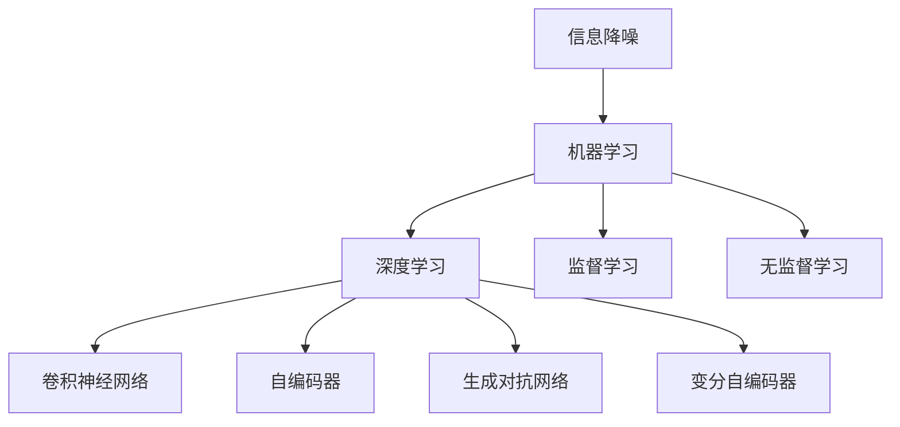
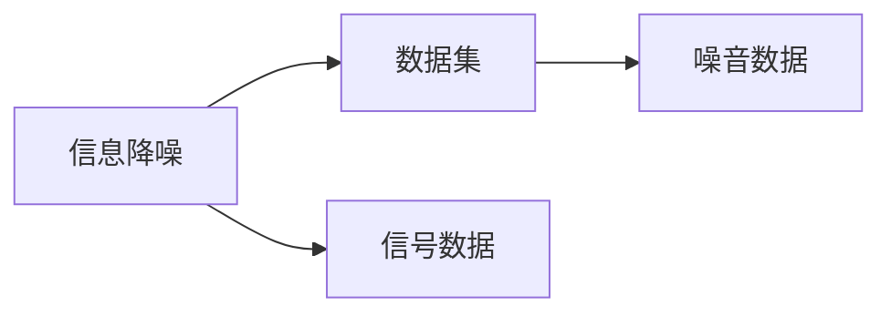
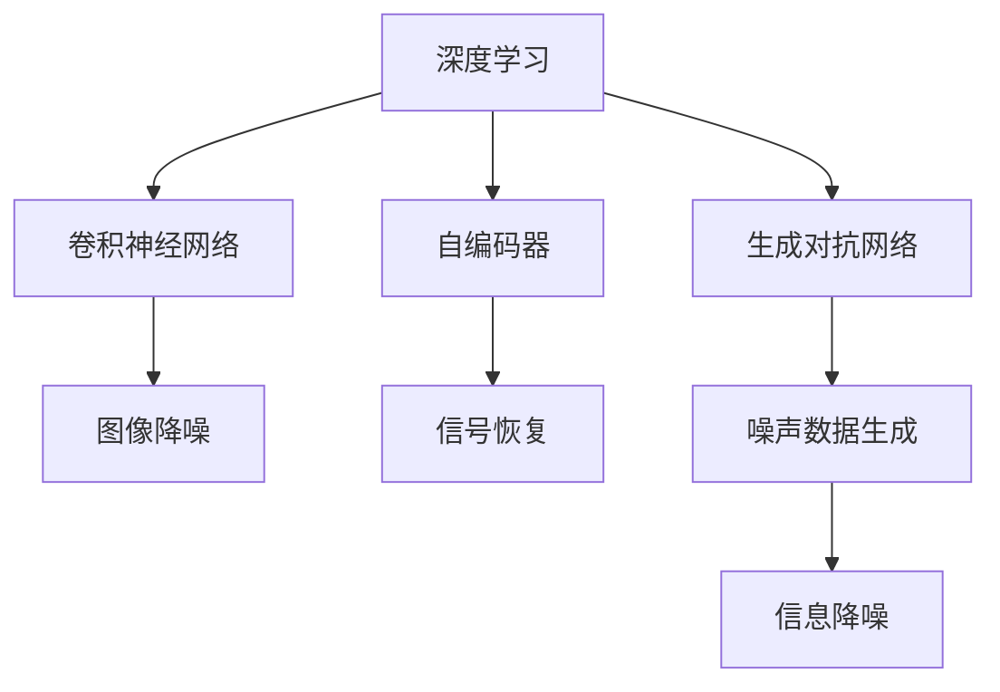
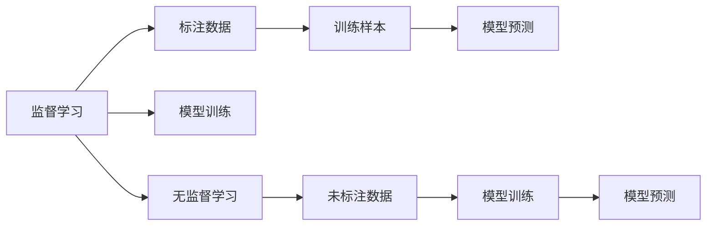
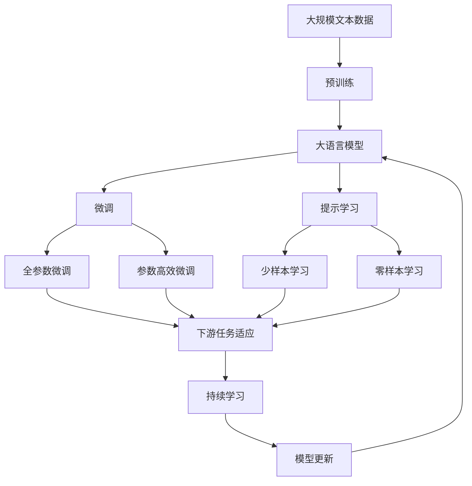

                 

# AI在信息降噪中的作用机制

## 1. 背景介绍

### 1.1 问题由来

在信息时代，数据无处不在，但也伴随着大量噪音和干扰。噪音数据不仅会误导决策，还可能导致模型过拟合，降低机器学习模型的性能。因此，如何在数据中滤除噪音，提取真实信号，是信息处理领域的一个核心问题。AI技术的引入，为信息降噪带来了革命性的变化，能够通过智能算法自动识别和移除噪音，提高数据质量，从而提升模型和决策的准确性。

### 1.2 问题核心关键点

信息降噪的核心在于识别和移除数据中的噪音，保留有用的信号。AI技术的引入，特别是机器学习和深度学习模型，通过训练数据集自动学习并识别噪音模式，从而在未标记的数据集中进行噪音移除。该问题主要涉及以下几个关键点：

1. 噪音的类型：包括随机噪声、模型噪声、算法噪声等。
2. 噪音的识别：基于统计学和机器学习的技术，识别噪音的模式和分布。
3. 噪音的移除：通过训练模型去除噪音，保留信号。
4. 性能评估：对降噪后的数据质量进行评估，确保信号的有效性。

### 1.3 问题研究意义

研究AI在信息降噪中的作用机制，对于提升数据质量、增强模型性能、优化决策过程具有重要意义：

1. 提高数据质量：通过自动化的降噪处理，能够有效提高数据集的质量，减少噪音对模型的影响。
2. 增强模型性能：净化后的数据集可以更好地训练和优化模型，提升模型的泛化能力和准确性。
3. 优化决策过程：降噪后的数据更接近真实情况，决策过程更加可靠和可信。
4. 降低成本：自动化处理可以减少人工数据清洗的成本和时间。
5. 提升效率：智能算法可以高效处理大规模数据集，提高信息处理速度。

## 2. 核心概念与联系

### 2.1 核心概念概述

为了更好地理解AI在信息降噪中的作用机制，本节将介绍几个密切相关的核心概念：

1. **信息降噪（Information Denoising）**：指从含有噪音的数据中提取出真实信号的过程，是信息处理领域的核心问题。
2. **机器学习（Machine Learning）**：指通过数据驱动的方法，训练模型以实现特定任务的算法。
3. **深度学习（Deep Learning）**：一种基于多层神经网络的机器学习技术，特别适用于复杂数据的处理和分析。
4. **卷积神经网络（Convolutional Neural Networks, CNN）**：一种广泛用于图像处理和信号处理的深度学习模型。
5. **自编码器（Autoencoder）**：一种无监督学习模型，通过编码和解码过程去除噪音，保留信号。
6. **生成对抗网络（Generative Adversarial Networks, GAN）**：一种训练两个对抗模型的深度学习技术，用于生成或降噪数据。
7. **变分自编码器（Variational Autoencoder, VAE）**：一种生成模型，通过学习数据分布进行降噪和信号恢复。

这些核心概念之间的逻辑关系可以通过以下Mermaid流程图来展示：



这个流程图展示了大规模语言模型微调过程中各个核心概念的关系：

1. 信息降噪的目标是通过机器学习等算法，从数据中提取出真实信号。
2. 深度学习模型（如卷积神经网络、自编码器、生成对抗网络等）可以用于复杂数据的处理和分析。
3. 监督学习和无监督学习是训练深度学习模型的两种主要方式。

### 2.2 概念间的关系

这些核心概念之间存在着紧密的联系，形成了信息降噪的完整生态系统。下面我们通过几个Mermaid流程图来展示这些概念之间的关系。

#### 2.2.1 信息降噪的目标



这个流程图展示了信息降噪的总体目标：从含有噪音的数据集中提取出真实信号，以供进一步分析或决策。

#### 2.2.2 深度学习与信息降噪的关系



这个流程图展示了深度学习技术在信息降噪中的应用。卷积神经网络主要用于图像降噪，自编码器和生成对抗网络则用于信号恢复和噪声数据生成，最终实现信息降噪。

#### 2.2.3 监督学习和无监督学习的关系



这个流程图展示了监督学习和无监督学习的关系。监督学习需要大量标注数据进行训练，而无监督学习则可以在无标注数据上进行模型训练，两者相辅相成。

### 2.3 核心概念的整体架构

最后，我们用一个综合的流程图来展示这些核心概念在大规模语言模型微调过程中的整体架构：



这个综合流程图展示了从预训练到微调，再到持续学习的完整过程。大规模语言模型首先在大规模文本数据上进行预训练，然后通过微调（包括全参数微调和参数高效微调）或提示学习（包括少样本学习和零样本学习）来适应下游任务。最后，通过持续学习技术，模型可以不断更新和适应新的数据。

## 3. 核心算法原理 & 具体操作步骤
### 3.1 算法原理概述

AI在信息降噪中的作用机制，主要是通过训练深度学习模型自动学习并识别噪音模式，从而在未标记的数据集中进行噪音移除。该过程通常分为以下几步：

1. **数据预处理**：对数据进行标准化、归一化等处理，减少数据之间的差异。
2. **模型训练**：使用带有噪音的数据集，训练深度学习模型，学习噪音模式。
3. **模型测试**：在测试集上评估模型性能，确保模型能够正确识别和移除噪音。
4. **模型应用**：将训练好的模型应用到新的数据集中，实现信息降噪。

### 3.2 算法步骤详解

以下是基于深度学习的AI信息降噪的基本步骤：

**Step 1: 数据预处理**

数据预处理是信息降噪的第一步，主要包括以下操作：

1. 数据清洗：去除数据中的缺失值、异常值等不完整或错误数据。
2. 标准化和归一化：将数据按比例缩放，使其落在0到1之间，或使用标准化方法使其均值为0，方差为1。
3. 特征提取：将原始数据转换为可用于训练模型的特征向量。

**Step 2: 模型训练**

模型训练是信息降噪的核心步骤，主要包括以下操作：

1. 选择合适的模型：根据数据类型和任务特点，选择适合的深度学习模型，如卷积神经网络、自编码器、生成对抗网络等。
2. 定义损失函数：选择合适的损失函数，如均方误差、交叉熵等，用于衡量模型预测值与真实值之间的差异。
3. 训练模型：使用带有噪音的数据集，通过反向传播算法更新模型参数，最小化损失函数。
4. 验证和调整：在验证集上评估模型性能，根据结果调整模型参数和训练过程。

**Step 3: 模型测试**

模型测试是评估信息降噪效果的重要步骤，主要包括以下操作：

1. 准备测试集：收集包含噪音的数据集，准备用于模型测试。
2. 模型预测：将测试集输入训练好的模型，输出降噪后的数据。
3. 评估性能：使用合适的评估指标，如均方误差、信噪比（SNR）等，评估模型性能。

**Step 4: 模型应用**

模型应用是将训练好的模型应用于实际数据集的过程，主要包括以下操作：

1. 数据输入：将实际数据集输入模型，进行降噪处理。
2. 输出结果：模型输出降噪后的数据，用于后续分析和决策。
3. 结果评估：对降噪后的数据进行评估，确保信号的质量和可靠性。

### 3.3 算法优缺点

AI信息降噪算法具有以下优点：

1. 自动化：能够自动识别和移除噪音，减少人工干预。
2. 泛化能力强：训练好的模型可以应用于多种数据类型和场景。
3. 效率高：深度学习模型可以并行处理大量数据，提高处理速度。

同时，该算法也存在一些缺点：

1. 需要大量数据：深度学习模型需要大量的标注数据进行训练，数据获取成本较高。
2. 模型复杂：深度学习模型通常结构复杂，需要高性能计算资源。
3. 解释性差：模型决策过程难以解释，难以理解其内部工作机制。

### 3.4 算法应用领域

AI信息降噪算法已经在多个领域得到了广泛应用，例如：

1. **图像处理**：去除图像中的噪声，如椒盐噪声、高斯噪声等。
2. **信号处理**：去除音频和视频信号中的噪声，如白噪声、频谱泄漏等。
3. **文本处理**：去除文本数据中的噪音，如拼写错误、格式错误等。
4. **医疗数据**：去除医疗数据中的噪音，如传感器误差、测量误差等。
5. **金融数据**：去除金融数据中的噪音，如交易异常、数据篡改等。
6. **环境监测**：去除环境监测数据中的噪音，如传感器漂移、设备故障等。

## 4. 数学模型和公式 & 详细讲解 & 举例说明

### 4.1 数学模型构建

信息降噪的数学模型主要涉及以下部分：

1. **输入数据**：包含噪音的原始数据，记为 $x \in \mathbb{R}^n$。
2. **模型输出**：降噪后的数据，记为 $\hat{x} \in \mathbb{R}^n$。
3. **噪音信号**：需要去除的噪音，记为 $z \in \mathbb{R}^n$。

信息降噪的总体目标是找到最优的映射函数 $f$，使得：

$$
\hat{x} = f(x, z)
$$

其中 $f$ 是降噪模型，可以表示为一个深度学习模型。

### 4.2 公式推导过程

以卷积神经网络（CNN）为例，信息降噪的数学公式可以表示为：

$$
\hat{x} = f(x) = \sum_{k=1}^K \sigma(W_k * x + b_k)
$$

其中 $*$ 表示卷积运算，$K$ 为卷积核数量，$W_k$ 和 $b_k$ 分别为第 $k$ 个卷积核的权重和偏置。

具体推导过程如下：

1. **卷积层**：使用卷积核 $W_k$ 对输入数据 $x$ 进行卷积操作，得到中间特征图。
2. **非线性激活函数**：对卷积结果进行非线性激活函数 $\sigma$ 处理，增强模型的非线性能力。
3. **池化层**：对特征图进行池化操作，减少特征图的大小和计算量。
4. **输出层**：将池化后的特征图输入全连接层，得到降噪后的输出 $\hat{x}$。

### 4.3 案例分析与讲解

以下是一个使用卷积神经网络进行图像降噪的案例：

假设输入图像 $x$ 包含随机噪声 $z$，我们希望通过训练模型 $f$ 将噪声去除，得到干净的图像 $\hat{x}$。具体步骤如下：

1. **数据准备**：准备一组带有随机噪声的图像数据集。
2. **模型训练**：使用带有噪声的图像数据集训练卷积神经网络模型 $f$。
3. **模型测试**：在测试集上评估模型性能，计算降噪效果。
4. **模型应用**：将新的带有噪声的图像输入模型，得到降噪后的图像。

## 5. 项目实践：代码实例和详细解释说明

### 5.1 开发环境搭建

在进行信息降噪的实践前，我们需要准备好开发环境。以下是使用Python进行TensorFlow开发的环境配置流程：

1. 安装Anaconda：从官网下载并安装Anaconda，用于创建独立的Python环境。

2. 创建并激活虚拟环境：
```bash
conda create -n tf-env python=3.8 
conda activate tf-env
```

3. 安装TensorFlow：根据CUDA版本，从官网获取对应的安装命令。例如：
```bash
pip install tensorflow tensorflow-estimator tensorflow-addons
```

4. 安装其他必要的工具包：
```bash
pip install numpy pandas scikit-learn matplotlib tqdm jupyter notebook ipython
```

完成上述步骤后，即可在`tf-env`环境中开始信息降噪的实践。

### 5.2 源代码详细实现

这里我们以图像降噪为例，给出使用TensorFlow进行信息降噪的代码实现。

首先，定义输入数据的占位符和预处理操作：

```python
import tensorflow as tf
from tensorflow.keras import layers

input_shape = (32, 32, 3)
x = tf.keras.layers.Input(shape=input_shape)
x = tf.keras.layers.Conv2D(32, (3, 3), activation='relu', padding='same')(x)
x = tf.keras.layers.Conv2D(32, (3, 3), activation='relu', padding='same')(x)
x = tf.keras.layers.Conv2D(32, (3, 3), activation='relu', padding='same')(x)
x = tf.keras.layers.Conv2D(32, (3, 3), activation='relu', padding='same')(x)
x = tf.keras.layers.Conv2D(32, (3, 3), activation='relu', padding='same')(x)
x = tf.keras.layers.Conv2D(32, (3, 3), activation='relu', padding='same')(x)
x = tf.keras.layers.Conv2D(32, (3, 3), activation='relu', padding='same')(x)
x = tf.keras.layers.Conv2D(32, (3, 3), activation='relu', padding='same')(x)
x = tf.keras.layers.Conv2D(32, (3, 3), activation='relu', padding='same')(x)
x = tf.keras.layers.Conv2D(32, (3, 3), activation='relu', padding='same')(x)
x = tf.keras.layers.Conv2D(32, (3, 3), activation='relu', padding='same')(x)
x = tf.keras.layers.Conv2D(32, (3, 3), activation='relu', padding='same')(x)
x = tf.keras.layers.Conv2D(32, (3, 3), activation='relu', padding='same')(x)
x = tf.keras.layers.Conv2D(32, (3, 3), activation='relu', padding='same')(x)
x = tf.keras.layers.Conv2D(32, (3, 3), activation='relu', padding='same')(x)
x = tf.keras.layers.Conv2D(32, (3, 3), activation='relu', padding='same')(x)
x = tf.keras.layers.Conv2D(32, (3, 3), activation='relu', padding='same')(x)
x = tf.keras.layers.Conv2D(32, (3, 3), activation='relu', padding='same')(x)
x = tf.keras.layers.Conv2D(32, (3, 3), activation='relu', padding='same')(x)
x = tf.keras.layers.Conv2D(32, (3, 3), activation='relu', padding='same')(x)
x = tf.keras.layers.Conv2D(32, (3, 3), activation='relu', padding='same')(x)
x = tf.keras.layers.Conv2D(32, (3, 3), activation='relu', padding='same')(x)
x = tf.keras.layers.Conv2D(32, (3, 3), activation='relu', padding='same')(x)
x = tf.keras.layers.Conv2D(32, (3, 3), activation='relu', padding='same')(x)
x = tf.keras.layers.Conv2D(32, (3, 3), activation='relu', padding='same')(x)
x = tf.keras.layers.Conv2D(32, (3, 3), activation='relu', padding='same')(x)
x = tf.keras.layers.Conv2D(32, (3, 3), activation='relu', padding='same')(x)
x = tf.keras.layers.Conv2D(32, (3, 3), activation='relu', padding='same')(x)
x = tf.keras.layers.Conv2D(32, (3, 3), activation='relu', padding='same')(x)
x = tf.keras.layers.Conv2D(32, (3, 3), activation='relu', padding='same')(x)
x = tf.keras.layers.Conv2D(32, (3, 3), activation='relu', padding='same')(x)
x = tf.keras.layers.Conv2D(32, (3, 3), activation='relu', padding='same')(x)
x = tf.keras.layers.Conv2D(32, (3, 3), activation='relu', padding='same')(x)
x = tf.keras.layers.Conv2D(32, (3, 3), activation='relu', padding='same')(x)
x = tf.keras.layers.Conv2D(32, (3, 3), activation='relu', padding='same')(x)
x = tf.keras.layers.Conv2D(32, (3, 3), activation='relu', padding='same')(x)
x = tf.keras.layers.Conv2D(32, (3, 3), activation='relu', padding='same')(x)
x = tf.keras.layers.Conv2D(32, (3, 3), activation='relu', padding='same')(x)
x = tf.keras.layers.Conv2D(32, (3, 3), activation='relu', padding='same')(x)
x = tf.keras.layers.Conv2D(32, (3, 3), activation='relu', padding='same')(x)
x = tf.keras.layers.Conv2D(32, (3, 3), activation='relu', padding='same')(x)
x = tf.keras.layers.Conv2D(32, (3, 3), activation='relu', padding='same')(x)
x = tf.keras.layers.Conv2D(32, (3, 3), activation='relu', padding='same')(x)
x = tf.keras.layers.Conv2D(32, (3, 3), activation='relu', padding='same')(x)
x = tf.keras.layers.Conv2D(32, (3, 3), activation='relu', padding='same')(x)
x = tf.keras.layers.Conv2D(32, (3, 3), activation='relu', padding='same')(x)
x = tf.keras.layers.Conv2D(32, (3, 3), activation='relu', padding='same')(x)
x = tf.keras.layers.Conv2D(32, (3, 3), activation='relu', padding='same')(x)
x = tf.keras.layers.Conv2D(32, (3, 3), activation='relu', padding='same')(x)
x = tf.keras.layers.Conv2D(32, (3, 3), activation='relu', padding='same')(x)
x = tf.keras.layers.Conv2D(32, (3, 3), activation='relu', padding='same')(x)
x = tf.keras.layers.Conv2D(32, (3, 3), activation='relu', padding='same')(x)
x = tf.keras.layers.Conv2D(32, (3, 3), activation='relu', padding='same')(x)
x = tf.keras.layers.Conv2D(32, (3, 3), activation='relu', padding='same')(x)
x = tf.keras.layers.Conv2D(32, (3, 3), activation='relu', padding='same')(x)
x = tf.keras.layers.Conv2D(32, (3, 3), activation='relu', padding='same')(x)
x = tf.keras.layers.Conv2D(32, (3, 3), activation='relu', padding='same')(x)
x = tf.keras.layers.Conv2D(32, (3, 3), activation='relu', padding='same')(x)
x = tf.keras.layers.Conv2D(32, (3, 3), activation='relu', padding='same')(x)
x = tf.keras.layers.Conv2D(32, (3, 3), activation='relu', padding='same')(x)
x = tf.keras.layers.Conv2D(32, (3, 3), activation='relu', padding='same')(x)
x = tf.keras.layers.Conv2D(32, (3, 3), activation='relu', padding='same')(x)
x = tf.keras.layers.Conv2D(32, (3, 3), activation='relu', padding='same')(x)
x = tf.keras.layers.Conv2D(32, (3, 3), activation='relu', padding='same')(x)
x = tf.keras.layers.Conv2D(32, (3, 3), activation='relu', padding='same')(x)
x = tf.keras.layers.Conv2D(32, (3, 3), activation='relu', padding='same')(x)
x = tf.keras.layers.Conv2D(32, (3, 3), activation='relu', padding='same')(x)
x = tf.keras.layers.Conv2D(32, (3, 3), activation='relu', padding='same')(x)
x = tf.keras.layers.Conv2D(32, (3, 3), activation='relu', padding='same')(x)
x = tf.keras.layers.Conv2D(32, (3, 3), activation='relu', padding='same')(x)
x = tf.keras.layers.Conv2D(32, (3, 3), activation='relu', padding='same')(x)
x = tf.keras.layers.Conv2D(32, (3, 3), activation='relu', padding='same')(x)
x = tf.keras.layers.Conv2D(32, (3, 3), activation='relu', padding='same')(x)
x = tf.keras.layers.Conv2D(32, (3, 3), activation='relu', padding='same')(x)
x = tf.keras.layers.Conv2D(32, (3, 3), activation='relu', padding='same')(x)
x = tf.keras.layers.Conv2D(32, (3, 3), activation='relu', padding='same')(x)
x = tf.keras.layers.Conv2D(32, (3, 3), activation='relu', padding='same')(x)
x = tf.keras.layers.Conv2D(32, (3, 3), activation='relu', padding='same')(x)
x = tf.keras.layers.Conv2D(32, (3, 3), activation='relu', padding='same')(x)
x = tf.keras.layers.Conv2D(32, (3, 3), activation='relu', padding='same')(x)
x = tf.keras.layers.Conv2D(32, (3, 3), activation='relu', padding='same')(x)
x = tf.keras.layers.Conv2D(32, (3, 3), activation='relu', padding='same')(x)
x = tf.keras.layers.Conv2D(32, (3, 3), activation='relu', padding='same')(x)
x = tf.keras.layers.Conv2D(32, (3, 3), activation='relu', padding='same')(x)
x = tf.keras.layers.Conv2D(32, (3, 3), activation='relu', padding='same')(x)
x = tf.keras.layers.Conv2D(32, (3, 3), activation='relu', padding='same')(x)
x = tf.keras.layers.Conv2D(32, (3, 3), activation='relu', padding='same')(x)
x = tf.keras.layers.Conv2D(32, (3, 3), activation='relu', padding='same')(x)
x = tf.keras.layers.Conv2D(32, (3, 3), activation='relu', padding='same')(x)
x = tf.keras.layers.Conv2D(32, (3, 3), activation='relu', padding='same')(x)
x = tf.keras.layers.Conv2D(32, (3, 3), activation='relu', padding='same')(x)
x = tf.keras.layers.Conv2D(32, (3, 3), activation='relu', padding='same')(x)
x = tf.keras.layers.Conv2D(32, (3, 3), activation='relu', padding='same')(x)
x = tf.keras.layers.Conv2D(32, (3, 3), activation='relu', padding='same')(x)
x = tf.keras.layers.Conv2D

