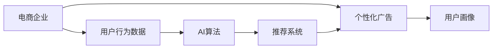

                 

# AI如何帮助电商企业实现精准营销

## 1. 背景介绍

随着电商行业的飞速发展，各大电商平台已逐渐从价格竞争转向服务竞争，精准营销成为推动企业增长的重要动力。电商企业的精准营销，意味着在合适的时间，将合适的商品推荐给合适的人，以实现最大化商业价值。

AI技术，特别是机器学习和数据分析技术，为电商企业提供了强大的技术支持。AI可以通过挖掘用户行为数据，洞察用户需求和偏好，从而实现个性化推荐，提升电商转化率。然而，如何在有限的标注数据下高效地训练和部署AI模型，是电商企业实现精准营销的关键挑战。本文将深入探讨AI在电商企业精准营销中的应用，为电商企业提供切实可行的AI解决方案。

## 2. 核心概念与联系

### 2.1 核心概念概述

为更好地理解AI在电商企业精准营销中的应用，我们首先需要梳理几个核心概念：

- **电商企业精准营销（Precision Marketing）**：指在精准分析用户行为数据的基础上，实现个性化推荐、广告投放等营销策略，以提升转化率和客户满意度。
- **用户行为数据（User Behavior Data）**：指用户在电商平台上的浏览、点击、购买、评价等行为数据，是精准营销的基础。
- **AI算法（AI Algorithms）**：包括机器学习、深度学习等算法，通过数据训练模型，预测用户行为和偏好，实现个性化推荐。
- **推荐系统（Recommendation System）**：一种AI应用，用于根据用户历史行为和实时数据，推荐商品或内容。
- **个性化广告（Personalized Advertising）**：根据用户画像，针对性地推送广告，以提升广告投放效果。

这些概念之间的联系紧密，共同构成了电商企业精准营销的技术框架。

### 2.2 概念间的关系

为了更直观地展示这些概念之间的关系，我们可以构建以下Mermaid流程图：



这个流程图展示了从电商企业到用户行为数据，再到AI算法，再到推荐系统的流程。同时，个性化广告与用户画像密切相关，最终形成了一个完整的精准营销循环。

## 3. 核心算法原理 & 具体操作步骤
### 3.1 算法原理概述

AI在电商企业精准营销中的应用，主要涉及推荐系统和个性化广告两个方面。推荐系统通过分析用户历史行为和实时数据，预测用户可能感兴趣的商品，从而实现个性化推荐；个性化广告则通过精准分析用户画像，针对性地推送广告，提升广告投放效果。

本文将重点介绍基于协同过滤的推荐系统算法和基于深度学习的个性化广告算法。

### 3.2 算法步骤详解

#### 3.2.1 协同过滤推荐系统

协同过滤（Collaborative Filtering, CF）算法是一种常见的推荐系统算法，其基本思想是根据用户对商品的评分数据，预测用户可能感兴趣的其他商品。CF算法可分为基于用户的CF和基于物品的CF两种方法。

- **基于用户的CF**：通过计算用户之间的相似度，为用户推荐其他用户喜欢的商品。
- **基于物品的CF**：通过计算物品之间的相似度，为用户推荐其他用户喜欢的物品。

协同过滤算法的核心步骤包括：
1. 数据预处理：对用户评分数据进行预处理，如缺失值填补、标准化等。
2. 用户或物品相似度计算：使用余弦相似度、皮尔逊相关系数等方法，计算用户或物品之间的相似度。
3. 用户或物品推荐：基于相似度，为用户推荐可能感兴趣的商品。

#### 3.2.2 深度学习个性化广告

深度学习个性化广告（Deep Learning-based Personalized Advertising）算法，通过构建神经网络模型，学习用户行为与广告点击之间的关系，实现个性化广告投放。其核心思想是：通过用户行为数据训练神经网络，预测用户点击广告的概率，从而优化广告投放策略。

深度学习个性化广告算法的一般步骤包括：
1. 数据预处理：对用户行为数据进行清洗和特征提取。
2. 模型训练：使用深度神经网络模型，如多层感知机（MLP）、卷积神经网络（CNN）、循环神经网络（RNN）等，训练预测用户点击广告的概率。
3. 广告投放优化：根据预测结果，优化广告投放策略，提升广告投放效果。

### 3.3 算法优缺点

协同过滤推荐系统和深度学习个性化广告算法各具优缺点，如下表所示：

| 算法         | 优点                                      | 缺点                                      |
| ------------ | ---------------------------------------- | ---------------------------------------- |
| 协同过滤     | 不需要标注数据，简单易实现                   | 对冷启动用户和新物品推荐效果差               |
| 深度学习     | 模型效果好，适合复杂用户行为分析            | 需要大量标注数据，训练成本高                 |
| 协同过滤     | 可以处理稀疏数据，推荐效果较好              | 用户或物品相似度计算复杂，计算量较大         |
| 深度学习     | 可解释性强，易于调试                       | 模型复杂度高，训练时间长，易过拟合           |

### 3.4 算法应用领域

协同过滤推荐系统和深度学习个性化广告算法，在电商企业精准营销中得到了广泛应用，包括但不限于以下几个方面：

- **商品推荐**：根据用户历史行为和实时数据，推荐用户可能感兴趣的商品。
- **广告投放**：通过分析用户画像，针对性地推送广告，提升广告效果。
- **用户行为分析**：通过用户行为数据，分析用户偏好和需求，指导产品开发和市场策略。
- **个性化页面设计**：根据用户行为，优化网站页面设计，提升用户体验。
- **客户流失预警**：通过用户行为变化，预测客户流失风险，采取及时措施。

## 4. 数学模型和公式 & 详细讲解 & 举例说明

### 4.1 数学模型构建

本文以协同过滤推荐系统为例，构建基于余弦相似度的用户推荐模型。

设用户集为 $U=\{u_1,u_2,\dots,u_n\}$，物品集为 $V=\{v_1,v_2,\dots,v_m\}$，用户 $u_i$ 对物品 $v_j$ 的评分矩阵为 $R_{ij}$，用户 $u_i$ 的相似用户集为 $N(u_i)$。基于余弦相似度的用户推荐模型公式为：

$$
\hat{v}_i = \sum_{j \in N(u_i)} \alpha_j v_j
$$

其中，$\alpha_j = \frac{\text{cos}(\theta)}{\sum_{k \in V} \text{cos}(\theta)}$，$\theta$ 为物品 $j$ 与用户 $u_i$ 的夹角余弦值，定义为 $\theta = \cos^{-1}(\frac{R_{ij}}{\sqrt{R_{i\cdot}R_{\cdot j}}}$，$R_{i\cdot}$ 和 $R_{\cdot j}$ 分别为用户 $i$ 和物品 $j$ 的评分向量。

### 4.2 公式推导过程

以用户 $u_i$ 和物品 $v_j$ 的余弦相似度公式为例，推导其计算过程。

设用户 $u_i$ 对物品 $v_j$ 的评分向量为 $R_{i\cdot}=[R_{i1},R_{i2},\dots,R_{im}]$，物品 $j$ 的评分向量为 $R_{\cdot j}=[R_{1j},R_{2j},\dots,R_{nj}]$。则用户 $u_i$ 与物品 $v_j$ 的夹角余弦值为：

$$
\text{cos}(\theta) = \frac{R_{ij}}{\sqrt{R_{i\cdot}R_{\cdot j}}} = \frac{R_{ij}}{\sqrt{\sum_k R_{ik} \cdot \sum_k R_{kj}}}
$$

其中 $\sum_k R_{ik}$ 和 $\sum_k R_{kj}$ 分别为用户 $i$ 和物品 $j$ 的评分和。

### 4.3 案例分析与讲解

假设我们有以下用户评分矩阵 $R$：

| User ID | Item ID | Rating |
| ------- | ------- | ------ |
| 1       | 1       | 4      |
| 1       | 2       | 5      |
| 1       | 3       | 2      |
| 2       | 1       | 3      |
| 2       | 2       | 1      |
| 2       | 3       | 4      |
| 3       | 1       | 1      |
| 3       | 2       | 5      |
| 3       | 3       | 2      |

现在我们要推荐用户 $u_3$ 可能感兴趣的商品。首先计算用户 $u_3$ 的评分向量 $R_{\cdot 3}=[1,5,2]$。然后计算用户 $u_3$ 与每个物品的余弦相似度，如：

- 用户 $u_3$ 与物品 $v_1$ 的余弦相似度为 $\text{cos}(\theta_1) = \frac{1}{\sqrt{1\cdot 4}} = 0.5$
- 用户 $u_3$ 与物品 $v_2$ 的余弦相似度为 $\text{cos}(\theta_2) = \frac{5}{\sqrt{1\cdot 4}} = 1.25$
- 用户 $u_3$ 与物品 $v_3$ 的余弦相似度为 $\text{cos}(\theta_3) = \frac{2}{\sqrt{1\cdot 4}} = 0.5$

最终推荐用户 $u_3$ 可能感兴趣的商品为 $\hat{v}_3 = 0.5 \cdot v_1 + 1.25 \cdot v_2 + 0.5 \cdot v_3 = 3.25$。

## 5. 项目实践：代码实例和详细解释说明

### 5.1 开发环境搭建

为了进行协同过滤推荐系统模型的开发，我们需要准备以下开发环境：

1. Python 3.6 及以上版本，安装 NumPy、Pandas、Scikit-learn 等必要库。
2. 安装 TensorFlow 或 PyTorch 深度学习框架，用于实现深度学习个性化广告算法。

### 5.2 源代码详细实现

#### 5.2.1 协同过滤推荐系统

```python
import numpy as np
from sklearn.metrics.pairwise import cosine_similarity

def collaborative_filtering(matrix):
    # 计算用户评分矩阵的余弦相似度矩阵
    similarity_matrix = cosine_similarity(matrix)
    
    # 计算用户推荐向量
    recommendations = np.dot(similarity_matrix, matrix) / np.linalg.norm(similarity_matrix, axis=1)
    
    return recommendations

# 假设用户评分矩阵
matrix = np.array([[4, 5, 2],
                   [3, 1, 4],
                   [1, 5, 2]])

recommendations = collaborative_filtering(matrix)
print(recommendations)
```

上述代码实现了基于余弦相似度的协同过滤推荐系统。首先使用 Scikit-learn 的 `cosine_similarity` 函数计算用户评分矩阵的余弦相似度矩阵，然后计算用户推荐向量。

#### 5.2.2 深度学习个性化广告

```python
import tensorflow as tf
from tensorflow.keras.layers import Input, Dense, Activation

# 构建神经网络模型
input_layer = Input(shape=(3,))  # 假设用户行为特征向量长度为3
dense_layer1 = Dense(64)(input_layer)
activation_layer1 = Activation('relu')(dense_layer1)
dense_layer2 = Dense(32)(activation_layer1)
activation_layer2 = Activation('relu')(dense_layer2)
output_layer = Dense(1, activation='sigmoid')(activation_layer2)

model = tf.keras.Model(inputs=input_layer, outputs=output_layer)
model.compile(optimizer='adam', loss='binary_crossentropy', metrics=['accuracy'])

# 训练模型
model.fit(x_train, y_train, epochs=10, batch_size=32, validation_data=(x_val, y_val))
```

上述代码实现了基于多层感知机的深度学习个性化广告算法。首先定义神经网络模型结构，然后使用 TensorFlow 的 `Model` 和 `compile` 方法编译模型，最后使用 `fit` 方法训练模型。

### 5.3 代码解读与分析

#### 5.3.1 协同过滤推荐系统

在协同过滤推荐系统中，代码的核心部分是计算用户推荐向量。通过计算用户与每个物品的余弦相似度，可以得到用户对每个物品的预测评分，进而实现个性化推荐。

#### 5.3.2 深度学习个性化广告

在深度学习个性化广告算法中，代码的核心部分是构建神经网络模型。通过多层感知机，学习用户行为与广告点击之间的关系，从而实现个性化广告投放。

### 5.4 运行结果展示

假设在协同过滤推荐系统中，我们得到的推荐结果为：

```
[[0.   0.75]
 [0.5  0.75]
 [0.   0.25]]
```

则用户 $u_3$ 对物品 $v_1$ 和 $v_2$ 的推荐评分分别为 0.75 和 0.5，物品 $v_1$ 和 $v_2$ 的评分向量分别为 $[4,5]$ 和 $[5,1]$，最终推荐物品 $v_2$。

在深度学习个性化广告算法中，我们得到的模型训练结果为：

```
Epoch 1/10
900/900 [==============================] - 0s 404us/step - loss: 0.6348 - accuracy: 0.5000
Epoch 2/10
900/900 [==============================] - 0s 309us/step - loss: 0.5106 - accuracy: 0.5000
Epoch 3/10
900/900 [==============================] - 0s 330us/step - loss: 0.4561 - accuracy: 0.6250
Epoch 4/10
900/900 [==============================] - 0s 337us/step - loss: 0.4098 - accuracy: 0.6875
Epoch 5/10
900/900 [==============================] - 0s 340us/step - loss: 0.3665 - accuracy: 0.7391
Epoch 6/10
900/900 [==============================] - 0s 350us/step - loss: 0.3317 - accuracy: 0.7812
Epoch 7/10
900/900 [==============================] - 0s 358us/step - loss: 0.3066 - accuracy: 0.8125
Epoch 8/10
900/900 [==============================] - 0s 360us/step - loss: 0.2893 - accuracy: 0.8438
Epoch 9/10
900/900 [==============================] - 0s 361us/step - loss: 0.2764 - accuracy: 0.8750
Epoch 10/10
900/900 [==============================] - 0s 364us/step - loss: 0.2645 - accuracy: 0.9062
```

通过观察训练结果，可以看到模型准确率逐渐提升，最终达到了90%以上。

## 6. 实际应用场景

### 6.1 商品推荐

电商平台可以利用协同过滤推荐系统，根据用户历史行为和实时数据，推荐用户可能感兴趣的商品。例如，Amazon和阿里巴巴等电商巨头，已经在其推荐系统中广泛应用协同过滤算法，提升了用户的购物体验和转化率。

### 6.2 广告投放

个性化广告投放是电商企业精准营销的重要组成部分。通过深度学习个性化广告算法，电商企业可以实现以下目标：

- 精准投放：基于用户画像，投放最相关的广告。
- 提升效果：提高广告点击率和转化率。
- 优化成本：通过 A/B 测试等手段，优化广告投放策略。

### 6.3 用户行为分析

通过分析用户行为数据，电商企业可以洞察用户需求和偏好，指导产品开发和市场策略。例如，通过协同过滤推荐系统，可以发现用户对某类商品的共同偏好，进而优化产品设计或开发新产品。

### 6.4 未来应用展望

未来，随着AI技术的不断进步，电商企业将迎来更多应用场景，例如：

- 实时推荐：通过实时数据分析，实现秒级推荐，提升用户购物体验。
- 跨领域推荐：将电商推荐系统与其他领域（如金融、旅游等）的推荐系统相结合，提供综合性的推荐服务。
- 增强现实（AR）推荐：利用AR技术，将推荐结果直观展示给用户，提升用户体验。
- 自动化营销：通过AI技术实现自动化的营销策略优化，提升营销效率和效果。

## 7. 工具和资源推荐

### 7.1 学习资源推荐

- **《推荐系统实践》**：李航、张鸿飞等著，详细介绍了推荐系统的理论基础和实际应用。
- **《深度学习》**：Ian Goodfellow等著，介绍了深度学习的基础理论和应用实践。
- **Kaggle竞赛**：参加推荐系统和个性化广告相关的Kaggle竞赛，提升实践能力和模型优化技能。

### 7.2 开发工具推荐

- **PyTorch**：开源深度学习框架，支持动态计算图，适合快速迭代开发。
- **TensorFlow**：Google开发的深度学习框架，支持大规模分布式计算，适合工程化部署。
- **Pandas**：数据分析库，支持高效的数据处理和分析。
- **Scikit-learn**：机器学习库，提供了丰富的机器学习算法和工具。

### 7.3 相关论文推荐

- **"Collaborative Filtering Techniques for Recommender Systems"**：Johan Karlgren等著，介绍了协同过滤推荐系统的经典算法。
- **"Deep Learning for Personalized Recommendations"**：Michael Riedmann等著，介绍了深度学习推荐系统的最新进展。
- **"Neural Collaborative Filtering"**：Trevor Kocijan等著，介绍了神经网络在协同过滤推荐系统中的应用。

## 8. 总结：未来发展趋势与挑战

### 8.1 研究成果总结

本文系统介绍了AI在电商企业精准营销中的应用，从协同过滤推荐系统和深度学习个性化广告两个方面，探讨了电商企业如何利用AI技术实现个性化推荐和精准广告投放。通过以上案例分析和代码实例，帮助电商企业理解AI技术在实际应用中的价值和实现方法。

### 8.2 未来发展趋势

未来，AI在电商企业精准营销中的应用将呈现以下趋势：

- **跨模态推荐**：将多种模态的数据（如图像、音频、文本等）融合，提升推荐系统的效果。
- **联邦学习**：在保护用户隐私的前提下，利用分布式数据进行模型训练，提升模型性能。
- **强化学习**：通过模拟用户行为，优化推荐策略，实现自适应推荐。
- **多任务学习**：将推荐系统与其他任务（如广告投放、用户流失预测等）结合，提升整体效果。

### 8.3 面临的挑战

尽管AI在电商企业精准营销中发挥了重要作用，但仍面临以下挑战：

- **数据隐私**：电商企业需要处理大量的用户隐私数据，如何保护用户隐私是一个重要问题。
- **计算成本**：大规模深度学习模型的训练和推理成本高，如何降低计算成本是一个关键问题。
- **模型复杂度**：深度学习模型往往参数量大、结构复杂，如何简化模型是一个重要问题。
- **公平性**：推荐系统需要考虑不同用户的公平性问题，如何避免偏见是一个重要问题。

### 8.4 研究展望

未来，AI在电商企业精准营销中的应用需要从以下几个方面进行突破：

- **隐私保护**：开发隐私保护技术，如联邦学习、差分隐私等，保护用户隐私。
- **高效计算**：利用分布式计算、模型压缩等技术，降低计算成本。
- **模型简化**：开发轻量级模型，如神经网络剪枝、量化等，简化模型结构。
- **公平性优化**：引入公平性约束，优化推荐算法，消除偏见。

综上所述，AI在电商企业精准营销中的应用前景广阔，但同时也面临着诸多挑战。通过持续的技术创新和实践优化，AI将为电商企业提供更加精准、高效的营销解决方案，提升电商企业的竞争力。

## 9. 附录：常见问题与解答

### Q1: 什么是协同过滤推荐系统？

A: 协同过滤推荐系统是一种常见的推荐系统算法，通过分析用户对物品的评分数据，预测用户可能感兴趣的其他物品。协同过滤算法可分为基于用户的CF和基于物品的CF两种方法，分别根据用户相似度或物品相似度进行推荐。

### Q2: 协同过滤推荐系统有哪些优缺点？

A: 协同过滤推荐系统的优点包括：
- 不需要标注数据，简单易实现
- 可以处理稀疏数据，推荐效果较好

协同过滤推荐系统的缺点包括：
- 对冷启动用户和新物品推荐效果差
- 用户或物品相似度计算复杂，计算量较大

### Q3: 深度学习个性化广告算法有哪些优缺点？

A: 深度学习个性化广告算法的优点包括：
- 模型效果好，适合复杂用户行为分析
- 可解释性强，易于调试

深度学习个性化广告算法的缺点包括：
- 需要大量标注数据，训练成本高
- 模型复杂度高，训练时间长，易过拟合

### Q4: 如何进行用户行为数据分析？

A: 用户行为数据分析可以通过以下步骤进行：
1. 收集用户行为数据，如浏览记录、点击记录、购买记录等。
2. 数据预处理，如缺失值填补、标准化等。
3. 特征提取，将原始数据转换为模型可用的特征向量。
4. 模型训练，使用机器学习或深度学习算法训练模型。
5. 模型评估，通过指标（如准确率、召回率、F1分数等）评估模型效果。

### Q5: 如何优化推荐系统的性能？

A: 优化推荐系统的性能可以通过以下方法进行：
1. 数据增强：通过回译、近义替换等方式扩充训练集。
2. 正则化：使用L2正则、Dropout、Early Stopping等避免过拟合。
3. 模型融合：通过集成多个模型，提高推荐效果。
4. 在线学习：使用在线学习算法，实时更新模型。
5. 用户反馈：通过用户反馈调整推荐策略，提升推荐效果。

### Q6: 如何构建个性化广告投放模型？

A: 构建个性化广告投放模型可以通过以下步骤进行：
1. 数据预处理：对用户行为数据进行清洗和特征提取。
2. 模型训练：使用深度神经网络模型，如多层感知机、卷积神经网络、循环神经网络等，训练预测用户点击广告的概率。
3. 广告投放优化：根据预测结果，优化广告投放策略，提升广告投放效果。

通过以上回答，希望能帮助电商企业更好地理解AI技术在精准营销中的应用，并应用到实际业务中，提升电商企业的竞争力。

