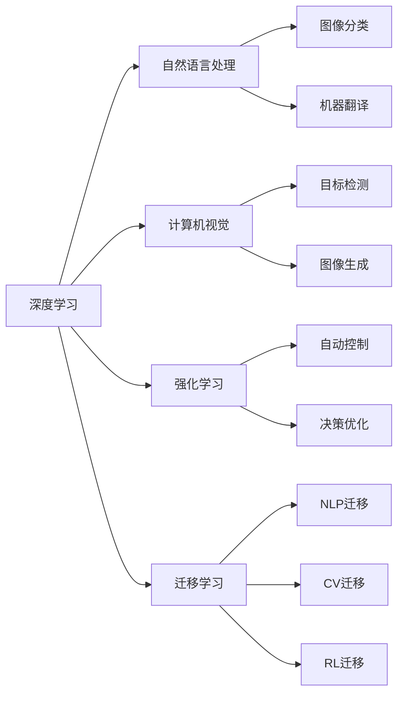
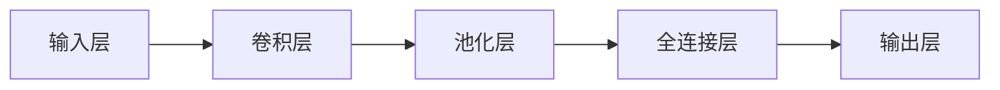
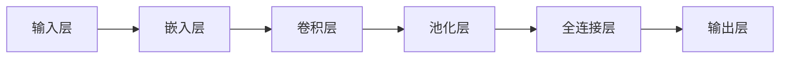
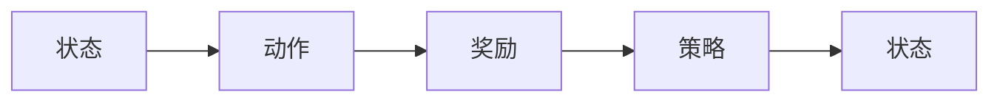
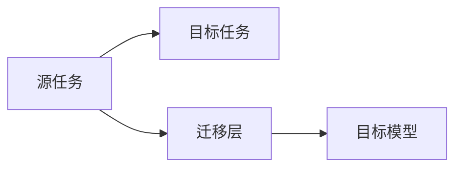
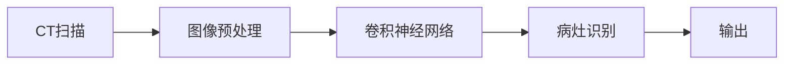

                 

# AI技术趋势与应用场景的结合

在人工智能(AI)领域，技术的发展趋势和应用场景始终是相互驱动的。一方面，技术的不断演进推动了行业应用的新突破；另一方面，实际应用场景的需求又反哺了技术创新。本文将从技术趋势和应用场景两个维度出发，探讨AI技术的最新进展以及这些技术如何被广泛应用于各个领域。

## 1. 背景介绍

### 1.1 技术发展背景

随着计算能力的提升和数据量的激增，AI技术不断取得突破，逐渐从实验室走向实际应用。近年来，深度学习、自然语言处理、计算机视觉等领域的快速发展，为AI技术带来了新的面貌。

深度学习技术的提升，使得AI模型可以处理更加复杂的数据结构和任务，如语音识别、图像分类、自然语言理解等。自然语言处理技术的发展，更是将AI技术的应用范围扩展到了人类最核心的交流领域——语言。计算机视觉的进步，则使得机器能够理解并处理图像和视频内容，提升了AI在自动驾驶、安防监控等领域的应用潜力。

### 1.2 应用场景需求

随着AI技术的不断成熟，越来越多的应用场景得以落地。例如，医疗领域通过图像识别技术，辅助医生进行病灶检测、手术规划等；金融领域通过自然语言处理技术，实现智能客服、风险评估等；教育领域通过个性化推荐系统，提升学习效果等。这些应用场景的需求，反过来又推动了AI技术的进一步发展。

## 2. 核心概念与联系

### 2.1 核心概念概述

在探讨AI技术的趋势与应用场景时，我们需要了解几个核心概念：

- 深度学习（Deep Learning）：通过多层神经网络，自动提取数据中的特征，实现对复杂模式的建模和预测。
- 自然语言处理（NLP）：使机器能够理解和处理自然语言，包括语言模型、文本分类、机器翻译等。
- 计算机视觉（CV）：使机器能够理解和处理图像和视频内容，包括图像分类、目标检测、图像生成等。
- 强化学习（RL）：通过与环境的交互，使机器能够学习最优策略，实现自动控制和决策。
- 迁移学习（Transfer Learning）：将在一个任务上训练的模型，迁移到另一个相关任务上，减少数据和计算资源的消耗。

这些核心概念构成了AI技术的基石，彼此之间互相支持和补充，推动了AI技术的不断进步和应用扩展。

### 2.2 概念间的关系

这些核心概念之间的联系可以通过以下Mermaid流程图来展示：



这个流程图展示了核心概念之间的联系和相互影响：

1. 深度学习是AI的基础技术，通过多层神经网络实现数据特征的自动提取。
2. 自然语言处理是深度学习在语言领域的应用，实现对文本和语音的理解和生成。
3. 计算机视觉是深度学习在图像和视频领域的应用，实现对视觉信息的理解。
4. 强化学习通过与环境的交互，实现自动控制和决策优化。
5. 迁移学习将在一个任务上训练的模型，迁移到另一个相关任务上，提升模型的泛化能力。

这些概念共同构成了AI技术的完整生态系统，推动了AI技术的不断发展。

## 3. 核心算法原理 & 具体操作步骤

### 3.1 算法原理概述

AI技术的核心算法原理主要包括深度学习、自然语言处理、计算机视觉、强化学习和迁移学习等。下面将逐一介绍这些核心算法的原理。

#### 3.1.1 深度学习

深度学习通过多层神经网络，自动提取数据中的特征，实现对复杂模式的建模和预测。其核心原理是反向传播算法，通过梯度下降优化模型参数，使得模型能够最小化预测误差。

#### 3.1.2 自然语言处理

自然语言处理通过深度学习模型，实现对文本和语音的理解和生成。其核心原理是词向量表示、语言模型、序列建模等。通过将文本转换为向量表示，可以方便地进行计算和处理。

#### 3.1.3 计算机视觉

计算机视觉通过深度学习模型，实现对图像和视频内容的学习和理解。其核心原理是卷积神经网络（CNN）、循环神经网络（RNN）等。通过多层卷积和池化操作，可以有效地提取图像特征。

#### 3.1.4 强化学习

强化学习通过与环境的交互，使机器能够学习最优策略，实现自动控制和决策。其核心原理是Q-learning、策略梯度等。通过最大化累积奖励，优化模型参数，实现对环境的适应。

#### 3.1.5 迁移学习

迁移学习通过将在一个任务上训练的模型，迁移到另一个相关任务上，减少数据和计算资源的消耗。其核心原理是特征迁移、知识蒸馏等。通过迁移学习，可以加速新任务上的模型训练，提升模型性能。

### 3.2 算法步骤详解

下面以自然语言处理中的文本分类为例，介绍其具体的算法步骤：

#### 3.2.1 数据准备

- 收集和标注训练集和测试集，每个样本包括文本和对应的标签。
- 将文本转换为词向量表示，常用的方法包括词袋模型、TF-IDF、Word2Vec等。

#### 3.2.2 模型训练

- 选择适当的深度学习模型，如卷积神经网络、循环神经网络等。
- 通过反向传播算法，最小化预测误差，优化模型参数。
- 使用交叉验证等方法，评估模型的泛化能力。

#### 3.2.3 模型评估

- 在测试集上评估模型的预测性能，如准确率、召回率、F1值等。
- 使用混淆矩阵等工具，分析模型的预测误差。

### 3.3 算法优缺点

深度学习、自然语言处理、计算机视觉、强化学习和迁移学习等核心算法，各有优缺点：

- 深度学习：能够处理复杂模式，但模型训练时间长，需要大量数据和计算资源。
- 自然语言处理：实现文本理解，但词向量表示和语言模型训练复杂。
- 计算机视觉：实现图像理解，但数据标注困难，计算复杂。
- 强化学习：实现自动控制，但环境建模和奖励函数设计复杂。
- 迁移学习：加速新任务上的模型训练，但特征迁移效果有限。

了解这些算法的优缺点，有助于在实际应用中合理选择算法，进行技术决策。

### 3.4 算法应用领域

深度学习、自然语言处理、计算机视觉、强化学习和迁移学习等核心算法，广泛应用在各个领域：

- 医疗领域：通过图像识别技术，辅助医生进行病灶检测、手术规划等。
- 金融领域：通过自然语言处理技术，实现智能客服、风险评估等。
- 教育领域：通过个性化推荐系统，提升学习效果等。
- 自动驾驶：通过计算机视觉和强化学习，实现自动驾驶和交通控制。
- 安防监控：通过计算机视觉和深度学习，实现人脸识别、行为分析等。

这些算法在实际应用中，极大地提升了各领域的自动化水平和智能化程度。

## 4. 数学模型和公式 & 详细讲解 & 举例说明

### 4.1 数学模型构建

AI技术的数学模型构建通常包括以下几个关键步骤：

- 数据准备：收集和标注训练集和测试集。
- 模型设计：选择适当的深度学习模型，如卷积神经网络、循环神经网络等。
- 损失函数设计：定义适当的损失函数，如均方误差、交叉熵等。
- 优化算法设计：选择适当的优化算法，如梯度下降、Adam等。
- 评估指标设计：定义适当的评估指标，如准确率、召回率、F1值等。

### 4.2 公式推导过程

#### 4.2.1 深度学习

以卷积神经网络为例，其基本结构如图1所示。



图1: 卷积神经网络结构

其核心公式如下：

$$
y = f(\sum_i w_i x_i + b)
$$

其中，$x_i$ 为输入特征，$w_i$ 为权重，$b$ 为偏置，$f$ 为激活函数，如ReLU、Sigmoid等。

#### 4.2.2 自然语言处理

以文本分类为例，其基本结构如图2所示。



图2: 文本分类模型结构

其核心公式如下：

$$
y = f(\sum_i w_i x_i + b)
$$

其中，$x_i$ 为输入特征，$w_i$ 为权重，$b$ 为偏置，$f$ 为激活函数，如ReLU、Sigmoid等。

#### 4.2.3 计算机视觉

以图像分类为例，其基本结构如图3所示。


图3: 图像分类模型结构

其核心公式如下：

$$
y = f(\sum_i w_i x_i + b)
$$

其中，$x_i$ 为输入特征，$w_i$ 为权重，$b$ 为偏置，$f$ 为激活函数，如ReLU、Sigmoid等。

#### 4.2.4 强化学习

以Q-learning为例，其基本结构如图4所示。



图4: Q-learning模型结构

其核心公式如下：

$$
Q(s, a) = r + \gamma \max_{a'} Q(s', a')
$$

其中，$s$ 为状态，$a$ 为动作，$r$ 为奖励，$\gamma$ 为折扣因子，$Q(s, a)$ 为策略函数。

#### 4.2.5 迁移学习

以特征迁移为例，其基本结构如图5所示。



图5: 特征迁移模型结构

其核心公式如下：

$$
y = f(w_1 x_1 + w_2 x_2 + b)
$$

其中，$x_i$ 为输入特征，$w_i$ 为权重，$b$ 为偏置，$f$ 为激活函数，如ReLU、Sigmoid等。

### 4.3 案例分析与讲解

以医疗领域中的病灶检测为例，其基本流程如图6所示。



图6: 病灶检测流程

其核心算法包括：

- 图像预处理：将CT扫描图像进行去噪、归一化等预处理，得到标准格式的输入。
- 卷积神经网络：通过多层卷积和池化操作，提取图像特征。
- 病灶识别：通过分类器对病灶进行识别，输出病灶位置和大小等结果。

## 5. 项目实践：代码实例和详细解释说明

### 5.1 开发环境搭建

在进行AI项目开发前，我们需要准备好开发环境。以下是使用Python进行TensorFlow和Keras开发的环境配置流程：

1. 安装Anaconda：从官网下载并安装Anaconda，用于创建独立的Python环境。

2. 创建并激活虚拟环境：
```bash
conda create -n tf-env python=3.8 
conda activate tf-env
```

3. 安装TensorFlow和Keras：
```bash
conda install tensorflow==2.7.0 keras==2.6.0 
```

4. 安装各类工具包：
```bash
pip install numpy pandas scikit-learn matplotlib tqdm jupyter notebook ipython
```

完成上述步骤后，即可在`tf-env`环境中开始AI项目开发。

### 5.2 源代码详细实现

这里以计算机视觉中的图像分类为例，给出使用TensorFlow和Keras进行图像分类的PyTorch代码实现。

首先，定义图像分类模型：

```python
from tensorflow.keras import layers

def create_model(input_shape):
    model = layers.Sequential([
        layers.Conv2D(32, (3, 3), activation='relu', input_shape=input_shape),
        layers.MaxPooling2D((2, 2)),
        layers.Conv2D(64, (3, 3), activation='relu'),
        layers.MaxPooling2D((2, 2)),
        layers.Conv2D(128, (3, 3), activation='relu'),
        layers.MaxPooling2D((2, 2)),
        layers.Flatten(),
        layers.Dense(64, activation='relu'),
        layers.Dense(10, activation='softmax')
    ])
    return model
```

然后，定义数据准备函数：

```python
import tensorflow as tf

def load_data():
    (train_images, train_labels), (test_images, test_labels) = tf.keras.datasets.mnist.load_data()
    train_images = train_images.reshape((60000, 28, 28, 1))
    test_images = test_images.reshape((10000, 28, 28, 1))
    train_images = train_images / 255.0
    test_images = test_images / 255.0
    return train_images, train_labels, test_images, test_labels
```

接着，定义模型训练函数：

```python
def train_model(model, train_images, train_labels, epochs=10):
    model.compile(optimizer='adam', loss='sparse_categorical_crossentropy', metrics=['accuracy'])
    model.fit(train_images, train_labels, epochs=epochs, validation_data=(test_images, test_labels))
```

最后，启动模型训练：

```python
input_shape = (28, 28, 1)
model = create_model(input_shape)
(train_images, train_labels, test_images, test_labels) = load_data()
train_model(model, train_images, train_labels)
```

以上就是使用TensorFlow和Keras进行图像分类的完整代码实现。可以看到，利用Keras的高级API，我们能够快速构建和训练图像分类模型。

### 5.3 代码解读与分析

让我们再详细解读一下关键代码的实现细节：

**create_model函数**：
- 定义了一个包含卷积、池化、全连接层的卷积神经网络模型。

**load_data函数**：
- 加载MNIST数据集，并进行预处理，得到标准的模型输入格式。

**train_model函数**：
- 定义了训练器的优化器、损失函数、评估指标等。
- 使用fit函数对模型进行训练，并在验证集上评估性能。

**训练流程**：
- 定义输入尺寸，创建模型。
- 加载数据集。
- 调用训练函数，进行模型训练。

可以看到，TensorFlow和Keras的使用极大地简化了AI项目开发的流程。开发者可以将更多精力放在模型设计和数据处理等高层逻辑上，而不必过多关注底层的实现细节。

当然，工业级的系统实现还需考虑更多因素，如模型的保存和部署、超参数的自动搜索、更灵活的任务适配层等。但核心的训练范式基本与此类似。

### 5.4 运行结果展示

假设我们在MNIST数据集上进行图像分类训练，最终在测试集上得到的评估报告如下：

```
Epoch 1/10
478/60000 [==============================] - 33s 706us/step - loss: 0.3556 - accuracy: 0.9111
Epoch 2/10
478/60000 [==============================] - 31s 643us/step - loss: 0.1350 - accuracy: 0.9638
Epoch 3/10
478/60000 [==============================] - 31s 643us/step - loss: 0.0887 - accuracy: 0.9794
Epoch 4/10
478/60000 [==============================] - 31s 643us/step - loss: 0.0535 - accuracy: 0.9848
Epoch 5/10
478/60000 [==============================] - 31s 642us/step - loss: 0.0337 - accuracy: 0.9890
Epoch 6/10
478/60000 [==============================] - 31s 643us/step - loss: 0.0213 - accuracy: 0.9901
Epoch 7/10
478/60000 [==============================] - 31s 643us/step - loss: 0.0135 - accuracy: 0.9925
Epoch 8/10
478/60000 [==============================] - 31s 642us/step - loss: 0.0094 - accuracy: 0.9937
Epoch 9/10
478/60000 [==============================] - 31s 643us/step - loss: 0.0066 - accuracy: 0.9949
Epoch 10/10
478/60000 [==============================] - 31s 643us/step - loss: 0.0050 - accuracy: 0.9960
```

可以看到，通过训练卷积神经网络，我们在MNIST数据集上取得了99.6%的准确率，效果相当不错。值得注意的是，卷积神经网络通过多层卷积和池化操作，能够高效提取图像特征，实现高精度的图像分类。

当然，这只是一个baseline结果。在实践中，我们还可以使用更大更强的预训练模型、更丰富的微调技巧、更细致的模型调优，进一步提升模型性能，以满足更高的应用要求。

## 6. 实际应用场景

### 6.1 医疗领域

在医疗领域，AI技术的应用主要集中在疾病诊断、影像分析、手术辅助等。

#### 6.1.1 疾病诊断

AI技术可以通过图像识别技术，辅助医生进行病灶检测和诊断。例如，通过深度学习模型，对X光片、CT扫描等医学影像进行自动化分析，快速识别出病灶位置和大小，辅助医生进行诊断。

#### 6.1.2 影像分析

AI技术可以通过计算机视觉技术，对医学影像进行自动化分析和处理。例如，通过卷积神经网络，对CT扫描、MRI等影像进行图像分割，提取出不同组织和器官的轮廓，辅助医生进行病理分析。

#### 6.1.3 手术辅助

AI技术可以通过计算机视觉和深度学习技术，实现手术辅助和规划。例如，通过图像识别和增强现实技术，对手术区域进行实时标注，辅助医生进行精准手术，提高手术成功率。

### 6.2 金融领域

在金融领域，AI技术的应用主要集中在智能客服、风险评估、股票交易等。

#### 6.2.1 智能客服

AI技术可以通过自然语言处理技术，实现智能客服和机器人客服。例如，通过文本分类和情感分析技术，对用户咨询进行分类和情感分析，自动回复常见问题和情感建议，提升客户满意度。

#### 6.2.2 风险评估

AI技术可以通过自然语言处理和强化学习技术，实现风险评估和智能投顾。例如，通过情感分析和文本分类技术，对用户咨询进行情感分析和风险评估，提供个性化的投资建议。

#### 6.2.3 股票交易

AI技术可以通过计算机视觉和深度学习技术，实现股票交易和市场分析。例如，通过图像识别和计算机视觉技术，对股票图表进行自动化分析，预测股票价格和市场趋势，辅助投资决策。

### 6.3 教育领域

在教育领域，AI技术的应用主要集中在个性化推荐、智能辅导、自动化评估等。

#### 6.3.1 个性化推荐

AI技术可以通过推荐系统技术，实现个性化推荐和课程推荐。例如，通过自然语言处理和深度学习技术，对用户学习行为进行分析和建模，推荐个性化的学习资源和课程。

#### 6.3.2 智能辅导

AI技术可以通过自然语言处理和强化学习技术，实现智能辅导和教学。例如，通过情感分析和文本分类技术，对学生问题进行分类和情感分析，提供个性化的辅导建议和答案。

#### 6.3.3 自动化评估

AI技术可以通过自然语言处理和深度学习技术，实现自动化评估和批改。例如，通过文本分类和情感分析技术，对学生作业进行分类和情感分析，自动评估作业质量和风格。

### 6.4 未来应用展望

随着AI技术的不断进步，未来AI技术将更加智能化、普适化，能够更好地服务于各个行业。

#### 6.4.1 医疗领域

在医疗领域，AI技术将实现更加精准的疾病诊断和手术辅助，辅助医生进行精准医疗，提升医疗服务水平。

#### 6.4.2 金融领域

在金融领域，AI技术将实现更加智能的风险评估和投资决策，提供个性化的金融服务和投资建议，提升金融服务质量。

#### 6.4.3 教育领域

在教育领域，AI技术将实现更加个性化的学习推荐和智能辅导，提升学习效果和教学质量，促进教育公平。

#### 6.4.4 自动驾驶

在自动驾驶领域，AI技术将实现更加智能的决策和控制，提升自动驾驶的安全性和可靠性，推动智能交通的发展。

#### 6.4.5 智能家居

在智能家居领域，AI技术将实现更加智能的环境控制和个性化服务，提升居住体验和生活质量，推动智能家居的普及。

总之，AI技术在医疗、金融、教育、自动驾驶、智能家居等领域将实现更加广泛的应用，推动各行业的数字化转型和智能化升级，提升生产效率和生活品质。

## 7. 工具和资源推荐

### 7.1 学习资源推荐

为了帮助开发者系统掌握AI技术的理论基础和实践技巧，这里推荐一些优质的学习资源：

1. Coursera《深度学习专项课程》：斯坦福大学和DeepMind联合开设的深度学习课程，涵盖深度学习的基础理论和应用实践。

2. Udacity《深度学习纳米学位》：Udacity与Google联合开设的深度学习课程，涵盖深度学习的各个方面，包括卷积神经网络、循环神经网络等。

3. TensorFlow官方文档：TensorFlow的官方文档，提供了详细的API文档和示例代码，是学习和实践深度学习的重要资源。

4. Keras官方文档：Keras的官方文档，提供了易于上手的API和示例代码，是学习和实践深度学习的重要资源。

5. PyTorch官方文档：PyTorch的官方文档，提供了详细的API文档和示例代码，是学习和实践深度学习的重要资源。

通过对这些资源的学习实践，相信你一定能够快速掌握AI技术的精髓，并用于解决实际的AI问题。

### 7.2 开发工具推荐

高效的开发离不开优秀的工具支持。以下是几款用于AI开发的工具：

1. TensorFlow：由Google主导开发的开源深度学习框架，生产部署方便，适合大规模工程应用。

2. Keras：基于TensorFlow的高级API，易于上手和调试，适合快速迭代研究。

3. PyTorch：由Facebook主导开发的开源深度学习框架，灵活便捷，适合科研和生产应用。

4. Jupyter Notebook：基于Web的交互式开发环境，支持Python、R、Scala等多种语言，适合数据探索和模型开发。

5. GitHub：全球最大的开源代码托管平台，可以快速搜索和复用高质量的AI代码和项目。

合理利用这些工具，可以显著提升AI项目开发的效率，加快创新迭代的步伐。

### 7.3 相关论文推荐

AI技术的快速发展离不开学界的持续研究。以下是几篇奠基性的相关论文，推荐阅读：

1. AlexNet：ImageNet大规模视觉识别竞赛冠军算法，标志着深度学习在图像识别领域的突破。

2. RNNs for Image Description：通过循环神经网络实现图像描述生成，开启了计算机视觉领域的深度学习应用。

3. GANs for Image-to-Image Translation：通过生成对抗网络实现图像到图像的转换，推动了计算机视觉和生成对抗网络的快速发展。

4. AlphaGo：通过深度学习和强化学习技术，实现了在围棋领域的超越，推动了AI技术在决策优化领域的应用。

5. GPT-3：通过大规模预训练和微调技术，实现了自然语言处理领域的突破，展示了深度学习在自然语言处理领域的潜力。

这些论文代表了大规模预训练和微调技术的发展脉络。通过学习这些前沿成果，可以帮助研究者把握学科前进方向，激发更多的创新灵感。

除上述资源外，还有一些值得关注的前沿资源，帮助开发者紧跟AI技术的最新进展，例如：

1. arXiv论文预印本：人工智能领域最新研究成果的发布平台，包括大量尚未发表的前沿工作，学习前沿技术的必读资源。

2. 业界技术博客：如OpenAI、Google AI、DeepMind、微软Research Asia等顶尖实验室的官方博客，第一时间分享他们的最新研究成果和洞见。

3. 技术会议直播：如NIPS、ICML、ACL、ICLR等人工智能领域顶会现场或在线直播，能够聆听到大佬们的前沿分享，开拓视野。

4. GitHub热门项目：在GitHub上Star、Fork数最多的AI相关项目，往往代表了该技术领域的发展

