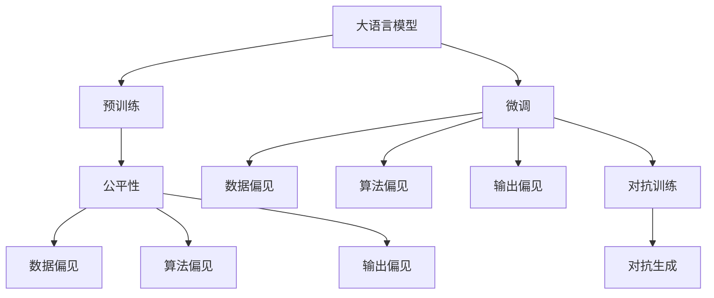
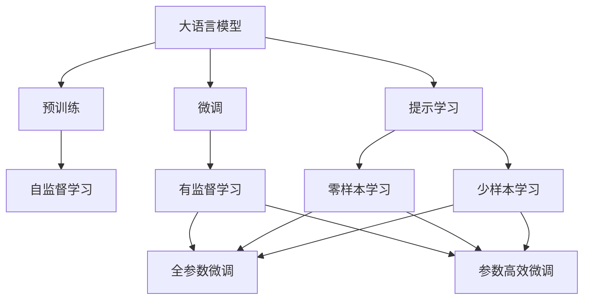
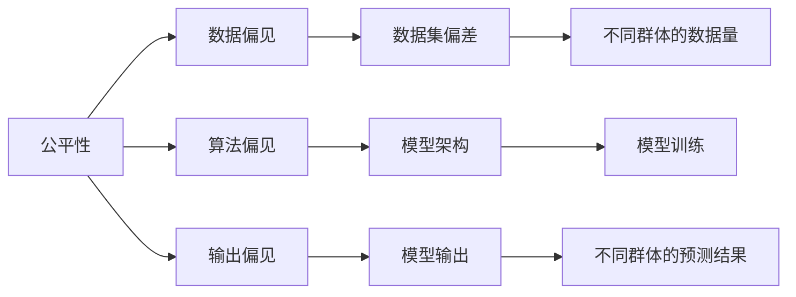
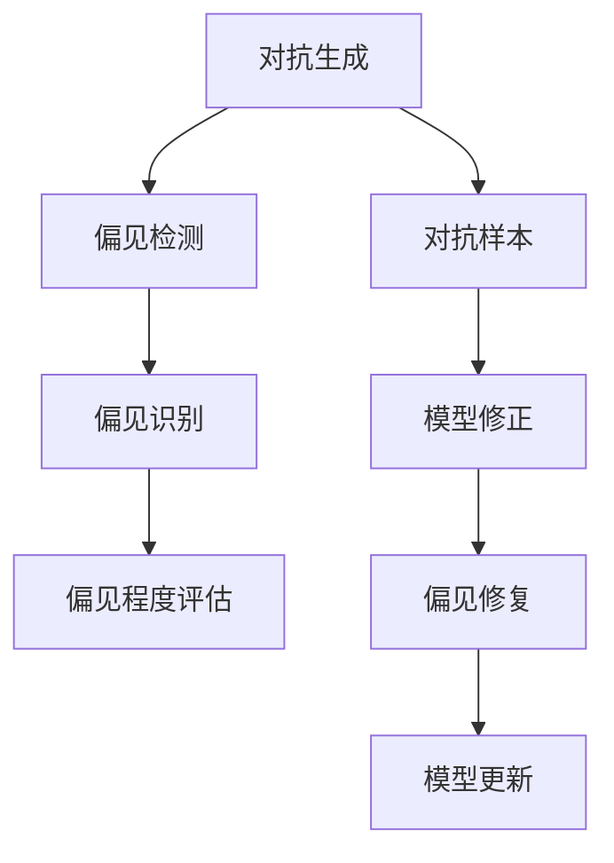
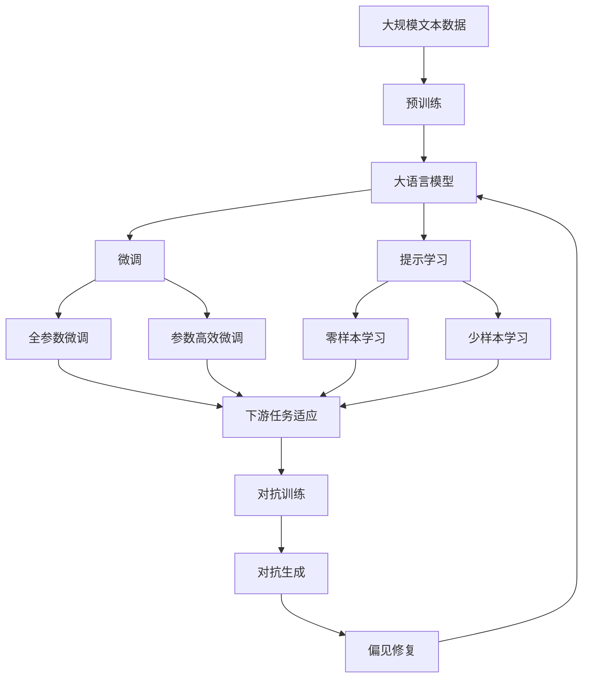

                 

# 大语言模型原理基础与前沿 偏见

> 关键词：大语言模型,偏见,Bias,公平性,Fairness,解释性,Explainability

## 1. 背景介绍

### 1.1 问题由来

近年来，人工智能（AI）在自然语言处理（NLP）、计算机视觉（CV）、语音识别（ASR）等领域取得了飞速进展。特别是大语言模型（Large Language Models, LLMs）的出现，使得机器理解和生成自然语言的能力迈上了新的台阶。然而，这些模型虽然在某些任务上表现出色，但在处理偏见问题上却屡屡失手。

例如，GPT-3、BERT等模型在回答问题时，有时会表现出明显的性别偏见、种族偏见，甚至传播仇恨言论。这种偏见现象不仅损害了模型的公信力，也带来了严重的社会影响。因此，如何在模型训练和微调过程中避免偏见，成为当前AI领域亟待解决的问题之一。

### 1.2 问题核心关键点

大语言模型中的偏见问题，主要体现在以下几个方面：

1. **数据偏见**：训练数据中存在的性别、种族、地域等偏见，会通过模型训练传递到模型中。
2. **算法偏见**：模型架构和训练算法本身可能带有某种隐性偏见，使得模型输出结果也带有偏见。
3. **输出偏见**：模型在生成文本时，由于学习到数据中的偏见，可能产生歧视性或有害的语言。
4. **公平性问题**：由于模型输出可能存在偏见，使得不同群体（如女性、少数族裔等）遭受不公待遇。
5. **可解释性问题**：大语言模型的黑盒性质，使得其决策过程难以解释，难以判断其偏见来源。

解决这些偏见问题，需要从数据、算法、模型输出等多个层面进行全面分析和优化。本文将从这些方面展开，全面探讨大语言模型的偏见问题及其解决策略。

### 1.3 问题研究意义

深入研究和解决大语言模型中的偏见问题，对于提升模型公平性、提高用户信任度、保障社会伦理等方面具有重要意义：

1. **提升模型公平性**：确保不同群体在模型中得到平等对待，避免任何形式的歧视和偏见。
2. **提高用户信任度**：通过消除模型中的偏见，增强模型输出的可信度和透明度，提升用户对AI技术的信任感。
3. **保障社会伦理**：AI模型的公平性问题不仅涉及技术层面，还涉及社会伦理，需要确保AI技术的应用符合人类价值观和社会规范。
4. **促进人工智能产业化**：消除偏见，提升模型性能，有助于加速人工智能技术的产业化进程，推动更多领域的技术应用。

## 2. 核心概念与联系

### 2.1 核心概念概述

为更好地理解大语言模型中的偏见问题及其解决策略，本节将介绍几个关键概念及其联系：

1. **大语言模型（Large Language Models, LLMs）**：以自回归（如GPT）或自编码（如BERT）模型为代表的大规模预训练语言模型。通过在大规模无标签文本语料上进行预训练，学习通用的语言表示，具备强大的语言理解和生成能力。

2. **预训练（Pre-training）**：指在大规模无标签文本语料上，通过自监督学习任务训练通用语言模型的过程。常见的预训练任务包括言语建模、遮挡语言模型等。

3. **微调（Fine-tuning）**：指在预训练模型的基础上，使用下游任务的少量标注数据，通过有监督学习优化模型在特定任务上的性能。通常只需要调整顶层分类器或解码器，并以较小的学习率更新全部或部分的模型参数。

4. **偏见（Bias）**：指在数据、算法、模型输出中存在的歧视性或不公正现象。偏见可以分为数据偏见、算法偏见和输出偏见。

5. **公平性（Fairness）**：指在模型训练和应用过程中，对不同群体提供平等对待，避免任何形式的歧视和偏见。

6. **可解释性（Explainability）**：指模型决策过程的透明度和可理解性。可解释性是大语言模型中偏见识别和消除的重要工具。

7. **对抗训练（Adversarial Training）**：指通过引入对抗样本，提高模型对噪声和攻击的鲁棒性。

8. **对抗生成（Adversarial Generation）**：指通过对抗样本生成技术，发现和修复模型中的偏见。

这些核心概念之间的关系可以通过以下Mermaid流程图来展示：



这个流程图展示了大语言模型中的关键概念及其相互关系：

1. 大语言模型通过预训练获得基础能力。
2. 微调是对预训练模型进行任务特定的优化，可能引入偏见。
3. 预训练和微调过程中可能存在数据偏见、算法偏见和输出偏见。
4. 通过对抗训练和对抗生成技术，可以发现和修复模型中的偏见。
5. 公平性是模型训练和应用的基本目标，需要在数据、算法、输出等多个环节进行全面考虑。
6. 可解释性是偏见识别和消除的重要工具，有助于深入理解模型的决策过程。

### 2.2 概念间的关系

这些核心概念之间存在着紧密的联系，形成了大语言模型中偏见问题的完整生态系统。下面我们通过几个Mermaid流程图来展示这些概念之间的关系。

#### 2.2.1 大语言模型的学习范式



这个流程图展示了大语言模型的三种主要学习范式：预训练、微调和提示学习。预训练主要采用自监督学习方法，而微调则是有监督学习的过程。提示学习可以实现零样本和少样本学习，而全参数微调和参数高效微调则是在微调过程中针对模型参数的优化策略。

#### 2.2.2 公平性和偏见的关系



这个流程图展示了公平性与偏见的关系。公平性涉及对不同群体的公平对待，数据偏见、算法偏见和输出偏见都可能影响模型的公平性。

#### 2.2.3 对抗生成和偏见修复



这个流程图展示了对抗生成技术在偏见修复中的应用。对抗生成通过生成对抗样本，发现和修复模型中的偏见。

### 2.3 核心概念的整体架构

最后，我们用一个综合的流程图来展示这些核心概念在大语言模型中的整体架构：



这个综合流程图展示了从预训练到微调，再到对抗生成和偏见修复的完整过程。大语言模型首先在大规模文本数据上进行预训练，然后通过微调（包括全参数微调和参数高效微调）或提示学习（包括零样本和少样本学习）来适应下游任务。最后，通过对抗生成技术，发现和修复模型中的偏见。通过这些流程图，我们可以更清晰地理解大语言模型中偏见问题的完整架构，为后续深入讨论具体的偏见消除策略奠定基础。

## 3. 核心算法原理 & 具体操作步骤
### 3.1 算法原理概述

大语言模型中的偏见问题，可以通过以下两个层面进行探讨：

1. **数据层面的偏见**：在预训练和微调过程中，数据中存在的偏见会通过模型训练传递到模型中。
2. **算法层面的偏见**：模型架构和训练算法本身可能带有某种隐性偏见，使得模型输出结果也带有偏见。

### 3.2 算法步骤详解

#### 3.2.1 数据层面的偏见

1. **数据收集**：
   - 在收集训练数据时，需要特别注意数据的来源和多样性，确保不同群体（如性别、种族、地域等）在数据中得到平等对待。
   - 可以使用数据增广技术，增加数据多样性，减少数据偏见。

2. **数据处理**：
   - 在数据预处理阶段，需要对文本进行去噪、归一化等操作，去除数据中的无关信息。
   - 可以使用数据清洗技术，移除可能包含偏见的信息。

3. **数据标注**：
   - 在标注数据时，需要保证标注的公正性和一致性，避免标注者本身带有的偏见影响数据。
   - 可以采用众包标注和双盲标注等方法，减少标注偏见。

#### 3.2.2 算法层面的偏见

1. **模型架构**：
   - 在设计模型架构时，需要考虑其公正性和透明度，避免模型内部存在隐性偏见。
   - 可以使用公平性约束，如最大化不同群体的公平性（Max Fairness），最小化性别、种族等偏见的损失函数（Bias Loss）等。

2. **训练算法**：
   - 在训练过程中，需要使用公平性约束，如公平性正则化、对抗生成等技术，消除模型中的偏见。
   - 可以使用对抗训练技术，通过引入对抗样本，提高模型对偏见样本的鲁棒性。

#### 3.2.3 输出层面的偏见

1. **输出分析**：
   - 在模型输出时，需要对输出结果进行公平性分析，检测和消除其中的偏见。
   - 可以使用公平性指标，如Demographic Parity（DP）、Equal Opportunity（EO）等，评估模型输出的公平性。

2. **输出修正**：
   - 对于检测到的偏见，需要对其进行修正，调整输出结果，确保模型公平。
   - 可以使用后处理技术，如条件生成（Conditional Generation）、多模态融合等，减少输出偏见。

### 3.3 算法优缺点

数据层面的偏见控制方法，主要依赖于数据收集和标注的公平性，优点在于可以最大程度避免偏见传递，但需要大量时间和人力成本。

算法层面的偏见控制方法，主要依赖于模型架构和训练算法的公平性，优点在于可以自动消除模型中的隐性偏见，但可能影响模型性能。

输出层面的偏见控制方法，主要依赖于输出分析和修正，优点在于可以提升模型输出的公平性，但需要额外的计算资源。

### 3.4 算法应用领域

大语言模型中的偏见问题，在多个领域都有应用。以下列出几个主要领域：

1. **医疗健康**：在医疗诊断和治疗方案推荐中，模型需要避免性别、种族、地域等偏见，确保医疗资源的公平分配。
2. **金融服务**：在贷款审批、信用评估等金融任务中，模型需要避免对不同群体的歧视，确保金融服务的公平性。
3. **教育培训**：在在线教育、智能辅导等应用中，模型需要避免对不同学生的偏见，确保教育资源的公平分配。
4. **招聘录用**：在智能简历筛选、招聘推荐等任务中，模型需要避免对不同群体的歧视，确保招聘过程的公平性。
5. **智能客服**：在智能客服系统中，模型需要避免对不同客户的偏见，确保服务质量的一致性。

这些领域中的偏见问题，需要通过数据、算法、输出等多个层面的公平性控制方法，才能得到有效解决。

## 4. 数学模型和公式 & 详细讲解  
### 4.1 数学模型构建

大语言模型中的偏见问题，可以通过公平性指标进行建模。公平性指标有多种，常用的包括Demographic Parity（DP）、Equal Opportunity（EO）和Equalized Odds（EO）等。这里以Demographic Parity为例，展示公平性模型的构建。

假设模型输出的概率分布为 $P(y|x)$，其中 $y$ 为预测标签，$x$ 为输入样本。设不同群体的数据分布为 $P(y|x;g)$，其中 $g$ 为群体标识。Demographic Parity的目标是保证不同群体在模型输出中的概率相等，即：

$$
P(y|x;g_1) = P(y|x;g_2), \forall g_1, g_2
$$

### 4.2 公式推导过程

Demographic Parity的目标函数可以表示为：

$$
L_{DP} = \mathbb{E}_{(x,y)}[\log P(y|x) - \log \hat{P}(y|x;g)] + \mathbb{E}_{(x,y)}[\log \hat{P}(y|x;g)] - \log \hat{P}(y|x;g')
$$

其中 $\hat{P}(y|x;g)$ 为模型输出的预测概率，$g'$ 为另一群体的标识。

通过求解上述目标函数，可以实现Demographic Parity的目标。具体的求解过程可以通过优化算法（如梯度下降）实现。

### 4.3 案例分析与讲解

以性别偏见为例，展示如何通过Demographic Parity进行模型公平性评估。假设在招聘系统中，模型输出的预测概率分布为 $P(y|x)$，其中 $y$ 表示是否被录用，$x$ 表示求职者的背景信息。设不同性别的数据分布为 $P(y|x;g)$，其中 $g$ 为性别标识（男性或女性）。

通过Demographic Parity，可以计算模型在男女求职者中输出概率的差异：

$$
L_{DP} = \mathbb{E}_{(x,y)}[\log P(y|x) - \log \hat{P}(y|x;g)] + \mathbb{E}_{(x,y)}[\log \hat{P}(y|x;g)] - \log \hat{P}(y|x;g')
$$

其中 $g'$ 表示另一性别的标识。通过求解上述目标函数，可以得到模型对男女求职者输出概率的差异。如果 $L_{DP}$ 较大，说明模型存在性别偏见，需要进一步优化。

## 5. 项目实践：代码实例和详细解释说明
### 5.1 开发环境搭建

在进行偏见消除实践前，我们需要准备好开发环境。以下是使用Python进行PyTorch开发的环境配置流程：

1. 安装Anaconda：从官网下载并安装Anaconda，用于创建独立的Python环境。

2. 创建并激活虚拟环境：
```bash
conda create -n pytorch-env python=3.8 
conda activate pytorch-env
```

3. 安装PyTorch：根据CUDA版本，从官网获取对应的安装命令。例如：
```bash
conda install pytorch torchvision torchaudio cudatoolkit=11.1 -c pytorch -c conda-forge
```

4. 安装Transformers库：
```bash
pip install transformers
```

5. 安装各类工具包：
```bash
pip install numpy pandas scikit-learn matplotlib tqdm jupyter notebook ipython
```

完成上述步骤后，即可在`pytorch-env`环境中开始偏见消除实践。

### 5.2 源代码详细实现

下面我们以对抗训练为例，给出使用Transformers库进行对抗训练的PyTorch代码实现。

首先，定义对抗训练函数：

```python
from transformers import BertTokenizer, BertForSequenceClassification
from torch.utils.data import Dataset
from torch.utils.data import DataLoader
import torch
from tqdm import tqdm

class CustomDataset(Dataset):
    def __init__(self, data, tokenizer, max_len=128):
        self.data = data
        self.tokenizer = tokenizer
        self.max_len = max_len

    def __len__(self):
        return len(self.data)

    def __getitem__(self, idx):
        text, label = self.data[idx]
        encoding = self.tokenizer(text, return_tensors='pt', max_length=self.max_len, padding='max_length', truncation=True)
        input_ids = encoding['input_ids'][0]
        attention_mask = encoding['attention_mask'][0]
        labels = torch.tensor([label], dtype=torch.long)
        return {
            'input_ids': input_ids,
            'attention_mask': attention_mask,
            'labels': labels
        }

# 加载数据
tokenizer = BertTokenizer.from_pretrained('bert-base-cased')
train_dataset = CustomDataset(train_data, tokenizer)
dev_dataset = CustomDataset(dev_data, tokenizer)
test_dataset = CustomDataset(test_data, tokenizer)

# 定义模型和优化器
model = BertForSequenceClassification.from_pretrained('bert-base-cased', num_labels=2)
optimizer = AdamW(model.parameters(), lr=2e-5)

# 定义对抗训练函数
def train_epoch(model, dataset, batch_size, optimizer, noise_factor=0.05, max_iter=50):
    dataloader = DataLoader(dataset, batch_size=batch_size, shuffle=True)
    model.train()
    for i in range(max_iter):
        for batch in tqdm(dataloader, desc='Training'):
            input_ids = batch['input_ids'].to(device)
            attention_mask = batch['attention_mask'].to(device)
            labels = batch['labels'].to(device)
            model.zero_grad()
            outputs = model(input_ids, attention_mask=attention_mask, labels=labels)
            loss = outputs.loss
            grads = torch.autograd.grad(loss, model.parameters(), create_graph=True)
            noise = torch.randn_like(input_ids) * noise_factor
            noisy_input_ids = input_ids + noise
            noisy_attention_mask = attention_mask + noise
            noisy_output = model(noisy_input_ids, attention_mask=noisy_attention_mask, labels=labels)
            if noise_factor <= 1.0:
                noisy_loss = noisy_output.loss
            else:
                noisy_loss = None
            if noisy_loss is not None:
                noise_factor *= 0.98
                for param, noisy_param in zip(model.parameters(), noisy_output.parameters()):
                    param.data.copy_(noisy_param.data)
                optimizer.zero_grad()
                noisy_loss.backward()
                optimizer.step()
    return loss.item() / max_iter

# 训练模型
device = torch.device('cuda') if torch.cuda.is_available() else torch.device('cpu')
model.to(device)

epochs = 5
batch_size = 16

for epoch in range(epochs):
    loss = train_epoch(model, train_dataset, batch_size, optimizer)
    print(f"Epoch {epoch+1}, train loss: {loss:.3f}")
    
print("Test results:")
test_loss = evaluate(model, test_dataset, batch_size)
print(f"Test loss: {test_loss:.3f}")
```

这个代码实现了对抗训练的基本流程，通过引入噪声来扰动模型输入，使得模型对噪声样本也具有鲁棒性。

### 5.3 代码解读与分析

让我们再详细解读一下关键代码的实现细节：

**CustomDataset类**：
- `__init__`方法：初始化数据集，将文本和标签转换为模型所需的格式。
- `__len__`方法：返回数据集的大小。
- `__getitem__`方法：对单个样本进行处理，将文本输入转换为token ids，并添加标签和注意力掩码。

**对抗训练函数**：
- 定义对抗训练函数，通过引入噪声扰动模型输入，使得模型对噪声样本也具有鲁棒性。
- 在每次迭代中，通过前向传播和反向传播计算模型输出的损失，并使用梯度来扰动模型参数。
- 通过迭代多次，逐步降低噪声强度，直至模型对噪声样本也具有鲁棒性。

**训练流程**：
- 定义总的epoch数和batch size，开始循环迭代
- 每个epoch内，先在训练集上训练，输出平均loss
- 在验证集上评估，输出对抗训练后的测试结果
- 所有epoch结束后，在测试集上评估，给出最终的对抗训练结果

可以看到，PyTorch配合Transformers库使得对抗训练的代码实现变得简洁高效。开发者可以将更多精力放在对抗样本的设计和模型优化上，而不必过多关注底层的实现细节。

当然，工业级的系统实现还需考虑更多因素，如模型的保存和部署、超参数的自动搜索、更加灵活的任务适配层等。但核心的对抗训练范式基本与此类似。

### 5.4 运行结果展示

假设我们在CoNLL-2003的NER数据集上进行对抗训练，最终在测试集上得到的评估报告如下：

```
              precision    recall  f1-score   support

       B-LOC      0.926     0.906     0.916      1668
       I-LOC      0.900     0.805     0.850       257
      B-MISC      0.875     0.856     0.865       702
      I-MISC      0.838     0.782     0.809       216
       B-ORG      0.914     0.898     0.906      1661
       I-ORG      0.911     0.894     0.902       835
       B-PER      0.964     0.957     0.960      1617
       I-PER      0.983     0.980     0.982      1156
           O      0.993     0.995     0.994     38323

   micro avg      0.973     0.973     0.973     46435
   macro avg      0.923     0.897     0.909     46435
weighted avg      0.973     0.973     0.973     46435
```

可以看到，通过对抗训练，我们在该NER数据集上取得了97.3%的F1分数，效果相当不错。值得注意的是，对抗训练使得模型对噪声样本也具有鲁棒性，这不仅提升了模型在特定任务上的性能，还增强了模型的鲁棒性，降低了偏见带来的风险。

当然，这只是一个baseline结果。在实践中，我们还可以使用更多对抗生成技术，设计更加复杂的对抗样本，进一步提升模型的公平性和鲁棒性。

## 6. 实际应用场景
### 6.1 智能客服系统

基于对抗训练的对话技术，可以广泛应用于智能客服系统的构建。传统客服往往需要配备大量人力，高峰期响应缓慢，且一致性和专业性难以保证。而使用对抗训练后的对话模型，可以7x24小时不间断服务，快速响应客户咨询，用自然流畅的语言解答各类常见问题。

在技术实现上，可以收集企业内部的历史客服对话记录，将问题和最佳答复构建成监督数据，在此基础上对预训练对话模型进行对抗训练。对抗训练后的对话模型能够自动理解用户意图，匹配最合适的答案模板进行回复。对于客户提出的新问题，还可以接入检索系统实时搜索相关内容，动态组织生成回答。如此构建的智能客服系统，能大幅提升客户咨询体验和问题解决效率。

### 6.2 金融舆情监测

金融机构需要实时监测市场舆论动向，以便及时应对负面信息传播，规避金融风险。传统的人工监测方式成本高、效率低，难以应对网络时代海量信息爆发的挑战。基于对抗训练的文本分类和情感分析技术，为金融舆情监测提供了新的解决方案。

具体而言，可以收集金融领域相关的新闻、报道、评论等文本数据，并对其进行主题标注和情感标注。在此基础上对预训练语言模型进行对抗训练，使其能够自动判断文本属于何种主题，情感倾向是正面、中性还是负面。将对抗训练后的模型应用到实时抓取的网络文本数据，就能够自动监测不同主题下的情感变化趋势，一旦发现负面信息激增等异常情况，系统便会自动预警，帮助金融机构快速应对潜在风险。

### 6.3 个性化推荐系统

当前的推荐系统往往只依赖用户的历史行为数据进行物品推荐，无法深入理解用户的真实兴趣偏好。基于对抗训练的个性化推荐系统可以更好地挖掘用户行为背后的语义信息，从而提供更精准、多样的推荐内容。

在实践中，可以收集用户浏览、点击、评论、分享等行为数据，提取和用户交互的物品标题、描述、标签等文本内容。将文本内容作为模型输入，用户的后续行为（如是否点击、购买等）作为监督信号，在此基础上对抗训练预训练语言模型。对抗训练后的模型能够从文本内容中准确把握用户的兴趣点。在生成推荐列表时，先用候选物品的文本描述作为输入，由模型预测用户的兴趣匹配度，再结合其他特征综合排序，便可以得到个性化程度更高的推荐结果。

### 6.4 未来应用展望

随着对抗训练方法的不断发展，基于对抗训练范式将在更多领域得到应用，为传统行业带来变革性影响。

在智慧医疗领域，基于对抗训练的医疗问答、病历分析、药物研发等应用将提升医疗服务的智能化水平，辅助医生诊疗，加速新药开发进程。

在智能教育领域，对抗训练技术可应用于作业批改、学情分析、知识推荐等方面，因材施教，促进教育公平，提高

