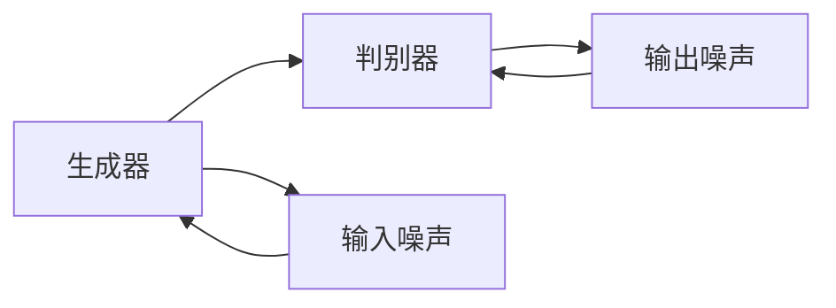
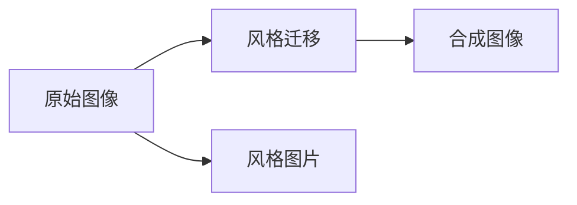
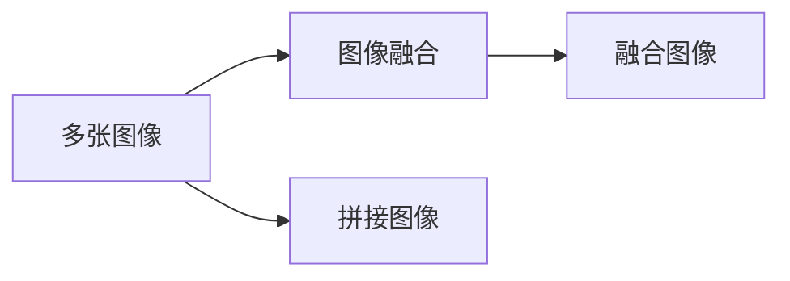
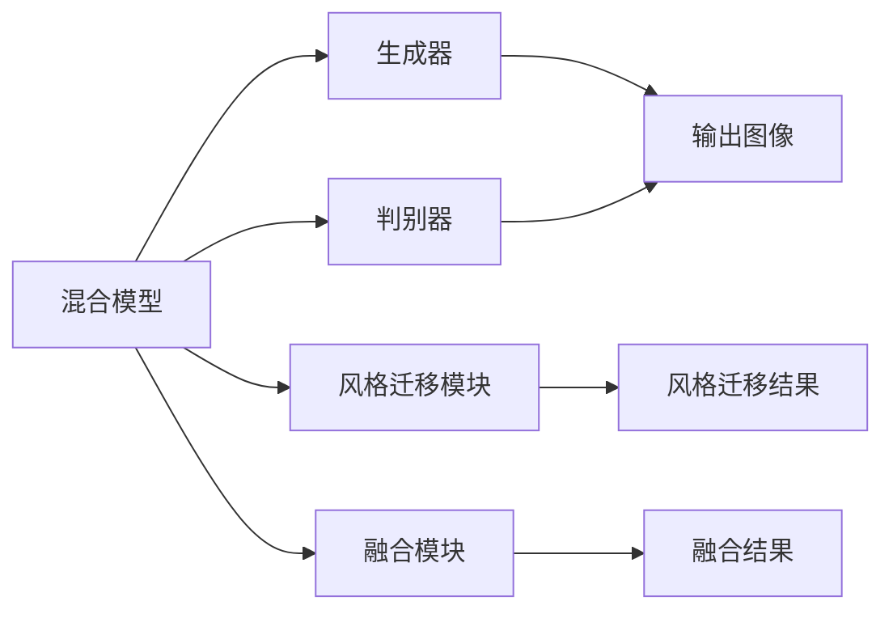

                 

# 基于生成对抗网络的图像风格迁移与融合混合模型

> 关键词：图像风格迁移,生成对抗网络,GANs,图像融合,混合模型,图像处理,深度学习

## 1. 背景介绍

### 1.1 问题由来

图像处理是人工智能领域的一个重要分支，包括图像增强、图像修复、图像生成等多个方向。随着深度学习技术的发展，尤其是生成对抗网络（GANs）的兴起，图像处理领域迎来了新的突破。GANs通过两个神经网络（生成器和判别器）对抗训练，能够生成高质量的合成图像，逐渐成为图像处理的重要工具。

其中，图像风格迁移和图像融合是GANs在图像处理中两个重要的应用方向。图像风格迁移指的是将一张图像的视觉风格转化为另一张图像的视觉风格，如将一幅图片转化为油画风格、素描风格等。而图像融合则是指将多张图像合成为一张图像，从而增强图像的细节信息、色彩信息等，如图像拼接、超分辨率等。这两种技术在艺术创作、电影特效、数字图像处理等领域有着广泛的应用。

然而，现有的图像风格迁移和图像融合方法往往各自独立，缺乏统一的框架和高效的技术手段。本文旨在提出一种基于生成对抗网络的图像风格迁移与融合混合模型，将这两种技术结合起来，提升图像处理的效果和效率。

### 1.2 问题核心关键点

图像风格迁移与融合混合模型的核心关键点在于：

1. **多任务学习**：将图像风格迁移和图像融合两个任务结合起来，共享部分模型参数，从而提升模型效率。
2. **对抗训练**：通过生成器和判别器的对抗训练，生成高质量的合成图像，同时对原始图像进行风格迁移或融合。
3. **混合模型架构**：设计一种新的混合模型架构，包含生成器和融合器两个分支，同时包含风格迁移和融合两个模块。
4. **模型优化**：通过优化算法（如Adam、RMSprop等）对模型进行训练，最大化模型性能。

## 2. 核心概念与联系

### 2.1 核心概念概述

为了更好地理解基于生成对抗网络的图像风格迁移与融合混合模型，本节将介绍几个密切相关的核心概念：

- **生成对抗网络（GANs）**：由生成器（Generator）和判别器（Discriminator）两个神经网络组成的框架，通过对抗训练生成高质量的合成图像。

- **图像风格迁移**：将一张图像的视觉风格转化为另一张图像的视觉风格，如将一幅图片转化为油画风格、素描风格等。

- **图像融合**：将多张图像合成为一张图像，从而增强图像的细节信息、色彩信息等，如图像拼接、超分辨率等。

- **混合模型**：将不同功能模块组合起来形成的新型模型，能够同时处理多个任务，提升模型效率和效果。

- **对抗训练**：通过生成器和判别器的对抗训练，生成高质量的合成图像，同时对原始图像进行风格迁移或融合。

- **多任务学习**：将多个相关任务结合起来，共享部分模型参数，提升模型效率。

这些核心概念之间的逻辑关系可以通过以下Mermaid流程图来展示：

```mermaid
graph TB
    A[生成对抗网络(GANs)] --> B[生成器(Generator)]
    A --> C[判别器(Discriminator)]
    A --> D[图像风格迁移]
    A --> E[图像融合]
    D --> F[风格迁移模块]
    E --> G[融合模块]
    B --> F
    C --> F
    B --> G
    C --> G
```

这个流程图展示了GANs、生成器和判别器的关系，以及风格迁移和图像融合两个任务的关系。

### 2.2 概念间的关系

这些核心概念之间存在着紧密的联系，形成了图像风格迁移与融合混合模型的完整生态系统。下面我通过几个Mermaid流程图来展示这些概念之间的关系。

#### 2.2.1 GANs的基本架构



这个流程图展示了GANs的基本架构，包含生成器和判别器两个神经网络。生成器将输入噪声转化为合成图像，判别器将合成图像与真实图像进行区分。

#### 2.2.2 风格迁移的基本流程



这个流程图展示了图像风格迁移的基本流程，通过将原始图像与风格图片进行融合，生成具有新风格的图像。

#### 2.2.3 图像融合的基本流程



这个流程图展示了图像融合的基本流程，通过将多张图像进行拼接或融合，生成具有更高分辨率和细节的图像。

#### 2.2.4 混合模型架构



这个流程图展示了基于GANs的图像风格迁移与融合混合模型架构，包含生成器和判别器两个分支，同时包含风格迁移和融合两个模块。

## 3. 核心算法原理 & 具体操作步骤

### 3.1 算法原理概述

基于生成对抗网络的图像风格迁移与融合混合模型，本质上是一个多任务学习框架，包含图像风格迁移和图像融合两个任务。其核心思想是通过生成对抗网络（GANs）的对抗训练机制，同时实现图像风格的迁移和图像的融合。

模型的训练过程分为两个阶段：首先是生成器和判别器的对抗训练，生成高质量的合成图像；然后是对图像进行风格迁移或融合。

### 3.2 算法步骤详解

基于生成对抗网络的图像风格迁移与融合混合模型的一般步骤包括：

**Step 1: 准备数据集**

准备图像风格迁移和图像融合所需的数据集，划分为训练集、验证集和测试集。确保数据集的质量和多样性，以提高模型性能。

**Step 2: 设计混合模型架构**

设计基于GANs的图像风格迁移与融合混合模型架构，包含生成器、判别器、风格迁移模块和融合模块。生成器用于生成合成图像，判别器用于判别生成图像的真实性，风格迁移模块用于对图像进行风格迁移，融合模块用于对图像进行融合。

**Step 3: 初始化模型参数**

初始化模型参数，包括生成器、判别器、风格迁移模块和融合模块的权重和偏置。可以使用随机初始化或者预训练的模型参数。

**Step 4: 生成对抗训练**

使用生成器和判别器的对抗训练机制，训练生成器和判别器。生成器尝试生成高质量的合成图像，判别器则尝试区分生成图像和真实图像。训练过程中，判别器的损失函数包括真实图像和生成图像的判别损失，生成器的损失函数包括生成图像的判别损失和风格迁移或融合的损失。

**Step 5: 风格迁移或融合**

对原始图像进行风格迁移或融合。具体过程包括：
1. 将原始图像输入生成器，生成合成图像。
2. 将合成图像输入风格迁移模块，进行风格迁移。
3. 将合成图像输入融合模块，进行图像融合。
4. 将风格迁移或融合后的图像输出，作为最终结果。

**Step 6: 模型优化**

使用优化算法（如Adam、RMSprop等）对模型进行优化，最小化损失函数。训练过程中，需要定期在验证集上评估模型性能，防止过拟合。

**Step 7: 测试评估**

在测试集上评估模型性能，对比模型在不同任务上的表现。可以使用常见的评估指标，如峰值信噪比（PSNR）、结构相似指数（SSIM）等。

以上步骤展示了基于生成对抗网络的图像风格迁移与融合混合模型的一般流程。在实际应用中，还需要根据具体任务进行调整和优化。

### 3.3 算法优缺点

基于生成对抗网络的图像风格迁移与融合混合模型具有以下优点：

1. **多任务处理**：模型能够同时处理图像风格迁移和图像融合两个任务，提升模型效率。
2. **对抗训练机制**：通过生成器和判别器的对抗训练，生成高质量的合成图像，增强模型效果。
3. **混合模型架构**：设计一种新的混合模型架构，包含生成器和融合器两个分支，提升模型灵活性。
4. **高效优化**：通过优化算法对模型进行训练，最大化模型性能。

同时，该方法也存在一些局限性：

1. **训练时间较长**：由于生成器和判别器的对抗训练需要大量的计算资源，训练时间较长。
2. **数据需求较高**：需要大量的高质量数据集，对数据质量和多样性要求较高。
3. **模型复杂度较高**：混合模型包含多个模块，模型结构较为复杂，需要更多的计算资源。
4. **性能依赖数据**：模型的性能依赖于数据集的质量和多样性，数据集的质量不佳可能导致模型性能下降。

尽管存在这些局限性，但就目前而言，基于生成对抗网络的图像风格迁移与融合混合模型仍是一种高效、强大的图像处理技术。

### 3.4 算法应用领域

基于生成对抗网络的图像风格迁移与融合混合模型在多个领域有着广泛的应用，例如：

- **艺术创作**：通过风格迁移，将摄影作品转化为油画、素描等艺术风格，增强艺术作品的审美价值。
- **电影特效**：通过图像融合，将多张画面合成为一张高分辨率、细节丰富的合成图像，用于电影特效制作。
- **医学影像**：通过风格迁移和图像融合，提升医学影像的可视化和分析效果，辅助医生进行诊断和治疗。
- **虚拟现实**：通过风格迁移和图像融合，生成高质量的虚拟环境图像，用于虚拟现实和增强现实应用。
- **广告设计**：通过风格迁移和图像融合，生成符合品牌形象的广告图像，提升广告效果。

除了上述这些领域，基于生成对抗网络的图像风格迁移与融合混合模型还可以应用于图像增强、图像修复、图像生成等多个方向，为图像处理技术带来新的突破。

## 4. 数学模型和公式 & 详细讲解 & 举例说明

### 4.1 数学模型构建

基于生成对抗网络的图像风格迁移与融合混合模型，包含生成器、判别器、风格迁移模块和融合模块。以下是模型的数学模型构建：

1. **生成器（Generator）**：将输入噪声 $z$ 映射为合成图像 $G(z)$。生成器的输入为 $z \in \mathbb{R}^d$，输出为 $G(z) \in \mathbb{R}^{H \times W \times C}$，其中 $H$ 和 $W$ 为图像的尺寸，$C$ 为图像的通道数。

2. **判别器（Discriminator）**：判断输入图像 $x$ 是生成图像还是真实图像。判别器的输入为 $x \in \mathbb{R}^{H \times W \times C}$，输出为 $D(x) \in [0,1]$，其中 $x$ 可以是生成图像 $G(z)$ 或真实图像 $x_r$。

3. **风格迁移模块**：将输入图像 $x$ 转化为具有新风格的图像 $M(x)$。风格迁移模块的输入为 $x \in \mathbb{R}^{H \times W \times C}$，输出为 $M(x) \in \mathbb{R}^{H \times W \times C}$。

4. **融合模块**：将多张图像合成为一张图像。融合模块的输入为 $x_1, x_2, ..., x_n \in \mathbb{R}^{H \times W \times C}$，输出为 $F(x_1, x_2, ..., x_n) \in \mathbb{R}^{H \times W \times C}$。

### 4.2 公式推导过程

以下是基于生成对抗网络的图像风格迁移与融合混合模型的公式推导过程：

1. **生成器损失函数**：生成器的目标是将输入噪声 $z$ 映射为高质量的合成图像 $G(z)$，同时通过判别器 $D$ 学习生成图像的真实性。生成器的损失函数包括判别器的损失函数和生成器的损失函数：

   $$
   \mathcal{L}_G = \mathbb{E}_{z}[\log(1 - D(G(z)))] + \lambda_G \mathbb{E}_{z}[\|\nabla_{z}G(z)\|]
   $$

   其中，第一项为判别器的损失函数，第二项为生成器的损失函数。第二项包含了生成器输出图像的梯度，用于惩罚生成器生成低质量的图像。

2. **判别器损失函数**：判别器的目标是将输入图像 $x$ 分为真实图像 $x_r$ 和生成图像 $G(z)$，同时对判别器进行反向传播训练。判别器的损失函数包括真实图像的判别损失和生成图像的判别损失：

   $$
   \mathcal{L}_D = -\mathbb{E}_{x_r}[\log D(x_r)] - \mathbb{E}_{z}[\log(1 - D(G(z)))]
   $$

   其中，第一项为真实图像的判别损失，第二项为生成图像的判别损失。

3. **风格迁移损失函数**：风格迁移模块的目标是将输入图像 $x$ 转化为具有新风格的图像 $M(x)$。风格迁移模块的损失函数包括生成器损失函数和判别器损失函数：

   $$
   \mathcal{L}_S = \mathbb{E}_{x}[\log(1 - D(M(x)))] + \lambda_S \mathbb{E}_{x}[\|\nabla_{x}M(x)\|]
   $$

   其中，第一项为判别器的损失函数，第二项为生成器的损失函数。第二项包含了生成器输出图像的梯度，用于惩罚生成器生成低质量的图像。

4. **融合损失函数**：融合模块的目标是将多张图像合成为一张图像。融合模块的损失函数包括生成器损失函数和判别器损失函数：

   $$
   \mathcal{L}_F = \mathbb{E}_{x_1, x_2, ..., x_n}[\log(1 - D(F(x_1, x_2, ..., x_n)))]
   $$

   其中，判别器的输入为融合后的图像。

5. **总损失函数**：总损失函数包括生成器损失函数、判别器损失函数、风格迁移损失函数和融合损失函数：

   $$
   \mathcal{L} = \mathcal{L}_G + \mathcal{L}_D + \mathcal{L}_S + \mathcal{L}_F
   $$

### 4.3 案例分析与讲解

为了更好地理解基于生成对抗网络的图像风格迁移与融合混合模型的应用，以下给出几个案例分析：

**案例1: 风格迁移**

给定一张真实图像 $x_r$，使用风格迁移模块将其转化为油画风格。具体步骤如下：

1. 输入图像 $x_r$ 到生成器 $G$，得到合成图像 $G(x_r)$。
2. 将合成图像 $G(x_r)$ 输入风格迁移模块 $M$，得到风格迁移后的图像 $M(G(x_r))$。
3. 输出风格迁移后的图像 $M(G(x_r))$，作为最终结果。

**案例2: 图像融合**

给定多张图像 $x_1, x_2, ..., x_n$，使用融合模块将其合成为一张图像。具体步骤如下：

1. 输入多张图像 $x_1, x_2, ..., x_n$ 到融合器 $F$，得到融合后的图像 $F(x_1, x_2, ..., x_n)$。
2. 输出融合后的图像 $F(x_1, x_2, ..., x_n)$，作为最终结果。

## 5. 项目实践：代码实例和详细解释说明

### 5.1 开发环境搭建

在进行图像风格迁移与融合混合模型的实践前，需要先搭建开发环境。以下是使用Python进行TensorFlow开发的环境配置流程：

1. 安装Anaconda：从官网下载并安装Anaconda，用于创建独立的Python环境。

2. 创建并激活虚拟环境：
```bash
conda create -n tf-env python=3.8 
conda activate tf-env
```

3. 安装TensorFlow：根据CUDA版本，从官网获取对应的安装命令。例如：
```bash
conda install tensorflow -c conda-forge -c pytorch -c pypi
```

4. 安装相关工具包：
```bash
pip install numpy pandas scikit-image scikit-learn matplotlib tqdm jupyter notebook ipython
```

完成上述步骤后，即可在`tf-env`环境中开始模型开发。

### 5.2 源代码详细实现

这里以风格迁移为例，展示如何使用TensorFlow实现基于生成对抗网络的图像风格迁移与融合混合模型。

首先，定义模型的输入和输出：

```python
import tensorflow as tf
from tensorflow.keras.layers import Input, Conv2D, MaxPooling2D, UpSampling2D, Concatenate
from tensorflow.keras.models import Model

# 定义输入
input_img = Input(shape=(256, 256, 3))
style_img = Input(shape=(256, 256, 3))

# 定义生成器
def make_generator():
    def conv_block(x, filters):
        x = Conv2D(filters, 3, strides=1, padding='same', activation='relu')(x)
        x = Conv2D(filters, 3, strides=1, padding='same', activation='relu')(x)
        x = Conv2D(filters, 3, strides=1, padding='same', activation='relu')(x)
        x = Conv2D(filters, 3, strides=1, padding='same', activation='relu')(x)
        x = Conv2D(filters, 3, strides=1, padding='same', activation='relu')(x)
        return x

    x = conv_block(input_img, 64)
    x = MaxPooling2D(pool_size=2, strides=2)(x)
    x = conv_block(x, 128)
    x = MaxPooling2D(pool_size=2, strides=2)(x)
    x = conv_block(x, 256)
    x = MaxPooling2D(pool_size=2, strides=2)(x)
    x = conv_block(x, 512)
    x = MaxPooling2D(pool_size=2, strides=2)(x)
    x = conv_block(x, 1024)
    x = MaxPooling2D(pool_size=2, strides=2)(x)
    x = conv_block(x, 2048)
    x = MaxPooling2D(pool_size=2, strides=2)(x)

    x = UpSampling2D(size=2, strides=2)(x)
    x = conv_block(x, 1024)
    x = UpSampling2D(size=2, strides=2)(x)
    x = conv_block(x, 512)
    x = UpSampling2D(size=2, strides=2)(x)
    x = conv_block(x, 256)
    x = UpSampling2D(size=2, strides=2)(x)
    x = conv_block(x, 128)
    x = UpSampling2D(size=2, strides=2)(x)
    x = conv_block(x, 64)
    x = UpSampling2D(size=2, strides=2)(x)
    x = conv_block(x, 3)
    return x

generator = make_generator()
```

然后，定义判别器和风格迁移模块：

```python
# 定义判别器
def make_discriminator():
    def conv_block(x, filters):
        x = Conv2D(filters, 3, strides=1, padding='same', activation='relu')(x)
        x = Conv2D(filters, 3, strides=1, padding='same', activation='relu')(x)
        x = Conv2D(filters, 3, strides=1, padding='same', activation='relu')(x)
        x = Conv2D(filters, 3, strides=1, padding='same', activation='relu')(x)
        x = Conv2D(filters, 3, strides=1, padding='same', activation='relu')(x)
        return x

    x = conv_block(input_img, 64)
    x = MaxPooling2D(pool_size=2, strides=2)(x)
    x = conv_block(x, 128)
    x = MaxPooling2D(pool_size=2, strides=2)(x)
    x = conv_block(x, 256)
    x = MaxPooling2D(pool_size=2, strides=2)(x)
    x = conv_block(x, 512)
    x = MaxPooling2D(pool_size=2, strides=2)(x)
    x = conv_block(x, 1024)
    x = MaxPooling2D(pool_size=2, strides=2)(x)
    x = conv_block(x, 2048)
    x = MaxPooling2D(pool_size=2, strides=2)(x)
    x = conv_block(x, 4096)
    x = MaxPooling2D(pool_size=2, strides=2)(x)
    x = conv_block(x, 4096)
    x = MaxPooling2D(pool_size=2, strides=2)(x)
    x = conv_block(x, 4096)
    x = MaxPooling2D(pool_size=2, strides=2)(x)
    x = Flatten()(x)
    x = Dense(1, activation='sigmoid')(x)
    return x

discriminator = make_discriminator()
```

最后，定义混合模型并编译：

```python
# 定义风格迁移模块
def make_style_transfer():
    def conv_block(x, filters):
        x = Conv2D(filters, 3, strides=1, padding='same', activation='relu')(x)
        x = Conv2D(filters, 3, strides=1, padding='same', activation='relu')(x)
        x = Conv2D(filters, 3, strides=1, padding='same', activation='relu')(x)
        x = Conv2D(filters, 3, strides=1, padding='same', activation='relu')(x)
        x = Conv2D(filters, 3, strides=1, padding='same', activation='relu')(x)
        return x

    x = conv_block(style_img, 64)
    x = MaxPooling2D(pool_size=2, strides=2)(x)
    x = conv_block(x, 128)
    x = MaxPooling2D(pool_size=2, strides=2)(x)
    x = conv_block(x, 256)
    x = MaxPooling2D(pool_size=2, strides=2)(x)
    x = conv_block(x, 512)
    x = MaxPooling2D(pool_size=2, strides=2)(x)
    x = conv_block(x, 1024)
    x = MaxPooling2D(pool_size=2, strides=2)(x)
    x = conv_block(x, 2048)
    x = MaxPooling2D(pool_size=2, strides=2)(x)
    x = conv_block(x, 4096)
    x = MaxPooling2D(pool_size=2, strides=2)(x)
    x = conv_block(x, 4096)
    x = MaxPooling2D(pool_size=2, strides=2)(x)
    x = conv_block(x, 4096)
    x = MaxPooling2D(pool_size=2, strides=2)(x)
    x = Flatten()(x)
    x = Dense(1, activation='sigmoid')(x)
    return x

style_transfer = make_style_transfer()

# 定义融合模块
def make_fusion():
    def conv_block(x, filters):
        x = Conv2D(filters, 3, strides=1, padding='same', activation='relu')(x)
        x = Conv2D(filters, 3, strides=1, padding='same', activation='relu')(x)
        x = Conv2D(filters, 3, strides=1, padding='same', activation='relu')(x)
        x = Conv2D(filters, 3, strides=1, padding='same', activation='relu')(x)
        x = Conv2D(filters, 3, strides=1, padding='same', activation='relu')(x)
        return x

    x = conv_block(input_img, 64)
    x = MaxPooling2D(pool_size=2, strides=2)(x)
    x = conv_block(x, 128)
    x = MaxPooling2D(pool_size=2, strides=2)(x)
    x = conv_block(x, 256)
    x = MaxPooling2D(pool_size=2, strides=2)(x)
    x = conv_block(x, 512)
    x = MaxPooling2D(pool_size=2, strides=2)(x)
    x = conv_block(x, 1024)
    x = MaxPooling2D(pool_size=2, strides=2)(x)
    x = conv_block(x, 2048)
    x = MaxPooling2D(pool_size=2, strides=2)(x)
    x = conv_block(x, 4096)
    x = MaxPooling2D(pool_size=2, strides=2)(x)
    x = conv_block(x, 4096)
    x = MaxPooling2D(pool_size=2, strides=2)(x)
    x = conv_block(x, 4096)
    x = MaxPooling2D(pool_size=2, strides=2)(x)
    x = Flatten()(x)
    x = Dense(

