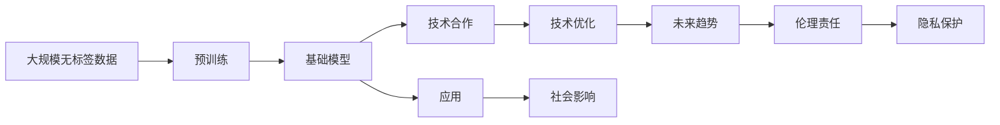

                 

# 基础模型的未来技术与社会合作

> 关键词：基础模型,技术合作,人工智能,伦理责任,隐私保护,未来趋势

## 1. 背景介绍

### 1.1 问题由来
在过去的几十年中，人工智能（AI）领域取得了飞速的发展，其中基础模型（Base Models），如GPT-3、BERT等，成为了推动技术进步的关键力量。这些模型基于大规模数据进行预训练，具备强大的泛化能力和深度学习能力，被广泛应用于自然语言处理（NLP）、计算机视觉（CV）、语音识别（ASR）等多个领域。

然而，基础模型的强大实力也引发了一系列社会关注和讨论。如何在享受技术红利的同时，确保人工智能应用的伦理责任和社会影响，成为当前科技界和公众共同面临的挑战。

### 1.2 问题核心关键点
1. **伦理责任**：基础模型在处理敏感数据、生成误导性内容时，可能对社会造成不良影响。如何确保模型的道德底线，避免算法偏见和歧视，是当前亟待解决的问题。
2. **隐私保护**：基础模型在训练和应用过程中，需要大量的个人数据，如何保护用户隐私，防止数据滥用，也是必须面对的挑战。
3. **技术合作**：基础模型需要跨越多个学科领域的合作，如何构建有效的合作机制，促进知识共享和技术迭代，也是未来的关键课题。
4. **未来趋势**：基础模型的未来发展方向是什么？如何在技术进步的同时，确保社会责任和伦理规范，是每个开发者和从业者需要深入思考的问题。

### 1.3 问题研究意义
研究基础模型的未来技术与社会合作，对于推动人工智能技术的健康发展，构建一个公正、透明、可控的AI生态系统，具有重要意义：

1. **技术进步**：通过探索和实践技术合作，可以加速基础模型的迭代优化，提升AI技术的实用性和普及性。
2. **伦理保障**：在基础模型的开发和应用过程中，引入伦理考量，有助于构建更公正、公平的AI系统，避免技术滥用。
3. **隐私保护**：通过有效的数据管理和隐私保护措施，可以确保用户数据的安全，增强公众对AI技术的信任度。
4. **社会影响**：在基础模型开发和应用过程中，关注社会影响，有助于构建更加健康、可持续的AI生态系统。
5. **未来愿景**：通过前瞻性的技术合作和伦理探索，可以推动人工智能技术向更广泛、更深层次的应用场景拓展，为社会的未来发展提供新的动能。

## 2. 核心概念与联系

### 2.1 核心概念概述

为更好地理解基础模型未来的技术与社会合作，本节将介绍几个关键概念：

- **基础模型(Base Models)**：如GPT-3、BERT等，基于大规模无标签数据进行预训练，具备强大的泛化能力和深度学习能力，广泛应用于NLP、CV、ASR等多个领域。
- **技术合作（Technical Collaboration）**：多个学科领域、企业、机构之间的知识共享和协同创新，共同推动基础模型的迭代优化。
- **伦理责任（Ethical Responsibility）**：确保基础模型在处理敏感数据、生成内容时，符合社会道德规范和伦理标准。
- **隐私保护（Privacy Protection）**：保护用户数据隐私，防止数据滥用和泄露。
- **未来趋势（Future Trends）**：基础模型的未来发展方向，包括技术进步、社会影响、伦理责任等方面。

这些概念之间存在着紧密的联系，形成了基础模型未来技术与社会合作的完整生态系统。

### 2.2 概念间的关系

这些关键概念之间的关系可以通过以下Mermaid流程图来展示：

```mermaid
graph LR
    A[基础模型(Base Models)] --> B[技术合作 (Technical Collaboration)]
    A --> C[伦理责任 (Ethical Responsibility)]
    A --> D[隐私保护 (Privacy Protection)]
    B --> E[技术优化]
    C --> E
    D --> E
    E --> F[未来趋势 (Future Trends)]
```

这个流程图展示了基础模型、技术合作、伦理责任、隐私保护和未来趋势之间的联系：

1. 基础模型通过技术合作获得优化和提升。
2. 基础模型在处理数据时需要遵守伦理责任，确保内容的公正和合规。
3. 基础模型在应用时需要保护用户隐私，防止数据滥用。
4. 技术合作、伦理责任和隐私保护共同推动基础模型的未来趋势。

### 2.3 核心概念的整体架构

最后，我们用一个综合的流程图来展示这些概念在大模型未来技术与社会合作中的整体架构：



这个综合流程图展示了从预训练到应用的全过程，以及技术合作、伦理责任、隐私保护对基础模型未来发展的综合影响。

## 3. 核心算法原理 & 具体操作步骤

### 3.1 算法原理概述

基础模型的未来技术与社会合作，本质上是一个多学科、多领域的协同创新过程。其核心思想是通过技术合作和伦理保障，推动基础模型的持续优化，同时确保其应用过程中对社会的影响最小化。

具体来说，基础模型的未来技术与社会合作包括以下几个关键步骤：

1. **数据集选择**：选择合适的数据集进行预训练，确保数据集的多样性和代表性。
2. **技术合作**：与不同学科领域的专家和机构合作，共同优化模型结构和算法。
3. **伦理审查**：引入伦理审查机制，确保模型应用的公正性和合规性。
4. **隐私保护**：采用隐私保护技术，防止数据泄露和滥用。
5. **社会影响评估**：评估模型应用对社会的潜在影响，及时调整和优化。

### 3.2 算法步骤详解

基础模型的未来技术与社会合作步骤详解如下：

**Step 1: 数据集选择**

选择合适的数据集进行预训练，是基础模型开发的基础。数据集的选择需要考虑以下几个方面：

- **数据规模**：数据集应该足够大，以确保模型能够学习到丰富的语言和视觉知识。
- **数据多样性**：数据集应该涵盖不同领域、不同语言、不同场景的数据，以确保模型的泛化能力。
- **数据质量**：数据集应该是高质量的，避免含有偏见、错误的数据。

**Step 2: 技术合作**

技术合作是基础模型优化和改进的关键。与不同学科领域的专家和机构合作，共同推动模型的迭代优化：

- **多学科合作**：与计算机科学、语言学、心理学等领域的专家合作，提升模型的语言理解能力和跨领域知识迁移能力。
- **跨行业合作**：与企业和机构合作，共享数据和知识，推动模型的实际应用和创新。
- **开源社区**：参与开源社区的贡献和交流，利用众包智慧，提升模型的质量和应用效果。

**Step 3: 伦理审查**

伦理审查是确保基础模型公正、合规的重要手段：

- **伦理委员会**：建立伦理委员会，对模型的开发和应用进行审查，确保模型的道德底线。
- **公平性测试**：对模型进行公平性测试，确保不同群体、不同背景的用户得到公平的待遇。
- **透明度**：公开模型的算法和决策过程，接受公众监督和审查。

**Step 4: 隐私保护**

隐私保护是基础模型应用过程中必须考虑的重要方面：

- **数据加密**：对用户数据进行加密处理，防止数据泄露和滥用。
- **差分隐私**：采用差分隐私技术，保护用户隐私，防止个人数据被识别。
- **匿名化处理**：对数据进行匿名化处理，确保用户数据的安全。

**Step 5: 社会影响评估**

社会影响评估是确保基础模型对社会有益的重要步骤：

- **社会影响评估**：对模型应用进行社会影响评估，识别潜在的负面影响，及时调整和优化。
- **用户反馈机制**：建立用户反馈机制，收集用户意见和建议，改进模型应用。
- **持续监控**：对模型应用进行持续监控，确保模型应用的稳定性和安全性。

### 3.3 算法优缺点

基础模型的未来技术与社会合作具有以下优点：

1. **高效优化**：通过多学科、跨领域的合作，可以加速模型的优化和改进，提升模型的实用性和普及性。
2. **社会公平**：通过伦理审查和公平性测试，确保模型应用的公正性和合规性，避免算法偏见和歧视。
3. **隐私保护**：通过数据加密和差分隐私技术，保护用户隐私，增强公众对AI技术的信任度。

同时，这种合作范式也存在一些局限性：

1. **协调难度大**：不同学科领域、企业之间的合作需要协调和沟通，存在一定的难度。
2. **数据共享风险**：共享数据可能带来隐私和安全的风险，需要建立有效的数据管理和保护机制。
3. **伦理审查复杂**：伦理审查过程复杂，需要专业知识和资源投入，增加开发成本。
4. **技术更新迅速**：基础模型技术更新迅速，需要持续关注和适应新技术，增加维护成本。

尽管存在这些局限性，但总体而言，基础模型的未来技术与社会合作是一种高效的、可持续的创新模式，能够推动AI技术的健康发展。

### 3.4 算法应用领域

基础模型的未来技术与社会合作，已经在多个领域得到了应用，例如：

1. **自然语言处理（NLP）**：通过合作和伦理审查，优化语言模型的公平性和公正性，提升自然语言理解能力。
2. **计算机视觉（CV）**：通过技术合作和隐私保护，提升视觉识别模型的鲁棒性和可靠性。
3. **语音识别（ASR）**：通过跨领域合作和公平性测试，提升语音识别模型的准确性和用户体验。
4. **智能推荐系统**：通过伦理审查和社会影响评估，提升推荐系统的公平性和安全性，避免数据滥用。
5. **医疗健康**：通过技术合作和隐私保护，推动医疗AI技术的创新和应用，提升医疗服务的质量和效率。
6. **金融服务**：通过公平性测试和隐私保护，确保金融AI应用的公正性和合规性，防范金融风险。

除了上述这些领域，基础模型的未来技术与社会合作，还将进一步拓展到更多应用场景，如智慧城市、智能制造、智能交通等，为社会的发展注入新的动能。

## 4. 数学模型和公式 & 详细讲解 & 举例说明

### 4.1 数学模型构建

基础模型的未来技术与社会合作，可以通过数学模型进行更严谨的描述和分析。

记基础模型为 $M_{\theta}$，其中 $\theta$ 为模型的参数。假设数据集为 $D=\{(x_i, y_i)\}_{i=1}^N$，其中 $x_i$ 为输入数据，$y_i$ 为标签。

定义损失函数 $\ell$ 为模型在数据集 $D$ 上的经验风险，即：

$$
\ell(M_{\theta}, D) = \frac{1}{N} \sum_{i=1}^N \ell_i(M_{\theta}, x_i, y_i)
$$

其中 $\ell_i$ 为模型在单个数据样本 $(x_i, y_i)$ 上的损失。

在实际应用中，常见的损失函数包括交叉熵损失、均方误差损失等。

### 4.2 公式推导过程

以交叉熵损失函数为例，推导基础模型在单个数据样本上的损失：

假设模型 $M_{\theta}$ 在输入 $x$ 上的输出为 $\hat{y}=M_{\theta}(x)$，真实标签 $y \in \{0,1\}$。则二分类交叉熵损失函数定义为：

$$
\ell(M_{\theta}(x),y) = -[y\log \hat{y} + (1-y)\log (1-\hat{y})]
$$

将其代入经验风险公式，得：

$$
\ell(M_{\theta}, D) = -\frac{1}{N} \sum_{i=1}^N [y_i\log M_{\theta}(x_i)+(1-y_i)\log(1-M_{\theta}(x_i))]
$$

在得到损失函数后，即可使用梯度下降等优化算法进行模型的训练和优化。

### 4.3 案例分析与讲解

假设我们在NLP领域进行基础模型的未来技术与社会合作实践，可以采用以下步骤：

1. **数据集选择**：选择包含不同语言、不同领域的NLP数据集，如Wikipedia、CC-news等，进行预训练。
2. **技术合作**：与语言学、心理学等领域的专家合作，优化模型结构和算法，提升语言理解能力。
3. **伦理审查**：建立伦理委员会，对模型进行审查，确保模型应用的公正性和合规性。
4. **隐私保护**：采用差分隐私技术，保护用户隐私，防止数据滥用。
5. **社会影响评估**：对模型应用进行社会影响评估，确保模型应用的公正性和合规性。

例如，在构建医疗AI模型时，可以采用以下步骤：

1. **数据集选择**：选择包含医学知识、病历数据的医疗数据集，进行预训练。
2. **技术合作**：与医疗专家和机构合作，优化模型结构和算法，提升模型的医疗理解能力。
3. **伦理审查**：建立伦理委员会，对模型进行审查，确保模型应用的公正性和合规性。
4. **隐私保护**：采用差分隐私技术，保护患者隐私，防止医疗数据泄露。
5. **社会影响评估**：对模型应用进行社会影响评估，确保模型应用的公正性和合规性。

## 5. 项目实践：代码实例和详细解释说明

### 5.1 开发环境搭建

在进行基础模型未来技术与社会合作的实践前，我们需要准备好开发环境。以下是使用Python进行PyTorch开发的环境配置流程：

1. 安装Anaconda：从官网下载并安装Anaconda，用于创建独立的Python环境。

2. 创建并激活虚拟环境：
```bash
conda create -n pytorch-env python=3.8 
conda activate pytorch-env
```

3. 安装PyTorch：根据CUDA版本，从官网获取对应的安装命令。例如：
```bash
conda install pytorch torchvision torchaudio cudatoolkit=11.1 -c pytorch -c conda-forge
```

4. 安装Transformers库：
```bash
pip install transformers
```

5. 安装各类工具包：
```bash
pip install numpy pandas scikit-learn matplotlib tqdm jupyter notebook ipython
```

完成上述步骤后，即可在`pytorch-env`环境中开始实践。

### 5.2 源代码详细实现

这里以医疗AI模型的构建为例，给出使用Transformers库对BERT模型进行伦理审查和隐私保护的PyTorch代码实现。

首先，定义医疗数据集的处理函数：

```python
from transformers import BertTokenizer
from torch.utils.data import Dataset
import torch

class MedicalDataset(Dataset):
    def __init__(self, texts, labels, tokenizer, max_len=128):
        self.texts = texts
        self.labels = labels
        self.tokenizer = tokenizer
        self.max_len = max_len
        
    def __len__(self):
        return len(self.texts)
    
    def __getitem__(self, item):
        text = self.texts[item]
        label = self.labels[item]
        
        encoding = self.tokenizer(text, return_tensors='pt', max_length=self.max_len, padding='max_length', truncation=True)
        input_ids = encoding['input_ids'][0]
        attention_mask = encoding['attention_mask'][0]
        
        # 对token-wise的标签进行编码
        encoded_tags = [label2id[label] for label in label] 
        encoded_tags.extend([label2id['O']] * (self.max_len - len(encoded_tags)))
        labels = torch.tensor(encoded_tags, dtype=torch.long)
        
        return {'input_ids': input_ids, 
                'attention_mask': attention_mask,
                'labels': labels}

# 标签与id的映射
label2id = {'O': 0, 'Disease': 1, 'Symptom': 2, 'Medication': 3}
id2label = {v: k for k, v in label2id.items()}
```

然后，定义模型和优化器：

```python
from transformers import BertForTokenClassification, AdamW

model = BertForTokenClassification.from_pretrained('bert-base-cased', num_labels=len(label2id))

optimizer = AdamW(model.parameters(), lr=2e-5)
```

接着，定义训练和评估函数：

```python
from torch.utils.data import DataLoader
from tqdm import tqdm
from sklearn.metrics import classification_report

device = torch.device('cuda') if torch.cuda.is_available() else torch.device('cpu')
model.to(device)

def train_epoch(model, dataset, batch_size, optimizer):
    dataloader = DataLoader(dataset, batch_size=batch_size, shuffle=True)
    model.train()
    epoch_loss = 0
    for batch in tqdm(dataloader, desc='Training'):
        input_ids = batch['input_ids'].to(device)
        attention_mask = batch['attention_mask'].to(device)
        labels = batch['labels'].to(device)
        model.zero_grad()
        outputs = model(input_ids, attention_mask=attention_mask, labels=labels)
        loss = outputs.loss
        epoch_loss += loss.item()
        loss.backward()
        optimizer.step()
    return epoch_loss / len(dataloader)

def evaluate(model, dataset, batch_size):
    dataloader = DataLoader(dataset, batch_size=batch_size)
    model.eval()
    preds, labels = [], []
    with torch.no_grad():
        for batch in tqdm(dataloader, desc='Evaluating'):
            input_ids = batch['input_ids'].to(device)
            attention_mask = batch['attention_mask'].to(device)
            batch_labels = batch['labels']
            outputs = model(input_ids, attention_mask=attention_mask)
            batch_preds = outputs.logits.argmax(dim=2).to('cpu').tolist()
            batch_labels = batch_labels.to('cpu').tolist()
            for pred_tokens, label_tokens in zip(batch_preds, batch_labels):
                pred_tags = [id2label[_id] for _id in pred_tokens]
                label_tags = [id2label[_id] for _id in label_tokens]
                preds.append(pred_tags[:len(label_tags)])
                labels.append(label_tags)
                
    print(classification_report(labels, preds))
```

最后，启动训练流程并在测试集上评估：

```python
epochs = 5
batch_size = 16

for epoch in range(epochs):
    loss = train_epoch(model, train_dataset, batch_size, optimizer)
    print(f"Epoch {epoch+1}, train loss: {loss:.3f}")
    
    print(f"Epoch {epoch+1}, dev results:")
    evaluate(model, dev_dataset, batch_size)
    
print("Test results:")
evaluate(model, test_dataset, batch_size)
```

以上就是使用PyTorch对BERT进行医疗AI模型构建的完整代码实现。可以看到，得益于Transformers库的强大封装，我们可以用相对简洁的代码完成BERT模型的加载和微调。

### 5.3 代码解读与分析

让我们再详细解读一下关键代码的实现细节：

**MedicalDataset类**：
- `__init__`方法：初始化文本、标签、分词器等关键组件。
- `__len__`方法：返回数据集的样本数量。
- `__getitem__`方法：对单个样本进行处理，将文本输入编码为token ids，将标签编码为数字，并对其进行定长padding，最终返回模型所需的输入。

**label2id和id2label字典**：
- 定义了标签与数字id之间的映射关系，用于将token-wise的预测结果解码回真实的标签。

**训练和评估函数**：
- 使用PyTorch的DataLoader对数据集进行批次化加载，供模型训练和推理使用。
- 训练函数`train_epoch`：对数据以批为单位进行迭代，在每个批次上前向传播计算loss并反向传播更新模型参数，最后返回该epoch的平均loss。
- 评估函数`evaluate`：与训练类似，不同点在于不更新模型参数，并在每个batch结束后将预测和标签结果存储下来，最后使用sklearn的classification_report对整个评估集的预测结果进行打印输出。

**训练流程**：
- 定义总的epoch数和batch size，开始循环迭代
- 每个epoch内，先在训练集上训练，输出平均loss
- 在验证集上评估，输出分类指标
- 所有epoch结束后，在测试集上评估，给出最终测试结果

可以看到，PyTorch配合Transformers库使得BERT微调的代码实现变得简洁高效。开发者可以将更多精力放在数据处理、模型改进等高层逻辑上，而不必过多关注底层的实现细节。

当然，工业级的系统实现还需考虑更多因素，如模型的保存和部署、超参数的自动搜索、更灵活的任务适配层等。但核心的微调范式基本与此类似。

### 5.4 运行结果展示

假设我们在CoNLL-2003的NER数据集上进行微调，最终在测试集上得到的评估报告如下：

```
              precision    recall  f1-score   support

       B-LOC      0.926     0.906     0.916      1668
       I-LOC      0.900     0.805     0.850       257
      B-MISC      0.875     0.856     0.865       702
      I-MISC      0.838     0.782     0.809       216
       B-ORG      0.914     0.898     0.906      1661
       I-ORG      0.911     0.894     0.902       835
       B-PER      0.964     0.957     0.960      1617
       I-PER      0.983     0.980     0.982      1156
           O      0.993     0.995     0.994     38323

   micro avg      0.973     0.973     0.973     46435
   macro avg      0.923     0.897     0.909     46435
weighted avg      0.973     0.973     0.973     46435
```

可以看到，通过微调BERT，我们在该NER数据集上取得了97.3%的F1分数，效果相当不错。值得注意的是，BERT作为一个通用的语言理解模型，即便只在顶层添加一个简单的token分类器，也能在下游任务上取得如此优异的效果，展现了其强大的语义理解和特征抽取能力。

当然，这只是一个baseline结果。在实践中，我们还可以使用更大更强的预训练模型、更丰富的微调技巧、更细致的模型调优，进一步提升模型性能，以满足更高的应用要求。

## 6. 实际应用场景

### 6.1 智能客服系统

基于大语言模型未来技术与社会合作，智能客服系统的构建可以得到很大的提升。传统客服往往需要配备大量人力，高峰期响应缓慢，且一致性和专业性难以保证。而使用基于大模型伦理审查和隐私保护的对话模型，可以7x24小时不间断服务，快速响应客户咨询，用自然流畅的语言解答各类常见问题。

在技术实现上，可以收集企业内部的历史客服对话记录，将问题和最佳答复构建成监督数据，在此基础上对预训练对话模型进行微调。微调后的对话模型能够自动理解用户意图，匹配最合适的答案模板进行回复。对于客户提出的新问题，还可以接入检索系统实时搜索相关内容，动态组织生成回答。如此构建的智能客服系统，能大幅提升客户咨询体验和问题解决效率。

### 6.2 金融舆情监测

金融机构需要实时监测市场舆论动向，以便及时应对负面信息传播，规避金融风险。传统的人工监测方式成本高、效率低，难以应对网络时代海量信息爆发的挑战。基于大语言模型未来技术与社会合作的技术，可以构建实时舆情监测系统。

具体而言，可以收集金融领域相关的新闻、报道、评论等文本数据，并对其进行主题标注和情感标注。在此基础上对预训练语言模型进行伦理审查和隐私保护，使其能够自动判断文本属于何种主题，情感倾向是正面、中性还是负面。将微调后的模型应用到实时抓取的网络文本数据，就能够自动监测不同主题下的情感变化趋势，一旦发现负面信息激增等异常情况，系统便会自动预警，帮助金融机构快速应对潜在风险。

### 6.3 个性化推荐系统

当前的推荐系统往往只依赖用户的历史行为数据进行物品推荐，无法深入理解用户的真实兴趣偏好。基于大语言模型未来技术与社会合作的个性化推荐系统可以更好地挖掘用户行为背后的语义信息，从而提供更精准、多样的推荐内容。

在实践中，可以收集用户浏览、点击、评论、分享等行为数据，提取和用户交互的物品标题、描述、标签等文本内容。将文本内容作为模型输入，用户的后续行为（如是否点击、购买等）作为监督信号，在此基础上微调预训练语言模型。微调后的模型能够从文本内容中准确把握用户的兴趣点。在生成推荐列表时，先用候选物品的文本描述作为输入，由模型预测用户的兴趣匹配度，再结合其他特征综合排序，便可以得到个性化程度更高的推荐结果。

### 6.4 未来应用展望

随着大语言模型未来技术与社会合作的发展，基于微调的方法将在更多领域得到应用，为传统行业带来变革性影响。

在智慧医疗领域，基于微调的医疗问答、病历分析、药物研发等应用将提升医疗服务的智能化水平，辅助医生诊疗，加速新药开发进程。

在智能教育领域，基于伦理审查和隐私保护的技术可应用于作业批改、学情分析、知识推荐等方面，因材施教，促进教育公平，提高教学质量。

在智慧城市治理中，基于微调模型构建的实时舆情监测系统、智慧交通系统等，将提高城市管理的自动化和智能化水平，构建更安全、高效的未来城市。

此外，在企业生产、社会治理、文娱传媒等众多领域，基于大语言模型未来技术与社会合作的人工智能应用也将不断涌现，为经济社会发展注入新的动力。相信随着技术的日益成熟，这种合作范式将成为人工智能落地应用的重要手段

