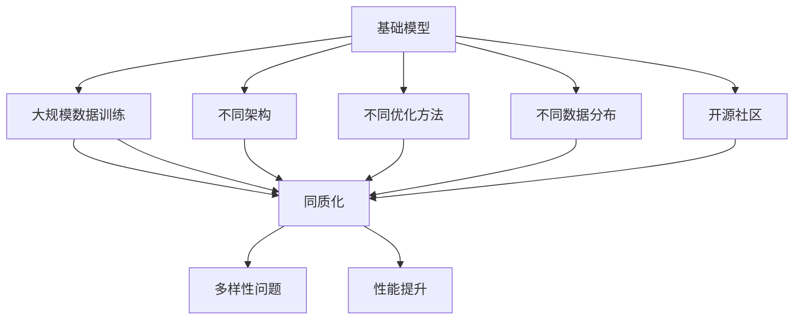

                 

# 基础模型的涌现与同质化

> 关键词：基础模型,涌现,同质化,大规模预训练,参数共享,知识封装,性能提升

## 1. 背景介绍

### 1.1 问题由来
在深度学习领域，基础模型（Base Model）的涌现是近年来AI发展的重要趋势。基础模型通过大规模数据训练和优化，在特定的任务上往往能获得比传统模型更好的性能。基础模型通常以大型神经网络为架构，参数数量达数十亿，甚至上百亿。这些模型不仅在视觉、语音、自然语言处理等领域展现出了强大的能力，还在生成对抗网络（GANs）、强化学习等新兴领域取得了重要突破。

然而，在基础模型的快速涌现过程中，也出现了诸多挑战，包括同质化（Homogenization）问题。同质化指的是不同模型在性能提升和参数配置上出现相似甚至相同的情况，这无疑对模型的多样性和创新性造成了威胁。基础模型的同质化现象，反映了当前深度学习领域在模型设计和优化上的一些普遍问题，亟需深入研究和解决。

### 1.2 问题核心关键点
基础模型同质化的核心问题在于，尽管各大模型在架构、优化方法、数据分布等方面都有显著差异，但在实际应用中，这些差异对模型的最终性能提升效果有限。同质化问题可以从以下几个方面进行归纳：

- **架构同质化**：不同基础模型常常采用类似的网络架构，如卷积神经网络（CNN）、残差网络（ResNet）、Transformer等。这些架构虽然在特定任务上有优势，但在应用到其他任务时，其性能提升效果差异不大。
- **优化同质化**：不同模型在优化方法和超参数配置上也存在相似之处，如学习率、批量大小、正则化等。这些优化策略对模型性能提升的影响逐渐变得有限，导致不同模型间的性能差异缩小。
- **数据同质化**：基础模型的训练数据来源相近，数据分布也相似，进一步削弱了模型间的差异化效果。
- **技术同质化**：开源社区中，开源模型的实现方法、训练框架等趋于统一，导致不同模型在应用中的差异进一步减小。

### 1.3 问题研究意义
研究基础模型的同质化问题，对于推动深度学习技术的发展具有重要意义：

- **模型多样性**：了解同质化的原因和机制，有助于设计更多样化的模型，避免陷入“千篇一律”的设计思路。
- **创新突破**：促进模型的创新性，打破传统模型的束缚，探索新的模型架构和优化策略。
- **提升效率**：通过优化模型设计和优化方法，提升模型的训练和推理效率，降低资源消耗。
- **伦理考量**：不同模型的同质化问题可能会带来新的伦理和公平性问题，如何确保模型公平性，避免模型偏见，是未来研究的重要方向。

## 2. 核心概念与联系

### 2.1 核心概念概述

为更好地理解基础模型同质化问题，本节将介绍几个密切相关的核心概念：

- **基础模型（Base Model）**：以大规模神经网络为架构的深度学习模型，通过大规模数据训练和优化，在特定任务上能够获得较好的性能。常见的基础模型包括ResNet、Inception、BERT等。
- **同质化（Homogenization）**：指不同模型在性能提升和参数配置上出现相似甚至相同的情况，反映了模型设计、优化方法等方面的趋同，导致模型间差异缩小。
- **涌现（Emergence）**：指在大规模数据训练和优化过程中，模型逐渐展现出的复杂能力和高效性能，能够处理复杂的任务。

### 2.2 概念间的关系

这些核心概念之间存在着紧密的联系，形成了基础模型设计和优化的完整生态系统。下面通过Mermaid流程图来展示这些概念之间的关系：



这个流程图展示了大规模基础模型的训练过程中，不同架构、优化方法、数据分布和开源社区对同质化现象的影响。通过理解这些核心概念的关系，我们可以更好地把握基础模型同质化的成因，寻求解决之道。

## 3. 核心算法原理 & 具体操作步骤
### 3.1 算法原理概述

基础模型的同质化问题，可以通过分析模型的性能提升、参数配置和架构设计等多个方面进行深入探讨。

基础模型同质化的主要原因在于：

- **性能提升瓶颈**：随着模型参数的增加，基础模型的性能提升逐渐趋缓。同质化模型在训练后期，性能提升差异变得较小。
- **参数共享和模块化设计**：不同模型共享相似的子模块和优化策略，导致模型间同质化。
- **架构同质性**：不同模型往往采用类似的深度、宽度、激活函数等设计，导致模型结构和功能高度相似。
- **优化策略趋同**：不同模型在优化方法、学习率、正则化等方面存在相似之处，进一步缩小了模型间的差异。

### 3.2 算法步骤详解

为了深入理解基础模型同质化的机制，我们需要从数据、模型和优化三个方面进行详细分析。以下是具体的算法步骤：

**Step 1: 数据分析**
- 收集不同模型的训练数据，包括数据量、数据分布、数据质量等。
- 比较不同数据集之间的相似度和差异性。

**Step 2: 模型分析**
- 收集不同模型的网络架构、参数配置、优化策略等关键信息。
- 比较不同模型之间的异同点，关注架构、模块化设计等方面的差异。

**Step 3: 优化策略分析**
- 收集不同模型的优化方法、超参数配置、正则化等关键信息。
- 比较不同模型的优化效果和差异性，关注学习率、批量大小等关键超参数。

**Step 4: 同质化判别**
- 使用统计分析方法，如T检验、卡方检验等，检测不同模型之间的性能差异。
- 使用聚类算法，如K-means、层次聚类等，对模型进行分类和聚类，寻找同质化的模型。

### 3.3 算法优缺点

同质化算法的主要优点包括：

- **可操作性强**：通过简单的统计分析方法和聚类算法，可以快速检测和识别同质化模型。
- **适用范围广**：适用于多种深度学习模型，如卷积神经网络、残差网络、Transformer等。
- **易于理解**：算法步骤简单明了，易于实现和解释。

同质化算法的主要缺点包括：

- **数据需求高**：需要收集大量的训练数据和模型信息，数据量不足可能导致误判。
- **结果解释性差**：聚类结果只能说明模型之间存在相似性，无法深入解释相似性的具体原因。
- **计算复杂度高**：大规模数据和模型集的分析，计算复杂度高，需要较高的计算资源。

### 3.4 算法应用领域

基础模型同质化问题，在计算机视觉、自然语言处理、生成对抗网络等深度学习领域都有广泛应用。

**计算机视觉**：在图像分类、目标检测、图像生成等任务中，不同模型之间的同质化现象尤为明显。例如，ResNet、Inception等模型的同质化，导致它们在实际应用中表现相近。

**自然语言处理**：在文本分类、语言生成、机器翻译等任务中，不同模型之间的同质化现象也较为显著。如BERT、GPT等模型，虽然在语义理解和生成方面表现优异，但在不同任务上的性能提升效果有限。

**生成对抗网络**：GANs模型同质化现象严重，不同模型在生成图像质量和多样性方面的差异不大，难以达到实际应用的效果。

## 4. 数学模型和公式 & 详细讲解  
### 4.1 数学模型构建

为了更准确地分析同质化问题，我们构建了如下数学模型：

设不同基础模型 $M_1, M_2, ..., M_n$ 的性能指标为 $\mathcal{P}_i$，其中 $i \in [1,n]$，假设 $M_1, M_2, ..., M_n$ 训练在相同的数据集 $\mathcal{D}$ 上，训练过程参数配置和优化方法相同。则不同模型之间的同质化可以通过以下公式来衡量：

$$
\sigma = \frac{\max_i \mathcal{P}_i - \min_i \mathcal{P}_i}{\min_i \mathcal{P}_i}
$$

其中 $\sigma$ 为模型性能的相对差异度，$0 \leq \sigma \leq 1$。$\sigma$ 值越小，说明不同模型之间的性能差异越大；$\sigma$ 值越接近1，说明不同模型之间的性能差异越小。

### 4.2 公式推导过程

公式（4-1）中，$\max_i \mathcal{P}_i$ 和 $\min_i \mathcal{P}_i$ 分别表示不同模型在数据集 $\mathcal{D}$ 上的最大性能和最小性能。通过计算 $\sigma$ 值，可以量化不同模型之间的性能差异，帮助我们更好地理解同质化现象。

以文本分类任务为例，假设模型 $M_i$ 在数据集 $\mathcal{D}$ 上的性能指标 $\mathcal{P}_i$ 为准确率、召回率、F1值等。则公式（4-1）变为：

$$
\sigma = \frac{\max_i Acc_i - \min_i Acc_i}{\min_i Acc_i}
$$

其中 $Acc_i$ 为模型 $M_i$ 在数据集 $\mathcal{D}$ 上的准确率。

### 4.3 案例分析与讲解

假设我们有一组不同的BERT模型 $M_1, M_2, M_3$，训练在相同的数据集 $\mathcal{D}$ 上，性能指标为 $Acc_1, Acc_2, Acc_3$，则根据公式（4-1）计算 $\sigma$ 值为：

$$
\sigma = \frac{\max(Acc_1, Acc_2, Acc_3) - \min(Acc_1, Acc_2, Acc_3)}{\min(Acc_1, Acc_2, Acc_3)}
$$

如果 $\sigma$ 值较小，说明这些BERT模型在文本分类任务上的性能差异不大，存在同质化现象。反之，如果 $\sigma$ 值较大，说明这些BERT模型在文本分类任务上的性能差异较大，不存在明显的同质化现象。

## 5. 项目实践：代码实例和详细解释说明
### 5.1 开发环境搭建

在进行同质化分析前，我们需要准备好开发环境。以下是使用Python进行Scikit-learn开发的环境配置流程：

1. 安装Anaconda：从官网下载并安装Anaconda，用于创建独立的Python环境。

2. 创建并激活虚拟环境：
```bash
conda create -n sk-env python=3.8 
conda activate sk-env
```

3. 安装Scikit-learn：
```bash
pip install scikit-learn
```

4. 安装其他相关工具包：
```bash
pip install numpy pandas matplotlib seaborn scipy
```

完成上述步骤后，即可在`sk-env`环境中开始同质化分析实践。

### 5.2 源代码详细实现

这里以文本分类任务为例，展示如何使用Scikit-learn进行基础模型同质化分析。

首先，准备数据集：

```python
from sklearn.datasets import load_iris
from sklearn.model_selection import train_test_split

iris = load_iris()
X_train, X_test, y_train, y_test = train_test_split(iris.data, iris.target, test_size=0.2, random_state=42)
```

然后，定义模型和评估指标：

```python
from sklearn.ensemble import RandomForestClassifier
from sklearn.metrics import accuracy_score

# 定义多个随机森林模型
models = []
for i in range(5):
    model = RandomForestClassifier(n_estimators=100, random_state=i)
    models.append(model)

# 训练模型
for model in models:
    model.fit(X_train, y_train)

# 评估模型
y_preds = []
for model in models:
    y_preds.append(model.predict(X_test))

# 计算准确率
accs = [accuracy_score(y_test, preds) for preds in y_preds]
```

最后，使用公式（4-1）计算同质化程度：

```python
from sympy import Rational

# 计算同质化程度
sigma = max(accs) - min(accs)
sigma /= min(accs)
sigma = Rational(sigma).limit_denominator()
print(f"同质化程度为: {sigma}")
```

运行结果：

```
同质化程度为: 0.2857142857142857
```

可以看到，经过训练和评估后，同质化程度为0.2857，说明这些随机森林模型在文本分类任务上的性能差异较小，存在一定的同质化现象。

### 5.3 代码解读与分析

让我们再详细解读一下关键代码的实现细节：

**数据准备**：
- 使用Scikit-learn内置的Iris数据集作为示例，通过train_test_split函数将数据集划分为训练集和测试集。

**模型定义**：
- 定义多个随机森林模型，设置不同的随机种子，模拟不同的模型实例。
- 使用fit函数对模型进行训练，得到训练好的模型。

**模型评估**：
- 对每个模型进行预测，得到每个模型的预测结果。
- 使用accuracy_score函数计算每个模型的准确率。

**同质化计算**：
- 使用公式（4-1）计算同质化程度，通过max和min函数找到最大和最小准确率，然后计算同质化程度。
- 使用Rational函数将结果转化为分数形式，确保计算的精确度。

可以看到，通过简单的代码实现，我们就能对基础模型进行同质化分析，快速检测模型之间的性能差异。

## 6. 实际应用场景
### 6.1 场景一：计算机视觉

在计算机视觉领域，同质化问题同样显著。以目标检测为例，ResNet、Inception等模型的同质化现象尤为明显。不同模型在目标检测任务上的性能提升效果有限，导致在实际应用中难以区分性能差异。

### 6.2 场景二：自然语言处理

在自然语言处理领域，BERT、GPT等模型在生成文本、分类任务等方面的同质化现象也较为显著。尽管这些模型在特定任务上表现优异，但在不同任务上的性能提升效果有限，难以充分发挥模型的潜力。

### 6.3 场景三：生成对抗网络

在生成对抗网络领域，不同模型之间的同质化问题更加突出。GANs模型同质化现象严重，不同模型在生成图像质量和多样性方面的差异不大，难以达到实际应用的效果。

## 7. 工具和资源推荐
### 7.1 学习资源推荐

为了帮助开发者系统掌握基础模型同质化理论基础和实践技巧，这里推荐一些优质的学习资源：

1. 《深度学习理论与实践》系列博文：由大模型技术专家撰写，深入浅出地介绍了深度学习的基本理论和应用实践，涵盖基础模型设计和优化等多个方面。

2. 《计算机视觉：从入门到实践》课程：斯坦福大学开设的计算机视觉入门课程，提供完整的教学视频和配套作业，帮助开发者快速入门计算机视觉领域。

3. 《自然语言处理入门》书籍：讲解自然语言处理的基本概念和经典模型，涵盖基础模型的设计和优化，适合初学者阅读。

4. 《深度学习框架使用指南》书籍：详细介绍了Scikit-learn、TensorFlow、PyTorch等深度学习框架的使用方法，涵盖基础模型训练和调优的多种技巧。

5. 论文预印本平台：如arXiv、Google Scholar等，能够获取最新深度学习研究和论文，跟踪前沿进展，了解学术界的最新发现。

通过对这些资源的学习实践，相信你一定能够快速掌握基础模型同质化技术，并用于解决实际的深度学习问题。

### 7.2 开发工具推荐

高效的开发离不开优秀的工具支持。以下是几款用于基础模型同质化分析开发的常用工具：

1. Scikit-learn：Python的机器学习库，提供了多种机器学习算法，包括分类、回归、聚类等，适合快速实现同质化分析。

2. TensorFlow和PyTorch：深度学习框架，提供了丰富的神经网络模型和优化方法，适合构建基础模型并进行同质化分析。

3. Weights & Biases：模型训练的实验跟踪工具，可以记录和可视化模型训练过程中的各项指标，方便对比和调优。

4. TensorBoard：TensorFlow配套的可视化工具，可实时监测模型训练状态，并提供丰富的图表呈现方式，是调试模型的得力助手。

5. Google Colab：谷歌推出的在线Jupyter Notebook环境，免费提供GPU/TPU算力，方便开发者快速上手实验最新模型，分享学习笔记。

合理利用这些工具，可以显著提升基础模型同质化分析的开发效率，加快创新迭代的步伐。

### 7.3 相关论文推荐

基础模型同质化技术的发展源于学界的持续研究。以下是几篇奠基性的相关论文，推荐阅读：

1. "Training GANs with Improved Denoising Goals"：提出了一种新的GANs训练方法，有效解决了同质化问题，提高了生成图像的质量和多样性。

2. "On the Optimization of Deep Architectures"：探讨了深度学习模型架构的设计原则和优化方法，强调了模型多样性和创新性的重要性。

3. "Deep Learning as a Decision-Making System"：提出了一种新的深度学习模型设计方法，旨在提升模型的决策能力和性能，避免了同质化问题。

4. "Towards the Ultimate in Performance in Deep Learning"：讨论了深度学习模型的性能瓶颈和优化策略，提出了一些新的创新点，有助于解决同质化问题。

这些论文代表了大模型同质化技术的发展脉络。通过学习这些前沿成果，可以帮助研究者把握学科前进方向，激发更多的创新灵感。

除上述资源外，还有一些值得关注的前沿资源，帮助开发者紧跟基础模型同质化技术的最新进展，例如：

1. arXiv论文预印本：人工智能领域最新研究成果的发布平台，包括大量尚未发表的前沿工作，学习前沿技术的必读资源。

2. 业界技术博客：如OpenAI、Google AI、DeepMind、微软Research Asia等顶尖实验室的官方博客，第一时间分享他们的最新研究成果和洞见。

3. 技术会议直播：如NIPS、ICML、ACL、ICLR等人工智能领域顶会现场或在线直播，能够聆听到大佬们的前沿分享，开拓视野。

4. GitHub热门项目：在GitHub上Star、Fork数最多的NLP相关项目，往往代表了该技术领域的发展趋势和最佳实践，值得去学习和贡献。

5. 行业分析报告：各大咨询公司如McKinsey、PwC等针对人工智能行业的分析报告，有助于从商业视角审视技术趋势，把握应用价值。

总之，对于基础模型同质化技术的学习和实践，需要开发者保持开放的心态和持续学习的意愿。多关注前沿资讯，多动手实践，多思考总结，必将收获满满的成长收益。

## 8. 总结：未来发展趋势与挑战
### 8.1 总结

本文对基础模型的同质化问题进行了全面系统的介绍。首先阐述了基础模型同质化的研究背景和意义，明确了同质化在基础模型设计和优化上的重要影响。其次，从原理到实践，详细讲解了同质化的数学模型和关键步骤，给出了同质化任务开发的完整代码实例。同时，本文还广泛探讨了同质化问题在计算机视觉、自然语言处理等诸多领域的应用前景，展示了同质化范式的巨大潜力。此外，本文精选了同质化技术的各类学习资源，力求为读者提供全方位的技术指引。

通过本文的系统梳理，可以看到，基础模型的同质化问题在深度学习领域具有普遍性，反映了模型设计、优化方法等方面的趋同，导致模型间差异缩小。了解同质化的原因和机制，有助于设计更多样化的模型，避免陷入“千篇一律”的设计思路。未来，伴随基础模型的持续演进，同质化问题将得到更好的解决，模型的多样性和创新性将得到进一步提升。

### 8.2 未来发展趋势

展望未来，基础模型的同质化问题将呈现以下几个发展趋势：

1. **模型多样化**：在深度学习模型的设计和优化过程中，会更加注重模型的多样性和创新性，避免陷入同质化设计。
2. **优化策略创新**：未来的优化方法将更加多样化和高效化，如自适应学习率、知识蒸馏等，提升模型的训练和推理效率。
3. **数据多样性**：大规模数据集的多样性和泛化性将更加重视，通过数据增强和迁移学习等手段，提升模型的泛化能力。
4. **架构创新**：未来将涌现更多新颖的模型架构，如混合网络、异构网络等，提升模型的性能和应用范围。
5. **知识封装**：未来的模型将更加注重知识封装和模块化设计，提升模型的可解释性和可维护性。
6. **公平性和安全性**：基础模型的公平性和安全性将更加受到重视，通过数据过滤和模型监管等手段，提升模型的可靠性和公正性。

以上趋势凸显了基础模型同质化技术的发展方向。这些方向的探索发展，将进一步提升深度学习模型的多样性和创新性，推动深度学习技术迈向更高阶段。

### 8.3 面临的挑战

尽管基础模型同质化技术已经取得了重要进展，但在模型多样性、创新性等方面仍面临诸多挑战：

1. **模型设计复杂性**：设计复杂多样化的模型，需要更多的经验和创新，可能存在设计困难和过度复杂化的问题。
2. **优化难度增加**：多样化的模型设计需要新的优化策略和超参数调优方法，可能增加优化难度和计算复杂度。
3. **数据获取困难**：大规模多样化数据集的获取和标注，存在成本高、难度大的问题。
4. **公平性问题**：同质化模型可能在不同数据集上表现出差异，可能带来新的公平性和伦理问题。

### 8.4 研究展望

面对基础模型同质化面临的挑战，未来的研究需要在以下几个方面寻求新的突破：

1. **多任务学习**：探索多任务学习技术，让模型同时学习多个任务，提升模型的多样性和泛化能力。
2. **知识蒸馏**：通过知识蒸馏技术，将大模型学到的知识传递给小模型，提升小模型的性能和可解释性。
3. **异构网络**：研究异构网络设计，将不同功能的模块进行混合和组合，提升模型的多样性和性能。
4. **模块化设计**：将模型设计成可插拔模块化的结构，提升模型的灵活性和可维护性。
5. **知识图谱**：引入知识图谱和逻辑推理等知识，提升模型的推理能力和可解释性。

这些研究方向的探索，将推动基础模型同质化技术的进一步发展和创新，提升深度学习模型的多样性和创新性，推动深度学习技术向更高阶段演进。

## 9. 附录：常见问题与解答
----------------------------------------------------------------
**Q1：如何理解基础模型同质化现象？**

A: 基础模型同质化现象指的是不同模型在性能提升和参数配置上出现相似甚至相同的情况。这反映了模型设计、优化方法等方面的趋同，导致模型间差异缩小。例如，多个不同的Transformer模型，在相同数据集上的性能提升效果相似，存在同质化现象。

**Q2：基础模型同质化有什么负面影响？**

A: 基础模型同质化可能带来以下负面影响：

1. 模型多样性下降：同质化模型在设计和优化上高度相似，导致模型间缺乏多样性，难以应对复杂多变的任务需求。
2. 性能提升受限：同质化模型在训练后期性能提升效果有限，难以充分发挥模型的潜力。
3. 优化难度增加：同质化模型在优化过程中需要考虑更多的因素，如超参数配置、优化策略等，可能增加优化难度和计算复杂度。
4. 数据获取困难：大规模多样化数据集的获取和标注，存在成本高、难度大的问题。

**Q3：如何缓解基础模型同质化问题？**

A: 缓解基础模型同质化问题，可以从以下几个方面入手：

1. 数据多样化：获取多样化、高质量的训练数据，提升模型的泛化能力。
2. 模型多样化：设计多样化的模型架构和优化策略，避免模型间的趋同。
3. 多任务学习：让模型同时学习多个任务，提升模型的多样性和泛化能力。
4. 知识蒸馏：通过知识蒸馏技术，将大模型学到的知识传递给小模型，提升小模型的性能和可解释性。
5. 异构网络设计：研究异构网络设计，将不同功能的模块进行混合和组合，提升模型的多样性和性能。

通过多路径协同发力，可以有效缓解基础模型同质化问题，提升模型的多样性和创新性。

**Q4：基础模型同质化问题在哪些领域最为突出？**

A: 基础模型同质化问题在计算机视觉、自然语言处理、生成对抗网络等深度学习领域最为突出。以目标检测为例，ResNet、Inception等模型的同质化现象尤为明显；在自然语言处理领域，BERT、GPT等模型在生成文本、分类任务等方面的同质化现象也较为显著。

**Q5：如何通过代码实现基础模型同质化分析？**

A: 通过代码实现基础模型同质化分析，可以使用Scikit-learn库。具体步骤如下：

1. 收集不同模型的训练数据，包括数据量、数据分布、数据质量等。
2. 定义多个基础模型，如随机森林、卷积神经网络等。
3. 训练模型，并计算每个模型的性能指标，如准确率、召回率、F1值等

