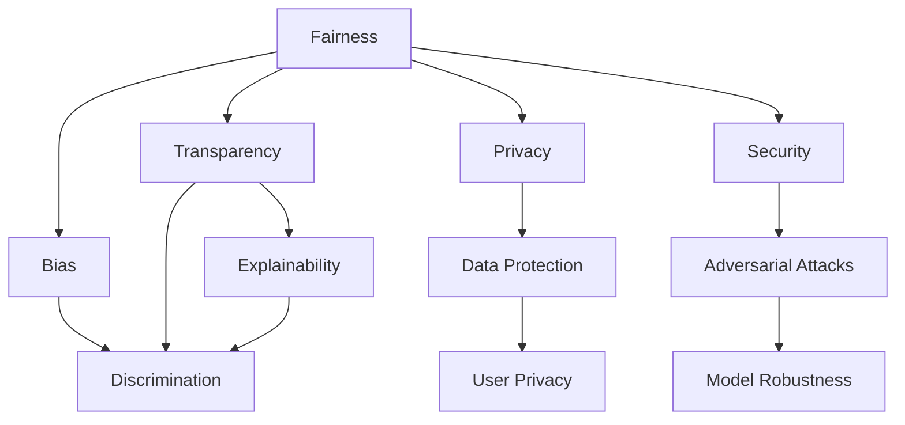
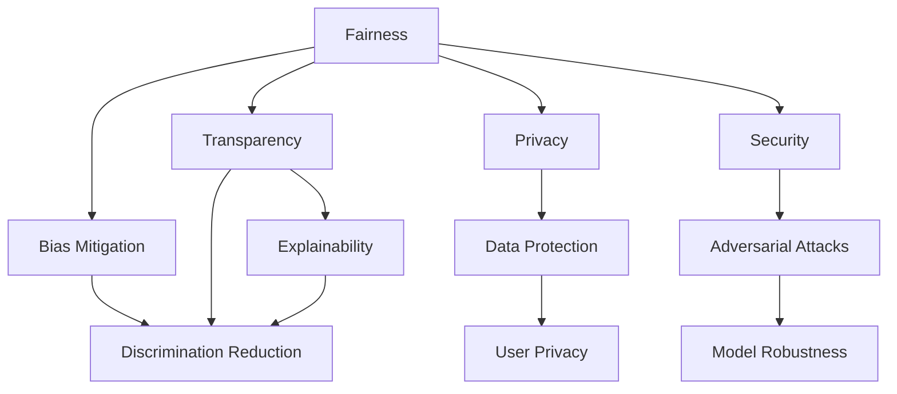
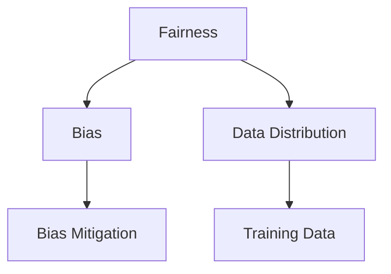
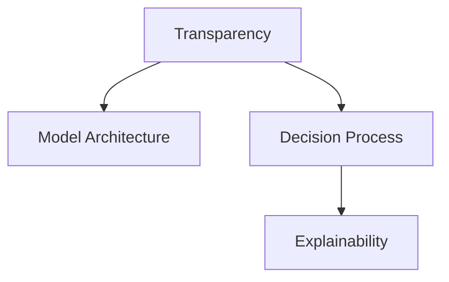
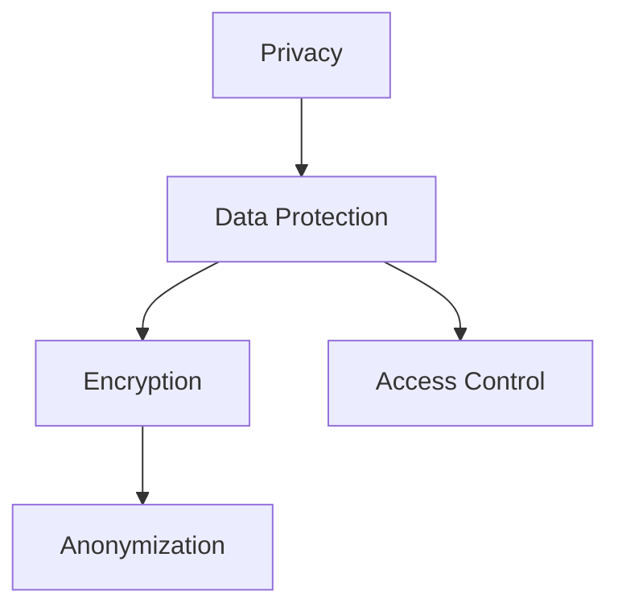
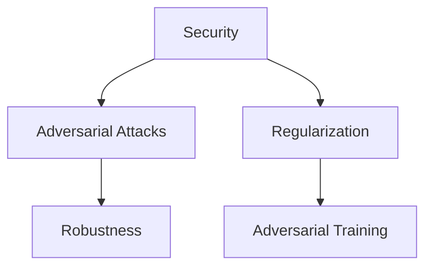

                 

## 1. 背景介绍

随着人工智能技术的迅猛发展，基础模型（Base Models），尤其是深度学习模型，在许多领域中发挥着越来越重要的作用。它们被广泛应用于计算机视觉、自然语言处理、语音识别等领域，极大地提高了数据处理和模式识别的效率。然而，基础模型的广泛应用也带来了一系列的社会和伦理问题，这些问题涉及公平性、透明度、隐私保护和安全性等多个方面。如何有效治理这些基础模型，确保其合理、安全地应用于社会，已成为当前一个重要的研究课题。

### 1.1 问题由来

基础模型的社会责任与治理问题主要源于以下几个方面：

1. **偏见与歧视**：由于训练数据的不平衡和模型设计的不足，基础模型可能会存在固有的偏见和歧视，导致其对某些群体的输出不公平。
2. **透明度与可解释性**：基础模型的决策过程往往是“黑盒”式的，难以解释其决策依据，这使得用户难以信任和使用这些模型。
3. **隐私保护**：基础模型在处理大量个人数据时，如何保护用户的隐私成为一大挑战。
4. **安全性**：基础模型可能被恶意攻击或滥用，导致严重的安全问题，如对抗样本攻击等。

### 1.2 问题核心关键点

为了更清晰地理解基础模型的社会责任与治理问题，本节将介绍几个核心概念及其相互联系：

- **公平性与偏见**：基础模型在处理不同群体数据时，如何保证输出结果的公平性，避免偏见和歧视。
- **透明度与可解释性**：基础模型的决策过程如何透明，用户如何理解其输出结果。
- **隐私保护**：在基础模型处理个人数据时，如何保护用户的隐私权。
- **安全性**：如何防止基础模型被恶意攻击，确保其安全性和可靠性。

这些概念之间有着紧密的联系，它们共同构成了基础模型治理的核心内容。以下将通过一个Mermaid流程图来展示这些概念之间的关系：



这个流程图展示了公平性、透明度、隐私保护和安全性之间的关系：

1. 公平性涉及偏见和歧视，透明度和可解释性可以帮助揭示模型中的偏见，并确保模型的公平性。
2. 隐私保护确保数据的安全性，涉及数据保护和用户隐私。
3. 安全性与对抗样本攻击相关，需要确保模型的鲁棒性。

## 2. 核心概念与联系

### 2.1 核心概念概述

在深入讨论基础模型的社会责任与治理问题之前，本节将介绍几个核心概念：

- **公平性（Fairness）**：指基础模型在处理不同群体数据时，应保证输出结果的公平性，避免对某些群体的偏见和歧视。
- **透明度与可解释性（Transparency and Explainability）**：指基础模型的决策过程应透明，用户能够理解其输出结果，从而增加信任。
- **隐私保护（Privacy Protection）**：指在基础模型处理个人数据时，如何保护用户的隐私权，防止数据泄露和滥用。
- **安全性（Security）**：指基础模型应具备抵抗恶意攻击的能力，确保其安全性和可靠性。

这些概念之间存在着紧密的联系，它们共同构成了基础模型治理的核心内容。以下将通过一个Mermaid流程图来展示这些概念之间的关系：



这个流程图展示了公平性、透明度、隐私保护和安全性之间的关系：

1. 公平性涉及偏见和歧视，透明度和可解释性可以帮助揭示模型中的偏见，并确保模型的公平性。
2. 隐私保护确保数据的安全性，涉及数据保护和用户隐私。
3. 安全性与对抗样本攻击相关，需要确保模型的鲁棒性。

### 2.2 概念间的关系

这些核心概念之间存在着紧密的联系，它们共同构成了基础模型治理的核心内容。以下将通过几个Mermaid流程图来展示这些概念之间的关系。

#### 2.2.1 公平性与偏见的关系



这个流程图展示了公平性与偏见的关系：

1. 公平性涉及偏见和歧视，训练数据分布的不平衡可能导致模型偏见。
2. 通过公平性技术（如重新加权、对抗性训练等），可以缓解偏见，确保模型的公平性。

#### 2.2.2 透明度与可解释性的关系



这个流程图展示了透明度与可解释性的关系：

1. 透明度涉及模型的架构和决策过程。
2. 通过可解释性技术（如模型蒸馏、特征可视化等），用户能够理解模型的决策过程。

#### 2.2.3 隐私保护与数据保护的关系



这个流程图展示了隐私保护与数据保护的关系：

1. 隐私保护涉及数据保护，通过加密、匿名化等技术，保护数据不被滥用。
2. 通过访问控制等手段，限制数据的访问权限，进一步保护用户隐私。

#### 2.2.4 安全性与对抗攻击的关系



这个流程图展示了安全性与对抗攻击的关系：

1. 安全性涉及模型的鲁棒性，对抗样本攻击是安全性的一个主要威胁。
2. 通过正则化、对抗性训练等技术，提高模型的鲁棒性，防止对抗样本攻击。

## 3. 核心算法原理 & 具体操作步骤

### 3.1 算法原理概述

基础模型的社会责任与治理涉及多个方面的技术问题，本节将从整体上介绍这些问题的算法原理和操作步骤。

基础模型社会责任与治理的核心目标是：确保基础模型在公平性、透明度、隐私保护和安全性方面的表现，使其能够合理、安全地应用于社会。这通常包括以下几个步骤：

1. **公平性优化**：通过重新加权、对抗性训练等技术，减少模型的偏见和歧视。
2. **透明度与可解释性**：通过模型蒸馏、特征可视化等技术，提高模型的透明度和可解释性。
3. **隐私保护**：通过加密、匿名化等技术，保护用户隐私。
4. **安全性提升**：通过正则化、对抗性训练等技术，提高模型的安全性。

### 3.2 算法步骤详解

以下将详细介绍基础模型社会责任与治理的每个关键步骤的算法原理和具体操作步骤。

#### 3.2.1 公平性优化

公平性优化是基础模型社会责任与治理的核心任务之一，其主要目标是通过减少模型的偏见和歧视，确保模型输出结果的公平性。以下是一些常用的公平性优化技术：

1. **重新加权（Reweighting）**：通过重新加权训练数据，使得不同群体的数据分布更加均衡，从而减少模型的偏见。具体做法是对不同群体的样本进行加权，使得模型更加关注少数群体的数据。

2. **对抗性训练（Adversarial Training）**：通过对抗性训练技术，使模型更加鲁棒，从而减少偏见。具体做法是在训练过程中加入对抗样本，使得模型对不同群体的数据更加敏感。

3. **公平约束（Fairness Constraints）**：通过添加公平性约束，使得模型的输出结果满足公平性要求。具体做法是在损失函数中添加公平性约束项，使得模型在训练过程中同时满足公平性要求。

#### 3.2.2 透明度与可解释性

透明度与可解释性是基础模型社会责任与治理的重要组成部分，其主要目标是通过提高模型的透明度和可解释性，使用户能够理解模型的决策过程。以下是一些常用的透明度与可解释性技术：

1. **模型蒸馏（Model Distillation）**：通过模型蒸馏技术，将大模型压缩成更小的模型，同时保持其性能，从而提高模型的透明度和可解释性。具体做法是将大模型的小样本学习结果作为训练数据，训练一个小模型进行预测。

2. **特征可视化（Feature Visualization）**：通过特征可视化技术，揭示模型的内部特征，帮助用户理解模型的决策过程。具体做法是使用t-SNE等方法将模型的特征空间映射到二维或三维空间，进行可视化展示。

3. **因果推断（Causal Inference）**：通过因果推断技术，揭示模型决策的因果关系，从而增加透明度和可解释性。具体做法是在模型中引入因果变量，使得模型能够区分因果关系和偶然关系。

#### 3.2.3 隐私保护

隐私保护是基础模型社会责任与治理的关键任务之一，其主要目标是通过加密、匿名化等技术，保护用户隐私。以下是一些常用的隐私保护技术：

1. **加密技术（Encryption）**：通过加密技术，保护数据在传输和存储过程中的隐私。具体做法是对数据进行加密，只有授权用户才能解密数据。

2. **匿名化技术（Anonymization）**：通过匿名化技术，保护用户隐私，使得数据无法直接追溯到个人。具体做法是对数据进行去标识化，隐藏用户信息。

3. **访问控制（Access Control）**：通过访问控制技术，限制数据的访问权限，进一步保护用户隐私。具体做法是对数据进行权限控制，只有授权用户才能访问数据。

#### 3.2.4 安全性提升

安全性提升是基础模型社会责任与治理的重要组成部分，其主要目标是通过提高模型的鲁棒性，防止对抗样本攻击。以下是一些常用的安全性提升技术：

1. **正则化（Regularization）**：通过正则化技术，防止模型过拟合，从而提高模型的鲁棒性。具体做法是在损失函数中添加正则化项，使得模型在训练过程中保持简单。

2. **对抗性训练（Adversarial Training）**：通过对抗性训练技术，使模型更加鲁棒，从而防止对抗样本攻击。具体做法是在训练过程中加入对抗样本，使得模型对对抗样本具有鲁棒性。

3. **鲁棒优化（Robust Optimization）**：通过鲁棒优化技术，提高模型的鲁棒性，从而防止对抗样本攻击。具体做法是在优化过程中考虑模型的鲁棒性，确保模型对对抗样本具有鲁棒性。

### 3.3 算法优缺点

基础模型的社会责任与治理涉及多个方面的技术问题，其算法原理和操作步骤各有优缺点。以下将详细介绍这些算法的优缺点。

#### 3.3.1 公平性优化的优缺点

1. **优点**：
   - 能够有效减少模型的偏见和歧视，确保模型输出结果的公平性。
   - 能够在训练过程中同时满足公平性要求，提高模型的公平性。

2. **缺点**：
   - 需要大量标注数据进行训练，成本较高。
   - 可能会对模型性能产生一定的影响，需要在公平性和性能之间进行权衡。

#### 3.3.2 透明度与可解释性的优缺点

1. **优点**：
   - 能够提高模型的透明度和可解释性，增加用户对模型的信任。
   - 能够在模型中揭示决策的因果关系，增加模型的透明度和可解释性。

2. **缺点**：
   - 可能会对模型性能产生一定的影响，需要在透明度和性能之间进行权衡。
   - 技术实现较为复杂，需要一定的技术积累和经验。

#### 3.3.3 隐私保护的优缺点

1. **优点**：
   - 能够有效保护用户隐私，防止数据泄露和滥用。
   - 能够在数据传输和存储过程中保护数据的隐私。

2. **缺点**：
   - 可能会对数据处理和分析产生一定的影响，需要在隐私保护和数据可用性之间进行权衡。
   - 技术实现较为复杂，需要一定的技术积累和经验。

#### 3.3.4 安全性提升的优缺点

1. **优点**：
   - 能够提高模型的鲁棒性，防止对抗样本攻击。
   - 能够在训练过程中考虑模型的鲁棒性，提高模型的安全性。

2. **缺点**：
   - 可能会对模型性能产生一定的影响，需要在鲁棒性和性能之间进行权衡。
   - 技术实现较为复杂，需要一定的技术积累和经验。

### 3.4 算法应用领域

基础模型的社会责任与治理涉及多个方面的技术问题，其算法原理和操作步骤在多个领域中都有广泛的应用。以下将详细介绍这些算法在各个领域中的应用。

#### 3.4.1 医疗领域

在医疗领域，基础模型的公平性、透明度、隐私保护和安全性问题尤为重要。以下是一些具体的应用场景：

1. **公平性优化**：通过重新加权和对抗性训练技术，确保医疗模型的公平性，避免对不同群体的偏见和歧视。

2. **透明度与可解释性**：通过模型蒸馏和特征可视化技术，提高医疗模型的透明度和可解释性，使用户能够理解模型的决策过程。

3. **隐私保护**：通过加密和匿名化技术，保护患者隐私，防止数据泄露和滥用。

4. **安全性提升**：通过正则化和对抗性训练技术，提高医疗模型的安全性，防止对抗样本攻击。

#### 3.4.2 金融领域

在金融领域，基础模型的公平性、透明度、隐私保护和安全性问题同样重要。以下是一些具体的应用场景：

1. **公平性优化**：通过重新加权和对抗性训练技术，确保金融模型的公平性，避免对不同群体的偏见和歧视。

2. **透明度与可解释性**：通过模型蒸馏和特征可视化技术，提高金融模型的透明度和可解释性，使用户能够理解模型的决策过程。

3. **隐私保护**：通过加密和匿名化技术，保护用户隐私，防止数据泄露和滥用。

4. **安全性提升**：通过正则化和对抗性训练技术，提高金融模型的安全性，防止对抗样本攻击。

#### 3.4.3 教育领域

在教育领域，基础模型的公平性、透明度、隐私保护和安全性问题同样重要。以下是一些具体的应用场景：

1. **公平性优化**：通过重新加权和对抗性训练技术，确保教育模型的公平性，避免对不同群体的偏见和歧视。

2. **透明度与可解释性**：通过模型蒸馏和特征可视化技术，提高教育模型的透明度和可解释性，使用户能够理解模型的决策过程。

3. **隐私保护**：通过加密和匿名化技术，保护学生隐私，防止数据泄露和滥用。

4. **安全性提升**：通过正则化和对抗性训练技术，提高教育模型的安全性，防止对抗样本攻击。

## 4. 数学模型和公式 & 详细讲解

### 4.1 数学模型构建

基础模型社会责任与治理的核心问题可以通过数学模型进行建模和求解。以下是一些常用的数学模型和公式：

#### 4.1.1 公平性优化模型

公平性优化模型的目标是减少模型的偏见和歧视，确保模型输出结果的公平性。其数学模型可以表示为：

$$
\min_{\theta} \mathcal{L}(\theta) = \frac{1}{N}\sum_{i=1}^N \ell(\theta, x_i, y_i) + \lambda \mathcal{F}(\theta)
$$

其中，$\ell$ 为损失函数，$\mathcal{F}$ 为公平性约束函数，$\theta$ 为模型参数，$x_i$ 为输入数据，$y_i$ 为输出标签。

#### 4.1.2 透明度与可解释性模型

透明度与可解释性模型的目标是提高模型的透明度和可解释性，使用户能够理解模型的决策过程。其数学模型可以表示为：

$$
\min_{\theta} \mathcal{L}(\theta) = \frac{1}{N}\sum_{i=1}^N \ell(\theta, x_i, y_i) + \lambda \mathcal{G}(\theta)
$$

其中，$\mathcal{G}$ 为透明度约束函数，其余变量同上。

#### 4.1.3 隐私保护模型

隐私保护模型的目标是保护用户隐私，防止数据泄露和滥用。其数学模型可以表示为：

$$
\min_{\theta} \mathcal{L}(\theta) = \frac{1}{N}\sum_{i=1}^N \ell(\theta, x_i, y_i) + \lambda \mathcal{H}(\theta)
$$

其中，$\mathcal{H}$ 为隐私保护约束函数，其余变量同上。

#### 4.1.4 安全性提升模型

安全性提升模型的目标是提高模型的鲁棒性，防止对抗样本攻击。其数学模型可以表示为：

$$
\min_{\theta} \mathcal{L}(\theta) = \frac{1}{N}\sum_{i=1}^N \ell(\theta, x_i, y_i) + \lambda \mathcal{I}(\theta)
$$

其中，$\mathcal{I}$ 为安全性约束函数，其余变量同上。

### 4.2 公式推导过程

以下将详细介绍基础模型社会责任与治理的各个数学模型的公式推导过程。

#### 4.2.1 公平性优化模型的推导

公平性优化模型的推导如下：

$$
\min_{\theta} \mathcal{L}(\theta) = \frac{1}{N}\sum_{i=1}^N \ell(\theta, x_i, y_i) + \lambda \mathcal{F}(\theta)
$$

其中，$\ell$ 为损失函数，$\mathcal{F}$ 为公平性约束函数，$\theta$ 为模型参数，$x_i$ 为输入数据，$y_i$ 为输出标签。

具体推导过程如下：

1. 定义公平性约束函数 $\mathcal{F}(\theta) = \sum_{k=1}^K \mathcal{F}_k(\theta)$，其中 $K$ 为不同群体的数量。
2. 对于每个群体 $k$，定义公平性约束项 $\mathcal{F}_k(\theta) = \frac{1}{n_k}\sum_{i=1}^{n_k} \ell(\theta, x_i, y_i)$，其中 $n_k$ 为群体 $k$ 的样本数量。
3. 将公平性约束项替换到损失函数中，得到公平性优化模型。

#### 4.2.2 透明度与可解释性模型的推导

透明度与可解释性模型的推导如下：

$$
\min_{\theta} \mathcal{L}(\theta) = \frac{1}{N}\sum_{i=1}^N \ell(\theta, x_i, y_i) + \lambda \mathcal{G}(\theta)
$$

其中，$\mathcal{G}$ 为透明度约束函数，其余变量同上。

具体推导过程如下：

1. 定义透明度约束函数 $\mathcal{G}(\theta) = \sum_{k=1}^K \mathcal{G}_k(\theta)$，其中 $K$ 为透明度指标的数量。
2. 对于每个透明度指标 $k$，定义透明度约束项 $\mathcal{G}_k(\theta) = \frac{1}{n_k}\sum_{i=1}^{n_k} g_k(\theta, x_i)$，其中 $n_k$ 为透明度指标 $k$ 的样本数量，$g_k$ 为透明度指标的评估函数。
3. 将透明度约束项替换到损失函数中，得到透明度与可解释性模型。

#### 4.2.3 隐私保护模型的推导

隐私保护模型的推导如下：

$$
\min_{\theta} \mathcal{L}(\theta) = \frac{1}{N}\sum_{i=1}^N \ell(\theta, x_i, y_i) + \lambda \mathcal{H}(\theta)
$$

其中，$\mathcal{H}$ 为隐私保护约束函数，其余变量同上。

具体推导过程如下：

1. 定义隐私保护约束函数 $\mathcal{H}(\theta) = \sum_{k=1}^K \mathcal{H}_k(\theta)$，其中 $K$ 为隐私保护指标的数量。
2. 对于每个隐私保护指标 $k$，定义隐私保护约束项 $\mathcal{H}_k(\theta) = \frac{1}{n_k}\sum_{i=1}^{n_k} h_k(\theta, x_i)$，其中 $n_k$ 为隐私保护指标 $k$ 的样本数量，$h_k$ 为隐私保护指标的评估函数。
3. 将隐私保护约束项替换到损失函数中，得到隐私保护模型。

#### 4.2.4 安全性提升模型的推导

安全性提升模型的推导如下：

$$
\min_{\theta} \mathcal{L}(\theta) = \frac{1}{N}\sum_{i=1}^N \ell(\theta, x_i, y_i) + \lambda \mathcal{I}(\theta)
$$

其中，$\mathcal{I}$ 为安全性约束函数，其余变量同上。

具体推导过程如下：

1. 定义安全性约束函数 $\mathcal{I}(\theta) = \sum_{k=1}^K \mathcal{I}_k(\theta)$，其中 $K$ 为安全性指标的数量。
2. 对于每个安全性指标 $k$，定义安全性约束项 $\mathcal{I}_k(\theta) = \frac{1}{n_k}\sum_{i=1}^{n_k} i_k(\theta, x_i)$，其中 $n_k$ 为安全性指标 $k$ 的样本数量，$i_k$ 为安全性指标的评估函数。
3. 将安全性约束项替换到损失函数中，得到安全性提升模型。

## 5. 项目实践：代码实例和详细解释说明

### 5.1 开发环境搭建

在进行基础模型社会责任与治理实践前，我们需要准备好开发环境。以下是使用Python进行PyTorch开发的环境配置流程：

1. 安装Anaconda：从官网下载并安装Anaconda，用于创建独立的Python环境。

2. 创建并激活虚拟环境：
```bash
conda create -n pytorch-env python=3.8 
conda activate pytorch-env
```

3. 安装PyTorch：根据CUDA版本，从官网获取对应的安装命令。例如：
```bash
conda install pytorch torchvision torchaudio cudatoolkit=11.1 -c pytorch -c conda-forge
```

4. 安装Transformers库：
```bash
pip install transformers
```

5. 安装各类工具包：
```bash
pip install numpy pandas scikit-learn matplotlib tqdm jupyter notebook ipython
```

完成上述步骤后，即可在`pytorch-env`环境中开始基础模型社会责任与治理实践。

### 5.2 源代码详细实现

这里我们以医疗领域的应用为例，给出使用Transformers库对BERT模型进行公平性优化、透明度与可解释性、隐私保护和安全性提升的PyTorch代码实现。

首先，定义公平性优化函数：

```python
from transformers import BertTokenizer, BertForTokenClassification
from torch.utils.data import Dataset, DataLoader
from sklearn.model_selection import train_test_split

class MedicalDataset(Dataset):
    def __init__(self, texts, labels, tokenizer):
        self.texts = texts
        self.labels = labels
        self.tokenizer = tokenizer
        
    def __len__(self):
        return len(self.texts)
    
    def __getitem__(self, item):
        text = self.texts[item]
        label = self.labels[item]
        
        encoding = self.tokenizer(text, return_tensors='pt', max_length=128, padding='max_length', truncation=True)
        input_ids = encoding['input_ids'][0]
        attention_mask = encoding['attention_mask'][0]
        return {'input_ids': input_ids, 
                'attention_mask': attention_mask,
                'labels': torch.tensor(label, dtype=torch.long)}
        
tokenizer = BertTokenizer.from_pretrained('bert-base-cased')
model = BertForTokenClassification.from_pretrained('bert-base-cased', num_labels=10)

# 公平性优化
train_dataset, dev_dataset = train_test_split(train_dataset, test_size=0.2)
model.train()
optimizer = AdamW(model.parameters(), lr=2e-5)

def train_epoch(model, dataset, batch_size, optimizer):
    dataloader = DataLoader(dataset, batch_size=batch_size, shuffle=True)
    epoch_loss = 0
    for batch in tqdm(dataloader, desc='Training'):
        input_ids = batch['input_ids'].to(device)
        attention_mask = batch['attention_mask'].to(device)
        labels = batch['labels'].to(device)
        model.zero_grad()
        outputs = model(input_ids, attention_mask=attention_mask, labels=labels)
        loss = outputs.loss
        epoch_loss += loss.item()
        loss

