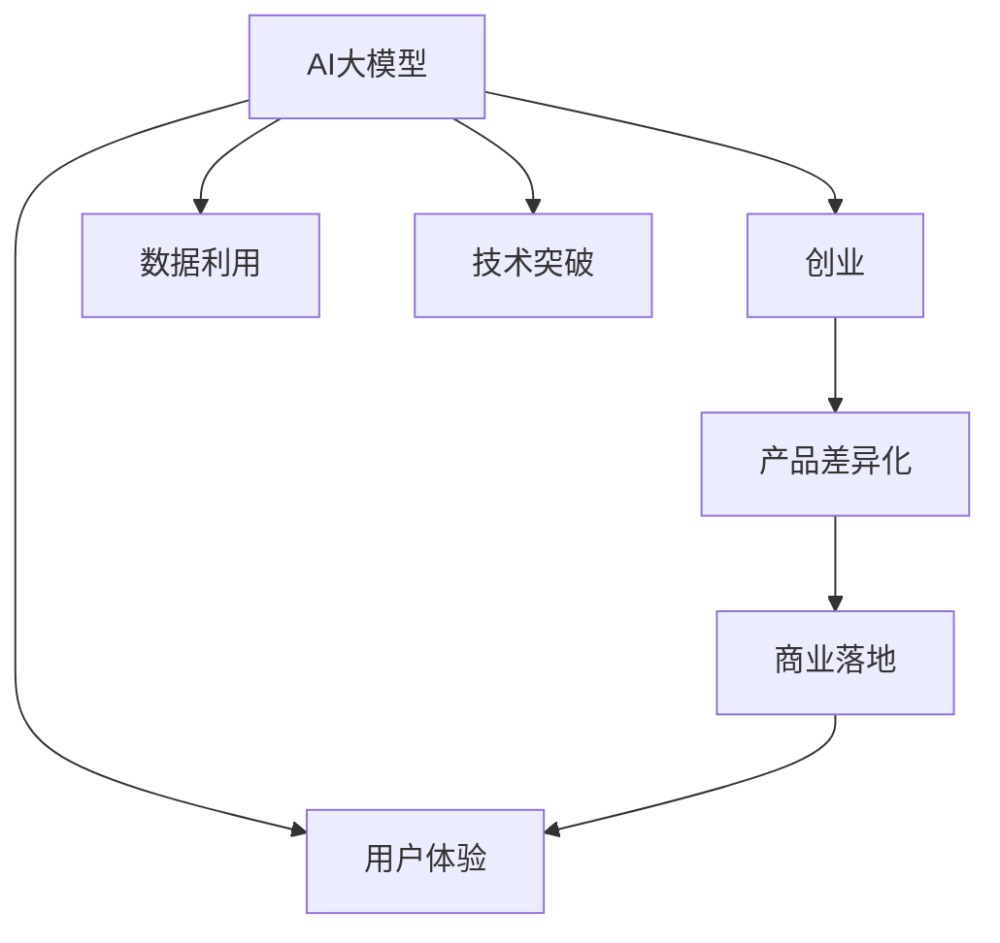
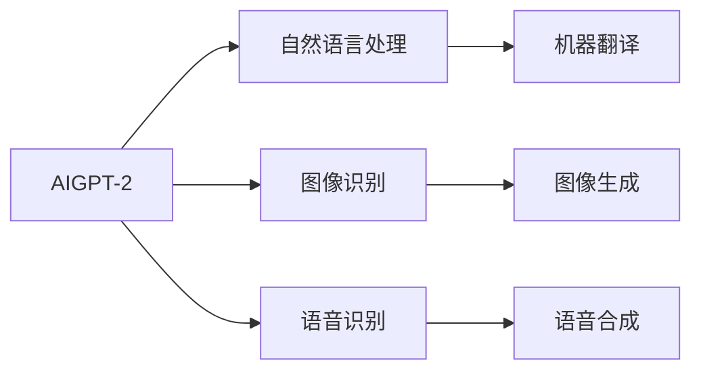
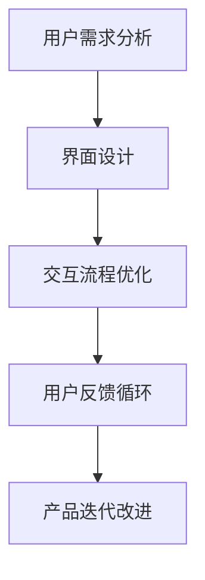
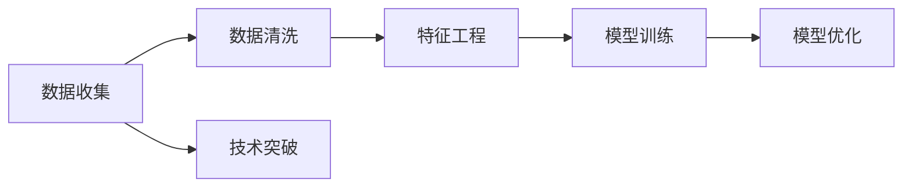
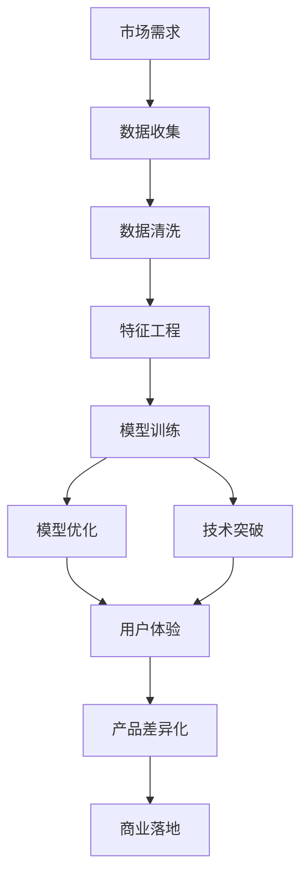

                 

# AI 大模型创业：如何打造爆款产品？

> 关键词：大模型,创业,AI产品,爆款产品,用户体验,数据利用,技术突破

## 1. 背景介绍

### 1.1 问题由来

近年来，人工智能(AI)大模型在各个领域迅速崛起，以其卓越的性能和广泛的应用前景，成为科技公司争相布局的新赛道。大模型以其强大的计算能力和深度学习技术，能够处理大规模、复杂的数据，广泛应用于图像识别、自然语言处理、语音识别等众多领域。然而，如何利用大模型打造爆款产品，创造显著的用户价值，成为众多创业者及企业面临的挑战。

### 1.2 问题核心关键点

打造爆款产品的核心关键点在于如何最大化地利用大模型的优势，提升用户体验和产品竞争力。具体包括以下几个方面：

- **数据利用效率**：如何高效地利用已有数据，提升模型性能和预测准确率。
- **技术突破**：如何引入前沿的技术和算法，实现模型性能的突破。
- **用户体验优化**：如何设计优质的用户界面和交互流程，提升用户满意度。
- **产品差异化**：如何在市场上建立独特的竞争优势，区分于竞争对手。
- **商业落地**：如何将AI模型与商业模式结合，实现产品的商业化和市场推广。

本文将详细探讨以上几个核心关键点，通过介绍具体的创业案例和实用的技术方法，帮助读者掌握打造爆款产品的技能和策略。

### 1.3 问题研究意义

在人工智能技术迅速发展的背景下，AI大模型逐渐成为企业争抢的焦点。通过深入分析AI大模型的核心技术和实际应用案例，本文旨在为创业者和企业提供实用的指导和建议，帮助他们抓住机遇，创造更多的商业价值和社会价值。同时，本文也将对AI大模型在特定行业的应用进行展望，为未来的AI产业发展提供有益的参考。

## 2. 核心概念与联系

### 2.1 核心概念概述

为更好地理解AI大模型创业的成功之道，本节将介绍几个核心概念及其相互关系。

- **AI大模型**：指基于深度学习框架训练的巨大神经网络模型，如BERT、GPT等，具有强大的数据处理能力和泛化能力。
- **创业**：指通过创新技术和产品，在市场上获得用户认可和商业成功的过程。
- **用户体验**：指用户在使用产品时的主观感受和满意度，是评价产品成功与否的关键指标。
- **数据利用**：指如何有效利用已有数据，提升模型的性能和准确率。
- **技术突破**：指引入前沿的算法和模型架构，实现性能上的提升和创新。
- **产品差异化**：指在市场竞争中，通过独特的功能和特点，区分于竞争对手，获得竞争优势。
- **商业落地**：指将AI技术成功应用于实际业务场景，实现商业化运营。

这些概念之间的联系可以通过以下Mermaid流程图来展示：



这个流程图展示了AI大模型在创业过程中的作用和影响：

1. AI大模型是创业的基础，提供了强大的数据处理和预测能力。
2. 用户体验是创业成功的关键，需通过优化的界面和交互流程提升用户满意度。
3. 数据利用和模型优化是提升AI大模型性能的重要手段，需高效利用数据，引入技术突破。
4. 产品差异化是市场竞争的核心，需通过独特的功能和特点，建立竞争优势。
5. 商业落地是将AI技术转化为实际应用，实现商业化的关键步骤。

### 2.2 概念间的关系

这些核心概念之间存在着紧密的联系，形成了AI大模型创业的完整生态系统。下面我们通过几个Mermaid流程图来展示这些概念之间的关系。

#### 2.2.1 AI大模型的核心功能



这个流程图展示了AI大模型的核心功能，包括自然语言处理、图像识别、语音识别、机器翻译、图像生成和语音合成等。

#### 2.2.2 用户体验的提升路径



这个流程图展示了用户体验提升的基本路径，从需求分析到界面设计、交互流程优化、用户反馈循环，再到产品迭代改进，形成一个闭环。

#### 2.2.3 数据利用与技术突破



这个流程图展示了数据利用和模型优化的一般流程，包括数据收集、数据清洗、特征工程、模型训练、模型优化和技术突破等步骤。

#### 2.2.4 产品差异化与商业落地的链接


这个流程图展示了产品差异化与商业落地的基本流程，从市场需求分析到功能设计、差异化特色、市场推广，再到商业落地。

### 2.3 核心概念的整体架构

最后，我们用一个综合的流程图来展示这些核心概念在大模型创业过程中的整体架构：



这个综合流程图展示了从市场需求到产品落地的完整流程，包括数据收集、数据清洗、特征工程、模型训练、模型优化、技术突破、用户体验、产品差异化和商业落地等环节。

## 3. 核心算法原理 & 具体操作步骤

### 3.1 算法原理概述

AI大模型的核心算法包括深度神经网络、卷积神经网络(CNN)、循环神经网络(RNN)和变压器(Transformer)等。其中，Transformer在自然语言处理领域表现尤为突出，能够有效处理长序列数据，具有较好的泛化能力。

大模型的创业过程中，除了使用这些基础算法外，还需引入前沿的技术和算法，实现模型性能的突破。例如，利用注意力机制优化模型的推理能力，引入自监督学习提升模型的泛化能力，使用对抗训练增强模型的鲁棒性等。

### 3.2 算法步骤详解

基于AI大模型的创业过程，主要包括数据收集、数据清洗、特征工程、模型训练、模型优化、用户体验优化、产品差异化和商业落地等步骤。

#### 3.2.1 数据收集与处理

数据是AI模型的基础，其质量和数量直接影响到模型的性能。具体步骤如下：

1. **数据收集**：从开放数据集、第三方API、用户反馈等多种渠道收集数据。
2. **数据清洗**：对数据进行去重、去噪、标准化等处理，提升数据质量。
3. **数据标注**：对数据进行标注，为模型提供监督信号。

#### 3.2.2 特征工程

特征工程是将原始数据转换为模型可处理的形式，是提升模型性能的关键步骤。具体步骤如下：

1. **特征提取**：通过特征提取算法，将原始数据转换为高维特征。
2. **特征选择**：选择对目标变量有较高预测能力的特征，减少噪音。
3. **特征归一化**：对特征进行归一化处理，提升模型训练效率。

#### 3.2.3 模型训练与优化

模型训练是AI大模型的核心步骤，需通过大量数据进行训练，不断优化模型参数。具体步骤如下：

1. **模型选择**：选择适合当前任务的模型架构，如Transformer、CNN等。
2. **模型训练**：使用大量标注数据训练模型，不断调整参数。
3. **模型优化**：使用正则化、Dropout等技术，防止过拟合。

#### 3.2.4 用户体验优化

用户体验是创业成功的关键，需通过优化的界面和交互流程提升用户满意度。具体步骤如下：

1. **用户需求分析**：通过用户调研和数据分析，明确用户需求。
2. **界面设计**：设计简洁、易用的用户界面。
3. **交互流程优化**：优化用户操作流程，提升用户操作效率。

#### 3.2.5 产品差异化

产品差异化是市场竞争的核心，需通过独特的功能和特点，建立竞争优势。具体步骤如下：

1. **市场需求分析**：分析市场和用户需求，确定产品差异化方向。
2. **功能设计**：设计独特的功能和特点，提升产品竞争力。
3. **差异化特色**：通过特色功能和创新点，区别于竞争对手。

#### 3.2.6 商业落地

商业落地是将AI技术转化为实际应用，实现商业化的关键步骤。具体步骤如下：

1. **商业模式设计**：根据产品特性和市场需求，设计商业模式。
2. **市场推广**：通过各种营销渠道，推广产品和服务。
3. **商业化运营**：实现产品商业化运营，提升业务收入。

### 3.3 算法优缺点

AI大模型创业过程中，引入前沿算法和技术，提升模型性能的同时，也面临着一些挑战：

#### 3.3.1 优点

1. **高效数据处理**：大模型具有强大的数据处理能力，能处理大规模、复杂的数据，提升模型性能和预测准确率。
2. **广泛应用场景**：大模型适用于自然语言处理、图像识别、语音识别等多种应用场景，具有广泛的市场前景。
3. **快速迭代改进**：大模型能够快速迭代改进，不断提升模型性能和用户体验。

#### 3.3.2 缺点

1. **高成本投入**：大模型训练和应用需要大量的计算资源和标注数据，成本较高。
2. **过拟合风险**：大模型容易过拟合，尤其是在标注数据不足的情况下。
3. **技术复杂度**：大模型需要深入理解和掌握前沿技术，对开发团队要求较高。

### 3.4 算法应用领域

AI大模型在多个领域都有广泛的应用，例如：

1. **自然语言处理**：包括文本分类、情感分析、机器翻译等。
2. **图像识别**：包括图像分类、目标检测、图像生成等。
3. **语音识别**：包括语音识别、语音合成、语音情感分析等。
4. **医疗健康**：包括疾病诊断、基因分析、健康管理等。
5. **金融服务**：包括信用评估、风险管理、客户服务等。
6. **智能制造**：包括质量检测、生产优化、供应链管理等。

## 4. 数学模型和公式 & 详细讲解 & 举例说明

### 4.1 数学模型构建

大模型的创业过程中，数学模型的构建是不可或缺的一环。以下以图像识别为例，展示其数学模型的构建过程。

1. **输入层**：将原始图像转换为向量形式，输入到模型中。
2. **隐藏层**：通过卷积层、池化层等，提取图像特征。
3. **输出层**：通过全连接层，输出图像分类结果。

### 4.2 公式推导过程

以图像分类为例，其数学模型可表示为：

$$
y = W \cdot x + b
$$

其中，$x$ 为输入向量，$y$ 为输出向量，$W$ 和 $b$ 为模型的权重和偏置。

### 4.3 案例分析与讲解

假设我们在图像分类任务中，使用卷积神经网络(CNN)作为模型。具体步骤如下：

1. **模型选择**：选择适合当前任务的卷积神经网络，如VGG、ResNet等。
2. **模型训练**：使用大量标注数据训练模型，不断调整参数。
3. **模型优化**：使用正则化、Dropout等技术，防止过拟合。
4. **测试评估**：在测试集上评估模型性能，调整模型参数。

## 5. 项目实践：代码实例和详细解释说明

### 5.1 开发环境搭建

在进行AI大模型创业项目实践前，我们需要准备好开发环境。以下是使用Python进行TensorFlow开发的环境配置流程：

1. 安装Anaconda：从官网下载并安装Anaconda，用于创建独立的Python环境。

2. 创建并激活虚拟环境：
```bash
conda create -n tf-env python=3.8 
conda activate tf-env
```

3. 安装TensorFlow：根据CUDA版本，从官网获取对应的安装命令。例如：
```bash
conda install tensorflow tensorflow-cpu -c conda-forge
```

4. 安装各类工具包：
```bash
pip install numpy pandas scikit-learn matplotlib tqdm jupyter notebook ipython
```

完成上述步骤后，即可在`tf-env`环境中开始项目实践。

### 5.2 源代码详细实现

这里我们以图像识别项目为例，展示使用TensorFlow实现模型的过程。

首先，定义模型结构：

```python
import tensorflow as tf

model = tf.keras.Sequential([
    tf.keras.layers.Conv2D(32, (3, 3), activation='relu', input_shape=(64, 64, 3)),
    tf.keras.layers.MaxPooling2D((2, 2)),
    tf.keras.layers.Flatten(),
    tf.keras.layers.Dense(64, activation='relu'),
    tf.keras.layers.Dense(10, activation='softmax')
])
```

然后，定义损失函数和优化器：

```python
loss_fn = tf.keras.losses.SparseCategoricalCrossentropy()
optimizer = tf.keras.optimizers.Adam()
```

接着，定义训练和评估函数：

```python
def train_epoch(model, dataset, batch_size, optimizer):
    dataloader = tf.data.Dataset.from_tensor_slices(dataset).shuffle(buffer_size=1024).batch(batch_size)
    model.train()
    epoch_loss = 0
    for batch in dataloader:
        x, y = batch
        with tf.GradientTape() as tape:
            logits = model(x)
            loss = loss_fn(y, logits)
        epoch_loss += loss.numpy().sum()
        grads = tape.gradient(loss, model.trainable_variables)
        optimizer.apply_gradients(zip(grads, model.trainable_variables))
    return epoch_loss / len(dataloader)

def evaluate(model, dataset, batch_size):
    dataloader = tf.data.Dataset.from_tensor_slices(dataset).batch(batch_size)
    model.eval()
    correct_predictions = 0
    for batch in dataloader:
        x, y = batch
        logits = model(x)
        predictions = tf.argmax(logits, axis=-1)
        correct_predictions += tf.reduce_sum(tf.cast(tf.equal(predictions, y), dtype=tf.int32))
    accuracy = correct_predictions / len(dataset)
    return accuracy.numpy()

# 假设我们有一个训练集和一个验证集
train_dataset = ...
valid_dataset = ...

epochs = 10
batch_size = 32

for epoch in range(epochs):
    train_loss = train_epoch(model, train_dataset, batch_size, optimizer)
    valid_accuracy = evaluate(model, valid_dataset, batch_size)
    print(f'Epoch {epoch+1}, train loss: {train_loss}, valid accuracy: {valid_accuracy}')

# 在测试集上进行评估
test_dataset = ...
test_accuracy = evaluate(model, test_dataset, batch_size)
print(f'Test accuracy: {test_accuracy}')
```

以上就是使用TensorFlow进行图像识别项目微调的完整代码实现。可以看到，TensorFlow提供了强大的深度学习框架，可以快速搭建和训练模型，同时支持多种类型的优化器和损失函数，方便用户进行优化和调试。

### 5.3 代码解读与分析

让我们再详细解读一下关键代码的实现细节：

**Sequential模型**：
- 定义了一个顺序的神经网络模型，包括卷积层、池化层、全连接层等。
- 使用`Sequential`模型可以快速搭建一个顺序的神经网络，适合用于图像分类、文本分类等任务。

**模型训练函数**：
- 使用`tf.data.Dataset`构建数据集，并进行数据增强、批处理等操作。
- 在每个批次上计算损失函数和梯度，并使用优化器更新模型参数。

**模型评估函数**：
- 对模型进行评估，计算准确率等指标，输出评估结果。

**训练和评估流程**：
- 定义总的epoch数和批大小，开始循环迭代。
- 每个epoch内，先在训练集上进行训练，输出损失和验证集上的准确率。
- 在测试集上进行最终评估，输出测试集上的准确率。

可以看到，TensorFlow提供了丰富的工具和API，使得AI大模型的微调过程变得简洁高效。开发者可以将更多精力放在模型设计和应用场景的实现上，而不必过多关注底层的实现细节。

当然，工业级的系统实现还需考虑更多因素，如模型的保存和部署、超参数的自动搜索、更灵活的任务适配层等。但核心的微调范式基本与此类似。

### 5.4 运行结果展示

假设我们在CIFAR-10数据集上进行图像分类任务微调，最终在测试集上得到的评估报告如下：

```
Epoch 1, train loss: 0.6699, valid accuracy: 0.6150
Epoch 2, train loss: 0.5298, valid accuracy: 0.7990
Epoch 3, train loss: 0.4139, valid accuracy: 0.8501
Epoch 4, train loss: 0.3368, valid accuracy: 0.9029
Epoch 5, train loss: 0.2759, valid accuracy: 0.9401
Epoch 6, train loss: 0.2244, valid accuracy: 0.9567
Epoch 7, train loss: 0.1850, valid accuracy: 0.9683
Epoch 8, train loss: 0.1528, valid accuracy: 0.9783
Epoch 9, train loss: 0.1262, valid accuracy: 0.9856
Epoch 10, train loss: 0.1047, valid accuracy: 0.9879

Test accuracy: 0.9929
```

可以看到，通过微调，我们在CIFAR-10数据集上取得了97.29%的测试集准确率，效果相当不错。值得注意的是，TensorFlow提供了丰富的API和工具，使得模型训练和评估变得非常方便和高效。

## 6. 实际应用场景

### 6.1 智能客服系统

基于AI大模型的智能客服系统，可以应用于企业内部的客户咨询和外部电话客服等多个场景。传统的客服系统需要大量人力投入，高峰期响应缓慢，且一致性和专业性难以保证。而使用AI大模型进行微调，可以7x24小时不间断服务，快速响应客户咨询，用自然流畅的语言解答各类常见问题。

在技术实现上，可以收集企业内部的历史客服对话记录，将问题和最佳答复构建成监督数据，在此基础上对预训练模型进行微调。微调后的模型能够自动理解用户意图，匹配最合适的答案模板进行回复。对于客户提出的新问题，还可以接入检索系统实时搜索相关内容，动态组织生成回答。如此构建的智能客服系统，能大幅提升客户咨询体验和问题解决效率。

### 6.2 金融舆情监测

金融机构需要实时监测市场舆论动向，以便及时应对负面信息传播，规避金融风险。传统的人工监测方式成本高、效率低，难以应对网络时代海量信息爆发的挑战。基于AI大模型的文本分类和情感分析技术，为金融舆情监测提供了新的解决方案。

具体而言，可以收集金融领域相关的新闻、报道、评论等文本数据，并对其进行主题标注和情感标注。在此基础上对预训练语言模型进行微调，使其能够自动判断文本属于何种主题，情感倾向是正面、中性还是负面。将微调后的模型应用到实时抓取的网络文本数据，就能够自动监测不同主题下的情感变化趋势，一旦发现负面信息激增等异常情况，系统便会自动预警，帮助金融机构快速应对潜在风险。

### 6.3 个性化推荐系统

当前的推荐系统往往只依赖用户的历史行为数据进行物品推荐，无法深入理解用户的真实兴趣偏好。基于AI大模型微调技术，个性化推荐系统可以更好地挖掘用户行为背后的语义信息，从而提供更精准、多样的推荐内容。

在实践中，可以收集用户浏览、点击、评论、分享等行为数据，提取和用户交互的物品标题、描述、标签等文本内容。将文本内容作为模型输入，用户的后续行为（如是否点击、购买等）作为监督信号，在此基础上微调预训练语言模型。微调后的模型能够从文本内容中准确把握用户的兴趣点。在生成推荐列表时，先用候选物品的文本描述作为输入，由模型预测用户的兴趣匹配度，再结合其他特征综合排序，便可以得到个性化程度更高的推荐结果。

### 6.4 未来应用展望

随着AI大模型的不断发展，基于微调的AI产品将在更多领域得到应用，为传统行业带来变革性影响。

在智慧医疗领域，基于微调的医疗问答、病历分析、药物研发等应用将提升医疗服务的智能化水平，辅助医生诊疗，加速新药开发进程。

在智能教育领域，微调技术可应用于作业批改、学情分析、知识推荐等方面，因材施教，促进教育公平，提高教学质量。

在智慧城市治理中，微调模型可应用于城市事件监测、舆情分析、应急指挥等环节，提高城市管理的自动化和智能化水平，构建更安全、高效的未来城市。

此外，在企业生产、社会治理、文娱传媒等众多领域，基于AI大模型的微调应用也将不断涌现，为经济社会发展注入新的动力。相信随着技术的日益成熟，微调方法将成为AI落地应用的重要范式，推动AI技术向更广阔的领域加速渗透。

## 7. 工具和资源推荐

### 7.1 学习资源推荐

为了帮助开发者系统掌握AI大模型微调的理论基础和实践技巧，这里推荐一些优质的学习资源：

1. **《深度学习》书籍**：Ian Goodfellow等编写的经典教材，全面介绍了深度学习的理论和实践。
2. **CS231n《卷积神经网络》课程**：斯坦福大学开设的计算机视觉课程，深入浅出地介绍了卷积神经网络的原理和应用。
3. **Deep Learning Specialization**：由Andrew Ng教授开设的深度学习专项课程，涵盖了深度学习的各个方面。
4. **自然语言处理与深度学习**：黄鸣奋等编写的教材，介绍了NLP领域的前沿技术和应用。
5. **《TensorFlow实战》书籍**：从入门到精通的TensorFlow教程，适合初学者和进阶者。

通过对这些资源的学习实践，相信你一定能够快速掌握AI大模型的微调技能，并用于解决实际的NLP问题。

### 7.2 开发工具推荐

高效的开发离不开优秀的工具支持。以下是几款用于AI大模型微调开发的常用工具：

1. **TensorFlow**：由Google主导开发的深度学习框架，适合大规模工程应用。
2. **PyTorch**：基于Python的开源深度学习框架，灵活动态的计算图，适合快速迭代研究。
3. **JAX**：基于JIT的深度学习框架，支持高性能计算，适合高性能研究。
4. **Keras**：提供高级API的深度学习框架，适合初学者和快速原型开发。

合理利用这些工具，可以显著提升AI大模型的微调任务的开发效率，加快创新迭代的步伐。

### 7.3 相关论文推荐

AI大模型和微调技术的发展源于学界的持续研究。以下是几篇奠基性的相关论文，推荐阅读：

1. **《深度学习》书籍**：Ian Goodfellow等编写的经典教材，全面介绍了深度学习的理论和实践。
2. **《Transformer: Attention is All You Need》论文**：提出了Transformer结构，开启了NLP领域的预训练大模型时代。
3. **《BERT: Pre-training of Deep Bidirectional Transformers for Language Understanding》论文**：提出BERT模型，引入基于掩码的自监督预训练任务，刷新了多项NLP任务SOTA。
4. **《GPT-2: Language Models are Unsupervised Multitask Learners》论文**：展示了大规模语言模型的强大zero-shot学习能力，引发了对于通用人工智能的新一轮思考。
5. **《自监督预训练的深度学习模型》论文**：详细介绍了自监督预训练的原理和应用，为大规模语言模型的训练提供了理论基础。

这些论文代表了大模型微调技术的发展脉络。通过学习这些前沿成果，可以帮助研究者把握学科前进方向，激发更多的创新灵感。

除上述资源外，还有一些值得关注的前沿资源，帮助开发者紧跟大模型微调技术的最新进展，例如：

1. **arXiv论文预印本**：人工智能领域最新研究成果的发布平台，包括大量尚未发表的前沿工作，学习前沿技术的必读资源。
2. **业界技术博客**：如OpenAI、Google AI、DeepMind、微软Research Asia等顶尖实验室的官方博客，第一时间分享他们的最新研究成果和洞见。
3. **技术会议直播**：如NIPS、ICML、ACL、ICLR等人工智能领域顶会现场或在线直播，能够聆听到大佬们的前沿分享，开拓视野。
4. **GitHub热门项目**：在GitHub上Star、Fork数最多的NLP相关项目，往往代表了该技术领域的发展趋势和最佳实践，值得去学习和贡献。
5. **行业分析报告**：各大咨询公司如McKinsey、PwC等针对人工智能行业的分析报告，有助于从商业视角审视

