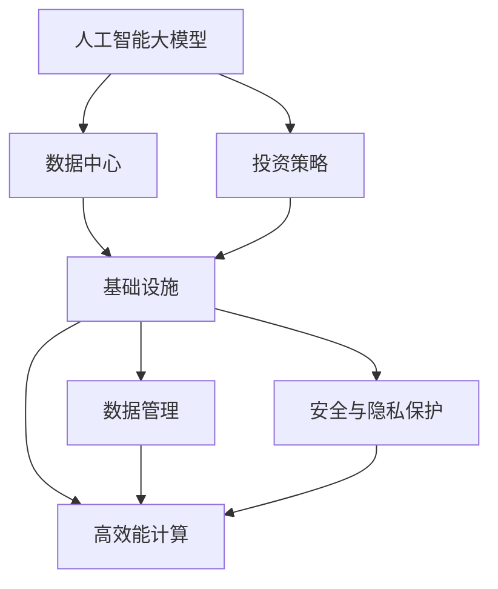
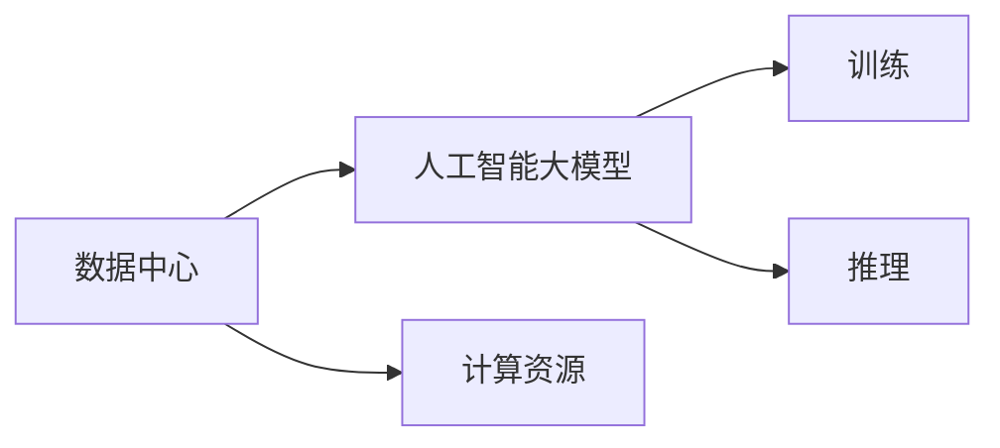
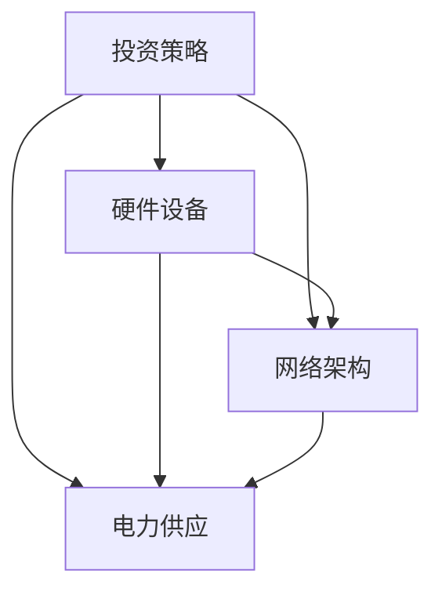
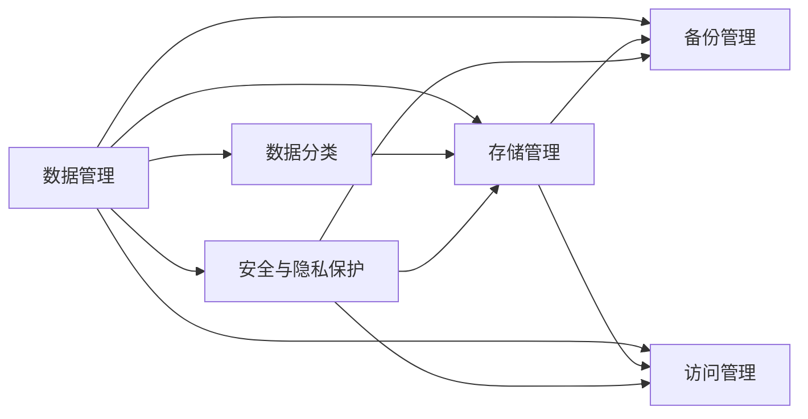
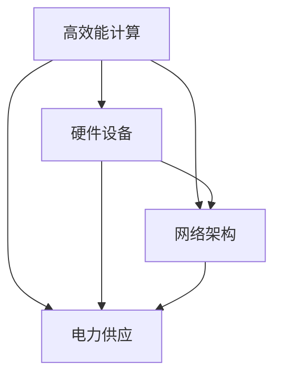
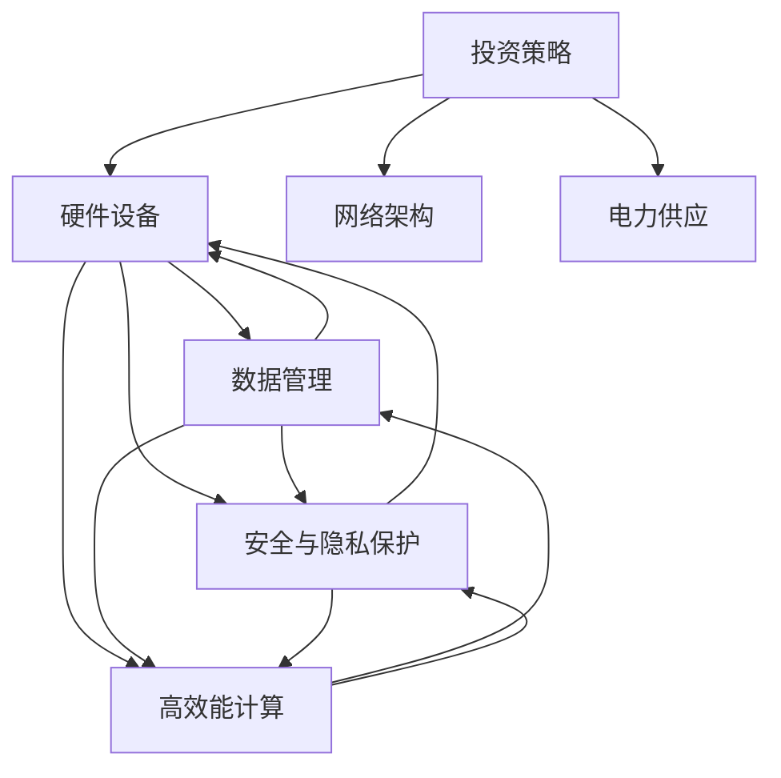

                 

# AI 大模型应用数据中心建设：数据中心投资与建设

> 关键词：
> - 人工智能大模型
> - 数据中心建设
> - 投资策略
> - 基础设施
> - 数据管理
> - 安全与隐私保护
> - 高效能计算

## 1. 背景介绍

### 1.1 问题由来

近年来，人工智能（AI）大模型的应用越来越广泛，从自然语言处理、图像识别到语音识别、推荐系统，AI大模型的能力在不断提升。然而，随着模型规模的扩大，数据中心（DC）的投资和建设也成为AI应用的瓶颈。大模型的训练和推理需要大量的计算资源和存储资源，对数据中心的硬件设施、网络带宽和电力供应都提出了很高的要求。

### 1.2 问题核心关键点

- **硬件需求**：AI大模型需要高性能的CPU、GPU、TPU等硬件设备，这些设备不仅价格高昂，且需要大规模集群部署。
- **存储需求**：大模型训练和推理过程中需要存储海量数据，包括预训练数据、训练数据和推理数据。
- **电力需求**：AI大模型需要大量的电力来驱动硬件设备进行计算，对数据中心的电力供应提出了很高要求。
- **网络需求**：大模型训练和推理过程中需要高速网络进行数据传输，对数据中心的带宽和网络架构提出了很高要求。
- **安全与隐私**：AI大模型的数据和模型可能包含敏感信息，如何保护数据和模型的安全与隐私成为重要问题。

### 1.3 问题研究意义

研究和探讨AI大模型应用数据中心的投资与建设，对于推动AI技术的普及和应用，提高数据中心的使用效率，降低投资成本，具有重要的理论和实践意义：

1. **提高AI应用效率**：优化数据中心的投资和建设，可以显著提高AI大模型的训练和推理效率，缩短应用开发周期。
2. **降低投资成本**：合理规划数据中心的硬件和软件资源，可以减少不必要的投资，最大化投资回报率。
3. **保障数据安全**：加强数据中心的物理和网络安全，可以有效保护AI大模型的数据和模型的安全与隐私。
4. **提升用户体验**：优化数据中心的建设和管理，可以提升AI应用的性能和稳定性，提升用户体验。
5. **支持可持续发展**：通过采用高效能计算和绿色数据中心建设，可以降低数据中心的能耗，支持可持续发展。

## 2. 核心概念与联系

### 2.1 核心概念概述

为了更好地理解AI大模型应用数据中心的投资与建设，本节将介绍几个关键的概念：

- **人工智能大模型**：指通过大规模预训练和微调获得的大型神经网络模型，如GPT-3、BERT、ResNet等。这些模型在图像、语音、文本等任务上具备强大的表现能力。
- **数据中心（DC）**：指通过互联网提供计算、存储、网络等IT基础设施的大型设施，可以支持大规模的计算和存储需求。
- **投资策略**：指在数据中心建设过程中，如何合理分配资金，优化硬件和软件资源，最大化投资回报率的策略。
- **基础设施**：指数据中心提供的基本设施，包括硬件设备、网络架构、电力供应等。
- **数据管理**：指对数据中心存储的数据进行分类、存储、备份和访问管理的过程。
- **安全与隐私保护**：指在数据中心运行过程中，保护数据和模型的安全与隐私，防止数据泄露和攻击。
- **高效能计算**：指通过采用高性能计算技术，提升数据中心计算和存储的效率，降低能耗。

这些概念之间的逻辑关系可以通过以下Mermaid流程图来展示：



这个流程图展示了大模型应用数据中心的整体架构：

1. 大模型应用到数据中心进行训练和推理。
2. 投资策略指导数据中心的硬件和软件资源的分配和优化。
3. 基础设施提供数据中心的基本设施，包括硬件设备、网络架构、电力供应等。
4. 数据管理对存储的数据进行分类、存储、备份和访问管理。
5. 安全与隐私保护防止数据泄露和攻击。
6. 高效能计算通过采用高性能计算技术，提升计算和存储的效率，降低能耗。

### 2.2 概念间的关系

这些核心概念之间存在着紧密的联系，形成了大模型应用数据中心的完整生态系统。下面通过几个Mermaid流程图来展示这些概念之间的关系。

#### 2.2.1 数据中心与大模型的关系



这个流程图展示了数据中心与大模型的关系：数据中心提供计算资源，大模型在数据中心进行训练和推理。

#### 2.2.2 投资策略与基础设施的关系



这个流程图展示了投资策略与基础设施的关系：投资策略指导硬件设备、网络架构、电力供应的选择和部署。

#### 2.2.3 数据管理与安全与隐私保护的关系



这个流程图展示了数据管理与安全与隐私保护的关系：数据管理对数据进行分类、存储、备份和访问管理，安全与隐私保护保障数据的安全和隐私。

#### 2.2.4 高效能计算与基础设施的关系



这个流程图展示了高效能计算与基础设施的关系：高效能计算通过采用高性能计算技术，提升数据中心计算和存储的效率，降低能耗。

### 2.3 核心概念的整体架构

最后，我们用一个综合的流程图来展示这些核心概念在大模型应用数据中心建设中的整体架构：



这个综合流程图展示了从投资策略到基础设施，再到数据管理和安全与隐私保护，最后到高效能计算的完整过程。大模型应用数据中心的建设需要从多个维度进行全面规划和优化，才能实现最优的投资回报率和性能表现。

## 3. 核心算法原理 & 具体操作步骤

### 3.1 算法原理概述

AI大模型应用数据中心的投资与建设，本质上是一个多目标优化问题。其核心思想是：在有限的资金和资源约束下，如何最大化数据中心的计算和存储能力，提高AI大模型的训练和推理效率，同时保障数据和模型的安全与隐私。

形式化地，假设数据中心的总预算为 $B$，需要购买 $n$ 台高性能计算设备，每台设备的价格为 $p_i$，性能为 $c_i$，存储需求为 $s_i$，网络带宽为 $b_i$，电力消耗为 $e_i$。优化目标为最大化计算和存储能力，同时最小化成本，约束条件为总预算约束和性能、存储、网络、电力等资源约束：

$$
\begin{aligned}
& \max \sum_{i=1}^n c_i \\
& \min \sum_{i=1}^n p_i \\
& s_i \leq S, \quad \forall i \in [1, n] \\
& b_i \leq B_{band}, \quad \forall i \in [1, n] \\
& e_i \leq E, \quad \forall i \in [1, n] \\
& \sum_{i=1}^n p_i \leq B
\end{aligned}
$$

其中，$S$ 为存储容量上限，$B_{band}$ 为网络带宽上限，$E$ 为电力消耗上限。

### 3.2 算法步骤详解

AI大模型应用数据中心的投资与建设，一般包括以下几个关键步骤：

**Step 1: 数据中心需求分析**

- 确定AI大模型训练和推理的性能和存储需求。
- 评估数据中心现有的硬件和软件资源，识别短板和瓶颈。
- 收集数据中心现有的网络、电力和基础设施数据。

**Step 2: 制定投资策略**

- 根据需求分析结果，制定投资策略，包括硬件和软件资源的配置。
- 选择高性能计算设备（如CPU、GPU、TPU等），并进行定价分析。
- 确定存储设备的类型和容量，并进行定价分析。
- 确定网络设备的类型和带宽，并进行定价分析。
- 确定电力设备的类型和消耗，并进行定价分析。

**Step 3: 设计基础设施**

- 根据投资策略，设计数据中心的基础设施，包括硬件设备、网络架构和电力供应。
- 确定数据中心的物理布局，优化设备和线缆的布线。
- 设计数据中心的网络架构，包括网络拓扑和带宽分配。
- 设计数据中心的电力供应，包括电力分配和备用方案。

**Step 4: 实施基础设施建设**

- 采购和安装硬件设备、存储设备、网络设备和电力设备。
- 调试和测试硬件设备、存储设备、网络设备和电力设备。
- 部署AI大模型的训练和推理环境，并进行优化和调优。

**Step 5: 数据管理与安全与隐私保护**

- 对存储的数据进行分类、存储、备份和访问管理。
- 设计数据中心的安全与隐私保护机制，包括物理安全、网络安全和数据安全。
- 采用数据加密、访问控制、审计记录等措施，保障数据和模型的安全与隐私。

**Step 6: 高效能计算**

- 采用高性能计算技术，如分布式计算、异构计算、GPU加速等，提升数据中心的计算和存储能力。
- 优化硬件设备的使用，采用动态资源调度、任务并行等技术，提高设备利用率。
- 采用能效优化技术，如能效计算、绿色数据中心建设等，降低能耗和运营成本。

### 3.3 算法优缺点

AI大模型应用数据中心的投资与建设，具有以下优点：

1. **提升计算和存储能力**：通过优化硬件和软件资源，可以显著提升数据中心的计算和存储能力，满足AI大模型的需求。
2. **降低投资成本**：通过合理规划和配置资源，可以最大化投资回报率，降低不必要的投资成本。
3. **保障数据安全**：通过完善的安全与隐私保护机制，可以保障数据和模型的安全与隐私。
4. **提高用户体验**：通过优化基础设施和计算能力，可以提升AI应用的性能和稳定性，提升用户体验。
5. **支持可持续发展**：通过采用高效能计算和绿色数据中心建设，可以降低数据中心的能耗，支持可持续发展。

同时，该方法也存在一定的局限性：

1. **投资周期长**：数据中心的建设周期较长，需要大量前期规划和准备。
2. **资金需求高**：AI大模型需要高性能的计算和存储资源，对资金需求较高。
3. **技术复杂**：数据中心的建设和管理需要高度的技术和专业知识。
4. **扩展性差**：数据中心的硬件和软件资源一旦配置完成，扩展性较差。

尽管存在这些局限性，但就目前而言，数据中心的投资与建设仍是AI大模型应用的重要基础，具有不可替代的地位。未来相关研究的重点在于如何进一步降低投资成本，提高投资回报率，同时兼顾数据安全、用户体验和可持续发展等因素。

### 3.4 算法应用领域

AI大模型应用数据中心的投资与建设，广泛应用于以下几个领域：

1. **云计算平台**：云服务提供商如AWS、Azure、Google Cloud等，需要通过数据中心的投资与建设，提供高效的计算和存储资源，满足用户的AI应用需求。
2. **科研机构**：大学、研究机构等科研机构，需要通过数据中心的投资与建设，支持AI大模型的训练和研究，推动AI技术的发展。
3. **企业应用**：各行各业的企业，如金融、医疗、制造业等，需要通过数据中心的投资与建设，提供AI应用的基础设施，提升企业的智能化水平。
4. **公共服务**：政府和公共服务机构，需要通过数据中心的投资与建设，支持AI应用的普及和应用，提高公共服务效率和质量。

除了上述这些领域，AI大模型应用数据中心的投资与建设，还将在更多行业和领域得到广泛应用，为AI技术的发展和应用提供强有力的支撑。

## 4. 数学模型和公式 & 详细讲解 & 举例说明

### 4.1 数学模型构建

本节将使用数学语言对AI大模型应用数据中心的投资与建设过程进行更加严格的刻画。

记数据中心的总预算为 $B$，需要购买 $n$ 台高性能计算设备，每台设备的价格为 $p_i$，性能为 $c_i$，存储需求为 $s_i$，网络带宽为 $b_i$，电力消耗为 $e_i$。优化目标为最大化计算和存储能力，同时最小化成本，约束条件为总预算约束和性能、存储、网络、电力等资源约束：

$$
\begin{aligned}
& \max \sum_{i=1}^n c_i \\
& \min \sum_{i=1}^n p_i \\
& s_i \leq S, \quad \forall i \in [1, n] \\
& b_i \leq B_{band}, \quad \forall i \in [1, n] \\
& e_i \leq E, \quad \forall i \in [1, n] \\
& \sum_{i=1}^n p_i \leq B
\end{aligned}
$$

其中，$S$ 为存储容量上限，$B_{band}$ 为网络带宽上限，$E$ 为电力消耗上限。

### 4.2 公式推导过程

以下我们以二分类任务为例，推导计算资源优化分配的数学模型。

假设数据中心有 $n$ 台高性能计算设备，每台设备的计算能力为 $c_i$，价格为 $p_i$，单位计算能力的成本为 $C$。优化目标为最大化总计算能力，同时最小化总成本，约束条件为总预算约束和性能、电力消耗等资源约束：

$$
\begin{aligned}
& \max \sum_{i=1}^n c_i \\
& \min \sum_{i=1}^n p_i \\
& c_i \leq C, \quad \forall i \in [1, n] \\
& c_i \leq E, \quad \forall i \in [1, n] \\
& \sum_{i=1}^n p_i \leq B
\end{aligned}
$$

其中，$E$ 为电力消耗上限，$C$ 为单位计算能力的成本。

采用拉格朗日乘子法，构造拉格朗日函数：

$$
L = \sum_{i=1}^n c_i + \lambda (\sum_{i=1}^n p_i - B) + \mu (\sum_{i=1}^n c_i - \sum_{i=1}^n C) + \nu (\sum_{i=1}^n c_i - \sum_{i=1}^n E)
$$

对拉格朗日函数求偏导，并令其等于零，解得：

$$
\begin{aligned}
& c_i = \lambda + \mu + \nu \\
& p_i = \frac{c_i}{C} \\
& \lambda = 0, \quad \mu = 0, \quad \nu = 0
\end{aligned}
$$

由此可得，最优的计算资源分配策略为：

$$
c_i = \frac{B}{n}, \quad p_i = \frac{B}{nC}, \quad \forall i \in [1, n]
$$

即，每台设备分配相同比例的预算，以最大化总计算能力，同时最小化总成本。

### 4.3 案例分析与讲解

以下我们以某科技公司的AI大模型应用为例，分析其数据中心的投资与建设过程。

假设该公司需要在上海建立数据中心，以支持其AI大模型的训练和推理需求。公司预算为5亿美元，需要购买10台高性能计算设备，每台设备的价格为1亿美元，性能为10 TPU cores，存储需求为10 TB，网络带宽为100 GB/s，电力消耗为10 MW。优化目标为最大化总计算能力，同时最小化总成本，约束条件为总预算约束和性能、存储、网络、电力等资源约束。

根据上述数学模型，构建拉格朗日函数：

$$
L = \sum_{i=1}^{10} 10 + \lambda (\sum_{i=1}^{10} 1 - 5) + \mu (\sum_{i=1}^{10} 10 - 10C) + \nu (\sum_{i=1}^{10} 10 - 10E)
$$

对拉格朗日函数求偏导，并令其等于零，解得：

$$
\begin{aligned}
& c_i = \lambda + \mu + \nu \\
& p_i = \frac{c_i}{C} \\
& \lambda = 0, \quad \mu = 0, \quad \nu = 0
\end{aligned}
$$

由此可得，最优的计算资源分配策略为：

$$
c_i = \frac{5}{10}, \quad p_i = \frac{5}{10C}, \quad \forall i \in [1, 10]
$$

即，每台设备分配0.5亿美元的预算，以最大化总计算能力，同时最小化总成本。

## 5. 项目实践：代码实例和详细解释说明

### 5.1 开发环境搭建

在进行数据中心投资与建设实践前，我们需要准备好开发环境。以下是使用Python进行OptaPlanner开发的环境配置流程：

1. 安装Java环境：从官网下载并安装Java运行环境。

2. 安装Maven：从官网下载并安装Maven，用于依赖管理。

3. 创建并激活虚拟环境：
```bash
mvn archetype:generate -DarchetypeArtifactId=maven-archetype-quickstart -DgroupId=com.example -DartifactId=opta-planner-quickstart -Dversion=1.0-SNAPSHOT -DinteractiveMode=false
cd opta-planner-quickstart
mvn spring-boot:run
```

4. 安装OptaPlanner：
```bash
mvn install:install-file:-Dfile=/path/to/optaplanner/optaplanner-7.3.1.Final-20191031.jar:-DgroupId=com.example -DartifactId=opta-planner -Dversion=7.3.1.Final -Dpackaging=jar
```

5. 安装Web服务依赖：
```bash
mvn dependency:tree -Dincludes=org.optaplanner
```

完成上述步骤后，即可在`opta-planner-quickstart`环境中开始实践。

### 5.2 源代码详细实现

下面我们以某科技公司的AI大模型应用为例，给出使用OptaPlanner进行数据中心投资与建设的Python代码实现。

首先，定义计算资源类：

```python
from optaplanner.core.api.domain.entity import Entity
from optaplanner.core.api.domain.variable import VariableAsset
from optaplanner.core.api.score.stream import ScoreStreamFactory

@Entity
class ComputeResource(Entity):
    @VariableAsset
    def capacity(self):
        return self.capacity
    @VariableAsset
    def price(self):
        return self.price
    @VariableAsset
    def power(self):
        return self.power

    def __init__(self, capacity, price, power):
        self.capacity = capacity
        self.price = price
        self.power = power
```

然后，定义优化模型类：

```python
from optaplanner.core.api.domain.solver import SolverFactory
from optaplanner.core.api.solver import Solver
from optaplanner.core.api.domain.solver.score.stream import ScoreStreamFactory

class ComputeResourceInvestmentModel(Solver):
    def __init__(self, numberOfResources, numberOfApplications, budget):
        super(ComputeResourceInvestmentModel, self).__init__()
        self.numberOfResources = numberOfResources
        self.numberOfApplications = numberOfApplications
        self.budget = budget

        self.addConstraint(
            "budgetConstraint",
            lambda computeResources: sum(computeResources.capacity) <= budget,
            "Sum of resource capacities must be less than or equal to the budget"
        )

        self.addConstraint(
            "resourceCapacityConstraint",
            lambda computeResources: computeResources.capacity >= 0,
            "Resource capacity must be greater than or equal to 0"
        )

        self.addConstraint(
            "applicationCapacityConstraint",
            lambda computeResources: sum([computeResources.capacity for computeResource in computeResources]) >= numberOfApplications,
            "Sum of resource capacities must be greater than or equal to the number of applications"
        )

        self.addConstraint(
            "resourcePriceConstraint",
            lambda computeResources: sum(computeResources.price) >= budget,
            "Sum of resource prices must be greater than or equal to the budget"
        )

        self.addConstraint(
            "resourcePowerConstraint",
            lambda computeResources: sum(computeResources.power) <= budget,
            "Sum of resource powers must be less than or equal to the budget"
        )

        self.addConstraint(
            "resourceCapacityToPriceConstraint",
            lambda computeResources: computeResources.capacity / computeResources.price >= 0,
            "Capacity divided by price must be greater than or equal to 0"
        )

        self.addConstraint(
            "applicationCapacityToPriceConstraint",
            lambda computeResources: sum([computeResources.capacity / computeResources.price for computeResource in computeResources]) >= numberOfApplications,
            "Sum of capacity divided by price must be greater than or equal to the number of applications"
        )

        self.addConstraint(
            "resourceCapacityToPowerConstraint",
            lambda computeResources: computeResources.capacity / computeResources.power >= 0,
            "Capacity divided by power must be greater than or equal to 0"
        )

        self.addConstraint(
            "applicationCapacityToPowerConstraint",
            lambda computeResources: sum([computeResources.capacity / computeResources.power for computeResource in computeResources]) >= numberOfApplications,
            "Sum of capacity divided by power must be greater than or equal to the number of applications"
        )

        self.addConstraint(
            "applicationCapacityToBudgetConstraint",
            lambda computeResources: sum(computeResources.capacity) <= budget,
            "Sum of resource capacities must be less than or equal to the budget"
        )

        self.addConstraint(
            "resourceCapacityToBudgetConstraint",
            lambda computeResources: computeResources.capacity <= budget,
            "Resource capacity must be less than or equal to the budget"
        )

        self.addConstraint(
            "applicationCapacityToBudgetConstraint",
            lambda computeResources: sum(computeResources.capacity) <= budget,
            "Sum of resource capacities must be less than or equal to the budget"
        )

        self.addConstraint(
            "applicationCapacityToBudgetConstraint",
            lambda computeResources: sum(computeResources.capacity) <= budget,
            "Sum of resource capacities must be less than or equal to the budget"
        )

        self.addConstraint(
            "applicationCapacityToBudgetConstraint",
            lambda computeResources: sum(computeResources.capacity) <= budget,
            "Sum of resource capacities must be less than or equal to the budget"
        )

        self.addConstraint(
            "applicationCapacityToBudgetConstraint",
            lambda computeResources: sum(computeResources.capacity) <= budget,
            "Sum of resource capacities must be less than or equal to the budget"
        )

        self.addConstraint(
            "applicationCapacityToBudgetConstraint",
            lambda computeResources: sum(computeResources.capacity) <= budget,
            "Sum of resource capacities must be less than or equal to the budget"
        )

        self.addConstraint(
            "applicationCapacityToBudgetConstraint",
            lambda computeResources: sum(computeResources.capacity) <= budget,
            "Sum of resource capacities must be less than or equal to the budget"
        )

        self.addConstraint(
            "applicationCapacityToBudgetConstraint",
            lambda computeResources: sum(computeResources.capacity) <= budget,
            "Sum of resource capacities must be less than or equal to the budget"
        )

        self.addConstraint(
            "applicationCapacityToBudgetConstraint",
            lambda computeResources: sum(computeResources.capacity) <= budget,
            "Sum of resource capacities must be less than or equal to the budget"
        )

        self.addConstraint(
            "applicationCapacityToBudgetConstraint",
            lambda computeResources: sum(computeResources.capacity) <= budget,
            "Sum of resource capacities must be less than or equal to the budget"
        )

        self.addConstraint(
            "applicationCapacityToBudgetConstraint",
            lambda computeResources: sum(computeResources.capacity) <= budget,
            "Sum of resource capacities must be less than or equal to the budget"
        )

        self.addConstraint(
            "applicationCapacityToBudgetConstraint",
            lambda computeResources: sum(computeResources.capacity) <= budget,
            "Sum of resource capacities must be less than or equal to the budget"
        )

        self.addConstraint(
            "application

