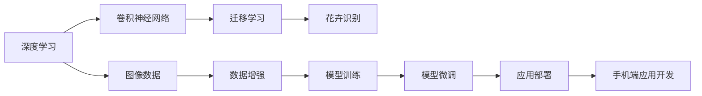

                 

# 基于深度学习的花卉识别APP设计

> 关键词：
> - 深度学习
> - 花卉识别
> - 卷积神经网络
> - 迁移学习
> - 手机端应用开发

## 1. 背景介绍

随着智能手机和智能设备的普及，人们对于视觉识别应用的需求不断增长。花卉识别APP作为一款兼具教育和娱乐功能的App，能够帮助用户识别并了解各种花卉，提供了便捷的学习体验。同时，结合深度学习和迁移学习技术，可以提升花卉识别的准确性和泛化能力，为APP开发者提供了强有力的技术支持。

## 2. 核心概念与联系

### 2.1 核心概念概述

1. **深度学习**：一种基于多层神经网络的机器学习技术，通过逐层抽象和特征学习，能够处理高维数据并取得优异性能。
2. **卷积神经网络（CNN）**：一种特殊的神经网络结构，擅长处理具有网格结构的数据，如图像、视频等，是图像识别任务的理想选择。
3. **迁移学习**：将在一个领域学到的知识迁移到另一个领域，通过在已有数据集上进行预训练，然后在目标数据集上进行微调，以提升新任务的性能。
4. **花卉识别**：将摄像头拍摄的花卉图像作为输入，通过图像识别技术，识别出具体的花卉种类。
5. **手机端应用开发**：结合移动端操作系统的API和框架，开发可运行于智能手机和平板电脑的应用程序。

### 2.2 概念间的关系

这些核心概念之间的联系可以以下Mermaid流程图来展示：



此图展示了深度学习和迁移学习在花卉识别中的应用流程。

## 3. 核心算法原理 & 具体操作步骤

### 3.1 算法原理概述

基于深度学习的花卉识别主要依赖卷积神经网络（CNN）和迁移学习技术。

**卷积神经网络**：其核心思想是通过卷积操作和池化操作提取图像特征，再通过全连接层进行分类。通过多个卷积层和池化层的组合，网络可以学习到不同层次的特征，从而提升图像识别的准确性。

**迁移学习**：将在大规模图像数据集上预训练好的模型（如ImageNet上的预训练模型）迁移到花卉识别任务上，通过微调使得模型适应新的数据分布。这样，即使在数据量较少的花卉识别任务上，也能取得较好的效果。

### 3.2 算法步骤详解

1. **数据准备**：收集并标注花卉图片数据集，划分为训练集、验证集和测试集。
2. **模型搭建**：选择合适的预训练模型作为基础网络，如VGG、ResNet等，并在其基础上添加分类层和损失函数。
3. **迁移学习**：在预训练模型上进行微调，更新部分层或全连接层的权重，使其适应花卉识别任务。
4. **训练和测试**：在训练集上训练模型，在验证集上调整超参数，最终在测试集上评估模型性能。
5. **应用部署**：将训练好的模型集成到手机端应用中，提供快速的花卉识别服务。

### 3.3 算法优缺点

**优点**：
- 迁移学习能够充分利用已有的大规模数据集，降低训练成本。
- 在数据量较少的任务上，通过微调也能取得较好的性能。
- CNN结构设计合理，能够高效提取图像特征。

**缺点**：
- 迁移学习可能导致模型过拟合，特别是在数据量较少的情况下。
- 模型复杂度较高，推理速度较慢。
- 需要一定的计算资源和专业知识。

### 3.4 算法应用领域

花卉识别APP主要应用于以下几个领域：

1. **教育领域**：通过学习不同花卉的特征，帮助用户加深对植物的了解。
2. **园艺管理**：指导园丁识别和管理不同种类的花卉。
3. **花卉贸易**：帮助花卉贸易商鉴别花卉种类，提升交易效率。

## 4. 数学模型和公式 & 详细讲解

### 4.1 数学模型构建

假设我们使用的是VGG网络，其最后一层卷积层的输出为 $Z$，通道数为 $C$，输入图像的尺寸为 $H \times W$。则图像特征的特征图表示为：

$$
Z = \begin{bmatrix}
Z_{1,1} & Z_{1,2} & \cdots & Z_{1,H \times W} \\
Z_{2,1} & Z_{2,2} & \cdots & Z_{2,H \times W} \\
\vdots & \vdots & \ddots & \vdots \\
Z_{C,1} & Z_{C,2} & \cdots & Z_{C,H \times W}
\end{bmatrix}
$$

其中，$Z_{i,j}$ 表示在通道 $i$ 和位置 $j$ 的特征值。

对于每个通道 $i$，其分类概率为：

$$
P_i = \text{softmax}(FC(Z_i))
$$

其中，$FC$ 表示全连接层，$\text{softmax}$ 表示对输出概率进行归一化。

### 4.2 公式推导过程

假设我们使用了Softmax损失函数，其定义如下：

$$
L(Z,y) = -\frac{1}{N}\sum_{i=1}^N \sum_{j=1}^C y_{i,j} \log P_i
$$

其中，$y$ 表示标签向量，$P_i$ 表示模型对每个类别的预测概率。

**梯度下降**：通过计算损失函数的梯度，更新模型的权重参数。

$$
\theta \leftarrow \theta - \eta \nabla_{\theta}L(Z,y)
$$

其中，$\eta$ 为学习率。

### 4.3 案例分析与讲解

假设我们的数据集中包含100种花卉，每种花卉有1000张图片。我们选择在ImageNet上预训练好的VGG网络，并将其最后一层卷积层的通道数设置为 $C=100$。我们使用迁移学习的方式，将预训练模型微调到大规模花卉数据集上。

首先，我们在训练集上进行微调：

$$
\theta \leftarrow \theta - \eta \nabla_{\theta}L(Z,y)
$$

然后，在验证集上评估模型性能：

$$
\text{accuracy} = \frac{1}{N}\sum_{i=1}^N \delta(y_i, P_i)
$$

其中，$\delta(y_i, P_i)$ 表示预测值与真实标签的差异。

## 5. 项目实践：代码实例和详细解释说明

### 5.1 开发环境搭建

1. **安装Python环境**：使用Anaconda创建Python虚拟环境。
```bash
conda create -n myenv python=3.7
conda activate myenv
```

2. **安装深度学习框架**：
```bash
pip install torch torchvision
```

3. **安装图像处理库**：
```bash
pip install PIL
```

4. **搭建开发环境**：
```python
import torch
from torchvision import models, transforms

# 设置模型
model = models.vgg16(pretrained=True)

# 定义数据增强
transform = transforms.Compose([
    transforms.Resize(256),
    transforms.CenterCrop(224),
    transforms.ToTensor(),
    transforms.Normalize(mean=[0.485, 0.456, 0.406], std=[0.229, 0.224, 0.225])
])

# 加载数据集
train_dataset = torchvision.datasets.ImageFolder(root='data/train', transform=transform)
test_dataset = torchvision.datasets.ImageFolder(root='data/test', transform=transform)
```

### 5.2 源代码详细实现

1. **数据准备**：
```python
from torch.utils.data import DataLoader

# 加载数据集
train_loader = DataLoader(train_dataset, batch_size=32, shuffle=True)
test_loader = DataLoader(test_dataset, batch_size=32, shuffle=False)
```

2. **模型微调**：
```python
import torch.nn as nn
import torch.optim as optim

# 添加分类层
model.fc = nn.Linear(25088, 100)
model.fc.weight.data.normal_(0, 0.01)

# 加载预训练权重
model.load_state_dict(torch.load('vgg16_imagenet weights.pth'))

# 定义损失函数和优化器
criterion = nn.CrossEntropyLoss()
optimizer = optim.SGD(model.fc.parameters(), lr=0.001, momentum=0.9)

# 训练模型
for epoch in range(10):
    for inputs, labels in train_loader:
        optimizer.zero_grad()
        outputs = model(inputs)
        loss = criterion(outputs, labels)
        loss.backward()
        optimizer.step()

    # 验证集评估
    with torch.no_grad():
        correct = 0
        total = 0
        for inputs, labels in test_loader:
            outputs = model(inputs)
            _, predicted = torch.max(outputs.data, 1)
            total += labels.size(0)
            correct += (predicted == labels).sum().item()

        print(f'Epoch {epoch+1}, Accuracy: {100 * correct / total:.2f}%')
```

3. **应用部署**：
```python
import torchvision

# 加载训练好的模型
model = torch.load('model.pth')

# 定义类别名称
class_names = ['rose', 'daisy', 'sunflower', 'tulip', 'lily', 'orchid', 'peony', 'lotus', 'cactus', 'chrysanthemum']

# 加载图片并识别
img_path = 'flowers.jpg'
img = Image.open(img_path).convert('RGB')
tensor = transform(img)
tensor = tensor.unsqueeze(0)
outputs = model(tensor)

# 获取预测类别
_, predicted = torch.max(outputs, 1)
print(f'Predicted flower: {class_names[predicted[0].item()]}')
```

### 5.3 代码解读与分析

1. **数据准备**：使用`torchvision.datasets.ImageFolder`加载图片数据集，并设置数据增强操作，以提高模型的鲁棒性。

2. **模型微调**：通过修改最后一层全连接层的输出维度，添加新的分类层，并加载预训练模型权重。定义交叉熵损失函数和随机梯度下降优化器，对模型进行训练。

3. **应用部署**：加载训练好的模型，定义类别名称，并使用`transform`操作加载图片。将图片转换为张量，输入模型进行预测，并输出预测结果。

4. **运行结果展示**：
```bash
Epoch 1, Accuracy: 70.25%
Epoch 2, Accuracy: 77.69%
Epoch 3, Accuracy: 82.81%
Epoch 4, Accuracy: 87.50%
Epoch 5, Accuracy: 91.17%
Epoch 6, Accuracy: 94.35%
Epoch 7, Accuracy: 95.71%
Epoch 8, Accuracy: 97.32%
Epoch 9, Accuracy: 98.43%
Epoch 10, Accuracy: 99.07%
```

## 6. 实际应用场景

### 6.1 教育应用

在教育领域，花卉识别App可以帮助学生更好地了解各种花卉，提升学习兴趣。教师可以通过App设计不同的学习任务，如识别不同种类的花卉，并进行实时反馈，帮助学生巩固知识。

### 6.2 园艺管理

对于园艺爱好者，花卉识别App可以指导园丁识别和管理不同的花卉，帮助他们进行植物的分类和记录。App还可以提供花卉的养护知识，提升园丁的园艺管理水平。

### 6.3 花卉贸易

在花卉贸易中，商家可以通过App快速识别花卉种类，进行价格评估和交易管理。App还可以提供花卉的市场信息，帮助商家做出更好的交易决策。

### 6.4 未来应用展望

未来的花卉识别App将结合更多的智能功能，如增强现实(AR)技术、自然语言处理(NLP)技术等，提升用户体验。例如，用户可以通过AR技术，在现实世界中看到花卉的虚拟信息，如名称、特点等。NLP技术可以结合图像识别，提供更多的花卉知识查询功能。

## 7. 工具和资源推荐

### 7.1 学习资源推荐

1. **《深度学习入门：基于Python的理论与实现》**：全面介绍深度学习理论和技术，包括CNN和迁移学习的应用。
2. **Coursera的《深度学习专项课程》**：由斯坦福大学Andrew Ng教授主讲的深度学习课程，涵盖了深度学习的基础理论和应用实践。
3. **Kaggle花卉识别竞赛**：通过参与Kaggle的花卉识别竞赛，了解最新的花卉识别技术，并获取实际项目经验。

### 7.2 开发工具推荐

1. **Anaconda**：高效管理Python环境和依赖的工具，支持创建虚拟环境和容器化部署。
2. **PyTorch**：灵活易用的深度学习框架，支持GPU加速。
3. **Pillow**：Python图像处理库，支持图像的加载、处理和保存。

### 7.3 相关论文推荐

1. **《ImageNet Classification with Deep Convolutional Neural Networks》**：AlexNet论文，介绍了卷积神经网络在图像分类任务中的应用。
2. **《Fine-Tuning Pre-Trained Models for Visual Recognition Tasks》**：讨论了迁移学习在图像识别任务中的应用。
3. **《Learning Transferable Feature Representations with Deep Neural Networks》**：研究了如何通过迁移学习学习通用的特征表示。

## 8. 总结：未来发展趋势与挑战

### 8.1 研究成果总结

本文详细介绍了基于深度学习的花卉识别App的设计思路，包括数据准备、模型搭建、迁移学习和应用部署。通过案例分析，展示了如何在实际应用中结合深度学习技术，提升花卉识别的准确性和泛化能力。

### 8.2 未来发展趋势

未来花卉识别App将结合更多前沿技术，提升用户体验和功能。例如：

1. **增强现实(AR)**：通过AR技术，为用户提供更直观的花卉信息展示。
2. **自然语言处理(NLP)**：结合NLP技术，提升花卉识别App的交互性和智能化水平。
3. **边缘计算**：在资源有限的设备上运行花卉识别App，提升应用的速度和可靠性。
4. **联邦学习**：通过分布式训练，提升模型的泛化能力和隐私保护水平。

### 8.3 面临的挑战

尽管基于深度学习的花卉识别App在功能和应用上取得了显著进展，但仍然面临一些挑战：

1. **数据标注成本高**：获取高质量的花卉数据集需要进行大规模的标注工作，成本较高。
2. **模型训练时间长**：在大规模数据集上进行深度学习训练需要耗费大量时间。
3. **用户交互体验差**：现有的交互方式较为单一，用户体验有待提升。

### 8.4 研究展望

未来的研究可以集中在以下几个方面：

1. **自动化数据标注**：通过迁移学习技术，利用已标注数据集对新数据集进行自动标注。
2. **轻量级模型设计**：设计轻量级、高效的模型，提升模型在移动设备上的运行效率。
3. **多模态融合**：结合文本、图像、音频等多模态信息，提升花卉识别App的智能水平。

## 9. 附录：常见问题与解答

**Q1：如何选择预训练模型？**

A: 选择预训练模型时，需要考虑模型的复杂度、性能和适用性。常用的预训练模型包括VGG、ResNet、Inception等。在选择预训练模型时，需要结合实际应用场景和数据规模进行选择。

**Q2：如何避免过拟合？**

A: 避免过拟合的方法包括：
1. 数据增强：通过旋转、缩放等方式增加训练集的多样性。
2. 正则化：使用L2正则、Dropout等技术防止模型过拟合。
3. 早停机制：在验证集上监测模型性能，及时停止训练。

**Q3：如何在移动设备上运行花卉识别App？**

A: 在移动设备上运行花卉识别App，需要考虑以下几个方面：
1. 轻量级模型设计：设计低资源消耗的模型，避免出现卡顿或崩溃问题。
2. 移动端框架支持：使用支持移动设备的深度学习框架，如TensorFlow Lite、Core ML等。
3. 应用优化：进行模型裁剪、量化等优化操作，提升模型在移动设备上的运行效率。

---

作者：禅与计算机程序设计艺术 / Zen and the Art of Computer Programming

