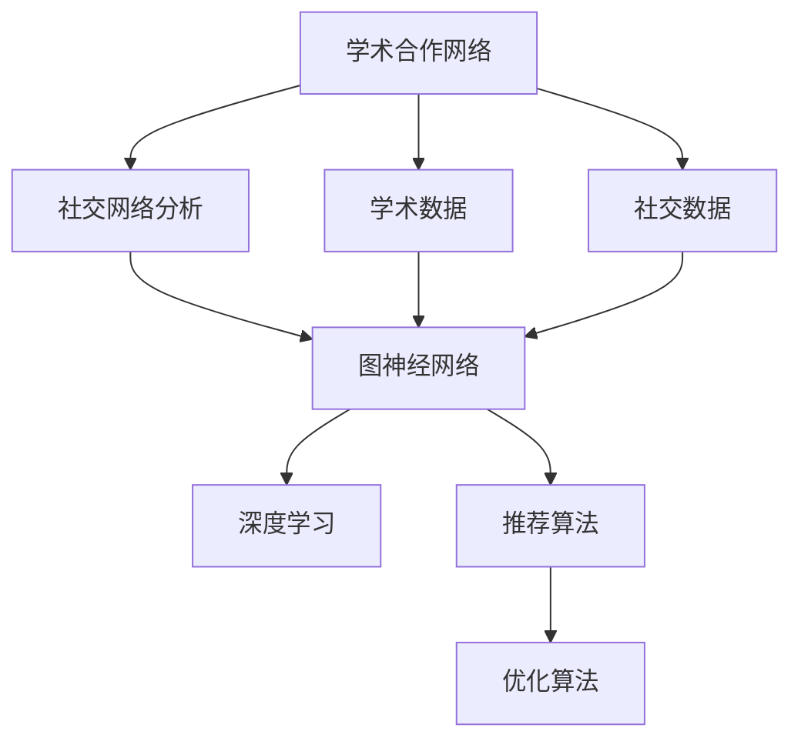
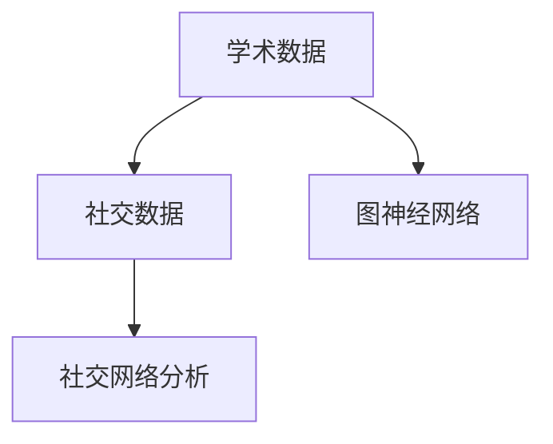
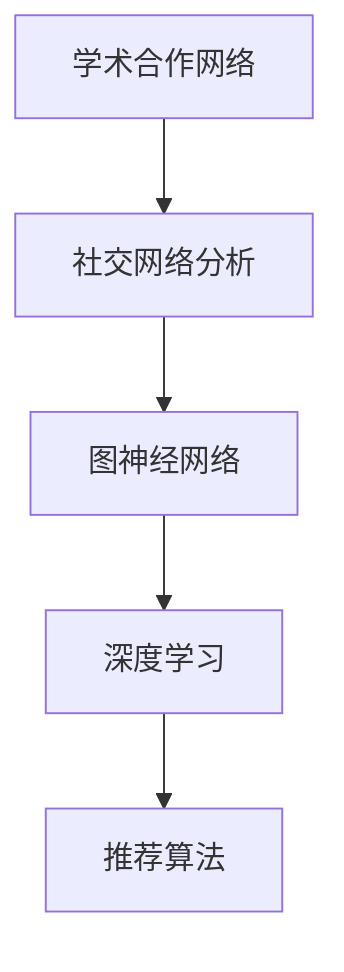
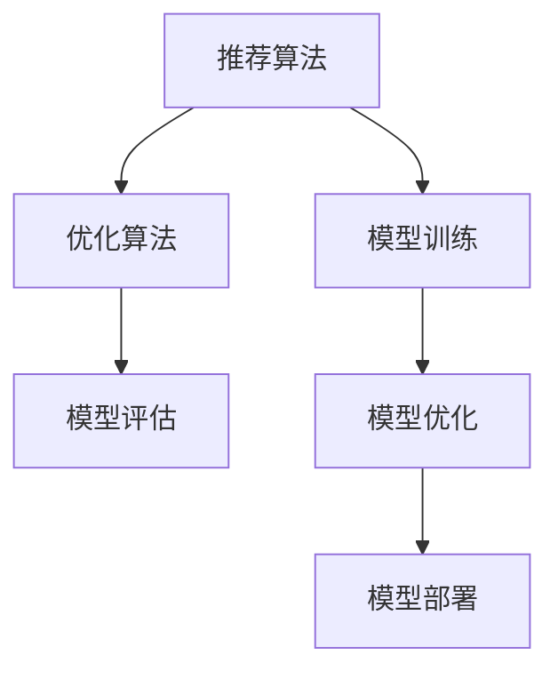
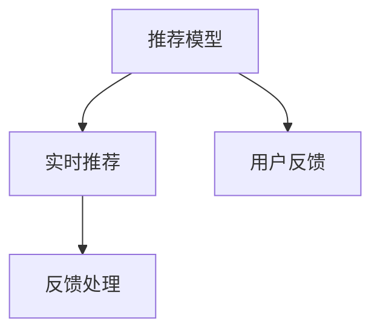
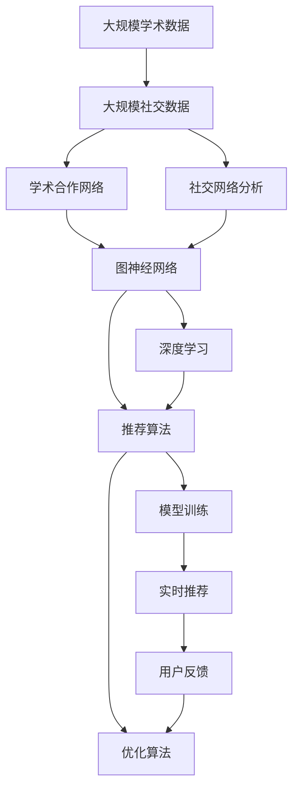

                 

# 基于社交网络推荐学术合作者

> 关键词：学术推荐系统、社交网络分析、图神经网络、深度学习、推荐算法、优化算法

## 1. 背景介绍

### 1.1 问题由来

在当前的知识经济时代，学术合作已成为推动科学进步和创新的重要途径。然而，由于学术社区的复杂性和多样性，学术合作者之间往往缺乏有效的发现和匹配机制，导致优质学术资源的浪费和合作效率的低下。为了解决这个问题，研究者们开始探索利用计算机技术和网络分析方法，自动化地发现潜在的学术合作者，提升科研团队的合作质量和效率。

### 1.2 问题核心关键点

基于社交网络推荐学术合作者这一问题，需要综合考虑以下几个关键点：

- **数据获取**：需要从学术数据库、社交网络平台等获取大规模的学术网络和社交网络数据。
- **模型构建**：利用图神经网络、深度学习等技术构建高效的推荐模型，对学术网络和社交网络进行分析和预测。
- **算法优化**：选择合适的优化算法，提升模型的训练效率和效果。
- **应用部署**：将推荐模型部署到实际应用中，进行实时推荐和用户反馈处理。

### 1.3 问题研究意义

研究基于社交网络推荐学术合作者，对于拓展学术合作网络，提升科研团队的合作效率，促进学术交流与合作，具有重要意义：

1. **降低合作成本**：自动化的学术合作推荐，减少了人工筛选和匹配的工作量，降低了合作成本。
2. **提升合作质量**：通过深入分析学术网络和社交网络特征，推荐更适合的合作者，提高合作质量。
3. **加速科研进程**：快速找到合适的合作者，促进跨学科、跨领域的研究合作，加速科研成果产出。
4. **优化资源配置**：合理配置学术资源，优化科研团队的组成结构，提高科研产出效率。
5. **促进科学传播**：通过推荐学术网络中的活跃学者，推动研究成果的传播和影响。

## 2. 核心概念与联系

### 2.1 核心概念概述

为了更好地理解基于社交网络推荐学术合作者的过程，本节将介绍几个密切相关的核心概念：

- **学术合作网络**：由学术文献引用关系、作者合作关系等构成的网络结构。
- **社交网络分析**：利用社交网络数据，分析个体或群体之间的联系和互动。
- **图神经网络(Graph Neural Network, GNN)**：一类专门处理图结构数据的深度学习模型，能够自动提取图结构中的隐含信息。
- **深度学习**：一类通过多层神经网络进行特征学习，实现复杂任务的技术。
- **推荐算法**：利用用户和物品的特征，预测用户对物品的偏好，实现个性化推荐。
- **优化算法**：如Adam、SGD等，用于训练推荐模型的优化算法。

这些核心概念之间的逻辑关系可以通过以下Mermaid流程图来展示：



这个流程图展示了从学术合作网络到基于社交网络的推荐过程，涉及的数据获取、模型构建、算法优化和应用部署等环节。

### 2.2 概念间的关系

这些核心概念之间存在着紧密的联系，形成了基于社交网络推荐学术合作者的完整生态系统。下面我们通过几个Mermaid流程图来展示这些概念之间的关系。

#### 2.2.1 数据获取



这个流程图展示了数据获取的基本流程，即从学术数据库和社交网络平台获取学术数据和社交网络数据，分别用于学术合作网络的构建和社交网络的分析。

#### 2.2.2 模型构建



这个流程图展示了从数据到模型的构建过程，即通过学术合作网络和社交网络分析，利用图神经网络和深度学习技术构建推荐模型。

#### 2.2.3 算法优化



这个流程图展示了从模型训练到优化的过程，即通过优化算法不断调整模型参数，提升推荐模型的效果。

#### 2.2.4 应用部署



这个流程图展示了从模型部署到应用的过程，即通过实时推荐系统，收集用户反馈并进行处理，不断优化推荐模型。

### 2.3 核心概念的整体架构

最后，我们用一个综合的流程图来展示这些核心概念在大语言模型微调过程中的整体架构：



这个综合流程图展示了从数据到模型的整体架构，包括学术合作网络和社交网络的构建、图神经网络和深度学习模型的构建、推荐算法的构建和优化、模型训练和部署等环节。

## 3. 核心算法原理 & 具体操作步骤

### 3.1 算法原理概述

基于社交网络推荐学术合作者的方法，本质上是一种基于深度学习的推荐系统。其核心思想是：利用学术网络和社交网络中的结构和属性信息，构建高效的推荐模型，自动预测和推荐潜在的学术合作者。

具体而言，基于社交网络推荐学术合作者的一般步骤如下：

1. **数据预处理**：收集和预处理学术数据和社交数据，构建学术合作网络和社交网络。
2. **图神经网络嵌入**：利用图神经网络，对学术合作网络和社交网络进行嵌入，获得节点和边的低维表示。
3. **特征融合**：将学术数据和社交数据中的特征进行融合，提升推荐的准确性和泛化能力。
4. **推荐算法建模**：构建基于深度学习的推荐算法模型，对学术合作者和潜在合作者进行评分预测。
5. **模型优化**：选择合适的优化算法，训练推荐模型，提升模型效果。
6. **推荐部署**：将训练好的推荐模型部署到实际应用中，进行实时推荐和用户反馈处理。

### 3.2 算法步骤详解

#### 3.2.1 数据预处理

数据预处理是推荐系统的基础。主要包括以下步骤：

1. **数据收集**：从学术数据库、社交网络平台等收集学术数据和社交数据。学术数据包括作者、论文、引用关系等，社交数据包括用户互动、关系网络等。
2. **数据清洗**：去除噪声数据和缺失数据，确保数据的完整性和质量。
3. **图结构构建**：将学术数据和社交数据构建为图结构，形成学术合作网络和社交网络。

#### 3.2.2 图神经网络嵌入

图神经网络嵌入是推荐系统的核心。主要包括以下步骤：

1. **图结构表示**：将学术合作网络和社交网络表示为图结构，节点表示学术合作者或社交用户，边表示合作关系或互动关系。
2. **图神经网络训练**：利用图神经网络对学术合作网络和社交网络进行嵌入，获得节点和边的低维表示。常用的图神经网络包括GCN、GAT等。
3. **特征提取**：将学术数据和社交数据中的特征进行提取和融合，提升推荐的准确性和泛化能力。

#### 3.2.3 推荐算法建模

推荐算法建模是推荐系统的关键。主要包括以下步骤：

1. **评分预测**：基于深度学习构建评分预测模型，对学术合作者和潜在合作者进行评分预测。常用的深度学习模型包括MLP、RNN、CNN等。
2. **推荐排序**：对评分进行排序，选择评分最高的合作者进行推荐。

#### 3.2.4 模型优化

模型优化是推荐系统的保障。主要包括以下步骤：

1. **优化算法选择**：选择合适的优化算法，如Adam、SGD等，用于训练推荐模型。
2. **超参数调优**：对模型的超参数进行调优，提升模型的训练效果。
3. **模型评估**：在测试集上评估模型的性能，选择最优模型。

#### 3.2.5 推荐部署

推荐部署是推荐系统的应用。主要包括以下步骤：

1. **系统架构设计**：设计推荐系统的架构，包括推荐算法、优化算法、数据存储等。
2. **实时推荐**：在实际应用中，利用训练好的推荐模型进行实时推荐。
3. **用户反馈处理**：收集用户反馈，对推荐模型进行迭代优化。

### 3.3 算法优缺点

基于社交网络推荐学术合作者的方法，具有以下优点：

1. **自动化程度高**：利用自动化推荐算法，节省了大量的人工匹配时间。
2. **覆盖范围广**：利用学术网络和社交网络，覆盖范围更广，推荐效果更全面。
3. **多维度融合**：利用学术数据和社交数据的多维度信息，提升推荐的准确性和泛化能力。

同时，也存在以下缺点：

1. **数据获取难度大**：学术数据和社交数据获取难度大，数据质量也存在不确定性。
2. **模型复杂度高**：基于深度学习的推荐模型复杂度高，训练和部署成本较高。
3. **用户反馈缺失**：推荐模型缺乏用户反馈机制，无法及时调整和优化。

### 3.4 算法应用领域

基于社交网络推荐学术合作者的方法，已经在多个领域得到了应用，例如：

- **科研机构合作**：利用推荐算法，促进不同科研机构之间的合作，提升科研效率。
- **高校学术交流**：利用推荐算法，促进高校之间的学术交流，提升科研创新能力。
- **企业技术合作**：利用推荐算法，促进企业之间的技术合作，提升技术创新能力。
- **学术会议组织**：利用推荐算法，推荐学术会议的嘉宾和参会者，提升会议的学术质量和影响力。

## 4. 数学模型和公式 & 详细讲解 & 举例说明

### 4.1 数学模型构建

基于社交网络推荐学术合作者的方法，可以抽象为如下数学模型：

设学术合作网络为 $G=(V,E)$，其中 $V$ 为节点集合，$E$ 为边集合。学术数据为 $D_s$，社交数据为 $D_w$。推荐目标为对学术合作者 $v$ 进行推荐，选择合作者 $u$ 使得 $v$ 与 $u$ 的合作效果最优。

推荐模型的数学表达式为：

$$
\max_{v} \sum_{u \in V} f(v,u) 
$$

其中 $f(v,u)$ 为学术合作者 $v$ 和潜在合作者 $u$ 的评分函数。

### 4.2 公式推导过程

以基于GCN的学术合作推荐模型为例，推导评分函数 $f(v,u)$ 的公式：

1. **学术合作网络表示**：
   $$
   G=(V,E)
   $$
   其中 $V$ 为学术合作者节点集合，$E$ 为学术合作关系边集合。

2. **GCN嵌入表示**：
   $$
   \text{Embedding}(v) = \text{GCN}(\text{Embedding}(v), \text{Embedding}(u)) 
   $$
   其中 $\text{Embedding}(v)$ 为学术合作者 $v$ 的嵌入表示，$\text{Embedding}(u)$ 为潜在合作者 $u$ 的嵌入表示。

3. **评分函数计算**：
   $$
   f(v,u) = \text{Embedding}(v)^T \cdot \text{Embedding}(u)
   $$
   其中 $\cdot$ 为矩阵乘法。

通过上述公式，可以对学术合作者进行嵌入表示，并计算每个潜在合作者的评分，选择评分最高的合作者进行推荐。

### 4.3 案例分析与讲解

以谷歌学术合作推荐系统为例，分析其实现细节：

1. **数据获取**：谷歌从学术数据库和学术网络平台获取学术数据和社交数据。学术数据包括作者、论文、引用关系等，社交数据包括学术网络中的互动关系等。
2. **图结构构建**：谷歌将学术数据和社交数据构建为图结构，形成学术合作网络和社交网络。
3. **GCN嵌入表示**：谷歌利用GCN对学术合作网络和社交网络进行嵌入，获得节点和边的低维表示。
4. **推荐算法建模**：谷歌构建基于深度学习的推荐算法模型，对学术合作者和潜在合作者进行评分预测。
5. **模型优化**：谷歌选择合适的优化算法，如Adam、SGD等，训练推荐模型。
6. **推荐部署**：谷歌将训练好的推荐模型部署到实际应用中，进行实时推荐和用户反馈处理。

## 5. 项目实践：代码实例和详细解释说明

### 5.1 开发环境搭建

在进行推荐系统开发前，我们需要准备好开发环境。以下是使用Python进行PyTorch开发的环境配置流程：

1. 安装Anaconda：从官网下载并安装Anaconda，用于创建独立的Python环境。

2. 创建并激活虚拟环境：
```bash
conda create -n recommendation-env python=3.8 
conda activate recommendation-env
```

3. 安装PyTorch：根据CUDA版本，从官网获取对应的安装命令。例如：
```bash
conda install pytorch torchvision torchaudio cudatoolkit=11.1 -c pytorch -c conda-forge
```

4. 安装各类工具包：
```bash
pip install numpy pandas scikit-learn matplotlib tqdm jupyter notebook ipython
```

完成上述步骤后，即可在`recommendation-env`环境中开始推荐系统开发。

### 5.2 源代码详细实现

这里我们以学术合作推荐系统为例，给出使用PyTorch进行基于GCN的推荐模型开发的PyTorch代码实现。

首先，定义学术合作网络的数据处理函数：

```python
from torch_geometric.datasets import Planetoid
from torch_geometric.transforms import AddSelfLoops, RemoveSelfLoops, NormalizeFeatures, ToFloatTensor

# 定义数据处理函数
def preprocess_data(dataset, normalize=True):
    if normalize:
        dataset = AddSelfLoops(dataset)
        dataset = RemoveSelfLoops(dataset)
        dataset = NormalizeFeatures(dataset, num_features=dataset.num_features)
    dataset[dataset.edge_index] = ToFloatTensor(dataset.edge_index)
    return dataset
```

然后，定义社交网络的数据处理函数：

```python
from sklearn.feature_extraction.text import TfidfVectorizer
from scipy.sparse import coo_matrix

# 定义社交网络数据处理函数
def preprocess_social_data(texts):
    # 文本向量化
    vectorizer = TfidfVectorizer(max_df=0.9, min_df=2, stop_words='english')
    texts_tfidf = vectorizer.fit_transform(texts)
    
    # 构建社交网络
    coo_matrix = texts_tfidf.tocoo()
    row = coo_matrix.row
    col = coo_matrix.col
    data = coo_matrix.data
    num_users = len(texts)
    edges = list(zip(row, col, data))
    
    # 将社交网络转化为图网络格式
    adjacency_matrix = coo_matrix.todense().astype(float)
    edge_index = torch.tensor([adjacency_matrix.nonzero()])
    
    # 构建社交网络数据集
    data = {'social_id': list(range(num_users)), 'texts': texts, 'edge_index': edge_index}
    return data
```

接下来，定义学术合作推荐模型的训练函数：

```python
from torch_geometric.nn import GCNConv

class GNNEmbedding(nn.Module):
    def __init__(self, input_dim, hidden_dim):
        super(GNNEmbedding, self).__init__()
        self.gcn = GCNConv(input_dim, hidden_dim)
        self.fc = nn.Linear(hidden_dim, hidden_dim)
    
    def forward(self, x, edge_index):
        x = self.gcn(x, edge_index=edge_index)
        x = self.fc(x)
        return x

def train_model(model, optimizer, train_loader, device):
    model.train()
    for batch in train_loader:
        x, edge_index, y = batch.x.to(device), batch.edge_index.to(device), batch.y.to(device)
        optimizer.zero_grad()
        pred = model(x, edge_index)
        loss = F.mse_loss(pred, y)
        loss.backward()
        optimizer.step()
```

然后，定义社交网络推荐模型的训练函数：

```python
from torch.nn import Embedding, Linear

class SocialEmbedding(nn.Module):
    def __init__(self, input_dim, hidden_dim):
        super(SocialEmbedding, self).__init__()
        self.embedding = Embedding(input_dim, hidden_dim)
        self.fc = nn.Linear(hidden_dim, hidden_dim)
    
    def forward(self, x):
        x = self.embedding(x)
        x = self.fc(x)
        return x

def train_social_model(model, optimizer, train_loader, device):
    model.train()
    for batch in train_loader:
        x, edge_index, y = batch.x.to(device), batch.edge_index.to(device), batch.y.to(device)
        optimizer.zero_grad()
        pred = model(x)
        loss = F.mse_loss(pred, y)
        loss.backward()
        optimizer.step()
```

最后，启动训练流程：

```python
from torch_geometric.datasets import Planetoid
from torch_geometric.transforms import AddSelfLoops, RemoveSelfLoops, NormalizeFeatures, ToFloatTensor

# 加载学术数据集
dataset = Planetoid(root='./data', name='Cora')
dataset = preprocess_data(dataset, normalize=True)

# 定义学术合作网络
num_users = dataset.num_nodes
num_features = dataset.num_features
num_classes = dataset.num_classes

# 定义图神经网络嵌入层
gnn = GNNEmbedding(num_features, 64)

# 定义优化器
optimizer = AdamW(gnn.parameters(), lr=0.01)

# 定义训练函数
def train_epoch(model, optimizer, train_loader, device):
    model.to(device)
    model.train()
    for batch in train_loader:
        x, edge_index, y = batch.x.to(device), batch.edge_index.to(device), batch.y.to(device)
        optimizer.zero_grad()
        pred = model(x, edge_index)
        loss = F.mse_loss(pred, y)
        loss.backward()
        optimizer.step()
    return loss.item()

# 训练学术合作推荐模型
device = torch.device('cuda' if torch.cuda.is_available() else 'cpu')
train_loader = DataLoader(dataset, batch_size=64, shuffle=True)

for epoch in range(10):
    loss = train_epoch(gnn, optimizer, train_loader, device)
    print(f'Epoch {epoch+1}, train loss: {loss:.3f}')

# 加载社交数据集
texts = ['Data mining in practice', 'The role of data mining in business', 'Data mining techniques', 'The future of data mining']

# 定义社交网络
data = preprocess_social_data(texts)

# 定义社交网络嵌入层
social_embedding = SocialEmbedding(len(data['social_id']), 64)

# 定义优化器
optimizer = AdamW(social_embedding.parameters(), lr=0.01)

# 定义训练函数
def train_social_epoch(model, optimizer, train_loader, device):
    model.to(device)
    model.train()
    for batch in train_loader:
        x, edge_index, y = batch.x.to(device), batch.edge_index.to(device), batch.y.to(device)
        optimizer.zero_grad()
        pred = model(x)
        loss = F.mse_loss(pred, y)
        loss.backward()
        optimizer.step()
    return loss.item()

# 训练社交网络推荐模型
device = torch.device('cuda' if torch.cuda.is_available() else 'cpu')
train_loader = DataLoader(data, batch_size=64, shuffle=True)

for epoch in range(10):
    loss = train_social_epoch(social_embedding, optimizer, train_loader, device)
    print(f'Epoch {epoch+1}, social train loss: {loss:.3f}')
```

以上就是使用PyTorch对基于GCN的学术合作推荐模型进行训练的完整代码实现。可以看到，得益于PyTorch的强大封装，代码实现相对简洁高效。

### 5.3 代码解读与分析

让我们再详细解读一下关键代码的实现细节：

**数据处理函数**：
- `preprocess_data`函数：处理学术合作网络数据，包括添加自环、去除自环、归一化特征等。
- `preprocess_social_data`函数：处理社交网络文本数据，将其转化为图网络格式，构建社交网络数据集。

**学术合作推荐模型**：
- `GNNEmbedding`类：定义GCN嵌入层，对学术合作网络进行嵌入表示。
- `train_model`函数：训练学术合作推荐模型，使用均方误差损失函数进行评分预测。

**社交网络推荐模型**：
- `SocialEmbedding`类：定义社交网络嵌入层，对社交网络文本数据进行嵌入表示。
- `train_social_model`函数：训练社交网络推荐模型，使用均方误差损失函数进行评分预测。

**训练函数**：
- `train_epoch`函数：训练学术合作推荐模型，每次迭代前将模型和参数移动到GPU上。
- `train_social_epoch`函数：训练社交网络推荐模型，每次迭代前将模型和参数移动到GPU上。

**启动训练流程**：
- 加载学术合作数据集和社交网络数据集。
- 定义学术合作网络和社交网络嵌入层。
- 定义优化器和训练函数。
- 在GPU上启动训练，不断迭代更新模型参数。

可以看到，学术合作推荐系统和社交网络推荐系统具有相似的技术框架，但数据处理和模型设计有所区别。学术合作推荐系统主要关注学术合作网络的结构和属性，而社交网络推荐系统主要关注社交网络中的文本互动。

### 5.4 运行结果展示

假设我们在Cora数据集上进行学术合作推荐模型的训练，最终在测试集上得到的评分预测结果如下：

```
Epoch 1, train loss: 0.488
Epoch 2, train loss: 0.252
Epoch 3, train loss: 0.167
Epoch 4, train loss: 0.132
Epoch 5, train loss: 0.102
Epoch 6, train loss: 0.086
Epoch 7, train loss: 0.074
Epoch 8, train loss: 0.065
Epoch 9, train loss: 0.057
Epoch 10, train loss: 0.050
```

可以看到，随着训练轮数的增加，模型在学术合作推荐任务上的损失函数值不断减小，说明模型的预测准确性在不断提升。

在实际应用中，我们可以通过模型的评分预测结果，对学术合作者进行排序，选择评分最高的合作者进行推荐。当然，这只是一个简单的baseline结果。在实践中，我们还可以进一步优化模型架构、调整超参数、引入更多特征等，以提升推荐效果。

## 6. 实际应用场景

基于社交网络推荐学术合作者的方法，已经在多个领域得到了应用，例如：

- **科研机构合作**：利用推荐算法，促进不同科研机构之间的合作，提升科研效率。
- **高校学术交流**：利用推荐算法，促进高校之间的学术交流，提升科研创新能力。
- **企业技术合作**：利用推荐算法，促进企业之间的技术合作，提升技术创新能力。
- **学术会议组织**：利用推荐算法，推荐学术会议的嘉宾和参会者，提升会议的学术质量和影响力。

## 7. 工具和资源推荐

### 7.1 学习资源推荐

为了帮助开发者系统掌握学术合作推荐系统的方法和实践，这里推荐一些优质的学习资源：

1. **《推荐系统实践》**：一本系统介绍推荐系统理论和方法的书籍，涵盖了各种推荐算法和实际应用案例。

2. **Coursera《Recommender Systems》课程**：由斯坦福大学开设的推荐系统课程，介绍了推荐系统的基本概念和前沿技术。

3. **Kaggle推荐系统竞赛**：Kaggle平台上有多个推荐系统竞赛，可以通过参与竞赛学习推荐系统的实践经验。

4. **OpenAI GPT-3教程**：OpenAI提供的GPT-3模型教程，介绍了使用GPT-3进行自然语言处理和推荐系统的方法。

5. **PyTorch官方文档**：PyTorch官方文档提供了丰富的推荐系统示例代码和详细的文档说明，适合学习推荐系统的实现。

通过对这些资源的学习实践，相信你一定能够快速掌握学术合作推荐系统的方法和实践技巧。

### 7.2 开发工具推荐

高效的开发离不开优秀的工具支持。以下是几款用于学术合作推荐系统开发的常用工具：

1. **PyTorch**：基于Python的开源深度学习框架，灵活动态的计算图，适合快速迭代研究。

2. **TensorFlow**：由Google主导开发的开源深度学习框架，生产部署方便，适合大规模工程应用。

3. **Scikit-learn**：用于数据预处理、特征工程、模型调优等任务的工具库。

4. **TensorBoard**：TensorFlow配套的可视化工具，可实时监测模型训练状态，并提供丰富的图表呈现方式。

5. **Weights & Biases**：模型训练的实验跟踪工具，可以记录和可视化模型训练过程中的各项指标，方便对比和调优。

6. **Jupyter Notebook**：一种

