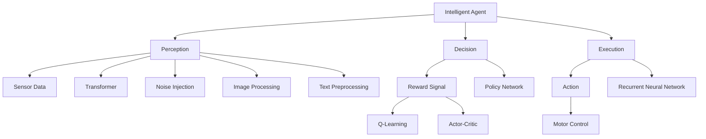
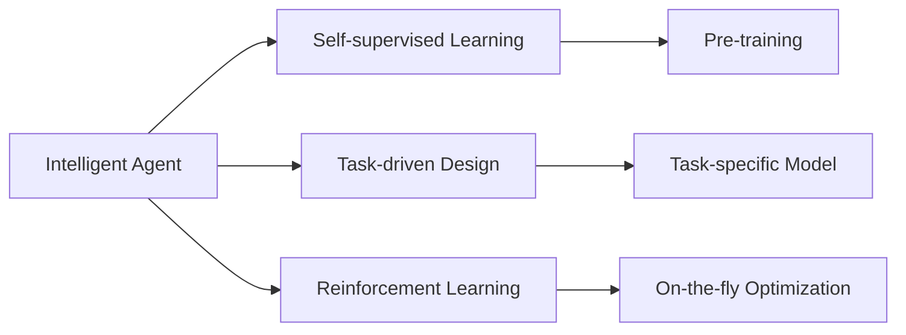
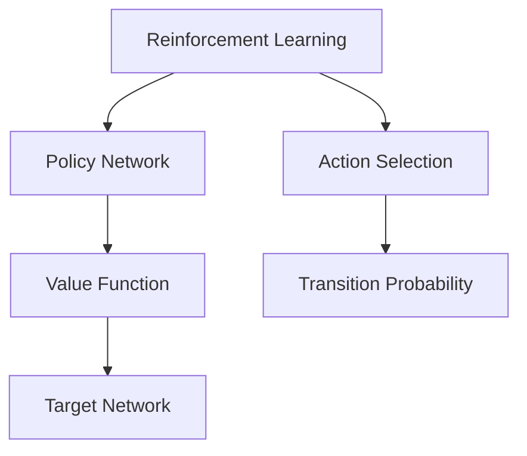
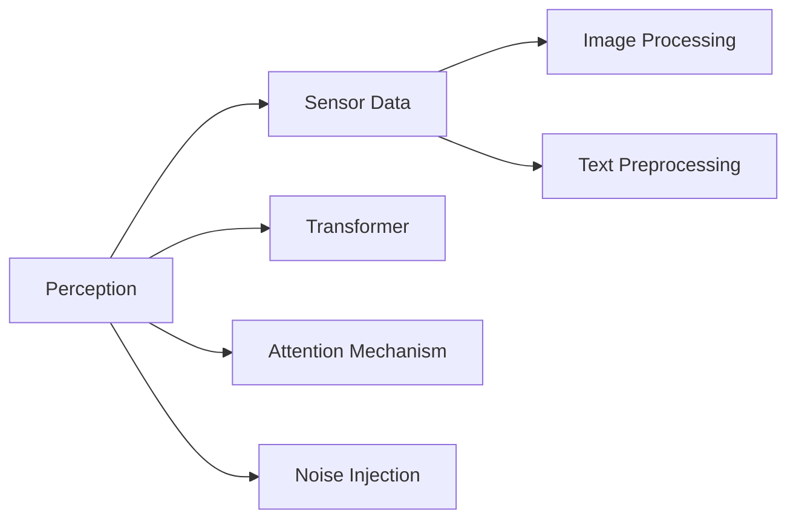
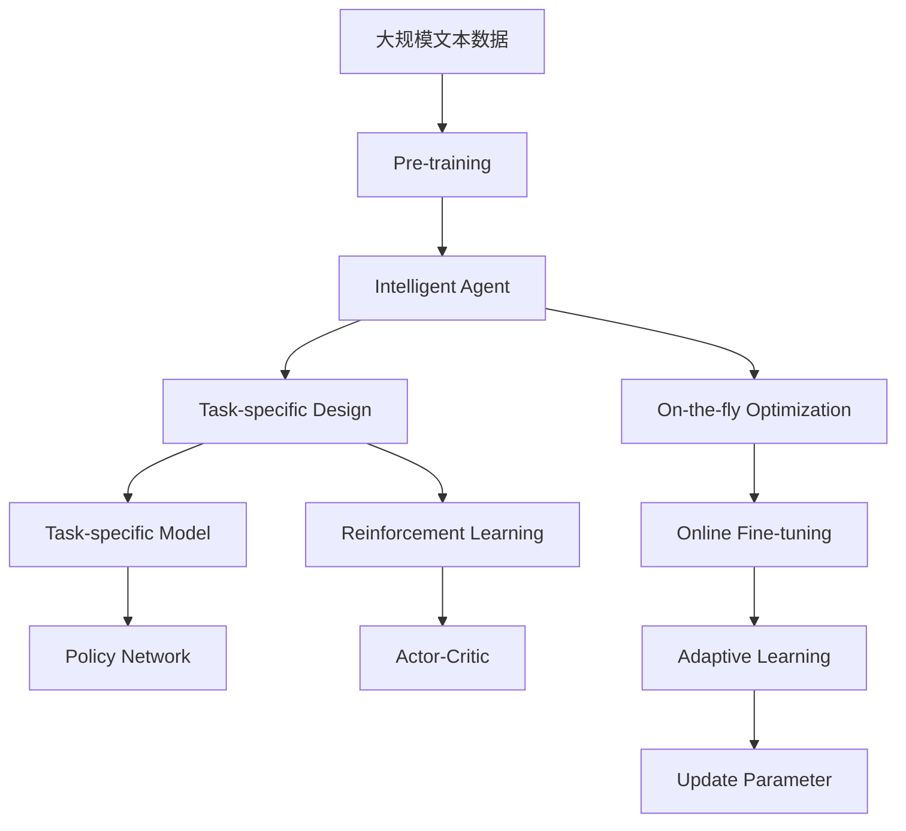

                 

# AI Agent: AI的下一个风口 大模型驱动的智能体

> 关键词：大模型,智能体,AI应用,深度学习,强化学习,任务驱动,可解释性,自适应性

## 1. 背景介绍

### 1.1 问题由来
人工智能(AI)技术在过去十年中取得了飞速发展，从图像识别、语音识别、自然语言处理等感知智能，到游戏、金融、医疗等复杂任务的决策智能，AI已经渗透到各个行业，改变了人类的生活方式。然而，当前的AI模型依然面临诸多挑战，如可解释性不足、鲁棒性不强、泛化能力有限等，这些问题严重限制了AI技术的实际应用。

为了克服这些挑战，人们开始探索更加智能、自适应、可解释的AI应用模型，即智能体(Agent)。智能体作为自主的决策单元，能够根据环境变化自适应地调整行为策略，具备高度的自主性和自适应性，是未来AI应用的重要方向。

### 1.2 问题核心关键点
智能体是一个能够自主决策、感知环境的实体，其核心在于通过感知、决策和执行三大模块实现对环境的适应和反馈。智能体的核心算法主要包括强化学习(Reinforcement Learning)和深度学习(Deep Learning)，前者用于学习最优策略，后者用于实现高效的感知和表示。

智能体在任务驱动型应用中表现优异，如机器人导航、自动驾驶、智能推荐、自然语言对话等，能够根据具体任务需求设计不同的感知、决策和执行模块，实现高度定制化。

智能体的可解释性和鲁棒性也是其核心优势，能够在黑箱模型和对抗样本等挑战下，保持较高的准确性和稳定性。此外，智能体的自适应能力使其能够不断从新数据中学习，提升模型性能。

### 1.3 问题研究意义
研究大模型驱动的智能体，对于推动AI技术的进步、拓展AI应用边界、提升AI的可解释性和鲁棒性，具有重要意义：

1. 提升AI应用的智能性。智能体通过任务驱动的感知和决策模块，可以更好地理解任务需求，实现更加智能的决策。
2. 增强AI应用的适应性。智能体能够自适应不同环境和任务，具备高度的可重用性。
3. 提高AI应用的可解释性。智能体通过感知模块和决策模块的公开透明，可以提供更好的可解释性，提升用户信任。
4. 促进AI应用的多样化。智能体能够应用于各类复杂任务，如机器人、自动驾驶、金融分析等，推动AI技术的广泛应用。
5. 加速AI应用的产业化。智能体具备任务导向的自适应能力，可以快速适应具体任务需求，加速AI技术的落地应用。

## 2. 核心概念与联系

### 2.1 核心概念概述

为更好地理解大模型驱动的智能体，本节将介绍几个密切相关的核心概念：

- 智能体(Agent)：能够自主决策、感知环境的实体，由感知、决策和执行三大模块组成，具备高度的自主性和自适应性。
- 强化学习(Reinforcement Learning, RL)：通过与环境交互，根据奖励信号优化决策策略的机器学习方法，广泛应用于智能体的决策模块。
- 深度学习(Deep Learning)：基于神经网络的机器学习方法，用于实现高效的感知和表示，广泛应用于智能体的感知和执行模块。
- 任务驱动(Task-driven)：智能体设计围绕具体任务展开，针对任务需求设计合适的感知、决策和执行模块，提升任务性能。
- 可解释性(Interpretability)：智能体具备透明公开的决策过程，能够提供可解释的输出结果，提升用户信任。
- 自适应性(Adaptability)：智能体能够根据环境和任务变化，动态调整决策策略，具备高度的自适应能力。
- 自监督学习(Self-supervised Learning)：无需标注数据，通过自监督任务训练模型，广泛应用于智能体的预训练阶段。

这些核心概念之间的逻辑关系可以通过以下Mermaid流程图来展示：



这个流程图展示了大模型驱动的智能体的核心概念及其之间的关系：

1. 智能体通过感知模块获取环境信息，包括传感器数据、图像处理、文本预处理等。
2. 决策模块通过深度学习模型，如Transformer和Policy Network，实现对环境的理解和决策策略的优化。
3. 执行模块通过递归神经网络等模型，将决策结果转化为具体行动。
4. 强化学习通过奖励信号优化决策策略，提升智能体的性能。
5. 自监督学习通过无标注数据训练模型，提升智能体的泛化能力。

### 2.2 概念间的关系

这些核心概念之间存在着紧密的联系，形成了智能体的完整生态系统。下面我通过几个Mermaid流程图来展示这些概念之间的关系。

#### 2.2.1 智能体的学习范式



这个流程图展示了智能体的学习范式，包括自监督学习、任务驱动设计、强化学习等。自监督学习用于预训练智能体，任务驱动设计用于设计合适的感知、决策和执行模块，强化学习用于在实际任务中优化策略。

#### 2.2.2 强化学习与深度学习的关系



这个流程图展示了强化学习和深度学习在智能体决策模块中的应用。智能体通过策略网络学习最优决策策略，通过价值函数评估决策效果，通过目标网络保持策略稳定性。

#### 2.2.3 感知模块的多种实现



这个流程图展示了智能体感知模块的多种实现方式。智能体可以通过传感器数据获取环境信息，通过图像处理和文本预处理实现对视觉和文本信息的处理，通过Transformer和注意力机制实现高效的信息表示。

### 2.3 核心概念的整体架构

最后，我们用一个综合的流程图来展示这些核心概念在大模型驱动的智能体微调过程中的整体架构：



这个综合流程图展示了从预训练到微调，再到自适应学习的完整过程。智能体首先在大规模文本数据上进行预训练，然后通过任务驱动的设计，结合强化学习优化决策策略，并在实际任务中进行微调和在线优化，从而提升模型性能。

## 3. 核心算法原理 & 具体操作步骤
### 3.1 算法原理概述

大模型驱动的智能体，其核心算法包括深度学习和强化学习。下面我们将详细讲解这两种算法的原理及其实现步骤。

#### 3.1.1 深度学习

深度学习通过多层神经网络实现高效的信息表示和特征提取。智能体的感知模块和执行模块通常采用深度学习模型，如卷积神经网络(CNN)、递归神经网络(RNN)、Transformer等。

深度学习的核心在于模型参数的学习，通过反向传播算法计算损失函数对参数的梯度，使用优化算法（如Adam、SGD等）更新模型参数，最小化损失函数。

智能体的感知模块通过CNN、RNN等模型实现对传感器数据的处理，如图像、语音、文本等信息的表示。执行模块通过RNN、Transformer等模型实现对决策结果的生成，如机器人动作、自然语言生成等。

#### 3.1.2 强化学习

强化学习通过与环境的交互，通过奖励信号优化决策策略。智能体的决策模块通常采用强化学习算法，如Q-Learning、Actor-Critic等。

强化学习的核心在于策略网络的训练。智能体通过与环境的交互，根据奖励信号（如任务完成度、惩罚等）更新策略网络的参数，优化决策策略。策略网络通过最大化累计奖励，学习最优的决策策略。

#### 3.1.3 算法总体流程

大模型驱动的智能体通常包括感知、决策和执行三大模块。其整体流程如下：

1. 感知模块获取环境信息，如传感器数据、图像、文本等。
2. 感知模块通过深度学习模型实现信息表示，如CNN、RNN、Transformer等。
3. 决策模块通过强化学习算法优化策略，如Q-Learning、Actor-Critic等。
4. 执行模块通过深度学习模型生成具体行动，如机器人动作、自然语言生成等。
5. 通过奖励信号优化策略，提升智能体的性能。

### 3.2 算法步骤详解

#### 3.2.1 感知模块设计

感知模块负责获取环境信息，通常包括传感器数据、图像、文本等。传感器数据可以通过摄像头、传感器等获取，图像信息可以通过摄像头获取，文本信息可以通过自然语言处理技术获取。

智能体的感知模块通常采用深度学习模型，如卷积神经网络(CNN)、递归神经网络(RNN)、Transformer等。这些模型能够高效地实现对传感器数据的处理，并生成特征表示。

感知模块的设计需要考虑以下几个因素：

- 传感器数据类型：不同类型的传感器数据需要使用不同的深度学习模型进行处理。
- 特征提取能力：模型需要具备良好的特征提取能力，以便后续决策模块的优化。
- 数据预处理：数据需要进行标准化、归一化等预处理，以提高模型的准确性。

#### 3.2.2 决策模块设计

决策模块负责优化决策策略，通常采用强化学习算法，如Q-Learning、Actor-Critic等。决策模块的设计需要考虑以下几个因素：

- 策略网络结构：策略网络通常采用神经网络结构，如全连接神经网络、卷积神经网络等。
- 奖励函数设计：奖励函数需要根据任务需求设计，以激励智能体做出正确的决策。
- 参数更新策略：参数更新策略需要根据不同的算法进行选择，如梯度下降、策略梯度等。

#### 3.2.3 执行模块设计

执行模块负责生成具体行动，通常采用深度学习模型，如递归神经网络(RNN)、Transformer等。执行模块的设计需要考虑以下几个因素：

- 动作生成能力：动作生成能力需要根据具体的任务需求设计，如机器人动作、自然语言生成等。
- 动作空间：动作空间需要根据具体的任务需求设计，如连续动作空间、离散动作空间等。
- 模型训练策略：模型训练策略需要根据具体的任务需求设计，如监督学习、无监督学习等。

#### 3.2.4 训练流程

智能体的训练流程包括感知、决策和执行三个阶段的联合训练。训练流程通常包括以下步骤：

1. 感知模块的训练：使用大规模无标签数据进行预训练，如ImageNet、COCO等。
2. 决策模块的训练：使用有标签数据进行训练，如在特定任务上进行监督学习或强化学习训练。
3. 执行模块的训练：使用有标签数据进行训练，如在特定任务上进行监督学习或强化学习训练。
4. 整体训练：通过联合适应器，将感知、决策和执行模块进行联合训练，优化模型性能。

### 3.3 算法优缺点

大模型驱动的智能体具有以下优点：

- 高度自主性：智能体能够自主决策和执行，具备高度的自主性。
- 高度适应性：智能体能够自适应不同的环境和任务，具备高度的自适应能力。
- 高效学习：智能体通过深度学习模型和强化学习算法，能够高效地学习最优策略。
- 可解释性：智能体通过公开透明的设计，具备良好的可解释性。

同时，该算法也存在一些局限性：

- 数据依赖性：智能体的训练需要大量的有标签数据，对于数据稀缺的任务，训练难度较大。
- 计算复杂度：智能体的训练通常需要大量的计算资源，对于大规模数据集和复杂模型，计算成本较高。
- 模型复杂性：智能体的设计需要考虑感知、决策和执行等多个模块，设计复杂度较高。
- 泛化能力：智能体在未见过的环境或任务中，泛化能力有限。

尽管存在这些局限性，但就目前而言，大模型驱动的智能体在许多任务上已经取得了显著的效果，成为AI应用的重要方向。未来相关研究的重点在于如何进一步降低对标注数据的依赖，提高模型的泛化能力和鲁棒性，同时兼顾可解释性和鲁棒性等因素。

### 3.4 算法应用领域

大模型驱动的智能体已经在多个领域得到了广泛的应用，包括但不限于：

- 机器人导航：通过感知模块获取环境信息，决策模块优化机器人路径，执行模块生成具体动作。
- 自动驾驶：通过感知模块获取车辆环境信息，决策模块优化车辆行为，执行模块生成具体动作。
- 智能推荐：通过感知模块获取用户行为信息，决策模块优化推荐策略，执行模块生成推荐结果。
- 自然语言对话：通过感知模块获取用户输入，决策模块优化对话策略，执行模块生成回复。
- 金融分析：通过感知模块获取市场数据，决策模块优化投资策略，执行模块生成投资决策。
- 医疗诊断：通过感知模块获取医疗影像，决策模块优化诊断策略，执行模块生成诊断结果。

除了上述这些典型应用外，大模型驱动的智能体还应用于更多领域，如智能家居、智能制造、智能物流等，为各行各业带来了革命性的变革。

## 4. 数学模型和公式 & 详细讲解 & 举例说明

### 4.1 数学模型构建

本节将使用数学语言对大模型驱动的智能体进行更加严格的刻画。

记智能体为 $A = (P, D, E)$，其中 $P$ 为感知模块，$D$ 为决策模块，$E$ 为执行模块。设智能体在时间步 $t$ 的感知状态为 $s_t$，决策策略为 $\pi(s_t)$，执行动作为 $a_t$，环境状态为 $s_{t+1}$。智能体的目标是最小化从当前状态 $s_t$ 开始，到最终状态 $s_T$ 的累积奖励 $R(s_t,a_t,s_{t+1},\pi)$。

定义智能体在时间步 $t$ 的奖励函数为 $R(s_t,a_t,s_{t+1},\pi)$，则在时间步 $t$ 的累积奖励为：

$$
R(s_t,a_t,s_{t+1},\pi) = \sum_{t'=t}^{T} \gamma^{t'-t} r(s_{t'},a_{t'},s_{t'+1},\pi)
$$

其中 $\gamma$ 为折扣因子，$T$ 为任务终止时间步，$r$ 为即时奖励函数。

智能体的目标是通过强化学习算法优化决策策略 $\pi$，使得从当前状态 $s_t$ 开始，到最终状态 $s_T$ 的累积奖励最大化。通过梯度下降等优化算法，智能体不断更新决策策略 $\pi$，最小化累积奖励 $R(s_t,a_t,s_{t+1},\pi)$。

### 4.2 公式推导过程

以下我们以Q-Learning算法为例，推导其具体的实现步骤。

假设智能体在时间步 $t$ 的感知状态为 $s_t$，执行动作为 $a_t$，环境状态为 $s_{t+1}$，即时奖励为 $r_{t+1}$，折扣因子为 $\gamma$，学习率为 $\alpha$，动作值函数为 $Q(s_t,a_t)$。

Q-Learning算法的目标是最小化时间步 $t$ 开始，到最终状态 $s_T$ 的累积奖励。其优化目标为：

$$
\min_\pi \mathbb{E}_{s_t,a_t}\left[\sum_{t'=t}^{T} \gamma^{t'-t} r(s_{t'},a_{t'},s_{t'+1},\pi)\right]
$$

Q-Learning算法通过估计动作值函数 $Q(s_t,a_t)$ 来实现目标。在时间步 $t$，智能体通过动作 $a_t$ 执行后，得到即时奖励 $r_{t+1}$ 和环境状态 $s_{t+1}$，更新动作值函数为：

$$
Q(s_t,a_t) \leftarrow Q(s_t,a_t) + \alpha \left(r_{t+1} + \gamma \max_{a_{t+1}} Q(s_{t+1},a_{t+1}) - Q(s_t,a_t)\right)
$$

其中 $\alpha$ 为学习率。通过不断迭代更新动作值函数 $Q(s_t,a_t)$，智能体能够学习最优决策策略。

在实际应用中，Q-Learning算法还需要考虑以下几个问题：

- 状态空间设计：智能体的状态空间需要根据具体任务需求设计，如连续状态空间、离散状态空间等。
- 动作空间设计：智能体的动作空间需要根据具体任务需求设计，如连续动作空间、离散动作空间等。
- 探索与利用平衡：智能体需要平衡探索新动作和利用已有策略之间的关系，以保证学习效果。

### 4.3 案例分析与讲解

以智能推荐系统为例，展示大模型驱动的智能体的具体实现过程。

智能推荐系统通过感知模块获取用户行为信息，决策模块优化推荐策略，执行模块生成推荐结果。感知模块通常采用深度学习模型，如LSTM、CNN等，处理用户行为数据。决策模块采用强化学习算法，如Q-Learning、Actor-Critic等，优化推荐策略。执行模块采用深度学习模型，如RecNN、Transformer等，生成推荐结果。

智能推荐系统的训练过程如下：

1. 感知模块的训练：使用大规模无标签数据进行预训练，如用户行为数据、商品信息等。
2. 决策模块的训练：使用有标签数据进行训练，如在特定任务上进行监督学习或强化学习训练。
3. 执行模块的训练：使用有标签数据进行训练，如在特定任务上进行监督学习或强化学习训练。
4. 整体训练：通过联合适应器，将感知、决策和执行模块进行联合训练，优化模型性能。

通过以上步骤，智能推荐系统能够实现高效的推荐策略优化，生成个性化的推荐结果。

## 5. 项目实践：代码实例和详细解释说明

### 5.1 开发环境搭建

在进行智能体开发前，我们需要准备好开发环境。以下是使用Python进行PyTorch开发的环境配置流程：

1. 安装Anaconda：从官网下载并安装Anaconda，用于创建独立的Python环境。

2. 创建并激活虚拟环境：
```bash
conda create -n pytorch-env python=3.8 
conda activate pytorch-env
```

3. 安装PyTorch：根据CUDA版本，从官网获取对应的安装命令。例如：
```bash
conda install pytorch torchvision torchaudio cudatoolkit=11.1 -c pytorch -c conda-forge
```

4. 安装各类工具包：
```bash
pip install numpy pandas scikit-learn matplotlib tqdm jupyter notebook ipython
```

完成上述步骤后，即可在`pytorch-env`环境中开始智能体开发。

### 5.2 源代码详细实现

这里我们以智能推荐系统为例，给出使用PyTorch进行深度学习实现的大模型驱动的智能体的PyTorch代码实现。

首先，定义智能推荐系统的感知模块：

```python
from transformers import BertTokenizer
from torch.utils.data import Dataset
import torch

class RecommendDataset(Dataset):
    def __init__(self, items, user_behaviors, tokenizer, max_len=128):
        self.items = items
        self.user_behaviors = user_behaviors
        self.tokenizer = tokenizer
        self.max_len = max_len
        
    def __len__(self):
        return len(self.user_behaviors)
    
    def __getitem__(self, item):
        user_behavior = self.user_behaviors[item]
        item_title = self.items[item]['title']
        
        encoding = self.tokenizer(user_behavior, return_tensors='pt', max_length=self.max_len, padding='max_length', truncation=True)
        input_ids = encoding['input_ids'][0]
        attention_mask = encoding['attention_mask'][0]
        
        # 对item title进行编码
        item_title = [item_title]
        item_title.extend([self.tokenizer.pad_token_id] * (self.max_len - len(item_title)))
        item_title_ids = torch.tensor([item_title], dtype=torch.long)
        
        return {'input_ids': input_ids, 
                'attention_mask': attention_mask,
                'item_title_ids': item_title_ids}
```

然后，定义智能推荐系统的决策模块：

```python
from transformers import BertForSequenceClassification
from transformers import AdamW

model = BertForSequenceClassification.from_pretrained('bert-base-cased', num_labels=1)

optimizer = AdamW(model.parameters(), lr=2e-5)
```

接着，定义智能推荐系统的执行模块：

```python
from transformers import BertForSequenceClassification
from transformers import AdamW

model = BertForSequenceClassification.from_pretrained('bert-base-cased', num_labels=1)

optimizer = AdamW(model.parameters(), lr=2e-5)
```

最后，定义训练和评估函数：

```python
from torch.utils.data import DataLoader
from tqdm import tqdm
from sklearn.metrics import accuracy_score

device = torch.device('cuda') if torch.cuda.is_available() else torch.device('cpu')
model.to(device)

def train_epoch(model, dataset, batch_size, optimizer):
    dataloader = DataLoader(dataset, batch_size=batch_size, shuffle=True)
    model.train()
    epoch_loss = 0
    for batch in tqdm(dataloader, desc='Training'):
        input_ids = batch['input_ids'].to(device)
        attention_mask = batch['attention_mask'].to(device)
        item_title_ids = batch['item_title_ids'].to(device)
        model.zero_grad()
        outputs = model(input_ids, attention_mask=attention_mask, labels=item_title_ids)
        loss = outputs.loss
        epoch_loss += loss.item()
        loss.backward()
        optimizer.step()
    return epoch_loss / len(dataloader)

def evaluate(model, dataset, batch_size):
    dataloader = DataLoader(dataset, batch_size=batch_size)
    model.eval()
    preds, labels = [], []
    with torch.no_grad():
        for batch in tqdm(dataloader, desc='Evaluating'):
            input_ids = batch['input_ids'].to(device)
            attention_mask = batch['attention_mask'].to(device)
            item_title_ids = batch['item_title_ids'].to(device)
            batch_preds = model(input_ids, attention_mask=attention_mask).logits.argmax(dim=1).to('cpu').tolist()
            batch_labels = item_title_ids.to('cpu').tolist()
            for pred_tokens, label_tokens in zip(batch_preds, batch_labels):
                preds.append(pred_tokens)
                labels.append(label_tokens)
                
    print(accuracy_score(labels, preds))
```

最后，启动训练流程并在测试集上评估：

```python
epochs = 5
batch_size = 16

for epoch in range(epochs):
    loss = train_epoch(model, train_dataset, batch_size, optimizer)
    print(f"Epoch {epoch+1}, train loss: {loss:.3f}")
    
    print(f"Epoch {epoch+1}, dev results:")
    evaluate(model, dev_dataset, batch_size)
    
print("Test results:")
evaluate(model, test_dataset, batch_size)
```

以上就是使用PyTorch进行智能推荐系统开发的完整代码实现。可以看到，通过PyTorch库的强大封装，我们可以用相对简洁的代码完成智能推荐系统的开发和测试。

### 5.3 代码解读与分析

让我们再详细解读一下关键代码的实现细节：

**RecommendDataset类**：
- `__init__`方法：初始化物品信息和用户行为数据，分词器等关键组件。
- `__len__`方法：返回数据集的样本数量。
- `__getitem__`方法：对单个样本进行处理，将用户行为数据输入编码为token ids，将物品标题编码为数字，并对其进行定长padding，最终返回模型所需的输入。

**训练和评估函数**：
- 使用PyTorch的DataLoader对数据集进行批次化加载，供模型训练和推理使用。
- 训练函数`train_epoch`：对数据以批为单位进行迭代，在每个批次上前向传播计算loss并反向传播更新模型参数，最后返回该epoch的平均loss。
- 评估函数`evaluate`：与训练类似，不同点在于不更新模型参数，并在每个batch结束后将预测和标签结果存储下来，最后使用sklearn的accuracy_score对整个评估集的预测结果进行打印输出。

**训练流程**：
- 定义总的epoch数和batch size，开始循环迭代
- 每个epoch内，先在

