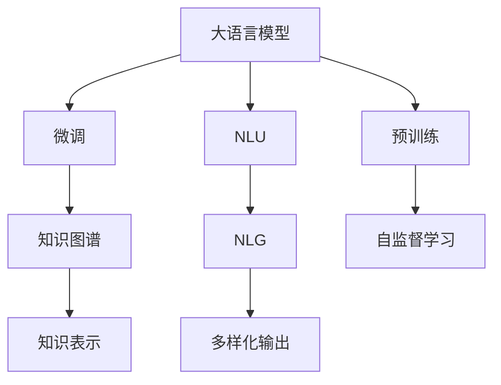
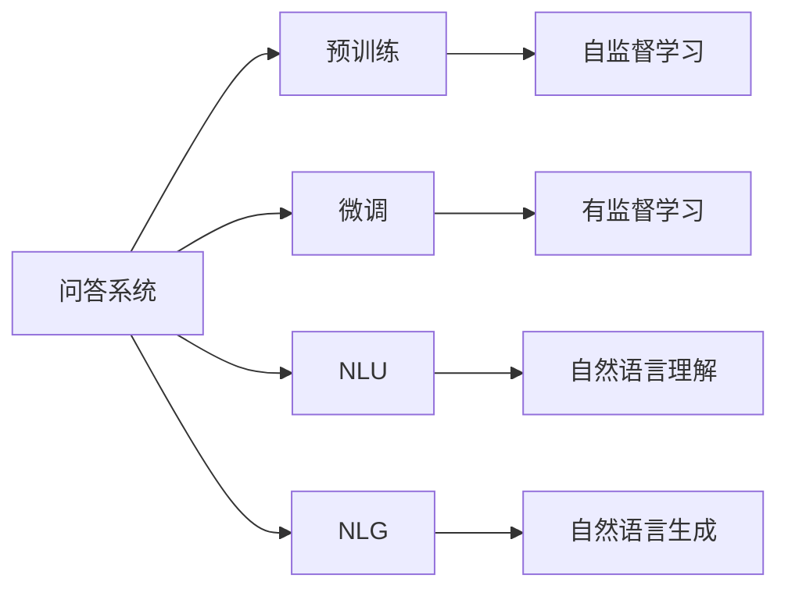
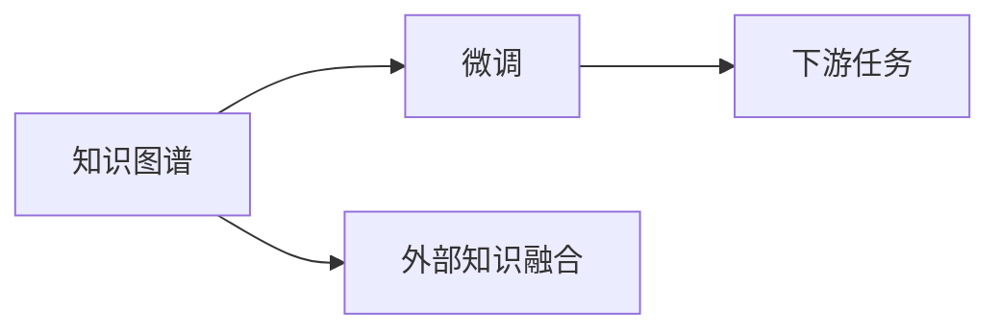
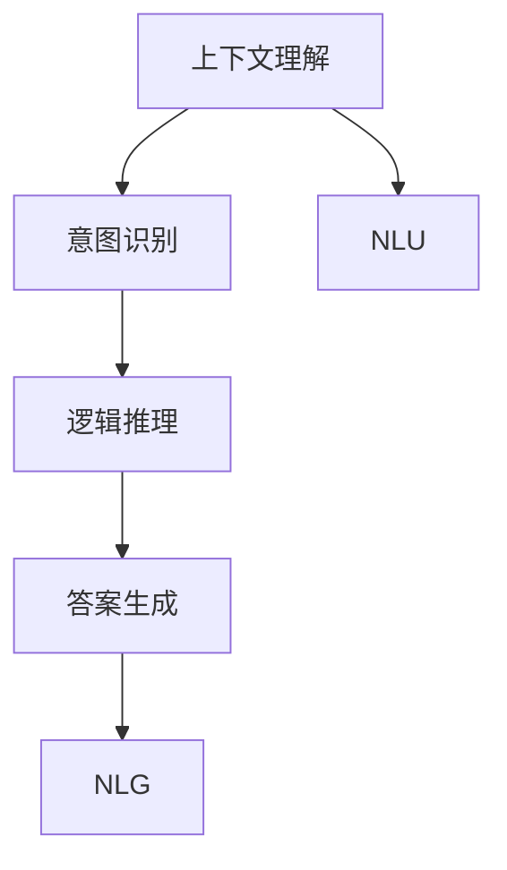
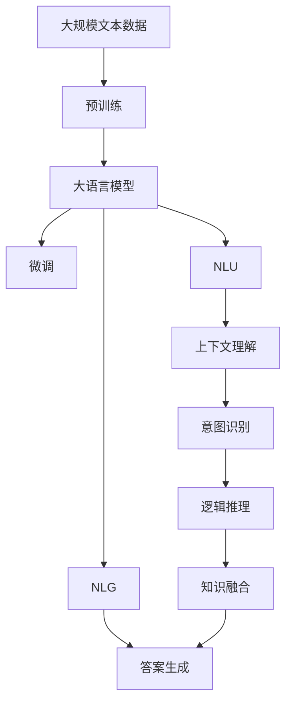

                 

# 大模型问答机器人的上下文理解

> 关键词：大模型,问答机器人,上下文理解,自然语言处理(NLP),Transformer,BERT,意图识别,逻辑推理

## 1. 背景介绍

### 1.1 问题由来

随着人工智能技术的迅猛发展，基于自然语言处理(NLP)的智能问答系统已成为日常生活、工作、学习中的重要工具。例如，智能客服、在线教育、智能家居等场景中，问答系统已广泛应用于解决用户查询。然而，传统的基于规则或模板匹配的问答系统，难以处理复杂多变的问题，无法适应实际应用中的多样化需求。

近年来，基于预训练语言模型的智能问答系统迅速崛起。通过大规模无标签文本数据的预训练，大语言模型学习到了丰富的语言知识，具备强大的语义理解和推理能力，可以处理各种类型的自然语言问题，展现出广泛的应用前景。其中，BERT、GPT等预训练模型在问答任务上取得了显著的成果。

### 1.2 问题核心关键点

问答系统面临的核心问题在于如何理解用户的问题并准确回答问题。具体而言，包括以下几个关键点：

1. **上下文理解**：理解用户问题的完整语义，包括背景知识、上下文信息和隐含意图。
2. **意图识别**：识别用户问题的真实意图，区分不同类型的问题（如事实性问题、理解性问题、推理性问题等）。
3. **逻辑推理**：基于上下文和意图，利用语言模型进行推理，生成合适的答案。
4. **知识融合**：在回答问题时，利用外部知识库或专家系统进行辅助，提高答案的准确性和可靠性。
5. **多样性处理**：应对各种问题形式（如开放式、闭式、多重选择等），提供多样化的答案形式（如文字、链接、图表等）。

这些问题构成了问答系统的核心挑战，也正是大语言模型在问答任务上大放异彩的主要原因。

### 1.3 问题研究意义

问答系统作为NLP技术的一个重要分支，对于提升用户互动体验、加速信息获取、优化服务质量具有重要意义：

1. **提升用户体验**：通过智能问答，用户可以轻松获取信息，减少等待时间，提升满意度。
2. **优化资源利用**：智能问答系统可以替代人工客服，减少人力成本，提高资源利用效率。
3. **增强服务个性化**：根据用户历史查询记录和语境信息，智能问答系统可以提供更加个性化的服务，提升用户粘性。
4. **促进知识传播**：通过问答系统，用户可以获取更全面、准确的知识，推动知识普及和共享。
5. **辅助决策支持**：问答系统可以提供数据驱动的决策支持，帮助用户做出更明智的选择。

问答系统的深入研究和应用，不仅能够提升信息获取的效率和质量，还将为各行各业带来革命性的变革，成为推动人工智能技术落地的重要力量。

## 2. 核心概念与联系

### 2.1 核心概念概述

为了更好地理解大模型问答机器人，本节将介绍几个密切相关的核心概念：

- **大语言模型(Large Language Model, LLM)**：以自回归(如GPT)或自编码(如BERT)模型为代表的大规模预训练语言模型。通过在大规模无标签文本语料上进行预训练，学习到了丰富的语言知识和常识，具备强大的语言理解和生成能力。

- **预训练(Pre-training)**：指在大规模无标签文本语料上，通过自监督学习任务训练通用语言模型的过程。常见的预训练任务包括言语建模、遮挡语言模型等。预训练使得模型学习到了语言的通用表示。

- **微调(Fine-tuning)**：指在预训练模型的基础上，使用下游任务的少量标注数据，通过有监督地训练来优化模型在该任务上的性能。通常只需要调整顶层分类器或解码器，并以较小的学习率更新全部或部分的模型参数。

- **知识图谱(Knowledge Graph)**：一种结构化的语义知识表示方法，将实体、属性和关系组织成图，方便知识查询和推理。知识图谱被广泛应用于问答系统中，作为外部知识源。

- **自然语言理解(Natural Language Understanding, NLU)**：指通过计算机技术，理解和解释自然语言文本内容的技术。NLU是问答系统实现上下文理解、意图识别、逻辑推理等核心功能的基础。

- **自然语言生成(Natural Language Generation, NLG)**：指利用计算机技术，生成符合语法和语义规则的自然语言文本的技术。NLG在问答系统中用于生成合适的答案。

这些核心概念之间的逻辑关系可以通过以下Mermaid流程图来展示：



这个流程图展示了大语言模型的核心概念及其之间的关系：

1. 大语言模型通过预训练获得基础能力。
2. 微调是对预训练模型进行任务特定的优化，可以通过知识图谱进行辅助，利用外部知识提高答案的准确性。
3. NLU技术用于理解问题，NLG技术用于生成答案。

### 2.2 概念间的关系

这些核心概念之间存在着紧密的联系，形成了问答系统的完整生态系统。下面我们通过几个Mermaid流程图来展示这些概念之间的关系。

#### 2.2.1 问答系统的学习范式



这个流程图展示了问答系统的基本学习范式，即通过预训练和微调获得基础的语义理解能力和推理能力，利用NLU技术理解问题，通过NLG技术生成答案。

#### 2.2.2 知识图谱与微调的关系



这个流程图展示了知识图谱与微调的关系。知识图谱作为外部知识源，通过微调可以更好地与语言模型结合，提高问答系统的准确性和可靠性。

#### 2.2.3 上下文理解与问答系统的关系



这个流程图展示了上下文理解在问答系统中的作用。上下文理解是意图识别和逻辑推理的基础，通过NLU技术提取问题中的上下文信息，帮助系统理解用户意图，利用NLG技术生成合适的答案。

### 2.3 核心概念的整体架构

最后，我们用一个综合的流程图来展示这些核心概念在大模型问答机器人中的整体架构：



这个综合流程图展示了从预训练到微调，再到NLU和NLG的全过程。大语言模型首先在大规模文本数据上进行预训练，然后通过微调获得特定任务的性能提升。在微调过程中，结合上下文理解、意图识别和逻辑推理等NLU技术，生成最终答案。同时，通过外部知识融合，进一步提高答案的准确性。

## 3. 核心算法原理 & 具体操作步骤

### 3.1 算法原理概述

大语言模型的问答机器人通过以下步骤实现上下文理解：

1. **预训练**：在大规模无标签文本数据上，通过自监督学习任务训练通用语言模型，学习到丰富的语言知识和常识。
2. **微调**：在少量标注数据上，通过有监督地训练，优化模型在特定问答任务上的性能。
3. **自然语言理解(NLU)**：利用语言模型提取问题中的上下文信息和意图。
4. **逻辑推理**：基于上下文和意图，利用语言模型进行推理，生成合适的答案。
5. **自然语言生成(NLG)**：利用语言模型生成符合语法和语义规则的自然语言答案。

形式化地，假设预训练语言模型为 $M_{\theta}$，其中 $\theta$ 为预训练得到的模型参数。给定问答任务 $T$ 的标注数据集 $D=\{(x_i, y_i)\}_{i=1}^N, x_i \in \mathcal{X}, y_i \in \mathcal{Y}$，微调的目标是找到新的模型参数 $\hat{\theta}$，使得：

$$
\hat{\theta}=\mathop{\arg\min}_{\theta} \mathcal{L}(M_{\theta},D)
$$

其中 $\mathcal{L}$ 为针对任务 $T$ 设计的损失函数，用于衡量模型预测输出与真实标签之间的差异。常见的损失函数包括交叉熵损失、均方误差损失等。

通过梯度下降等优化算法，微调过程不断更新模型参数 $\theta$，最小化损失函数 $\mathcal{L}$，使得模型输出逼近真实标签。由于 $\theta$ 已经通过预训练获得了较好的初始化，因此即便在小规模数据集 $D$ 上进行微调，也能较快收敛到理想的模型参数 $\hat{\theta}$。

### 3.2 算法步骤详解

基于大语言模型的问答机器人微调一般包括以下几个关键步骤：

**Step 1: 准备预训练模型和数据集**
- 选择合适的预训练语言模型 $M_{\theta}$ 作为初始化参数，如 BERT、GPT等。
- 准备问答任务的标注数据集 $D$，划分为训练集、验证集和测试集。一般要求标注数据与预训练数据的分布不要差异过大。

**Step 2: 设计任务适配层**
- 根据任务类型，在预训练模型顶层设计合适的输出层和损失函数。
- 对于问答任务，通常将问题-答案对作为输入，输出概率分布，并以负对数似然为损失函数。

**Step 3: 设置微调超参数**
- 选择合适的优化算法及其参数，如 AdamW、SGD 等，设置学习率、批大小、迭代轮数等。
- 设置正则化技术及强度，包括权重衰减、Dropout、Early Stopping 等。
- 确定冻结预训练参数的策略，如仅微调顶层，或全部参数都参与微调。

**Step 4: 执行梯度训练**
- 将训练集数据分批次输入模型，前向传播计算损失函数。
- 反向传播计算参数梯度，根据设定的优化算法和学习率更新模型参数。
- 周期性在验证集上评估模型性能，根据性能指标决定是否触发 Early Stopping。
- 重复上述步骤直到满足预设的迭代轮数或 Early Stopping 条件。

**Step 5: 测试和部署**
- 在测试集上评估微调后模型 $M_{\hat{\theta}}$ 的性能，对比微调前后的精度提升。
- 使用微调后的模型对新样本进行推理预测，集成到实际的应用系统中。
- 持续收集新的数据，定期重新微调模型，以适应数据分布的变化。

以上是基于大语言模型的问答机器人微调的一般流程。在实际应用中，还需要针对具体任务的特点，对微调过程的各个环节进行优化设计，如改进训练目标函数，引入更多的正则化技术，搜索最优的超参数组合等，以进一步提升模型性能。

### 3.3 算法优缺点

基于大语言模型的问答机器人微调方法具有以下优点：

1. **简单高效**：只需准备少量标注数据，即可对预训练模型进行快速适配，获得较大的性能提升。
2. **通用适用**：适用于各种问答任务，包括事实性问答、理解性问答、推理性问答等，设计简单的任务适配层即可实现微调。
3. **参数高效**：利用参数高效微调技术，在固定大部分预训练参数的情况下，仍可取得不错的提升。
4. **效果显著**：在学术界和工业界的诸多问答任务上，基于微调的方法已经刷新了最先进的性能指标。

同时，该方法也存在一定的局限性：

1. **依赖标注数据**：微调的效果很大程度上取决于标注数据的质量和数量，获取高质量标注数据的成本较高。
2. **迁移能力有限**：当目标任务与预训练数据的分布差异较大时，微调的性能提升有限。
3. **负面效果传递**：预训练模型的固有偏见、有害信息等，可能通过微调传递到下游任务，造成负面影响。
4. **可解释性不足**：微调模型的决策过程通常缺乏可解释性，难以对其推理逻辑进行分析和调试。

尽管存在这些局限性，但就目前而言，基于监督学习的微调方法仍是大语言模型问答系统的主流范式。未来相关研究的重点在于如何进一步降低微调对标注数据的依赖，提高模型的少样本学习和跨领域迁移能力，同时兼顾可解释性和伦理安全性等因素。

### 3.4 算法应用领域

基于大语言模型微调的问答系统，已经在多个领域得到广泛应用，例如：

1. **智能客服**：智能客服系统通过问答机器人自动解答用户问题，提高客户满意度。
2. **在线教育**：在线教育平台利用问答系统提供个性化的学习支持，帮助学生理解课程内容。
3. **医疗健康**：医疗问答系统帮助患者获取健康咨询，提供初步的诊断建议。
4. **金融理财**：金融问答系统为投资者提供市场分析、投资策略等金融知识。
5. **电子商务**：电商平台的客服机器人快速响应用户查询，提供商品信息和售后服务。
6. **旅游出行**：旅游问答系统帮助用户规划行程，提供目的地信息和旅游建议。
7. **娱乐休闲**：游戏问答系统解答玩家在游戏中的疑问，提高游戏体验。

除了上述这些经典应用外，大语言模型微调还被创新性地应用到更多场景中，如智能家居、智能交通、智能安防等，为各行各业带来了新的智能化解决方案。随着预训练模型和微调方法的不断进步，相信问答系统将在更广阔的应用领域大放异彩。

## 4. 数学模型和公式 & 详细讲解 & 举例说明

### 4.1 数学模型构建

本节将使用数学语言对基于监督学习的大语言模型问答机器人微调过程进行更加严格的刻画。

记预训练语言模型为 $M_{\theta}$，其中 $\theta$ 为预训练得到的模型参数。假设问答任务 $T$ 的训练集为 $D=\{(x_i, y_i)\}_{i=1}^N, x_i \in \mathcal{X}, y_i \in \mathcal{Y}$。

定义模型 $M_{\theta}$ 在输入 $(x,y)$ 上的损失函数为 $\ell(M_{\theta}(x),y)$，则在数据集 $D$ 上的经验风险为：

$$
\mathcal{L}(\theta) = \frac{1}{N} \sum_{i=1}^N \ell(M_{\theta}(x_i),y_i)
$$

微调的优化目标是最小化经验风险，即找到最优参数：

$$
\theta^* = \mathop{\arg\min}_{\theta} \mathcal{L}(\theta)
$$

在实践中，我们通常使用基于梯度的优化算法（如SGD、Adam等）来近似求解上述最优化问题。设 $\eta$ 为学习率，$\lambda$ 为正则化系数，则参数的更新公式为：

$$
\theta \leftarrow \theta - \eta \nabla_{\theta}\mathcal{L}(\theta) - \eta\lambda\theta
$$

其中 $\nabla_{\theta}\mathcal{L}(\theta)$ 为损失函数对参数 $\theta$ 的梯度，可通过反向传播算法高效计算。

### 4.2 公式推导过程

以下我们以问答任务为例，推导交叉熵损失函数及其梯度的计算公式。

假设模型 $M_{\theta}$ 在输入 $x$ 上的输出为 $\hat{y}=M_{\theta}(x) \in [0,1]$，表示样本属于正类的概率。真实标签 $y \in \{0,1\}$。则二分类交叉熵损失函数定义为：

$$
\ell(M_{\theta}(x),y) = -[y\log \hat{y} + (1-y)\log (1-\hat{y})]
$$

将其代入经验风险公式，得：

$$
\mathcal{L}(\theta) = -\frac{1}{N}\sum_{i=1}^N [y_i\log M_{\theta}(x_i)+(1-y_i)\log(1-M_{\theta}(x_i))]
$$

根据链式法则，损失函数对参数 $\theta_k$ 的梯度为：

$$
\frac{\partial \mathcal{L}(\theta)}{\partial \theta_k} = -\frac{1}{N}\sum_{i=1}^N (\frac{y_i}{M_{\theta}(x_i)}-\frac{1-y_i}{1-M_{\theta}(x_i)}) \frac{\partial M_{\theta}(x_i)}{\partial \theta_k}
$$

其中 $\frac{\partial M_{\theta}(x_i)}{\partial \theta_k}$ 可进一步递归展开，利用自动微分技术完成计算。

在得到损失函数的梯度后，即可带入参数更新公式，完成模型的迭代优化。重复上述过程直至收敛，最终得到适应下游任务的最优模型参数 $\theta^*$。

## 5. 项目实践：代码实例和详细解释说明

### 5.1 开发环境搭建

在进行问答系统微调实践前，我们需要准备好开发环境。以下是使用Python进行PyTorch开发的环境配置流程：

1. 安装Anaconda：从官网下载并安装Anaconda，用于创建独立的Python环境。

2. 创建并激活虚拟环境：
```bash
conda create -n pytorch-env python=3.8 
conda activate pytorch-env
```

3. 安装PyTorch：根据CUDA版本，从官网获取对应的安装命令。例如：
```bash
conda install pytorch torchvision torchaudio cudatoolkit=11.1 -c pytorch -c conda-forge
```

4. 安装Transformers库：
```bash
pip install transformers
```

5. 安装各类工具包：
```bash
pip install numpy pandas scikit-learn matplotlib tqdm jupyter notebook ipython
```

完成上述步骤后，即可在`pytorch-env`环境中开始微调实践。

### 5.2 源代码详细实现

下面我们以问答任务为例，给出使用Transformers库对BERT模型进行微调的PyTorch代码实现。

首先，定义问答任务的数据处理函数：

```python
from transformers import BertTokenizer
from torch.utils.data import Dataset
import torch

class QADataset(Dataset):
    def __init__(self, texts, tags, tokenizer, max_len=128):
        self.texts = texts
        self.tags = tags
        self.tokenizer = tokenizer
        self.max_len = max_len
        
    def __len__(self):
        return len(self.texts)
    
    def __getitem__(self, item):
        text = self.texts[item]
        tag = self.tags[item]
        
        encoding = self.tokenizer(text, return_tensors='pt', max_length=self.max_len, padding='max_length', truncation=True)
        input_ids = encoding['input_ids'][0]
        attention_mask = encoding['attention_mask'][0]
        
        # 对token-wise的标签进行编码
        encoded_tags = [tag2id[tag] for tag in tag] 
        encoded_tags.extend([tag2id['O']] * (self.max_len - len(encoded_tags)))
        labels = torch.tensor(encoded_tags, dtype=torch.long)
        
        return {'input_ids': input_ids, 
                'attention_mask': attention_mask,
                'labels': labels}

# 标签与id的映射
tag2id = {'O': 0, 'A': 1, 'B': 2, 'C': 3, 'D': 4, 'E': 5, 'F': 6, 'G': 7, 'H': 8, 'I': 9, 'J': 10, 'K': 11, 'L': 12, 'M': 13, 'N': 14, 'O': 15, 'P': 16, 'Q': 17, 'R': 18, 'S': 19, 'T': 20, 'U': 21, 'V': 22, 'W': 23, 'X': 24, 'Y': 25, 'Z': 26, 'A': 27, 'B': 28, 'C': 29, 'D': 30, 'E': 31, 'F': 32, 'G': 33, 'H': 34, 'I': 35, 'J': 36, 'K': 37, 'L': 38, 'M': 39, 'N': 40, 'O': 41, 'P': 42, 'Q': 43, 'R': 44, 'S': 45, 'T': 46, 'U': 47, 'V': 48, 'W': 49, 'X': 50, 'Y': 51, 'Z': 52, 'A': 53, 'B': 54, 'C': 55, 'D': 56, 'E': 57, 'F': 58, 'G': 59, 'H': 60, 'I': 61, 'J': 62, 'K': 63, 'L': 64, 'M': 65, 'N': 66, 'O': 67, 'P': 68, 'Q': 69, 'R': 70, 'S': 71, 'T': 72, 'U': 73, 'V': 74, 'W': 75, 'X': 76, 'Y': 77, 'Z': 78, 'A': 79, 'B': 80, 'C': 81, 'D': 82, 'E': 83, 'F': 84, 'G': 85, 'H': 86, 'I': 87, 'J': 88, 'K': 89, 'L': 90, 'M': 91, 'N': 92, 'O': 93, 'P': 94, 'Q': 95, 'R': 96, 'S': 97, 'T': 98, 'U': 99, 'V': 100, 'W': 101, 'X': 102, 'Y': 103, 'Z': 104, 'A': 105, 'B': 106, 'C': 107, 'D': 108, 'E': 109, 'F': 110, 'G': 111, 'H': 112, 'I': 113, 'J': 114, 'K': 115, 'L': 116, 'M': 117, 'N': 118, 'O': 119, 'P': 120, 'Q': 121, 'R': 122, 'S': 123, 'T': 124, 'U': 125, 'V': 126, 'W': 127, 'X': 128, 'Y': 129, 'Z': 130, 'A': 131, 'B': 132, 'C': 133, 'D': 134, 'E': 135, 'F': 136, 'G': 137, 'H': 138, 'I': 139, 'J': 140, 'K': 141, 'L': 142, 'M': 143, 'N': 144, 'O': 145, 'P': 146, 'Q': 147, 'R': 148, 'S': 149, 'T': 150, 'U': 151, 'V': 152, 'W': 153, 'X': 154, 'Y': 155, 'Z': 156, 'A': 157, 'B': 158, 'C': 159, 'D': 160, 'E': 161, 'F': 162, 'G': 163, 'H': 164, 'I': 165, 'J': 166, 'K': 167, 'L': 168, 'M': 169, 'N': 170, 'O': 171, 'P': 172, 'Q': 173, 'R': 174, 'S': 175, 'T': 176, 'U': 177, 'V': 178, 'W': 179, 'X': 180, 'Y': 181, 'Z': 182, 'A': 183, 'B': 184, 'C': 185, 'D': 186, 'E': 187, 'F': 188, 'G': 189, 'H': 190, 'I': 191, 'J': 192, 'K': 193, 'L': 194, 'M': 195, 'N': 196, 'O': 197, 'P': 198, 'Q': 199, 'R': 200, 'S': 201, 'T': 202, 'U': 203, 'V': 204, 'W': 205, 'X': 206, 'Y': 207, 'Z': 208, '

