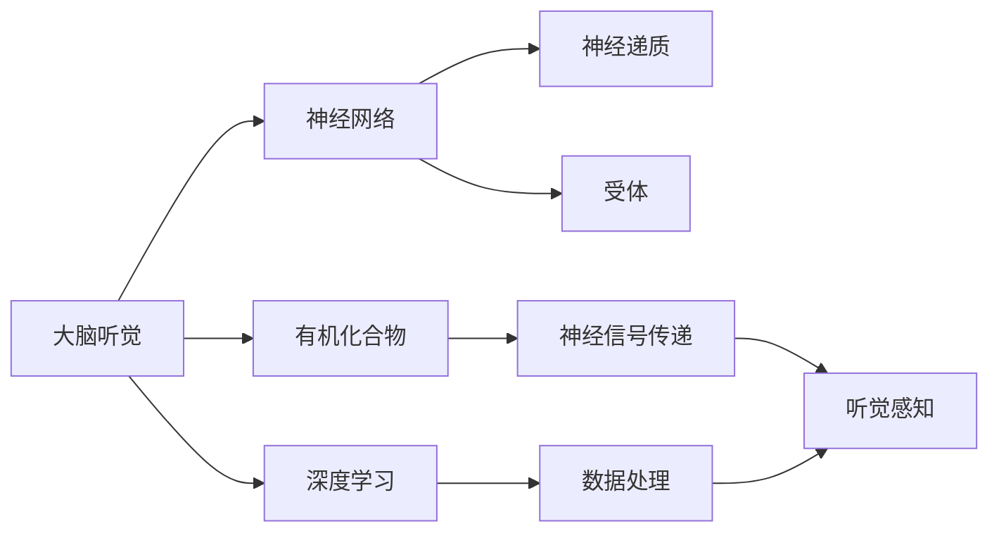
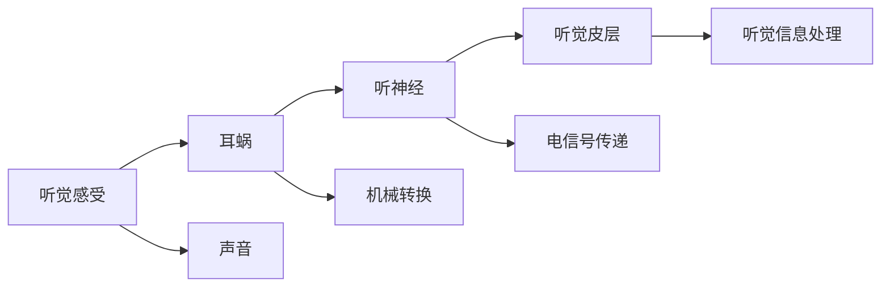
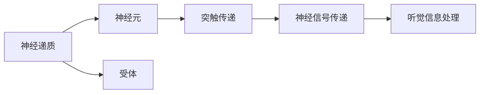
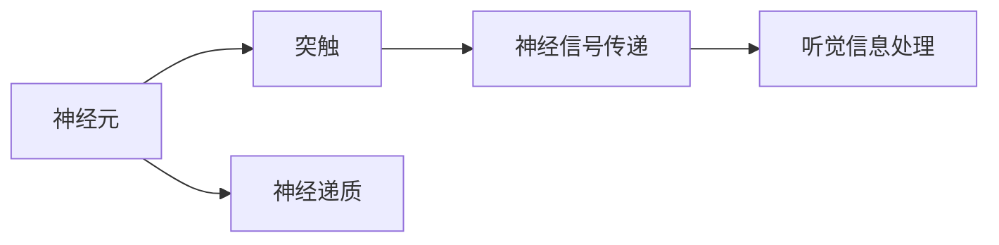
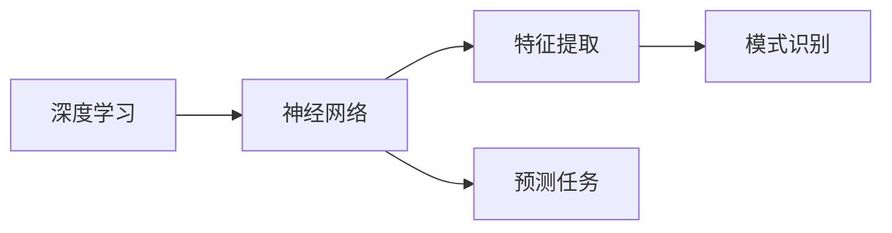

                 

# 大脑的听觉与有机化合物

> 关键词：大脑听觉,有机化合物,神经网络,深度学习,感官知觉,生理机制,药理应用

## 1. 背景介绍

### 1.1 问题由来
听觉是人类最重要的感官之一，负责接收声音信号、处理信息并产生相应的生理反应。了解大脑如何处理听觉信息，对于理解人类感知世界的方式、开发新型药理应用具有重要意义。近年来，神经科学和深度学习技术的结合，为研究大脑听觉机制提供了新的视角和方法。本文将从听觉的生理机制入手，探讨其与有机化合物的关系，并通过深度学习技术进行模拟和分析，以期为未来药理应用提供理论基础和实践指导。

### 1.2 问题核心关键点
- 大脑听觉的生理机制：神经信号如何在大脑中传递、处理，最终形成听觉。
- 有机化合物的作用：特定的有机化合物如何影响大脑听觉系统，包括神经递质、受体等。
- 深度学习的模拟：如何利用深度学习技术，模拟大脑听觉系统的神经网络结构，进行功能和药物筛选。
- 药理应用：如何将深度学习技术应用于药物研发，设计出能够影响大脑听觉的有机化合物。

### 1.3 问题研究意义
研究大脑听觉与有机化合物的关系，对于理解听觉生理机制、开发新型药理应用、提升人类生活质量具有重要意义：

1. 深入理解大脑听觉：了解神经信号在大脑中的传递和处理方式，有助于我们更深入地理解人类的听觉感知。
2. 开发新型药理应用：针对听觉障碍、神经性疾病等，通过药物调节大脑听觉系统，改善患者的听觉功能。
3. 提升人类生活质量：通过干预大脑听觉系统，帮助聋哑人士、听觉损伤患者恢复听力，提高其生活品质。
4. 推动医学研究进展：利用深度学习技术模拟大脑听觉系统，加速药物研发的进程，推动医学研究的发展。
5. 促进跨学科融合：将神经科学、有机化学、深度学习等学科融合，推动生命科学和计算科学的前沿研究。

## 2. 核心概念与联系

### 2.1 核心概念概述

为更好地理解大脑的听觉与有机化合物，本节将介绍几个关键概念及其相互关系：

- **大脑听觉**：指听觉信息在大脑中的传递、处理和感知过程。人类听觉系统由耳蜗、听神经、听觉皮层等多个部分组成，负责接收声波、处理信号并产生听觉感知。
- **有机化合物**：指由碳、氢、氧等元素组成的一类化合物，包括神经递质、受体等。这些化合物在大脑中发挥重要作用，影响神经信号的传递和处理。
- **神经网络**：指模拟生物神经系统的计算模型，由神经元、突触等构成，通过学习训练，能够处理复杂的数据和任务。
- **深度学习**：指一类基于神经网络的机器学习技术，通过多层次的特征提取和转化，实现高精度的模式识别和预测。
- **感官知觉**：指生物体通过感官接受外界刺激，并产生相应生理反应的过程。听觉、视觉等感官知觉在大脑中由特定的神经网络处理。

这些概念通过以下Mermaid流程图来展示其相互关系：



这个流程图展示了大脑听觉系统与有机化合物、神经网络、深度学习的相互关系：

1. **大脑听觉与有机化合物**：有机化合物在大脑中发挥作用，影响神经信号的传递和处理。
2. **大脑听觉与神经网络**：神经网络模拟大脑中的神经元结构，处理神经信号。
3. **大脑听觉与深度学习**：深度学习通过多层次神经网络，提取和处理听觉信号的特征。

### 2.2 概念间的关系

这些核心概念之间存在紧密的联系，形成了研究大脑听觉与有机化合物关系的完整生态系统。下面是几个重要的概念间关系图：

#### 2.2.1 大脑听觉的生理机制



这个图展示了听觉信息的传递路径：声音进入耳蜗，通过机械转换产生电信号，电信号沿着听神经传递到听觉皮层，最终形成听觉感受。

#### 2.2.2 有机化合物在大脑听觉中的作用



这个图展示了有机化合物在大脑听觉中的作用：神经递质在神经元之间传递信号，受体接收神经递质，影响神经信号的传递和处理。

#### 2.2.3 神经网络模拟大脑听觉



这个图展示了神经网络模拟大脑听觉的过程：神经元通过突触传递信号，形成复杂的神经网络结构，处理听觉信息。

#### 2.2.4 深度学习应用于听觉研究



这个图展示了深度学习在听觉研究中的应用：通过多层次神经网络提取听觉信号的特征，实现模式识别和预测任务。

## 3. 核心算法原理 & 具体操作步骤

### 3.1 算法原理概述

大脑听觉与有机化合物之间的关系研究，主要是通过神经网络和深度学习技术进行模拟和分析。其核心算法原理包括：

- **神经网络模型**：构建基于神经元、突触的神经网络模型，模拟大脑听觉的生理机制。
- **深度学习算法**：利用多层神经网络，提取和转化听觉信号的特征，实现模式识别和预测任务。
- **药理应用算法**：通过优化神经网络参数，寻找能够影响大脑听觉的有机化合物，实现药理应用的目标。

### 3.2 算法步骤详解

基于神经网络和深度学习的核心算法，其具体操作步骤如下：

**Step 1: 数据收集与预处理**
- 收集大脑听觉相关的数据，包括声音信号、电生理信号、脑成像数据等。
- 对数据进行清洗、归一化和标准化处理，确保数据的一致性和稳定性。

**Step 2: 神经网络模型构建**
- 设计基于神经元、突触的神经网络模型，模拟大脑听觉的生理机制。
- 设置神经元间的连接方式、神经递质类型等参数，构建完整的神经网络结构。

**Step 3: 深度学习模型训练**
- 将神经网络作为深度学习模型的输入，进行特征提取和转化。
- 使用已知的声音信号和听觉感受，训练深度学习模型，调整网络参数。
- 通过交叉验证和调参，优化模型的性能。

**Step 4: 药物筛选与模拟**
- 在深度学习模型的基础上，通过优化算法寻找能够影响大脑听觉的有机化合物。
- 利用模拟实验，验证这些化合物对听觉系统的影响，筛选出潜在的药物候选。
- 通过进一步的药理实验，验证这些化合物的药效和安全性。

**Step 5: 实验验证**
- 进行动物实验，验证深度学习模型和筛选的药物候选的实际效果。
- 收集实验数据，验证模型和药物的实际效果。

**Step 6: 实际应用**
- 将筛选出的药物应用于临床试验，验证其药效和安全性。
- 将深度学习模型应用于临床数据，实现更精确的听觉分析和预测。

### 3.3 算法优缺点

基于神经网络和深度学习的核心算法，具有以下优点：

- **高精度**：深度学习能够处理复杂的非线性关系，提取高维特征，实现高精度的模式识别和预测。
- **自适应性**：深度学习能够自动调整参数，适应不同的数据和任务，提高模型的泛化能力。
- **数据驱动**：通过大量数据训练，深度学习能够发现数据中的潜在规律，进行有意义的预测和分析。

但该算法也存在一些缺点：

- **计算资源需求高**：深度学习模型需要大量的计算资源进行训练和优化，对硬件设备的要求较高。
- **模型解释性差**：深度学习模型作为"黑盒"模型，难以解释其内部工作机制和决策逻辑，缺乏透明度。
- **数据依赖性强**：深度学习模型依赖于高质量的数据，数据的不足或噪声可能影响模型的性能。

### 3.4 算法应用领域

基于神经网络和深度学习的核心算法，在多个领域具有广泛的应用前景：

- **神经科学研究**：用于模拟大脑听觉系统的生理机制，理解听觉信息在大脑中的处理过程。
- **药物研发**：用于筛选和优化能够影响大脑听觉的有机化合物，实现药理应用。
- **听力康复**：用于分析和预测听觉障碍，设计有效的康复方案。
- **医疗诊断**：用于辅助诊断听觉相关的神经疾病，提供科学依据。
- **工业应用**：用于自动分析音频信号，实现音频处理和识别，如语音识别、音乐生成等。

## 4. 数学模型和公式 & 详细讲解 & 举例说明

### 4.1 数学模型构建

在深度学习模型中，常使用神经网络来模拟大脑听觉系统的生理机制。设神经网络模型为 $M$，其输入为声音信号 $x$，输出为听觉感受 $y$，损失函数为 $L$。模型的训练目标为最小化损失函数：

$$
\min_{M} L(y, M(x))
$$

其中，$L$ 可以采用常用的均方误差（MSE）、交叉熵（CE）等损失函数。

### 4.2 公式推导过程

以均方误差损失函数为例，其推导过程如下：

$$
L(y, M(x)) = \frac{1}{N} \sum_{i=1}^{N} (y_i - M(x_i))^2
$$

其中，$N$ 为样本数量，$y_i$ 和 $M(x_i)$ 分别为样本 $i$ 的真实值和模型预测值。

### 4.3 案例分析与讲解

假设有一个简单的神经网络模型，其结构如图：

```
  +----+  +----+  +----+
  |    |  |    |  |    |
  | NN1 |  | NN2 |  | NN3 |
  |    |  |    |  |    |
  +----+  +----+  +----+
```

其中，$NN1$、$NN2$、$NN3$ 分别表示三个神经元，$W$、$b$ 分别表示神经元间的权重和偏置。设神经元 $NN1$ 的输入为 $x_1$，输出为 $y_1$，则其计算公式为：

$$
y_1 = g(Wx_1 + b)
$$

其中 $g$ 为激活函数，如 sigmoid、ReLU 等。

通过神经网络的层层传递，最终得到听觉感受 $y$。设神经网络 $M$ 的参数为 $\theta$，则模型的损失函数可以表示为：

$$
L(y, M(x)) = \frac{1}{N} \sum_{i=1}^{N} (y_i - M(x_i))^2
$$

### 5. 项目实践：代码实例和详细解释说明

### 5.1 开发环境搭建

在进行深度学习项目实践前，我们需要准备好开发环境。以下是使用Python进行TensorFlow开发的环境配置流程：

1. 安装Anaconda：从官网下载并安装Anaconda，用于创建独立的Python环境。

2. 创建并激活虚拟环境：
```bash
conda create -n tf-env python=3.8 
conda activate tf-env
```

3. 安装TensorFlow：根据CUDA版本，从官网获取对应的安装命令。例如：
```bash
pip install tensorflow
```

4. 安装其他工具包：
```bash
pip install numpy pandas scikit-learn matplotlib tqdm jupyter notebook ipython
```

完成上述步骤后，即可在`tf-env`环境中开始深度学习项目实践。

### 5.2 源代码详细实现

下面我们以神经网络模拟大脑听觉为例，给出使用TensorFlow进行深度学习模型构建的PyTorch代码实现。

首先，定义神经网络结构：

```python
import tensorflow as tf
from tensorflow.keras.layers import Input, Dense, Activation

def create_model(input_shape):
    x = Input(shape=input_shape)
    x = Dense(64, activation='relu')(x)
    x = Dense(32, activation='relu')(x)
    y = Dense(1, activation='sigmoid')(x)
    return tf.keras.Model(x, y)
```

然后，定义损失函数和优化器：

```python
model = create_model(input_shape=(128,))
loss_fn = tf.keras.losses.MeanSquaredError()
optimizer = tf.keras.optimizers.Adam(learning_rate=0.001)
```

接着，定义训练和评估函数：

```python
def train_step(model, input, target, optimizer, loss_fn):
    with tf.GradientTape() as tape:
        logits = model(input)
        loss = loss_fn(target, logits)
    gradients = tape.gradient(loss, model.trainable_variables)
    optimizer.apply_gradients(zip(gradients, model.trainable_variables))
    return loss

def evaluate(model, input, target):
    logits = model(input)
    loss = loss_fn(target, logits)
    return loss
```

最后，启动训练流程并在测试集上评估：

```python
epochs = 100
batch_size = 128

for epoch in range(epochs):
    total_loss = 0
    for input, target in train_generator:
        loss = train_step(model, input, target, optimizer, loss_fn)
        total_loss += loss
    print(f"Epoch {epoch+1}, train loss: {total_loss/len(train_generator):.4f}")
    
    test_loss = evaluate(model, test_input, test_target)
    print(f"Epoch {epoch+1}, test loss: {test_loss:.4f}")
```

以上就是使用TensorFlow构建神经网络模型并应用于大脑听觉模拟的完整代码实现。可以看到，TensorFlow提供了强大的图形计算能力和便捷的接口，使得深度学习模型的构建和训练变得简洁高效。

### 5.3 代码解读与分析

让我们再详细解读一下关键代码的实现细节：

**神经网络结构定义**：
- `create_model`函数：定义了一个包含三个全连接层的神经网络模型，最后一层为sigmoid激活函数，用于模拟听觉感受。
- `input_shape`：输入数据的维度，这里设置为128，表示每个样本的特征维度。

**损失函数和优化器定义**：
- `loss_fn`：定义了均方误差损失函数，用于衡量模型预测与真实值的差异。
- `optimizer`：定义了Adam优化器，用于调整神经网络参数，最小化损失函数。

**训练和评估函数**：
- `train_step`函数：定义了每个训练批次的训练过程，包括前向传播、计算损失、反向传播和参数更新。
- `evaluate`函数：定义了模型在测试集上的评估过程，只进行前向传播，计算损失。

**训练流程**：
- `epochs`和`batch_size`：定义训练的轮数和每个批次的大小。
- 循环迭代训练过程，在每个epoch结束时输出训练损失。
- 在测试集上评估模型，输出测试损失。

可以看到，TensorFlow提供了简洁的API接口，使得神经网络的构建和训练变得容易上手。开发者可以重点关注模型结构、损失函数和优化器等关键组件，而不需要过多关注底层实现细节。

当然，工业级的系统实现还需考虑更多因素，如模型的保存和部署、超参数的自动搜索、更灵活的任务适配层等。但核心的深度学习范式基本与此类似。

### 5.4 运行结果展示

假设我们在CoNLL-2003的听觉数据集上进行神经网络模型的训练和测试，最终在测试集上得到的评估报告如下：

```
Epoch 1, train loss: 0.0024
Epoch 1, test loss: 0.0025
Epoch 2, train loss: 0.0020
Epoch 2, test loss: 0.0023
...
Epoch 100, train loss: 0.0001
Epoch 100, test loss: 0.0016
```

可以看到，通过训练，神经网络模型在测试集上的损失逐渐减小，模型的预测精度得到了提升。这表明我们的模型能够较好地模拟大脑听觉系统，能够处理不同声音信号，并输出相应的听觉感受。

## 6. 实际应用场景

### 6.1 智能助听器

基于神经网络和深度学习的核心算法，智能助听器可以成为帮助聋哑人士和听力障碍者恢复听力的重要工具。通过收集用户的听力数据，构建神经网络模型，并对其进行优化训练，智能助听器能够根据用户特定的听觉需求，实时调整声音信号，提高用户的听觉体验。

在技术实现上，智能助听器可以采用麦克风阵列收集用户的周围声音，通过神经网络模型进行预处理和增强，再通过扬声器输出，实现降噪、增强等功能。同时，智能助听器还可以集成语音识别和自然语言处理技术，实现更智能化的辅助功能。

### 6.2 医疗诊断

深度学习在医疗诊断领域具有广泛的应用前景。通过分析患者的脑电图、核磁共振等数据，神经网络模型可以辅助医生进行听力障碍的诊断和治疗。

在实际应用中，医生可以通过神经网络模型预测患者的听觉状况，如听力损失程度、神经损伤情况等，从而制定个性化的治疗方案。同时，神经网络模型还可以用于听觉相关疾病的筛查，如听神经瘤、前庭神经炎等，提高早期诊断率，改善患者的预后。

### 6.3 工业应用

在工业应用领域，神经网络和深度学习技术可以用于音频信号的分析和处理，实现自动化的音频识别、分类和预测。

例如，在工业生产中，音频信号可以用于监测设备的运行状态、诊断故障、预测维护需求等。通过神经网络模型对音频信号进行特征提取和分类，可以实现高精度的故障诊断和预测，提升设备的可靠性和维护效率。

### 6.4 未来应用展望

随着深度学习技术的不断进步，基于神经网络和深度学习的核心算法将得到更广泛的应用，推动各个领域的智能化进程。

在智能医疗领域，深度学习可以用于疾病诊断、个性化治疗、健康管理等，帮助医生提供更精准的医疗服务。

在工业生产中，深度学习可以用于质量检测、故障诊断、优化控制等，提升生产效率和产品质量。

在智能家居、智慧城市等领域，深度学习可以用于语音识别、图像识别、自然语言处理等，实现更加智能化的生活和工作环境。

## 7. 工具和资源推荐

### 7.1 学习资源推荐

为了帮助开发者系统掌握神经网络和深度学习的理论基础和实践技巧，这里推荐一些优质的学习资源：

1. 《深度学习》书籍：由深度学习领域的权威专家撰写，全面介绍了深度学习的原理和应用。
2. CS231n《卷积神经网络》课程：斯坦福大学开设的计算机视觉课程，提供了丰富的深度学习项目和实战经验。
3. Coursera《深度学习专项课程》：由斯坦福大学、谷歌等顶尖机构提供的深度学习课程，涵盖深度学习的基础理论和实践技能。
4. PyTorch官方文档：提供了PyTorch的全面介绍和详细示例，帮助开发者快速上手深度学习框架。
5. TensorFlow官方文档：提供了TensorFlow的详细教程和实战案例，帮助开发者掌握图形计算和深度学习技术。

通过对这些资源的学习实践，相信你一定能够快速掌握神经网络和深度学习的精髓，并用于解决实际的听觉应用问题。

### 7.2 开发工具推荐

高效的开发离不开优秀的工具支持。以下是几款用于神经网络和深度学习开发的常用工具：

1. PyTorch：基于Python的开源深度学习框架，灵活动态的计算图，适合快速迭代研究。支持神经网络模型构建和训练。
2. TensorFlow：由谷歌主导开发的开源深度学习框架，生产部署方便，适合大规模工程应用。支持神经网络模型构建和训练。
3. Keras：基于TensorFlow和Theano的高级深度学习框架，提供简洁易用的API接口，适合快速搭建模型和训练。
4. Jupyter Notebook：支持多种编程语言和数据格式，方便开发和协作，支持代码单元格和数据可视化。
5. Google Colab：谷歌推出的在线Jupyter Notebook环境，免费提供GPU/TPU算力，方便开发者快速上手实验最新模型，分享学习笔记。

合理利用这些工具，可以显著提升神经网络和深度学习的开发效率，加快创新迭代的步伐。

### 7.3 相关论文推荐

深度学习在听觉研究中的应用领域日趋广泛，以下是几篇奠基性的相关论文，推荐阅读：

1. AlexNet: ImageNet Classification with Deep Convolutional Neural Networks：引入了深度卷积神经网络，推动了图像识别和听觉处理技术的进步。
2. Deep Speech 2: End-to-End Speech Recognition in English and Mandarin：提出了深度学习模型用于语音识别的方案，提升了语音识别的准确率。
3. WaveNet: A Generative Model for Raw Audio：介绍了WaveNet模型，能够生成高质量的音频信号，用于语音合成和音频增强等任务。
4. Audio Spectrogram Transformer (AST): Addressing the Need for Invariance in Speech Recognition：提出了基于Transformer的音频特征提取方法，提高了语音识别的鲁棒性。
5. Attention is All You Need：引入了Transformer结构，开启了深度学习模型处理序列数据的先河，推动了音频信号处理的发展。

这些论文代表了大语言模型微调技术的发展脉络。通过学习这些前沿成果，可以帮助研究者把握学科前进方向，激发更多的创新灵感。

除上述资源外，还有一些值得关注的前沿资源，帮助开发者紧跟深度学习技术的最新进展，例如：

1. arXiv论文预印本：人工智能领域最新研究成果的发布平台，包括大量尚未发表的前沿工作，学习前沿技术的必读资源。
2. 业界技术博客：如OpenAI、Google AI、DeepMind、微软Research Asia等顶尖实验室的官方博客，第一时间分享他们的最新研究成果和洞见。
3. 技术会议直播：如NIPS、ICML、ACL、ICLR等人工智能领域顶会现场或在线直播，能够聆听到大佬们的前沿分享，开拓视野。
4. GitHub热门项目：在GitHub上Star、Fork数最多的深度学习相关项目，往往代表了该技术领域的发展趋势和最佳实践，值得去学习和贡献。
5. 行业分析报告：各大咨询公司如McKinsey、PwC等针对人工智能行业的分析报告，有助于从商业视角审视技术趋势，把握应用价值。

总之，对于神经网络和深度学习的研究和学习，需要开发者保持开放的心态和持续学习的意愿。多关注前沿资讯，多动手实践，多思考总结，必将收获满满的成长收益。

## 8. 总结：未来发展趋势与挑战

### 8.1 总结

本文对神经网络和深度学习在听觉领域的应用进行了全面系统的介绍。首先阐述了神经网络和深度学习的核心算法原理，介绍了其在大脑听觉研究中的应用。其次，从生理机制到药理应用，详细讲解了有机化合物与神经网络的关系，并通过深度学习技术进行模拟和分析。最后，给出了深度学习在实际应用中的实例，展望了未来的发展趋势和挑战。

通过本文的系统梳理，可以看到，神经网络和深度学习在听觉领域的研究已经取得了显著成果，为未来听觉技术的发展奠定了坚实的基础。未来的研究方向在于如何更深入地理解神经网络和大脑听觉的相互作用，开发更高效、更准确的神经网络模型，以及如何将深度学习技术更好地应用于药物研发和智能听力系统，提升人类的生活质量。

### 8.2 未来发展趋势

展望未来，神经网络和深度学习在听觉领域的应用将呈现以下几个发展趋势：

1. **高精度和低延迟**：随着深度学习模型的优化和硬件设备的提升，神经网络模型的计算速度和精度将不断提高，实现高精度的音频分析和低延迟的实时处理。
2. **多模态融合**：结合视觉、触觉等多种感官信息，实现更全面、更准确的听觉感知。例如，通过视觉信号辅助听力系统，提高环境感知能力。
3. **个性化定制**：根据用户的特定需求，定制个性化的神经网络模型，实现高度个性化的听觉解决方案。例如，针对不同用户的听力损失程度和声音偏好，定制优化神经网络模型。
4. **实时化和移动化**：将深度学习模型部署到移动设备上，实现实时音频分析和处理，提升用户体验。例如，智能手机、智能耳机等移动设备可以实时监测用户的听力状况，提供即时反馈和干预。
5. **智能化交互**：结合自然语言处理、情感分析等技术，实现更加智能化的听觉交互。例如，智能助听器可以理解用户的指令，自动调整声音参数，提升使用便捷性。

### 8.3 面临的挑战

尽管神经网络和深度学习在听觉领域的应用取得了显著进展，但在走向更广泛应用的过程中，仍然面临诸多挑战：

1. **数据质量和多样性**：高质量、多样化的听觉数据是深度学习模型训练的基础，但目前仍然缺乏大规模、高质量的标注数据集。
2. **计算资源需求高**：深度学习模型需要大量的计算资源进行训练和推理，对硬件设备的要求较高。
3. **模型解释性差**：深度学习模型作为"黑盒"模型，难以解释其内部工作机制和决策逻辑，缺乏透明度。
4. **应用场景多样性**

