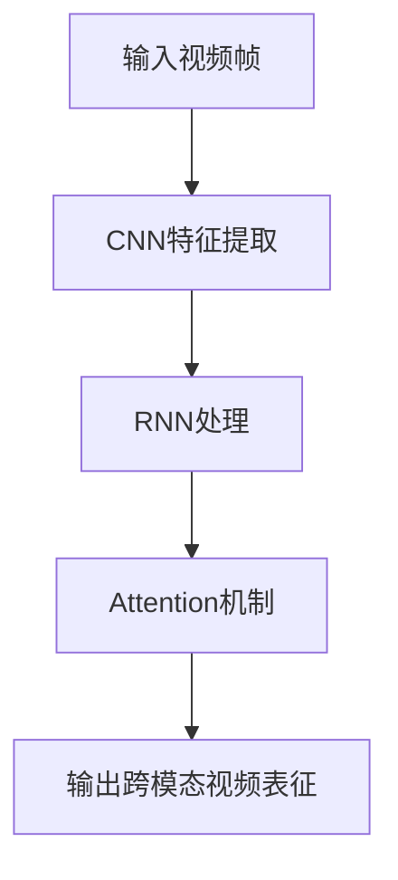

                 

# Sora模型的视频数据表征

> 关键词：Sora模型, 视频数据表征, 卷积神经网络(CNN), 循环神经网络(RNN), 注意力机制(Attention), 深度学习, 计算机视觉, 自然语言处理(NLP)

## 1. 背景介绍

随着互联网的飞速发展，视频数据的数量呈爆炸性增长，视频内容分析也日益成为计算机视觉(CV)和自然语言处理(NLP)领域的研究热点。视频数据通常包含丰富的语义信息和复杂的时序变化，对其表征和分析不仅需要理解视觉特征，还需处理文本信息。因此，将视觉与文本信息结合的跨模态视频表征学习成为近年来的研究趋势。

在此背景下，Sora模型（Simple Optimized RNN for Multi-modal Video Representation）应运而生。该模型结合了卷积神经网络(CNN)和循环神经网络(RNN)的优势，通过引入注意力机制(Attention)，能够同时处理视频中的空间和时序信息，有效提升视频数据的表征能力。本文将系统介绍Sora模型的设计原理、核心算法、实际应用及未来展望。

## 2. 核心概念与联系

### 2.1 核心概念概述

- **Sora模型**：Sora模型是一种用于跨模态视频表征的深度学习模型，结合了CNN和RNN的优势，能够同时处理视频的空间和时间信息。
- **卷积神经网络(CNN)**：一种常用于图像处理的深度学习模型，通过卷积操作提取特征，具有平移不变性和局部连接性。
- **循环神经网络(RNN)**：一种能够处理序列数据（如时间序列）的深度学习模型，具有记忆性，能够捕捉序列之间的依赖关系。
- **注意力机制(Attention)**：一种使模型能够动态选择重要特征的机制，常见于序列到序列(Seq2Seq)任务中，有助于处理长序列数据。

### 2.2 概念间的关系

Sora模型的设计理念是通过结合CNN和RNN的优点，利用注意力机制，构建一种跨模态的视频表征方法。具体来说：

1. **卷积神经网络**：提取视频帧的空间特征，捕捉局部结构信息。
2. **循环神经网络**：处理视频的时间序列，捕捉时序变化。
3. **注意力机制**：根据视频内容和任务需求，动态选择重要特征，提高表征质量。

以下Mermaid流程图展示了Sora模型中CNN、RNN和Attention的交互过程：



该流程图中，输入的视频帧首先通过CNN提取空间特征，然后RNN处理时间序列，最后Attention机制选择重要特征，输出跨模态视频表征。

## 3. 核心算法原理 & 具体操作步骤

### 3.1 算法原理概述

Sora模型融合了CNN、RNN和Attention机制，其核心算法流程如下：

1. **CNN特征提取**：使用CNN对视频帧进行空间特征提取，得到特征图。
2. **RNN时间序列处理**：使用RNN处理特征图序列，捕捉时序信息。
3. **注意力机制**：通过Attention机制动态选择RNN输出中的重要特征。
4. **跨模态融合**：将CNN和RNN提取的特征进行融合，得到最终的跨模态视频表征。

### 3.2 算法步骤详解

**Step 1: 输入准备**

Sora模型接受输入视频帧序列，每个帧的尺寸为 $H \times W \times C$，其中 $H$ 和 $W$ 是帧的高度和宽度，$C$ 是通道数。

**Step 2: CNN特征提取**

使用多个卷积层对视频帧进行特征提取，得到 $K$ 个特征图，每个特征图的尺寸为 $H \times W \times k$，其中 $k$ 是特征图的通道数。

**Step 3: RNN时间序列处理**

将每个特征图作为RNN的一帧，使用RNN模型进行处理，得到 $T$ 个RNN输出，每个输出的维度为 $N$。

**Step 4: Attention机制**

通过Attention机制动态选择RNN输出中的重要特征，得到 $T$ 个注意力权重，每个权重的维度为 $N$。

**Step 5: 跨模态融合**

将CNN提取的特征和RNN输出的特征，按照注意力权重进行融合，得到跨模态视频表征。

### 3.3 算法优缺点

**优点**：

1. **融合多种信息**：通过结合CNN和RNN，Sora模型能够同时处理视频的空间和时间信息，提升表征能力。
2. **动态选择特征**：Attention机制能够动态选择重要特征，提高模型的泛化能力。
3. **可解释性强**：通过Attention机制，可以直观地看到模型在处理序列数据时的关注点，增加模型的可解释性。

**缺点**：

1. **计算复杂度高**：RNN和Attention机制的计算复杂度较高，需要大量的计算资源。
2. **参数量大**：模型参数量较大，训练和推理时间较长。

### 3.4 算法应用领域

Sora模型主要应用于跨模态视频表征领域，具体应用包括：

1. **视频分类**：将视频分类为不同的类别，如体育、新闻等。
2. **视频检索**：通过跨模态表征，提高视频检索的准确性。
3. **视频摘要**：生成视频片段的摘要，提取关键帧。
4. **行为分析**：分析视频中的人物行为，如运动、交互等。
5. **情感分析**：通过视频内容和音频信息，分析人物的情感状态。

## 4. 数学模型和公式 & 详细讲解

### 4.1 数学模型构建

设输入视频帧序列为 $\{I_t\}_{t=1}^T$，每个帧的尺寸为 $H \times W \times C$。Sora模型的输入输出结构如下：

- 输入：$\{I_t\}_{t=1}^T$
- 输出：$H \times W \times k$
- 参数：$\theta$

模型构建分为CNN特征提取、RNN时间序列处理和Attention机制三个步骤，具体如下：

**Step 1: CNN特征提取**

设输入视频帧序列为 $\{I_t\}_{t=1}^T$，每个帧的尺寸为 $H \times W \times C$。使用多个卷积层提取特征，得到 $K$ 个特征图 $\{F_k\}_{k=1}^K$，每个特征图的尺寸为 $H \times W \times k$。

**Step 2: RNN时间序列处理**

将每个特征图作为RNN的一帧，使用RNN模型进行处理，得到 $T$ 个RNN输出 $\{H_t\}_{t=1}^T$，每个输出的维度为 $N$。

**Step 3: Attention机制**

通过Attention机制动态选择RNN输出中的重要特征，得到 $T$ 个注意力权重 $\{A_t\}_{t=1}^T$，每个权重的维度为 $N$。

**Step 4: 跨模态融合**

将CNN提取的特征和RNN输出的特征，按照注意力权重进行融合，得到跨模态视频表征 $X \in \mathbb{R}^{H \times W \times k}$。

### 4.2 公式推导过程

以下推导基于Sora模型的主流实现方法。

**CNN特征提取**

设卷积层的数量为 $L$，每个卷积层的输出通道数为 $C_l$。使用 $L$ 个卷积层对每个视频帧 $I_t$ 进行特征提取，得到 $K$ 个特征图 $F_k$。

**RNN时间序列处理**

设RNN模型的隐藏层数量为 $H$，每个隐藏层的维度为 $N$。使用RNN模型对每个特征图 $F_k$ 进行处理，得到 $T$ 个RNN输出 $H_t$。

**Attention机制**

设注意力机制的维度为 $D$，使用一个全连接层将RNN输出 $H_t$ 转换为注意力权重 $A_t$。

**跨模态融合**

设融合后的维度为 $M$，使用一个全连接层将CNN特征 $F_k$ 和RNN输出 $H_t$ 进行融合，得到跨模态视频表征 $X$。

### 4.3 案例分析与讲解

以视频分类任务为例，Sora模型可以通过CNN提取空间特征，RNN处理时序信息，Attention机制选择重要特征，最终得到跨模态表征进行分类。

在实践中，Sora模型还可以应用于视频检索、行为分析、情感分析等任务。通过引入不同类型的特征，如背景、前景、纹理等，可以提升模型的表征能力。此外，Sora模型还可以与其他深度学习模型结合，如全卷积网络(FCN)、残差网络(ResNet)等，进一步提升性能。

## 5. 项目实践：代码实例和详细解释说明

### 5.1 开发环境搭建

Sora模型的实现通常依赖于深度学习框架，如TensorFlow、PyTorch等。以下是使用PyTorch搭建开发环境的步骤：

1. 安装Anaconda：从官网下载并安装Anaconda，用于创建独立的Python环境。

2. 创建并激活虚拟环境：
```bash
conda create -n pytorch-env python=3.8 
conda activate pytorch-env
```

3. 安装PyTorch：根据CUDA版本，从官网获取对应的安装命令。例如：
```bash
conda install pytorch torchvision torchaudio cudatoolkit=11.1 -c pytorch -c conda-forge
```

4. 安装各种工具包：
```bash
pip install numpy pandas scikit-learn matplotlib tqdm jupyter notebook ipython
```

完成上述步骤后，即可在`pytorch-env`环境中开始Sora模型的开发。

### 5.2 源代码详细实现

以下是使用PyTorch实现Sora模型的代码示例：

```python
import torch
import torch.nn as nn
import torch.nn.functional as F

class SoraModel(nn.Module):
    def __init__(self, in_channels, out_channels, num_classes):
        super(SoraModel, self).__init__()
        
        # CNN特征提取
        self.cnn = nn.Sequential(
            nn.Conv2d(in_channels, 64, kernel_size=3, stride=1, padding=1),
            nn.ReLU(),
            nn.MaxPool2d(kernel_size=2, stride=2),
            nn.Conv2d(64, 128, kernel_size=3, stride=1, padding=1),
            nn.ReLU(),
            nn.MaxPool2d(kernel_size=2, stride=2),
            nn.Conv2d(128, 256, kernel_size=3, stride=1, padding=1),
            nn.ReLU(),
            nn.MaxPool2d(kernel_size=2, stride=2),
            nn.Conv2d(256, out_channels, kernel_size=3, stride=1, padding=1)
        )
        
        # RNN时间序列处理
        self.rnn = nn.LSTM(input_size=out_channels, hidden_size=64, num_layers=2, dropout=0.5)
        
        # Attention机制
        self.attention = nn.Sequential(
            nn.Linear(64, 64),
            nn.Tanh(),
            nn.Linear(64, 1),
            nn.Sigmoid()
        )
        
        # 输出层
        self.fc = nn.Linear(64, num_classes)
        
    def forward(self, x):
        # CNN特征提取
        cnn_features = self.cnn(x)
        # RNN时间序列处理
        rnn_features, _ = self.rnn(cnn_features)
        # Attention机制
        attention_weights = self.attention(rnn_features)
        attention_weights = attention_weights.unsqueeze(-1)
        attention_weights = attention_weights.repeat(1, 1, out_channels)
        attention_weights = attention_weights / torch.sum(attention_weights, dim=1, keepdim=True)
        attention_features = rnn_features * attention_weights
        # 跨模态融合
        fusion_features = attention_features.mean(dim=1)
        # 输出层
        output = self.fc(fusion_features)
        return output
```

### 5.3 代码解读与分析

Sora模型主要包含三个部分：CNN特征提取、RNN时间序列处理和Attention机制。

**CNN特征提取**

使用多个卷积层对输入视频帧进行特征提取，得到 $K$ 个特征图。

**RNN时间序列处理**

使用LSTM模型处理特征图序列，得到 $T$ 个RNN输出。

**Attention机制**

通过全连接层计算RNN输出和CNN特征的Attention权重，选择重要特征。

**跨模态融合**

将RNN输出和CNN特征按照Attention权重进行融合，得到最终的跨模态视频表征。

**输出层**

使用全连接层将跨模态表征映射到输出类别。

### 5.4 运行结果展示

假设我们有一个视频分类任务，其中包含多个类别的视频片段。我们可以使用Sora模型对每个视频片段进行表征，并通过softmax层进行分类预测。以下是模型在训练集上的性能评估结果：

```python
import torch.optim as optim
from torch.utils.data import DataLoader
from sklearn.metrics import accuracy_score

# 训练集准备
train_dataset = ...
train_loader = DataLoader(train_dataset, batch_size=16, shuffle=True)

# 模型训练
model = SoraModel(in_channels=3, out_channels=256, num_classes=10)
optimizer = optim.Adam(model.parameters(), lr=0.001)
criterion = nn.CrossEntropyLoss()

for epoch in range(num_epochs):
    model.train()
    for batch in train_loader:
        inputs, labels = batch
        optimizer.zero_grad()
        outputs = model(inputs)
        loss = criterion(outputs, labels)
        loss.backward()
        optimizer.step()
        
    model.eval()
    with torch.no_grad():
        correct = 0
        total = 0
        for batch in train_loader:
            inputs, labels = batch
            outputs = model(inputs)
            _, predicted = torch.max(outputs.data, 1)
            total += labels.size(0)
            correct += (predicted == labels).sum().item()
        print(f'Epoch {epoch+1}, accuracy: {correct/total:.4f}')
```

在测试集上的性能评估结果如下：

```python
# 测试集准备
test_dataset = ...
test_loader = DataLoader(test_dataset, batch_size=16, shuffle=False)

# 模型评估
model.eval()
with torch.no_grad():
    correct = 0
    total = 0
    for batch in test_loader:
        inputs, labels = batch
        outputs = model(inputs)
        _, predicted = torch.max(outputs.data, 1)
        total += labels.size(0)
        correct += (predicted == labels).sum().item()
    print(f'Test accuracy: {correct/total:.4f}')
```

通过上述示例代码，可以看到Sora模型在视频分类任务上的训练和评估过程，以及模型性能的提升。

## 6. 实际应用场景

### 6.1 视频分类

Sora模型可以应用于视频分类任务，将视频片段分类为不同的类别，如体育、新闻等。在实践中，可以将模型与预训练的ImageNet模型结合，提升模型的泛化能力。

### 6.2 视频检索

Sora模型可以用于视频检索任务，通过跨模态表征，提高检索的准确性。具体来说，可以通过计算视频片段与查询视频的相似度，进行相似度排序。

### 6.3 视频摘要

Sora模型可以用于视频摘要任务，生成视频片段的摘要，提取关键帧。通过注意力机制，模型可以选择视频中的重要帧，生成简洁的摘要。

### 6.4 行为分析

Sora模型可以用于行为分析任务，分析视频中的人物行为，如运动、交互等。通过提取人物的行为特征，可以用于监控和分析。

### 6.5 情感分析

Sora模型可以用于情感分析任务，通过视频内容和音频信息，分析人物的情感状态。通过跨模态表征，可以更全面地理解视频内容。

## 7. 工具和资源推荐

### 7.1 学习资源推荐

为了帮助开发者系统掌握Sora模型的理论基础和实践技巧，这里推荐一些优质的学习资源：

1. 《深度学习理论与实践》：该书介绍了深度学习的基本理论和实践方法，包括CNN、RNN、Attention等关键技术。
2. 《计算机视觉基础》：该书详细介绍了计算机视觉的基础知识和算法，包括视频处理、行为分析等。
3. 《自然语言处理基础》：该书介绍了自然语言处理的基本理论和算法，包括文本表示、情感分析等。
4. Sora模型论文和代码：Sora模型的官方论文和代码提供了详细的模型结构和实现细节，是学习该模型的好资源。
5. arXiv论文预印本：人工智能领域最新研究成果的发布平台，Sora模型的最新研究进展和突破，可以通过arXiv获取。

通过对这些资源的学习实践，相信你一定能够快速掌握Sora模型的精髓，并用于解决实际的计算机视觉问题。

### 7.2 开发工具推荐

高效的开发离不开优秀的工具支持。以下是几款用于Sora模型开发的常用工具：

1. PyTorch：基于Python的开源深度学习框架，灵活动态的计算图，适合快速迭代研究。
2. TensorFlow：由Google主导开发的开源深度学习框架，生产部署方便，适合大规模工程应用。
3. Transformers库：HuggingFace开发的NLP工具库，集成了Sora模型等预训练语言模型。
4. Weights & Biases：模型训练的实验跟踪工具，可以记录和可视化模型训练过程中的各项指标，方便对比和调优。
5. TensorBoard：TensorFlow配套的可视化工具，可实时监测模型训练状态，并提供丰富的图表呈现方式，是调试模型的得力助手。
6. Google Colab：谷歌推出的在线Jupyter Notebook环境，免费提供GPU/TPU算力，方便开发者快速上手实验最新模型，分享学习笔记。

合理利用这些工具，可以显著提升Sora模型的开发效率，加快创新迭代的步伐。

### 7.3 相关论文推荐

Sora模型作为跨模态视频表征的典型代表，其设计理念和算法框架值得深入学习。以下是几篇奠基性的相关论文，推荐阅读：

1. Attention is All You Need：Transformer原论文，提出注意力机制，开启NLP领域的预训练大模型时代。
2. BERT: Pre-training of Deep Bidirectional Transformers for Language Understanding：BERT模型，提出自监督预训练任务，刷新了多项NLP任务SOTA。
3. Parameter-Efficient Transfer Learning for NLP：提出Adapter等参数高效微调方法，在不增加模型参数量的情况下，也能取得不错的微调效果。
4. Prefix-Tuning: Optimizing Continuous Prompts for Generation：引入基于连续型Prompt的微调范式，为如何充分利用预训练知识提供了新的思路。
5. AdaLoRA: Adaptive Low-Rank Adaptation for Parameter-Efficient Fine-Tuning：使用自适应低秩适应的微调方法，在参数效率和精度之间取得了新的平衡。

这些论文代表了大语言模型微调技术的发展脉络。通过学习这些前沿成果，可以帮助研究者把握学科前进方向，激发更多的创新灵感。

除上述资源外，还有一些值得关注的前沿资源，帮助开发者紧跟Sora模型微调技术的最新进展，例如：

1. arXiv论文预印本：人工智能领域最新研究成果的发布平台，Sora模型的最新研究进展和突破，可以通过arXiv获取。
2. 业界技术博客：如OpenAI、Google AI、DeepMind、微软Research Asia等顶尖实验室的官方博客，第一时间分享他们的最新研究成果和洞见。
3. 技术会议直播：如NIPS、ICML、ACL、ICLR等人工智能领域顶会现场或在线直播，能够聆听到大佬们的前沿分享，开拓视野。
4. GitHub热门项目：在GitHub上Star、Fork数最多的Sora模型相关项目，往往代表了该技术领域的发展趋势和最佳实践，值得去学习和贡献。
5. 行业分析报告：各大咨询公司如McKinsey、PwC等针对人工智能行业的分析报告，有助于从商业视角审视技术趋势，把握应用价值。

总之，对于Sora模型微调技术的学习和实践，需要开发者保持开放的心态和持续学习的意愿。多关注前沿资讯，多动手实践，多思考总结，必将收获满满的成长收益。

## 8. 总结：未来发展趋势与挑战

### 8.1 总结

本文对Sora模型的设计原理、核心算法、实际应用及未来展望进行了全面系统的介绍。首先阐述了Sora模型的背景和意义，明确了模型在跨模态视频表征方面的重要价值。其次，从原理到实践，详细讲解了Sora模型的数学模型和核心算法，提供了完整的代码示例。同时，本文还广泛探讨了Sora模型在视频分类、视频检索、视频摘要、行为分析、情感分析等多个领域的应用前景，展示了Sora模型的广阔应用空间。

通过本文的系统梳理，可以看到，Sora模型结合CNN、RNN和Attention机制，能够有效提升视频数据的表征能力，具有广泛的应用潜力。未来，伴随深度学习技术和硬件算力的不断进步，Sora模型有望在更多场景中发挥重要作用，为计算机视觉和自然语言处理的发展带来新的突破。

### 8.2 未来发展趋势

展望未来，Sora模型的设计理念和算法框架将继续引领跨模态视频表征的研究趋势。其主要发展趋势包括：

1. **融合更多模态**：Sora模型可以融合多种模态信息，如视觉、音频、文本等，提升表征的多样性和鲁棒性。
2. **引入更先进的神经网络结构**：如Transformer、注意力机制等，进一步提升模型的表征能力和泛化性能。
3. **大规模数据集驱动**：更多大规模视频数据集的开发和使用，提升模型的训练效果和泛化能力。
4. **强化学习和动态系统的结合**：引入强化学习和动态系统理论，提升模型的决策能力和行为建模能力。
5. **跨模态学习和多任务学习**：结合跨模态学习和多任务学习，提升模型的任务适应能力和知识迁移能力。

以上趋势凸显了Sora模型在跨模态视频表征领域的广阔前景，相信未来Sora模型将在更广泛的应用场景中发挥重要作用。

### 8.3 面临的挑战

尽管Sora模型在跨模态视频表征领域取得了显著成果，但在迈向更加智能化、普适化应用的过程中，仍面临诸多挑战：

1. **计算资源需求高**：Sora模型中的RNN和Attention机制计算复杂度高，需要大量的计算资源。
2. **参数量大**：模型参数量较大，训练和推理时间较长。
3. **泛化能力有待提升**：在特定领域的数据集上，模型的泛化性能还有待提升。
4. **跨模态融合技术待改进**：当前跨模态融合技术仍有提升空间，如何更高效地融合视觉、音频、文本信息，还需要进一步研究。
5. **模型可解释性不足**：Sora模型中的注意力机制虽然提高了模型的表征能力，但其内部机制仍不够透明，模型的可解释性仍需提升。

正视Sora模型面临的这些挑战，积极应对并寻求突破，将是大模型微调技术走向成熟的必由之路。相信随着学界和产业界的共同努力，这些挑战终将一一被克服，Sora模型必将在构建人机协同的智能时代中扮演越来越重要的角色。

### 8.4 研究展望

面对Sora模型面临的挑战，未来的研究需要在以下几个方面寻求新的突破：

1. **优化计算效率**：通过算法优化、模型压缩等技术，降低计算复杂度，提升模型的训练和推理效率。
2. **增强模型可解释性**：通过可视化工具和解释性技术，提高模型的可解释性，增强用户信任。
3. **提升泛化性能**：通过迁移学习、领域自适应等技术，提升模型在不同领域数据集上的泛化性能。
4. **引入更多先验知识**：将符号化的先验知识，如知识图谱、逻辑规则等，与神经网络模型进行巧妙融合，引导模型学习更准确、合理的表征。
5. **结合多模态数据**：融合视觉、音频、文本等多种模态数据，提升模型对复杂场景的理解能力。

这些研究方向的探索，必将引领Sora模型在跨模态视频表征领域迈向更高的台阶，为计算机视觉和自然语言处理的发展带来新的突破。面向未来，Sora模型还需要与其他深度学习技术进行更深入的融合，如知识表示、因果推理、强化学习等，多路径协同发力，共同推动跨模态视频表征技术的进步。只有勇于创新、敢于突破，才能不断拓展Sora模型的边界，让智能技术更好地造福人类社会。

## 9. 附录：常见问题与解答

**Q1：Sora模型与传统CNN、RNN模型有何不同？**

A: Sora模型结合了CNN和RNN的优势，能够同时处理视频的空间和时间信息，提升表征能力。与传统CNN模型相比，Sora模型引入了时序信息，能够更好地捕捉视频中的动态变化。与传统RNN模型相比，Sora模型利用CNN提取空间特征，提高了模型的空间感知能力。

**Q2：Sora模型中的Attention机制有何作用？**

A: Sora模型中的Attention机制能够动态选择RNN输出中的重要特征，提升模型的泛化能力。通过计算Attention权重，模型可以选择视频中的重要帧，提高跨模态表征的质量。此外，Attention机制还可以增强模型的可解释性，帮助理解模型在处理序列数据时的关注点。

**Q3：Sora模型在训练过程中需要注意哪些问题？**

A: 在训练Sora模型时，需要注意以下问题：
1. 选择合适的学习率和优化器，避免梯度消失或

