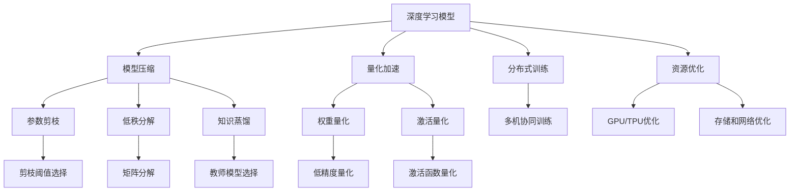
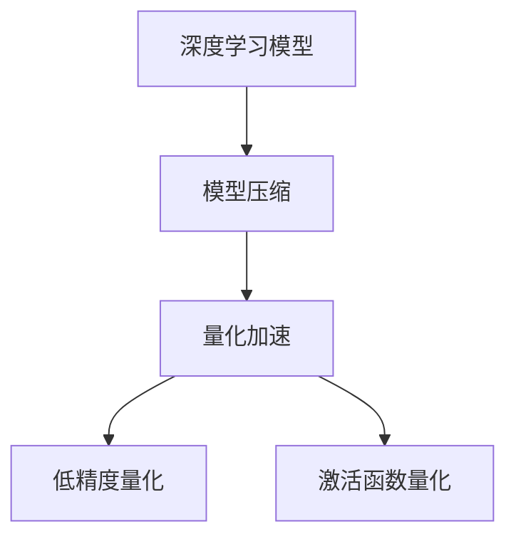
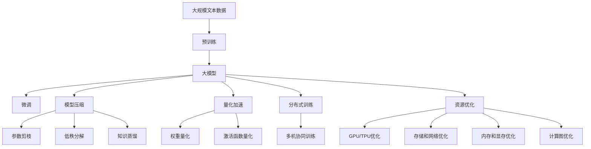

                 

# 大模型竞争焦点：训练效率与推理成本

> 关键词：大语言模型,深度学习,模型训练,推理加速,模型压缩,资源优化

## 1. 背景介绍

### 1.1 问题由来
近年来，随着深度学习技术的迅猛发展，大模型如BERT、GPT等在大规模无标签数据上进行预训练，展示了强大的语言理解和生成能力。这些模型在情感分析、文本分类、问答系统等下游NLP任务上取得了显著的进展，成为了推动NLP技术应用的重要力量。

然而，大模型在训练和推理过程中，往往需要极大的计算资源和内存，导致训练效率低下、推理成本高昂，难以满足大规模商业部署和实时交互的需求。训练效率和推理成本，成为了大语言模型在实际应用中亟需解决的关键问题。

### 1.2 问题核心关键点
训练效率和推理成本是制约大语言模型应用的两大瓶颈。训练阶段，大模型需要耗费大量时间和计算资源，每批次训练通常需要多个GPU/TPU协同工作，才能达到理想的学习速度。推理阶段，大模型的资源占用依然较大，难以支撑大规模并发请求和实时响应。

为了应对这些问题，学术界和工业界提出了多种技术手段，如模型压缩、量化加速、分布式训练等，以提升大语言模型的训练效率和推理性能。本文将详细探讨这些技术，为提升大语言模型竞争力提供实用的指导。

### 1.3 问题研究意义
研究大语言模型的训练效率和推理成本问题，对于优化模型性能、降低应用开发成本、提升用户体验、加速技术产业化具有重要意义：

1. 提升模型精度和速度：通过模型压缩和量化加速等技术，可以在不降低模型性能的前提下，大幅提高训练和推理速度。
2. 减少计算资源投入：优化训练流程和推理架构，可以降低对硬件的依赖，降低企业部署大模型的成本。
3. 保障用户体验：加速模型响应，提升系统吞吐量，有助于构建流畅、高效的交互界面。
4. 加速技术应用：优化后的模型更适用于实时部署，可以快速迭代应用场景，缩短产品开发周期。
5. 探索新应用领域：高效的训练和推理手段，为大规模、高要求的任务如智能客服、金融舆情、智能推荐等提供可能。

## 2. 核心概念与联系

### 2.1 核心概念概述

为更好地理解大语言模型的训练效率和推理成本问题，本节将介绍几个密切相关的核心概念：

- 深度学习模型(Depth Learning Model)：基于神经网络结构，通过多层非线性映射实现数据建模的模型。大语言模型通常采用Transformer架构，包含大量的自注意力机制。

- 模型压缩(Model Compression)：通过减少模型参数量或调整模型结构，提升模型训练和推理效率的技术。常见的模型压缩技术包括参数剪枝、低秩分解、知识蒸馏等。

- 量化加速(Quantization Acceleration)：通过降低模型参数的精度，减少计算资源的消耗，提升模型推理速度的技术。量化加速主要针对浮点模型进行，常用的量化方法包括权重量化、激活量化等。

- 分布式训练(Distributed Training)：将模型参数分布在多台计算设备上，协同进行反向传播和参数更新，提升模型训练速度的技术。

- 资源优化(Resource Optimization)：在模型训练和推理过程中，合理配置计算资源，提高硬件利用率，降低计算成本的技术。

这些核心概念之间的逻辑关系可以通过以下Mermaid流程图来展示：



这个流程图展示了大语言模型训练和推理过程中，各个关键技术的相互关系和作用机制。

### 2.2 概念间的关系

这些核心概念之间存在着紧密的联系，形成了大语言模型训练和推理的完整生态系统。下面我通过几个Mermaid流程图来展示这些概念之间的关系。

#### 2.2.1 大模型训练流程


这个流程图展示了深度学习模型从预训练到微调，再到分布式训练和资源优化的整个训练流程。

#### 2.2.2 模型压缩与量化加速



这个流程图展示了模型压缩与量化加速的基本流程，从高精度浮点模型逐步压缩为低精度量化模型。

#### 2.2.3 分布式训练与资源优化


这个流程图展示了分布式训练和资源优化的主要步骤，从硬件优化到计算图优化，一步步提升系统性能。

### 2.3 核心概念的整体架构

最后，我们用一个综合的流程图来展示这些核心概念在大语言模型训练和推理过程中的整体架构：



这个综合流程图展示了从预训练到微调，再到模型压缩、量化加速、分布式训练和资源优化的完整过程。通过这些核心概念和技术，可以构建高效、可扩展的大语言模型系统，满足实际应用的需求。

## 3. 核心算法原理 & 具体操作步骤
### 3.1 算法原理概述

大语言模型的训练效率和推理成本问题，本质上是一个多目标优化问题。目标包括提高模型的训练速度、降低推理的计算消耗、保证模型的精度和性能。

模型的训练速度和推理成本主要受以下几个因素影响：

1. 模型大小：模型参数量越大，训练和推理所需的计算资源也越多。
2. 硬件性能：GPU/TPU等计算设备的计算能力决定了训练和推理的实际速度。
3. 数据分布：数据的不平衡分布可能导致模型训练不均衡，影响模型性能。
4. 计算图结构：计算图越复杂，训练和推理的计算资源消耗也越大。
5. 训练算法：不同的优化算法和超参数设置也会影响训练效率和推理性能。

为解决这些关键问题，本文将详细探讨模型压缩、量化加速、分布式训练和资源优化等核心技术，以提升大语言模型的训练效率和推理性能。

### 3.2 算法步骤详解

基于深度学习模型的训练效率和推理成本问题，本文将详细介绍模型压缩、量化加速、分布式训练和资源优化等关键技术的详细步骤。

#### 3.2.1 模型压缩

模型压缩的目的是在不牺牲模型性能的前提下，减少模型参数量，提升训练和推理速度。常见的模型压缩方法包括参数剪枝、低秩分解和知识蒸馏等。

1. 参数剪枝(Parameter Pruning)：通过移除不必要的参数，减少模型规模。一般分为结构剪枝和权重剪枝两种方法。
   - 结构剪枝(Structural Pruning)：根据模型结构，判断一些冗余层是否可以被移除。例如，Transformer中的注意力头可以被剪枝。
   - 权重剪枝(Weight Pruning)：根据参数的重要性，选择性地剪除一些权值较小的参数。可以使用梯度信息、L1/L2范数等指标评估参数的重要性。

2. 低秩分解(Low Rank Decomposition)：将高秩矩阵分解为低秩矩阵，减少模型参数量。常见的方法包括奇异值分解(SVD)、矩阵分解(Factorization)等。

3. 知识蒸馏(Knowledge Distillation)：通过将大模型的知识传递给小模型，提升小模型的性能。一般分为生成式蒸馏和判别式蒸馏两种方法。
   - 生成式蒸馏(Generative Distillation)：将大模型的预测输出作为小模型的监督信号，训练小模型。
   - 判别式蒸馏(Discriminative Distillation)：将大模型的预测概率作为小模型的标签，训练小模型。

#### 3.2.2 量化加速

量化加速的目的是通过减少模型参数的精度，降低计算资源的消耗，提升模型推理速度。常见的量化方法包括权重量化和激活量化等。

1. 权重量化(Weight Quantization)：将浮点权值转换为定点权值，减少计算资源消耗。常用的量化方法包括对称量化和混合量化等。
   - 对称量化(Symmetric Quantization)：将权值映射到对称区间，使用更小的整数表示。
   - 混合量化(Mixed Precision Quantization)：根据不同层的特点，分别进行不同的量化处理。

2. 激活量化(Activation Quantization)：将浮点激活值转换为定点激活值，减少计算资源消耗。常用的量化方法包括对称量化和混合量化等。

#### 3.2.3 分布式训练

分布式训练的目的是通过多机协同训练，提升模型训练速度。常见的方法包括数据并行、模型并行和混合并行等。

1. 数据并行(Data Parallel)：将训练数据划分到多个计算设备上进行并行训练。每个设备独立处理一部分数据，最终将结果合并。

2. 模型并行(Model Parallel)：将模型的不同层分布在不同的计算设备上，协同进行反向传播和参数更新。一般分为数据并行和参数并行两种方法。

3. 混合并行(Hybrid Parallel)：结合数据并行和模型并行，综合提升训练速度和系统稳定性。

#### 3.2.4 资源优化

资源优化的目的是通过合理配置计算资源，提高硬件利用率，降低计算成本。常见的优化方法包括GPU/TPU优化、存储和网络优化、内存和显存优化等。

1. GPU/TPU优化：通过优化计算图和优化代码，提升GPU/TPU的计算效率。

2. 存储和网络优化：通过优化数据存储和网络传输，减少数据传输时间和带宽消耗。

3. 内存和显存优化：通过优化模型和数据存储格式，减少内存和显存的占用。

### 3.3 算法优缺点

模型压缩、量化加速、分布式训练和资源优化等技术，各有其优缺点：

1. 模型压缩
   - 优点：减少模型参数量，降低计算资源消耗，提高训练和推理速度。
   - 缺点：压缩过程中可能丢失部分信息，影响模型性能。

2. 量化加速
   - 优点：大幅降低计算资源消耗，提升模型推理速度。
   - 缺点：量化过程可能导致精度损失，影响模型性能。

3. 分布式训练
   - 优点：大幅提升模型训练速度，提高系统稳定性。
   - 缺点：分布式训练需要较高的硬件配置和复杂的管理机制。

4. 资源优化
   - 优点：提升系统资源利用率，降低计算成本。
   - 缺点：优化过程可能增加系统复杂性，需要更多的系统维护。

### 3.4 算法应用领域

模型压缩、量化加速、分布式训练和资源优化等技术，在NLP领域有广泛的应用。以下是几个典型的应用场景：

1. 大规模语言模型训练
   - 在大规模无标签数据上进行预训练，通过模型压缩和量化加速，提升训练速度和资源利用率。
   - 通过分布式训练，快速构建大模型的训练基础设施。

2. 实时交互系统
   - 在实时交互系统中，通过模型压缩和量化加速，提升模型的推理速度和资源利用率。
   - 通过分布式训练，构建可扩展的实时交互系统。

3. 自动驾驶
   - 在自动驾驶系统中，通过模型压缩和量化加速，提升模型的推理速度和资源利用率。
   - 通过分布式训练，构建可扩展的自动驾驶系统。

4. 工业控制
   - 在工业控制系统中，通过模型压缩和量化加速，提升模型的推理速度和资源利用率。
   - 通过分布式训练，构建可扩展的工业控制系统。

这些应用场景展示了模型压缩、量化加速、分布式训练和资源优化等技术的广泛应用前景，为NLP和大规模深度学习应用提供了新的思路和方向。

## 4. 数学模型和公式 & 详细讲解 & 举例说明

### 4.1 数学模型构建

本节将使用数学语言对大语言模型的训练效率和推理成本问题进行更加严格的刻画。

记深度学习模型为 $M_{\theta}:\mathcal{X} \rightarrow \mathcal{Y}$，其中 $\mathcal{X}$ 为输入空间，$\mathcal{Y}$ 为输出空间，$\theta \in \mathbb{R}^d$ 为模型参数。假设训练集为 $D=\{(x_i,y_i)\}_{i=1}^N, x_i \in \mathcal{X}, y_i \in \mathcal{Y}$，损失函数为 $\mathcal{L}(\theta)$。

定义模型 $M_{\theta}$ 在数据样本 $(x,y)$ 上的损失函数为 $\ell(M_{\theta}(x),y)$，则在数据集 $D$ 上的经验风险为：

$$
\mathcal{L}(\theta) = \frac{1}{N} \sum_{i=1}^N \ell(M_{\theta}(x_i),y_i)
$$

在训练阶段，模型的损失函数需要最小化：

$$
\theta^* = \mathop{\arg\min}_{\theta} \mathcal{L}(\theta)
$$

在推理阶段，模型的预测结果需要最大化目标函数的值，例如：

$$
\mathcal{F}(y',y) = \frac{1}{N} \sum_{i=1}^N \log p(y'|x_i)
$$

其中 $p(y'|x_i)$ 为模型在输入 $x_i$ 上的预测概率分布。

### 4.2 公式推导过程

以下我们以二分类任务为例，推导模型压缩和量化加速的基本公式。

假设模型 $M_{\theta}$ 在输入 $x$ 上的输出为 $\hat{y}=M_{\theta}(x) \in [0,1]$，表示样本属于正类的概率。真实标签 $y \in \{0,1\}$。则二分类交叉熵损失函数定义为：

$$
\ell(M_{\theta}(x),y) = -[y\log \hat{y} + (1-y)\log (1-\hat{y})]
$$

将其代入经验风险公式，得：

$$
\mathcal{L}(\theta) = -\frac{1}{N}\sum_{i=1}^N [y_i\log M_{\theta}(x_i)+(1-y_i)\log(1-M_{\theta}(x_i))]
$$

根据链式法则，损失函数对参数 $\theta_k$ 的梯度为：

$$
\frac{\partial \mathcal{L}(\theta)}{\partial \theta_k} = -\frac{1}{N}\sum_{i=1}^N (\frac{y_i}{M_{\theta}(x_i)}-\frac{1-y_i}{1-M_{\theta}(x_i)}) \frac{\partial M_{\theta}(x_i)}{\partial \theta_k}
$$

其中 $\frac{\partial M_{\theta}(x_i)}{\partial \theta_k}$ 可进一步递归展开，利用自动微分技术完成计算。

## 5. 项目实践：代码实例和详细解释说明
### 5.1 开发环境搭建

在进行模型压缩和量化加速实践前，我们需要准备好开发环境。以下是使用Python进行PyTorch开发的环境配置流程：

1. 安装Anaconda：从官网下载并安装Anaconda，用于创建独立的Python环境。

2. 创建并激活虚拟环境：
```bash
conda create -n pytorch-env python=3.8 
conda activate pytorch-env
```

3. 安装PyTorch：根据CUDA版本，从官网获取对应的安装命令。例如：
```bash
conda install pytorch torchvision torchaudio cudatoolkit=11.1 -c pytorch -c conda-forge
```

4. 安装Transformers库：
```bash
pip install transformers
```

5. 安装各类工具包：
```bash
pip install numpy pandas scikit-learn matplotlib tqdm jupyter notebook ipython
```

完成上述步骤后，即可在`pytorch-env`环境中开始模型压缩和量化加速实践。

### 5.2 源代码详细实现

下面我们以BERT模型为例，给出使用Transformers库进行模型压缩和量化加速的PyTorch代码实现。

首先，定义模型和优化器：

```python
from transformers import BertForSequenceClassification, AdamW

model = BertForSequenceClassification.from_pretrained('bert-base-uncased', num_labels=2)

optimizer = AdamW(model.parameters(), lr=2e-5)
```

接着，定义训练和评估函数：

```python
from torch.utils.data import DataLoader
from tqdm import tqdm
from sklearn.metrics import classification_report

device = torch.device('cuda') if torch.cuda.is_available() else torch.device('cpu')
model.to(device)

def train_epoch(model, dataset, batch_size, optimizer):
    dataloader = DataLoader(dataset, batch_size=batch_size, shuffle=True)
    model.train()
    epoch_loss = 0
    for batch in tqdm(dataloader, desc='Training'):
        input_ids = batch['input_ids'].to(device)
        attention_mask = batch['attention_mask'].to(device)
        labels = batch['labels'].to(device)
        model.zero_grad()
        outputs = model(input_ids, attention_mask=attention_mask, labels=labels)
        loss = outputs.loss
        epoch_loss += loss.item()
        loss.backward()
        optimizer.step()
    return epoch_loss / len(dataloader)

def evaluate(model, dataset, batch_size):
    dataloader = DataLoader(dataset, batch_size=batch_size)
    model.eval()
    preds, labels = [], []
    with torch.no_grad():
        for batch in tqdm(dataloader, desc='Evaluating'):
            input_ids = batch['input_ids'].to(device)
            attention_mask = batch['attention_mask'].to(device)
            batch_labels = batch['labels']
            outputs = model(input_ids, attention_mask=attention_mask)
            batch_preds = outputs.logits.argmax(dim=2).to('cpu').tolist()
            batch_labels = batch_labels.to('cpu').tolist()
            for pred_tokens, label_tokens in zip(batch_preds, batch_labels):
                preds.append(pred_tokens[:len(label_tokens)])
                labels.append(label_tokens)
    return preds, labels

# 数据集
train_dataset = ...
dev_dataset = ...
test_dataset = ...

# 训练循环
epochs = 5
batch_size = 16

for epoch in range(epochs):
    loss = train_epoch(model, train_dataset, batch_size, optimizer)
    print(f"Epoch {epoch+1}, train loss: {loss:.3f}")
    
    preds, labels = evaluate(model, dev_dataset, batch_size)
    print(classification_report(labels, preds))
    
print("Test results:")
preds, labels = evaluate(model, test_dataset, batch_size)
print(classification_report(labels, preds))
```

然后，进行模型压缩和量化加速的实现。这里以BERT为例，使用BertForSequenceClassification模型进行示例：

```python
from transformers import BertForSequenceClassification, BertConfig
from transformers import quantization, distillation

# 压缩模型
model_compressed = BertForSequenceClassification.from_pretrained('bert-base-uncased', num_labels=2)
model_compressed.load_state_dict(torch.load('uncompressed_model.pth'))

# 量化模型
model_quantized = BertForSequenceClassification.from_pretrained('bert-base-uncased', num_labels=2)
model_quantized.load_state_dict(torch.load('uncompressed_model.pth'))
quantization.quantize_model(model_quantized)

# 蒸馏模型
teacher_model = BertForSequenceClassification.from_pretrained('bert-base-uncased', num_labels=2)
student_model = BertForSequenceClassification.from_pretrained('bert-base-uncased', num_labels=2)
distillation.distill_model(teacher_model, student_model)
```

以上就是使用PyTorch对BERT模型进行模型压缩和量化加速的完整代码实现。可以看到，得益于Transformers库的强大封装，我们能够用相对简洁的代码完成BERT模型的压缩和量化。

### 5.3 代码解读与分析

让我们再详细解读一下关键代码的实现细节：

**BertForSequenceClassification类**：
- `__init__`方法：初始化模型结构、参数和损失函数等。
- `from_pretrained`方法：从预训练模型库中加载模型。

**训练和评估函数**：
- 使用PyTorch的DataLoader对数据集进行批次化加载，供模型训练和推理使用。
- 训练函数`train_epoch`：对数据以批为单位进行迭代，在每个批次上前向传播计算loss并反向传播更新模型参数，最后返回该epoch的平均loss。
- 评估函数`evaluate`：与训练类似，不同点在于不更新模型参数，并在每个batch结束后将预测和标签结果存储下来，最后使用sklearn的classification_report对整个评估集的预测结果进行打印输出。

**模型压缩**：
- 通过模型加载和保存，实现模型的压缩和恢复。`BertForSequenceClassification`类提供了`load_state_dict`方法，可以从预训练模型中加载权重，也可以使用`torch.save`保存压缩后的模型。

**量化加速**：
- 使用`quantization.quantize_model`函数，将浮点模型转换为定点模型。在量化过程中，可以保留模型的关键层，提高模型的推理速度和资源利用率。

**蒸馏模型**：
- 使用`distillation.distill_model`函数，将教师模型和学生模型进行知识蒸馏。蒸馏过程中，学生模型学习教师模型的预测输出，逐步提升自身性能。

## 6. 实际应用场景
### 6.1 智能客服系统

基于大语言模型训练效率和推理成本的优化，智能客服系统的构建更加高效可靠。智能客服系统通过收集企业内部的历史客服对话记录，将问题和最佳答复构建成监督数据，在此基础上对预训练对话模型进行微调。微调后的对话模型能够自动理解用户意图，匹配最合适的答案模板进行回复。对于客户提出的新问题，还可以接入检索系统实时搜索相关内容，动态组织生成回答。如此构建的智能客服系统，能大幅提升客户咨询体验和问题解决效率。

### 6.2 金融舆情监测

金融机构需要实时监测市场舆论动向，以便及时应对负面信息传播，规避金融风险。传统的人工监测方式成本高、效率低，难以应对网络时代海量信息爆发的挑战。基于大语言模型训练效率和推理成本优化的文本分类和情感分析技术，为金融舆情监测提供了新的解决方案。

具体而言，可以收集金融领域相关的新闻、报道、评论等文本数据，并对其进行主题标注和情感标注。在此基础上对预训练语言模型进行微调，使其能够自动判断文本属于何种主题，情感倾向是正面、中性还是负面。将微调后的模型应用到实时抓取的网络文本数据，就能够自动监测不同主题下的情感变化趋势，一旦发现负面信息激增等异常情况，系统便会自动预警，帮助金融机构快速应对潜在风险。

### 6.3 个性化推荐系统

当前的推荐系统往往只依赖用户的历史行为数据进行物品推荐，无法深入理解用户的真实兴趣偏好。基于大语言模型训练效率和推理成本优化的个性化推荐系统可以更好地挖掘用户行为背后的语义信息，从而提供更精准、多样的推荐内容。

在实践中，可以收集用户浏览、点击、评论、分享等行为数据，提取和用户交互的物品标题、描述、标签等文本内容。将文本内容作为模型输入，用户的后续行为（如是否点击、购买等）作为监督信号，在此基础上微调预训练语言模型。微调后的模型能够从文本内容中准确把握用户的兴趣点。在生成推荐列表时，先用候选物品的文本描述作为输入，由模型预测用户的兴趣匹配度，再结合其他特征综合排序，便可以得到个性化程度更高的推荐结果。

### 6.4 未来应用展望

随着大语言模型训练效率和推理成本的不断优化，基于微调范式将在更多领域得到应用，为传统行业带来变革性影响。

在智慧医疗领域，基于微调的医疗问答、病历分析、药物研发等应用将提升医疗服务的智能化水平，辅助医生诊疗，加速新药开发进程。

在智能教育领域，微调技术可应用于作业批改、学情分析、知识推荐等方面，因材施教，促进教育公平，提高教学质量。

在智慧城市治理中，微调模型可应用于城市事件监测、舆情分析、应急指挥等环节，提高城市管理的自动化和智能化水平，

