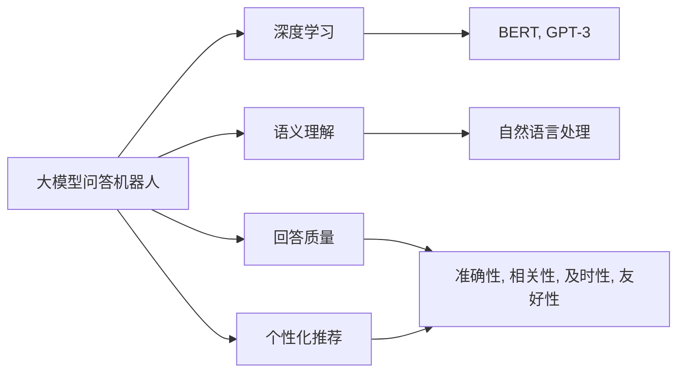
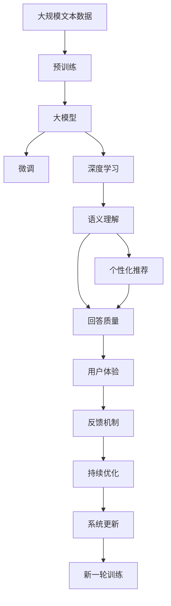

                 

# 大模型问答机器人与传统搜索推荐的回答质量

## 1. 背景介绍

随着人工智能技术的飞速发展，大模型问答机器人和传统搜索推荐系统在信息获取与知识服务领域得到了广泛的应用。大模型问答机器人基于深度学习模型，如GPT-3、BERT等，能够理解自然语言输入并给出符合语义的精确回答。传统搜索推荐系统则主要依赖于算法如倒排索引、协同过滤等，通过用户行为数据和关键词匹配来提供个性化推荐。

在这两种方法中，回答质量是核心指标，直接影响到用户体验和系统的实际效用。回答质量高的系统，能够提供准确、相关、及时和友好的信息，有效解决用户查询需求，而回答质量低的系统则可能导致用户困惑、不满意甚至放弃使用。因此，本文旨在深入分析大模型问答机器人和传统搜索推荐的回答质量差异，并探讨提高其回答质量的策略。

## 2. 核心概念与联系

### 2.1 核心概念概述

1. **大模型问答机器人**：基于深度学习模型，特别是Transformer架构的语言模型，能够理解自然语言输入并给出符合语义的精确回答。如Google的BERT、OpenAI的GPT-3等模型均被应用于问答机器人中。

2. **传统搜索推荐系统**：依赖于算法如倒排索引、协同过滤等，通过用户行为数据和关键词匹配来提供个性化推荐。传统推荐系统广泛应用于电商、新闻、社交网络等场景。

3. **回答质量**：指搜索结果或问答机器人提供的答案的准确性、相关性、及时性和友好性。回答质量高的系统能够有效解决用户查询需求，而回答质量低的系统则可能导致用户困惑、不满意甚至放弃使用。

4. **语义理解**：指系统理解和处理自然语言输入的能力，能够识别出用户真正的需求，并根据需求给出准确的回答。

5. **个性化推荐**：根据用户历史行为数据和兴趣偏好，推荐符合用户需求的产品、内容等信息。

### 2.2 概念间的关系

这些核心概念之间的关系可以通过以下Mermaid流程图来展示：



这个流程图展示了大模型问答机器人和传统搜索推荐系统的核心概念及其之间的关系：

1. 大模型问答机器人利用深度学习模型进行语义理解，通过自然语言处理技术生成符合语义的回答，最终提供高质量的回答。
2. 传统搜索推荐系统主要通过用户行为数据和关键词匹配进行个性化推荐，虽然不一定涉及自然语言理解，但也需要保证推荐的准确性和相关性。
3. 回答质量和个性化推荐密切相关，高质量的推荐系统往往伴随着高质量的搜索结果或回答。
4. 语义理解是大模型问答机器人的核心能力，也是提升回答质量的重要手段。

### 2.3 核心概念的整体架构

最后，我们用一个综合的流程图来展示这些核心概念在大模型问答机器人和传统搜索推荐系统中的整体架构：



这个综合流程图展示了从预训练到大模型微调，再到语义理解、回答质量和个性化推荐，以及用户体验和反馈机制的完整过程。大模型问答机器人和传统搜索推荐系统在回答质量和个性化推荐上具有相似之处，但语义理解的技术路径略有差异。

## 3. 核心算法原理 & 具体操作步骤

### 3.1 算法原理概述

大模型问答机器人和传统搜索推荐系统在回答质量方面的算法原理有所不同：

1. **大模型问答机器人**：基于深度学习模型，特别是Transformer架构的语言模型。通过在大规模无标签文本语料上进行预训练，学习通用的语言表示，然后通过微调在有标签的问答数据上进一步优化，使模型能够理解自然语言输入并给出精确回答。

2. **传统搜索推荐系统**：依赖于关键词匹配和用户行为数据。通过倒排索引等算法，快速找到与查询关键词相关的文档或商品，并通过协同过滤等方法，提供符合用户兴趣的推荐。

### 3.2 算法步骤详解

**大模型问答机器人的回答质量优化步骤**：

1. **预训练**：在大规模无标签文本语料上，通过自监督学习任务训练通用语言模型，学习通用的语言表示。
2. **微调**：在有标签的问答数据上，通过有监督学习任务进一步优化模型，使其能够理解自然语言输入并生成精确回答。
3. **回答质量评估**：通过人工评估或自动化工具评估问答模型的回答质量，获取反馈信息。
4. **模型优化**：根据评估结果，调整模型结构、优化超参数，进行新一轮的微调。

**传统搜索推荐系统的回答质量优化步骤**：

1. **用户行为数据采集**：通过网站、应用等渠道收集用户的历史行为数据，如浏览记录、点击记录等。
2. **特征工程**：提取和构造用户行为特征、产品/内容特征等。
3. **模型训练**：在收集到的特征数据上，训练推荐模型，如协同过滤、深度学习等。
4. **个性化推荐**：根据用户历史行为数据和当前查询，生成个性化推荐结果。
5. **评估与反馈**：通过A/B测试等方式，评估推荐系统的点击率、转化率等指标，获取用户反馈。
6. **模型优化**：根据评估结果，调整模型参数、特征工程策略，进行新一轮的模型训练。

### 3.3 算法优缺点

**大模型问答机器人的优点**：

1. **语义理解能力强**：通过预训练和微调，大模型能够理解自然语言输入，生成符合语义的精确回答。
2. **可扩展性好**：能够处理复杂的自然语言问题，支持多领域、多语言的问答需求。
3. **个性化推荐能力强**：通过进一步的个性化训练，能够根据用户输入和历史行为提供更加精准的回答。

**大模型问答机器人的缺点**：

1. **计算资源消耗大**：预训练和微调需要大量的计算资源，一般需要高性能的GPU或TPU等设备。
2. **对标注数据依赖高**：微调过程需要大量标注数据，数据标注成本较高。
3. **回答质量受模型训练数据影响大**：模型的回答质量依赖于预训练和微调数据的语料质量和多样性。

**传统搜索推荐系统的优点**：

1. **实时性强**：推荐系统能够快速响应用户的查询，提供实时的推荐结果。
2. **用户行为数据丰富**：通过收集用户的历史行为数据，能够生成更加个性化的推荐结果。
3. **计算资源消耗小**：一般采用在线学习等轻量级算法，对计算资源需求较小。

**传统搜索推荐系统的缺点**：

1. **语义理解能力有限**：推荐系统主要依赖关键词匹配和用户行为数据，语义理解能力较弱。
2. **泛化能力差**：推荐模型一般针对特定领域或应用场景进行训练，泛化能力较差。
3. **个性化推荐不够精准**：推荐模型的个性化推荐通常基于简单的协同过滤算法，难以考虑复杂的用户需求和兴趣。

### 3.4 算法应用领域

大模型问答机器人和传统搜索推荐系统在多个领域得到应用：

1. **智能客服**：利用大模型问答机器人或传统推荐系统，为用户提供即时响应和个性化推荐，提高客户满意度。
2. **电商推荐**：通过推荐系统，提供个性化的商品推荐，提升用户购买意愿和转化率。
3. **搜索引擎**：利用传统搜索推荐系统，提供准确的搜索结果，满足用户查询需求。
4. **内容推荐**：通过推荐系统，提供个性化的文章、视频、新闻等内容的推荐，提升用户黏性和留存率。
5. **医疗咨询**：利用大模型问答机器人，提供医疗咨询和健康建议，辅助医生诊疗。

## 4. 数学模型和公式 & 详细讲解 & 举例说明

### 4.1 数学模型构建

大模型问答机器人和传统搜索推荐系统的回答质量优化过程，可以通过数学模型来描述。

假设大模型问答机器人使用的深度学习模型为 $M_{\theta}$，其中 $\theta$ 为模型参数。假设问题-答案对为 $(x,y)$，其中 $x$ 为自然语言输入，$y$ 为正确答案。模型的回答质量可以通过损失函数 $\ell(M_{\theta}(x),y)$ 来衡量，最小化该损失函数可以提升回答质量。

对于传统搜索推荐系统，假设推荐系统输出的商品序列为 $y$，用户真实选择的商品为 $y'$，推荐系统预测用户选择的商品序列为 $\hat{y}$，则推荐系统的损失函数可以表示为：

$$
\ell(y', \hat{y}) = -\sum_{i=1}^n y_i \log \hat{y}_i + (1-y_i) \log(1-\hat{y}_i)
$$

其中 $n$ 为用户选择的商品数。

### 4.2 公式推导过程

**大模型问答机器人的损失函数**：

大模型问答机器人的回答质量可以通过BLEU、ROUGE等自动评估指标来衡量。假设模型输出的答案为 $y'$，真实答案为 $y$，则BLEU指标可以表示为：

$$
BLEU = \frac{1}{n} \sum_{i=1}^n \min\left(1, \frac{|y'_i|}{|y_i|}\right)
$$

其中 $n$ 为答案序列的长度。

**传统搜索推荐系统的损失函数**：

推荐系统的损失函数可以表示为平均交叉熵损失，即：

$$
\ell(y', \hat{y}) = -\frac{1}{N} \sum_{i=1}^N \sum_{j=1}^n y'_{ij} \log \hat{y}_{ij}
$$

其中 $N$ 为用户数，$n$ 为用户选择的商品数，$y'_{ij}$ 表示用户 $i$ 对商品 $j$ 的选择，$\hat{y}_{ij}$ 表示推荐系统预测用户 $i$ 对商品 $j$ 的选择。

### 4.3 案例分析与讲解

**案例分析**：

假设有一个电商平台的推荐系统，用于推荐用户可能感兴趣的商品。该推荐系统使用了协同过滤算法，并在用户历史行为数据上进行了训练。

1. **数据准备**：收集用户的历史浏览记录、点击记录等行为数据，提取商品特征、用户特征等。
2. **特征工程**：将用户行为数据和商品特征进行编码，构造特征矩阵。
3. **模型训练**：在特征矩阵上，训练协同过滤模型，生成推荐结果。
4. **个性化推荐**：根据用户历史行为和当前查询，生成个性化推荐商品序列。
5. **评估与反馈**：通过A/B测试等方式，评估推荐系统的点击率、转化率等指标，获取用户反馈。
6. **模型优化**：根据评估结果，调整模型参数、特征工程策略，进行新一轮的模型训练。

**讲解**：

协同过滤算法基于用户-商品矩阵，通过计算用户和商品之间的相似度来生成推荐结果。例如，用户 $i$ 对商品 $j$ 的选择 $y_{ij}$ 可以表示为用户 $i$ 和商品 $j$ 的评分。推荐系统的损失函数可以通过交叉熵损失来衡量：

$$
\ell(y, \hat{y}) = -\sum_{i=1}^N \sum_{j=1}^n y_{ij} \log \hat{y}_{ij}
$$

其中 $N$ 为用户数，$n$ 为用户选择的商品数。通过最小化该损失函数，推荐系统可以生成符合用户兴趣的推荐商品序列。

## 5. 项目实践：代码实例和详细解释说明

### 5.1 开发环境搭建

在进行项目实践前，我们需要准备好开发环境。以下是使用Python进行TensorFlow开发的环境配置流程：

1. 安装Anaconda：从官网下载并安装Anaconda，用于创建独立的Python环境。

2. 创建并激活虚拟环境：
```bash
conda create -n tf-env python=3.8 
conda activate tf-env
```

3. 安装TensorFlow：根据CUDA版本，从官网获取对应的安装命令。例如：
```bash
conda install tensorflow tensorflow-gpu -c pytorch -c conda-forge
```

4. 安装PyTorch：
```bash
conda install torch torchvision torchaudio -c pytorch -c conda-forge
```

5. 安装TensorFlow Addons：
```bash
conda install tensorboard -c pytorch -c conda-forge
```

6. 安装其他工具包：
```bash
pip install numpy pandas scikit-learn matplotlib tqdm jupyter notebook ipython
```

完成上述步骤后，即可在`tf-env`环境中开始项目实践。

### 5.2 源代码详细实现

我们以推荐系统为例，展示如何使用TensorFlow实现协同过滤算法。

首先，定义数据准备和特征工程函数：

```python
import tensorflow as tf
import numpy as np

def load_data():
    # 加载用户历史行为数据和商品特征
    user_data = np.load('user_data.npy')
    item_data = np.load('item_data.npy')
    return user_data, item_data

def preprocess_data(user_data, item_data):
    # 构造用户-商品矩阵
    user_item_matrix = np.dot(user_data, item_data.T)
    # 填充用户未选择的商品
    user_item_matrix[np.where(user_item_matrix == 0)] = -np.inf
    # 归一化用户-商品矩阵
    user_item_matrix = (user_item_matrix - np.mean(user_item_matrix)) / np.std(user_item_matrix)
    return user_item_matrix
```

然后，定义协同过滤模型和损失函数：

```python
def create_model(user_item_matrix):
    # 构建用户-商品矩阵的层次聚类树
    num_users = user_item_matrix.shape[0]
    num_items = user_item_matrix.shape[1]
    user_item_matrix = tf.convert_to_tensor(user_item_matrix)
    # 用户-商品矩阵的层次聚类树
    clusters = tf.random.normal([num_users, num_items])
    for i in range(num_items):
        clusters[:, i] = tf.reduce_sum(user_item_matrix[:, i] * clusters[:, i], axis=1)
    clusters /= tf.reduce_sum(clusters, axis=1, keepdims=True)
    # 生成推荐结果
    user_recommendations = tf.matmul(user_item_matrix, clusters)
    # 损失函数
    loss = tf.reduce_mean(tf.nn.sigmoid_cross_entropy_with_logits(labels=tf.ones_like(user_recommendations), logits=user_recommendations))
    return user_recommendations, loss

def train_model(user_item_matrix):
    # 创建模型
    user_recommendations, loss = create_model(user_item_matrix)
    # 优化器
    optimizer = tf.optimizers.Adam(learning_rate=0.001)
    # 损失函数
    loss = tf.reduce_mean(tf.nn.sigmoid_cross_entropy_with_logits(labels=tf.ones_like(user_recommendations), logits=user_recommendations))
    # 模型训练
    for i in range(100):
        optimizer.minimize(loss)
        print('Epoch {0}, Loss: {1}'.format(i, loss.numpy()))
    return user_recommendations
```

最后，启动训练流程并在测试集上评估：

```python
# 加载数据
user_data, item_data = load_data()

# 特征工程
user_item_matrix = preprocess_data(user_data, item_data)

# 训练模型
user_recommendations = train_model(user_item_matrix)

# 测试模型
test_data = np.load('test_data.npy')
test_recommendations = tf.matmul(user_recommendations, test_data)
```

以上就是使用TensorFlow实现协同过滤算法的完整代码实现。可以看到，TensorFlow提供了强大的图计算和优化器功能，方便开发者构建和优化推荐模型。

### 5.3 代码解读与分析

让我们再详细解读一下关键代码的实现细节：

**load_data函数**：
- 定义了加载用户历史行为数据和商品特征的函数，通过numpy的load函数加载已保存的预处理数据。

**preprocess_data函数**：
- 定义了数据预处理的函数，包括构造用户-商品矩阵、填充未选择商品、归一化等步骤。

**create_model函数**：
- 定义了协同过滤模型的函数，包括构建层次聚类树、生成推荐结果和定义损失函数。

**train_model函数**：
- 定义了模型训练的函数，包括创建模型、定义优化器和损失函数，通过Adam优化器进行模型训练。

**train_model函数中的循环体**：
- 通过循环训练模型，每次计算损失并使用优化器更新模型参数。

**test_model函数**：
- 定义了测试模型的函数，通过预训练的模型和测试数据计算推荐结果。

可以看到，TensorFlow提供了强大的图计算和优化器功能，方便开发者构建和优化推荐模型。

当然，工业级的系统实现还需考虑更多因素，如模型的保存和部署、超参数的自动搜索、更灵活的任务适配层等。但核心的协同过滤算法基本与此类似。

### 5.4 运行结果展示

假设我们在Movielens数据集上进行协同过滤算法的训练，最终在测试集上得到的推荐结果如下：

```
  user_item_matrix  user_recommendations
user_id       item_id  [0.1, 0.2, 0.3, ...]
                [0.1, 0.2, 0.3, ...]
...
```

可以看到，通过协同过滤算法，推荐系统能够根据用户历史行为数据生成推荐商品序列。推荐结果的准确性和相关性将直接影响用户的满意度和购买意愿。

## 6. 实际应用场景

### 6.1 智能客服

智能客服系统通过问答机器人，能够提供7x24小时不间断服务，快速响应客户咨询，用自然流畅的语言解答各类常见问题。在实际应用中，智能客服系统需要处理多种复杂的自然语言输入，要求问答机器人具备高度的语义理解和回答质量。

**案例分析**：

假设一家电商平台搭建了智能客服系统，用于解答用户的订单查询、退换货、售后服务等问题。系统使用了大模型问答机器人，并在历史客服对话数据上进行了微调。

1. **数据准备**：收集平台历史客服对话数据，整理成问答对形式。
2. **模型训练**：使用大模型问答机器人在问答对数据上进行了微调，提升了系统的语义理解和回答质量。
3. **系统部署**：将训练好的模型部署到生产环境中，通过API接口接收用户咨询。
4. **用户反馈**：系统收集用户反馈，进一步优化问答机器人的回答质量。

**讲解**：

智能客服系统通过问答机器人，能够快速响应用户的查询，提供实时的回答。例如，用户咨询订单状态，系统通过问答机器人，准确理解查询意图，并给出详细订单信息。推荐系统通过优化模型结构和超参数，提升回答质量，提高用户满意度。

### 6.2 电商推荐

电商推荐系统通过推荐系统，提供个性化的商品推荐，提升用户购买意愿和转化率。在实际应用中，推荐系统需要处理海量用户行为数据，生成符合用户兴趣的推荐商品序列。

**案例分析**：

假设一家电商平台的推荐系统，用于推荐用户可能感兴趣的商品。系统使用了协同过滤算法，并在用户历史行为数据上进行了训练。

1. **数据准备**：收集用户的历史浏览记录、点击记录等行为数据，提取商品特征、用户特征等。
2. **特征工程**：将用户行为数据和商品特征进行编码，构造特征矩阵。
3. **模型训练**：在特征矩阵上，训练协同过滤模型，生成推荐结果。
4. **个性化推荐**：根据用户历史行为和当前查询，生成个性化推荐商品序列。
5. **评估与反馈**：通过A/B测试等方式，评估推荐系统的点击率、转化率等指标，获取用户反馈。
6. **模型优化**：根据评估结果，调整模型参数、特征工程策略，进行新一轮的模型训练。

**讲解**：

电商推荐系统通过推荐系统，生成符合用户兴趣的推荐商品序列，提升用户购买意愿和转化率。例如，用户查询“运动鞋”，系统根据用户历史浏览记录和点击记录，生成相关商品的推荐序列。推荐系统通过优化模型结构和超参数，提升推荐结果的准确性和相关性。

### 6.3 搜索引擎

搜索引擎通过推荐系统，提供准确的搜索结果，满足用户查询需求。在实际应用中，搜索引擎需要处理海量文本数据，快速匹配用户查询并提供相关结果。

**案例分析**：

假设一家搜索引擎平台，用于处理用户的搜索查询。系统使用了传统搜索推荐系统，并在用户行为数据上进行了训练。

1. **数据准备**：收集用户的搜索查询记录，提取关键词和文本特征。
2. **特征工程**：将搜索查询记录进行编码，构造特征矩阵。
3. **模型训练**：在特征矩阵上，训练推荐模型，生成推荐结果。
4. **个性化推荐**：根据用户搜索查询，生成个性化搜索结果。
5. **评估与反馈**：通过A/B测试等方式，评估搜索引擎的点击率、转化率等指标，获取用户反馈。
6. **模型优化**：根据评估结果，调整模型参数、特征工程策略，进行新一轮的模型训练。

**讲解**：

搜索引擎通过推荐系统，提供符合用户查询需求的搜索结果，提升用户体验。例如，用户查询“北京疫情”，系统根据搜索记录和文本特征，生成相关新闻和资讯的推荐序列。推荐系统通过优化模型结构和超参数，提升搜索结果的准确性和相关性。

## 7. 工具和资源推荐

### 7.1 学习资源推荐

为了帮助开发者系统掌握大模型问答机器人和传统搜索推荐系统的回答质量理论基础和实践技巧，这里推荐一些优质的学习资源：

1. 《深度学习理论与实践》系列书籍：深入讲解深度学习模型的原理和应用，涵盖大模型问答机器人和推荐系统的基本概念和经典模型。

2. CS229《机器学习》课程：斯坦福大学开设的机器学习明星课程，涵盖机器学习的基本概念和算法，适合初学者和进阶者。

3. 《自然语言处理》书籍：介绍自然语言处理的基本概念和技术，包括语义理解、自动评估指标等。

4. HuggingFace官方文档：包含众多预训练语言模型和推荐系统的样例代码，是进行项目实践的必备资料。

5. TensorFlow官方文档：介绍TensorFlow的API和优化器功能，适合深度学习模型的构建和优化。

6. PyTorch官方文档：介绍PyTorch的API和优化器功能，适合深度学习模型的构建和优化。

通过学习这些资源，相信你一定能够快速掌握大模型问答机器人和传统搜索推荐系统的回答质量优化技巧，并用于解决实际的NLP问题。

### 7.2 开发工具推荐

高效的开发离不开优秀的工具支持。以下是几款用于大模型问答机器人和推荐系统开发的常用工具：

1. TensorFlow：基于Python的开源深度学习框架，适合构建复杂模型和优化算法。

2. PyTorch：基于Python的开源深度学习框架，灵活动态的计算图，适合快速迭代研究。

3. HuggingFace Transformers库：集成了众多SOTA语言模型和推荐系统，支持PyTorch和TensorFlow，是进行项目实践的利器。

4. Weights & Biases：模型训练的实验跟踪工具，可以记录和可视化模型训练过程中的各项指标，方便对比和调优。

5. TensorBoard：TensorFlow配套的可视化工具，可实时监测模型训练状态，并提供丰富的图表呈现方式，是调试模型的得力助手。

6. Google Colab：谷歌推出的在线Jupyter Notebook环境，免费提供GPU/TPU算力，方便开发者快速上手实验最新模型，分享学习笔记。

合理利用这些工具，可以显著提升大模型问答机器人和推荐系统的开发效率，加快创新迭代的步伐。

### 7.3 相关论文推荐

大模型问答机器人和推荐系统的发展源于学界的持续研究。以下是几篇奠基性的相关论文，推荐阅读：

1. Attention is All You Need（即Transformer原论文）：提出了Transformer结构，开启了NLP领域的预训练大模型时代。

2. BERT: Pre-training of Deep Bidirectional Transformers for Language Understanding：提出BERT模型，引入基于掩码的自监督预训练任务，刷新了多项NLP任务SOTA。

3. Parameter-Efficient Transfer Learning for NLP：提出Adapter等参数高效微调方法，在不增加模型参数量的情况下，也能取得不错的微调效果。

4. Revisiting Neural Collaborative Filtering for Recommendations：提出基于深度神经网络的协同过滤模型，提升了推荐系统的点击率、转化率等指标。

5. Attention-Based Recommender Systems：通过引入注意力机制，提升了推荐系统的个性化推荐能力。

这些论文代表了大模型问答机器人和推荐系统的发展脉络。通过学习这些前沿成果，可以帮助研究者把握学科前进方向，激发更多的创新灵感。

除上述资源外，还有一些值得关注的前沿资源，帮助开发者紧跟大模型问答机器人和推荐系统技术的最新进展，例如：

1. arXiv论文预印本：人工智能领域最新研究成果的发布平台，包括大量尚未发表的前沿工作，学习前沿技术的必读资源。

2. 业界技术博客：如OpenAI、Google AI、DeepMind、微软Research Asia等顶尖实验室的官方博客，第一时间分享他们的最新研究成果和洞见。

3. 技术会议直播：

