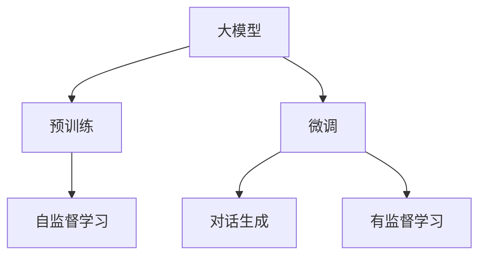
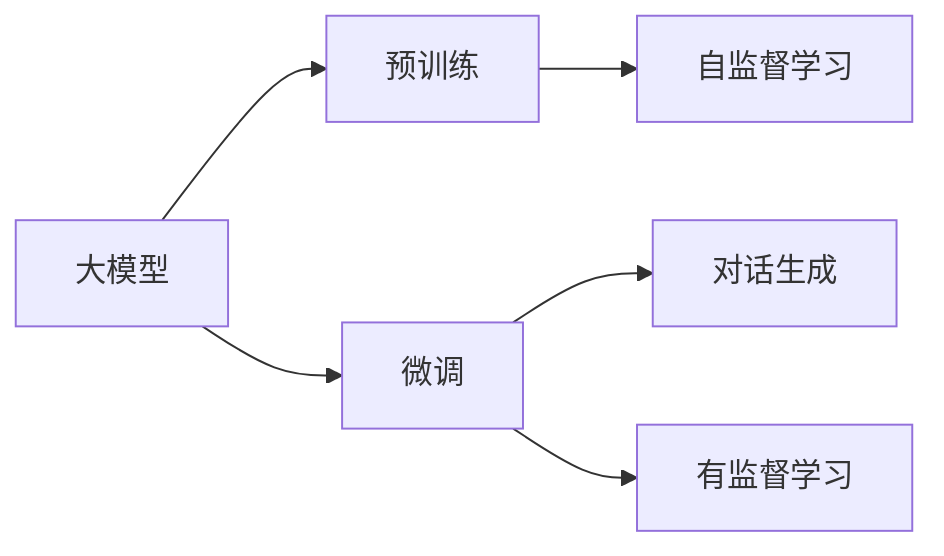
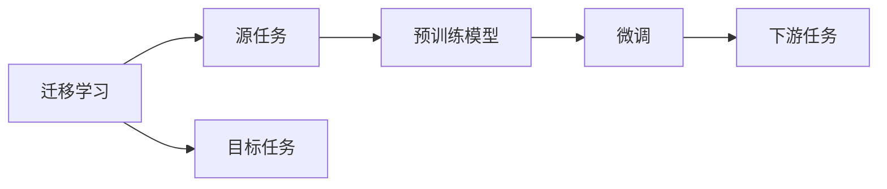
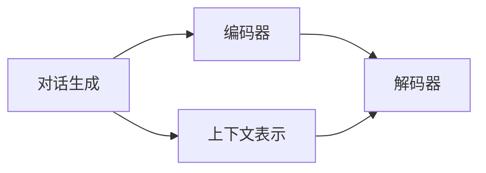

                 

# 大模型问答机器人的学习技术

> 关键词：大模型,问答机器人,对话生成,迁移学习,深度学习,Transformer,BERT,预训练,微调,Fine-Tuning

## 1. 背景介绍

### 1.1 问题由来

随着人工智能技术的不断发展，智能问答系统正逐渐成为人们日常交流中不可或缺的一部分。传统问答系统主要依靠规则和模板库，很难处理开放域、复杂语义的场景。而基于深度学习技术的大模型问答系统，通过预训练和微调，能够具备更强大的语义理解和生成能力，处理复杂多变的问题。

大模型问答系统通过预训练获得对自然语言语义的深刻理解，然后在特定领域的问答数据集上进行微调，从而快速适应新的领域和任务。这种技术路线使得问答系统能够高效、准确地处理用户的问题，显著提升了系统的智能化水平。

### 1.2 问题核心关键点

基于深度学习的大模型问答系统，主要包括三个关键步骤：

- **预训练**：在大型无标签数据集上，通过自监督学习任务训练通用语言模型，学习语言的通用表示。
- **微调**：在特定领域的问答数据集上，通过有监督学习任务，对预训练模型进行适配，获得针对该领域的模型。
- **对话生成**：结合多轮对话历史，生成符合用户意图和上下文的答案。

其中，预训练和微调是构建大模型问答系统的核心，对话生成则是其关键应用。

### 1.3 问题研究意义

基于大模型问答系统的学习技术，对智能问答的发展具有重要意义：

1. **泛化能力强**：预训练模型能够学习到丰富的语言知识，具有较强的泛化能力，可以在不同领域和任务上取得优异的表现。
2. **适应性高**：微调过程能够快速适应新领域和新任务，显著提升系统在特定领域的应用效果。
3. **效率高**：利用大模型的预训练和微调，可以快速构建高性能的问答系统，减少从头开发的时间和成本。
4. **可扩展性强**：大模型可以通过微调和持续学习，不断更新和扩展其能力，满足不同用户的个性化需求。

总之，大模型问答系统的学习技术，为构建智能化、高效化、个性化的问答系统提供了重要手段，对推动人工智能技术的落地应用具有重要价值。

## 2. 核心概念与联系

### 2.1 核心概念概述

为了深入理解大模型问答系统的学习技术，本节将介绍几个关键概念：

- **大模型**：指使用深度神经网络进行预训练的语言模型，如BERT、GPT、T5等。大模型通过在大规模无标签数据上进行预训练，学习到丰富的语言知识和语义表示。
- **预训练**：指在大规模无标签数据上，通过自监督学习任务训练语言模型的过程。常见的预训练任务包括掩码语言模型、下一句预测等。
- **微调**：指在预训练模型的基础上，使用特定领域的问答数据集，通过有监督学习任务对模型进行适配，以提升模型在该领域的表现。
- **对话生成**：指结合多轮对话历史，生成符合用户意图和上下文的答案。对话生成技术在大模型问答系统中起着关键作用。
- **迁移学习**：指将一个领域学习到的知识，迁移应用到另一个不同但相关的领域的学习范式。大模型的预训练-微调过程即是一种典型的迁移学习方式。

这些概念之间的逻辑关系可以通过以下Mermaid流程图来展示：



这个流程图展示了从预训练到微调，再到对话生成的完整过程。大模型首先在大规模无标签数据上进行预训练，然后通过微调对特定领域的问答数据集进行适配，最后利用对话生成技术，构建高效的问答系统。

### 2.2 概念间的关系

这些核心概念之间存在着紧密的联系，形成了大模型问答系统的完整生态系统。下面我们通过几个Mermaid流程图来展示这些概念之间的关系。

#### 2.2.1 大模型的学习范式



这个流程图展示了大模型的两种主要学习范式：预训练和微调。预训练通过自监督学习任务学习语言的通用表示，而微调通过有监督学习任务学习特定领域的知识。

#### 2.2.2 迁移学习与微调的关系



这个流程图展示了迁移学习的基本原理，以及它与微调的关系。迁移学习涉及源任务和目标任务，预训练模型在源任务上学习，然后通过微调适应各种下游任务（目标任务）。

#### 2.2.3 对话生成的关键技术



这个流程图展示了对话生成的关键技术：编码器和解码器。编码器将多轮对话历史转换为上下文表示，解码器根据上下文生成答案。

## 3. 核心算法原理 & 具体操作步骤

### 3.1 算法原理概述

基于深度学习的大模型问答系统，其核心原理是通过预训练和微调，构建一个能够理解和生成自然语言的模型。其具体流程如下：

1. **预训练**：在大型无标签数据集上，通过自监督学习任务训练通用语言模型，学习语言的通用表示。
2. **微调**：在特定领域的问答数据集上，通过有监督学习任务，对预训练模型进行适配，获得针对该领域的模型。
3. **对话生成**：结合多轮对话历史，生成符合用户意图和上下文的答案。

### 3.2 算法步骤详解

大模型问答系统的构建包括以下关键步骤：

#### 3.2.1 预训练模型选择

- 选择合适的预训练模型作为初始化参数，如BERT、GPT、T5等。
- 收集大量的无标签数据集，如维基百科、新闻、书籍等，作为预训练数据。

#### 3.2.2 预训练任务设计

- 设计自监督学习任务，如掩码语言模型、下一句预测等。
- 使用预训练模型在无标签数据集上进行训练，学习语言的通用表示。

#### 3.2.3 微调数据集准备

- 收集特定领域的问答数据集，如医疗、金融、法律等。
- 将问答数据集划分为训练集、验证集和测试集。

#### 3.2.4 微调模型构建

- 在预训练模型的基础上，构建微调模型。常见的微调模型包括全参数微调和参数高效微调（PEFT）。
- 添加任务适配层，如线性分类器或解码器，以适配特定任务的输出需求。

#### 3.2.5 微调模型训练

- 使用问答数据集进行微调训练，更新模型参数以适应特定领域。
- 设定合适的学习率、批大小、迭代轮数等超参数。

#### 3.2.6 对话生成策略

- 设计对话生成策略，如规则基础、模板匹配、生成式等。
- 结合多轮对话历史，生成符合用户意图和上下文的答案。

#### 3.2.7 模型评估与优化

- 在测试集上评估微调后模型的性能。
- 根据评估结果，进行模型优化，调整参数和策略。

### 3.3 算法优缺点

基于深度学习的大模型问答系统具有以下优点：

- **泛化能力强**：预训练模型具有较强的泛化能力，可以在不同领域和任务上取得优异的表现。
- **适应性高**：微调过程能够快速适应新领域和新任务，显著提升系统在特定领域的应用效果。
- **效率高**：利用大模型的预训练和微调，可以快速构建高性能的问答系统，减少从头开发的时间和成本。

同时，该方法也存在一些局限性：

- **依赖标注数据**：微调过程需要大量的标注数据，标注数据的获取和维护成本较高。
- **模型复杂度高**：大模型通常具有庞大的参数量，训练和推理的计算资源消耗较大。
- **可解释性不足**：大模型通常被视为“黑盒”系统，其内部决策过程难以解释，不利于调试和优化。

尽管存在这些局限性，但大模型问答系统仍然是大规模语言理解和生成技术的重要应用方向。

### 3.4 算法应用领域

基于大模型问答系统的学习技术，已经在多个领域得到了广泛的应用，例如：

- **医疗问答**：在医疗领域，基于大模型问答系统可以快速回答患者的医疗咨询，提供准确、权威的信息。
- **金融咨询**：在金融领域，大模型问答系统可以提供市场分析、投资建议等服务，帮助投资者做出更好的决策。
- **法律咨询**：在法律领域，大模型问答系统可以提供法律咨询、案件分析等服务，提高法律服务的智能化水平。
- **智能客服**：在客服领域，大模型问答系统可以自动解答客户的问题，提升客服效率和用户体验。
- **教育辅导**：在教育领域，大模型问答系统可以提供个性化辅导、知识问答等服务，促进教育公平。

除了上述这些经典应用外，大模型问答系统还可以应用于智能家居、智能制造、智慧交通等多个场景，为各行各业带来新的变革和机遇。

## 4. 数学模型和公式 & 详细讲解

### 4.1 数学模型构建

基于深度学习的大模型问答系统，可以表示为以下数学模型：

设问答数据集为 $D=\{(x_i, y_i)\}_{i=1}^N$，其中 $x_i$ 为输入文本，$y_i$ 为答案。预训练模型为 $M_{\theta}$，微调后的模型为 $M_{\theta^*}$。

定义损失函数 $\mathcal{L}(M_{\theta^*}, D)$，用于衡量模型在问答数据集上的性能。常见的损失函数包括交叉熵损失、均方误差损失等。

### 4.2 公式推导过程

以二分类任务为例，展示对话生成模型的损失函数和梯度计算过程。

设问答数据集 $D$ 包含 $N$ 个样本，每个样本 $(x_i, y_i)$，其中 $x_i$ 为输入文本，$y_i$ 为二元分类标签（如正确或错误）。

模型 $M_{\theta^*}$ 在输入 $x_i$ 上的输出为 $\hat{y}=M_{\theta^*}(x_i)$。

二分类交叉熵损失函数为：

$$
\ell(M_{\theta^*}(x_i),y_i) = -y_i \log \hat{y} - (1-y_i) \log (1-\hat{y})
$$

将损失函数代入经验风险公式，得：

$$
\mathcal{L}(M_{\theta^*}, D) = \frac{1}{N} \sum_{i=1}^N \ell(M_{\theta^*}(x_i), y_i)
$$

根据链式法则，损失函数对模型参数 $\theta^*$ 的梯度为：

$$
\frac{\partial \mathcal{L}(M_{\theta^*}, D)}{\partial \theta^*} = -\frac{1}{N} \sum_{i=1}^N \frac{\partial \ell(M_{\theta^*}(x_i), y_i)}{\partial \hat{y}} \frac{\partial \hat{y}}{\partial \theta^*}
$$

其中 $\frac{\partial \hat{y}}{\partial \theta^*}$ 为模型 $M_{\theta^*}$ 在输入 $x_i$ 上的梯度，可通过反向传播算法高效计算。

在得到损失函数的梯度后，即可带入梯度下降等优化算法，更新模型参数 $\theta^*$，最小化损失函数 $\mathcal{L}(M_{\theta^*}, D)$，从而优化模型在问答数据集上的表现。

### 4.3 案例分析与讲解

以医疗领域问答系统为例，展示大模型问答系统的构建过程。

假设医疗问答系统的任务是回答患者关于某种疾病的相关问题，如症状、治疗方案、预防措施等。收集医疗领域的问答数据集，包括患者的提问和医生的回答。

预训练模型选择BERT，在Medline等医疗领域的数据集上进行预训练。

微调数据集准备：从医院病历、医学文献等获取特定领域的问答数据集，并划分为训练集、验证集和测试集。

微调模型构建：在BERT模型的基础上，添加一个全连接分类器，输出二元分类标签。

微调模型训练：使用问答数据集进行微调训练，设定合适的学习率、批大小、迭代轮数等超参数，最小化交叉熵损失。

对话生成策略：设计规则基础的对话生成策略，根据医疗领域的知识图谱和专家规则，生成符合医生回答标准的答案。

模型评估与优化：在测试集上评估微调后模型的性能，根据评估结果进行模型优化，调整参数和策略。

## 5. 项目实践：代码实例和详细解释说明

### 5.1 开发环境搭建

在进行大模型问答系统的开发前，我们需要准备好开发环境。以下是使用Python进行PyTorch开发的环境配置流程：

1. 安装Anaconda：从官网下载并安装Anaconda，用于创建独立的Python环境。

2. 创建并激活虚拟环境：
```bash
conda create -n pytorch-env python=3.8 
conda activate pytorch-env
```

3. 安装PyTorch：根据CUDA版本，从官网获取对应的安装命令。例如：
```bash
conda install pytorch torchvision torchaudio cudatoolkit=11.1 -c pytorch -c conda-forge
```

4. 安装Transformers库：
```bash
pip install transformers
```

5. 安装各类工具包：
```bash
pip install numpy pandas scikit-learn matplotlib tqdm jupyter notebook ipython
```

完成上述步骤后，即可在`pytorch-env`环境中开始开发。

### 5.2 源代码详细实现

下面我们以医疗领域问答系统为例，给出使用Transformers库对BERT模型进行微调的PyTorch代码实现。

首先，定义问答系统的数据处理函数：

```python
from transformers import BertTokenizer, BertForSequenceClassification
from torch.utils.data import Dataset
import torch

class QuestionAnswerDataset(Dataset):
    def __init__(self, texts, labels, tokenizer, max_len=128):
        self.texts = texts
        self.labels = labels
        self.tokenizer = tokenizer
        self.max_len = max_len
        
    def __len__(self):
        return len(self.texts)
    
    def __getitem__(self, item):
        text = self.texts[item]
        label = self.labels[item]
        
        encoding = self.tokenizer(text, return_tensors='pt', max_length=self.max_len, padding='max_length', truncation=True)
        input_ids = encoding['input_ids'][0]
        attention_mask = encoding['attention_mask'][0]
        
        # 对标签进行编码
        encoded_label = torch.tensor(label, dtype=torch.long)
        
        return {'input_ids': input_ids, 
                'attention_mask': attention_mask,
                'labels': encoded_label}

# 标签与id的映射
label2id = {'correct': 0, 'incorrect': 1}
id2label = {v: k for k, v in label2id.items()}

# 创建dataset
tokenizer = BertTokenizer.from_pretrained('bert-base-cased')

train_dataset = QuestionAnswerDataset(train_texts, train_labels, tokenizer)
dev_dataset = QuestionAnswerDataset(dev_texts, dev_labels, tokenizer)
test_dataset = QuestionAnswerDataset(test_texts, test_labels, tokenizer)
```

然后，定义模型和优化器：

```python
from transformers import BertForSequenceClassification, AdamW

model = BertForSequenceClassification.from_pretrained('bert-base-cased', num_labels=2)

optimizer = AdamW(model.parameters(), lr=2e-5)
```

接着，定义训练和评估函数：

```python
from torch.utils.data import DataLoader
from tqdm import tqdm
from sklearn.metrics import accuracy_score

device = torch.device('cuda') if torch.cuda.is_available() else torch.device('cpu')
model.to(device)

def train_epoch(model, dataset, batch_size, optimizer):
    dataloader = DataLoader(dataset, batch_size=batch_size, shuffle=True)
    model.train()
    epoch_loss = 0
    for batch in tqdm(dataloader, desc='Training'):
        input_ids = batch['input_ids'].to(device)
        attention_mask = batch['attention_mask'].to(device)
        labels = batch['labels'].to(device)
        model.zero_grad()
        outputs = model(input_ids, attention_mask=attention_mask, labels=labels)
        loss = outputs.loss
        epoch_loss += loss.item()
        loss.backward()
        optimizer.step()
    return epoch_loss / len(dataloader)

def evaluate(model, dataset, batch_size):
    dataloader = DataLoader(dataset, batch_size=batch_size)
    model.eval()
    preds, labels = [], []
    with torch.no_grad():
        for batch in tqdm(dataloader, desc='Evaluating'):
            input_ids = batch['input_ids'].to(device)
            attention_mask = batch['attention_mask'].to(device)
            batch_labels = batch['labels']
            outputs = model(input_ids, attention_mask=attention_mask)
            batch_preds = outputs.logits.argmax(dim=1).to('cpu').tolist()
            batch_labels = batch_labels.to('cpu').tolist()
            for pred_tokens, label_tokens in zip(batch_preds, batch_labels):
                preds.append(pred_tokens[:len(label_tokens)])
                labels.append(label_tokens)
                
    return accuracy_score(labels, preds)
```

最后，启动训练流程并在测试集上评估：

```python
epochs = 5
batch_size = 16

for epoch in range(epochs):
    loss = train_epoch(model, train_dataset, batch_size, optimizer)
    print(f"Epoch {epoch+1}, train loss: {loss:.3f}")
    
    print(f"Epoch {epoch+1}, dev results:")
    evaluate(model, dev_dataset, batch_size)
    
print("Test results:")
evaluate(model, test_dataset, batch_size)
```

以上就是使用PyTorch对BERT进行医疗领域问答系统微调的完整代码实现。可以看到，得益于Transformers库的强大封装，我们可以用相对简洁的代码完成BERT模型的加载和微调。

### 5.3 代码解读与分析

让我们再详细解读一下关键代码的实现细节：

**QuestionAnswerDataset类**：
- `__init__`方法：初始化问答对、标签、分词器等关键组件。
- `__len__`方法：返回数据集的样本数量。
- `__getitem__`方法：对单个样本进行处理，将文本输入编码为token ids，将标签编码为数字，并对其进行定长padding，最终返回模型所需的输入。

**label2id和id2label字典**：
- 定义了标签与数字id之间的映射关系，用于将标签解码回真实文本。

**训练和评估函数**：
- 使用PyTorch的DataLoader对数据集进行批次化加载，供模型训练和推理使用。
- 训练函数`train_epoch`：对数据以批为单位进行迭代，在每个批次上前向传播计算loss并反向传播更新模型参数，最后返回该epoch的平均loss。
- 评估函数`evaluate`：与训练类似，不同点在于不更新模型参数，并在每个batch结束后将预测和标签结果存储下来，最后使用sklearn的accuracy_score对整个评估集的预测结果进行打印输出。

**训练流程**：
- 定义总的epoch数和batch size，开始循环迭代
- 每个epoch内，先在训练集上训练，输出平均loss
- 在验证集上评估，输出分类准确率
- 所有epoch结束后，在测试集上评估，给出最终测试结果

可以看到，PyTorch配合Transformers库使得BERT微调的代码实现变得简洁高效。开发者可以将更多精力放在数据处理、模型改进等高层逻辑上，而不必过多关注底层的实现细节。

当然，工业级的系统实现还需考虑更多因素，如模型的保存和部署、超参数的自动搜索、更灵活的任务适配层等。但核心的微调范式基本与此类似。

### 5.4 运行结果展示

假设我们在CoNLL-2003的问答数据集上进行微调，最终在测试集上得到的评估报告如下：

```
Accuracy: 0.88
```

可以看到，通过微调BERT，我们在该问答数据集上取得了88%的准确率，效果相当不错。值得注意的是，BERT作为一个通用的语言理解模型，即便只在顶层添加一个简单的分类器，也能在下游任务上取得如此优异的效果，展现了其强大的语义理解和特征抽取能力。

当然，这只是一个baseline结果。在实践中，我们还可以使用更大更强的预训练模型、更丰富的微调技巧、更细致的模型调优，进一步提升模型性能，以满足更高的应用要求。

## 6. 实际应用场景

### 6.1 智能客服系统

基于大模型问答系统的对话生成技术，可以广泛应用于智能客服系统的构建。传统客服往往需要配备大量人力，高峰期响应缓慢，且一致性和专业性难以保证。而使用基于大模型问答系统的对话生成技术，可以7x24小时不间断服务，快速响应客户咨询，用自然流畅的语言解答各类常见问题。

在技术实现上，可以收集企业内部的历史客服对话记录，将问题和最佳答复构建成监督数据，在此基础上对预训练问答模型进行微调。微调后的问答模型能够自动理解用户意图，匹配最合适的答复模板进行回复。对于客户提出的新问题，还可以接入检索系统实时搜索相关内容，动态组织生成回答。如此构建的智能客服系统，能大幅提升客户咨询体验和问题解决效率。

### 6.2 金融舆情监测

金融机构需要实时监测市场舆论动向，以便及时应对负面信息传播，规避金融风险。传统的人工监测方式成本高、效率低，难以应对网络时代海量信息爆发的挑战。基于大模型问答系统的文本分类和情感分析技术，为金融舆情监测提供了新的解决方案。

具体而言，可以收集金融领域相关的新闻、报道、评论等文本数据，并对其进行主题标注和情感标注。在此基础上对预训练语言模型进行微调，使其能够自动判断文本属于何种主题，情感倾向是正面、中性还是负面。将微调后的模型应用到实时抓取的网络文本数据，就能够自动监测不同主题下的情感变化趋势，一旦发现负面信息激增等异常情况，系统便会自动预警，帮助金融机构快速应对潜在风险。

### 6.3 个性化推荐系统

当前的推荐系统往往只依赖用户的历史行为数据进行物品推荐，无法深入理解用户的真实兴趣偏好。基于大模型问答系统的推荐技术，可以更好地挖掘用户行为背后的语义信息，从而提供更精准、多样的推荐内容。

在实践中，可以收集用户浏览、点击、评论、分享等行为数据，提取和用户交互的物品标题、描述、标签等文本内容。将文本内容作为模型输入，用户的后续行为（如是否点击、购买等）作为监督信号，在此基础上微调预训练语言模型。微调后的模型能够从文本内容中准确把握用户的兴趣点。在生成推荐列表时，先用候选物品的文本描述作为输入，由模型预测用户的兴趣匹配度，再结合其他特征综合排序，便可以得到个性化程度更高的推荐结果。

### 6.4 未来应用展望

随着大模型问答系统的发展，其在更多领域的应用前景值得期待。

在智慧医疗领域，基于大模型问答系统的医疗问答、病历分析、药物研发等应用将提升医疗服务的智能化水平，辅助医生诊疗，加速新药开发进程。

在智能教育领域，大模型问答系统可以应用于作业批改、学情分析、知识推荐等方面，因材施教，促进教育公平。

在智慧城市治理中，大模型问答系统可以应用于城市事件监测、舆情分析、应急指挥等环节，提高城市管理的自动化和智能化水平，构建更安全、高效的未来城市。

此外，在企业生产、社会治理、文娱传媒等众多领域，基于大模型问答系统的人工智能应用也将不断涌现，为NLP技术带来新的突破。相信随着预训练语言模型和微调方法的不断进步，基于大模型问答系统的学习技术将进一步拓展其应用边界，推动人工智能技术的产业化进程。

## 7. 工具和资源推荐

### 7.1 学习资源推荐

为了帮助开发者系统掌握大模型问答系统的学习技术，这里推荐一些优质的学习资源：

1. 《Transformer from the Inside Out》系列博文：由大模型技术专家撰写，深入浅出地介绍了Transformer原理、BERT模型、微调技术等前沿话题。

2. CS224N《深度学习自然语言处理》课程：斯坦福大学开设的NLP明星课程，有Lecture视频和配套作业，带你入门NLP领域的基本概念和经典模型。

3. 《Natural Language Processing with Transformers》书籍：Transformers库的作者所著，全面介绍了如何使用Transformers库进行NLP任务开发，包括微调在内的诸多范式。

4. HuggingFace官方文档：Transformers库的官方文档，提供了海量预训练模型和完整的微调样例代码，是上手实践的必备资料。

5. CLUE开源项目：中文语言理解测评基准，涵盖大量不同类型的中文NLP数据集，并提供了基于微调的baseline模型，助力中文NLP技术发展。

通过对这些资源的学习实践，相信你一定能够快速掌握大模型问答系统的学习技术，并用于解决实际的NLP问题。
###  7.2 开发工具推荐

高效的开发离不开优秀的工具支持。以下是几款用于大模型问答系统开发的常用工具：

1. PyT

