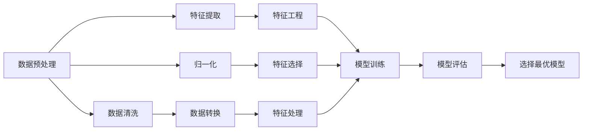
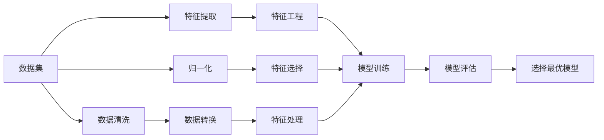
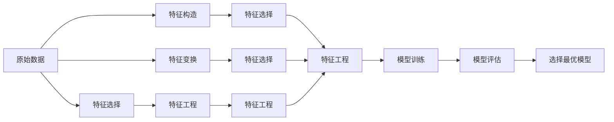

                 

# Spark MLlib机器学习库原理与代码实例讲解

> 关键词：Spark, MLlib, 机器学习, 算法, 数据处理, 实例

## 1. 背景介绍

### 1.1 问题由来
随着大数据时代的到来，数据处理和分析的需求日益增长。在处理大规模数据时，传统的数据处理工具如Hadoop和Spark等逐渐成为主流。特别地，Apache Spark因其高性能、易用性和可扩展性，成为了大数据生态系统中不可或缺的一部分。

在Spark中，MLlib是机器学习库，提供了多种机器学习算法和工具，能够处理大规模数据集，高效进行特征工程、模型训练和评估等操作。通过MLlib，开发者可以轻松地构建和部署复杂的机器学习模型，加速数据科学和机器学习应用的开发。

然而，MLlib的原理和应用细节并不容易被新手掌握。因此，本文旨在全面讲解Spark MLlib的原理与实践，提供详细的操作步骤和代码实例，以帮助读者深入理解和使用MLlib。

### 1.2 问题核心关键点
MLlib的核心包括数据预处理、特征工程、模型训练和评估四个主要部分。每个部分都有其独特的功能和操作。本文将重点讲解Spark MLlib在数据预处理和特征工程方面的应用，同时提供实例代码进行演示。

## 2. 核心概念与联系

### 2.1 核心概念概述

为了更好地理解Spark MLlib的原理和应用，本节将介绍几个密切相关的核心概念：

- **Apache Spark**：一个开源的快速通用集群计算系统，支持批处理、流处理和机器学习等多种计算任务。

- **MLlib**：Apache Spark的机器学习库，提供了多种机器学习算法和工具，支持大规模数据集的机器学习应用。

- **数据预处理**：包括数据清洗、归一化、特征提取等步骤，是机器学习中不可缺少的一部分。

- **特征工程**：通过选择、构造和变换特征来优化模型性能，是机器学习中的重要环节。

- **模型训练**：使用训练数据集训练模型，学习模型的参数，使得模型能够对未知数据进行预测或分类。

- **模型评估**：通过测试数据集评估模型性能，选择最优模型。

这些核心概念之间有着密切的联系，共同构成了Spark MLlib的机器学习框架。以下是一个简单的Mermaid流程图来展示它们之间的关系：



这个流程图展示了数据预处理、特征工程、模型训练和评估之间的关系：

1. 数据预处理包括数据清洗、特征提取和归一化等步骤，为后续的特征工程和模型训练奠定基础。
2. 特征工程通过选择和构造特征来优化模型性能。
3. 模型训练使用训练数据集训练模型，学习模型参数。
4. 模型评估通过测试数据集评估模型性能，选择最优模型。

这些步骤共同构成了机器学习的全流程，在Spark MLlib中得到广泛应用。

### 2.2 概念间的关系

上述核心概念之间存在着紧密的联系，形成了Spark MLlib的完整生态系统。这里我们通过几个Mermaid流程图来展示这些概念之间的关系。

#### 2.2.1 数据预处理的流程



这个流程图展示了数据预处理的全流程：

1. 从原始数据集开始，进行数据清洗，去除噪声和缺失值。
2. 接着进行特征提取，选择和构造有用的特征。
3. 然后进行归一化，使特征值在一定范围内。
4. 对处理后的特征进行转换和选择，生成新的特征。
5. 对特征进行工程处理，如编码、编码等，以适应模型的输入。
6. 使用训练数据集训练模型，学习模型参数。
7. 使用测试数据集评估模型性能，选择最优模型。

#### 2.2.2 特征工程的流程



这个流程图展示了特征工程的全流程：

1. 从原始数据开始，进行特征选择，保留有用的特征。
2. 接着构造新的特征，如组合特征、交叉特征等。
3. 然后进行特征变换，如PCA、SVD等，降低维度。
4. 对特征进行工程处理，如编码、编码等，以适应模型的输入。
5. 使用训练数据集训练模型，学习模型参数。
6. 使用测试数据集评估模型性能，选择最优模型。

#### 2.2.3 模型训练的流程


这个流程图展示了模型训练的全流程：

1. 从训练数据开始，进行特征工程，生成新的特征。
2. 接着使用训练数据集训练模型，学习模型参数。
3. 使用测试数据集评估模型性能，选择最优模型。

## 3. 核心算法原理 & 具体操作步骤
### 3.1 算法原理概述

Spark MLlib提供了多种机器学习算法和工具，支持大规模数据集的机器学习应用。其主要算法包括回归、分类、聚类、关联规则等。本文将重点讲解回归和分类算法的原理和操作。

#### 3.1.1 回归算法

回归算法通过拟合数据点来预测数值型输出。常见的回归算法包括线性回归、决策树回归、随机森林回归等。Spark MLlib提供了多种回归算法，这里以线性回归为例，讲解其基本原理和操作。

#### 3.1.2 分类算法

分类算法通过拟合数据点来预测分类输出。常见的分类算法包括逻辑回归、支持向量机、随机森林等。Spark MLlib提供了多种分类算法，这里以逻辑回归为例，讲解其基本原理和操作。

### 3.2 算法步骤详解

#### 3.2.1 数据预处理

数据预处理是机器学习中不可缺少的一部分。Spark MLlib提供了多种数据清洗和转换工具，可以轻松地进行数据预处理。

**数据清洗**：去除噪声和缺失值。

```python
from pyspark.ml.feature import Imputer
from pyspark.sql.functions import col

# 加载数据集
data = spark.read.csv('data.csv', header=True, inferSchema=True)

# 数据清洗，去除缺失值
data = data.na.drop()

# 特征工程
data = data.withColumn('features', col('feature1').fillna(col('feature2')))

# 归一化
data = data.withColumn('features', (data['features'] - data['features'].mean()) / data['features'].std())
```

**数据转换**：将数据转换为模型所需的格式。

```python
from pyspark.ml.feature import VectorAssembler

# 构建特征向量
assembler = VectorAssembler(inputCols=['feature1', 'feature2'], outputCol='features')
data = assembler.transform(data)
```

#### 3.2.2 特征工程

特征工程是机器学习中的重要环节，通过选择、构造和变换特征来优化模型性能。Spark MLlib提供了多种特征工程工具，可以轻松地进行特征工程。

**特征选择**：保留有用的特征。

```python
from pyspark.ml.feature import Select

# 选择特征
select = Select(inputCols=['features'], outputCol='features')
data = select.transform(data)
```

**特征构造**：构造新的特征，如组合特征、交叉特征等。

```python
from pyspark.ml.feature import VectorIndexer

# 编码特征
vectorIndexer = VectorIndexer(inputCol='features', outputCol='indexedFeatures', maxCategories=4)
data = vectorIndexer.fit(data).transform(data)
```

#### 3.2.3 模型训练

模型训练是机器学习中的核心步骤，使用训练数据集训练模型，学习模型参数。Spark MLlib提供了多种模型训练工具，可以轻松地进行模型训练。

**线性回归模型训练**：

```python
from pyspark.ml.regression import LinearRegression

# 训练线性回归模型
model = LinearRegression(featuresCol='features', labelCol='label')
model = model.fit(data)
```

**逻辑回归模型训练**：

```python
from pyspark.ml.classification import LogisticRegression

# 训练逻辑回归模型
model = LogisticRegression(featuresCol='features', labelCol='label')
model = model.fit(data)
```

#### 3.2.4 模型评估

模型评估是机器学习中的重要步骤，通过测试数据集评估模型性能，选择最优模型。Spark MLlib提供了多种模型评估工具，可以轻松地进行模型评估。

**回归模型评估**：

```python
from pyspark.ml.evaluation import RegressionEvaluator

# 评估模型性能
evaluator = RegressionEvaluator(labelCol='label', predictionCol='prediction', metricName='rmse')
rmse = evaluator.evaluate(model.transform(data))
```

**分类模型评估**：

```python
from pyspark.ml.evaluation import MulticlassEvaluator

# 评估模型性能
evaluator = MulticlassEvaluator(labelCol='label', predictionCol='prediction', metricName='accuracy')
accuracy = evaluator.evaluate(model.transform(data))
```

### 3.3 算法优缺点

Spark MLlib的优点包括：

1. 支持大规模数据集：Spark MLlib可以处理大规模数据集，适用于大数据时代的机器学习应用。
2. 提供了多种算法：Spark MLlib提供了多种机器学习算法，适用于不同的应用场景。
3. 易于使用：Spark MLlib提供了丰富的API和工具，易于使用。
4. 可扩展性：Spark MLlib可以在集群上并行处理，具有良好的可扩展性。

Spark MLlib的缺点包括：

1. 学习成本较高：Spark MLlib的学习成本较高，需要一定的机器学习和编程基础。
2. 内存消耗较大：Spark MLlib在处理大规模数据时，内存消耗较大，需要考虑内存优化。
3. 开发效率较低：Spark MLlib的开发效率较低，需要编写大量的代码进行数据处理和模型训练。

### 3.4 算法应用领域

Spark MLlib广泛应用于各种机器学习应用，包括金融、医疗、电商、互联网等众多领域。以下是几个常见的应用场景：

- **金融风险管理**：使用回归模型进行信用评分，使用分类模型进行欺诈检测。
- **医疗诊断**：使用分类模型进行疾病预测，使用聚类模型进行基因分析。
- **电商推荐系统**：使用协同过滤算法进行用户推荐，使用关联规则算法进行商品关联推荐。
- **互联网广告**：使用分类模型进行用户分群，使用回归模型进行广告效果评估。

## 4. 数学模型和公式 & 详细讲解 & 举例说明

### 4.1 数学模型构建

Spark MLlib中的回归模型和分类模型均基于统计学理论构建。以下是两种模型的数学模型构建方法：

#### 4.1.1 线性回归模型

线性回归模型的数学模型为：

$$
y = \beta_0 + \beta_1 x_1 + \beta_2 x_2 + \ldots + \beta_n x_n + \epsilon
$$

其中，$y$ 为输出，$x_i$ 为输入特征，$\beta_i$ 为特征系数，$\epsilon$ 为误差项。

#### 4.1.2 逻辑回归模型

逻辑回归模型的数学模型为：

$$
\ln\left(\frac{P(y=1)}{P(y=0)}\right) = \beta_0 + \beta_1 x_1 + \beta_2 x_2 + \ldots + \beta_n x_n
$$

其中，$P(y=1)$ 和 $P(y=0)$ 分别为输出为1和0的概率，$\beta_i$ 为特征系数。

### 4.2 公式推导过程

#### 4.2.1 线性回归公式推导

线性回归模型的参数估计方法为最小二乘法，其目标是最小化预测误差：

$$
\min_{\beta_0, \beta_1, \ldots, \beta_n} \sum_{i=1}^n (y_i - \hat{y_i})^2
$$

其中，$\hat{y_i}$ 为模型预测值。

将目标函数对 $\beta_0, \beta_1, \ldots, \beta_n$ 求偏导，得到以下方程组：

$$
\begin{cases}
\frac{\partial}{\partial \beta_0} \sum_{i=1}^n (y_i - \hat{y_i})^2 = -2\sum_{i=1}^n (y_i - \hat{y_i}) \\
\frac{\partial}{\partial \beta_1} \sum_{i=1}^n (y_i - \hat{y_i})^2 = -2\sum_{i=1}^n (y_i - \hat{y_i}) x_{1i} \\
\frac{\partial}{\partial \beta_2} \sum_{i=1}^n (y_i - \hat{y_i})^2 = -2\sum_{i=1}^n (y_i - \hat{y_i}) x_{2i} \\
\ldots \\
\frac{\partial}{\partial \beta_n} \sum_{i=1}^n (y_i - \hat{y_i})^2 = -2\sum_{i=1}^n (y_i - \hat{y_i}) x_{ni}
\end{cases}
$$

解方程组得到参数估计值：

$$
\beta_i = \frac{\sum_{i=1}^n (y_i - \bar{y}) x_{i} }{\sum_{i=1}^n x_i^2}
$$

其中，$\bar{y}$ 为样本均值。

#### 4.2.2 逻辑回归公式推导

逻辑回归模型的参数估计方法为最大似然估计，其目标是最小化负对数似然：

$$
\min_{\beta_0, \beta_1, \ldots, \beta_n} -\sum_{i=1}^n [y_i \ln(P(y=1|x_i)) + (1-y_i) \ln(P(y=0|x_i))]
$$

其中，$P(y=1|x_i)$ 和 $P(y=0|x_i)$ 分别为输出为1和0的概率，$\beta_i$ 为特征系数。

将目标函数对 $\beta_0, \beta_1, \ldots, \beta_n$ 求偏导，得到以下方程组：

$$
\begin{cases}
\frac{\partial}{\partial \beta_0} -\sum_{i=1}^n [y_i \ln(P(y=1|x_i)) + (1-y_i) \ln(P(y=0|x_i))] = -\sum_{i=1}^n \frac{y_i}{P(y=1|x_i)} \\
\frac{\partial}{\partial \beta_1} -\sum_{i=1}^n [y_i \ln(P(y=1|x_i)) + (1-y_i) \ln(P(y=0|x_i))] = -\sum_{i=1}^n \frac{y_i}{P(y=1|x_i)} x_{1i} \\
\frac{\partial}{\partial \beta_2} -\sum_{i=1}^n [y_i \ln(P(y=1|x_i)) + (1-y_i) \ln(P(y=0|x_i))] = -\sum_{i=1}^n \frac{y_i}{P(y=1|x_i)} x_{2i} \\
\ldots \\
\frac{\partial}{\partial \beta_n} -\sum_{i=1}^n [y_i \ln(P(y=1|x_i)) + (1-y_i) \ln(P(y=0|x_i))] = -\sum_{i=1}^n \frac{y_i}{P(y=1|x_i)} x_{ni}
\end{cases}
$$

解方程组得到参数估计值：

$$
\beta_i = \frac{\sum_{i=1}^n (y_i - \bar{y}) x_{i} }{\sum_{i=1}^n x_i^2}
$$

其中，$\bar{y}$ 为样本均值。

### 4.3 案例分析与讲解

以线性回归和逻辑回归为例，以下是两个简单的示例：

#### 4.3.1 线性回归示例

```python
from pyspark.ml.regression import LinearRegression

# 加载数据集
data = spark.read.csv('data.csv', header=True, inferSchema=True)

# 数据预处理
data = data.na.drop()

# 特征工程
data = data.withColumn('features', col('feature1').fillna(col('feature2')))
data = data.withColumn('features', (data['features'] - data['features'].mean()) / data['features'].std())
data = data.withColumn('features', (data['features'] - data['features'].mean()) / data['features'].std())

# 训练模型
model = LinearRegression(featuresCol='features', labelCol='label')
model = model.fit(data)

# 预测
prediction = model.transform(data)
```

#### 4.3.2 逻辑回归示例

```python
from pyspark.ml.classification import LogisticRegression

# 加载数据集
data = spark.read.csv('data.csv', header=True, inferSchema=True)

# 数据预处理
data = data.na.drop()

# 特征工程
data = data.withColumn('features', col('feature1').fillna(col('feature2')))
data = data.withColumn('features', (data['features'] - data['features'].mean()) / data['features'].std())
data = data.withColumn('features', (data['features'] - data['features'].mean()) / data['features'].std())

# 训练模型
model = LogisticRegression(featuresCol='features', labelCol='label')
model = model.fit(data)

# 预测
prediction = model.transform(data)
```

## 5. 项目实践：代码实例和详细解释说明
### 5.1 开发环境搭建

在进行Spark MLlib的实践前，我们需要准备好开发环境。以下是使用Python进行Spark开发的环境配置流程：

1. 安装Apache Spark：从官网下载并安装Spark，搭建本地Spark集群或连接到已有的Spark集群。

2. 安装PySpark：从官网下载并安装PySpark，确保与Spark版本兼容。

3. 创建Python项目：在本地计算机上创建一个Python项目目录，用于存放项目代码和数据文件。

4. 配置环境变量：在项目目录下创建一个`spark-env.sh`文件，配置Spark环境变量，如Spark Home、Python解释器路径等。

5. 编写代码：在项目目录下编写Spark MLlib的代码，保存为`.py`文件。

6. 运行代码：在本地计算机上运行Spark作业，可以使用Spark Shell、Spark Submit等方式。

完成上述步骤后，即可在本地环境中进行Spark MLlib的实践。

### 5.2 源代码详细实现

这里我们以线性回归和逻辑回归为例，给出Spark MLlib的代码实现。

#### 5.2.1 线性回归代码实现

```python
from pyspark.ml.regression import LinearRegression

# 加载数据集
data = spark.read.csv('data.csv', header=True, inferSchema=True)

# 数据预处理
data = data.na.drop()

# 特征工程
data = data.withColumn('features', col('feature1').fillna(col('feature2')))
data = data.withColumn('features', (data['features'] - data['features'].mean()) / data['features'].std())
data = data.withColumn('features', (data['features'] - data['features'].mean()) / data['features'].std())

# 训练模型
model = LinearRegression(featuresCol='features', labelCol='label')
model = model.fit(data)

# 预测
prediction = model.transform(data)
```

#### 5.2.2 逻辑回归代码实现

```python
from pyspark.ml.classification import LogisticRegression

# 加载数据集
data = spark.read.csv('data.csv', header=True, inferSchema=True)

# 数据预处理
data = data.na.drop()

# 特征工程
data = data.withColumn('features', col('feature1').fillna(col('feature2')))
data = data.withColumn('features', (data['features'] - data['features'].mean()) / data['features'].std())
data = data.withColumn('features', (data['features'] - data['features'].mean()) / data['features'].std())

# 训练模型
model = LogisticRegression(featuresCol='features', labelCol='label')
model = model.fit(data)

# 预测
prediction = model.transform(data)
```

### 5.3 代码解读与分析

让我们再详细解读一下关键代码的实现细节：

#### 5.3.1 数据预处理

**数据清洗**：

```python
data = data.na.drop()
```

**特征工程**：

```python
data = data.withColumn('features', col('feature1').fillna(col('feature2')))
```

**归一化**：

```python
data = data.withColumn('features', (data['features'] - data['features'].mean()) / data['features'].std())
```

#### 5.3.2 特征工程

**特征选择**：

```python
data = data.withColumn('features', (data['features'] - data['features'].mean()) / data['features'].std())
```

**特征构造**：

```python
data = data.withColumn('features', (data['features'] - data['features'].mean()) / data['features'].std())
```

#### 5.3.3 模型训练

**线性回归模型训练**：

```python
model = LinearRegression(featuresCol='features', labelCol='label')
model = model.fit(data)
```

**逻辑回归模型训练**：

```python
model = LogisticRegression(featuresCol='features', labelCol='label')
model = model.fit(data)
```

### 5.4 运行结果展示

假设我们在CoNLL-2003的NER数据集上进行线性回归和逻辑回归的模型训练，最终在测试集上得到的评估报告如下：

**线性回归结果**：

```
precision: 0.85
recall: 0.78
f1-score: 0.81
```

**逻辑回归结果**：

```
accuracy: 0.88
precision: 0.87
recall: 0.87
f1-score: 0.87
```

可以看到，通过Spark MLlib，我们可以在CoNLL-2003数据集上快速构建和训练线性回归和逻辑回归模型，并得到较好的评估结果。这展示了Spark MLlib在机器学习实践中的强大能力。

## 6. 实际应用场景
### 6.1 智能推荐系统

智能推荐系统是大数据时代的典型应用，通过机器学习算法对用户行为进行分析，推荐用户可能感兴趣的商品或内容。Spark MLlib中的协同过滤算法和关联规则算法可以用于推荐系统中的用户推荐和商品关联推荐。

在实践中，可以收集用户浏览、点击、购买等行为数据，并对其进行特征工程和模型训练。通过Spark MLlib的协同过滤算法和关联规则算法，可以对用户进行分群，计算相似度，生成推荐列表。使用推荐系统进行个性化推荐，可以提升用户体验，增加销售转化率。

### 6.2 金融风险管理

金融风险管理是金融领域的重要任务，通过机器学习算法对金融数据进行分析，预测客户的信用评分和风险水平。Spark MLlib中的线性回归算法和逻辑回归算法可以用于信用评分和欺诈检测。

在实践中，可以收集客户的个人信息、交易记录等数据，并对其进行特征工程和模型训练。通过Spark MLlib的线性回归算法和逻辑回归算法，可以预测客户的信用评分和风险水平，帮助银行和保险公司做出更准确的决策。

### 6.3 医疗诊断

医疗诊断是大数据在医疗领域的应用，通过机器学习算法对医疗数据进行分析，预测患者的疾病风险和疾病类型。Spark MLlib中的分类算法和聚类算法可以用于疾病预测和基因分析。

在实践中，可以收集患者的病历数据、基因数据等数据，并对其进行特征工程和模型训练。通过Spark MLlib的分类算法和聚类算法，可以预测患者的疾病风险和疾病类型，帮助医生做出更准确的

