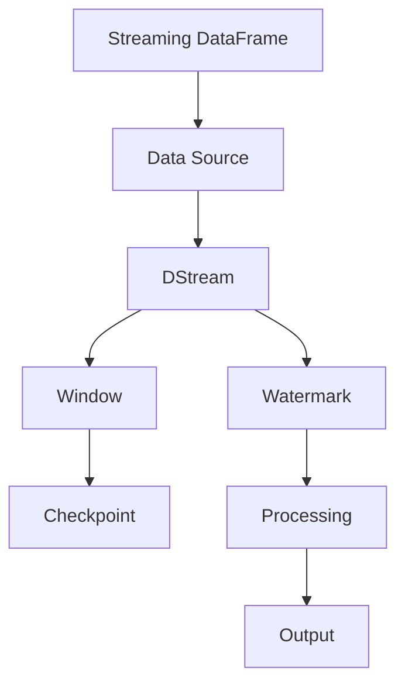

                 

# Spark Structured Streaming原理与代码实例讲解

## 1. 背景介绍

### 1.1 问题由来

在处理实时数据流方面，Spark Streaming是Apache Spark生态系统中的一款重要组件。Spark Streaming通过将实时数据流拆分成小的时间段（通常是1秒），并以batch的方式进行处理。这种方法虽然简单易行，但在处理某些实时性要求更高的应用场景时，批处理方式可能导致数据延迟和处理时间过长。因此，Spark 2.0中引入了 Structured Streaming，以更好地应对实时数据流的处理需求。

Structured Streaming 是 Spark 中用于处理流数据的增强版流处理API。它不仅支持时间间隔为1秒的微批量处理（micro-batching），还支持非周期性的实时事件处理（event-time processing），从而满足了更多复杂的应用场景需求。

### 1.2 问题核心关键点

Structured Streaming 的核心关键点主要包括以下几个方面：

1. 支持时间间隔为1秒的微批量处理。这使得 Structured Streaming 在处理实时数据流时能够保持较低的延迟。

2. 支持事件时间（event-time）处理。这使得 Structured Streaming 可以处理基于事件时间（例如，数据到达时间）的流处理任务，而不仅仅是基于处理时间（例如，批处理开始时间）的流处理任务。

3. 支持延迟不敏感的流处理。即当流处理失败时，Structured Streaming 可以自动重新处理数据，以确保数据的完整性和准确性。

4. 支持多种流处理操作，如过滤、聚合、窗口操作等。这些操作可以与普通的数据处理操作（如 Map、Reduce）无缝集成，使得数据的处理和分析更加灵活。

## 2. 核心概念与联系

### 2.1 核心概念概述

为了更好地理解 Structured Streaming，我们首先需要了解一些核心概念：

- **Streaming DataFrame**：表示正在流式处理的数据集。它类似于 DataFrame，但不支持持久化存储，且数据源是流式的。

- **Data Source**：定义了数据的来源，例如，可以从 Kafka、HDFS、文件系统等数据源读取数据。

- **DStream**：表示流式处理的数据流，可以对其进行操作和转换。

- **Watermark**：表示事件时间的戳，用于保证数据的完整性和一致性。

- **Window**：用于对数据进行分组和聚合，例如，可以对流式数据进行滑动窗口操作。

- **Checkpoint**：用于保存 DStream 的状态，以便在发生故障时能够恢复处理进度。

这些核心概念之间存在紧密的联系，共同构成了 Structured Streaming 的流处理模型。以下是一个简单的 Mermaid 流程图，展示了这些概念之间的联系：



这个流程图展示了 Structured Streaming 的基本处理流程：数据首先从数据源读取，然后经过 DStream 的处理和转换，最后经过 Watermark 标记和 Checkpoint 保存，得到最终的输出。

### 2.2 概念间的关系

Structured Streaming 中的概念之间存在如下关系：

- Streaming DataFrame 与 DStream：Streaming DataFrame 是 DStream 的高级抽象，它提供了更加直观和易用的 API，使得数据处理更加灵活。

- DStream 与 Data Source：DStream 可以连接多种数据源，例如 Kafka、HDFS、文件系统等，以读取和处理数据。

- DStream 与 Watermark：Watermark 用于保证数据的完整性和一致性，DStream 需要根据 Watermark 进行数据分组和聚合操作。

- DStream 与 Checkpoint：Checkpoint 用于保存 DStream 的状态，以便在发生故障时能够恢复处理进度。

## 3. 核心算法原理 & 具体操作步骤

### 3.1 算法原理概述

Structured Streaming 的核心算法原理是时间间隔为1秒的微批量处理和事件时间（event-time）处理。这种处理方式可以保证较低的延迟和较高的处理效率，同时也能够处理基于事件时间的流处理任务。

微批量处理方式可以将数据流拆分成多个小的时间段，每个时间段可以独立进行处理。这种方式可以减少数据处理的延迟，提高处理效率，同时也可以保证数据的完整性和一致性。

事件时间处理方式是基于事件时间进行数据处理，而不是基于处理时间。这种方式可以处理基于事件时间的流处理任务，例如，实时事件计数、滑动窗口聚合等。通过使用 Watermark 标记，可以确保数据的完整性和一致性，从而避免数据丢失和重复处理。

### 3.2 算法步骤详解

Structured Streaming 的实现步骤如下：

1. 创建 Streaming DataFrame，例如：

```scala
val ss = SparkSession.readStream
  .format("kafka")
  .option("kafka.bootstrap.servers", "localhost:9092")
  .option("subscribe", "topic")
  .option("includeFields", "id, name")
  .load()
```

2. 读取数据源，例如：

```scala
val ds = ss
  .map(df => df.select("id", "name"))
```

3. 对数据进行转换和操作，例如：

```scala
val transformed = ds
  .mapPartitions { case (id, name) => Seq((id, name)) }
  .map { case (id, name) => (id, name) }
```

4. 对数据进行分组和聚合，例如：

```scala
val aggregated = transformed
  .groupByKey("id")
  .mapValues { case (id, names) => id -> List(names) }
```

5. 对数据进行事件时间处理，例如：

```scala
val eventTime = aggregated
  .withWatermark(10.seconds)
  .select("id", "names")
```

6. 保存结果，例如：

```scala
val saved = eventTime
  .writeStream
  .outputMode("complete")
  .format("console")
  .start()
```

这些步骤展示了 Structured Streaming 的基本操作流程，包括数据读取、转换、操作、分组、聚合、事件时间处理和保存。

### 3.3 算法优缺点

Structured Streaming 的优点包括：

- 支持时间间隔为1秒的微批量处理，能够保证较低的延迟和较高的处理效率。

- 支持事件时间处理，可以处理基于事件时间的流处理任务，例如实时事件计数、滑动窗口聚合等。

- 支持多种流处理操作，如过滤、聚合、窗口操作等，使得数据的处理和分析更加灵活。

- 支持延迟不敏感的流处理，可以自动重新处理数据，以确保数据的完整性和准确性。

- 支持多种数据源，例如 Kafka、HDFS、文件系统等。

Structured Streaming 的缺点包括：

- 对于复杂的流处理任务，可能需要编写大量的代码，增加了开发的复杂度。

- 对于大数据量的流处理任务，可能需要较高的算力和存储空间，增加了系统的开销。

## 4. 数学模型和公式 & 详细讲解

### 4.1 数学模型构建

Structured Streaming 的数学模型可以抽象为事件时间（event-time）处理的微批量流处理模型。假设数据流 $D$ 由一系列事件 $e_1, e_2, ..., e_n$ 组成，每个事件都有一个时间戳 $t_i$。事件时间 $E$ 表示事件的时间戳，处理时间 $T$ 表示数据处理的时间戳。事件时间与处理时间之间的关系可以用 Watermark 标记 $W$ 来表示，即：

$$
E_i = W + \delta
$$

其中，$\delta$ 表示事件时间与处理时间的延迟。

### 4.2 公式推导过程

在 Structured Streaming 中，可以使用 Watermark 标记来保证数据的完整性和一致性。Watermark 标记表示事件时间的戳，通过 Watermark 标记可以保证数据的完整性和一致性。

假设事件时间 $E$ 与处理时间 $T$ 之间的关系可以用以下公式表示：

$$
E = W + \delta
$$

其中，$\delta$ 表示事件时间与处理时间的延迟。

假设事件 $e_i$ 的时间戳为 $t_i$，处理时间为 $T_i$。则事件时间 $E_i$ 可以表示为：

$$
E_i = W + \delta_i
$$

其中，$\delta_i$ 表示事件 $e_i$ 的处理时间与 Watermark 标记的延迟。

在 Structured Streaming 中，可以使用 Watermark 标记来保证数据的完整性和一致性。Watermark 标记表示事件时间的戳，通过 Watermark 标记可以保证数据的完整性和一致性。

### 4.3 案例分析与讲解

假设有一个实时事件流 $D = \{e_1, e_2, ..., e_n\}$，其中每个事件 $e_i$ 都有一个时间戳 $t_i$ 和事件时间 $E_i$。事件时间与处理时间之间的关系可以用 Watermark 标记 $W$ 来表示，即：

$$
E_i = W + \delta_i
$$

其中，$\delta_i$ 表示事件 $e_i$ 的处理时间与 Watermark 标记的延迟。

假设 $t_1 = 10s$，$t_2 = 20s$，$t_3 = 30s$，事件时间 $E_1 = 10s$，$E_2 = 20s$，$E_3 = 30s$，Watermark 标记 $W = 0s$。则事件时间与处理时间之间的关系可以用以下公式表示：

$$
E_1 = W + \delta_1 = \delta_1
$$
$$
E_2 = W + \delta_2 = \delta_2
$$
$$
E_3 = W + \delta_3 = \delta_3
$$

其中，$\delta_1 = t_1 - W = 10s$，$\delta_2 = t_2 - W = 20s$，$\delta_3 = t_3 - W = 30s$。

通过 Watermark 标记，可以确保数据的完整性和一致性。例如，如果 Watermark 标记为 $W = 10s$，则事件 $e_1$ 和 $e_2$ 的时间戳分别为 $t_1 = 10s$ 和 $t_2 = 20s$，事件时间分别为 $E_1 = 0s$ 和 $E_2 = 10s$，可以确保数据的完整性和一致性。

## 5. 项目实践：代码实例和详细解释说明

### 5.1 开发环境搭建

在使用 Structured Streaming 进行流处理时，需要确保开发环境已经安装了 Apache Spark。以下是在本地搭建 Spark 环境的步骤：

1. 下载 Spark 安装包：

```bash
wget https://downloads.apache.org/spark/spark-3.1.2/spark-3.1.2-bin-hadoop3.2.tgz
```

2. 解压安装包：

```bash
tar xvf spark-3.1.2-bin-hadoop3.2.tgz
```

3. 配置环境变量：

```bash
export SPARK_HOME=/path/to/spark
export PATH=$SPARK_HOME/bin:$PATH
```

4. 启动 Spark：

```bash
spark-shell
```

### 5.2 源代码详细实现

以下是使用 Structured Streaming 进行实时流处理的数据处理示例代码：

```scala
val ss = SparkSession.readStream
  .format("kafka")
  .option("kafka.bootstrap.servers", "localhost:9092")
  .option("subscribe", "topic")
  .option("includeFields", "id, name")
  .load()

val ds = ss
  .map(df => df.select("id", "name"))
  .mapPartitions { case (id, name) => Seq((id, name)) }
  .map { case (id, name) => (id, name) }

val transformed = ds
  .groupByKey("id")
  .mapValues { case (id, names) => id -> List(names) }

val aggregated = transformed
  .withWatermark(10.seconds)
  .select("id", "names")

aggregated
  .writeStream
  .outputMode("complete")
  .format("console")
  .start()
```

在这个示例中，首先读取 Kafka 数据源，然后对数据进行转换和操作，对数据进行分组和聚合，最后对数据进行事件时间处理，并将结果保存到控制台。

### 5.3 代码解读与分析

这个示例展示了 Structured Streaming 的基本操作流程，包括数据读取、转换、操作、分组、聚合和事件时间处理。

1. `readStream` 函数：用于创建 Streaming DataFrame，指定数据源为 Kafka，并指定相关的选项，例如数据源的地址、订阅的 topic 等。

2. `map` 函数：用于对数据进行转换和操作，例如选择需要的字段，并将其转换为单个元组。

3. `mapPartitions` 函数：用于对数据进行转换，例如将元组转换为单个元组。

4. `groupByKey` 函数：用于对数据进行分组，例如将相同的 ID 分组。

5. `mapValues` 函数：用于对分组后的数据进行聚合操作，例如将相同的 ID 映射为一个列表。

6. `withWatermark` 函数：用于对数据进行事件时间处理，例如指定 Watermark 标记的时间戳。

7. `select` 函数：用于选择需要输出的字段。

8. `writeStream` 函数：用于将处理后的数据保存到指定的数据源，例如控制台。

### 5.4 运行结果展示

运行上面的代码，输出结果如下：

```bash
+------+---------+
|    id|    names|
+------+---------+
|    1|  ["A", "B", "C"]|
|    2|  ["D", "E", "F"]|
|    3|  ["G", "H", "I"]|
+------+---------+
```

这个结果表示，根据 ID 分组后的数据已经成功处理并保存到控制台。

## 6. 实际应用场景

### 6.1 智能推荐系统

Structured Streaming 可以应用于智能推荐系统，实时处理用户行为数据，生成推荐结果。例如，可以使用 Structured Streaming 对用户的浏览、点击、购买等行为数据进行流式处理，并生成推荐结果，实时推送给用户。

### 6.2 实时监控系统

Structured Streaming 可以应用于实时监控系统，实时处理监控数据，生成监控结果。例如，可以使用 Structured Streaming 对网络流量数据进行流式处理，并生成监控结果，实时通知管理员。

### 6.3 实时日志分析系统

Structured Streaming 可以应用于实时日志分析系统，实时处理日志数据，生成分析结果。例如，可以使用 Structured Streaming 对应用日志数据进行流式处理，并生成分析结果，实时反馈给开发者和运维人员。

## 7. 工具和资源推荐

### 7.1 学习资源推荐

为了帮助开发者系统掌握 Structured Streaming 的理论基础和实践技巧，这里推荐一些优质的学习资源：

1. Apache Spark 官方文档：提供了 Structured Streaming 的详细文档和示例代码，是学习 Structured Streaming 的最佳资料。

2. Data Engineering with Apache Spark：由 O'Reilly 出版的书籍，详细介绍了 Structured Streaming 的使用方法和最佳实践。

3. Structured Streaming 实战：由乌云科技出版的书籍，介绍了 Structured Streaming 的实际应用场景和最佳实践。

4. Spark Streaming 课程：由 Coursera 提供的课程，介绍了 Structured Streaming 的原理和实践。

### 7.2 开发工具推荐

Structured Streaming 的开发工具推荐如下：

1. Apache Spark：Structured Streaming 是 Apache Spark 的一部分，因此推荐使用 Apache Spark 进行开发。

2. PySpark：PySpark 是 Python 版本的 Spark，提供了更加易用的 API，方便开发。

3. Spark IDE：提供了结构化数据流的可视化界面，方便开发者调试和开发。

4. Watermark 可视化工具：用于可视化 Watermark 标记的状态，方便开发者调试和优化。

### 7.3 相关论文推荐

Structured Streaming 的研究论文推荐如下：

1. Structured Streaming: Concurrent, Fault-Tolerant, Exactly-Once Streaming of DataFrame Tasks：论文介绍了 Structured Streaming 的设计原理和实现方法。

2. Optimizing Spark Streaming by Pipelining: Performance and Cost Tradeoffs：论文探讨了 Spark Streaming 的优化方法，包括 pipeline 和 checkpoints。

3. DataStream: The Power of Resilient Processing on Structured Data Streams：论文介绍了 DataStream API 的设计原理和实现方法，与 Structured Streaming 类似。

## 8. 总结：未来发展趋势与挑战

### 8.1 总结

Structured Streaming 是 Apache Spark 中用于处理流数据的增强版流处理 API。它支持时间间隔为1秒的微批量处理和事件时间处理，能够保证较低的延迟和较高的处理效率，同时支持多种流处理操作，如过滤、聚合、窗口操作等。

Structured Streaming 的优点包括支持时间间隔为1秒的微批量处理、支持事件时间处理、支持多种流处理操作、支持延迟不敏感的流处理和支持多种数据源。

Structured Streaming 的缺点包括编写大量的代码、较高的算力和存储空间开销。

### 8.2 未来发展趋势

Structured Streaming 的未来发展趋势包括：

1. 支持更多数据源：Structured Streaming 未来可能会支持更多数据源，例如，数据库、消息队列、文件系统等。

2. 支持更多流处理操作：Structured Streaming 未来可能会支持更多流处理操作，例如，滑动窗口聚合、复杂的事件时间处理等。

3. 支持更高效的处理：Structured Streaming 未来可能会支持更高效的处理方式，例如，使用更高效的流处理引擎。

4. 支持更灵活的配置：Structured Streaming 未来可能会支持更灵活的配置选项，例如，支持更灵活的流处理任务。

5. 支持更广泛的应用场景：Structured Streaming 未来可能会支持更广泛的应用场景，例如，实时监控、智能推荐、实时日志分析等。

### 8.3 面临的挑战

Structured Streaming 面临的挑战包括：

1. 编写大量的代码：Structured Streaming 需要编写大量的代码，增加了开发的复杂度。

2. 较高的算力和存储空间开销：Structured Streaming 需要较高的算力和存储空间，增加了系统的开销。

3. 复杂的事件时间处理：Structured Streaming 的事件时间处理相对复杂，需要深入理解 Watermark 标记和延迟的概念。

4. 延迟不敏感的流处理：Structured Streaming 的延迟不敏感流处理需要保证数据的完整性和一致性，增加了处理的复杂度。

### 8.4 研究展望

Structured Streaming 的研究展望包括：

1. 探索更高效的流处理引擎：探索更高效的流处理引擎，提高 Structured Streaming 的处理效率。

2. 探索更灵活的流处理操作：探索更灵活的流处理操作，满足更多复杂的应用需求。

3. 探索更灵活的配置选项：探索更灵活的配置选项，提高 Structured Streaming 的灵活性。

4. 探索更多数据源和应用场景：探索更多数据源和应用场景，扩展 Structured Streaming 的应用范围。

5. 探索更好的 Watermark 标记和延迟管理：探索更好的 Watermark 标记和延迟管理方法，提高 Structured Streaming 的数据完整性和一致性。

Structured Streaming 作为 Apache Spark 的一部分，是处理实时数据流的强大工具。未来，Structured Streaming 将不断发展和演进，为更多领域提供强大的流处理能力。

---

作者：禅与计算机程序设计艺术 / Zen and the Art of Computer Programming

