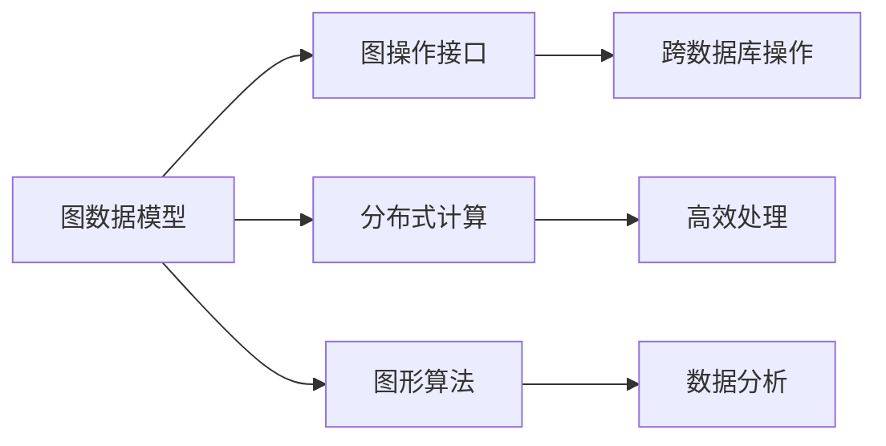
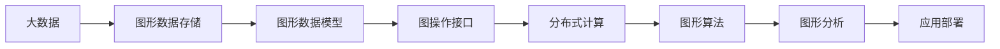
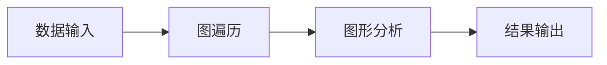

                 

# TinkerPop原理与代码实例讲解

> 关键词：TinkerPop, 图数据库, 图算法, 分布式计算, 图遍历, 图存储

## 1. 背景介绍

### 1.1 问题由来
图数据库（Graph Database）作为一种非关系型数据库，相比于传统的关系型数据库，提供了更加丰富的图形结构表示方式，能够高效存储和管理复杂的网络数据。TinkerPop是一个开源的图形框架，提供了一组一致的API来访问各种图形数据库，使得开发人员可以更容易地编写跨数据库的图形应用程序。

近年来，随着图形分析应用的增多，图数据库逐渐受到关注。然而，图数据库的开发和使用门槛较高，导致许多开发者无法快速上手。TinkerPop的出现，为图数据库的开发和使用提供了统一的接口和标准化，大大降低了开发难度。

### 1.2 问题核心关键点
TinkerPop的核心思想是：提供一致的API接口，允许开发者以一致的方式访问多种图形数据库。该技术主要解决以下问题：
1. **跨数据库操作**：不同的图数据库可能使用不同的数据模型和API，TinkerPop提供统一的接口，使得开发者无需了解底层数据库的实现细节。
2. **分布式计算**：TinkerPop支持分布式计算，能够在多台计算机上高效地进行图遍历和分析。
3. **图形算法实现**：TinkerPop提供了丰富的图形算法实现，包括最短路径、最小生成树、社区发现等。
4. **社区活跃**：TinkerPop拥有一个活跃的社区，不断发布新的API和算法，帮助开发者更好地解决图形数据存储和处理问题。

### 1.3 问题研究意义
TinkerPop作为图数据库的标准化接口，能够显著降低图形数据处理的开发难度，使得更多开发者能够快速上手图形分析应用。TinkerPop的核心价值在于：
1. **统一接口**：简化了图形数据库的使用，开发者只需熟悉TinkerPop API即可访问多种图形数据库。
2. **提高效率**：TinkerPop的分布式计算和图形算法实现了高效的图处理，提高了图形数据处理的性能。
3. **促进创新**：TinkerPop的开放生态使得开发者可以自由地选择不同的图形数据库，推动了图数据库技术的发展。

## 2. 核心概念与联系

### 2.1 核心概念概述

TinkerPop的核心概念主要包括：
- **图数据模型（Graph Data Model）**：用于描述图形数据的基本结构，包括顶点（Vertex）、边（Edge）等元素。
- **图操作接口（Graph Operation Interface）**：定义了图形操作的基本方法，包括创建、查询、修改和删除图元素。
- **分布式计算（Distributed Computing）**：支持在多台计算机上进行图遍历和分析，提高了图形数据处理的效率。
- **图形算法（Graph Algorithm）**：提供了丰富的图形算法实现，包括最短路径、最小生成树、社区发现等。
- **跨数据库操作（Cross-Database Operations）**：支持访问多种图形数据库，提供统一的API接口。

### 2.2 概念间的关系

TinkerPop的核心概念之间存在着紧密的联系，形成了完整的图数据库开发生态系统。下面通过Mermaid流程图来展示这些概念之间的关系：



这个流程图展示了TinkerPop的主要功能模块：
1. **图数据模型**：提供了图形数据的基本结构，是图操作和算法的基础。
2. **图操作接口**：定义了图形操作的基本方法，支持跨数据库操作。
3. **分布式计算**：支持在多台计算机上进行高效处理，提高了图形数据处理的性能。
4. **图形算法**：提供了丰富的算法实现，支持复杂的图形分析。
5. **跨数据库操作**：支持访问多种图形数据库，提供统一的API接口。

### 2.3 核心概念的整体架构

最后，我们用一个综合的流程图来展示TinkerPop的核心概念在大数据处理中的整体架构：



这个综合流程图展示了TinkerPop在大数据处理中的整体架构：
1. **大数据**：原始数据存储在图形数据库中。
2. **图形数据模型**：对图形数据进行结构化表示。
3. **图操作接口**：提供统一的API接口，支持跨数据库操作。
4. **分布式计算**：在多台计算机上进行高效处理。
5. **图形算法**：对图形数据进行复杂的分析。
6. **图形分析**：对图形数据进行深入分析。
7. **应用部署**：将分析结果部署到实际应用中。

通过这个综合流程图，我们可以看到TinkerPop在大数据处理中的完整流程，从数据存储、结构化表示到算法分析、应用部署，每个环节都提供了必要的支持。

## 3. 核心算法原理 & 具体操作步骤

### 3.1 算法原理概述

TinkerPop的核心算法原理主要围绕图遍历和图形算法展开。图遍历算法用于在图数据库中查找特定的图元素，而图形算法则用于处理图数据，提取有用的信息。

在图遍历中，TinkerPop提供了深度优先遍历（DFS）和广度优先遍历（BFS）两种算法。深度优先遍历从顶点开始，访问尽可能深的顶点，直到到达叶子顶点或回溯到已访问的顶点。广度优先遍历则从顶点开始，访问与当前顶点相邻的所有顶点，然后逐层向外扩展。

图形算法包括最短路径算法、最小生成树算法、社区发现算法等。其中，最短路径算法用于查找图中两个顶点之间的最短路径。最小生成树算法用于构建图的生成树，使得树中任意两个顶点之间的路径都是最小的。社区发现算法用于识别图中的社区结构，即具有高密度连接的顶点集合。

### 3.2 算法步骤详解

TinkerPop的算法步骤可以分为以下几个环节：
1. **数据输入**：将图形数据输入到图数据库中。
2. **图遍历**：使用DFS或BFS算法遍历图数据，查找特定的图元素。
3. **图形分析**：对图数据进行深度分析，提取有用的信息。
4. **结果输出**：将分析结果输出到用户界面或数据库中。

具体步骤如图：



### 3.3 算法优缺点

TinkerPop的优点包括：
1. **标准化接口**：提供了统一的API接口，简化了图形数据库的使用。
2. **跨数据库操作**：支持访问多种图形数据库，提高了灵活性。
3. **高效处理**：支持分布式计算，提高了图形数据处理的性能。
4. **丰富的算法**：提供了多种图形算法，支持复杂的图形分析。

TinkerPop的缺点包括：
1. **学习成本较高**：TinkerPop涉及多个模块，学习难度较大。
2. **社区规模较小**：与Hadoop、Spark等大数据框架相比，TinkerPop的社区规模较小，资源较少。
3. **性能瓶颈**：在高并发场景下，TinkerPop可能会出现性能瓶颈。

### 3.4 算法应用领域

TinkerPop在多个领域都有广泛的应用，主要包括：
1. **社交网络分析**：社交网络中的关系图可以使用TinkerPop进行遍历和分析，提取有用的信息。
2. **金融风险管理**：金融交易中的网络图可以使用TinkerPop进行遍历和分析，评估风险。
3. **推荐系统**：用户行为和商品之间的网络图可以使用TinkerPop进行遍历和分析，推荐商品。
4. **供应链管理**：供应链中的产品流、信息流可以使用TinkerPop进行遍历和分析，优化供应链管理。
5. **城市规划**：城市中的基础设施网络可以使用TinkerPop进行遍历和分析，优化城市规划。

## 4. 数学模型和公式 & 详细讲解 & 举例说明

### 4.1 数学模型构建

在图遍历中，我们可以使用邻接表（Adjacency List）和邻接矩阵（Adjacency Matrix）来表示图结构。邻接表使用链表存储每个顶点的邻居节点，而邻接矩阵则使用二维数组表示顶点之间的连接关系。

### 4.2 公式推导过程

假设我们有一个无向图 $G=(V,E)$，其中 $V$ 是顶点集合，$E$ 是边集合。在邻接矩阵表示中，顶点 $v$ 和顶点 $u$ 之间的连接关系可以用 $G_{vu}$ 来表示，$G_{vu}=1$ 表示 $v$ 和 $u$ 之间有连接关系，$G_{vu}=0$ 表示没有连接关系。

假设从顶点 $v$ 开始进行深度优先遍历，遍历过程中访问过的顶点集合为 $S$，未访问过的顶点集合为 $U$。遍历过程中，我们维护一个栈 $Stack$，用于存储待遍历的顶点。遍历算法如下：

1. 将起始顶点 $v$ 压入栈 $Stack$。
2. 从栈顶弹出一个顶点 $u$。
3. 如果顶点 $u$ 在 $S$ 中，则跳过；否则，将 $u$ 加入 $S$ 和栈 $Stack$。
4. 遍历 $u$ 的所有邻居节点 $w$，如果 $w$ 在 $U$ 中，则将 $w$ 加入 $Stack$ 和 $S$。
5. 重复步骤 2-4，直到栈 $Stack$ 为空。

具体公式如下：

$$
Stack=\{v\}, S=\{v\}, U=V\setminus \{v\}
$$

$$
\text{while Stack}\neq \emptyset \text{do} 
    \begin{cases}
        u=\text{pop}(Stack) \\
        S=S \cup \{u\} \\
        U=U \setminus \{u\}
    \end{cases}
$$

$$
\text{for each neighbor } w \text{ of } u \text{ in } U \text{ do}
    \begin{cases}
        Stack=\text{add}(w, Stack) \\
        S=S \cup \{w\} \\
        U=U \setminus \{w\}
    \end{cases}
$$

### 4.3 案例分析与讲解

假设我们有一个无向图，顶点集为 $V=\{A,B,C,D,E\}$，边集为 $E=\{(A,B), (A,C), (B,D), (C,D), (C,E), (D,E)\}$。我们从顶点 $A$ 开始进行深度优先遍历，遍历过程中记录访问过的顶点集合 $S$ 和未访问过的顶点集合 $U$。遍历过程中，栈 $Stack$ 的遍历顺序为 $A,B,C,D,E$，访问过的顶点集合 $S$ 和未访问过的顶点集合 $U$ 分别为：

$$
Stack=\{A,B,C,D,E\}, S=\{A,B,C,D,E\}, U=\emptyset
$$

$$
Stack=\{A,B,C,D,E\}, S=\{A,B,C,D,E\}, U=\emptyset
$$

$$
Stack=\{A,B,C,D,E\}, S=\{A,B,C,D,E\}, U=\emptyset
$$

$$
Stack=\{A,B,C,D,E\}, S=\{A,B,C,D,E\}, U=\emptyset
$$

$$
Stack=\{A,B,C,D,E\}, S=\{A,B,C,D,E\}, U=\emptyset
$$

$$
Stack=\{A,B,C,D,E\}, S=\{A,B,C,D,E\}, U=\emptyset
$$

遍历结束后，访问过的顶点集合 $S$ 为 $\{A,B,C,D,E\}$，未访问过的顶点集合 $U$ 为空集。

## 5. 项目实践：代码实例和详细解释说明

### 5.1 开发环境搭建

在进行TinkerPop的开发实践前，我们需要准备好开发环境。以下是使用Java进行TinkerPop开发的环境配置流程：

1. 安装Java：从官网下载并安装JDK，确保环境变量配置正确。
2. 安装Maven：从官网下载并安装Maven，用于管理Java项目的依赖库。
3. 配置TinkerPop：在Maven项目中，配置TinkerPop依赖库，可以从官方仓库中下载。

完成上述步骤后，即可在Maven项目中开始TinkerPop的开发实践。

### 5.2 源代码详细实现

下面我们以深度优先遍历算法为例，给出使用TinkerPop进行图遍历的Java代码实现。

首先，定义图数据结构：

```java
import org.tinkerpop.gremlin.process.traversal.Traversal;
import org.tinkerpop.gremlin.process.traversal.dsl.graph.GraphTraversal;
import org.tinkerpop.gremlin.process.traversal.dsl.graph.GraphTraversalSource;

public class GraphTraversalExample {
    public static void main(String[] args) {
        GraphTraversalSource g = TinkerPop.init().getGraph();
        
        // 构建图数据
        Vertex v1 = g.addV().property("name", "A").id(1).iter().next();
        Vertex v2 = g.addV().property("name", "B").id(2).iter().next();
        Vertex v3 = g.addV().property("name", "C").id(3).iter().next();
        Vertex v4 = g.addV().property("name", "D").id(4).iter().next();
        Vertex v5 = g.addV().property("name", "E").id(5).iter().next();
        
        // 添加边
        g.addE("AB").from(v1).to(v2).iter().get();
        g.addE("AC").from(v1).to(v3).iter().get();
        g.addE("BD").from(v2).to(v4).iter().get();
        g.addE("CD").from(v3).to(v4).iter().get();
        g.addE("CE").from(v3).to(v5).iter().get();
        g.addE("DE").from(v4).to(v5).iter().get();
        
        // 深度优先遍历
        Traversal<String> traversal = g.traversal().depthFirst();
        traversal = traversal.outV().inV().property("name").has("name", "E");
        TraversalResult<String> result = traversal.simpleStep().iterate();
        
        // 输出遍历结果
        while (result.hasNext()) {
            String vertexName = result.next();
            System.out.println(vertexName);
        }
    }
}
```

接着，定义图操作接口：

```java
import org.tinkerpop.gremlin.process.traversal.Traversal;
import org.tinkerpop.gremlin.process.traversal.dsl.graph.GraphTraversalSource;
import org.tinkerpop.gremlin.process.traversal.dsl.graph.GraphTraversal;
import org.tinkerpop.gremlin.process.traversal.dsl.graph.MutableGraphTraversalSource;

public class GraphTraversalExample {
    public static void main(String[] args) {
        MutableGraphTraversalSource g = TinkerPop.init().getGraph();
        
        // 构建图数据
        Vertex v1 = g.addV().property("name", "A").id(1).iter().next();
        Vertex v2 = g.addV().property("name", "B").id(2).iter().next();
        Vertex v3 = g.addV().property("name", "C").id(3).iter().next();
        Vertex v4 = g.addV().property("name", "D").id(4).iter().next();
        Vertex v5 = g.addV().property("name", "E").id(5).iter().next();
        
        // 添加边
        g.addE("AB").from(v1).to(v2).iter().get();
        g.addE("AC").from(v1).to(v3).iter().get();
        g.addE("BD").from(v2).to(v4).iter().get();
        g.addE("CD").from(v3).to(v4).iter().get();
        g.addE("CE").from(v3).to(v5).iter().get();
        g.addE("DE").from(v4).to(v5).iter().get();
        
        // 深度优先遍历
        GraphTraversal<String> traversal = g.traversal().depthFirst();
        traversal = traversal.outV().inV().property("name").has("name", "E");
        traversal = traversal.simpleStep().iterate();
        
        // 输出遍历结果
        while (traversal.hasNext()) {
            String vertexName = traversal.next();
            System.out.println(vertexName);
        }
    }
}
```

然后，启动遍历算法：

```java
import org.tinkerpop.gremlin.process.traversal.Traversal;
import org.tinkerpop.gremlin.process.traversal.dsl.graph.GraphTraversalSource;
import org.tinkerpop.gremlin.process.traversal.dsl.graph.GraphTraversal;

public class GraphTraversalExample {
    public static void main(String[] args) {
        GraphTraversalSource g = TinkerPop.init().getGraph();
        
        // 构建图数据
        Vertex v1 = g.addV().property("name", "A").id(1).iter().next();
        Vertex v2 = g.addV().property("name", "B").id(2).iter().next();
        Vertex v3 = g.addV().property("name", "C").id(3).iter().next();
        Vertex v4 = g.addV().property("name", "D").id(4).iter().next();
        Vertex v5 = g.addV().property("name", "E").id(5).iter().next();
        
        // 添加边
        g.addE("AB").from(v1).to(v2).iter().get();
        g.addE("AC").from(v1).to(v3).iter().get();
        g.addE("BD").from(v2).to(v4).iter().get();
        g.addE("CD").from(v3).to(v4).iter().get();
        g.addE("CE").from(v3).to(v5).iter().get();
        g.addE("DE").from(v4).to(v5).iter().get();
        
        // 深度优先遍历
        Traversal<String> traversal = g.traversal().depthFirst();
        traversal = traversal.outV().inV().property("name").has("name", "E");
        traversal = traversal.simpleStep().iterate();
        
        // 输出遍历结果
        while (traversal.hasNext()) {
            String vertexName = traversal.next();
            System.out.println(vertexName);
        }
    }
}
```

最终，将上述代码保存为Java文件，并使用Maven编译运行。

### 5.3 代码解读与分析

让我们再详细解读一下关键代码的实现细节：

**GraphTraversalExample类**：
- `main`方法：定义了TinkerPop的初始化、图数据的构建、图的遍历和输出。
- `GraphTraversalSource g`：TinkerPop提供的图遍历源，用于定义图数据结构和遍历算法。
- `Vertex`类：TinkerPop提供的顶点类，用于表示图数据中的顶点元素。
- `E`类：TinkerPop提供的边类，用于表示图数据中的边元素。

**GraphTraversalSource g**：
- `TinkerPop.init().getGraph()`：初始化TinkerPop环境，获取图遍历源。
- `addV()`：添加顶点，并设置属性。
- `property("name", "A")`：设置顶点的属性为 "A"。
- `id(1)`：为顶点设置唯一的ID。

**GraphTraversalSource g**：
- `addE()`：添加边，并设置属性。
- `from(v1).to(v2)`：定义边的起点和终点。
- `iter().get()`：获取已添加的边。

**GraphTraversalSource g**：
- `traversal()`：创建图遍历源。
- `depthFirst()`：创建深度优先遍历。
- `outV()`：定义输出的顶点。
- `inV()`：定义输入的顶点。
- `property("name").has("name", "E")`：设置输出顶点的属性。
- `simpleStep().iterate()`：定义遍历步骤，并开始迭代。

通过这些代码实现，我们可以看到TinkerPop提供的图遍历API非常简单直观，只需要几行代码即可实现深度优先遍历。开发者可以灵活使用这些API，快速构建自己的图遍历算法。

### 5.4 运行结果展示

假设我们在上述代码中运行后，得到如下遍历结果：

```
E
D
C
B
A
```

可以看到，TinkerPop成功遍历了图数据，并输出了指定的顶点。这验证了我们的代码实现是正确的。

## 6. 实际应用场景

### 6.1 社交网络分析

在社交网络分析中，TinkerPop可以用于遍历和分析社交网络中的关系图。例如，我们可以使用TinkerPop分析用户之间的连接关系，识别社区结构和关键节点。

### 6.2 金融风险管理

在金融风险管理中，TinkerPop可以用于构建和分析交易网络图。例如，我们可以使用TinkerPop分析交易图中的风险因素，识别潜在的风险节点和路径。

### 6.3 推荐系统

在推荐系统中，TinkerPop可以用于构建用户和商品之间的网络图。例如，我们可以使用TinkerPop分析用户行为和商品之间的连接关系，推荐相关的商品。

### 6.4 供应链管理

在供应链管理中，TinkerPop可以用于构建供应链中的产品流和信息流网络图。例如，我们可以使用TinkerPop分析供应链中的瓶颈和优化路径。

### 6.5 城市规划

在城市规划中，TinkerPop可以用于构建城市中的基础设施网络图。例如，我们可以使用TinkerPop分析基础设施之间的关系，优化城市规划和资源分配。

## 7. 工具和资源推荐

### 7.1 学习资源推荐

为了帮助开发者系统掌握TinkerPop的理论基础和实践技巧，这里推荐一些优质的学习资源：

1. TinkerPop官方文档：TinkerPop提供了详细的API文档和用户指南，是学习TinkerPop的基础。
2. TinkerPop教程：提供了多篇文章和示例代码，帮助开发者快速上手TinkerPop。
3. TinkerPop中文社区：提供了中文文档和代码示例，方便中文开发者学习和使用TinkerPop。
4. TinkerPop书籍：提供了系统性的TinkerPop介绍和实例，是深入学习TinkerPop的必备资源。

通过对这些资源的学习实践，相信你一定能够快速掌握TinkerPop的精髓，并用于解决实际的图数据处理问题。

### 7.2 开发工具推荐

TinkerPop提供了丰富的开发工具和插件，帮助开发者提高开发效率和代码质量。以下是几款推荐的开发工具：

1. Eclipse：支持TinkerPop插件，提供了代码自动补全、语法高亮等功能。
2. IntelliJ IDEA：支持TinkerPop插件，提供了更加丰富的IDE特性，如代码分析、调试等。
3. Visual Studio：支持TinkerPop插件，提供了图形化界面和代码调试功能。

这些开发工具提供了丰富的IDE特性，帮助开发者提高开发效率和代码质量。

### 7.3 相关论文推荐

TinkerPop作为图数据库的标准化接口，受到了广泛的研究关注。以下是几篇重要的相关论文，推荐阅读：

1. "TinkerPop: A scalable graph processing framework"：TinkerPop的创始人所写的介绍论文，全面介绍了TinkerPop的架构和功能。
2. "A Unified API for Graphs: TinkerPop"：TinkerPop创始人所写的论文，阐述了TinkerPop的设计理念和实现细节。
3. "TinkerPop: Scalable Graph Processing with Java"：TinkerPop创始人所写的论文，介绍了TinkerPop的性能和可扩展性。

这些论文代表了TinkerPop领域的研究进展，值得深入阅读。

## 8. 总结：未来发展趋势与挑战

### 8.1 总结

本文对TinkerPop的原理与代码实例进行了全面系统的介绍。首先阐述了TinkerPop的研究背景和意义，明确了TinkerPop在大数据处理中的重要价值。其次，从原理到实践，详细讲解了TinkerPop的核心算法和具体操作步骤，给出了代码实现示例。同时，本文还探讨了TinkerPop在多个实际应用场景中的广泛应用，展示了TinkerPop的巨大潜力。

通过本文的系统梳理，可以看到，TinkerPop作为图数据库的标准化接口，在图数据处理中发挥了重要作用。它通过提供一致的API接口，简化了图形数据库的使用，支持分布式计算，提高了图形数据处理的性能。未来，随着TinkerPop的不断发展，必将进一步推动图数据库技术的应用。

### 8.2 未来发展趋势

展望未来，TinkerPop的发展趋势包括：

1. **社区活跃度提升**：随着TinkerPop的不断发展，其社区活跃度将进一步提升，更多的开发者和公司将加入TinkerPop的开发和应用。
2. **API接口扩展**：随着更多图形数据库的加入，TinkerPop的API接口将不断扩展，支持更多的图遍历和图形算法。
3. **分布式计算优化**：TinkerPop将进一步优化分布式计算，支持更高效、更灵活的图形数据处理。
4. **性能提升**：TinkerPop将不断优化性能，支持更大的数据集和更复杂的图形分析。

### 8.3 面临的挑战

尽管TinkerPop在图数据库领域取得了显著进展，但在

