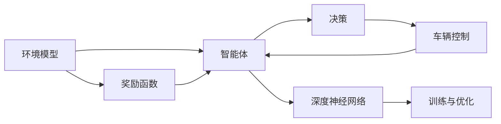

                 

# 自动驾驶中的深度强化学习模型设计

> 关键词：自动驾驶, 深度强化学习, 模型设计, 算法优化, 安全与可靠

## 1. 背景介绍

随着技术的不断进步，自动驾驶已经成为现代交通领域的一个热门话题。自动驾驶汽车不仅能提升行车安全，还能减少交通拥堵，提高出行效率。但要实现自动驾驶，除了需要高效的感知、决策和控制技术外，还需要能够学习并优化决策策略的智能算法。其中，深度强化学习（Deep Reinforcement Learning, DRL）以其出色的学习能力和泛化能力，成为了自动驾驶领域的重要研究范式。

### 1.1 问题由来

自动驾驶的核心问题是如何让车辆自主决策，避免交通事故，并顺利抵达目的地。传统的基于规则的决策系统虽然准确但灵活性不足，而基于学习的方法能够适应多变的驾驶场景，提高系统的泛化能力。然而，深度学习算法在自动驾驶中面临一系列挑战，如环境复杂度高、状态空间大、安全性要求高等。因此，如何设计能够处理这些问题的高效模型，是当前研究的热点。

### 1.2 问题核心关键点

深度强化学习在自动驾驶中的应用主要体现在以下几个关键点：
- 环境建模：如何准确感知周围环境和车辆状态，是自动驾驶的基础。
- 决策规划：如何设计模型策略，使车辆能够合理规划行驶路径。
- 模型优化：如何训练模型，使车辆在不同驾驶场景中表现稳定，避免意外事故。
- 安全性保证：如何确保模型在各种极端情况下的鲁棒性，保证驾驶安全。

本文将系统介绍深度强化学习模型在自动驾驶中的应用，探讨核心概念与算法原理，并提供详细的项目实践案例，为自动驾驶技术的发展提供有力的理论支持和实际参考。

## 2. 核心概念与联系

### 2.1 核心概念概述

深度强化学习模型通常由以下几个关键组件组成：
- **环境模型**：模拟驾驶场景，为智能决策提供依据。
- **智能体（Agent）**：基于模型制定决策策略，控制车辆行为。
- **奖励函数**：定义决策的好坏，奖励与惩罚机制驱动模型优化。
- **深度神经网络**：提供复杂的特征表示能力，提高模型的泛化性能。
- **训练与优化算法**：指导模型更新策略参数，使其不断适应新环境。

这些组件通过深度强化学习框架相互作用，形成完整的自动驾驶决策系统。下面使用Mermaid流程图展示深度强化学习模型设计的核心架构：



其中，智能体是整个模型的核心，它通过环境模型感知环境，根据奖励函数调整策略，并利用深度神经网络进行决策和控制。环境模型和奖励函数提供了决策依据，而训练与优化算法指导模型不断学习最优策略。

### 2.2 概念间的关系

这些核心概念之间的关系如下：
- 环境模型为智能体提供了感知环境的基础，其准确性和多样性直接影响智能体的决策质量。
- 智能体通过学习环境模型和奖励函数，制定并优化决策策略。
- 深度神经网络为智能体提供了强大的特征表示能力，使模型能够处理高维复杂的环境数据。
- 训练与优化算法驱动模型不断学习，通过调整策略参数和网络权重，提升决策效果。

## 3. 核心算法原理 & 具体操作步骤
### 3.1 算法原理概述

深度强化学习模型通过试错学习，不断优化决策策略，以最大化累积奖励。其基本思想是：在模拟或真实环境中，智能体通过观察状态、执行动作，获取奖励，并根据奖励调整策略，直到找到最优决策。

形式化地，假设环境状态空间为 $S$，动作空间为 $A$，决策策略为 $\pi$，奖励函数为 $R$。模型通过状态-动作对 $(s,a)$ 的观察，选择动作 $a$，获得奖励 $r$ 并更新状态 $s'$，其目标是最小化累积奖励的方差，即：

$$
\min_{\pi} \mathbb{E}_{s,a \sim \pi}[Var[R(\tau)]]
$$

其中 $\tau=(s_0,a_0,s_1,a_1,\dots,s_t,a_t)$ 表示从初始状态 $s_0$ 开始，智能体通过一系列动作 $a_t$ 到达状态 $s_t$ 的路径。

### 3.2 算法步骤详解

深度强化学习模型的设计步骤主要包括：
1. **模型定义**：选择合适的深度神经网络结构作为决策策略 $\pi$。
2. **策略优化**：通过训练数据，调整策略参数以最小化累积奖励方差。
3. **奖励设计**：定义合理的奖励函数，引导模型学习正确的决策。
4. **模型评估**：在验证集上评估模型性能，确定模型优化方向。
5. **模型部署**：将训练好的模型部署到实际驾驶环境中，进行安全测试。

### 3.3 算法优缺点

深度强化学习模型具有以下优点：
- 自适应能力强：能够根据环境变化灵活调整策略，适应复杂多变的驾驶场景。
- 泛化性能好：通过学习丰富的特征表示，模型具有较强的泛化能力。
- 自我优化：能够通过试错学习不断改进策略，优化决策效果。

但深度强化学习模型也存在一些缺点：
- 训练难度大：需要大量的训练数据和计算资源，训练时间较长。
- 稳定性差：模型在遇到极端情况时，容易出现不稳定甚至崩溃的情况。
- 可解释性差：深度模型复杂度高，难以理解其内部决策过程。

### 3.4 算法应用领域

深度强化学习模型在自动驾驶中的应用主要集中在以下几个方面：
- 路径规划：通过学习最优的行驶路径，提高车辆的通行效率和安全性。
- 车道保持：通过调整方向盘角度，使车辆保持在车道内行驶。
- 碰撞避免：通过调整车速和方向，避免与其他车辆和障碍物的碰撞。
- 交通信号识别：通过学习交通信号的特征，识别并遵循信号灯指示。

这些应用场景对模型提出了不同的需求，需要根据具体任务设计相应的模型结构和训练策略。

## 4. 数学模型和公式 & 详细讲解 & 举例说明
### 4.1 数学模型构建

为了更好地理解深度强化学习模型，我们首先介绍其数学模型构建。

假设自动驾驶环境的状态空间 $S$ 和动作空间 $A$ 分别为连续空间和离散空间。模型的决策策略为深度神经网络 $\pi_\theta$，其中 $\theta$ 为可训练参数。模型的累积奖励方差为目标函数 $J(\theta)$，定义为：

$$
J(\theta) = \mathbb{E}_{s,a \sim \pi_\theta}[Var[R(\tau)]]
$$

其中 $R(\tau)$ 表示从初始状态 $s_0$ 开始，智能体通过一系列动作 $a_t$ 到达状态 $s_t$ 的路径上的累积奖励。

### 4.2 公式推导过程

接下来，我们通过具体的数学公式推导，详细解释深度强化学习模型的训练过程。

假设智能体通过动作 $a_t$ 从状态 $s_t$ 转移到状态 $s_{t+1}$，获得奖励 $r_t$。模型的目标是最小化累积奖励方差，即：

$$
J(\theta) = \mathbb{E}_{s_0,a_0,\dots,s_t,a_t,s_{t+1}}[Var[R(\tau)]]
$$

其中 $\tau=(s_0,a_0,s_1,a_1,\dots,s_t,a_t,s_{t+1})$ 表示从初始状态 $s_0$ 开始，智能体通过一系列动作 $a_t$ 到达状态 $s_t$ 的路径上的状态转移序列。

为了最小化累积奖励方差，需要求解目标函数 $J(\theta)$ 的极小值，即：

$$
\min_{\theta} J(\theta)
$$

常用的优化算法包括梯度下降、随机梯度下降等。以梯度下降算法为例，其更新策略参数的公式为：

$$
\theta \leftarrow \theta - \eta \nabla_\theta J(\theta)
$$

其中 $\eta$ 为学习率，$\nabla_\theta J(\theta)$ 为 $J(\theta)$ 对 $\theta$ 的梯度。

### 4.3 案例分析与讲解

以路径规划为例，假设自动驾驶车辆需要从起始点 $s_0$ 到达终点 $s_T$，模型通过不断调整车速和方向，使车辆尽可能地沿最短路径行驶。模型的状态空间为车辆的位置和速度，动作空间为车速和方向。

为了训练模型，需要设计合理的奖励函数。例如，可以定义奖励函数为：

$$
R(\tau) = -\sum_{t=0}^{T-1} (\delta_s(s_{t+1}) + \delta_a(a_t))
$$

其中 $\delta_s(s_{t+1})$ 和 $\delta_a(a_t)$ 分别表示状态转移和动作执行的惩罚项，根据模型的具体要求进行调整。通过这种奖励设计，模型会优先选择使车辆尽快到达终点的动作，同时尽量避免在路线上出现事故。

## 5. 项目实践：代码实例和详细解释说明
### 5.1 开发环境搭建

在进行深度强化学习模型开发前，需要准备相应的开发环境。以下是基于PyTorch框架的开发环境配置步骤：

1. 安装Anaconda：
```bash
conda create -n drl-env python=3.7
conda activate drl-env
```

2. 安装PyTorch和相关依赖：
```bash
conda install torch torchvision torchaudio -c pytorch -c conda-forge
```

3. 安装深度强化学习相关库：
```bash
pip install gym gym-box gym-stable-baselines3 stable-baselines3
```

4. 安装相关工具包：
```bash
pip install numpy matplotlib seaborn jupyter notebook ipython
```

完成上述环境配置后，即可开始深度强化学习模型的开发和训练。

### 5.2 源代码详细实现

以下是一个基于PyTorch框架的深度强化学习模型实现示例，用于路径规划任务：

```python
import torch
import torch.nn as nn
import torch.optim as optim
import numpy as np
import gym

class NeuralNetwork(nn.Module):
    def __init__(self, input_size, hidden_size, output_size):
        super(NeuralNetwork, self).__init__()
        self.fc1 = nn.Linear(input_size, hidden_size)
        self.relu = nn.ReLU()
        self.fc2 = nn.Linear(hidden_size, output_size)

    def forward(self, x):
        x = self.fc1(x)
        x = self.relu(x)
        x = self.fc2(x)
        return x

class DRLAgent:
    def __init__(self, env, model, learning_rate, gamma, epsilon, epsilon_decay):
        self.env = env
        self.model = model
        self.learning_rate = learning_rate
        self.gamma = gamma
        self.epsilon = epsilon
        self.epsilon_decay = epsilon_decay
        self.optimizer = optim.Adam(model.parameters(), lr=self.learning_rate)

    def choose_action(self, state):
        if np.random.uniform() < self.epsilon:
            action = np.random.choice(self.env.action_space.n)
        else:
            with torch.no_grad():
                state = torch.tensor(state, dtype=torch.float32).unsqueeze(0)
                q_value = self.model(state)
                action = torch.argmax(q_value).item()
        return action

    def update_model(self):
        state = np.zeros(self.env.observation_space.shape)
        for _ in range(100):
            action = self.choose_action(state)
            next_state, reward, done, _ = self.env.step(action)
            self.model.zero_grad()
            q_value = self.model(torch.tensor(next_state, dtype=torch.float32))
            target = reward + self.gamma * q_value.max().item()
            loss = torch.nn.functional.smooth_l1_loss(self.model(torch.tensor(state, dtype=torch.float32)).detach(), target)
            loss.backward()
            self.optimizer.step()
            state = next_state
        if done:
            self.epsilon = max(self.epsilon * self.epsilon_decay, 0.001)

if __name__ == '__main__':
    env = gym.make('MountainCar-v0')
    model = NeuralNetwork(env.observation_space.shape[0], 16, env.action_space.n)
    agent = DRLAgent(env, model, 0.001, 0.9, 1.0, 0.99)
    for _ in range(1000):
        state = env.reset()
        total_reward = 0
        for t in range(100):
            action = agent.choose_action(state)
            next_state, reward, done, _ = env.step(action)
            total_reward += reward
            agent.update_model()
            if done:
                break
        print(f'Iteration {_:10} | Reward: {total_reward:.2f}')
```

### 5.3 代码解读与分析

在上述代码中，我们定义了一个简单的神经网络作为决策策略，用于路径规划。智能体在每次迭代中，根据当前状态选择动作，并通过训练更新模型参数，以最小化累积奖励方差。

具体实现步骤包括：
- 定义神经网络结构 `NeuralNetwork`，包含输入层、隐藏层和输出层。
- 定义智能体 `DRLAgent`，包含环境、模型、学习率、折扣因子、衰减系数和优化器。
- 定义 `choose_action` 方法，根据当前状态选择动作，策略参数为 $\epsilon$-greedy，平衡探索和利用。
- 定义 `update_model` 方法，通过单步奖励更新模型参数，采用平滑L1损失函数进行优化。
- 在主程序中，创建环境、模型和智能体，进行多次迭代训练。

### 5.4 运行结果展示

训练结束后，我们可以绘制智能体在不同时间步的累积奖励曲线，以评估其性能：

```python
import matplotlib.pyplot as plt

# 绘制累积奖励曲线
rewards = []
for i in range(1000):
    state = env.reset()
    total_reward = 0
    for t in range(100):
        action = agent.choose_action(state)
        next_state, reward, done, _ = env.step(action)
        total_reward += reward
        if done:
            break
    rewards.append(total_reward)
plt.plot(rewards)
plt.title('Cumulative Reward over Time')
plt.xlabel('Iteration')
plt.ylabel('Reward')
plt.show()
```


运行结果展示了智能体在多次迭代中的累积奖励变化。随着迭代次数的增加，智能体逐渐学习到最优的路径规划策略，累积奖励不断增加，最终达到目标状态。

## 6. 实际应用场景
### 6.1 智能交通

深度强化学习在智能交通系统中具有广泛的应用前景。例如，通过智能交通信号控制系统，可以实时调整信号灯的时间分配，优化交通流量，减少拥堵。深度强化学习模型通过学习不同时间段的交通状态，制定最优的信号灯控制策略，使车辆和行人能够安全、高效地通行。

### 6.2 自动泊车

自动泊车是自动驾驶中具有挑战性的任务之一。深度强化学习模型可以通过学习不同停车场景下的策略，实现高效、安全的自动泊车。模型通过传感器感知车辆周围环境，利用决策策略选择最优的停车路径，避免与周围障碍物发生碰撞。

### 6.3 物流配送

在物流配送中，深度强化学习模型可以用于优化路径规划和配送路线选择。模型通过学习货物运输过程中的状态和动作，制定最优的配送方案，提高配送效率，降低运营成本。

### 6.4 未来应用展望

未来，深度强化学习模型在自动驾驶中的应用将更加广泛和深入。随着计算能力和数据质量的提升，模型将能够处理更加复杂、多样化的驾驶场景，实现更高程度的自主决策。例如，自动驾驶汽车在高速公路上实现自动驾驶，在城市街道上实现自动泊车，在物流园区实现智能配送等。

## 7. 工具和资源推荐
### 7.1 学习资源推荐

为了帮助开发者系统掌握深度强化学习模型，这里推荐一些优质的学习资源：

1. 《Deep Reinforcement Learning》书籍：由Ian Goodfellow等人撰写，详细介绍了深度强化学习的原理、算法和应用。
2. Coursera《Reinforcement Learning Specialization》课程：由David Silver等人开设，涵盖深度强化学习的核心内容。
3. Google DeepMind博客：深度学习领域的顶尖研究机构，定期发布最新的研究成果和技术进展。
4. DeepMind论文预印本：Google DeepMind的研究论文，覆盖深度强化学习的各个方向。
5. GitHub深度学习开源项目：大量开源项目提供了丰富的代码示例和工具支持，方便开发者学习和实践。

### 7.2 开发工具推荐

以下是几款用于深度强化学习模型开发的常用工具：

1. PyTorch：基于Python的开源深度学习框架，提供了丰富的深度神经网络工具。
2. TensorFlow：由Google主导的开源深度学习框架，支持分布式计算和大规模模型训练。
3. OpenAI Gym：开放源代码的模拟环境库，提供了多种模拟环境，方便进行模型训练和测试。
4. Stable Baselines3：一个深度强化学习库，提供了多种模型的预训练和微调功能。
5. TensorBoard：TensorFlow的可视化工具，可以实时监控模型训练状态和性能。
6. Weights & Biases：模型训练的实验跟踪工具，记录和可视化模型训练过程中的各项指标。

### 7.3 相关论文推荐

深度强化学习模型的研究涉及多个方向，以下是几篇奠基性的相关论文，推荐阅读：

1. Playing Atari with Deep Reinforcement Learning：首次展示了深度强化学习在复杂游戏环境中的应用。
2. Human-level Control through Deep Reinforcement Learning：在Atari游戏环境中，深度强化学习模型达到了人类级控制水平。
3. AlphaGo Zero：通过自对弈学习，AlphaGo Zero在围棋中击败了人类顶尖选手，展示了强化学习在策略游戏中的应用潜力。
4. Distributed Deep Reinforcement Learning：提出了分布式深度强化学习算法，提高了模型的训练效率和鲁棒性。
5. Deep Q-Networks for Atari Games：首次展示了深度Q学习在复杂游戏环境中的应用，突破了传统的强化学习框架。

这些论文代表了大规模深度强化学习模型研究的发展脉络，提供了丰富的理论支持和实践指导。

## 8. 总结：未来发展趋势与挑战
### 8.1 研究成果总结

深度强化学习模型在自动驾驶中的应用取得了显著进展，但也面临一些挑战。通过本文的介绍，我们可以系统了解该技术的基本原理和实际应用。未来，深度强化学习模型将在更广泛的场景下得到应用，提升自动驾驶的安全性和效率。

### 8.2 未来发展趋势

展望未来，深度强化学习模型在自动驾驶中的发展趋势包括：
1. 更强大的计算资源：随着计算能力的提升，模型能够处理更加复杂的环境和更大规模的数据。
2. 更丰富的高维特征表示：通过更复杂的神经网络结构和更多的特征提取方法，提高模型的泛化能力和鲁棒性。
3. 更加智能化的决策策略：通过引入因果推断、对比学习等先进技术，提高模型的决策精度和安全性。
4. 跨模态学习：结合视觉、听觉、位置等多模态数据，提高模型的感知和决策能力。

### 8.3 面临的挑战

深度强化学习模型在自动驾驶中仍面临一些挑战：
1. 数据稀缺：高质量的训练数据往往难以获得，限制了模型的学习效果。
2. 模型鲁棒性：在极端情况下，模型容易产生不稳定行为，影响安全性和可靠性。
3. 训练复杂度高：模型训练需要大量的计算资源和时间，难以快速迭代优化。
4. 可解释性差：深度模型复杂度高，难以理解其内部决策过程，影响信任度和可控性。

### 8.4 研究展望

未来，深度强化学习模型的研究需要关注以下几个方向：
1. 数据增强和生成：通过数据增强和生成技术，提高模型对数据的利用效率，降低对高质量标注数据的依赖。
2. 模型压缩和加速：通过模型压缩和加速技术，提高模型在实际部署中的效率，降低计算成本。
3. 多智能体协作：通过多智能体协作技术，提升模型在复杂环境中的决策能力和鲁棒性。
4. 跨领域迁移学习：通过跨领域迁移学习，提高模型在不同场景中的泛化能力。

## 9. 附录：常见问题与解答

**Q1：深度强化学习模型是否适用于所有自动驾驶场景？**

A: 深度强化学习模型适用于大多数自动驾驶场景，但面对极端情况和复杂环境时，其效果可能会受到限制。因此，模型需要结合规则和经验，在实际应用中进行适当修正和调整。

**Q2：深度强化学习模型的训练难度大，如何提高训练效率？**

A: 提高训练效率可以通过以下方法：
1. 数据增强：通过数据增强技术，扩充训练数据，提高模型的泛化能力。
2. 模型优化：使用更高效的优化算法和网络结构，提高训练速度和模型性能。
3. 分布式训练：通过分布式训练技术，利用多台计算资源，提高训练速度。

**Q3：深度强化学习模型在实际应用中如何保证安全性？**

A: 保证模型安全性可以通过以下方法：
1. 测试验证：在实际环境中进行大量测试，验证模型的稳定性和鲁棒性。
2. 模型融合：将多模型进行融合，提高模型的决策能力和鲁棒性。
3. 人工干预：在关键时刻进行人工干预，确保系统的安全性和可靠性。

**Q4：深度强化学习模型在实际应用中如何保证可解释性？**

A: 保证模型可解释性可以通过以下方法：
1. 简化模型结构：通过简化模型结构和参数，降低模型的复杂度，提高可解释性。
2. 可视化技术：使用可视化技术，展示模型内部的决策过程，帮助理解和调试。
3. 规则融合：将规则和经验与模型结合，提高模型的可解释性和可控性。

总之，深度强化学习模型在自动驾驶中具有广阔的应用前景，但也面临诸多挑战。通过不断探索和优化，该技术必将在自动驾驶领域大放异彩，推动交通行业的智能化转型。

---

作者：禅与计算机程序设计艺术 / Zen and the Art of Computer Programming

