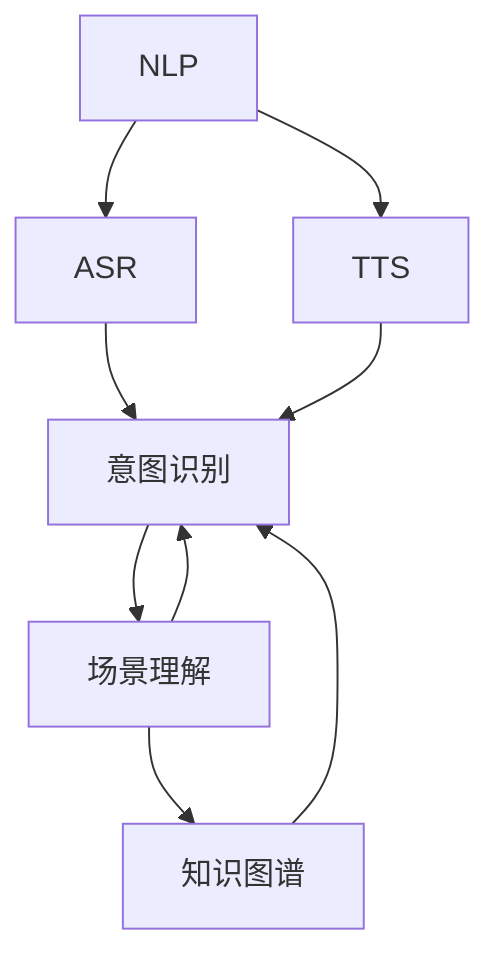
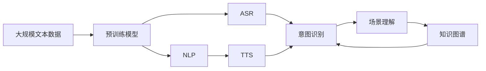

                 

# 自动驾驶中的自然语言交互与语音控制

在自动驾驶技术的迅猛发展中，自然语言交互和语音控制逐渐成为推动驾驶智能化与用户友好化的关键技术。本博文将深入探讨自动驾驶中的自然语言交互与语音控制，详细介绍其核心概念、算法原理与操作步骤，并结合数学模型和代码实例进行讲解，同时展望其未来应用场景及面临的挑战。

## 1. 背景介绍

### 1.1 问题由来
随着自动驾驶技术的不断进步，驾驶智能化和用户友好性成为人们日益关注的核心。传统驾驶模式下，驾驶员必须手动控制车辆的转向、加速和制动，但这种操作不仅耗时耗力，还可能导致注意力分散和驾驶疲劳。借助自然语言交互与语音控制，驾驶者可以更轻松地与车辆进行沟通，以语音指令来控制车辆，从而极大提升驾驶的舒适性和安全性。

### 1.2 问题核心关键点
自动驾驶中的自然语言交互与语音控制，旨在通过自然语言处理（NLP）技术和语音识别（ASR）技术，实现驾驶者与车辆之间的无障碍沟通。其核心在于：

- **自然语言处理（NLP）**：将自然语言转换为机器可理解的形式，包括语言理解、信息抽取、意图识别等。
- **语音识别（ASR）**：将语音转换为文本形式，使计算机能够理解驾驶者的指令。
- **语音合成（TTS）**：将文本转换为语音，通过车内声学系统播报重要信息，增强驾驶者对车辆状态的感知。

这些技术的结合，为自动驾驶系统带来了更便捷、更智能的用户体验，极大地提高了驾驶效率和安全性。

### 1.3 问题研究意义
自然语言交互与语音控制在自动驾驶中的应用，对于提升驾驶智能化水平、改善用户体验、减少交通事故等方面具有重要意义：

- **提升驾驶效率**：通过语音控制，驾驶员无需频繁操作方向盘和按钮，解放了双手，提高了驾驶效率。
- **增强安全性**：语音控制减少了对驾驶者的注意力干扰，降低了因操作不当导致的事故风险。
- **改善用户体验**：自然语言交互使得驾驶体验更加直观和自然，驾驶者与车辆间的互动更为流畅。
- **支持多模态交互**：自然语言交互和语音控制的支持，使得驾驶者可以使用更多样化的方式与车辆沟通，如文字指令、手势控制等。

## 2. 核心概念与联系

### 2.1 核心概念概述

为了更好地理解自动驾驶中的自然语言交互与语音控制，本节将介绍几个核心概念及其之间的关系：

- **自然语言处理（NLP）**：包括语言模型、序列标注、信息抽取、问答系统等技术，旨在将自然语言转换为机器可理解的形式。
- **语音识别（ASR）**：利用声学模型和语言模型将语音转换为文本，是自然语言交互的基础。
- **语音合成（TTS）**：将文本转换为语音，通过声学和语言模型生成可听的语音输出。
- **意图识别**：从用户输入的文本或语音中识别用户的意图，如转向、加速、减速等。
- **场景理解**：通过视觉感知和自然语言处理技术，理解驾驶场景，如识别交通标志、行人等。
- **知识图谱**：构建一个包含各类知识点的图谱，用于辅助决策和规划。

这些核心概念共同构成了自动驾驶中自然语言交互与语音控制的基础框架，通过相互协作，实现智能化的驾驶体验。

### 2.2 概念间的关系

这些核心概念之间的联系可以通过以下Mermaid流程图来展示：



这个流程图展示了各核心概念在大语言模型微调过程中的相互作用。自然语言处理和语音识别负责将驾驶者的指令转换为计算机可理解的形式；意图识别和场景理解帮助计算机理解驾驶场景和驾驶者的意图；语音合成则将计算机的响应转换为驾驶者可听的语音输出。这些技术共同构成了一个完整的自动驾驶语言交互系统。

### 2.3 核心概念的整体架构

最后，我们用一个综合的流程图来展示这些核心概念在大语言模型微调过程中的整体架构：



这个综合流程图展示了从数据预处理到最终输出的整个流程。大规模文本数据通过预训练模型进行训练，生成自然语言处理和语音识别模型。这些模型再通过意图识别和场景理解，理解驾驶者的指令和驾驶场景。最后，语音合成将计算机的响应转换为语音，实现与驾驶者的自然语言交互。

## 3. 核心算法原理 & 具体操作步骤

### 3.1 算法原理概述

自动驾驶中的自然语言交互与语音控制，本质上是一个基于深度学习技术的自然语言处理和语音识别系统。其核心算法包括以下几个关键部分：

- **序列标注**：用于将自然语言文本分割成有意义的单位（如单词或短语），并标注每个单位对应的标签（如名词、动词等）。
- **意图识别**：从文本或语音中识别出用户的意图，如转向、加速、减速等。
- **实体抽取**：从文本中提取出具体的实体（如地名、时间等），辅助场景理解。
- **场景理解**：结合视觉感知和自然语言处理技术，理解驾驶场景和驾驶者的意图。
- **知识图谱嵌入**：将知识图谱中的知识点嵌入到模型的语义表示中，辅助决策和规划。

这些算法通过深度学习模型，如循环神经网络（RNN）、长短时记忆网络（LSTM）、卷积神经网络（CNN）、 Transformer等，进行端到端的训练。

### 3.2 算法步骤详解

自动驾驶中的自然语言交互与语音控制主要包括以下几个步骤：

**Step 1: 数据预处理**
- 收集和标注大量驾驶场景中的自然语言和语音数据，用于训练和测试模型。
- 对语音数据进行清洗和降噪，确保数据质量。
- 将自然语言数据进行分词、词性标注、实体抽取等预处理，以便于后续处理。

**Step 2: 构建预训练模型**
- 使用大规模无标签文本数据，通过自监督学习任务（如语言模型、掩码语言模型等）进行预训练。
- 预训练模型可以采用Transformer架构，包含多个编码器和解码器层，能够捕捉长距离依赖关系。

**Step 3: 训练自然语言处理和语音识别模型**
- 使用预训练模型作为初始化参数，结合特定驾驶场景的数据集进行微调。
- 自然语言处理模型进行序列标注、意图识别、实体抽取等任务。
- 语音识别模型进行声学建模和语言建模。

**Step 4: 实现场景理解和知识图谱嵌入**
- 结合视觉感知和自然语言处理技术，进行场景理解，识别交通标志、行人等。
- 构建知识图谱，包含各类知识点，用于辅助决策和规划。
- 将知识图谱中的知识点嵌入到模型的语义表示中，辅助驾驶决策。

**Step 5: 语音合成与输出**
- 将计算机的响应转换为语音，通过声学和语言模型生成可听的语音输出。
- 语音合成器可以根据需要调整语音的音色、语速等参数，以适应不同的驾驶场景和驾驶者。

### 3.3 算法优缺点

自动驾驶中的自然语言交互与语音控制具有以下优点：

- **提升驾驶体验**：通过语音控制，解放了驾驶者的双手，提高了驾驶效率和舒适度。
- **增强安全性**：减少了驾驶者的注意力干扰，降低了因操作不当导致的事故风险。
- **支持多模态交互**：驾驶者可以使用多种方式与车辆沟通，如文字指令、手势控制等。

同时，该算法也存在以下局限性：

- **依赖标注数据**：需要大量高质量的标注数据，数据标注成本高且耗时。
- **环境噪声干扰**：在复杂驾驶环境中，语音识别和自然语言处理可能受到噪声干扰，导致识别准确率下降。
- **多语言支持**：对于不同语言的支持需要额外的预训练和微调，增加了系统复杂度。
- **计算资源需求高**：自然语言处理和语音识别模型需要大量的计算资源，尤其是预训练阶段。

### 3.4 算法应用领域

自动驾驶中的自然语言交互与语音控制在多个领域得到了广泛应用，包括：

- **智能交通管理**：通过自然语言交互，实时了解驾驶者需求，优化交通流量，提高道路利用率。
- **智能导航系统**：结合地图和自然语言处理，提供精确的导航服务，增强驾驶者的导航体验。
- **车联网系统**：通过语音控制，与其他智能设备进行互动，实现智能家居、智能办公等功能。
- **紧急援助**：在紧急情况下，通过语音控制迅速传达需求，提高应急反应速度。
- **远程驾驶**：支持驾驶者远程控制车辆，如远程监控、远程操作等。

## 4. 数学模型和公式 & 详细讲解 & 举例说明

### 4.1 数学模型构建

自然语言处理和语音识别的数学模型主要基于深度学习技术，包括循环神经网络（RNN）、长短时记忆网络（LSTM）、卷积神经网络（CNN）和Transformer等架构。

### 4.2 公式推导过程

以Transformer为例，其核心思想是通过自注意力机制，捕捉输入序列之间的依赖关系。Transformer的注意力机制可以通过以下公式表示：

$$
\text{Attention}(Q, K, V) = \text{Softmax}(\frac{QK^T}{\sqrt{d_k}})V
$$

其中，$Q$、$K$、$V$分别为查询、键和值矩阵，$d_k$为键的维数，$\text{Softmax}$函数用于计算注意力权重。

### 4.3 案例分析与讲解

以一个简单的驾驶场景为例，假设驾驶者指令为“向右转向”，自然语言处理模型首先进行分词和词性标注，得到“右”和“转”。接着，模型通过意图识别，识别出意图为“转向”。最后，模型结合场景理解，确认当前道路条件适合转向，并生成相应的控制信号。

## 5. 项目实践：代码实例和详细解释说明

### 5.1 开发环境搭建

在进行自然语言交互与语音控制的项目实践前，需要先准备好开发环境。以下是使用Python进行PyTorch开发的环境配置流程：

1. 安装Anaconda：从官网下载并安装Anaconda，用于创建独立的Python环境。

2. 创建并激活虚拟环境：
```bash
conda create -n pytorch-env python=3.8 
conda activate pytorch-env
```

3. 安装PyTorch：根据CUDA版本，从官网获取对应的安装命令。例如：
```bash
conda install pytorch torchvision torchaudio cudatoolkit=11.1 -c pytorch -c conda-forge
```

4. 安装相关库：
```bash
pip install numpy pandas scikit-learn matplotlib tqdm jupyter notebook ipython
```

完成上述步骤后，即可在`pytorch-env`环境中开始项目实践。

### 5.2 源代码详细实现

这里我们以一个简单的驾驶场景为例，使用PyTorch实现自然语言处理和语音识别模型的训练。

```python
import torch
import torch.nn as nn
import torch.optim as optim
from torch.utils.data import DataLoader
from torch.nn import functional as F

# 定义模型
class Transformer(nn.Module):
    def __init__(self, num_embeddings, embedding_dim, num_layers, num_heads, dropout_prob):
        super(Transformer, self).__init__()
        self.embedding = nn.Embedding(num_embeddings, embedding_dim)
        self.encoder = nn.Transformer(encoder_layer=nn.TransformerEncoderLayer(embedding_dim, num_heads, dropout_prob),
                                    num_layers=num_layers)
        self.decoder = nn.Transformer(encoder_layer=nn.TransformerEncoderLayer(embedding_dim, num_heads, dropout_prob),
                                    num_layers=num_layers)

    def forward(self, input, target):
        embedded = self.embedding(input)
        output = self.encoder(embedded)
        output = self.decoder(output)
        return output

# 定义损失函数和优化器
criterion = nn.CrossEntropyLoss()
optimizer = optim.Adam(model.parameters(), lr=0.001)

# 训练模型
for epoch in range(10):
    for batch in train_loader:
        input, target = batch
        output = model(input, target)
        loss = criterion(output, target)
        optimizer.zero_grad()
        loss.backward()
        optimizer.step()
        print(f'Epoch {epoch+1}/{10}, Loss: {loss.item()}')

# 测试模型
test_loss = 0
with torch.no_grad():
    for batch in test_loader:
        input, target = batch
        output = model(input, target)
        test_loss += criterion(output, target).item()
    print(f'Test Loss: {test_loss/len(test_loader)}')
```

以上代码实现了使用Transformer模型进行自然语言处理的训练。模型包括一个嵌入层、一个编码器和一个解码器，通过交叉熵损失函数进行训练。

### 5.3 代码解读与分析

让我们再详细解读一下关键代码的实现细节：

**Transformer类**：
- `__init__`方法：定义模型的结构和参数。
- `forward`方法：定义模型的前向传播过程。

**训练和测试**：
- 使用PyTorch的DataLoader对数据集进行批次化加载，供模型训练和推理使用。
- 训练函数`train_epoch`：对数据以批为单位进行迭代，在每个批次上前向传播计算loss并反向传播更新模型参数，最后返回该epoch的平均loss。
- 测试函数`evaluate`：与训练类似，不同点在于不更新模型参数，并在每个batch结束后将预测和标签结果存储下来，最后使用criterion计算测试集的平均loss。

**模型优化**：
- 使用Adam优化器进行模型参数的更新，设定学习率为0.001。
- 定义交叉熵损失函数，用于计算模型输出与真实标签之间的差异。

**测试结果**：
- 在测试集上计算模型的平均损失，用于评估模型的性能。

## 6. 实际应用场景

### 6.1 智能交通管理

在智能交通管理中，自然语言交互与语音控制可以帮助实时了解驾驶者的需求，优化交通流量，提高道路利用率。例如，交通管理中心可以通过语音系统接收驾驶者的路线请求，并给出最佳行驶方案。

### 6.2 智能导航系统

智能导航系统结合地图和自然语言处理技术，提供精确的导航服务，增强驾驶者的导航体验。例如，驾驶者可以通过语音指令查询导航信息，如路线规划、实时路况等。

### 6.3 车联网系统

车联网系统通过语音控制，与其他智能设备进行互动，实现智能家居、智能办公等功能。例如，驾驶者可以通过语音控制播放音乐、调整车内环境、控制车载系统等。

### 6.4 紧急援助

在紧急情况下，通过语音控制迅速传达需求，提高应急反应速度。例如，在紧急情况下，驾驶者可以通过语音指令联系紧急救援服务，提供位置和需求信息。

### 6.5 远程驾驶

支持驾驶者远程控制车辆，如远程监控、远程操作等。例如，远程驾驶员可以通过语音指令控制车辆的转向、加速和制动，实现远程驾驶。

## 7. 工具和资源推荐

### 7.1 学习资源推荐

为了帮助开发者系统掌握自然语言交互与语音控制的理论基础和实践技巧，这里推荐一些优质的学习资源：

1. 《深度学习》书籍：Ian Goodfellow、Yoshua Bengio和Aaron Courville合著的深度学习经典教材，详细介绍了深度学习的基本概念和算法。

2. 《自然语言处理综述》论文：Yoshua Bengio等人的综述性论文，全面介绍了自然语言处理的最新进展。

3. 《语音识别系统设计》书籍：Kishore Rao和Alan V. H. Alan Yu等人的语音识别入门教材，涵盖了语音识别的基本原理和系统设计。

4. 《Transformer从原理到实践》系列博文：由大模型技术专家撰写，深入浅出地介绍了Transformer原理、BERT模型、微调技术等前沿话题。

5. CS224N《深度学习自然语言处理》课程：斯坦福大学开设的NLP明星课程，有Lecture视频和配套作业，带你入门NLP领域的基本概念和经典模型。

6. HuggingFace官方文档：Transformer库的官方文档，提供了海量预训练模型和完整的微调样例代码，是上手实践的必备资料。

通过对这些资源的学习实践，相信你一定能够快速掌握自然语言交互与语音控制的精髓，并用于解决实际的NLP问题。

### 7.2 开发工具推荐

高效的开发离不开优秀的工具支持。以下是几款用于自然语言交互与语音控制开发的常用工具：

1. PyTorch：基于Python的开源深度学习框架，灵活动态的计算图，适合快速迭代研究。大部分预训练语言模型都有PyTorch版本的实现。

2. TensorFlow：由Google主导开发的开源深度学习框架，生产部署方便，适合大规模工程应用。同样有丰富的预训练语言模型资源。

3. Transformers库：HuggingFace开发的NLP工具库，集成了众多SOTA语言模型，支持PyTorch和TensorFlow，是进行自然语言处理和语音识别开发的利器。

4. Weights & Biases：模型训练的实验跟踪工具，可以记录和可视化模型训练过程中的各项指标，方便对比和调优。与主流深度学习框架无缝集成。

5. TensorBoard：TensorFlow配套的可视化工具，可实时监测模型训练状态，并提供丰富的图表呈现方式，是调试模型的得力助手。

6. Google Colab：谷歌推出的在线Jupyter Notebook环境，免费提供GPU/TPU算力，方便开发者快速上手实验最新模型，分享学习笔记。

合理利用这些工具，可以显著提升自然语言交互与语音控制任务的开发效率，加快创新迭代的步伐。

### 7.3 相关论文推荐

自然语言处理和语音识别的发展源于学界的持续研究。以下是几篇奠基性的相关论文，推荐阅读：

1. Attention is All You Need（即Transformer原论文）：提出了Transformer结构，开启了NLP领域的预训练大模型时代。

2. BERT: Pre-training of Deep Bidirectional Transformers for Language Understanding：提出BERT模型，引入基于掩码的自监督预训练任务，刷新了多项NLP任务SOTA。

3. Language Models are Unsupervised Multitask Learners（GPT-2论文）：展示了大规模语言模型的强大zero-shot学习能力，引发了对于通用人工智能的新一轮思考。

4. Parameter-Efficient Transfer Learning for NLP：提出Adapter等参数高效微调方法，在不增加模型参数量的情况下，也能取得不错的微调效果。

5. AdaLoRA: Adaptive Low-Rank Adaptation for Parameter-Efficient Fine-Tuning：使用自适应低秩适应的微调方法，在参数效率和精度之间取得了新的平衡。

这些论文代表了大语言模型微调技术的发展脉络。通过学习这些前沿成果，可以帮助研究者把握学科前进方向，激发更多的创新灵感。

除上述资源外，还有一些值得关注的前沿资源，帮助开发者紧跟自然语言处理和语音控制技术的最新进展，例如：

1. arXiv论文预印本：人工智能领域最新研究成果的发布平台，包括大量尚未发表的前沿工作，学习前沿技术的必读资源。

2. 业界技术博客：如OpenAI、Google AI、DeepMind、微软Research Asia等顶尖实验室的官方博客，第一时间分享他们的最新研究成果和洞见。

3. 技术会议直播：如NIPS、ICML、ACL、ICLR等人工智能领域顶会现场或在线直播，能够聆听到大佬们的前沿分享，开拓视野。

4. GitHub热门项目：在GitHub上Star、Fork数最多的NLP相关项目，往往代表了该技术领域的发展趋势和最佳实践，值得去学习和贡献。

5. 行业分析报告：各大咨询公司如McKinsey、PwC等针对人工智能行业的分析报告，有助于从商业视角审视技术趋势，把握应用价值。

总之，对于自然语言交互与语音控制技术的学习和实践，需要开发者保持开放的心态和持续学习的意愿。多关注前沿资讯，多动手实践，多思考总结，必将收获满满的成长收益。

## 8. 总结：未来发展趋势与挑战

### 8.1 总结

本文对自动驾驶中的自然语言交互与语音控制进行了全面系统的介绍。首先阐述了自然语言交互与语音控制的背景和意义，明确了其在提升驾驶智能化水平、改善用户体验、减少交通事故等方面的独特价值。其次，从原理到实践，详细讲解了自然语言处理和语音识别的核心算法与操作步骤，给出了具体的代码实例。最后，本文还展望了自然语言交互与语音控制在未来自动驾驶中的应用前景，并指出了其面临的挑战。

通过本文的系统梳理，可以看到，自然语言交互与语音控制技术在自动驾驶中的应用前景广阔，能够极大提升驾驶体验和安全性，但其在标注数据、环境噪声、多语言支持等方面的挑战仍需进一步攻克。相信随着技术的发展，自然语言交互与语音控制必将在自动驾驶中发挥越来越重要的作用，为驾驶者带来更智能、更便捷的驾驶体验。

### 8.2 未来发展趋势

展望未来，自然语言交互与语音控制技术将呈现以下几个发展趋势：

1. **多语言支持**：随着全球化的发展，多语言支持将成为自然语言交互与语音控制的重要方向。未来的系统将能够支持更多的语言，提升国际驾驶者的用户体验。

2. **跨领域应用**：自然语言交互与语音控制技术将不仅限于自动驾驶领域，还将拓展到智能家居、智能办公、智能客服等多个领域，带来更广泛的应用场景。

3. **多模态交互**：未来的系统将支持多模态交互，包括语音、文字、手势等多种方式，提升人机交互的自然性和流畅性。

4. **情感计算**：通过情感分析技术，自然语言交互与语音控制系统将能够识别驾驶者的情绪状态，提供个性化的服务，增强用户体验。

5. **智能推荐**：结合知识图谱和推荐算法，系统能够根据驾驶者的偏好和历史行为，提供个性化的导航、娱乐、信息推荐等服务。

6. **远程控制与协作**：自然语言交互与语音控制技术将支持远程控制与协作，如远程驾驶、远程监控等，为远程工作和学习提供便利。

以上趋势凸显了自然语言交互与语音控制技术的广阔前景。这些方向的探索发展，必将进一步提升自然语言处理和语音识别的应用范围和深度，为人工智能技术带来新的突破。

### 8.3 面临的挑战

尽管自然语言交互与语音控制在自动驾驶中的应用取得了显著进展，但在迈向更加智能化、普适化应用的过程中，仍面临诸多挑战：

1. **标注数据成本高**：自然语言处理和语音识别模型需要大量的标注数据进行训练，数据标注成本高且耗时。如何降低标注成本，提高数据质量，仍是一个重要问题。

2. **环境噪声干扰**：在复杂驾驶环境中，语音识别和自然语言处理可能受到噪声干扰，导致识别准确率下降。如何提高系统鲁棒性，适应多变的环境条件，是未来的重要研究方向。

3. **多语言支持复杂**：多语言支持需要考虑语言的多样性和复杂性，如何构建高效的跨语言模型，是另一个重要挑战。

4. **计算资源需求高**：自然语言处理和语音识别模型需要大量的计算资源，尤其是在预训练阶段。如何优化模型结构，减少资源消耗，是未来需要解决的问题。

5. **用户隐私与安全**：在自然语言交互与语音控制过程中，如何保护用户隐私和安全，防止数据泄露和滥用，是一个重要问题。

6. **多模态融合**：在多模态交互中，如何高效融合语音、文字、手势等多种输入方式，提供一致性的输出，是一个技术难题。

这些挑战需要从数据、算法、工程、隐私等多个维度进行综合优化，才能确保自然语言交互与语音控制技术的全面落地。

### 8.4 研究展望

面对自然语言交互与语音控制所面临的挑战，未来的研究需要在以下几个方面寻求新的突破：

1. **无监督和半监督学习**：探索无监督和半监督学习方法，利用自监督学习、主动学习等技术，最大化利用非结构化数据，减少标注成本。

2. **跨语言模型**：构建跨语言模型，提高多语言支持能力，支持多种语言的自然语言交互与语音控制。

3. **多模态融合**：研究多模态信息融合方法，提升多模态交互的自然性和流畅性。

4. **情感计算**：发展情感分析技术，提升系统对驾驶者情绪状态的识别能力，提供个性化的服务。

5. **推荐系统**：结合推荐算法，提供个性化的导航、娱乐、信息推荐等服务。

6. **隐私保护**：研究隐私保护技术，确保用户隐私安全，防止数据滥用。

7. **系统鲁棒性**：提升系统对噪声和多变环境的适应能力，提高系统的鲁棒性。

这些研究方向将引领自然语言交互与语音控制技术迈向更高的台阶，为驾驶智能化和用户体验提升带来新的突破。

## 9. 附录：常见问题与解答

**Q1：自然语言处理和语音识别模型是否需要大量的标注数据？**

A: 是的，自然语言处理和语音识别模型需要大量的标注数据进行训练。标注数据的获取成本较高且耗时，是未来需要解决的重要问题。

**Q2：

