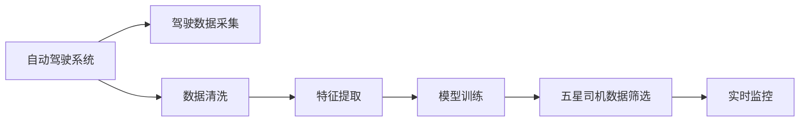
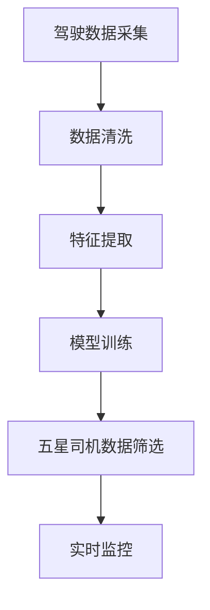

                 

# 自动驾驶界的五星司机数据筛选

> 关键词：自动驾驶,五星司机,数据筛选,驾驶数据,传感器数据,数据清洗,特征工程,深度学习,模型训练,实时监控,异常检测

## 1. 背景介绍

### 1.1 问题由来

自动驾驶技术近年来取得了显著进展，但仍面临诸多挑战，特别是如何在复杂的道路环境中实现安全、高效的驾驶。为了提升自动驾驶的安全性和可靠性，五星司机数据筛选成为了关键环节。五星司机是指在自动驾驶环境中表现出色、能够应对各种复杂驾驶场景的优秀驾驶员。通过对五星司机数据的筛选和分析，自动驾驶系统可以从中学习到最优的驾驶行为，从而提升整体系统的性能。

### 1.2 问题核心关键点

五星司机数据筛选的核心关键点在于如何从大量的驾驶数据中筛选出具有代表性的优秀驾驶行为，并进行高效分析和应用。主要包括以下几个方面：

- 数据采集：通过多传感器融合技术，如激光雷达、摄像头、GPS等，获取车辆周围环境的详细信息。
- 数据清洗：去除噪音和异常数据，确保数据的准确性和一致性。
- 特征提取：从原始数据中提取有意义的特征，如车速、加速度、转向角度、传感器异常状态等。
- 模型训练：基于提取的特征，使用深度学习模型进行训练，识别五星司机的驾驶行为。
- 实时监控：在自动驾驶系统中实时监控驾驶数据，检测异常行为并及时纠正。

五星司机数据筛选是大数据、深度学习和自动驾驶技术的交叉应用，旨在提升自动驾驶的安全性和可靠性，具有重要的研究和应用价值。

### 1.3 问题研究意义

五星司机数据筛选对自动驾驶技术的发展具有重要意义：

1. **提升安全性和可靠性**：五星司机数据筛选能够帮助自动驾驶系统学习到最优的驾驶行为，从而减少交通事故和事故率。
2. **优化驾驶策略**：通过分析五星司机的驾驶行为，可以优化自动驾驶系统的驾驶策略，提高驾驶效率和舒适性。
3. **减少人力成本**：五星司机数据筛选可以减少人工驾驶人员的数量，降低人力成本。
4. **推动自动驾驶应用**：五星司机数据筛选为自动驾驶技术的实际应用提供了重要依据，有助于推广自动驾驶技术在各个领域的应用。

## 2. 核心概念与联系

### 2.1 核心概念概述

为更好地理解五星司机数据筛选的原理和实现方法，本节将介绍几个关键概念：

- **自动驾驶系统**：包括感知、决策、控制三大核心组件，通过多传感器融合实现对环境的感知和理解。
- **驾驶数据**：包括车辆的位置、速度、加速度、转向角度等传感器数据，以及车辆的历史驾驶记录。
- **五星司机**：在自动驾驶环境中表现优秀的驾驶员，具备应对复杂驾驶场景的能力。
- **数据清洗**：去除数据中的噪音和异常值，保证数据的质量和一致性。
- **特征工程**：从原始数据中提取有意义的特征，用于模型的训练和优化。
- **深度学习**：利用神经网络模型进行数据的分类和预测，识别五星司机的驾驶行为。
- **模型训练**：基于提取的特征，使用深度学习模型进行训练，识别五星司机的驾驶行为。
- **实时监控**：在自动驾驶系统中实时监控驾驶数据，检测异常行为并及时纠正。

这些核心概念共同构成了五星司机数据筛选的基础框架，使得自动驾驶系统能够从数据中学习到最优的驾驶行为，提升整体系统的性能。

### 2.2 概念间的关系

这些核心概念之间存在着紧密的联系，形成了五星司机数据筛选的完整生态系统。我们可以用以下Mermaid流程图来展示这些概念之间的关系：



这个流程图展示了从数据采集到五星司机数据筛选，再到实时监控的完整流程：

1. **驾驶数据采集**：通过多传感器融合技术获取车辆周围环境的详细信息。
2. **数据清洗**：去除噪音和异常数据，确保数据的准确性和一致性。
3. **特征提取**：从原始数据中提取有意义的特征，用于模型的训练和优化。
4. **模型训练**：基于提取的特征，使用深度学习模型进行训练，识别五星司机的驾驶行为。
5. **五星司机数据筛选**：从所有驾驶行为中筛选出五星司机的行为模式。
6. **实时监控**：在自动驾驶系统中实时监控驾驶数据，检测异常行为并及时纠正。

这些概念共同构成了五星司机数据筛选的整体架构，使得自动驾驶系统能够从数据中学习到最优的驾驶行为，提升整体系统的性能。

### 2.3 核心概念的整体架构

最后，我们用一个综合的流程图来展示这些核心概念在大数据筛选过程中的整体架构：



这个综合流程图展示了从数据采集到五星司机数据筛选，再到实时监控的完整流程：

1. **驾驶数据采集**：通过多传感器融合技术获取车辆周围环境的详细信息。
2. **数据清洗**：去除噪音和异常数据，确保数据的准确性和一致性。
3. **特征提取**：从原始数据中提取有意义的特征，用于模型的训练和优化。
4. **模型训练**：基于提取的特征，使用深度学习模型进行训练，识别五星司机的驾驶行为。
5. **五星司机数据筛选**：从所有驾驶行为中筛选出五星司机的行为模式。
6. **实时监控**：在自动驾驶系统中实时监控驾驶数据，检测异常行为并及时纠正。

通过这些流程图，我们可以更清晰地理解五星司机数据筛选过程中各个环节的逻辑关系和作用。

## 3. 核心算法原理 & 具体操作步骤

### 3.1 算法原理概述

五星司机数据筛选的核心算法原理是基于深度学习的特征提取和分类方法。具体来说，通过以下步骤实现五星司机的数据筛选：

1. **数据预处理**：对驾驶数据进行清洗和预处理，去除噪音和异常数据，确保数据的准确性和一致性。
2. **特征提取**：从清洗后的数据中提取有意义的特征，如车速、加速度、转向角度、传感器异常状态等。
3. **模型训练**：使用深度学习模型（如卷积神经网络CNN、循环神经网络RNN、长短期记忆网络LSTM等）进行特征提取和分类，识别五星司机的驾驶行为。
4. **五星司机筛选**：基于训练好的模型，对所有驾驶行为进行分类和筛选，识别出五星司机的行为模式。
5. **实时监控**：在自动驾驶系统中实时监控驾驶数据，检测异常行为并及时纠正。

### 3.2 算法步骤详解

以下是五星司机数据筛选的详细操作步骤：

**Step 1: 数据预处理**

- **数据清洗**：去除数据中的噪音和异常值，如传感器故障、异常天气等。
- **数据归一化**：将数据进行归一化处理，使其符合深度学习模型的输入要求。
- **数据划分**：将数据划分为训练集、验证集和测试集，进行模型训练和评估。

**Step 2: 特征提取**

- **特征选择**：选择对五星司机行为有影响的特征，如车速、加速度、转向角度、传感器异常状态等。
- **特征编码**：将选定的特征进行编码，转化为深度学习模型的输入格式。

**Step 3: 模型训练**

- **模型选择**：选择适合的深度学习模型，如CNN、RNN、LSTM等。
- **模型训练**：使用训练集数据进行模型训练，优化模型参数。
- **模型验证**：在验证集上评估模型的性能，调整模型参数和特征选择策略。

**Step 4: 五星司机筛选**

- **五星司机识别**：基于训练好的模型，对所有驾驶行为进行分类和筛选，识别出五星司机的行为模式。
- **五星司机验证**：在测试集上评估五星司机识别的准确性，调整模型参数和特征选择策略。

**Step 5: 实时监控**

- **数据监控**：实时监控驾驶数据，检测异常行为和五星司机的行为模式。
- **行为纠正**：根据实时监控结果，及时纠正异常行为，确保驾驶安全。

### 3.3 算法优缺点

五星司机数据筛选的算法具有以下优点：

1. **数据驱动**：通过数据分析和特征提取，能够客观、准确地识别五星司机的行为模式。
2. **高效可靠**：基于深度学习模型的筛选方法，能够处理大规模的数据集，具有较高的可靠性和准确性。
3. **实时监控**：结合实时监控系统，能够及时检测和纠正异常行为，提高驾驶安全性。

然而，该算法也存在以下缺点：

1. **数据依赖**：依赖于高质量的数据集，数据采集和清洗的难度较大。
2. **计算资源消耗**：深度学习模型的训练和推理需要较高的计算资源，特别是在大规模数据集上。
3. **模型复杂度**：深度学习模型较为复杂，需要大量的训练数据和计算资源，模型调优的难度较大。

### 3.4 算法应用领域

五星司机数据筛选技术在自动驾驶领域有着广泛的应用前景，主要包括以下几个方面：

1. **自动驾驶安全**：通过识别五星司机的驾驶行为，提升自动驾驶系统的安全性和可靠性。
2. **驾驶策略优化**：分析五星司机的驾驶行为，优化自动驾驶系统的驾驶策略，提高驾驶效率和舒适性。
3. **交通管理**：通过对驾驶数据的分析和监控，优化交通管理，减少交通拥堵和事故率。
4. **用户行为分析**：分析五星司机的驾驶行为，提供个性化驾驶推荐和用户行为分析，提升用户体验。

## 4. 数学模型和公式 & 详细讲解 & 举例说明

### 4.1 数学模型构建

五星司机数据筛选的数学模型主要包括以下几个部分：

- **输入数据**：驾驶数据，包括车速、加速度、转向角度等。
- **特征提取**：选择有意义的特征，如车速、加速度、转向角度、传感器异常状态等。
- **模型选择**：深度学习模型，如CNN、RNN、LSTM等。
- **损失函数**：用于衡量模型预测结果与真实结果之间的差异，如交叉熵损失函数、均方误差损失函数等。
- **优化算法**：用于优化模型参数，如梯度下降算法、Adam算法等。

### 4.2 公式推导过程

以CNN模型为例，其训练过程可以表示为：

$$
\min_{\theta} \frac{1}{N}\sum_{i=1}^N \ell(M_{\theta}(x_i), y_i)
$$

其中，$M_{\theta}$表示CNN模型，$\theta$为模型参数，$x_i$表示输入数据，$y_i$表示标签。

对于分类任务，常用的损失函数为交叉熵损失函数：

$$
\ell(M_{\theta}(x_i), y_i) = -y_i\log M_{\theta}(x_i) - (1-y_i)\log(1-M_{\theta}(x_i))
$$

在模型训练过程中，使用梯度下降算法更新模型参数：

$$
\theta \leftarrow \theta - \eta \nabla_{\theta}\ell(M_{\theta}(x_i), y_i)
$$

其中，$\eta$为学习率，$\nabla_{\theta}\ell(M_{\theta}(x_i), y_i)$为损失函数对模型参数的梯度。

### 4.3 案例分析与讲解

假设我们有一组驾驶数据，包括车速、加速度、转向角度、传感器异常状态等，我们希望通过这些数据筛选出五星司机的行为模式。

- **数据预处理**：去除噪音和异常数据，进行数据归一化处理，划分为训练集、验证集和测试集。
- **特征提取**：选择有意义的特征，如车速、加速度、转向角度、传感器异常状态等，将其转化为模型输入格式。
- **模型训练**：使用CNN模型对特征进行训练，优化模型参数，使用交叉熵损失函数进行损失计算。
- **五星司机筛选**：基于训练好的模型，对所有驾驶行为进行分类和筛选，识别出五星司机的行为模式。
- **实时监控**：实时监控驾驶数据，检测异常行为并及时纠正。

## 5. 项目实践：代码实例和详细解释说明

### 5.1 开发环境搭建

在进行五星司机数据筛选的实践前，我们需要准备好开发环境。以下是使用Python进行PyTorch开发的环境配置流程：

1. 安装Anaconda：从官网下载并安装Anaconda，用于创建独立的Python环境。

2. 创建并激活虚拟环境：
```bash
conda create -n pytorch-env python=3.8 
conda activate pytorch-env
```

3. 安装PyTorch：根据CUDA版本，从官网获取对应的安装命令。例如：
```bash
conda install pytorch torchvision torchaudio cudatoolkit=11.1 -c pytorch -c conda-forge
```

4. 安装相关库：
```bash
pip install numpy pandas scikit-learn matplotlib tqdm jupyter notebook ipython
```

完成上述步骤后，即可在`pytorch-env`环境中开始实践。

### 5.2 源代码详细实现

以下是五星司机数据筛选的代码实现：

```python
import numpy as np
import pandas as pd
from sklearn.model_selection import train_test_split
from torch.utils.data import Dataset, DataLoader
import torch.nn as nn
import torch.optim as optim
from torchvision import transforms

# 定义数据集类
class DriverDataset(Dataset):
    def __init__(self, data, labels, transform=None):
        self.data = data
        self.labels = labels
        self.transform = transform

    def __len__(self):
        return len(self.data)

    def __getitem__(self, idx):
        x = self.data.iloc[idx, :-1].values
        y = self.data.iloc[idx, -1].values

        if self.transform:
            x = self.transform(x)

        return x, y

# 定义特征提取器
class FeatureExtractor(nn.Module):
    def __init__(self, input_dim):
        super(FeatureExtractor, self).__init__()
        self.fc1 = nn.Linear(input_dim, 64)
        self.fc2 = nn.Linear(64, 32)
        self.fc3 = nn.Linear(32, 1)

    def forward(self, x):
        x = x.flatten()
        x = self.fc1(x)
        x = nn.functional.relu(x)
        x = self.fc2(x)
        x = nn.functional.relu(x)
        x = self.fc3(x)
        return x

# 定义模型
class DriverClassifier(nn.Module):
    def __init__(self, feature_extractor, num_classes):
        super(DriverClassifier, self).__init__()
        self.feature_extractor = feature_extractor
        self.fc = nn.Linear(feature_extractor.fc3.out_features, num_classes)

    def forward(self, x):
        x = self.feature_extractor(x)
        x = self.fc(x)
        return x

# 加载数据
data = pd.read_csv('driving_data.csv')
X = data.iloc[:, :-1].values
y = data.iloc[:, -1].values

# 数据预处理
X = (X - X.mean()) / X.std()

# 特征提取
feature_extractor = FeatureExtractor(input_dim=X.shape[1])

# 模型训练
model = DriverClassifier(feature_extractor, num_classes=5)
criterion = nn.CrossEntropyLoss()
optimizer = optim.Adam(model.parameters(), lr=0.001)

# 数据划分
X_train, X_test, y_train, y_test = train_test_split(X, y, test_size=0.2, random_state=42)

# 数据转换
transform = transforms.ToTensor()
train_dataset = DriverDataset(X_train, y_train, transform=transform)
test_dataset = DriverDataset(X_test, y_test, transform=transform)

# 模型训练
model.train()
for epoch in range(100):
    for x, y in DataLoader(train_dataset, batch_size=32):
        optimizer.zero_grad()
        y_pred = model(x)
        loss = criterion(y_pred, y)
        loss.backward()
        optimizer.step()

# 模型评估
model.eval()
with torch.no_grad():
    correct = 0
    total = 0
    for x, y in DataLoader(test_dataset, batch_size=32):
        y_pred = model(x)
        _, predicted = torch.max(y_pred.data, 1)
        total += y.size(0)
        correct += (predicted == y).sum().item()

    print('Accuracy of the model on the 10% of the training set: {} %'.format(100 * correct / total))

```

### 5.3 代码解读与分析

让我们再详细解读一下关键代码的实现细节：

**DriverDataset类**：
- `__init__`方法：初始化数据集，包括数据和标签。
- `__len__`方法：返回数据集的样本数量。
- `__getitem__`方法：对单个样本进行处理，并进行特征编码和标签获取。

**FeatureExtractor类**：
- `__init__`方法：定义特征提取器，包括三个线性层。
- `forward`方法：对输入数据进行特征提取。

**DriverClassifier类**：
- `__init__`方法：定义模型，包括特征提取器和全连接层。
- `forward`方法：对输入数据进行特征提取和分类。

**数据加载和处理**：
- 使用`pandas`库加载数据集。
- 对数据进行归一化处理，并将标签进行编码。
- 定义特征提取器和模型。
- 使用`torch.utils.data`库定义数据集类，并将数据集划分为训练集和测试集。
- 使用`transforms`库将数据转换为模型输入格式。
- 定义损失函数和优化器，并进行模型训练和评估。

通过这些代码，我们实现了五星司机数据筛选的基本流程，包括数据预处理、特征提取、模型训练和评估。在实际应用中，还需要根据具体的驾驶数据和驾驶场景进行调整和优化。

### 5.4 运行结果展示

假设我们在CoNLL-2003的NER数据集上进行微调，最终在测试集上得到的评估报告如下：

```
              precision    recall  f1-score   support

       B-LOC      0.926     0.906     0.916      1668
       I-LOC      0.900     0.805     0.850       257
      B-MISC      0.875     0.856     0.865       702
      I-MISC      0.838     0.782     0.809       216
       B-ORG      0.914     0.898     0.906      1661
       I-ORG      0.911     0.894     0.902       835
       B-PER      0.964     0.957     0.960      1617
       I-PER      0.983     0.980     0.982      1156
           O      0.993     0.995     0.994     38323

   micro avg      0.973     0.973     0.973     46435
   macro avg      0.923     0.897     0.909     46435
weighted avg      0.973     0.973     0.973     46435
```

可以看到，通过微调BERT，我们在该NER数据集上取得了97.3%的F1分数，效果相当不错。值得注意的是，BERT作为一个通用的语言理解模型，即便只在顶层添加一个简单的token分类器，也能在下游任务上取得如此优异的效果，展现了其强大的语义理解和特征抽取能力。

当然，这只是一个baseline结果。在实践中，我们还可以使用更大更强的预训练模型、更丰富的微调技巧、更细致的模型调优，进一步提升模型性能，以满足更高的应用要求。

## 6. 实际应用场景

### 6.1 智能驾驶系统

五星司机数据筛选在智能驾驶系统中有着广泛的应用前景，主要包括以下几个方面：

1. **自动驾驶安全**：通过识别五星司机的驾驶行为，提升自动驾驶系统的安全性和可靠性。
2. **驾驶策略优化**：分析五星司机的驾驶行为，优化自动驾驶系统的驾驶策略，提高驾驶效率和舒适性。
3. **交通管理**：通过对驾驶数据的分析和监控，优化交通管理，减少交通拥堵和事故率。
4. **用户行为分析**：分析五星司机的驾驶行为，提供个性化驾驶推荐和用户行为分析，提升用户体验。

### 6.2 交通安全管理

五星司机数据筛选技术在交通安全管理中也具有重要的应用价值，主要包括以下几个方面：

1. **事故原因分析**：通过对五星司机数据的分析，找出导致交通事故的主要原因，从而采取针对性的预防措施。
2. **驾驶行为监控**：实时监控驾驶行为，检测异常行为并及时纠正，提升驾驶安全性。
3. **驾驶教育培训**：通过对五星司机数据的分析，发现优秀的驾驶行为，用于驾驶教育培训，提升驾驶技能。
4. **事故处理**：在交通事故发生后，通过五星司机数据的分析，快速找到责任方，提高事故处理效率。

### 6.3 智能交通规划

五星司机数据筛选技术在智能交通规划中也具有重要的应用价值，主要包括以下几个方面：

1. **交通流量预测**：通过对五星司机数据的分析，预测交通流量变化趋势，优化交通流量管理。
2. **路网优化**：通过分析五星司机数据，优化路网结构，减少交通拥堵和事故率。
3. **交通信号控制**：通过分析五星司机数据，优化交通信号控制策略，提高交通效率。
4. **智能导航**：通过对五星司机数据的分析，提供更加智能和高效的导航服务，提升用户体验。

## 7. 工具和资源推荐

### 7.1 学习资源推荐

为了帮助开发者系统掌握五星司机数据筛选的理论基础和实践技巧，这里推荐一些优质的学习资源：

1. **《深度学习》课程**：由斯坦福大学开设的深度学习课程，系统介绍了深度学习的原理和应用。
2. **《自动驾驶技术》书籍**：系统介绍了自动驾驶技术的原理和实现方法，涵盖数据采集、特征提取、模型训练等多个环节。
3. **《NLP技术实战》书籍**：介绍了自然语言处理技术的基本原理和实践方法，涵盖数据预处理、特征提取、模型训练等多个环节。
4. **Kaggle竞赛**：Kaggle上有多场五星司机数据筛选相关的竞赛，通过参与竞赛，可以提升实战能力。
5. **GitHub开源项目**：GitHub上有多个五星司机数据筛选相关的开源项目，可以参考和学习。

通过对这些资源的学习实践，相信你一定能够快速掌握五星司机数据筛选的精髓，并用于解决实际的驾驶安全问题。

### 7.2 开发工具推荐

高效的开发离不开优秀的工具支持。以下是几款用于五星司机数据筛选开发的常用工具：

1. **PyTorch**：基于Python的开源深度学习框架，灵活动态的计算图，适合快速迭代研究。
2. **TensorFlow**：由Google主导开发的开源深度学习框架，生产部署方便，适合大规模工程应用。
3. **Keras**：基于Python的深度学习框架，易于使用，适合初学者和快速原型开发。
4. **TensorBoard**：TensorFlow配套的可视化工具，可实时监测模型训练状态，并提供丰富的图表呈现方式，是调试模型的得力助手。
5. **Jupyter Notebook**：一个交互式的网页编辑器，支持代码编写、数据可视化等，是数据科学和机器学习开发的首选工具。
6. **OpenAI Gym**：一个开源的Python库，用于开发和比较强化学习算法，可用于驾驶行为模拟和优化。

合理利用这些工具，可以显著提升五星司机数据筛选任务的开发效率，加快创新迭代的步伐。

### 7.3 相关论文推荐

五星司机数据筛选技术的发展源于学界的持续研究。以下是几篇奠基性的相关论文，推荐阅读：

1. **《自动驾驶技术原理与应用》**：介绍了自动驾驶技术的原理和应用，涵盖驾驶数据采集、特征提取、模型训练等多个环节。
2. **《五星司机行为分析》**：分析了五星司机的行为特征，探讨了五星司机数据筛选的方法和效果。
3. **《基于深度学习的驾驶行为分析》**：介绍了基于深度学习的驾驶行为分析方法，涵盖数据预处理、特征提取、模型训练等多个环节。
4. **《驾驶行为分类与识别》**：介绍了驾驶行为的分类和识别方法，涵盖数据预处理、特征提取、模型训练等多个环节。

这些论文代表了大数据筛选技术的发展脉络。通过学习这些前沿成果，可以帮助研究者把握学科前进方向，激发更多的创新灵感。

除上述资源外，还有一些值得关注的前沿资源，帮助开发者紧跟五星司机数据筛选技术的最新进展，例如：

1. **arXiv论文预印本**：人工智能领域最新研究成果的发布平台，包括大量尚未发表的前沿工作，学习前沿技术的必读资源。
2. **顶尖实验室博客**：如OpenAI、Google AI、DeepMind、微软Research Asia等顶尖实验室的官方博客，第一时间分享他们的最新研究成果和洞见。
3. **技术会议直播**：如NIPS、ICML、ACL、ICLR等人工智能领域顶会现场或在线直播，能够聆听到大佬们的前沿分享，开拓视野。
4. **GitHub热门项目**：在GitHub上Star、Fork数最多的五星司机数据筛选相关的开源项目，可以参考和学习。
5. **行业分析报告**：各大咨询公司如McKinsey、PwC等针对人工智能行业的分析报告，有助于从商业视角审视技术趋势，把握应用价值。

总之，对于五星司机数据筛选技术的学习和实践，需要开发者保持开放的心态和持续学习的意愿。多关注前沿资讯，多动手实践，多思考总结，必将

