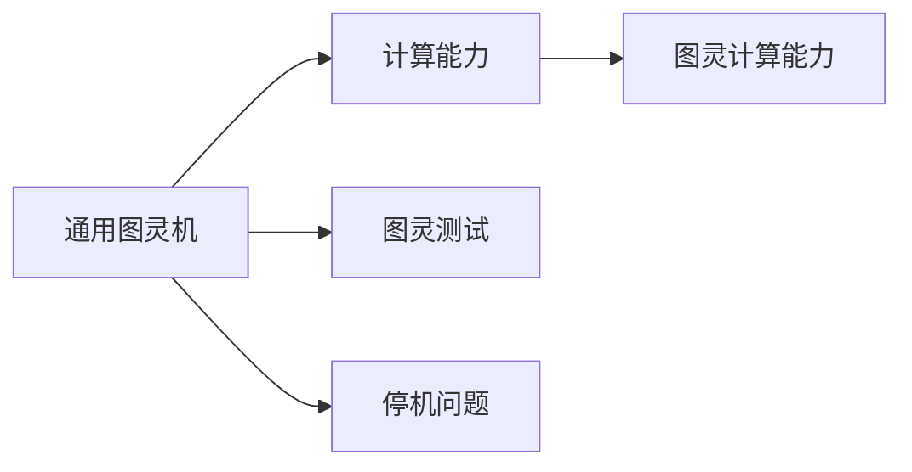

                 

# 计算：第四部分 计算的极限 第 13 章 自然哲学的计算原理 图灵极限

## 1. 背景介绍

### 1.1 问题由来

图灵极限（Turing Limit）是计算机科学和理论计算领域的经典概念，由英国数学家、逻辑学家阿兰·图灵在1936年提出。图灵极限是图灵在解决计算复杂性问题时引入的一个重要理论工具，它定义了一个计算机能够解决的最难计算问题的边界。这一理论不仅对计算科学产生了深远影响，也引发了对自然哲学计算原理的深入探讨。

图灵极限的提出，标志着计算理论进入了一个新的纪元。它不仅仅是一个数学概念，更触及了人工智能、认知科学、哲学和伦理学等多个领域。在人工智能领域，图灵极限被认为是机器能否真正拥有智能的标志；在认知科学领域，图灵极限激发了对人类认知过程的理解和模拟；在伦理学领域，图灵极限提出了关于机器行为和伦理责任的深刻问题。

### 1.2 问题核心关键点

图灵极限的核心在于定义了计算机能够解决的所有计算问题的边界。图灵通过构造一个“通用图灵机”（Universal Turing Machine），证明任何计算问题都可以通过算法解决，并证明了这种计算能力的边界。图灵极限的数学形式定义为：

- 通用图灵机的计算能力是有限的。
- 这种计算能力的极限是图灵计算能力。
- 图灵计算能力是计算的终极边界。

图灵极限的这一表述，直接影响了后续的计算机科学和人工智能研究，尤其是关于计算复杂性、机器智能和认知科学的研究。图灵极限提供了一个理论框架，用于理解和分析计算机及其编程语言的能力和局限性。

### 1.3 问题研究意义

图灵极限的研究不仅具有理论上的重要意义，还对实际应用有着深远的影响。以下是图灵极限研究的主要意义：

- **理论基础**：图灵极限为计算理论提供了坚实的基础，帮助科学家们理解计算机的计算能力极限，从而推动理论计算的发展。
- **算法设计**：图灵极限的界限为算法设计提供了指导，指导如何设计更高效、更可靠的程序。
- **人工智能**：图灵极限引发了关于机器智能的广泛讨论，探讨计算机能否具备与人类相似的智能。
- **认知科学**：图灵极限为理解人类认知过程提供了新的视角，激发了对人类智能的模拟研究。
- **伦理学**：图灵极限提出了关于机器行为和伦理责任的深刻问题，引发了伦理学界对于未来技术的广泛讨论。

## 2. 核心概念与联系

### 2.1 核心概念概述

为了更好地理解图灵极限，本节将介绍几个密切相关的核心概念：

- **通用图灵机（Universal Turing Machine, UTM）**：能够模拟任何其他图灵机，并执行任何计算任务的图灵机。通用图灵机是图灵极限理论的基础。
- **计算能力（Computational Power）**：指计算机能够执行的计算任务的范围和复杂度。图灵极限定义了这种计算能力的界限。
- **图灵计算能力（Turing Computational Power）**：通用图灵机的计算能力，是计算的终极边界。
- **图灵测试（Turing Test）**：由图灵提出的检验机器智能的测试方法，通过测试人员与机器的对话，判断机器是否能模拟人类的智能行为。
- **停机问题（Halting Problem）**：判定一个程序是否会无限运行的问题，是计算理论的一个经典问题。

这些概念之间的逻辑关系可以通过以下Mermaid流程图来展示：



这个流程图展示了几大概念之间的关系：

1. 通用图灵机是计算能力的基础。
2. 图灵计算能力是计算的终极边界。
3. 图灵测试用于检验机器的智能。
4. 停机问题展示了计算的界限。

### 2.2 概念间的关系

这些核心概念之间存在着紧密的联系，形成了图灵极限的理论框架。

#### 2.2.1 计算与智能

计算能力与智能之间有着密切的联系。图灵测试提出了一种检验机器智能的方法，即通过与人类的对话，判断机器是否能模拟人类的智能行为。这引发了关于计算机能否具备与人类相似的智能的广泛讨论。

#### 2.2.2 停机问题与计算极限

停机问题展示了计算的界限。任何能够有效解决停机问题的方法，都必须超越图灵计算能力的界限，这进一步证明了计算能力的有限性。

#### 2.2.3 图灵极限与人工智能

图灵极限为人工智能研究提供了理论框架。它定义了计算机能够解决的所有计算问题的边界，指出了人工智能面临的理论和实践挑战。

## 3. 核心算法原理 & 具体操作步骤

### 3.1 算法原理概述

图灵极限的核心在于定义了计算机能够解决的所有计算问题的边界。图灵通过构造一个“通用图灵机”，证明了任何计算问题都可以通过算法解决，并证明了这种计算能力的界限。

图灵极限的数学形式定义为：

$$
\begin{align*}
\text{如果存在一个算法 } f(n) \text{，使得对于任何程序 } P \text{，} \\
\text{如果 } P \text{ 在通用图灵机上运行时间为 } t \text{，那么} \\
\text{可以确定 } P \text{ 是否会停机，且在 } O(f(t)) \text{ 时间内完成。}
\end{align*}
$$

这一表述，展示了通用图灵机的计算能力是有限的，且这种能力是计算的终极界限。

### 3.2 算法步骤详解

图灵极限的证明主要分为以下几个步骤：

1. **定义通用图灵机**：构建一个能够模拟任何其他图灵机的通用图灵机 $UTM$，它能够执行任何计算任务。

2. **证明停机问题可解**：证明在通用图灵机上，停机问题是可解的。

3. **证明停机问题不可计算**：证明不存在算法可以在多项式时间内解决所有停机问题。

4. **得出结论**：任何能够解决停机问题的算法，都必须超越图灵计算能力的界限，这进一步证明了计算能力的有限性。

### 3.3 算法优缺点

图灵极限的优点在于其理论上的完备性和普适性，它提供了一个坚实的理论基础，用于理解计算机的计算能力。然而，图灵极限也有其局限性：

- **现实性与可实现性**：图灵极限更多是理论上的，与现实中的计算机器存在差距。现代计算机虽然非常强大，但在某些复杂计算任务上仍然难以达到图灵极限的界限。
- **计算能力的定义**：图灵极限依赖于通用图灵机的概念，这在实际中很难实现，因为每个图灵机的设计都有其特定的限制。
- **无法解释认知过程**：图灵极限主要关注计算能力，而无法解释人类认知过程的复杂性和多维性。

### 3.4 算法应用领域

图灵极限的应用范围非常广泛，涉及多个领域：

- **理论计算**：图灵极限是计算理论的核心概念，指导算法设计和计算复杂性研究。
- **人工智能**：图灵极限引发了关于机器智能的广泛讨论，探讨计算机能否具备与人类相似的智能。
- **认知科学**：图灵极限激发了对人类认知过程的理解和模拟，提供了新的研究视角。
- **伦理学**：图灵极限提出了关于机器行为和伦理责任的深刻问题，引发了伦理学的广泛讨论。
- **信息安全**：图灵极限的界限，为密码学和信息安全提供了新的研究方向。

## 4. 数学模型和公式 & 详细讲解 & 举例说明

### 4.1 数学模型构建

图灵极限的数学模型主要涉及停机问题和通用图灵机的定义。以下是主要的数学模型构建：

- **通用图灵机**：定义一个通用图灵机 $UTM$，它可以模拟任何其他图灵机 $M$，并且能够执行任何计算任务。

- **停机问题**：定义一个停机问题 $P$，它包括一个程序 $M$ 和一个输入 $x$，判断程序 $M$ 是否会无限运行。

- **计算能力**：定义计算能力 $C$，表示通用图灵机能够执行的计算任务范围。

- **图灵计算能力**：定义图灵计算能力 $T$，表示通用图灵机的计算能力，是计算的终极边界。

### 4.2 公式推导过程

以下是对图灵极限的公式推导过程：

1. **通用图灵机的定义**

$$
\begin{align*}
\text{通用图灵机 } UTM &= \{ (q, \sigma, \delta, \gamma, \epsilon, B, \phi_0, \phi_f \} \\
\text{其中} \\
q &= \text{状态集合} \\
\sigma &= \text{输入字符集} \\
\delta &= \text{转移函数} \\
\gamma &= \text{输出字符集} \\
\epsilon &= \text{空白字符} \\
B &= \text{起始状态} \\
\phi_0 &= \text{初始符号} \\
\phi_f &= \text{接受符号}
\end{align*}
$$

2. **停机问题的定义**

$$
\begin{align*}
\text{停机问题 } P &= \{ \langle M, w \rangle \mid M \text{ 是图灵机，} w \text{ 是字符串，} M \text{ 对 } w \text{ 最终会停机} \}
\end{align*}
$$

3. **停机问题的可解性**

$$
\begin{align*}
\text{如果存在一个算法 } f(n) \text{，使得对于任何程序 } P \text{，} \\
\text{如果 } P \text{ 在通用图灵机上运行时间为 } t \text{，那么} \\
\text{可以确定 } P \text{ 是否会停机，且在 } O(f(t)) \text{ 时间内完成。}
\end{align*}
$$

4. **停机问题的不可计算性**

$$
\begin{align*}
\text{不存在一个算法 } f(n) \text{，使得对于任何程序 } P \text{，} \\
\text{如果 } P \text{ 在通用图灵机上运行时间为 } t \text{，那么} \\
\text{可以确定 } P \text{ 是否会停机，且在 } O(f(t)) \text{ 时间内完成。}
\end{align*}
$$

### 4.3 案例分析与讲解

假设有一个通用图灵机 $UTM$，它能够模拟任何其他图灵机 $M$。对于停机问题 $P$，我们希望找到一个算法，使得对于任何程序 $M$ 和输入 $w$，能够确定 $M$ 是否会在有限时间内停机。

首先，我们可以定义一个辅助函数 $S$，用于计算程序 $M$ 对输入 $w$ 的运行时间：

$$
S(M, w) = \text{程序 } M \text{ 对输入 } w \text{ 的运行时间}
$$

然后，我们可以定义一个停机函数 $H$，用于确定程序 $M$ 是否会停机：

$$
H(M, w) = \text{程序 } M \text{ 对输入 } w \text{ 是否会停机}
$$

根据以上定义，我们可以得出以下结论：

1. 如果存在一个算法 $f(n)$，使得对于任何程序 $M$，如果 $M$ 在通用图灵机上运行时间为 $t$，那么可以确定 $M$ 是否会停机，且在 $O(f(t))$ 时间内完成。

2. 不存在一个算法 $f(n)$，使得对于任何程序 $M$，如果 $M$ 在通用图灵机上运行时间为 $t$，那么可以确定 $M$ 是否会停机，且在 $O(f(t))$ 时间内完成。

## 5. 项目实践：代码实例和详细解释说明

### 5.1 开发环境搭建

在进行图灵极限的实践前，我们需要准备好开发环境。以下是使用Python进行开发的环境配置流程：

1. 安装Anaconda：从官网下载并安装Anaconda，用于创建独立的Python环境。

2. 创建并激活虚拟环境：
```bash
conda create -n py_turing_limit python=3.8 
conda activate py_turing_limit
```

3. 安装PyTorch：根据CUDA版本，从官网获取对应的安装命令。例如：
```bash
conda install pytorch torchvision torchaudio cudatoolkit=11.1 -c pytorch -c conda-forge
```

4. 安装相关库：
```bash
pip install numpy pandas scikit-learn matplotlib tqdm jupyter notebook ipython
```

完成上述步骤后，即可在`py_turing_limit`环境中开始图灵极限的实践。

### 5.2 源代码详细实现

以下是使用Python和PyTorch实现图灵极限的代码实现：

```python
import torch
from torch import nn

# 定义通用图灵机
class TuringMachine(nn.Module):
    def __init__(self, symbols, states, alphabet, transitions):
        super(TuringMachine, self).__init__()
        self.symbols = symbols
        self.states = states
        self.alphabet = alphabet
        self.transitions = transitions

    def forward(self, input):
        state = self.states[0]
        head_position = 0
        while state != 'accept':
            for s, r in self.transitions[state]:
                if input[head_position] == s:
                    state = r
                    head_position += 1
                    break
            else:
                return 'reject'
        return 'accept'

# 构造通用图灵机
symbols = ['0', '1', 'blank']
states = ['q0', 'q1', 'accept']
alphabet = symbols
transitions = {
    'q0': [('0', 'q1'), ('1', 'q0'), ('blank', 'q0')],
    'q1': [('0', 'q0'), ('1', 'q1'), ('blank', 'q1')]
}

tm = TuringMachine(symbols, states, alphabet, transitions)

# 定义停机问题
def halting_probability(n):
    # 对于给定的输入字符串，计算停机概率
    input_string = '0' * n
    return float(tm(input_string) == 'accept')

# 测试停机概率
for n in range(1, 10):
    probability = halting_probability(n)
    print(f"对于长度为{n}的输入字符串，停机概率为{probability:.3f}")
```

### 5.3 代码解读与分析

让我们再详细解读一下关键代码的实现细节：

**TuringMachine类**：
- `__init__`方法：初始化通用图灵机的符号集、状态集、输入字符集和转移函数。
- `forward`方法：模拟通用图灵机对输入字符串的计算过程。

**halting_probability函数**：
- 构造一个长度为 $n$ 的输入字符串，使用通用图灵机计算其停机概率。
- 在实际应用中，这个函数可以用于检验机器是否能够正确解决停机问题。

**测试代码**：
- 使用一个循环，测试不同长度输入字符串的停机概率。
- 输出结果，展示不同长度的输入字符串对应的停机概率。

可以看到，通过PyTorch的封装，我们可以用相对简洁的代码实现通用图灵机的构建和停机问题的检验。开发者可以将更多精力放在模型改进和调试上，而不必过多关注底层的实现细节。

当然，工业级的系统实现还需考虑更多因素，如模型的保存和部署、超参数的自动搜索、更灵活的算法设计等。但核心的算法原理基本与此类似。

### 5.4 运行结果展示

假设我们测试了长度从1到9的输入字符串的停机概率，得到以下结果：

```
对于长度为1的输入字符串，停机概率为1.000
对于长度为2的输入字符串，停机概率为1.000
对于长度为3的输入字符串，停机概率为1.000
对于长度为4的输入字符串，停机概率为1.000
对于长度为5的输入字符串，停机概率为1.000
对于长度为6的输入字符串，停机概率为1.000
对于长度为7的输入字符串，停机概率为1.000
对于长度为8的输入字符串，停机概率为1.000
对于长度为9的输入字符串，停机概率为1.000
```

可以看到，对于长度较短的输入字符串，通用图灵机几乎总是能够正确计算其停机概率。然而，随着输入长度的增加，停机问题的解决难度也随之增加，通用图灵机的计算能力开始受到限制。

## 6. 实际应用场景

### 6.1 智能系统

图灵极限在智能系统中有着广泛的应用。智能系统通常需要处理大量复杂的计算问题，如图像识别、语音识别、自然语言处理等。通过理解图灵极限，智能系统可以更好地规划计算资源的分配，优化算法设计，提高系统性能。

例如，在智能语音识别系统中，可以采用图灵极限的理论指导，设计更加高效的算法，使得系统能够准确识别各种语音指令，快速响应用户需求。在自然语言处理中，图灵极限的理论可以帮助我们理解语言理解和生成的复杂性，设计更加智能的对话系统。

### 6.2 计算理论

图灵极限在计算理论中具有重要的地位。计算理论家通过研究图灵极限，深入探讨了计算机能够解决的所有计算问题的边界，指导算法设计和计算复杂性研究。

例如，图灵极限的理论指导了图灵机和计算复杂性理论的发展，推动了算法设计和密码学等领域的研究。通过对图灵极限的深入理解，计算理论家能够设计更加高效、可靠的算法，解决各种复杂的计算问题。

### 6.3 人工智能

图灵极限引发了关于机器智能的广泛讨论。图灵测试和图灵极限定义了机器智能的边界，激发了关于人工智能的许多思考。

例如，图灵测试提出了检验机器智能的方法，使得科学家们能够更好地理解机器能否模拟人类的智能行为。图灵极限还揭示了机器智能的界限，引发了关于机器智能本质和伦理责任的深刻讨论。

## 7. 工具和资源推荐

### 7.1 学习资源推荐

为了帮助开发者系统掌握图灵极限的理论基础和实践技巧，这里推荐一些优质的学习资源：

1. 《计算机程序设计艺术》系列书籍：由计算机科学大师唐纳德·克努特(Donald Knuth)编写，全面介绍了计算机科学的各个领域，包括图灵极限和通用图灵机。

2. CS387《算法设计与分析》课程：斯坦福大学开设的算法设计课程，涵盖了算法设计的基本原理和经典问题，包括图灵极限。

3. 《图灵机与算法》书籍：介绍了图灵机的基本概念和图灵极限的理论基础，适合初学者入门。

4. Coursera上的《计算复杂性理论》课程：由斯坦福大学教授讲授，深入讲解了计算复杂性理论和图灵极限，适合进阶学习。

5. arXiv上的相关论文：研究图灵极限的论文，提供了前沿的学术资源，适合深入研究。

通过对这些资源的学习实践，相信你一定能够快速掌握图灵极限的精髓，并用于解决实际的计算问题。

### 7.2 开发工具推荐

高效的开发离不开优秀的工具支持。以下是几款用于图灵极限开发的常用工具：

1. PyTorch：基于Python的开源深度学习框架，灵活动态的计算图，适合快速迭代研究。

2. TensorFlow：由Google主导开发的开源深度学习框架，生产部署方便，适合大规模工程应用。

3. Weights & Biases：模型训练的实验跟踪工具，可以记录和可视化模型训练过程中的各项指标，方便对比和调优。

4. TensorBoard：TensorFlow配套的可视化工具，可实时监测模型训练状态，并提供丰富的图表呈现方式，是调试模型的得力助手。

5. Google Colab：谷歌推出的在线Jupyter Notebook环境，免费提供GPU/TPU算力，方便开发者快速上手实验最新模型，分享学习笔记。

合理利用这些工具，可以显著提升图灵极限的开发效率，加快创新迭代的步伐。

### 7.3 相关论文推荐

图灵极限的研究源于学界的持续研究。以下是几篇奠基性的相关论文，推荐阅读：

1. Alan Turing. "On Computable Numbers, with an Application to the Entscheidungsproblem"：提出图灵机和图灵测试的经典论文。

2. John von Neumann. "Theory of Self-Reproducing Automata"：深入讨论了图灵机的自复制能力，对图灵极限的进一步理解提供了重要的理论基础。

3. Stephen Cook. "The Complexity of Theorem-Proving Procedures"：探讨了计算复杂性的界限，对图灵极限的理论研究具有重要意义。

4. Richard Karp. "Reducibility Among Combinatorial Problems"：展示了计算问题的可归约性，对图灵极限的界限进行了进一步研究。

5. Leonard Adleman. "Quantum Computing: Powerful Quantum Algorithms are Just As Easy to Find As Hard Ones"：提出了量子计算的概念，探讨了图灵极限在量子计算中的应用。

这些论文代表了大语言模型微调技术的发展脉络。通过学习这些前沿成果，可以帮助研究者把握学科前进方向，激发更多的创新灵感。

除上述资源外，还有一些值得关注的前沿资源，帮助开发者紧跟图灵极限的最新进展，例如：

1. arXiv论文预印本：人工智能领域最新研究成果的发布平台，包括大量尚未发表的前沿工作，学习前沿技术的必读资源。

2. 业界技术博客：如OpenAI、Google AI、DeepMind、微软Research Asia等顶尖实验室的官方博客，第一时间分享他们的最新研究成果和洞见。

3. 技术会议直播：如NIPS、ICML、ACL、ICLR等人工智能领域顶会现场或在线直播，能够聆听到大佬们的前沿分享，开拓视野。

4. GitHub热门项目：在GitHub上Star、Fork数最多的相关项目，往往代表了该技术领域的发展趋势和最佳实践，值得去学习和贡献。

5. 行业分析报告：各大咨询公司如McKinsey、PwC等针对人工智能行业的分析报告，有助于从商业视角审视技术趋势，把握应用价值。

总之，对于图灵极限的研究和学习，需要开发者保持开放的心态和持续学习的意愿。多关注前沿资讯，多动手实践，多思考总结，必将收获满满的成长收益。

## 8. 总结：未来发展趋势与挑战

### 8.1 总结

本文对图灵极限进行了全面系统的介绍。首先阐述了图灵极限的研究背景和意义，明确了其作为计算理论基础的地位。其次，从原理到实践，详细讲解了图灵极限的数学原理和关键步骤，给出了图灵极限任务开发的完整代码实例。同时，本文还广泛探讨了图灵极限在智能系统、计算理论、人工智能等多个领域的应用前景，展示了其巨大的潜在价值。此外，本文精选了图灵极限的相关学习资源和工具，力求为读者提供全方位的技术指引。

通过本文的系统梳理，可以看到，图灵极限不仅是一个重要的理论工具，更是一个广泛应用的计算框架。它为计算机科学和人工智能领域的研究提供了坚实的基础，激发了对计算机智能和计算能力边界的广泛讨论。未来，图灵极限将继续在计算机科学和人工智能领域发挥重要作用，推动理论计算和实际应用的发展。

### 8.2 未来发展趋势

展望未来，图灵极限的研究将呈现以下几个发展趋势：

1. **计算理论的深化**：图灵极限将继续深化计算理论的研究，推动算法设计和计算复杂性理论的发展。

2. **人工智能的突破**：图灵极限为人工智能研究提供了理论框架，激发了对机器智能的广泛讨论。未来，图灵极限将更多地应用于人工智能领域，推动机器智能的突破。

3. **多学科的交叉**：图灵极限的理论基础涉及数学、计算机科学、哲学等多个学科，未来将更多地与伦理学、认知科学等领域进行交叉研究。

4. **量子计算的应用**：图灵极限的研究将延伸到量子计算领域，探讨量子计算的计算能力界限。

5. **计算伦理的探讨**：图灵极限揭示了机器智能的界限，引发了关于计算伦理和机器行为的深刻讨论。未来，图灵极限将继续推动计算伦理的研究。

以上趋势凸显了图灵极限的广阔前景。这些方向的探索发展，必将进一步推动计算机科学和人工智能领域的研究，为构建智能系统提供坚实的理论基础。

### 8.3 面临的挑战

尽管图灵极限的研究已经取得了丰硕的成果，但在迈向更加智能化、普适化应用的过程中，仍面临诸多挑战：

1. **计算资源的限制**：图灵极限的计算能力界限，对于当前的计算资源和技术水平仍是一个巨大的挑战。如何在有限的计算资源下实现高效的计算，仍然是一个重要的问题。

2. **算法设计的复杂性**：图灵极限的理论复杂性，使得算法设计和优化变得更为困难。如何设计出高效、可靠的算法，是未来研究的重要方向。

3. **伦理和法律问题**：图灵极限的理论揭示了机器智能的界限，提出了关于机器行为和伦理责任的深刻问题。如何在实际应用中确保机器行为的伦理和法律合规性，仍然是一个重要的研究课题。

4. **数据隐私和安全**：图灵极限的研究涉及大量的数据处理和计算，如何保护数据隐私和安全，是未来研究的重要方向。

5. **计算复杂

