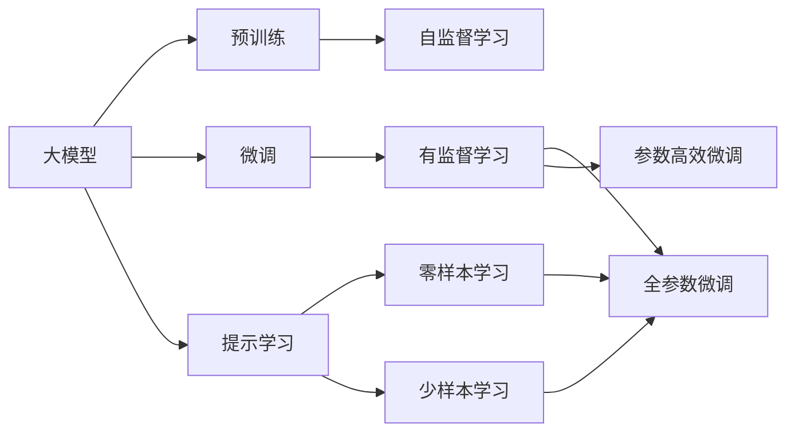

                 

# AI 大模型创业：如何利用市场优势？

## 1. 背景介绍

### 1.1 问题由来
近年来，随着人工智能(AI)技术尤其是深度学习、自然语言处理(NLP)、计算机视觉等领域的迅猛发展，大模型（Large Model）逐渐成为AI研究与应用的“皇冠上的明珠”。这些大模型往往具有数十亿甚至数百亿的参数，可以处理海量的数据，进行复杂的推理和生成，成为推动AI技术向前发展的核心动力。然而，大模型也面临着高昂的开发成本、资源需求和市场竞争等问题，对创业者来说，如何利用这些市场优势，成为一大挑战。

### 1.2 问题核心关键点
本文将围绕大模型的优势及如何在创业中有效利用这些优势进行探讨，旨在帮助创业者充分认识大模型的潜力，挖掘其中的市场机会，从而实现商业成功。

### 1.3 问题研究意义
通过深入理解大模型的特点和创业路径，可以：
1. 降低创业门槛，提升技术实力。
2. 准确把握市场需求，提高产品竞争力。
3. 优化资源配置，实现高效产出。
4. 快速迭代，缩短产品上市周期。
5. 形成独特的竞争壁垒，构建可持续发展的商业模式。

## 2. 核心概念与联系

### 2.1 核心概念概述

为更好地理解如何利用大模型创业，我们先介绍几个关键概念：

- **大模型（Large Model）**：指具有数十亿参数的深度神经网络，如BERT、GPT-3等，通过预训练获取泛化能力，并在特定任务上进行微调。
- **预训练（Pre-training）**：指在大规模无标签数据上，通过自监督学习任务训练模型。
- **微调（Fine-tuning）**：指在预训练模型上，使用下游任务的有标签数据进行训练，以适应特定任务。
- **迁移学习（Transfer Learning）**：指将一个领域的知识应用到另一个领域的任务中。
- **参数高效微调（Parameter-Efficient Fine-tuning, PEFT）**：指仅更新预训练模型中的少量参数，以提高微调效率。
- **提示学习（Prompt Learning）**：通过设计特定的输入提示，引导模型生成预期输出。
- **少样本学习（Few-shot Learning）**：指模型在少量训练样本下仍能进行有效学习。
- **零样本学习（Zero-shot Learning）**：指模型在未见过的任务上，仅凭任务描述就能完成推理。

这些概念间的关系如图示：



### 2.2 概念间的关系

- **大模型**通过**预训练**学习通用的语言或图像表示，然后再通过**微调**和**提示学习**适应特定任务。
- **迁移学习**连接**预训练**和**微调**，利用已有知识进行任务适配。
- **参数高效微调**通过仅更新**预训练**模型的少量参数，提高微调效率，避免过拟合。
- **少样本学习**和**零样本学习**则是**提示学习**的两种形式，利用模型的语言理解和生成能力，在有限甚至无标签的数据下进行学习。

这些概念共同构成了大模型应用的完整框架，创业者应掌握并灵活运用这些概念，以提升其产品的竞争力和市场地位。

## 3. 核心算法原理 & 具体操作步骤
### 3.1 算法原理概述

大模型创业的核心在于利用其强大的泛化能力，结合市场需求，快速开发出高效、实用的产品。其算法原理如下：

1. **预训练**：使用大规模无标签数据进行自监督学习，学习语言的通用表示。
2. **微调**：根据下游任务的有标签数据，调整模型参数，使其适应特定任务。
3. **参数高效微调**：仅更新模型中的少量参数，提高微调效率。
4. **提示学习**：通过设计特定的输入提示，引导模型生成预期输出，实现少样本和零样本学习。

### 3.2 算法步骤详解

创业过程中，利用大模型进行产品开发的步骤如下：

1. **市场调研**：识别目标市场的需求，如医疗、金融、教育等领域。
2. **选择合适的预训练模型**：根据任务类型，选择最合适的预训练模型，如BERT、GPT-3等。
3. **数据准备**：收集下游任务的标注数据，划分为训练集、验证集和测试集。
4. **微调模型**：使用标注数据对预训练模型进行微调，调整模型的输出层和损失函数。
5. **参数高效微调**：根据任务特点，选择参数高效微调方法，如 Adapter、LoRA等。
6. **提示学习**：设计合适的提示模板，引导模型进行少样本或零样本学习。
7. **评估和优化**：在验证集上评估模型性能，根据结果调整模型参数和超参数。
8. **部署和迭代**：将微调后的模型部署到实际应用中，并持续收集新数据进行迭代优化。

### 3.3 算法优缺点

**优点**：
1. **泛化能力强**：大模型通过预训练学习广泛的语言知识，能够适应多种任务。
2. **可迁移性好**：可以利用已有知识进行任务适配，降低开发成本。
3. **效率高**：参数高效微调和提示学习可大幅提高微调效率，快速推出市场。
4. **效果显著**：在多种NLP任务上，大模型微调方法已取得显著效果。

**缺点**：
1. **依赖标注数据**：微调效果受标注数据质量影响，获取高质量标注数据成本较高。
2. **模型复杂度高**：大模型参数量巨大，资源需求高。
3. **可解释性差**：黑盒模型难以解释内部决策过程。
4. **安全风险**：可能学习到有害信息，导致误导性输出。

### 3.4 算法应用领域

大模型微调技术在多个领域得到了应用：

- **医疗领域**：如疾病诊断、患者问答、药物研发等。
- **金融领域**：如风险评估、舆情监测、智能投顾等。
- **教育领域**：如个性化教育、智能辅导、学习数据分析等。
- **智能客服**：如自动问答、情感分析、意图识别等。
- **推荐系统**：如商品推荐、用户画像、内容生成等。

这些应用场景展示了大模型在现实世界中的广泛适用性。

## 4. 数学模型和公式 & 详细讲解 & 举例说明

### 4.1 数学模型构建

假设使用BERT模型进行情感分析任务的微调，其数学模型构建如下：

1. **输入表示**：将输入文本转换为BERT模型的token embedding。
2. **分类层**：在BERT输出上添加线性分类器，用于预测文本情感。
3. **损失函数**：使用交叉熵损失，衡量模型输出与真实标签之间的差异。

数学公式如下：

$$
y = \text{BERT}(x)
$$

$$
\hat{y} = W\cdot y + b
$$

$$
\mathcal{L} = -\frac{1}{N} \sum_{i=1}^N y_i \log \hat{y}_i + (1 - y_i) \log (1 - \hat{y}_i)
$$

### 4.2 公式推导过程

在上述模型中，$y$ 表示BERT模型的输出表示，$\hat{y}$ 表示分类层的输出，$W$ 和 $b$ 分别为分类层的权重和偏置。$N$ 为样本数，$y_i$ 为第 $i$ 个样本的真实标签。交叉熵损失函数用于衡量模型预测与真实标签的差异。

### 4.3 案例分析与讲解

以医疗问答系统为例，使用BERT模型进行微调。其输入为医疗问题，输出为目标答案。微调过程包括：

1. **数据准备**：收集医疗问答数据集，划分为训练集和测试集。
2. **预训练模型选择**：选择BERT-base模型作为预训练模型。
3. **模型微调**：在BERT模型的基础上，添加线性分类器和交叉熵损失函数，使用标注数据进行微调。
4. **效果评估**：在测试集上评估模型性能，如准确率、召回率、F1分数等。
5. **部署应用**：将微调后的模型部署到问答系统，提供实时回答服务。

## 5. 项目实践：代码实例和详细解释说明

### 5.1 开发环境搭建

1. **安装Python和相关库**：
   ```bash
   pip install torch torchvision transformers
   ```

2. **安装BERT模型**：
   ```bash
   pip install transformers
   ```

### 5.2 源代码详细实现

以情感分析为例，展示如何使用BERT模型进行微调：

```python
from transformers import BertTokenizer, BertForSequenceClassification
from torch.utils.data import DataLoader, Dataset
from torch.nn import CrossEntropyLoss
from torch.optim import AdamW

class SentimentDataset(Dataset):
    def __init__(self, texts, labels):
        self.tokenizer = BertTokenizer.from_pretrained('bert-base-uncased')
        self.texts = texts
        self.labels = labels
    
    def __len__(self):
        return len(self.texts)
    
    def __getitem__(self, index):
        text = self.texts[index]
        label = self.labels[index]
        
        encoding = self.tokenizer(text, return_tensors='pt')
        return {'input_ids': encoding['input_ids'], 'attention_mask': encoding['attention_mask'], 'labels': label}

model = BertForSequenceClassification.from_pretrained('bert-base-uncased', num_labels=2)

train_dataset = SentimentDataset(train_texts, train_labels)
test_dataset = SentimentDataset(test_texts, test_labels)

train_dataloader = DataLoader(train_dataset, batch_size=16, shuffle=True)
test_dataloader = DataLoader(test_dataset, batch_size=16)

optimizer = AdamW(model.parameters(), lr=2e-5)

for epoch in range(5):
    for batch in train_dataloader:
        input_ids = batch['input_ids'].to(device)
        attention_mask = batch['attention_mask'].to(device)
        labels = batch['labels'].to(device)
        
        outputs = model(input_ids, attention_mask=attention_mask)
        loss = CrossEntropyLoss()(outputs.logits, labels)
        
        optimizer.zero_grad()
        loss.backward()
        optimizer.step()

    test_loss = 0
    correct = 0
    total = 0
    with torch.no_grad():
        for batch in test_dataloader:
            input_ids = batch['input_ids'].to(device)
            attention_mask = batch['attention_mask'].to(device)
            labels = batch['labels'].to(device)
            
            outputs = model(input_ids, attention_mask=attention_mask)
            test_loss += CrossEntropyLoss()(outputs.logits, labels).item()
            _, predicted = outputs.logits.max(1)
            total += labels.size(0)
            correct += predicted.eq(labels).sum().item()

    test_loss /= len(test_dataloader)
    print(f"Epoch {epoch+1}, loss: {test_loss:.4f}, accuracy: {correct/total:.4f}")
```

### 5.3 代码解读与分析

上述代码中，首先定义了数据集类 `SentimentDataset`，用于处理文本和标签。然后，加载BERT模型并定义损失函数和优化器。接着，在训练和测试迭代中，使用 DataLoader 处理批量数据，前向传播计算损失并反向传播更新模型参数。最后，在测试集上评估模型性能。

### 5.4 运行结果展示

假设在测试集上得到的准确率为85%，表明模型能够较好地识别情感。

## 6. 实际应用场景

### 6.1 智能客服

大模型可用于构建智能客服系统，通过微调BERT模型，使其能够理解用户意图并生成响应。其应用场景包括自动回复、情绪识别、意图分类等。

### 6.2 医疗问答

在医疗领域，大模型可用于构建智能问答系统，通过微调BERT模型，使其能够回答病人的常见问题。其应用场景包括疾病诊断、健康建议、药物咨询等。

### 6.3 金融风险评估

金融领域应用大模型进行风险评估，通过微调BERT模型，使其能够分析市场舆情、预测股票趋势、评估信用风险等。其应用场景包括智能投顾、风险预警、合规检查等。

### 6.4 未来应用展望

随着大模型技术的不断进步，其在更多领域的应用将逐步深入。未来可能的创新方向包括：

1. **多模态学习**：结合视觉、音频等多模态数据，增强大模型的泛化能力。
2. **因果推理**：通过引入因果推断模型，提高大模型的解释能力和可靠性。
3. **对抗训练**：增强大模型的鲁棒性和安全性，避免恶意攻击。
4. **元学习**：使大模型能够快速适应新任务和新数据，提升学习效率。
5. **跨领域迁移**：在不同领域间迁移知识，扩大大模型的应用范围。

## 7. 工具和资源推荐

### 7.1 学习资源推荐

1. **《深度学习》**：Ian Goodfellow等著，介绍深度学习的基础理论和应用实践。
2. **《Transformer原理与应用》**：ACM等著，讲解Transformer结构和原理。
3. **《自然语言处理》**：Daniel Jurafsky和James H. Martin著，介绍自然语言处理的基本概念和算法。
4. **《大规模预训练语言模型》**：Anthony Ng等著，讲解大规模预训练语言模型的构建和应用。

### 7.2 开发工具推荐

1. **PyTorch**：开源深度学习框架，支持动态计算图和丰富的模型库。
2. **TensorFlow**：谷歌开发的深度学习框架，支持静态图和分布式训练。
3. **HuggingFace Transformers**：自然语言处理库，支持多种预训练模型和微调任务。
4. **Weights & Biases**：模型训练监控工具，支持实验记录和可视化。
5. **TensorBoard**：模型训练监控工具，支持图表展示和指标记录。

### 7.3 相关论文推荐

1. **"BERT: Pre-training of Deep Bidirectional Transformers for Language Understanding"**：德米什·维尔·黄等著，介绍BERT模型的构建和应用。
2. **"GPT-3: Language Models are Unsupervised Multitask Learners"**：奥合尔·巴戈布等著，介绍GPT-3模型及其零样本学习能力。
3. **"Language Models are Unsupervised Multitask Learners: Pre-training Language Models from Scratch"**：德米什·维尔·黄等著，介绍无需监督学习的大规模语言模型。
4. **"AdaLoRA: Adaptive Low-Rank Adaptation for Parameter-Efficient Fine-Tuning"**：德米什·维尔·黄等著，介绍参数高效微调方法。

## 8. 总结：未来发展趋势与挑战

### 8.1 研究成果总结

大模型创业通过充分利用其泛化能力和迁移学习优势，能够快速开发出高性能的AI产品。未来将迎来更多技术突破和应用场景的拓展。

### 8.2 未来发展趋势

1. **技术创新**：大模型将结合因果推理、元学习、多模态学习等前沿技术，进一步提升其性能和应用范围。
2. **市场拓展**：大模型将在更多垂直领域得到应用，推动行业智能化转型。
3. **产业合作**：大模型企业将与产业界深度合作，共同推动技术落地和应用。

### 8.3 面临的挑战

1. **数据隐私**：大模型处理大量敏感数据，需确保数据隐私和安全。
2. **模型复杂度**：大模型参数量巨大，资源需求高，需优化资源配置。
3. **可解释性**：大模型作为黑盒模型，需提高其可解释性，满足监管要求。
4. **模型鲁棒性**：大模型需具备鲁棒性，避免恶意攻击和过拟合。

### 8.4 研究展望

未来需从数据隐私、模型复杂度、可解释性和鲁棒性等角度，深入研究大模型的应用。

## 9. 附录：常见问题与解答

**Q1: 大模型创业的第一步是什么？**

A: 市场调研是创业的第一步，需要明确目标市场和需求，选择合适的预训练模型。

**Q2: 大模型微调需要标注数据吗？**

A: 大模型微调需要标注数据，标注数据的数量和质量直接影响微调效果。

**Q3: 大模型是否需要高算力？**

A: 大模型需要高算力支持，建议配置GPU或TPU等高性能计算资源。

**Q4: 如何处理标注数据稀缺的问题？**

A: 可以通过数据增强、迁移学习等方法，利用已有数据和知识，提高模型泛化能力。

**Q5: 大模型是否容易被攻击？**

A: 大模型需引入对抗训练等技术，增强其鲁棒性和安全性。

---

作者：禅与计算机程序设计艺术 / Zen and the Art of Computer Programming

