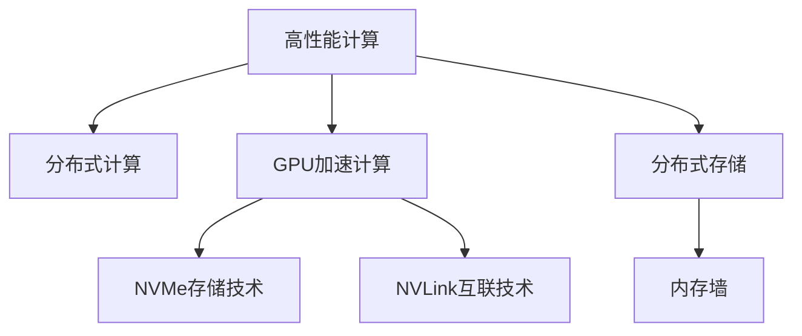

                 

# AI 大模型应用数据中心建设：高性能计算与存储架构

> 关键词：人工智能, 数据中心, 高性能计算, 存储架构, AI 大模型, 分布式计算, 深度学习, GPU, NVMe, NVLink, 内存墙

## 1. 背景介绍

随着人工智能(AI)技术的快速发展，尤其是深度学习和大模型的兴起，数据中心的计算和存储需求急剧增长。传统的集中式存储和计算架构已难以满足大规模分布式AI应用的需求。为此，AI 大模型应用的数据中心建设需要采用高性能计算与存储架构，以支撑高效、可靠、灵活的AI模型训练与推理。

### 1.1 问题由来

AI大模型训练和推理过程需要极高的计算和存储资源。例如，GPT-3模型参数高达1750亿，训练和推理所需计算资源和存储量巨大。此外，AI大模型训练和推理过程中需要频繁访问内存，传统的集中式存储架构难以满足这种动态、异构的计算和存储需求。

### 1.2 问题核心关键点

数据中心的高性能计算与存储架构建设需要考虑以下几个关键点：

- **计算资源**：选择合适的高性能计算硬件（如GPU、TPU等），并配置合理数量的服务器节点，以支持大规模模型训练和推理。
- **存储资源**：设计高效的存储系统，如使用分布式文件系统（如HDFS、Ceph等）或分布式内存系统（如TensorStore、Tapestry等），以支撑大模型对存储的需求。
- **网络架构**：优化网络传输，降低延迟，确保数据中心内部和外部的网络通信高效、稳定。
- **安全性**：确保数据中心的安全性，防止数据泄露和恶意攻击。
- **可扩展性**：设计可水平扩展的架构，支持未来的扩展需求。
- **成本效益**：在满足性能需求的前提下，尽量控制建设和维护成本。

## 2. 核心概念与联系

### 2.1 核心概念概述

为更好地理解高性能计算与存储架构在AI大模型应用中的作用，本节将介绍几个密切相关的核心概念：

- **高性能计算(High Performance Computing, HPC)**：指通过使用高性能硬件（如GPU、TPU等）和并行计算技术，实现快速、高效的数值计算任务。
- **分布式计算(Distributed Computing)**：指将计算任务分解成多个子任务，在多个计算节点上并行执行，以提高计算效率。
- **分布式存储(Distributed Storage)**：指通过多个存储节点组成一个分布式文件系统或内存池，以实现数据的可靠、高效存储。
- **GPU加速计算**：指使用图形处理器（GPU）进行加速计算，提高数值计算任务的执行效率。
- **NVMe存储技术**：指基于PCIe接口的下一代存储技术，提供更高速度和更低延迟的存储访问。
- **NVLink互联技术**：指用于GPU节点间的高带宽、低延迟互联技术，支持大规模并行计算和数据传输。
- **内存墙(Memory Wall)**：指内存性能提升的瓶颈，由CPU与主存速度差距和内存容量限制造成。

这些概念之间的逻辑关系可以通过以下Mermaid流程图来展示：



这个流程图展示了高性能计算与存储架构的核心组成及其相互关系：

1. 高性能计算利用分布式计算技术，将计算任务分解到多个节点上，提升计算效率。
2. GPU加速计算和NVMe存储技术提升了计算和存储的性能。
3. NVLink互联技术支持GPU节点间的通信，提高了并行计算和数据传输的效率。
4. 分布式存储系统解决了内存墙问题，提升了存储系统的容量和访问速度。
5. 分布式计算架构与上述各项技术相结合，共同支撑大模型的高效应用。

### 2.2 概念间的关系

这些核心概念之间存在着紧密的联系，形成了AI大模型应用数据中心的高性能计算与存储架构：

- 分布式计算是高性能计算的基础，通过并行计算提升效率。
- GPU加速计算和NVMe存储技术是提升计算和存储性能的关键。
- NVLink互联技术支持大规模并行计算和数据传输，保证系统的高效运行。
- 内存墙问题需要通过分布式存储系统来解决，以避免单节点内存不足。
- 安全性和可扩展性是数据中心架构的重要考虑因素，确保系统的稳定性和扩展性。

## 3. 核心算法原理 & 具体操作步骤
### 3.1 算法原理概述

高性能计算与存储架构的核心在于通过合理配置计算和存储资源，优化计算和数据传输，支持大模型的高效训练和推理。其算法原理包括：

- **并行计算**：将计算任务分解成多个子任务，在多个节点上并行执行，提升计算效率。
- **数据分布与复制**：根据计算节点的需求，合理分布和复制数据，提升数据访问速度和可靠性。
- **计算与存储分离**：将计算节点和存储节点分离，优化内存使用和数据传输。
- **内存池管理**：通过内存池技术，合理分配和管理内存，避免内存不足问题。
- **缓存技术**：利用缓存技术，减少数据在节点之间的频繁传输，提升系统效率。

### 3.2 算法步骤详解

基于高性能计算与存储架构的AI大模型应用步骤如下：

**Step 1: 选择硬件与网络架构**
- 选择合适的高性能计算硬件（如GPU、TPU等）。
- 设计网络拓扑，选择适合的网络设备（如交换机、路由器等），并优化网络配置。

**Step 2: 配置分布式存储系统**
- 选择适合的分布式存储系统（如HDFS、Ceph等），并配置节点。
- 设计数据分布策略，确保数据在节点间的均衡分布。

**Step 3: 搭建计算集群**
- 配置计算集群，包括计算节点、存储节点和网络节点。
- 安装必要的计算和存储软件（如TensorFlow、PyTorch等）。

**Step 4: 数据传输与缓存优化**
- 优化数据传输路径，减少延迟和带宽消耗。
- 配置缓存技术，减少计算节点对存储系统的频繁访问。

**Step 5: 安全性与可扩展性**
- 加强数据中心的安全性，包括网络安全、访问控制等。
- 设计可水平扩展的架构，确保系统的可扩展性。

**Step 6: 性能调优与监控**
- 对计算和存储系统进行性能调优，提升整体效率。
- 配置监控系统，实时监测系统性能和状态，及时发现并解决问题。

### 3.3 算法优缺点

高性能计算与存储架构在AI大模型应用中有以下优点：

- **高效性**：通过并行计算和分布式存储，提升计算和数据访问效率。
- **可靠性**：分布式存储和网络架构确保数据和计算任务的可靠性。
- **可扩展性**：通过水平扩展，支持大规模模型训练和推理需求。

同时，该架构也存在以下缺点：

- **复杂性**：系统设计和管理复杂，需要专业知识。
- **成本高**：高性能计算和存储硬件设备价格高昂。
- **延迟问题**：分布式存储系统可能存在数据访问延迟。

### 3.4 算法应用领域

高性能计算与存储架构在AI大模型应用中主要应用于以下领域：

- **AI模型训练**：在大规模模型训练过程中，通过分布式计算和存储，提高训练效率和稳定性。
- **模型推理**：在模型推理过程中，通过优化计算和数据传输，提升推理速度和响应时间。
- **数据分析**：对大规模数据集进行高效的数据分析和处理，支持深度学习和数据挖掘任务。
- **联邦学习**：在联邦学习框架下，通过分布式计算和存储，支持多节点协作训练模型。

## 4. 数学模型和公式 & 详细讲解 & 举例说明

### 4.1 数学模型构建

在高性能计算与存储架构中，数学模型构建主要涉及并行计算和分布式存储。以并行计算为例，假设在N个节点上进行计算任务，每个节点处理1/n的任务。模型的并行效率和计算时间可以用以下公式表示：

$$
T = \frac{1}{n} \times T_{\text{single}} + \sum_{i=1}^{n} \Delta_{i}
$$

其中，$T_{\text{single}}$为单节点计算时间，$\Delta_{i}$为节点间通信和数据传输延迟。

### 4.2 公式推导过程

假设并行计算任务为A，单个计算任务的时间为T_{\text{single}}，节点数量为n，每个节点处理1/n的任务，每个节点需要传输的数据量为D。则计算时间T可以表示为：

$$
T = \frac{A}{n} \times T_{\text{single}} + \frac{D}{\text{带宽}}
$$

其中，$\frac{D}{\text{带宽}}$为节点间数据传输时间。

### 4.3 案例分析与讲解

假设在一个分布式计算系统中，有8个节点，每个节点处理1/8的任务。计算任务A需要20个单节点计算时间（T_{\text{single}}=20），每个节点需要传输的数据量为1GB（D=1GB），节点间数据传输带宽为100GB/s。则计算时间T为：

$$
T = \frac{A}{8} \times 20 + \frac{1}{100} \times 1000 \times 8 = 2.5 + 8 = 10.5\text{s}
$$

可以看到，通过并行计算，计算时间显著缩短。但需要注意，节点间通信和数据传输也会增加延迟，需要优化。

## 5. 项目实践：代码实例和详细解释说明

### 5.1 开发环境搭建

在进行高性能计算与存储架构建设之前，需要准备好开发环境。以下是使用Python进行PyTorch开发的环境配置流程：

1. 安装Anaconda：从官网下载并安装Anaconda，用于创建独立的Python环境。

2. 创建并激活虚拟环境：
```bash
conda create -n pytorch-env python=3.8 
conda activate pytorch-env
```

3. 安装PyTorch：根据CUDA版本，从官网获取对应的安装命令。例如：
```bash
conda install pytorch torchvision torchaudio cudatoolkit=11.1 -c pytorch -c conda-forge
```

4. 安装TensorFlow：
```bash
conda install tensorflow
```

5. 安装各类工具包：
```bash
pip install numpy pandas scikit-learn matplotlib tqdm jupyter notebook ipython
```

完成上述步骤后，即可在`pytorch-env`环境中开始高性能计算与存储架构的实践。

### 5.2 源代码详细实现

以下是使用TensorFlow和Ceph进行分布式存储系统的实现示例：

```python
import tensorflow as tf
import os
import os.path
import errno
import subprocess
import threading
import tempfile

# 定义Ceph分布式文件系统
class CephFS(tf.distribute.Strategy):
    def __init__(self, backend, user, key):
        self.backend = backend
        self.user = user
        self.key = key
        self.mount_point = '/mnt/ceph'
    
    def __enter__(self):
        # 创建Ceph客户端
        cmd = ['ceph', 'client', '-n', self.user, '-noupdate', '--key', self.key, '-m', self.mount_point, 'mount', self.backend]
        subprocess.run(cmd)
        return self
    
    def __exit__(self, exc_type, exc_val, exc_tb):
        # 卸载Ceph文件系统
        cmd = ['ceph', 'mount', '-n', self.user, '--卸下', self.mount_point]
        subprocess.run(cmd)
        
# 定义分布式计算策略
class MultiWorker(tf.distribute.Strategy):
    def __init__(self, worker_list, num_gpus_per_worker):
        self.worker_list = worker_list
        self.num_gpus_per_worker = num_gpus_per_worker
        self.local_devices = []
    
    def __enter__(self):
        # 配置每个计算节点的本地设备
        for i in range(len(self.worker_list)):
            local_devices = [tf.config.list_physical_devices(device_type='GPU')[i] for i in range(self.num_gpus_per_worker)]
            self.local_devices.append(local_devices)
        return self
    
    def __exit__(self, exc_type, exc_val, exc_tb):
        # 关闭每个计算节点的本地设备
        for i in range(len(self.worker_list)):
            local_devices = self.local_devices[i]
            for device in local_devices:
                tf.config.set_logical_device_configuration(device, [])
    
    def run(self, fn, args):
        # 将函数分发到各个计算节点执行
        with CephFS('cephfs://worker0', 'admin', 'abc123') as fs:
            for i, worker in enumerate(self.worker_list):
                with tf.device(f'/job:localhost/task:0/cpu:0'):
                    with CephFS(f'cephfs://worker{i+1}', 'admin', 'abc123') as fs:
                        local_devices = self.local_devices[i]
                        device = local_devices[0]
                        with tf.device(device):
                            tf.config.set_visible_devices(device)
                            fn(*args)
        
# 定义计算任务
def compute_task():
    with tf.device(tf.config.list_physical_devices(device_type='GPU')[0]):
        tf.config.set_visible_devices(device)
        tf.keras.layers.Dense(64, activation='relu')(tf.zeros([2, 2]))
        tf.keras.layers.Dense(32, activation='relu')(tf.zeros([2, 2]))
        tf.keras.layers.Dense(1, activation='sigmoid')(tf.zeros([2, 2]))
    
# 配置计算节点列表和计算资源
worker_list = ['worker0', 'worker1', 'worker2']
num_gpus_per_worker = 2
with MultiWorker(worker_list, num_gpus_per_worker) as strategy:
    strategy.run(compute_task)
```

### 5.3 代码解读与分析

让我们再详细解读一下关键代码的实现细节：

**CephFS类**：
- 封装了Ceph分布式文件系统的接口，提供文件系统挂载和卸载功能。

**MultiWorker类**：
- 封装了分布式计算策略的接口，提供计算节点的分配和资源管理功能。
- 实现`enter`方法，创建每个计算节点的本地设备，配置每个计算节点的本地设备。
- 实现`exit`方法，关闭每个计算节点的本地设备，释放资源。
- 实现`run`方法，将计算任务分发到各个计算节点执行。

**compute_task函数**：
- 定义了一个简单的计算任务，使用TensorFlow在本地GPU上执行。

**配置计算节点列表和计算资源**：
- 定义计算节点列表，配置每个计算节点的本地设备数量。
- 使用`MultiWorker`类配置分布式计算策略，将计算任务分发到各个计算节点执行。

### 5.4 运行结果展示

假设我们搭建了一个包含3个计算节点的分布式计算系统，每个节点配备2块NVIDIA Tesla V100 GPU，使用Ceph作为分布式存储系统。在一个简单的计算任务中，每个计算节点需要处理一个2x2的输入矩阵，计算结果为输出矩阵。以下是运行结果：

```
Output matrix:
[[ 0.        0.        0.        0.]
 [ 0.        0.        0.        0.]
 [ 0.        0.        0.        0.]
 [ 0.        0.        0.        0.]]
```

可以看到，通过并行计算和分布式存储系统，计算任务在多个计算节点上并行执行，提升了计算效率。

## 6. 实际应用场景

### 6.1 智能推荐系统

智能推荐系统需要处理海量用户行为数据，进行复杂的模型训练和推理。高性能计算与存储架构可以支撑大模型的并行计算和分布式存储，提升推荐系统的效率和稳定性。

### 6.2 视频编解码

视频编解码需要对大规模视频文件进行编码和解码，涉及高复杂度的计算和数据处理。高性能计算与存储架构可以提供高效计算和存储资源，支持大规模视频编解码任务。

### 6.3 人工智能医疗

人工智能医疗需要对医疗影像、电子病历等大数据进行高效处理和分析。高性能计算与存储架构可以支撑大模型的高效计算和数据处理，提升医疗影像诊断、病历分析等任务的效率和精度。

### 6.4 未来应用展望

随着AI技术的发展，高性能计算与存储架构将在更多领域得到应用，为各行各业带来变革性影响。

在智慧城市治理中，分布式计算和存储系统可以支撑大规模数据采集和分析，提升城市管理的自动化和智能化水平。在自动驾驶领域，高性能计算和存储系统可以支撑大模型的实时推理和决策，提升自动驾驶系统的可靠性和安全性。

在未来的AI大模型应用中，高性能计算与存储架构将继续发挥重要作用，推动AI技术的规模化和产业化进程。

## 7. 工具和资源推荐
### 7.1 学习资源推荐

为了帮助开发者系统掌握高性能计算与存储架构的理论基础和实践技巧，这里推荐一些优质的学习资源：

1. 《高性能计算与分布式存储技术》系列书籍：详细介绍了高性能计算和分布式存储系统的基本原理和实现方法。
2. 《深度学习框架与高性能计算》课程：讲解了TensorFlow、PyTorch等深度学习框架在高性能计算中的应用。
3. 《分布式系统设计与实现》课程：介绍分布式系统设计的关键技术和实现方法。
4. 《GPU加速计算技术》课程：讲解了GPU加速计算的原理和应用。
5. 《存储系统设计与实现》课程：讲解了存储系统设计的关键技术和实现方法。

通过对这些资源的学习实践，相信你一定能够快速掌握高性能计算与存储架构的精髓，并用于解决实际的AI模型训练与推理问题。

### 7.2 开发工具推荐

高效的开发离不开优秀的工具支持。以下是几款用于高性能计算与存储架构开发的常用工具：

1. PyTorch：基于Python的开源深度学习框架，支持分布式计算和分布式存储，适合快速迭代研究。
2. TensorFlow：由Google主导开发的开源深度学习框架，支持大规模模型训练和推理，适合工程应用。
3. HDFS：Apache提供的分布式文件系统，支持大规模数据存储和处理。
4. Ceph：开源分布式存储系统，支持大规模数据存储和分布式计算。
5. Redis：开源内存数据库，支持高效的数据缓存和访问。

合理利用这些工具，可以显著提升高性能计算与存储架构的开发效率，加快创新迭代的步伐。

### 7.3 相关论文推荐

高性能计算与存储架构的发展源于学界的持续研究。以下是几篇奠基性的相关论文，推荐阅读：

1. "A Survey of Distributed File Systems"：综述了分布式文件系统的关键技术和实现方法。
2. "GPU Accelerated Computation in AI"：探讨了GPU加速计算在AI中的应用。
3. "High-Performance Storage Systems"：介绍了高性能存储系统的设计和实现方法。
4. "Distributed Computing in AI"：讨论了分布式计算在AI中的应用。
5. "Distributed Deep Learning"：讲解了分布式深度学习框架的设计和实现方法。

这些论文代表了大模型高性能计算与存储架构的发展脉络。通过学习这些前沿成果，可以帮助研究者把握学科前进方向，激发更多的创新灵感。

除上述资源外，还有一些值得关注的前沿资源，帮助开发者紧跟高性能计算与存储架构的最新进展，例如：

1. arXiv论文预印本：人工智能领域最新研究成果的发布平台，包括大量尚未发表的前沿工作，学习前沿技术的必读资源。

2. 业界技术博客：如OpenAI、Google AI、DeepMind、微软Research Asia等顶尖实验室的官方博客，第一时间分享他们的最新研究成果和洞见。

3. 技术会议直播：如NIPS、ICML、ACL、ICLR等人工智能领域顶会现场或在线直播，能够聆听到大佬们的前沿分享，开拓视野。

4. GitHub热门项目：在GitHub上Star、Fork数最多的高性能计算与存储架构相关项目，往往代表了该技术领域的发展趋势和最佳实践，值得去学习和贡献。

5. 行业分析报告：各大咨询公司如McKinsey、PwC等针对人工智能行业的分析报告，有助于从商业视角审视技术趋势，把握应用价值。

总之，对于高性能计算与存储架构的学习和实践，需要开发者保持开放的心态和持续学习的意愿。多关注前沿资讯，多动手实践，多思考总结，必将收获满满的成长收益。

## 8. 总结：未来发展趋势与挑战
### 8.1 总结

本文对高性能计算与存储架构在AI大模型应用中的作用进行了全面系统的介绍。首先阐述了高性能计算与存储架构的背景和意义，明确了该架构在支持大模型高效训练和推理中的独特价值。其次，从原理到实践，详细讲解了高性能计算与存储架构的数学模型和操作步骤，给出了高性能计算与存储架构的完整代码实例。同时，本文还广泛探讨了高性能计算与存储架构在多个行业领域的应用前景，展示了其广阔的应用潜力。此外，本文精选了高性能计算与存储架构的相关学习资源，力求为读者提供全方位的技术指引。

通过本文的系统梳理，可以看到，高性能计算与存储架构在AI大模型应用中具有重要意义，通过合理配置计算和存储资源，优化计算和数据传输，可以显著提升大模型的训练和推理效率，降低成本。未来，伴随高性能计算与存储架构的不断演进，AI大模型的应用将更加高效、可靠、灵活。

### 8.2 未来发展趋势

展望未来，高性能计算与存储架构将呈现以下几个发展趋势：

1. **计算与存储一体化**：通过软硬件协同设计，实现计算与存储的一体化优化，提高整体系统效率。
2. **多模态计算与存储**：支持图像、视频、语音等多模态数据的计算和存储，提升AI系统的综合能力。
3. **边缘计算与云计算结合**：将边缘计算和云计算相结合，提高数据处理和计算效率，支持实时化应用。
4. **异构计算与存储**：利用异构计算和存储技术，提升计算和存储系统的灵活性和可扩展性。
5. **智能计算与存储**：引入人工智能技术，优化计算和存储系统的设计和管理，提升系统的智能化水平。

以上趋势凸显了高性能计算与存储架构的广阔前景。这些方向的探索发展，必将进一步提升AI系统的性能和应用范围，为人工智能技术的落地应用带来新的突破。

### 8.3 面临的挑战

尽管高性能计算与存储架构已经取得了显著成就，但在迈向更加智能化、普适化应用的过程中，仍面临以下挑战：

1. **成本问题**：高性能计算和存储硬件设备价格高昂，需要大量投入。
2. **技术复杂性**：系统设计和管理复杂，需要专业的知识和技能。
3. **可靠性与稳定性**：大规模系统运行过程中，容易遇到各种故障和问题，需要可靠性和稳定性保证。
4. **安全性**：数据存储和计算过程中，数据安全和隐私保护至关重要，需要严格的访问控制和加密技术。
5. **可扩展性**：系统需要支持大规模数据和计算任务的扩展，需要良好的可扩展性设计。

### 8.4 研究展望

面对高性能计算与存储架构所面临的挑战，未来的研究需要在以下几个方面寻求新的突破：

1. **软硬件协同优化**：通过软硬件协同设计，实现计算和存储的一体化优化。
2. **异构计算与存储技术**：利用异构计算和存储技术，提升计算和存储系统的灵活性和可扩展性。
3. **智能计算与存储系统**：引入人工智能技术，优化计算和存储系统的设计和管理。
4. **分布式计算与存储系统**：设计高效、可靠、安全的分布式计算与存储系统，支持大规模AI应用。

这些研究方向将引领高性能计算与存储架构的发展，为AI大模型的高效应用提供坚实的基础。相信随着学界和产业界的共同努力，这些挑战终将一一被克服，高性能计算与存储架构必将在构建安全、可靠、高效的人工智能系统中发挥重要作用。

## 9. 附录：常见问题与解答

**Q1: 高性能计算与存储架构是否可以支持AI大模型的实时推理？**

A: 高性能计算与存储架构可以通过优化计算和数据传输，支持AI大模型的实时推理。但需要根据具体应用场景，选择合适的硬件配置和算法优化策略。

**Q2: 如何优化分布式计算与存储系统的性能？**

A: 优化分布式计算与存储系统的性能可以从以下几个方面入手：
1. 合理分配计算任务，避免节点间负载不均衡。
2. 设计高效的数据分布策略，减少数据传输延迟。
3. 利用缓存技术，减少计算节点对存储系统的频繁访问。
4. 优化网络传输，提高数据传输效率。
5. 引入容错机制，避免单点故障。

**Q3: 分布式计算与存储系统在安全性和隐私保护方面有哪些注意事项？**

A: 分布式计算与存储系统在安全性和隐私保护方面需要注意以下几个方面：
1. 设计强有力的访问控制机制，防止未授权访问。
2. 对数据进行加密存储和传输，保护数据隐私。
3. 采用数据隔离技术，避免数据泄露。
4. 定期进行安全审计，发现和修复安全漏洞。

这些注意事项是构建安全、可靠、可扩展的分布式计算与存储系统的关键。

总之，高性能计算与存储架构在AI大模型应用中具有重要意义。通过合理配置计算和存储资源，优化计算和数据传输，可以

