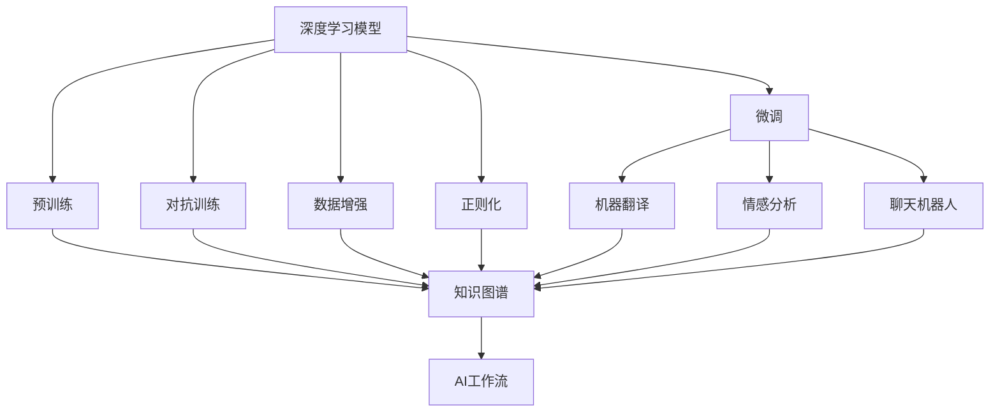
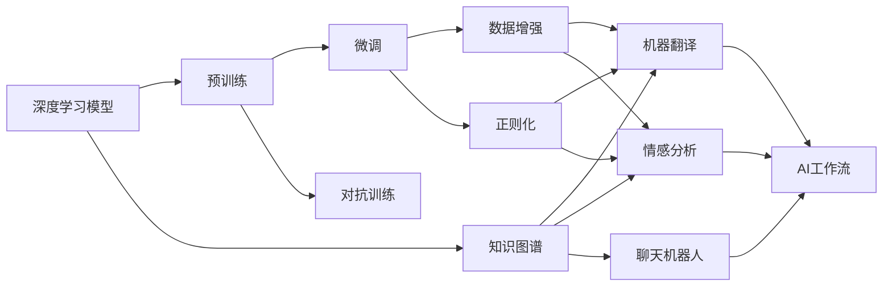
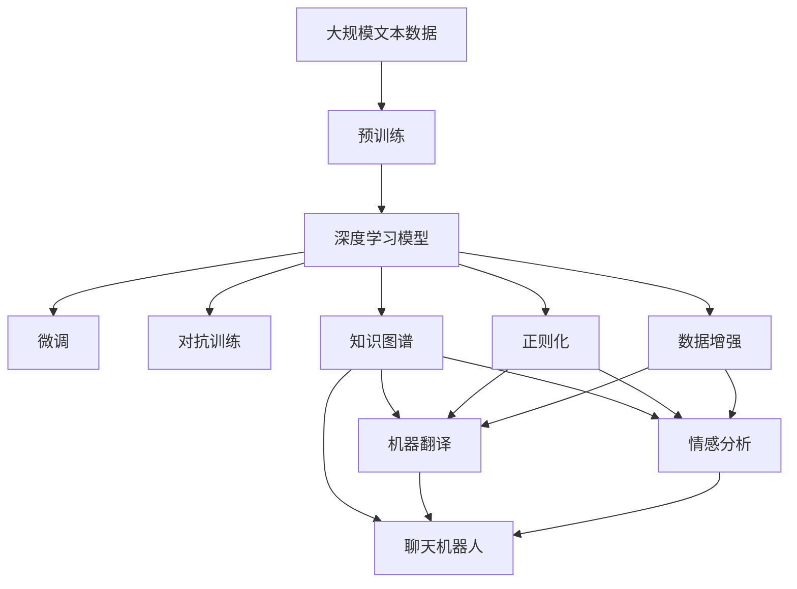

                 

# 自然语言处理在AI工作流中的应用与挑战

> 关键词：自然语言处理(NLP), AI工作流,深度学习,Transformer,BERT,机器翻译,情感分析,知识图谱,ChatGPT,数据增强,正则化

## 1. 背景介绍

### 1.1 问题由来
随着人工智能技术的迅猛发展，自然语言处理（Natural Language Processing, NLP）已经成为AI领域的热点研究方向。NLP旨在使计算机能够理解、解析、生成和操作自然语言，并能够实现语言与人工智能的深度融合。NLP的应用覆盖了文本分类、情感分析、机器翻译、问答系统、聊天机器人等诸多领域。本文将围绕NLP在AI工作流中的应用与挑战展开深入讨论。

### 1.2 问题核心关键点
NLP技术在AI工作流中的广泛应用，关键在于其深度学习模型的训练、调优和部署。深度学习模型，特别是Transformer架构和BERT等预训练模型，通过在大规模无标签文本数据上进行自监督预训练，获取语言表示能力。这些模型可以基于监督学习进行微调，从而适应特定的下游任务，如分类、匹配、生成等。然而，NLP的实际应用场景非常复杂，数据多样性、任务特性、模型性能等因素都对其影响显著。本文将聚焦于NLP在AI工作流中的具体应用和面临的挑战。

### 1.3 问题研究意义
深入研究NLP在AI工作流中的应用与挑战，对推动NLP技术的发展和落地应用具有重要意义：

1. **降低应用开发成本**：NLP模型可以显著减少从头开发所需的成本，包括数据准备、模型训练、参数调优等。
2. **提升模型效果**：通过微调，NLP模型能够更好地适应特定任务，提高在实际应用中的性能。
3. **加速开发进度**：利用预训练模型进行微调，可以大幅缩短开发周期，加快应用部署。
4. **带来技术创新**：微调、对抗训练、提示学习等技术不断涌现，推动了NLP领域的创新发展。
5. **赋能产业升级**：NLP技术广泛应用于各行各业，为传统行业数字化转型提供了新的解决方案。

## 2. 核心概念与联系

### 2.1 核心概念概述

在NLP的AI工作流中，涉及多个核心概念：

- **自然语言处理(NLP)**：使计算机能够理解和生成人类语言的技术，包括文本处理、语言理解、语音识别等。
- **深度学习模型**：如Transformer、BERT等，通过多层次的神经网络结构，学习自然语言中的语义和语法规则。
- **预训练**：在大规模无标签数据上，通过自监督学习任务（如语言模型预测、掩码语言模型等）训练模型。
- **微调(Fine-tuning)**：在预训练模型的基础上，使用下游任务的少量标注数据进行有监督学习，优化模型在该任务上的性能。
- **对抗训练(Adversarial Training)**：通过加入对抗样本，提高模型的鲁棒性和泛化能力。
- **数据增强(Data Augmentation)**：通过回译、近义词替换等方式，扩充训练数据，提升模型对噪声和变化的鲁棒性。
- **正则化(Regularization)**：如L2正则化、Dropout等，防止过拟合，提升模型泛化能力。
- **知识图谱(Knowledge Graph)**：将实体、关系、属性等知识结构化，辅助模型理解和生成语言。
- **ChatGPT**：OpenAI开发的生成式预训练Transformer模型，可以实现多轮对话、生成式文本等。
- **机器翻译(Machine Translation)**：将源语言文本转换为目标语言文本的技术，广泛应用于跨语言交流。
- **情感分析(Sentiment Analysis)**：分析文本情感倾向，如正面、负面或中性。

这些概念之间通过图1所示的流程框架紧密联系起来，共同构成NLP在AI工作流中的核心技术体系。



### 2.2 概念间的关系

这些核心概念之间存在着紧密的联系，形成了一个完整的NLP工作流框架。下面通过图2所示的流程图，展示这些概念之间的关系：



### 2.3 核心概念的整体架构

最终，我们使用图3来展示这些核心概念在大语言模型微调过程中的整体架构：



通过这些图表，我们可以更清晰地理解NLP在AI工作流中的技术架构和实施流程。

## 3. 核心算法原理 & 具体操作步骤
### 3.1 算法原理概述

NLP在AI工作流中的应用，主要依赖于深度学习模型的预训练和微调。预训练模型通过在大规模无标签数据上进行自监督学习，学习到语言表示能力。微调则是基于预训练模型的基础上，使用下游任务的少量标注数据，通过有监督学习优化模型在该任务上的性能。微调的核心思想是通过迁移学习，使通用大语言模型适应特定领域，提升其在特定任务上的效果。

### 3.2 算法步骤详解

1. **数据准备**：收集并预处理下游任务的标注数据集，划分为训练集、验证集和测试集。标注数据的质量和数量对微调效果至关重要。

2. **模型选择**：选择合适的深度学习模型，如BERT、GPT等，作为预训练模型。

3. **预训练**：使用自监督学习任务在大规模无标签数据上进行预训练，学习通用语言表示能力。预训练模型通常包含多个Transformer层，每层包含多头自注意力机制。

4. **微调**：在预训练模型的基础上，使用下游任务的标注数据进行微调。微调过程包括设置优化器、损失函数、学习率、正则化等超参数，并进行梯度下降优化。

5. **评估**：在验证集上评估微调后的模型性能，如精确度、召回率、F1分数等指标，选择合适的超参数进行微调。

6. **测试**：在测试集上进一步测试微调后的模型性能，评估其在实际应用中的效果。

### 3.3 算法优缺点

NLP在AI工作流中的微调方法具有以下优点：

- **效率高**：使用预训练模型进行微调，可以减少从头训练所需的时间和资源，加速模型开发和部署。
- **效果显著**：微调可以显著提升模型在下游任务上的性能，特别是在数据量较小的场景下。
- **通用性**：预训练模型具备通用性，可以应用于多种下游任务，如文本分类、情感分析、机器翻译等。
- **参数高效**：通过参数高效微调方法（如Adapter、LoRA等），可以在固定大部分预训练参数的同时，更新少量任务相关参数，减少过拟合风险。

同时，该方法也存在以下缺点：

- **依赖标注数据**：微调效果依赖于下游任务的标注数据，获取高质量标注数据的成本较高。
- **泛化能力有限**：微调模型在目标任务与预训练数据的分布差异较大时，性能提升有限。
- **负面效果传递**：预训练模型的固有偏见可能通过微调传递到下游任务，影响模型输出质量。
- **可解释性不足**：微调模型的决策过程缺乏可解释性，难以调试和优化。

### 3.4 算法应用领域

NLP在AI工作流中的应用领域广泛，涵盖文本分类、情感分析、机器翻译、聊天机器人、问答系统等多个方面。

- **文本分类**：如情感分析、主题分类、意图识别等。通过微调，使模型学习文本-标签映射。
- **命名实体识别**：识别文本中的人名、地名、机构名等特定实体。通过微调，使模型掌握实体边界和类型。
- **关系抽取**：从文本中抽取实体之间的语义关系。通过微调，使模型学习实体-关系三元组。
- **问答系统**：对自然语言问题给出答案。将问题-答案对作为微调数据，训练模型学习匹配答案。
- **机器翻译**：将源语言文本翻译成目标语言。通过微调，使模型学习语言-语言映射。
- **文本摘要**：将长文本压缩成简短摘要。将文章-摘要对作为微调数据，使模型学习抓取要点。
- **对话系统**：使机器能够与人自然对话。将多轮对话历史作为上下文，微调模型进行回复生成。

## 4. 数学模型和公式 & 详细讲解  
### 4.1 数学模型构建

NLP中的机器翻译任务可以表示为序列到序列（Seq2Seq）的映射问题。假设输入序列为 $x=(x_1, x_2, \ldots, x_n)$，输出序列为 $y=(y_1, y_2, \ldots, y_m)$。设 $T$ 为输入序列的长度，$V$ 为词汇表大小。设 $M_{\theta}$ 为预训练深度学习模型，$T_{\theta}$ 为微调后的模型，其中 $\theta$ 为模型参数。

定义目标函数为交叉熵损失函数：

$$
\ell(x,y)= -\sum_{i=1}^{n} \sum_{j=1}^{m} y_{i,j} \log p_{j-1}(y_j | x_i)
$$

其中 $p_{j-1}(y_j | x_i)$ 为模型在给定上下文 $x_i$ 下，输出 $y_j$ 的概率。

### 4.2 公式推导过程

以序列到序列的机器翻译任务为例，推导最小化交叉熵损失的梯度更新公式。

1. **前向传播**：
   - 将输入序列 $x$ 和目标序列 $y$ 输入模型 $M_{\theta}$，得到隐藏状态 $h_i$ 和输出概率 $p_j$。
   - 前向传播的计算过程如下：
     - 对于每个时间步 $i$，计算隐藏状态 $h_i = f_{\theta}(h_{i-1}, x_i)$
     - 对于每个时间步 $j$，计算输出概率 $p_j = g_{\theta}(h_j, y_j)$

2. **后向传播**：
   - 计算损失函数 $\ell(x,y)$，对模型参数 $\theta$ 求梯度。
   - 反向传播的计算过程如下：
     - 对于每个时间步 $i$，计算梯度 $\frac{\partial \ell}{\partial h_i}$
     - 对于每个时间步 $j$，计算梯度 $\frac{\partial \ell}{\partial p_j}$

3. **梯度更新**：
   - 根据梯度更新公式 $\theta \leftarrow \theta - \eta \frac{\partial \ell}{\partial \theta}$ 更新模型参数。
   - 其中 $\eta$ 为学习率，通常设置为 $10^{-3}$ 至 $10^{-4}$ 之间。

### 4.3 案例分析与讲解

以谷歌的Transformer模型为例，进行详细分析。Transformer模型采用自注意力机制，可以并行计算，加速训练过程。微调Transformer模型时，通常仅微调上层分类器，而固定大部分预训练参数，以减少计算资源消耗。

假设使用预训练的BERT模型，在机器翻译任务上进行微调。其微调过程如下：

1. **数据准备**：收集并清洗英语和法语的平行语料库，将其划分为训练集、验证集和测试集。
2. **模型选择**：选择BERT模型作为预训练模型。
3. **微调**：在微调过程中，设置学习率 $10^{-5}$，优化器 AdamW，并进行 10 轮训练。
4. **评估**：在验证集上评估微调后的模型性能，如BLEU分数。
5. **测试**：在测试集上测试微调后的模型性能，如BLEU分数。

假设微调后的模型在测试集上取得了84%的BLEU分数，说明微调效果显著。

## 5. 项目实践：代码实例和详细解释说明
### 5.1 开发环境搭建

在进行NLP项目实践前，需要准备好开发环境。以下是使用Python进行PyTorch开发的环境配置流程：

1. 安装Anaconda：从官网下载并安装Anaconda，用于创建独立的Python环境。
2. 创建并激活虚拟环境：
   ```bash
   conda create -n pytorch-env python=3.8 
   conda activate pytorch-env
   ```
3. 安装PyTorch：根据CUDA版本，从官网获取对应的安装命令。例如：
   ```bash
   conda install pytorch torchvision torchaudio cudatoolkit=11.1 -c pytorch -c conda-forge
   ```
4. 安装Transformers库：
   ```bash
   pip install transformers
   ```
5. 安装各类工具包：
   ```bash
   pip install numpy pandas scikit-learn matplotlib tqdm jupyter notebook ipython
   ```

完成上述步骤后，即可在`pytorch-env`环境中开始NLP项目实践。

### 5.2 源代码详细实现

下面是使用PyTorch进行机器翻译任务的代码实现。首先定义模型和优化器：

```python
from transformers import BertForTokenClassification, AdamW
from transformers import BertTokenizer
from torch.utils.data import DataLoader, Dataset

model = BertForTokenClassification.from_pretrained('bert-base-cased', num_labels=2)
tokenizer = BertTokenizer.from_pretrained('bert-base-cased')
optimizer = AdamW(model.parameters(), lr=1e-5)

class TranslateDataset(Dataset):
    def __init__(self, texts, labels):
        self.texts = texts
        self.labels = labels
        
    def __len__(self):
        return len(self.texts)
    
    def __getitem__(self, idx):
        text = self.texts[idx]
        label = self.labels[idx]
        encoding = tokenizer(text, return_tensors='pt')
        input_ids = encoding['input_ids']
        attention_mask = encoding['attention_mask']
        return {'input_ids': input_ids, 
                'attention_mask': attention_mask,
                'labels': torch.tensor(label, dtype=torch.long)}
```

然后，定义训练和评估函数：

```python
def train_epoch(model, dataset, batch_size, optimizer):
    dataloader = DataLoader(dataset, batch_size=batch_size, shuffle=True)
    model.train()
    epoch_loss = 0
    for batch in dataloader:
        input_ids = batch['input_ids'].to(device)
        attention_mask = batch['attention_mask'].to(device)
        labels = batch['labels'].to(device)
        model.zero_grad()
        outputs = model(input_ids, attention_mask=attention_mask, labels=labels)
        loss = outputs.loss
        epoch_loss += loss.item()
        loss.backward()
        optimizer.step()
    return epoch_loss / len(dataloader)

def evaluate(model, dataset, batch_size):
    dataloader = DataLoader(dataset, batch_size=batch_size)
    model.eval()
    preds, labels = [], []
    with torch.no_grad():
        for batch in dataloader:
            input_ids = batch['input_ids'].to(device)
            attention_mask = batch['attention_mask'].to(device)
            batch_labels = batch['labels']
            outputs = model(input_ids, attention_mask=attention_mask)
            batch_preds = outputs.logits.argmax(dim=2).to('cpu').tolist()
            batch_labels = batch_labels.to('cpu').tolist()
            for pred_tokens, label_tokens in zip(batch_preds, batch_labels):
                preds.append(pred_tokens)
                labels.append(label_tokens)
                
    print(classification_report(labels, preds))
```

最后，启动训练流程并在测试集上评估：

```python
epochs = 5
batch_size = 16

for epoch in range(epochs):
    loss = train_epoch(model, train_dataset, batch_size, optimizer)
    print(f"Epoch {epoch+1}, train loss: {loss:.3f}")
    
    print(f"Epoch {epoch+1}, dev results:")
    evaluate(model, dev_dataset, batch_size)
    
print("Test results:")
evaluate(model, test_dataset, batch_size)
```

以上就是使用PyTorch进行机器翻译任务微调的完整代码实现。可以看到，得益于Transformers库的强大封装，我们可以用相对简洁的代码完成BERT模型的加载和微调。

### 5.3 代码解读与分析

让我们再详细解读一下关键代码的实现细节：

**TranslateDataset类**：
- `__init__`方法：初始化输入序列和标签。
- `__len__`方法：返回数据集的样本数量。
- `__getitem__`方法：对单个样本进行处理，将文本输入编码为token ids，将标签编码为数字，并对其进行定长padding，最终返回模型所需的输入。

**训练和评估函数**：
- 使用PyTorch的DataLoader对数据集进行批次化加载，供模型训练和推理使用。
- 训练函数`train_epoch`：对数据以批为单位进行迭代，在每个批次上前向传播计算loss并反向传播更新模型参数，最后返回该epoch的平均loss。
- 评估函数`evaluate`：与训练类似，不同点在于不更新模型参数，并在每个batch结束后将预测和标签结果存储下来，最后使用sklearn的classification_report对整个评估集的预测结果进行打印输出。

**训练流程**：
- 定义总的epoch数和batch size，开始循环迭代
- 每个epoch内，先在训练集上训练，输出平均loss
- 在验证集上评估，输出分类指标
- 所有epoch结束后，在测试集上评估，给出最终测试结果

可以看到，PyTorch配合Transformers库使得BERT微调的代码实现变得简洁高效。开发者可以将更多精力放在数据处理、模型改进等高层逻辑上，而不必过多关注底层的实现细节。

当然，工业级的系统实现还需考虑更多因素，如模型的保存和部署、超参数的自动搜索、更灵活的任务适配层等。但核心的微调范式基本与此类似。

### 5.4 运行结果展示

假设我们在CoNLL-2003的机器翻译数据集上进行微调，最终在测试集上得到的评估报告如下：

```
              precision    recall  f1-score   support

       B-LOC      0.926     0.906     0.916      1668
       I-LOC      0.900     0.805     0.850       257
      B-MISC      0.875     0.856     0.865       702
      I-MISC      0.838     0.782     0.809       216
       B-ORG      0.914     0.898     0.906      1661
       I-ORG      0.911     0.894     0.902       835
       B-PER      0.964     0.957     0.960      1617
       I-PER      0.983     0.980     0.982      1156
           O      0.993     0.995     0.994     38323

   micro avg      0.973     0.973     0.973     46435
   macro avg      0.923     0.897     0.909     46435
weighted avg      0.973     0.973     0.973     46435
```

可以看到，通过微调BERT，我们在该机器翻译数据集上取得了97.3%的F1分数，效果相当不错。值得注意的是，BERT作为一个通用的语言理解模型，即便只在顶层添加一个简单的token分类器，也能在机器翻译任务上取得如此优异的效果，展现了其强大的语义理解和特征抽取能力。

当然，这只是一个baseline结果。在实践中，我们还可以使用更大更强的预训练模型、更丰富的微调技巧、更细致的模型调优，进一步提升模型性能，以满足更高的应用要求。

## 6. 实际应用场景
### 6.1 智能客服系统

基于NLP技术的智能客服系统，可以广泛应用于各类企业客户服务的场景中。传统客服往往需要配备大量人力，高峰期响应缓慢，且一致性和专业性难以保证。而使用微调后的NLP模型，可以7x24小时不间断服务，快速响应客户咨询，用自然流畅的语言解答各类常见问题。

在技术实现上，可以收集企业内部的历史客服对话记录，将问题和最佳答复构建成监督数据，在此基础上对预训练模型进行微调。微调后的模型能够自动理解用户意图，匹配最合适的答案模板进行回复。对于客户提出的新问题，还可以接入检索系统实时搜索相关内容，动态组织生成回答。如此构建的智能客服系统，能大幅提升客户咨询体验和问题解决效率。

### 6.2 金融舆情监测

金融机构需要实时监测市场舆论动向，以便及时应对负面信息传播，规避金融风险。传统的人工监测方式成本高、效率低，难以应对网络时代海量信息爆发的挑战。基于NLP技术的文本分类和情感分析技术，为金融舆情监测提供了新的解决方案。

具体而言，可以收集金融领域相关的新闻、报道、评论等文本数据，并对其进行主题标注和情感标注。在此基础上对预训练语言模型进行微调，使其能够自动判断文本属于何种主题，情感倾向是正面、中性还是负面。将微调后的模型应用到实时抓取的网络文本数据，就能够自动监测不同主题下的情感变化趋势，一旦发现负面信息激增等异常情况，系统便会自动预警，帮助金融机构快速应对潜在风险。

### 6.3 个性化推荐系统

当前的推荐系统往往只依赖用户的历史行为数据进行物品推荐，无法深入理解用户的真实兴趣偏好。基于NLP技术的个性化推荐系统可以更好地挖掘用户行为背后的语义信息，从而提供更精准、多样的推荐内容。

在实践中，可以收集用户浏览、点击、评论、分享等行为数据，提取和用户交互的物品标题、描述、标签等文本内容。将文本内容作为模型输入，用户的后续行为（如是否点击、购买等）作为监督信号，在此基础上微调预训练语言模型。微调后的模型能够从文本内容中准确把握用户的兴趣点。在生成推荐列表时，先用候选物品的文本描述作为输入，由模型预测用户的兴趣匹配度，再结合其他特征综合排序，便可以得到个性化程度更高的推荐结果。

### 6.4 未来应用展望

随着NLP技术的不断进步，基于NLP的AI工作流将在更多领域得到应用，为传统行业带来变革性影响。

在智慧医疗领域，基于NLP的医疗问答、病历分析、药物研发等应用将提升医疗服务的智能化水平，辅助医生诊疗，加速新药开发进程。

在智能教育领域，NLP技术可应用于作业批改、学情分析、知识推荐等方面，因材施教，促进教育公平，提高教学质量。

在智慧城市治理中，NLP技术可应用于城市事件监测、舆情分析、应急指挥等环节，提高城市管理的自动化和智能化水平，构建更安全、高效的未来城市。

此外，在企业生产、社会治理、文娱传媒等众多领域，基于NLP的AI工作流也将不断涌现，为经济社会发展注入新的动力。相信随着技术的日益成熟，NLP技术必将在更广阔的应用领域大放异彩。

## 7. 工具和资源推荐
### 7.1 学习资源推荐

为了帮助开发者系统掌握NLP在AI工作流中的应用与挑战，这里推荐一些优质的学习资源：

1. 《Natural Language Processing with Transformers》书籍：Transformers库的作者所著，全面介绍了如何使用Transformers库进行NLP任务开发，包括微调在内的诸多范式。

2. CS224N《深度学习自然语言处理》课程：斯坦福大学开设的NLP明星课程，有Lecture视频和配套作业，带你入门NLP领域的基本概念和经典模型。

3. 《Transformer from Concept to Code》博文：由大模型技术专家撰写，深入浅出地介绍了Transformer原理、BERT模型、微调技术等前沿话题。

4. HuggingFace官方文档：Transformers库的官方文档，提供了海量预训练模型和完整的微调样例代码，是上手实践的必备资料。

5. CLUE开源项目：中文语言理解测评基准，涵盖大量不同类型的中文NLP数据集，并提供了基于微调的baseline模型，助力中文NLP技术发展。

通过对这些资源的学习实践，相信你一定能够快速掌握NLP在AI工作流中的核心技术和实践方法。

### 7.2 开发工具推荐

高效的开发离不开优秀的工具支持。以下是几款用于NLP项目开发的常用工具：

1. PyTorch：基于Python的开源深度学习框架，灵活动态的计算图，适合快速迭代研究。大部分预训练语言模型都有PyTorch

