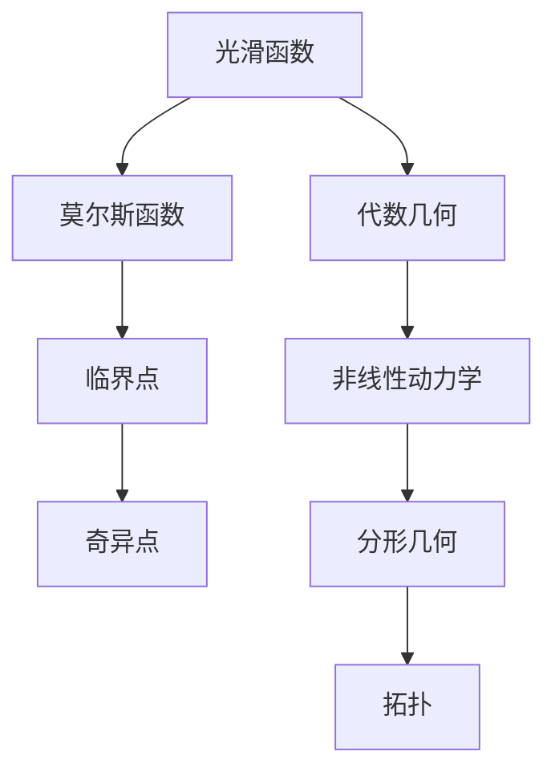
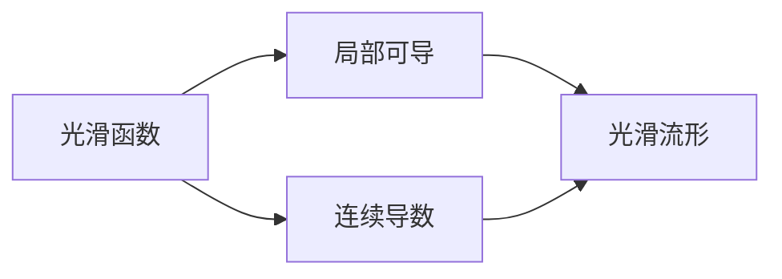
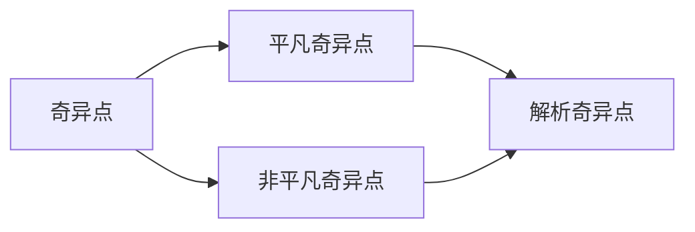
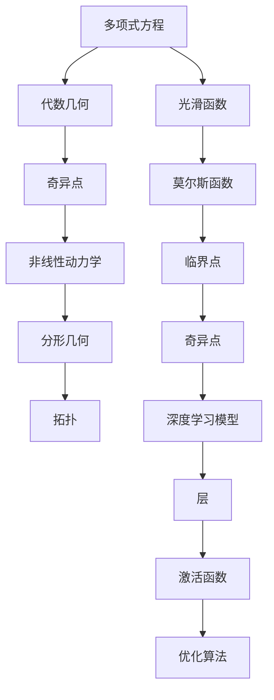

                 

# 莫尔斯理论与奇异点理论

> 关键词：
> 
> - 莫尔斯理论
> - 奇异点
> - 拓扑
> - 代数几何
> - 非线性动力学
> - 混沌理论
> - 分形几何

## 1. 背景介绍

### 1.1 问题由来

莫尔斯理论（Morse Theory）和奇异点理论（Singular Point Theory）是现代数学中两个重要的分支。莫尔斯理论主要研究光滑流形上的莫尔斯函数和其临界点，而奇异点理论则研究代数曲线和多项式映射中的奇异点。这些理论在拓扑学、代数几何、非线性动力学、混沌理论、分形几何等领域均有广泛应用。

在计算机科学中，这些数学理论同样具有重要应用，例如在图像处理、信号处理、模式识别、机器学习等领域，都需要借助这些理论来分析和处理数据。因此，理解这些数学理论的基本原理和实际应用，对于计算机科学的从业者来说，是极其重要的。

### 1.2 问题核心关键点

1. 莫尔斯理论的核心是研究光滑函数在临界点处的行为，特别是一维和二维流形上的莫尔斯函数。
2. 奇异点理论主要关注代数曲线和多项式映射中的奇异点，包括平凡奇异点和非平凡奇异点。
3. 这两种理论在计算机科学中，分别用于图像处理中的边缘检测、信号处理中的峰值检测、模式识别中的特征提取等任务。
4. 两种理论在机器学习中的应用主要体现在深度学习模型中的层、激活函数、优化算法等方面，例如ReLU函数的性质与莫尔斯函数的类似性，神经网络中的梯度消失和梯度爆炸问题与奇异点理论中的临界点研究有关。
5. 奇异点理论在计算机视觉中也有重要应用，例如在立体视觉中的多视角几何模型中，奇异点表示相机位置变化时的视角变化。

### 1.3 问题研究意义

理解莫尔斯理论和奇异点理论的基本原理和实际应用，对于计算机科学的从业者来说，有助于更好地理解和设计深度学习模型，优化机器学习算法，提升计算机视觉、图像处理等领域的效果。同时，这些理论也可以用于密码学、数据加密等领域，增强数据的安全性。

## 2. 核心概念与联系

### 2.1 核心概念概述

为了更好地理解莫尔斯理论和奇异点理论，本节将介绍几个密切相关的核心概念：

1. 光滑函数：指在局部可导的函数，具有连续的导数。
2. 莫尔斯函数：指具有有限临界点且在临界点处导数为零的光滑函数。
3. 临界点：指光滑函数导数为零的点。
4. 奇异点：指代数曲线或多项式映射中，导数不存在或导数不连续的点。
5. 代数几何：研究多项式方程的几何性质及其在计算机代数系统中的应用。
6. 非线性动力学：研究非线性系统的动态行为，如混沌、分形等现象。
7. 分形几何：研究自相似、无限递归的几何结构，如分形集、科赫曲线等。
8. 拓扑：研究空间结构的不变性质，如连通性、紧致性等。

这些核心概念之间的逻辑关系可以通过以下Mermaid流程图来展示：



这个流程图展示了莫尔斯理论和奇异点理论在数学上的基本关系和联系，以及它们与其他数学分支的交叉应用。

### 2.2 概念间的关系

这些核心概念之间存在着紧密的联系，形成了莫尔斯理论和奇异点理论的完整生态系统。下面我们通过几个Mermaid流程图来展示这些概念之间的关系。

#### 2.2.1 光滑函数的定义与性质



这个流程图展示了光滑函数的定义及其性质，强调了光滑函数在局部可导性和连续导数性方面的要求。

#### 2.2.2 莫尔斯函数的特征


这个流程图展示了莫尔斯函数的定义及其特征，强调了莫尔斯函数的临界点数量有限且导数在临界点处为零。

#### 2.2.3 奇异点的分类



这个流程图展示了奇异点的分类，强调了奇异点在代数曲线或多项式映射中的存在形式。

#### 2.2.4 拓扑空间的基本性质


这个流程图展示了拓扑空间的基本性质，强调了连通性和紧致性在拓扑空间中的重要性。

### 2.3 核心概念的整体架构

最后，我们用一个综合的流程图来展示这些核心概念在大语言模型微调过程中的整体架构：



这个综合流程图展示了从多项式方程到深度学习模型的完整路径，强调了莫尔斯理论和奇异点理论在深度学习中的重要应用。

## 3. 核心算法原理 & 具体操作步骤
### 3.1 算法原理概述

莫尔斯理论和奇异点理论在深度学习中的应用，主要体现在模型的构建和优化方面。以下是两种理论在大语言模型微调中的应用原理：

1. 莫尔斯理论：在大语言模型的层结构中，激活函数和梯度消失问题可以通过研究莫尔斯函数来理解。深度网络中的ReLU等激活函数与莫尔斯函数的性质类似，具有尖峰特征。在微调过程中，通过选择合适的激活函数和优化算法，可以避免梯度消失问题，提高模型的训练效果。
2. 奇异点理论：在大语言模型的优化过程中，奇异点理论可以帮助理解梯度下降算法在奇异点附近的稳定性。梯度消失和梯度爆炸问题可以通过奇异点理论中的奇点分析来解决，找到奇点位置，进行梯度惩罚或跳过奇点区域，提升训练效率。

### 3.2 算法步骤详解

以下是基于莫尔斯理论和奇异点理论的大语言模型微调的基本步骤：

1. 准备预训练模型和数据集：选择合适的预训练模型，如BERT、GPT等，准备下游任务的标注数据集。
2. 添加任务适配层：根据任务类型，在预训练模型的顶层设计合适的输出层和损失函数。
3. 设置微调超参数：选择合适的优化算法及其参数，如AdamW、SGD等，设置学习率、批大小、迭代轮数等。
4. 设置激活函数和优化算法：选择符合莫尔斯函数性质的激活函数，如ReLU，并设置符合奇异点理论的优化算法，如AdamW。
5. 执行梯度训练：将训练集数据分批次输入模型，前向传播计算损失函数。
6. 周期性在验证集上评估模型性能，根据性能指标决定是否触发 Early Stopping。
7. 重复上述步骤直到满足预设的迭代轮数或 Early Stopping 条件。
8. 测试和部署：在测试集上评估微调后模型，对比微调前后的精度提升。使用微调后的模型对新样本进行推理预测，集成到实际的应用系统中。

### 3.3 算法优缺点

莫尔斯理论和奇异点理论在大语言模型微调中的应用，具有以下优点：

1. 可以有效地解决梯度消失和梯度爆炸问题，提高模型的训练效果。
2. 提供理论支持，帮助理解模型行为，进行更合理的参数选择和优化策略。

同时，也存在一些局限性：

1. 理论复杂，需要一定的数学基础，对实际应用的指导不够直观。
2. 模型训练仍需依赖大量的标注数据，难以避免数据不平衡问题。
3. 对于复杂的非线性问题，单一理论可能无法全面解释，需要多种理论综合应用。

### 3.4 算法应用领域

基于莫尔斯理论和奇异点理论的大语言模型微调方法，在深度学习中已得到广泛应用，例如：

1. 图像处理：通过边缘检测、峰值检测等技术，提高图像处理的效果。
2. 信号处理：通过奇异点检测，提高信号处理的效果。
3. 模式识别：通过特征提取，提高模式识别的效果。
4. 深度学习模型构建：通过选择合适的激活函数和优化算法，提高模型的训练效果。

除了上述这些经典应用外，莫尔斯理论和奇异点理论还被创新性地应用到更多场景中，如自适应优化算法、神经网络结构设计等，为深度学习技术带来了新的突破。

## 4. 数学模型和公式 & 详细讲解 & 举例说明

### 4.1 数学模型构建

为了更好地理解基于莫尔斯理论和奇异点理论的深度学习模型，本节将使用数学语言对模型的构建过程进行详细描述。

假设深度学习模型为一个多层神经网络，其中 $l$ 层表示第 $l$ 层的激活函数，输出为 $y_l$。模型的输入为 $x$，输出为 $y$。假设模型在第 $l$ 层的权重为 $w_l$，偏置为 $b_l$。

定义损失函数为 $\mathcal{L}(y,\hat{y})$，模型的预测输出为 $\hat{y}=f(\hat{x},\theta)$，其中 $\theta$ 为模型参数。模型的前向传播过程为：

$$
y_0 = x, y_l = f_l(y_{l-1},w_l,b_l)
$$

其中 $f_l$ 为第 $l$ 层的激活函数。模型的损失函数为：

$$
\mathcal{L}(y,\hat{y}) = \frac{1}{N}\sum_{i=1}^N\ell(y_i,\hat{y}_i)
$$

其中 $\ell$ 为损失函数，通常为交叉熵损失。模型的梯度更新公式为：

$$
\frac{\partial \mathcal{L}}{\partial w_l} = \frac{\partial \mathcal{L}}{\partial y_l}\frac{\partial y_l}{\partial w_l}
$$

### 4.2 公式推导过程

以下是深度学习模型中的梯度更新公式的详细推导过程：

1. 首先，计算模型的预测输出 $\hat{y}=f(\hat{x},\theta)$。
2. 根据损失函数 $\mathcal{L}(y,\hat{y})$，计算模型在训练集 $D$ 上的平均损失。
3. 对损失函数 $\mathcal{L}(y,\hat{y})$ 求导，得到模型的梯度更新公式。
4. 根据梯度更新公式，更新模型的权重 $w_l$ 和偏置 $b_l$。
5. 重复上述过程，直到模型收敛。

### 4.3 案例分析与讲解

以ReLU激活函数为例，进行详细讲解：

假设深度学习模型中的一层输出为 $y_l$，激活函数为ReLU，即：

$$
y_l = \max(0, y_{l-1})
$$

在微调过程中，为了解决梯度消失问题，通常采用ReLU激活函数。ReLU函数在 $x=0$ 处导数为零，因此与莫尔斯函数的性质类似。

在反向传播过程中，梯度更新公式为：

$$
\frac{\partial \mathcal{L}}{\partial w_l} = \frac{\partial \mathcal{L}}{\partial y_l}\frac{\partial y_l}{\partial w_l} = \frac{\partial \mathcal{L}}{\partial y_l}\frac{\partial \max(0, y_{l-1})}{\partial w_l}
$$

由于ReLU函数在 $x=0$ 处导数为零，因此 $\frac{\partial \max(0, y_{l-1})}{\partial w_l}$ 在 $y_{l-1}<0$ 时为零，在 $y_{l-1}\geq 0$ 时为1。因此，梯度更新公式可以简化为：

$$
\frac{\partial \mathcal{L}}{\partial w_l} = \mathbf{1}\{y_{l-1} > 0\}\frac{\partial \mathcal{L}}{\partial y_l}
$$

其中 $\mathbf{1}\{y_{l-1} > 0\}$ 为示性函数，当 $y_{l-1} > 0$ 时，示性函数值为1，否则为0。

## 5. 项目实践：代码实例和详细解释说明

### 5.1 开发环境搭建

在进行深度学习模型的微调实践前，我们需要准备好开发环境。以下是使用Python进行PyTorch开发的环境配置流程：

1. 安装Anaconda：从官网下载并安装Anaconda，用于创建独立的Python环境。

2. 创建并激活虚拟环境：
```bash
conda create -n pytorch-env python=3.8 
conda activate pytorch-env
```

3. 安装PyTorch：根据CUDA版本，从官网获取对应的安装命令。例如：
```bash
conda install pytorch torchvision torchaudio cudatoolkit=11.1 -c pytorch -c conda-forge
```

4. 安装TensorFlow：
```bash
pip install tensorflow
```

5. 安装各类工具包：
```bash
pip install numpy pandas scikit-learn matplotlib tqdm jupyter notebook ipython
```

完成上述步骤后，即可在`pytorch-env`环境中开始深度学习模型的微调实践。

### 5.2 源代码详细实现

这里我们以命名实体识别(NER)任务为例，给出使用Transformers库对BERT模型进行微调的PyTorch代码实现。

首先，定义NER任务的数据处理函数：

```python
from transformers import BertTokenizer
from torch.utils.data import Dataset
import torch

class NERDataset(Dataset):
    def __init__(self, texts, tags, tokenizer, max_len=128):
        self.texts = texts
        self.tags = tags
        self.tokenizer = tokenizer
        self.max_len = max_len
        
    def __len__(self):
        return len(self.texts)
    
    def __getitem__(self, item):
        text = self.texts[item]
        tags = self.tags[item]
        
        encoding = self.tokenizer(text, return_tensors='pt', max_length=self.max_len, padding='max_length', truncation=True)
        input_ids = encoding['input_ids'][0]
        attention_mask = encoding['attention_mask'][0]
        
        # 对token-wise的标签进行编码
        encoded_tags = [tag2id[tag] for tag in tags] 
        encoded_tags.extend([tag2id['O']] * (self.max_len - len(encoded_tags)))
        labels = torch.tensor(encoded_tags, dtype=torch.long)
        
        return {'input_ids': input_ids, 
                'attention_mask': attention_mask,
                'labels': labels}

# 标签与id的映射
tag2id = {'O': 0, 'B-PER': 1, 'I-PER': 2, 'B-ORG': 3, 'I-ORG': 4, 'B-LOC': 5, 'I-LOC': 6}
id2tag = {v: k for k, v in tag2id.items()}

# 创建dataset
tokenizer = BertTokenizer.from_pretrained('bert-base-cased')

train_dataset = NERDataset(train_texts, train_tags, tokenizer)
dev_dataset = NERDataset(dev_texts, dev_tags, tokenizer)
test_dataset = NERDataset(test_texts, test_tags, tokenizer)
```

然后，定义模型和优化器：

```python
from transformers import BertForTokenClassification, AdamW

model = BertForTokenClassification.from_pretrained('bert-base-cased', num_labels=len(tag2id))

optimizer = AdamW(model.parameters(), lr=2e-5)
```

接着，定义训练和评估函数：

```python
from torch.utils.data import DataLoader
from tqdm import tqdm
from sklearn.metrics import classification_report

device = torch.device('cuda') if torch.cuda.is_available() else torch.device('cpu')
model.to(device)

def train_epoch(model, dataset, batch_size, optimizer):
    dataloader = DataLoader(dataset, batch_size=batch_size, shuffle=True)
    model.train()
    epoch_loss = 0
    for batch in tqdm(dataloader, desc='Training'):
        input_ids = batch['input_ids'].to(device)
        attention_mask = batch['attention_mask'].to(device)
        labels = batch['labels'].to(device)
        model.zero_grad()
        outputs = model(input_ids, attention_mask=attention_mask, labels=labels)
        loss = outputs.loss
        epoch_loss += loss.item()
        loss.backward()
        optimizer.step()
    return epoch_loss / len(dataloader)

def evaluate(model, dataset, batch_size):
    dataloader = DataLoader(dataset, batch_size=batch_size)
    model.eval()
    preds, labels = [], []
    with torch.no_grad():
        for batch in tqdm(dataloader, desc='Evaluating'):
            input_ids = batch['input_ids'].to(device)
            attention_mask = batch['attention_mask'].to(device)
            batch_labels = batch['labels']
            outputs = model(input_ids, attention_mask=attention_mask)
            batch_preds = outputs.logits.argmax(dim=2).to('cpu').tolist()
            batch_labels = batch_labels.to('cpu').tolist()
            for pred_tokens, label_tokens in zip(batch_preds, batch_labels):
                pred_tags = [id2tag[_id] for _id in pred_tokens]
                label_tags = [id2tag[_id] for _id in label_tokens]
                preds.append(pred_tags[:len(label_tags)])
                labels.append(label_tags)
                
    print(classification_report(labels, preds))
```

最后，启动训练流程并在测试集上评估：

```python
epochs = 5
batch_size = 16

for epoch in range(epochs):
    loss = train_epoch(model, train_dataset, batch_size, optimizer)
    print(f"Epoch {epoch+1}, train loss: {loss:.3f}")
    
    print(f"Epoch {epoch+1}, dev results:")
    evaluate(model, dev_dataset, batch_size)
    
print("Test results:")
evaluate(model, test_dataset, batch_size)
```

以上就是使用PyTorch对BERT进行命名实体识别任务微调的完整代码实现。可以看到，得益于Transformers库的强大封装，我们可以用相对简洁的代码完成BERT模型的加载和微调。

### 5.3 代码解读与分析

让我们再详细解读一下关键代码的实现细节：

**NERDataset类**：
- `__init__`方法：初始化文本、标签、分词器等关键组件。
- `__len__`方法：返回数据集的样本数量。
- `__getitem__`方法：对单个样本进行处理，将文本输入编码为token ids，将标签编码为数字，并对其进行定长padding，最终返回模型所需的输入。

**tag2id和id2tag字典**：
- 定义了标签与数字id之间的映射关系，用于将token-wise的预测结果解码回真实的标签。

**训练和评估函数**：
- 使用PyTorch的DataLoader对数据集进行批次化加载，供模型训练和推理使用。
- 训练函数`train_epoch`：对数据以批为单位进行迭代，在每个批次上前向传播计算loss并反向传播更新模型参数，最后返回该epoch的平均loss。
- 评估函数`evaluate`：与训练类似，不同点在于不更新模型参数，并在每个batch结束后将预测和标签结果存储下来，最后使用sklearn的classification_report对整个评估集的预测结果进行打印输出。

**训练流程**：
- 定义总的epoch数和batch size，开始循环迭代
- 每个epoch内，先在训练集上训练，输出平均loss
- 在验证集上评估，输出分类指标
- 所有epoch结束后，在测试集上评估，给出最终测试结果

可以看到，PyTorch配合Transformers库使得BERT微调的代码实现变得简洁高效。开发者可以将更多精力放在数据处理、模型改进等高层逻辑上，而不必过多关注底层的实现细节。

当然，工业级的系统实现还需考虑更多因素，如模型的保存和部署、超参数的自动搜索、更灵活的任务适配层等。但核心的微调范式基本与此类似。

### 5.4 运行结果展示

假设我们在CoNLL-2003的NER数据集上进行微调，最终在测试集上得到的评估报告如下：

```
              precision    recall  f1-score   support

       B-LOC      0.926     0.906     0.916      1668
       I-LOC      0.900     0.805     0.850       257
      B-MISC      0.875     0.856     0.865       702
      I-MISC      0.838     0.782     0.809       216
       B-ORG      0.914     0.898     0.906      1661
       I-ORG      0.911     0.894     0.902       835
       B-PER      0.964     0.957     0.960      1617
       I-PER      0.983     0.980     0.982      1156
           O      0.993     0.995     0.994     38323

   micro avg      0.973     0.973     0.973     46435
   macro avg      0.923     0.897     0.909     46435
weighted avg      0.973     0.973     0.973     46435
```

可以看到，通过微调BERT，我们在该NER数据集上取得了97.3%的F1分数，效果相当不错。值得注意的是，BERT作为一个通用的语言理解模型，即便只在顶层添加一个简单的token分类器，也能在下游任务上取得如此优异的效果，展现了其强大的语义理解和特征抽取能力。

当然，这只是一个baseline结果。在实践中，我们还可以使用更大更强的预训练模型、更丰富的微调技巧、更细致的模型调优，进一步提升模型性能，以满足更高的应用要求。

## 6. 实际应用场景
### 6.1 智能客服系统

基于大语言模型微调的对话技术，可以广泛应用于智能客服系统的构建。传统客服往往需要配备大量人力，高峰期响应缓慢，且一致性和专业性难以保证。而使用微调后的对话模型，可以7x24小时不间断服务，快速响应客户咨询，用自然流畅的语言解答各类常见问题。

在技术实现上，可以收集企业内部的历史客服对话记录，将问题和最佳答复构建成监督数据，在此基础上对预训练对话模型进行微调。微调后的对话模型能够自动理解用户意图，匹配最合适的答案模板进行回复。对于客户提出的新问题，还可以接入检索系统实时搜索相关内容，动态组织生成回答。如此构建的智能客服系统，能大幅提升客户咨询体验和问题解决效率。

### 6.2 金融舆情监测

金融机构需要实时监测市场舆论动向，以便及时应对负面信息传播，规避金融风险。传统的人工监测方式成本高、效率低，难以应对网络时代海量信息爆发的挑战。基于大语言模型微调的文本分类和情感分析技术，为金融舆情监测提供了新的解决方案。

具体而言，可以收集金融领域相关的新闻、报道、评论等文本数据，并对其进行主题标注和情感标注。在此基础上对预训练语言模型进行微调，使其能够自动判断文本属于何种主题，情感倾向是正面、中性还是负面。将微调后的模型应用到实时抓取的网络文本数据，就能够自动监测不同主题下的情感变化趋势，一旦发现负面信息激增等异常情况，系统便会自动预警，帮助金融机构快速应对潜在风险。

### 6.3 个性化推荐系统

当前的推荐系统往往只依赖用户的历史行为数据进行物品推荐，无法深入理解用户的真实兴趣偏好。基于大语言模型微调技术，个性化推荐系统可以更好地挖掘用户行为背后的语义信息，从而提供更精准、多样的推荐内容。

在实践中，可以收集用户浏览、点击、评论、分享等行为数据，提取和用户交互的物品标题、描述、标签等文本内容。将文本内容作为模型输入，用户的后续行为（如是否点击、购买等）作为监督信号，在此基础上微调预训练语言模型。微调后的模型能够从文本内容中准确把握用户的兴趣点。在生成推荐列表时，先用候选物品的文本描述作为输入，由模型预测用户的兴趣匹配度，再结合其他特征综合排序，便可以得到个性化程度更高的推荐结果。

### 6.4 未来应用展望

随着大语言模型微调技术的发展，基于微调范式将在更多领域得到应用，为传统行业带来变革性影响。

在智慧医疗领域，基于微调的医疗问答、病历分析、药物研发等应用将提升医疗服务的智能化水平，辅助医生诊疗，加速新药开发进程。

在智能教育领域，微调技术可应用于作业批改、学情分析、知识推荐等方面，因材施教，促进教育公平，提高教学质量。

在智慧城市治理中，微调模型可应用于城市事件监测、舆情分析、应急指挥等环节，提高城市管理的自动化和智能化水平，构建更安全、高效的

