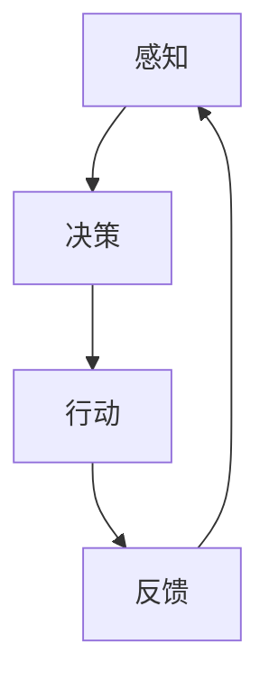

> AI Agent, 具身智能, 硬件设计, 机器学习, 深度学习, 传感器融合, 机器人技术, 交互式系统

# AI Agent: AI的下一个风口 具身智能在硬件设计中的应用

## 1. 背景介绍

随着人工智能技术的飞速发展，AI Agent作为人工智能的下一个风口，正逐渐成为科技行业的热门话题。AI Agent，即智能体，是一种能够感知环境、做出决策并采取行动的人工智能实体。它结合了机器学习、深度学习、传感器融合和机器人技术等先进技术，使得硬件设备不仅能够处理数据，还能自主地与环境交互，执行复杂任务。

### 1.1 AI Agent的定义与特点

AI Agent具有以下特点：

- **自主性**：AI Agent能够在没有人类干预的情况下自主运行。
- **适应性**：AI Agent能够根据环境变化调整自身行为。
- **交互性**：AI Agent能够与人类或其他系统进行交互。
- **学习能力**：AI Agent能够通过经验学习改进自身性能。

### 1.2 AI Agent在硬件设计中的应用现状

目前，AI Agent在硬件设计中的应用主要体现在以下几个方面：

- **智能家居**：如智能音箱、智能门锁等，能够通过语音或触控与用户进行交互。
- **工业自动化**：如机器人、自动化生产线等，能够自动执行生产任务。
- **医疗健康**：如智能健康监测设备、手术机器人等，能够为人类提供医疗保健服务。

## 2. 核心概念与联系

### 2.1 核心概念原理

AI Agent的核心概念包括：

- **感知**：通过传感器获取环境信息。
- **决策**：根据感知到的信息做出决策。
- **行动**：执行决策，对环境产生影响。
- **学习**：通过经验改进自身性能。

### 2.2 核心概念架构的 Mermaid 流程图



### 2.3 关联技术

AI Agent的发展离不开以下技术的支持：

- **机器学习**：用于训练AI Agent的决策模型。
- **深度学习**：提供更强大的特征提取和模式识别能力。
- **传感器融合**：整合多种传感器数据，提高感知的准确性。
- **机器人技术**：实现AI Agent的物理行动。

## 3. 核心算法原理 & 具体操作步骤

### 3.1 算法原理概述

AI Agent的算法原理主要包括以下步骤：

1. **感知**：通过传感器获取环境信息，如温度、光照、声音等。
2. **特征提取**：对感知到的数据进行特征提取，如图像识别、语音识别等。
3. **决策**：根据提取的特征和预训练的模型做出决策。
4. **行动**：根据决策结果执行相应的物理行动。
5. **反馈**：收集行动结果，为下一次决策提供依据。

### 3.2 算法步骤详解

1. **数据收集与预处理**：收集传感器数据，并进行预处理，如滤波、归一化等。
2. **特征提取**：使用机器学习或深度学习算法提取特征，如CNN用于图像识别，RNN用于语音识别等。
3. **模型训练**：使用训练数据训练决策模型，如神经网络、决策树等。
4. **决策与行动**：根据决策模型和实时数据做出决策，并执行相应的物理行动。
5. **反馈与学习**：收集行动结果，用于更新决策模型或改进算法。

### 3.3 算法优缺点

#### 优点：

- **自主性**：AI Agent能够自主运行，无需人类干预。
- **适应性**：AI Agent能够根据环境变化调整自身行为。
- **交互性**：AI Agent能够与人类或其他系统进行交互。
- **学习能力**：AI Agent能够通过经验学习改进自身性能。

#### 缺点：

- **计算资源需求**：AI Agent需要较高的计算资源支持。
- **数据依赖**：AI Agent的性能依赖于训练数据的质量和数量。
- **解释性**：AI Agent的决策过程往往缺乏可解释性。

### 3.4 算法应用领域

AI Agent的应用领域包括：

- **智能家居**：如智能音箱、智能门锁等。
- **工业自动化**：如机器人、自动化生产线等。
- **医疗健康**：如智能健康监测设备、手术机器人等。
- **无人驾驶**：如自动驾驶汽车、无人机等。

## 4. 数学模型和公式 & 详细讲解 & 举例说明

### 4.1 数学模型构建

AI Agent的数学模型主要包括以下部分：

- **感知模型**：用于处理传感器数据，如CNN、RNN等。
- **决策模型**：用于做出决策，如神经网络、决策树等。
- **行动模型**：用于执行行动，如PID控制器、模型预测控制等。

### 4.2 公式推导过程

以CNN为例，其公式推导过程如下：

$$
h^{[l]} = \text{ReLU}(W^{[l]}h^{[l-1]} + b^{[l]})
$$

其中，$h^{[l]}$ 表示第 $l$ 层的激活函数输出，$W^{[l]}$ 表示第 $l$ 层的权重，$b^{[l]}$ 表示第 $l$ 层的偏置，$\text{ReLU}$ 表示ReLU激活函数。

### 4.3 案例分析与讲解

以自动驾驶汽车为例，其AI Agent的数学模型如下：

- **感知模型**：使用CNN对摄像头采集的图像进行处理，提取道路、车辆、行人等关键信息。
- **决策模型**：使用RNN分析车辆行驶轨迹，预测未来行驶路径，并做出转向、加速、刹车等决策。
- **行动模型**：使用模型预测控制算法控制车辆执行相应的行动。

## 5. 项目实践：代码实例和详细解释说明

### 5.1 开发环境搭建

- 安装Python、PyTorch、TensorFlow等编程语言和深度学习框架。
- 安装OpenCV、NumPy等图像处理库。
- 安装ROS（机器人操作系统）。

### 5.2 源代码详细实现

以下是一个简单的AI Agent示例代码：

```python
import cv2
import numpy as np
import torch
import torch.nn as nn
import torch.optim as optim

# 感知模型：CNN
class PerceptModel(nn.Module):
    def __init__(self):
        super(PerceptModel, self).__init__()
        self.conv1 = nn.Conv2d(3, 32, kernel_size=3, stride=1, padding=1)
        self.relu = nn.ReLU()
        self.pool = nn.MaxPool2d(kernel_size=2, stride=2)
    
    def forward(self, x):
        x = self.relu(self.conv1(x))
        x = self.pool(x)
        return x

# 决策模型：RNN
class DecisionModel(nn.Module):
    def __init__(self, input_size, hidden_size, output_size):
        super(DecisionModel, self).__init__()
        self.rnn = nn.LSTM(input_size, hidden_size, batch_first=True)
        self.fc = nn.Linear(hidden_size, output_size)
    
    def forward(self, x, h0):
        x, _ = self.rnn(x, h0)
        x = self.fc(x[:, -1, :])
        return x

# 行动模型：PID控制器
class ActionModel(nn.Module):
    def __init__(self):
        super(ActionModel, self).__init__()
        self.pid = PID(kp=1.0, ki=0.1, kd=0.05)
    
    def forward(self, x):
        return self.pid.update(x)

# 初始化模型
percept_model = PerceptModel()
decision_model = DecisionModel(input_size=32, hidden_size=64, output_size=4)
action_model = ActionModel()

# 初始化优化器
optimizer = optim.Adam([percept_model.parameters(), decision_model.parameters(), action_model.parameters()], lr=0.001)

# 训练模型
for epoch in range(100):
    # ...获取数据、计算损失、更新参数...

# 运行AI Agent
while True:
    # ...获取感知数据、预测决策、执行行动...
```

### 5.3 代码解读与分析

以上代码展示了AI Agent的基本结构，包括感知模型、决策模型和行动模型。感知模型使用CNN提取图像特征，决策模型使用RNN分析轨迹并预测路径，行动模型使用PID控制器控制车辆执行行动。

### 5.4 运行结果展示

在实际运行中，AI Agent会根据摄像头采集的图像，通过CNN提取特征，然后使用RNN进行决策，最后通过PID控制器控制车辆行驶。运行结果可以直观地观察到AI Agent在道路上的行驶轨迹和行为。

## 6. 实际应用场景

### 6.1 智能家居

AI Agent在智能家居中的应用主要体现在以下几个方面：

- **智能音箱**：通过语音识别和自然语言处理技术，实现语音交互，控制家中的家电设备。
- **智能门锁**：通过指纹识别、人脸识别等技术，实现智能解锁，提高家庭安全。
- **智能照明**：根据环境光线和用户需求，自动调节室内灯光。

### 6.2 工业自动化

AI Agent在工业自动化中的应用主要体现在以下几个方面：

- **机器人**：在生产线上进行物料搬运、装配、检测等任务。
- **自动化生产线**：实现生产过程的自动化，提高生产效率和质量。
- **智能巡检**：定期对设备进行巡检，及时发现并处理故障。

### 6.3 医疗健康

AI Agent在医疗健康中的应用主要体现在以下几个方面：

- **智能健康监测设备**：如智能血压计、血糖仪等，实时监测用户的健康状况。
- **手术机器人**：在手术过程中辅助医生进行操作，提高手术精度和安全性。
- **药物研发**：利用AI Agent进行药物筛选和毒性预测，加速新药研发进程。

## 7. 工具和资源推荐

### 7.1 学习资源推荐

- 《深度学习》 - Ian Goodfellow, Yoshua Bengio, Aaron Courville
- 《Python机器学习》 - Sebastian Raschka, Vahid Mirjalili
- 《机器人：智能体的设计与实现》 - Ronald Arkin

### 7.2 开发工具推荐

- PyTorch
- TensorFlow
- OpenCV
- ROS

### 7.3 相关论文推荐

- "Deep Learning for Autonomous Navigation" - Sergey Levine et al.
- "Learning from Demonstrations with Deep Reinforcement Learning" - John Schulman et al.
- "Sim-to-Real Transfer of Robotics Controls" - Sergey Levine et al.

## 8. 总结：未来发展趋势与挑战

### 8.1 研究成果总结

AI Agent作为人工智能的下一个风口，具有巨大的发展潜力和应用前景。通过对感知、决策、行动等关键环节的研究，AI Agent已经能够应用于智能家居、工业自动化、医疗健康等多个领域。

### 8.2 未来发展趋势

- **多模态感知**：AI Agent将融合多种传感器数据，如视觉、听觉、触觉等，提高感知的全面性和准确性。
- **强化学习**：AI Agent将采用强化学习算法，实现更复杂、更智能的行为控制。
- **跨领域迁移**：AI Agent将具备跨领域迁移能力，能够在不同环境中快速适应。

### 8.3 面临的挑战

- **计算资源**：AI Agent需要大量的计算资源支持，尤其是在进行实时决策和行动时。
- **数据依赖**：AI Agent的性能依赖于训练数据的质量和数量，如何获取高质量的数据是一个挑战。
- **安全性**：AI Agent的行为可能对人类和环境造成影响，如何确保其安全性是一个重要问题。

### 8.4 研究展望

随着人工智能技术的不断发展，AI Agent将在未来发挥越来越重要的作用。通过解决计算资源、数据依赖和安全性等挑战，AI Agent将在更多领域得到应用，为人类社会创造更多价值。

## 9. 附录：常见问题与解答

**Q1：AI Agent与机器人有什么区别？**

A：AI Agent是人工智能的一种形式，强调的是智能体的自主性、适应性和交互性。而机器人是一种具体的硬件设备，强调的是执行物理任务的能力。AI Agent可以嵌入到机器人中，使其具备智能体的特性。

**Q2：AI Agent在智能家居中的应用有哪些？**

A：AI Agent在智能家居中的应用主要体现在智能音箱、智能门锁、智能照明等方面，为用户带来便捷、舒适、安全的居住体验。

**Q3：AI Agent在工业自动化中的应用有哪些？**

A：AI Agent在工业自动化中的应用主要体现在机器人、自动化生产线、智能巡检等方面，提高生产效率、降低成本、确保安全生产。

**Q4：AI Agent在医疗健康中的应用有哪些？**

A：AI Agent在医疗健康中的应用主要体现在智能健康监测设备、手术机器人、药物研发等方面，提高医疗服务质量、降低医疗成本、推动医疗行业创新。

**Q5：AI Agent的安全性如何保证？**

A：AI Agent的安全性主要从以下几个方面进行保证：
- **数据安全**：对训练数据和应用数据进行加密存储和传输。
- **隐私保护**：对用户数据进行脱敏处理，确保用户隐私。
- **安全监控**：对AI Agent的行为进行实时监控，发现异常行为及时处理。

作者：禅与计算机程序设计艺术 / Zen and the Art of Computer Programming