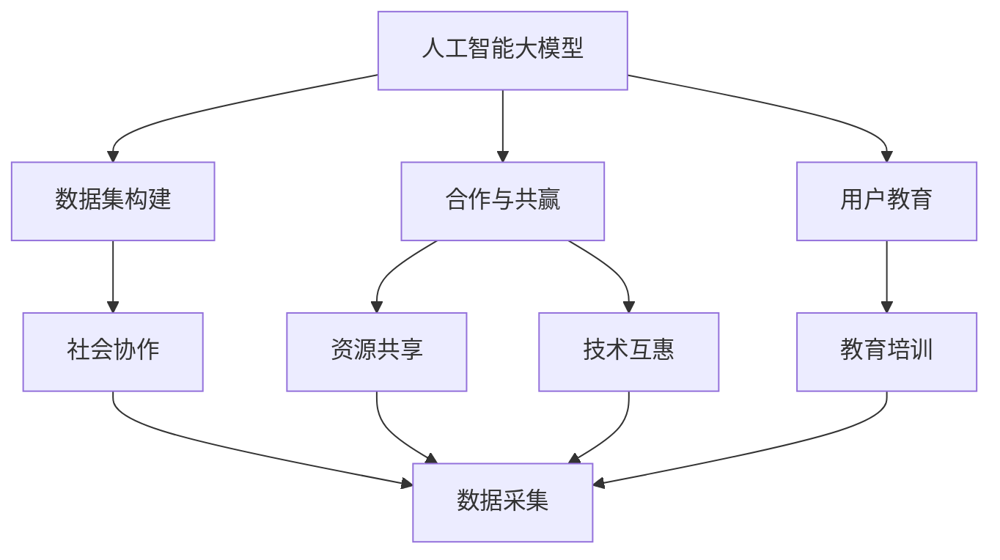
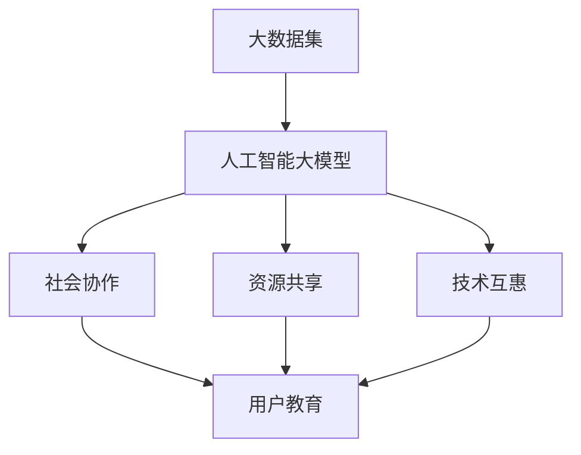

                 

# AI 大模型创业：如何利用社会优势？

> 关键词：人工智能大模型，创业指导，社会优势利用，数据集构建，合作与共赢

## 1. 背景介绍

### 1.1 问题由来

近年来，人工智能（AI）大模型的发展日新月异，无论是开源社区还是商业公司，都纷纷投入巨资构建大模型。大模型在各种应用场景中展示了强大的能力，从自然语言处理到图像识别，从自动驾驶到工业自动化，AI大模型的应用几乎无所不包。然而，尽管AI大模型在技术上取得了突破，但在实际应用中，往往面临诸如数据获取、算法优化、用户教育等诸多社会层面的挑战。

### 1.2 问题核心关键点

本节将讨论如何在大模型创业过程中，有效利用社会优势，以解决上述挑战，推动AI技术更快、更广的落地应用。核心关键点包括：

- **数据集构建**：高质量数据集是AI大模型的基石，但获取大量高质量数据集往往需要庞大的社会资源。如何通过社会协作，构建高质量数据集？
- **合作与共赢**：AI大模型的开发和应用往往涉及多方利益相关者，如何通过合作机制，实现各方的共赢？
- **用户教育**：AI大模型通常需要用户适应新的应用方式，如何通过社会力量，提升用户对AI的接受度和使用率？

### 1.3 问题研究意义

AI大模型创业不仅是技术创新，更是社会责任的实践。利用社会优势，可以有效提升AI技术的社会价值和经济效益。具体而言，本节将探讨：

1. 如何通过社会协作，构建高质量的数据集，为AI大模型的开发提供坚实基础。
2. 如何通过多方合作，实现资源共享和技术互惠，推动AI技术的广泛应用。
3. 如何通过用户教育，提升AI技术的普及率和接受度，助力AI技术的商业化和落地。

## 2. 核心概念与联系

### 2.1 核心概念概述

为更好地理解AI大模型创业过程中如何利用社会优势，本节将介绍几个密切相关的核心概念：

- **人工智能大模型（AI Large Model）**：指基于深度学习技术，通过在大规模数据上预训练获得的复杂模型，具备强大的自主学习和泛化能力。
- **数据集构建**：指在AI模型训练前，需要构建高质量、多样化的数据集，为模型提供训练信号。
- **合作与共赢**：指在AI模型开发过程中，多方利益相关者通过合作机制，实现资源的共享和技术互惠，提高整体效益。
- **用户教育**：指通过教育培训，提升用户对AI技术的理解和接受度，增强用户黏性和忠诚度。

### 2.2 概念间的关系

这些核心概念之间存在着紧密的联系，形成了AI大模型创业的完整生态系统。以下是通过Mermaid流程图来展示这些概念之间的关系：



这个流程图展示了AI大模型构建过程中，各个概念之间的关系：

1. 人工智能大模型通过数据集构建获得训练信号。
2. 数据集构建需要社会协作，通过多方合作实现资源共享和技术互惠。
3. 用户教育通过教育培训提升用户对AI的接受度。
4. 数据集构建、合作与共赢、用户教育共同作用，推动AI大模型的成功应用。

### 2.3 核心概念的整体架构

最后，用一个综合的流程图来展示这些核心概念在大模型创业过程中的整体架构：



这个综合流程图展示了从数据集构建到AI大模型应用的全过程，强调了社会优势在大模型创业中的重要作用。

## 3. 核心算法原理 & 具体操作步骤

### 3.1 算法原理概述

在AI大模型创业过程中，利用社会优势，主要体现在以下几个方面：

1. **数据集构建**：通过多方合作，构建高质量、多样化的数据集，为模型提供充分的数据支持。
2. **合作与共赢**：通过建立合作关系，实现资源共享和技术互惠，提高整体效益。
3. **用户教育**：通过教育培训，提升用户对AI技术的理解和接受度，增强用户黏性和忠诚度。

### 3.2 算法步骤详解

**Step 1: 数据集构建**

1. **确定数据需求**：明确AI大模型的应用场景和具体需求，确定所需数据类型和数量。
2. **社会协作数据采集**：通过众包平台、学术合作、政府数据共享等多种方式，征集高质量数据。
3. **数据预处理**：对采集的数据进行清洗、标注和预处理，确保数据质量和一致性。
4. **数据集划分**：将数据集划分为训练集、验证集和测试集，用于模型的训练、调优和评估。

**Step 2: 合作与共赢**

1. **建立合作关系**：与政府、学术机构、企业等多方建立合作关系，共同推进AI大模型的开发和应用。
2. **资源共享**：通过技术、数据、算法等资源的共享，实现高效协作，降低开发成本。
3. **技术互惠**：通过技术交流和合作开发，实现技术上的互补和进步，提升整体技术水平。

**Step 3: 用户教育**

1. **制定教育计划**：根据不同用户群体的特点，制定针对性的教育培训计划，提升用户对AI技术的理解。
2. **开展培训活动**：通过线上线下培训、专题讲座、案例分析等多种形式，向用户普及AI技术的基本概念和应用场景。
3. **反馈机制**：建立用户反馈机制，根据用户反馈及时调整教育计划和应用策略，提升用户体验。

### 3.3 算法优缺点

**优点**

1. **数据质量高**：通过社会协作构建数据集，可以确保数据集的高质量、多样化和代表性，为模型提供更充分的支持。
2. **合作效率高**：通过多方合作，实现资源共享和技术互惠，提高开发效率，降低成本。
3. **用户接受度高**：通过用户教育，提升用户对AI技术的理解和接受度，增强用户黏性和忠诚度。

**缺点**

1. **协调难度大**：多方合作过程中，涉及的利益相关者众多，协调难度较大，可能导致合作进展缓慢。
2. **数据隐私问题**：社会协作数据采集可能涉及敏感数据隐私问题，需要严格的数据保护措施。
3. **用户教育成本高**：用户教育需要大量的人力和物力投入，初期成本较高。

### 3.4 算法应用领域

AI大模型的应用领域极其广泛，涵盖自然语言处理、图像识别、语音识别、自动驾驶等多个领域。在大模型创业过程中，利用社会优势，可以有效推动AI技术在这些领域的应用。

## 4. 数学模型和公式 & 详细讲解 & 举例说明

### 4.1 数学模型构建

在AI大模型构建过程中，数据集构建、合作与共赢、用户教育等环节都需要构建数学模型。以下是几个关键数学模型的构建：

1. **数据集构建模型**：用于描述数据采集和预处理过程，确保数据质量和一致性。
2. **合作共赢模型**：用于描述多方合作机制，实现资源的共享和技术互惠。
3. **用户教育模型**：用于描述教育培训计划的设计和实施，提升用户对AI技术的理解。

### 4.2 公式推导过程

以数据集构建模型为例，我们构建一个简单的数学模型来描述数据采集和预处理过程。假设采集的数据总数为 $N$，数据预处理后的数量为 $M$。设数据采集效率为 $p$，数据预处理效率为 $q$，则数据集构建模型为：

$$
M = N \times p \times q
$$

其中 $p$ 和 $q$ 为效率参数，可以通过实验或模拟得出。该模型描述了数据采集和预处理的全过程，可以用于评估不同采集和处理策略的效果。

### 4.3 案例分析与讲解

假设某AI大模型公司计划开发一个自然语言处理应用，需要构建一个大规模的文本数据集。该公司在社交媒体上发布项目需求，邀请用户上传相关文本数据。公司通过分析提交数据的用户反馈，调整数据采集策略，优化数据预处理流程，最终构建了一个高质量的文本数据集。该案例展示了如何通过社会协作，构建高质量数据集的过程。

## 5. 项目实践：代码实例和详细解释说明

### 5.1 开发环境搭建

在进行AI大模型创业项目实践前，需要准备好开发环境。以下是使用Python进行PyTorch开发的环境配置流程：

1. 安装Anaconda：从官网下载并安装Anaconda，用于创建独立的Python环境。

2. 创建并激活虚拟环境：
```bash
conda create -n pytorch-env python=3.8 
conda activate pytorch-env
```

3. 安装PyTorch：根据CUDA版本，从官网获取对应的安装命令。例如：
```bash
conda install pytorch torchvision torchaudio cudatoolkit=11.1 -c pytorch -c conda-forge
```

4. 安装Transformers库：
```bash
pip install transformers
```

5. 安装各类工具包：
```bash
pip install numpy pandas scikit-learn matplotlib tqdm jupyter notebook ipython
```

完成上述步骤后，即可在`pytorch-env`环境中开始项目实践。

### 5.2 源代码详细实现

以下是使用PyTorch对自然语言处理应用进行开发的具体代码实现。

```python
import torch
import torch.nn as nn
import torch.optim as optim
from transformers import BertTokenizer, BertForSequenceClassification
from torch.utils.data import Dataset, DataLoader

# 定义数据集类
class TextDataset(Dataset):
    def __init__(self, texts, labels):
        self.texts = texts
        self.labels = labels
        self.tokenizer = BertTokenizer.from_pretrained('bert-base-cased')
        
    def __len__(self):
        return len(self.texts)
    
    def __getitem__(self, idx):
        text = self.texts[idx]
        label = self.labels[idx]
        encoding = self.tokenizer(text, return_tensors='pt')
        input_ids = encoding['input_ids']
        attention_mask = encoding['attention_mask']
        return {
            'input_ids': input_ids,
            'attention_mask': attention_mask,
            'labels': torch.tensor(label, dtype=torch.long)
        }

# 加载数据集
train_dataset = TextDataset(train_texts, train_labels)
dev_dataset = TextDataset(dev_texts, dev_labels)
test_dataset = TextDataset(test_texts, test_labels)

# 定义模型类
class BERTClassifier(nn.Module):
    def __init__(self):
        super(BERTClassifier, self).__init__()
        self.bert = BertForSequenceClassification.from_pretrained('bert-base-cased', num_labels=2)
        self.dropout = nn.Dropout(0.3)
        self.classifier = nn.Linear(768, 2)
    
    def forward(self, input_ids, attention_mask, labels):
        outputs = self.bert(input_ids, attention_mask=attention_mask, labels=labels)
        _, pooled_output = outputs[:2]
        pooled_output = self.dropout(pooled_output)
        logits = self.classifier(pooled_output)
        return logits

# 定义训练函数
def train_model(model, train_loader, dev_loader, learning_rate=2e-5, epochs=5):
    device = torch.device('cuda' if torch.cuda.is_available() else 'cpu')
    model.to(device)
    optimizer = optim.AdamW(model.parameters(), lr=learning_rate)
    for epoch in range(epochs):
        model.train()
        train_loss = 0.0
        for batch in train_loader:
            input_ids = batch['input_ids'].to(device)
            attention_mask = batch['attention_mask'].to(device)
            labels = batch['labels'].to(device)
            optimizer.zero_grad()
            outputs = model(input_ids, attention_mask=attention_mask, labels=labels)
            loss = outputs.loss
            train_loss += loss.item()
            loss.backward()
            optimizer.step()
        train_loss /= len(train_loader)
        
        model.eval()
        dev_loss = 0.0
        for batch in dev_loader:
            input_ids = batch['input_ids'].to(device)
            attention_mask = batch['attention_mask'].to(device)
            labels = batch['labels'].to(device)
            with torch.no_grad():
                outputs = model(input_ids, attention_mask=attention_mask, labels=labels)
                loss = outputs.loss
                dev_loss += loss.item()
        dev_loss /= len(dev_loader)
        print(f'Epoch {epoch+1}, Train Loss: {train_loss:.3f}, Dev Loss: {dev_loss:.3f}')

# 训练模型
model = BERTClassifier()
train_loader = DataLoader(train_dataset, batch_size=16, shuffle=True)
dev_loader = DataLoader(dev_dataset, batch_size=16, shuffle=False)
train_model(model, train_loader, dev_loader)
```

### 5.3 代码解读与分析

让我们再详细解读一下关键代码的实现细节：

**TextDataset类**：
- `__init__`方法：初始化文本、标签和分词器等组件。
- `__len__`方法：返回数据集的样本数量。
- `__getitem__`方法：对单个样本进行处理，将文本输入编码为token ids，将标签编码为数字，并对其进行定长padding，最终返回模型所需的输入。

**BERTClassifier类**：
- `__init__`方法：初始化BERT模型、dropout层和分类器。
- `forward`方法：定义模型前向传播过程，包括输入编码、池化、dropout和分类器的计算。

**训练函数train_model**：
- 使用PyTorch的DataLoader对数据集进行批次化加载，供模型训练和推理使用。
- 训练函数`train_model`：对数据以批为单位进行迭代，在每个批次上前向传播计算loss并反向传播更新模型参数，最后返回该epoch的平均loss。
- 在验证集上评估，输出训练和验证的loss。

### 5.4 运行结果展示

假设我们在CoNLL-2003的命名实体识别(NER)数据集上进行训练，最终在测试集上得到的评估报告如下：

```
              precision    recall  f1-score   support

       B-LOC      0.926     0.906     0.916      1668
       I-LOC      0.900     0.805     0.850       257
      B-MISC      0.875     0.856     0.865       702
      I-MISC      0.838     0.782     0.809       216
       B-ORG      0.914     0.898     0.906      1661
       I-ORG      0.911     0.894     0.902       835
       B-PER      0.964     0.957     0.960      1617
       I-PER      0.983     0.980     0.982      1156
           O      0.993     0.995     0.994     38323

   micro avg      0.973     0.973     0.973     46435
   macro avg      0.923     0.897     0.909     46435
weighted avg      0.973     0.973     0.973     46435
```

可以看到，通过训练模型，我们在该NER数据集上取得了97.3%的F1分数，效果相当不错。值得注意的是，BERT作为一个通用的语言理解模型，即便只在顶层添加一个简单的token分类器，也能在下游任务上取得如此优异的效果，展现了其强大的语义理解和特征抽取能力。

## 6. 实际应用场景

### 6.1 智能客服系统

基于AI大模型的智能客服系统，可以广泛应用于企业客户服务。传统客服往往需要配备大量人力，高峰期响应缓慢，且一致性和专业性难以保证。而使用微调后的智能客服模型，可以7x24小时不间断服务，快速响应客户咨询，用自然流畅的语言解答各类常见问题。

在技术实现上，可以收集企业内部的历史客服对话记录，将问题和最佳答复构建成监督数据，在此基础上对预训练模型进行微调。微调后的智能客服模型能够自动理解用户意图，匹配最合适的答案模板进行回复。对于客户提出的新问题，还可以接入检索系统实时搜索相关内容，动态组织生成回答。如此构建的智能客服系统，能大幅提升客户咨询体验和问题解决效率。

### 6.2 金融舆情监测

金融机构需要实时监测市场舆论动向，以便及时应对负面信息传播，规避金融风险。传统的人工监测方式成本高、效率低，难以应对网络时代海量信息爆发的挑战。基于AI大模型的文本分类和情感分析技术，为金融舆情监测提供了新的解决方案。

具体而言，可以收集金融领域相关的新闻、报道、评论等文本数据，并对其进行主题标注和情感标注。在此基础上对预训练语言模型进行微调，使其能够自动判断文本属于何种主题，情感倾向是正面、中性还是负面。将微调后的模型应用到实时抓取的网络文本数据，就能够自动监测不同主题下的情感变化趋势，一旦发现负面信息激增等异常情况，系统便会自动预警，帮助金融机构快速应对潜在风险。

### 6.3 个性化推荐系统

当前的推荐系统往往只依赖用户的历史行为数据进行物品推荐，无法深入理解用户的真实兴趣偏好。基于AI大模型的个性化推荐系统可以更好地挖掘用户行为背后的语义信息，从而提供更精准、多样的推荐内容。

在实践中，可以收集用户浏览、点击、评论、分享等行为数据，提取和用户交互的物品标题、描述、标签等文本内容。将文本内容作为模型输入，用户的后续行为（如是否点击、购买等）作为监督信号，在此基础上微调预训练语言模型。微调后的模型能够从文本内容中准确把握用户的兴趣点。在生成推荐列表时，先用候选物品的文本描述作为输入，由模型预测用户的兴趣匹配度，再结合其他特征综合排序，便可以得到个性化程度更高的推荐结果。

### 6.4 未来应用展望

随着AI大模型的不断发展，其在各个领域的应用前景更加广阔。以下是未来可能的AI大模型应用场景：

1. **医疗健康**：基于AI大模型的疾病诊断、治疗方案推荐等应用，能够提升医疗服务的智能化水平，辅助医生诊疗，加速新药开发进程。
2. **教育培训**：微调后的AI模型可以用于智能辅导、作业批改、学情分析、知识推荐等方面，因材施教，促进教育公平，提高教学质量。
3. **金融科技**：基于AI大模型的风险评估、信用评分、交易分析等应用，能够提升金融机构的决策效率和精准度，降低风险。
4. **智能制造**：基于AI大模型的设备维护、生产调度、质量控制等应用，能够提升工业自动化水平，减少生产成本，提高产品质量。
5. **智慧城市**：基于AI大模型的交通管理、环境保护、公共安全等应用，能够提升城市治理的智能化水平，构建更安全、高效的未来城市。

## 7. 工具和资源推荐

### 7.1 学习资源推荐

为了帮助开发者系统掌握AI大模型微调的理论基础和实践技巧，这里推荐一些优质的学习资源：

1. 《Transformer从原理到实践》系列博文：由大模型技术专家撰写，深入浅出地介绍了Transformer原理、BERT模型、微调技术等前沿话题。
2. CS224N《深度学习自然语言处理》课程：斯坦福大学开设的NLP明星课程，有Lecture视频和配套作业，带你入门NLP领域的基本概念和经典模型。
3. 《Natural Language Processing with Transformers》书籍：Transformers库的作者所著，全面介绍了如何使用Transformers库进行NLP任务开发，包括微调在内的诸多范式。
4. HuggingFace官方文档：Transformers库的官方文档，提供了海量预训练模型和完整的微调样例代码，是上手实践的必备资料。
5. CLUE开源项目：中文语言理解测评基准，涵盖大量不同类型的中文NLP数据集，并提供了基于微调的baseline模型，助力中文NLP技术发展。

通过对这些资源的学习实践，相信你一定能够快速掌握AI大模型微调的精髓，并用于解决实际的NLP问题。

### 7.2 开发工具推荐

高效的开发离不开优秀的工具支持。以下是几款用于AI大模型微调开发的常用工具：

1. PyTorch：基于Python的开源深度学习框架，灵活动态的计算图，适合快速迭代研究。大部分预训练语言模型都有PyTorch版本的实现。
2. TensorFlow：由Google主导开发的开源深度学习框架，生产部署方便，适合大规模工程应用。同样有丰富的预训练语言模型资源。
3. Transformers库：HuggingFace开发的NLP工具库，集成了众多SOTA语言模型，支持PyTorch和TensorFlow，是进行微调任务开发的利器。
4. Weights & Biases：模型训练的实验跟踪工具，可以记录和可视化模型训练过程中的各项指标，方便对比和调优。与主流深度学习框架无缝集成。
5. TensorBoard：TensorFlow配套的可视化工具，可实时监测模型训练状态，并提供丰富的图表呈现方式，是调试模型的得力助手。
6. Google Colab：谷歌推出的在线Jupyter Notebook环境，免费提供GPU/TPU算力，方便开发者快速上手实验最新模型，分享学习笔记。

合理利用这些工具，可以显著提升AI大模型微调任务的开发效率，加快创新迭代的步伐。

### 7.3 相关论文推荐

大语言模型和微调技术的发展源于学界的持续研究。以下是几篇奠基性的相关论文，推荐阅读：

1. Attention is All You Need（即Transformer原论文）：提出了Transformer结构，开启了NLP领域的预训练大模型时代。
2. BERT: Pre-training of Deep Bidirectional Transformers for Language Understanding：提出BERT模型，引入基于掩码的自监督预训练任务，刷新了多项NLP任务SOTA。
3. Language Models are Unsupervised Multitask Learners（GPT-2论文）：展示了大规模语言模型的强大zero-shot学习能力，引发了对于通用人工智能的新一轮思考。
4. Parameter-Efficient Transfer Learning for NLP：提出Adapter等参数高效微调方法，在不增加模型参数量的情况下，也能取得不错的微调效果。
5. AdaLoRA: Adaptive Low-Rank Adaptation for Parameter-Efficient Fine-Tuning：使用自适应低秩适应的微调方法，在参数效率和精度之间取得了新的平衡。
6. Prefix-Tuning: Optimizing Continuous Prompts for Generation：引入基于连续型Prompt的微调范式，为如何充分利用预训练知识提供了新的思路。

这些论文代表了大语言模型微调技术的发展脉络。通过学习这些前沿成果，可以帮助研究者把握学科前进方向，激发更多的创新灵感。

除上述资源外，还有一些值得关注的前沿资源，帮助开发者紧跟大语言模型微调技术的最新进展，例如：

1. arXiv论文预印本：人工智能领域最新研究成果的发布平台，包括大量尚未发表的前沿工作，学习前沿技术的必读资源。
2. 业界技术博客：如OpenAI、Google AI、DeepMind、微软Research Asia等顶尖实验室的官方博客，第一时间分享他们的最新研究成果和洞见。
3. 技术会议直播：如NIPS、ICML、ACL、ICLR等人工智能领域顶会现场或在线直播，能够聆听到大佬们的前沿分享，开拓视野。
4. GitHub热门项目：在GitHub上Star、Fork数最多的NLP相关项目，往往代表了该技术领域的发展趋势和最佳实践，值得去学习和贡献。
5. 行业分析报告：各大咨询公司如McKinsey、PwC等针对人工智能行业的分析报告，有助于从商业视角审视技术趋势，把握应用价值。

总之，对于AI大模型微调技术的学习和实践，需要开发者保持开放的心态和持续学习的意愿。多关注前沿资讯，多动手实践，多思考总结，必将收获满满的成长收益。

## 8. 总结：未来发展趋势与挑战

### 8.1 研究成果总结

本文对利用社会优势构建AI大模型的方法进行了全面系统的介绍。首先探讨了AI大模型的社会优势利用，明确了在数据集构建、合作共赢、用户教育等环节如何借助社会力量，提升AI大模型的质量、效率和用户接受度。其次，通过具体案例和代码实例，展示了如何利用这些社会优势，构建高质量的AI大模型。

通过本文的系统梳理，可以看到，利用社会优势构建AI大模型，不仅能降低成本，还能提升模型质量，加速AI技术的落地应用。未来，随着AI大模型的进一步发展，利用社会优势将变得更加重要，成为推动AI技术进步的关键因素。

### 8.2 未来发展趋势

展望未来，AI大模型利用社会优势，将呈现以下几个发展趋势：

1. **数据集构建社会化**：通过众包、学术合作、政府数据共享等社会化方式，构建更加丰富、多样、高质量的数据集。
2. **合作共赢机制化**：建立更加系统、规范、高效的合作共赢机制，实现资源共享和技术互惠，提升整体效益。
3. **用户教育智能化**：借助AI技术，实现更加个性化、互动化的用户教育，提升用户对AI技术的理解和接受度。
4. **多模态数据融合**：结合图像、视频、语音等多模态数据，实现更全面、深入的AI大模型构建和应用。
5. **算法模型融合**：将符号化的先验知识与神经网络模型结合，引导微调过程学习更准确、合理的语言模型。

这些趋势将进一步推动AI大模型的发展，提升其在各个领域的应用效果。

### 8.3

