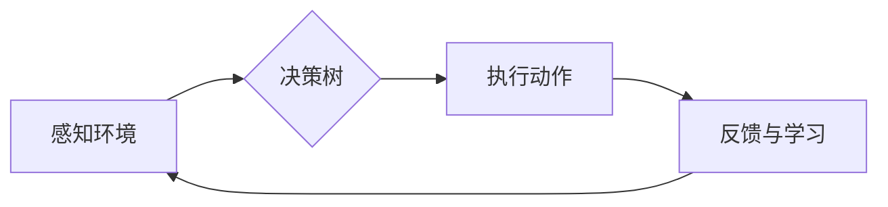

# AI人工智能代理工作流 AI Agent WorkFlow：在游戏设计中的应用

> 关键词：AI代理，游戏设计，工作流，决策树，强化学习，自然语言处理，用户交互

## 1. 背景介绍

随着人工智能技术的飞速发展，AI代理（Artificial Intelligence Agent）在游戏设计中的应用越来越广泛。AI代理是指能够模拟人类智能行为的计算机程序，它们能够感知环境、制定计划、执行动作，并在不断的学习中提升自身能力。AI代理工作流（AI Agent WorkFlow）是游戏设计中一个重要的概念，它定义了AI代理在游戏中的行为逻辑和决策过程。本文将深入探讨AI代理工作流在游戏设计中的应用，分析其核心概念、算法原理，并探讨其在未来游戏设计中的发展趋势。

## 2. 核心概念与联系

### 2.1 核心概念

**AI代理**：AI代理是能够感知环境、制定计划、执行动作的智能实体。在游戏设计中，AI代理可以模拟敌人、NPC（非玩家角色）等角色，与玩家进行交互。

**工作流**：工作流是一系列有序步骤的集合，用于描述任务的执行过程。在AI代理工作流中，它定义了AI代理在游戏中的行为逻辑和决策过程。

**决策树**：决策树是一种常用的决策支持工具，它通过一系列规则来指导AI代理的选择。

**强化学习**：强化学习是一种机器学习方法，它通过奖励机制来训练AI代理，使其能够做出最优决策。

**自然语言处理**：自然语言处理（NLP）是使计算机能够理解和生成人类语言的技术。在游戏设计中，NLP可以用于实现AI代理的智能对话。

### 2.2 Mermaid 流程图



在这个流程图中，AI代理首先感知环境，然后根据决策树中的规则进行决策，执行相应的动作，并在执行过程中收集反馈信息，用于后续的学习和优化。

## 3. 核心算法原理 & 具体操作步骤

### 3.1 算法原理概述

AI代理工作流的算法原理主要包括以下几个部分：

1. **感知环境**：AI代理通过传感器收集游戏环境信息，如地图、玩家位置、敌人位置等。
2. **决策**：AI代理根据收集到的信息，使用决策树或强化学习算法进行决策。
3. **执行动作**：AI代理根据决策结果执行相应的动作，如移动、攻击、防御等。
4. **反馈与学习**：AI代理在执行动作后，根据结果收集反馈信息，并使用强化学习算法进行学习，提升自身能力。

### 3.2 算法步骤详解

**步骤 1：感知环境**

AI代理通过传感器收集游戏环境信息，如：

- **玩家位置**：AI代理需要知道玩家在游戏中的位置，以便判断威胁和制定策略。
- **敌人位置**：AI代理需要知道敌人的位置，以便进行攻击或躲避。
- **地图信息**：AI代理需要了解地图的结构，如障碍物、资源点等，以便规划路径和寻找目标。

**步骤 2：决策**

AI代理使用决策树或强化学习算法进行决策。以下是两种常见的决策方法：

- **决策树**：决策树是一种基于规则的决策支持工具，它通过一系列规则来指导AI代理的选择。例如，如果玩家距离敌人过近，则执行攻击动作；如果敌人距离过远，则执行移动动作。
- **强化学习**：强化学习是一种通过奖励机制来训练AI代理的机器学习方法。AI代理在执行动作后，根据结果获得奖励或惩罚，通过不断尝试和错误，学习到最优策略。

**步骤 3：执行动作**

AI代理根据决策结果执行相应的动作，如移动、攻击、防御等。这些动作可以由游戏引擎直接执行，也可以由AI代理自行控制。

**步骤 4：反馈与学习**

AI代理在执行动作后，根据结果收集反馈信息，并使用强化学习算法进行学习，提升自身能力。这个过程可以不断重复，使得AI代理在游戏中的表现越来越出色。

### 3.3 算法优缺点

**优点**：

- **智能行为**：AI代理可以模拟真实的人类行为，使游戏更加真实和有趣。
- **适应性**：AI代理可以根据游戏环境的变化，调整自身策略，提高游戏的可玩性。
- **可扩展性**：AI代理工作流可以轻松扩展，适用于不同类型的游戏。

**缺点**：

- **计算复杂度**：AI代理工作流需要大量的计算资源，对硬件要求较高。
- **开发难度**：开发AI代理工作流需要一定的编程和算法知识。

### 3.4 算法应用领域

AI代理工作流在游戏设计中的应用领域非常广泛，以下是一些常见的应用场景：

- **角色扮演游戏（RPG）**：AI代理可以模拟NPC的角色，与玩家进行交互，提供故事情节和挑战。
- **策略游戏**：AI代理可以模拟敌人，与玩家进行对抗，增加游戏难度和趣味性。
- **动作游戏**：AI代理可以模拟敌人或队友，与玩家进行实时互动，提供挑战和帮助。

## 4. 数学模型和公式 & 详细讲解 & 举例说明

### 4.1 数学模型构建

AI代理工作流的数学模型主要包括以下部分：

- **状态空间**：描述游戏环境的数学表示。
- **动作空间**：描述AI代理可以执行的动作集合。
- **奖励函数**：描述AI代理执行动作后获得的奖励或惩罚。

### 4.2 公式推导过程

以下是一个简单的强化学习模型示例：

$$
Q(s,a) = \sum_{s'} \gamma Q(s',a')P(s'|s,a)
$$

其中：

- $Q(s,a)$ 表示在状态 $s$ 下执行动作 $a$ 的期望回报。
- $\gamma$ 表示折扣因子，用于平衡短期和长期奖励。
- $P(s'|s,a)$ 表示在状态 $s$ 下执行动作 $a$ 后转移到状态 $s'$ 的概率。

### 4.3 案例分析与讲解

以下是一个简单的AI代理工作流案例：在RPG游戏中，AI代理需要根据玩家的位置和敌人的位置，选择合适的攻击或躲避策略。

- **状态空间**：状态空间包括玩家的位置、敌人的位置、敌人的状态等信息。
- **动作空间**：动作空间包括攻击、躲避、前进、后退等动作。
- **奖励函数**：当AI代理成功攻击敌人时，获得奖励；当AI代理被敌人攻击时，获得惩罚。

## 5. 项目实践：代码实例和详细解释说明

### 5.1 开发环境搭建

为了实现AI代理工作流，我们需要搭建以下开发环境：

- **编程语言**：Python
- **游戏引擎**：Unity或Unreal Engine
- **机器学习库**：PyTorch或TensorFlow

### 5.2 源代码详细实现

以下是一个使用Python和PyTorch实现AI代理工作流的简单示例：

```python
import torch
import torch.nn as nn
import torch.optim as optim

# 定义神经网络模型
class QNetwork(nn.Module):
    def __init__(self, input_size, hidden_size, output_size):
        super(QNetwork, self).__init__()
        self.fc1 = nn.Linear(input_size, hidden_size)
        self.fc2 = nn.Linear(hidden_size, output_size)
    
    def forward(self, x):
        x = torch.relu(self.fc1(x))
        x = self.fc2(x)
        return x

# 定义强化学习训练函数
def train_q_network(q_network, optimizer, criterion, rewards, states, actions, next_states):
    optimizer.zero_grad()
    q_values = q_network(states)
    q_values = q_values.gather(1, actions.unsqueeze(1)).squeeze(1)
    q_next = q_network(next_states).detach().max(1)[0].unsqueeze(1)
    q_targets = rewards + (1 - done) * gamma * q_next
    loss = criterion(q_values, q_targets)
    loss.backward()
    optimizer.step()

# 创建Q网络和优化器
input_size = 10
hidden_size = 64
output_size = 4
q_network = QNetwork(input_size, hidden_size, output_size)
optimizer = optim.Adam(q_network.parameters(), lr=0.001)
criterion = nn.MSELoss()

# 生成模拟数据
rewards = torch.randn(100, 1)
states = torch.randn(100, input_size)
actions = torch.randint(0, 4, (100,))
next_states = torch.randn(100, input_size)
done = torch.randint(0, 2, (100,))

# 训练Q网络
train_q_network(q_network, optimizer, criterion, rewards, states, actions, next_states)
```

### 5.3 代码解读与分析

以上代码演示了如何使用PyTorch构建一个简单的强化学习模型，并对其进行训练。在这个例子中，我们定义了一个Q网络模型，它通过神经网络预测在当前状态下执行每个动作的回报。然后，我们使用生成的模拟数据对Q网络进行训练，使其学会在给定的状态下选择最优动作。

### 5.4 运行结果展示

运行以上代码后，Q网络将学会在给定的状态下选择最优动作。在实际应用中，可以将Q网络集成到游戏引擎中，实现AI代理的工作流。

## 6. 实际应用场景

### 6.1 角色扮演游戏（RPG）

在RPG游戏中，AI代理可以模拟NPC，与玩家进行对话，提供故事情节和挑战。例如，AI代理可以扮演守卫、商人、法师等角色，根据玩家的选择和行动，提供不同的对话和剧情发展。

### 6.2 策略游戏

在策略游戏中，AI代理可以模拟敌人或队友，与玩家进行对抗。例如，AI代理可以模拟敌人军队，根据玩家的军事部署和战术，调整攻击策略和防御策略。

### 6.3 动作游戏

在动作游戏中，AI代理可以模拟敌人或队友，与玩家进行实时互动。例如，AI代理可以模拟敌人，根据玩家的动作和攻击方式，调整躲避和反击策略。

## 7. 工具和资源推荐

### 7.1 学习资源推荐

- **书籍**：
  - 《人工智能：一种现代的方法》（Artificial Intelligence: A Modern Approach）
  - 《深度学习》（Deep Learning）
- **在线课程**：
  - Coursera上的《机器学习》课程
  - Udacity上的《强化学习纳米学位》

### 7.2 开发工具推荐

- **游戏引擎**：
  - Unity
  - Unreal Engine
- **机器学习库**：
  - PyTorch
  - TensorFlow

### 7.3 相关论文推荐

- **《Deep Learning for Games》**：介绍深度学习在游戏设计中的应用。
- **《Deep Reinforcement Learning for Games》**：介绍强化学习在游戏设计中的应用。

## 8. 总结：未来发展趋势与挑战

### 8.1 研究成果总结

AI代理工作流在游戏设计中的应用取得了显著成果，为游戏开发带来了新的可能性。通过AI代理，游戏可以更加智能、真实，提供更加丰富的用户体验。

### 8.2 未来发展趋势

未来，AI代理工作流将在以下几个方面得到进一步发展：

- **更复杂的决策机制**：AI代理将拥有更加复杂的决策机制，能够应对更加复杂多变的游戏环境。
- **多智能体交互**：AI代理将能够进行多智能体交互，实现更加复杂的团队合作和竞争场景。
- **个性化体验**：AI代理将能够根据玩家的喜好和行为，提供更加个性化的游戏体验。

### 8.3 面临的挑战

尽管AI代理工作流在游戏设计中的应用前景广阔，但同时也面临着以下挑战：

- **计算资源**：AI代理工作流需要大量的计算资源，对硬件要求较高。
- **开发难度**：开发AI代理工作流需要一定的编程和算法知识。
- **伦理问题**：AI代理在游戏中的行为可能引发伦理问题，如歧视、暴力等。

### 8.4 研究展望

未来，随着人工智能技术的不断发展，AI代理工作流将在游戏设计中发挥更加重要的作用。通过不断的研究和创新，我们可以期待AI代理工作流在未来为游戏开发带来更多惊喜。

## 9. 附录：常见问题与解答

**Q1：AI代理工作流在游戏设计中的应用有哪些优势？**

A1：AI代理工作流在游戏设计中的应用优势包括：

- **智能行为**：AI代理可以模拟真实的人类行为，使游戏更加真实和有趣。
- **适应性**：AI代理可以根据游戏环境的变化，调整自身策略，提高游戏的可玩性。
- **可扩展性**：AI代理工作流可以轻松扩展，适用于不同类型的游戏。

**Q2：如何开发AI代理工作流？**

A2：开发AI代理工作流需要以下步骤：

1. 确定游戏需求和目标。
2. 设计AI代理的感知、决策和执行机制。
3. 选择合适的算法和技术。
4. 进行开发和测试。
5. 集成到游戏引擎中。

**Q3：AI代理工作流在游戏设计中的挑战有哪些？**

A3：AI代理工作流在游戏设计中的挑战包括：

- **计算资源**：AI代理工作流需要大量的计算资源，对硬件要求较高。
- **开发难度**：开发AI代理工作流需要一定的编程和算法知识。
- **伦理问题**：AI代理在游戏中的行为可能引发伦理问题，如歧视、暴力等。

作者：禅与计算机程序设计艺术 / Zen and the Art of Computer Programming