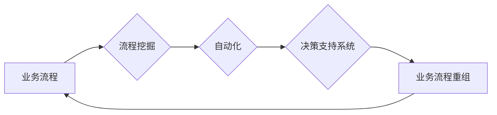

> 关键词：人工智能，业务流程重组，优化，自动化，机器学习，决策支持系统，流程挖掘

# AI在业务流程重组中的角色

在数字化转型的浪潮中，人工智能（AI）技术正在改变着企业运作的方方面面。其中，业务流程重组（Business Process Reengineering, BPR）是AI技术能够发挥显著作用的重要领域。本文将深入探讨AI在业务流程重组中的角色，包括核心概念、算法原理、实践案例、应用场景以及未来展望。

## 1. 背景介绍

### 1.1 问题的由来

随着市场竞争的加剧和消费者需求的不断变化，企业面临着提高效率、降低成本、增强竞争力的迫切需求。传统的业务流程往往存在着冗余、低效、复杂等问题，难以适应快速变化的市场环境。业务流程重组应运而生，旨在通过重新设计和优化业务流程，实现组织结构的扁平化、业务流程的自动化和信息系统的集成。

### 1.2 研究现状

近年来，AI技术的发展为业务流程重组提供了新的思路和方法。AI技术在流程挖掘、自动化决策、智能监控等方面的应用，为业务流程的优化带来了新的可能性。然而，AI在业务流程重组中的应用还处于初级阶段，存在诸多挑战和机遇。

### 1.3 研究意义

研究AI在业务流程重组中的角色，对于推动企业数字化转型、提升企业竞争力具有重要意义。通过AI技术，企业可以实现以下目标：

- 提高业务流程的效率，降低运营成本。
- 提升客户满意度，增强客户体验。
- 增强决策的科学性，提高决策效率。
- 促进企业文化的变革，推动组织结构的优化。

### 1.4 本文结构

本文将按照以下结构展开：

- 第2章介绍业务流程重组和AI技术的核心概念。
- 第3章阐述AI在业务流程重组中的核心算法原理和具体操作步骤。
- 第4章分析AI在业务流程重组中的数学模型和公式。
- 第5章通过项目实践展示AI在业务流程重组中的应用。
- 第6章探讨AI在业务流程重组中的实际应用场景。
- 第7章展望AI在业务流程重组中的未来发展趋势和挑战。
- 第8章总结全文，并提出研究展望。

## 2. 核心概念与联系

### 2.1 核心概念

**业务流程重组（BPR）**：指对企业的业务流程进行根本性的再思考和彻底的再设计，以实现戏剧性的改进，包括成本、质量、服务、速度等关键指标。
**人工智能（AI）**：模拟、延伸和扩展人的智能的理论、方法、技术及应用系统。
**流程挖掘（Process Mining）**：从运行数据中自动发现和提取业务流程信息的技术。
**自动化（Automation）**：通过技术手段减少人工干预，实现流程自动执行的过程。
**决策支持系统（DSS）**：提供信息和决策支持，帮助决策者进行有效决策的系统。

### 2.2 核心概念原理和架构的 Mermaid 流程图



在上述流程图中，业务流程经过流程挖掘提取信息，然后通过自动化和决策支持系统进行优化，最终实现业务流程重组。

## 3. 核心算法原理 & 具体操作步骤

### 3.1 算法原理概述

AI在业务流程重组中的应用主要包括以下几个方面：

- **流程挖掘**：通过分析企业运行的日志数据，识别流程中的异常、瓶颈和优化点。
- **自动化**：利用机器人流程自动化（RPA）等技术，将重复性任务自动化，减少人工干预。
- **机器学习**：通过机器学习算法，预测流程执行结果，优化流程决策。
- **深度学习**：利用深度学习模型，实现图像识别、语音识别等智能化功能，辅助流程执行。

### 3.2 算法步骤详解

1. **流程挖掘**：收集企业运行数据，如日志、事件等，使用流程挖掘工具分析流程的执行情况，识别流程中的异常、瓶颈和优化点。
2. **自动化**：根据流程挖掘结果，选择合适的自动化工具，如RPA，将重复性任务自动化。
3. **机器学习**：收集与流程相关的数据，使用机器学习算法，如分类、回归等，预测流程执行结果，优化流程决策。
4. **深度学习**：根据业务需求，选择合适的深度学习模型，如卷积神经网络（CNN）、循环神经网络（RNN）等，实现图像识别、语音识别等智能化功能。
5. **系统集成**：将流程挖掘、自动化、机器学习和深度学习等技术集成到企业现有的信息系统中，实现业务流程的优化和自动化。

### 3.3 算法优缺点

**优点**：

- **提高效率**：自动化和智能化技术可以显著提高业务流程的执行效率。
- **降低成本**：减少人工干预，降低运营成本。
- **增强决策**：基于数据的决策支持，提高决策的科学性和准确性。

**缺点**：

- **技术依赖**：需要投入大量资源进行技术学习和应用。
- **数据质量**：数据质量对算法的效果至关重要。
- **系统集成**：需要将多种技术集成到现有系统中，存在一定的挑战。

### 3.4 算法应用领域

AI在业务流程重组中的应用领域广泛，包括：

- **客户服务**：自动化客户服务流程，提高客户满意度。
- **供应链管理**：优化供应链流程，降低库存成本。
- **财务流程**：自动化财务流程，提高财务数据的准确性。
- **人力资源**：优化招聘流程，提高招聘效率。

## 4. 数学模型和公式 & 详细讲解 & 举例说明

### 4.1 数学模型构建

AI在业务流程重组中的数学模型主要包括：

- **分类模型**：用于预测流程的执行结果。
- **回归模型**：用于预测流程的执行时间或成本。
- **聚类模型**：用于识别流程中的异常和瓶颈。
- **时间序列模型**：用于预测流程未来的发展趋势。

### 4.2 公式推导过程

以分类模型为例，假设我们使用逻辑回归模型进行流程执行结果的预测，其目标函数为：

$$
J(\theta) = \frac{1}{m} \sum_{i=1}^{m}[-y^{(i)}\log(h_\theta(x^{(i)}) - (1-y^{(i)})\log(1-h_\theta(x^{(i)}))]
$$

其中，$m$ 是训练样本的数量，$y^{(i)}$ 是第 $i$ 个样本的真实标签，$h_\theta(x^{(i)})$ 是模型对第 $i$ 个样本的预测值。

### 4.3 案例分析与讲解

以一家零售企业的订单处理流程为例，使用机器学习模型预测订单处理时间。

1. **数据收集**：收集过去一年内所有订单的处理时间数据，包括订单类型、客户类型、产品类型等特征。
2. **数据预处理**：对数据进行清洗和规范化处理。
3. **模型训练**：使用逻辑回归模型进行训练，预测订单处理时间。
4. **模型评估**：使用测试集评估模型的预测准确性。
5. **模型应用**：将模型应用于新的订单，预测订单处理时间，并优化流程。

## 5. 项目实践：代码实例和详细解释说明

### 5.1 开发环境搭建

1. 安装Python和Anaconda。
2. 安装必要的库，如NumPy、Pandas、scikit-learn等。

### 5.2 源代码详细实现

以下是一个使用scikit-learn库实现逻辑回归模型的Python代码示例：

```python
from sklearn.linear_model import LogisticRegression
import pandas as pd

# 加载数据
data = pd.read_csv('order_processing.csv')
X = data.drop('processing_time', axis=1)
y = data['processing_time']

# 创建逻辑回归模型
model = LogisticRegression()

# 训练模型
model.fit(X, y)

# 预测
new_order = data.iloc[0]
prediction = model.predict([new_order])
```

### 5.3 代码解读与分析

上述代码首先加载数据，然后创建逻辑回归模型，使用训练数据训练模型，最后使用模型预测新的订单处理时间。

### 5.4 运行结果展示

假设预测结果为5天，可以将其与实际处理时间进行比较，评估模型的预测准确性。

## 6. 实际应用场景

### 6.1 客户服务

AI技术可以自动化客户服务流程，提高客户满意度。例如，通过聊天机器人（Chatbot）自动回答客户常见问题，减少人工客服的工作量。

### 6.2 供应链管理

AI技术可以优化供应链流程，降低库存成本。例如，使用预测分析技术预测产品需求，优化库存管理。

### 6.3 财务流程

AI技术可以自动化财务流程，提高财务数据的准确性。例如，使用机器学习模型识别异常交易，提高财务数据的可信度。

### 6.4 人力资源

AI技术可以优化招聘流程，提高招聘效率。例如，使用自然语言处理技术分析简历，筛选合适的候选人。

## 7. 工具和资源推荐

### 7.1 学习资源推荐

1. 《业务流程管理》
2. 《人工智能：一种现代的方法》
3. 《流程挖掘：理论与实践》

### 7.2 开发工具推荐

1. scikit-learn
2. TensorFlow
3. PyTorch
4. RPA工具（如UiPath、Automation Anywhere）

### 7.3 相关论文推荐

1. "Process Mining: Discovery, Conformance, and Improvement of Business Processes" - Wil van der Aalst
2. "The Quest for the Perfect Process: A Survey of Process Discovery and Conformance Checking Techniques" - Wil van der Aalst et al.
3. "Deep Learning for Process Mining" - Zdravko Markovski et al.

## 8. 总结：未来发展趋势与挑战

### 8.1 研究成果总结

AI技术在业务流程重组中的应用取得了显著成果，为提高企业效率和竞争力提供了新的途径。然而，AI在业务流程重组中的应用还面临着诸多挑战。

### 8.2 未来发展趋势

1. **多模态数据分析**：结合文本、图像、语音等多模态数据，更全面地分析业务流程。
2. **强化学习**：利用强化学习技术，实现更智能的流程决策。
3. **知识图谱**：利用知识图谱技术，实现更智能的流程推理和优化。

### 8.3 面临的挑战

1. **数据质量**：业务流程数据的准确性、完整性和一致性对AI应用的效果至关重要。
2. **模型解释性**：提高AI模型的解释性，增强用户对AI应用的信任。
3. **系统集成**：将AI技术与企业现有的信息系统集成，实现数据共享和流程协同。

### 8.4 研究展望

未来，AI技术在业务流程重组中的应用将更加广泛和深入，为企业的数字化转型提供强大的动力。

## 9. 附录：常见问题与解答

**Q1：AI在业务流程重组中的作用是什么？**

A：AI在业务流程重组中的作用主要包括流程挖掘、自动化、决策支持和系统集成等方面，旨在提高企业效率和竞争力。

**Q2：AI在业务流程重组中面临哪些挑战？**

A：AI在业务流程重组中面临的挑战主要包括数据质量、模型解释性和系统集成等方面。

**Q3：如何选择合适的AI技术进行业务流程重组？**

A：选择合适的AI技术进行业务流程重组需要考虑业务需求、数据特点、技术成熟度和成本等因素。

**Q4：AI在业务流程重组中的应用前景如何？**

A：AI在业务流程重组中的应用前景广阔，将为企业的数字化转型提供强大的动力。

---

作者：禅与计算机程序设计艺术 / Zen and the Art of Computer Programming