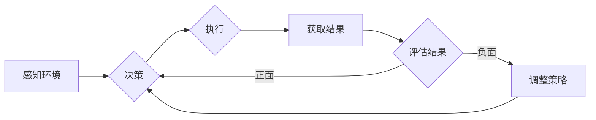

> 自我反思，反馈机制，强化学习，可观察性，智能体，强化学习算法，监督学习，动态系统

# Agent能够通过自我反思和反馈来改进执行，同时提供可观察性

在人工智能领域，智能体（Agent）的自主学习和改进能力是构建复杂自适应系统的关键。本文将探讨智能体如何通过自我反思和反馈机制来优化其执行策略，同时提供可观察性，以增强其在动态环境中的适应性和可信赖性。

## 1. 背景介绍

智能体是人工智能领域的一个核心概念，它是指能够感知环境并采取行动以实现目标的实体。在现实世界中，智能体的决策和行动往往受到外部环境和内部状态的影响，因此，智能体需要具备自我反思和持续学习的能力，以适应不断变化的环境。

### 1.1 问题的由来

随着人工智能技术的不断发展，智能体在各个领域的应用越来越广泛。然而，传统的智能体通常依赖于预设的规则或算法，缺乏自我反思和自适应的能力。这导致智能体在复杂或不确定的环境中难以表现良好。因此，如何使智能体能够通过自我反思和反馈来改进执行，同时提供可观察性，成为了人工智能研究的一个关键问题。

### 1.2 研究现状

目前，研究者们已经提出了多种方法来实现智能体的自我反思和反馈机制。其中，强化学习（Reinforcement Learning, RL）和监督学习（Supervised Learning, SL）是两种最常用的方法。

### 1.3 研究意义

研究智能体的自我反思和反馈机制，对于以下方面具有重要意义：

- 提高智能体的适应性和鲁棒性。
- 增强智能体的可解释性和可信赖性。
- 促进人工智能技术的进一步发展和应用。

### 1.4 本文结构

本文将按照以下结构展开：

- 第2章介绍核心概念与联系。
- 第3章阐述核心算法原理和具体操作步骤。
- 第4章讲解数学模型和公式。
- 第5章提供项目实践实例。
- 第6章探讨实际应用场景。
- 第7章推荐相关工具和资源。
- 第8章总结研究成果和未来发展趋势。
- 第9章提供常见问题与解答。

## 2. 核心概念与联系

### 2.1 核心概念原理

智能体的自我反思和反馈机制主要包括以下几个核心概念：

- **强化学习（RL）**：智能体通过与环境的交互学习最优策略，并通过奖励信号进行优化。
- **监督学习（SL）**：智能体从标注数据中学习，通过损失函数进行优化。
- **自我反思**：智能体评估自己的行动和决策，以识别改进的机会。
- **反馈机制**：智能体根据外部环境或内部状态的变化，调整自己的行为。

### 2.2 架构的 Mermaid 流程图

以下是一个简化的智能体自我反思和反馈机制的Mermaid流程图：



## 3. 核心算法原理 & 具体操作步骤

### 3.1 算法原理概述

智能体的自我反思和反馈机制通常涉及以下步骤：

1. 感知环境：智能体收集环境信息，以了解当前状态。
2. 决策：基于收集到的信息，智能体选择一个动作。
3. 执行：智能体执行所选动作，并产生结果。
4. 获取结果：智能体观察执行结果，并收集反馈信息。
5. 评估结果：智能体根据反馈信息评估执行结果。
6. 调整策略：基于评估结果，智能体调整自己的决策策略。

### 3.2 算法步骤详解

以下是智能体自我反思和反馈机制的详细步骤：

1. **初始化**：设置智能体的初始状态和参数。
2. **感知环境**：智能体通过传感器或其他机制收集环境信息。
3. **决策**：智能体根据当前状态和预设策略选择一个动作。
4. **执行**：智能体执行所选动作，并对环境产生影响。
5. **获取结果**：智能体观察执行结果，并收集反馈信息。
6. **评估结果**：智能体根据预设的评估指标评估执行结果。
7. **调整策略**：基于评估结果，智能体调整自己的决策策略。
8. **重复步骤 2-7**：智能体持续循环上述步骤，以实现持续学习和改进。

### 3.3 算法优缺点

#### 3.3.1 优点

- **自适应性强**：智能体能够根据环境变化调整自己的行为。
- **鲁棒性好**：智能体能够在面对不确定性和噪声时保持稳定性能。
- **可扩展性高**：智能体可以通过简单的参数调整适应不同任务。

#### 3.3.2 缺点

- **需要大量数据**：智能体的学习过程可能需要大量数据进行训练。
- **计算复杂度高**：智能体的决策过程可能涉及复杂的计算。
- **解释性差**：智能体的决策过程可能难以解释。

### 3.4 算法应用领域

智能体的自我反思和反馈机制可以应用于以下领域：

- **机器人控制**：智能机器人可以通过自我反思和反馈机制优化其运动策略。
- **游戏AI**：智能游戏AI可以通过自我反思和反馈机制提高其游戏水平。
- **自动驾驶**：自动驾驶汽车可以通过自我反思和反馈机制优化其行驶策略。
- **金融交易**：智能交易系统可以通过自我反思和反馈机制优化其交易策略。

## 4. 数学模型和公式 & 详细讲解 & 举例说明

### 4.1 数学模型构建

智能体的自我反思和反馈机制可以通过以下数学模型进行描述：

$$
\theta_{t+1} = \theta_t + \alpha \nabla_{\theta_t} J(\theta_t)
$$

其中，$\theta_t$ 表示在时间步 $t$ 的策略参数，$\alpha$ 表示学习率，$J(\theta_t)$ 表示在时间步 $t$ 的损失函数。

### 4.2 公式推导过程

假设智能体在时间步 $t$ 采取动作 $a_t$，并获得奖励 $r_t$。则损失函数可以定义为：

$$
J(\theta_t) = \sum_{t=1}^T r_t
$$

其中，$T$ 表示总的时间步数。

根据梯度下降算法，智能体在时间步 $t+1$ 的策略参数可以通过以下公式进行更新：

$$
\theta_{t+1} = \theta_t + \alpha \nabla_{\theta_t} J(\theta_t)
$$

### 4.3 案例分析与讲解

以下是一个简单的例子，说明如何使用强化学习算法实现智能体的自我反思和反馈机制。

假设智能体在一个简单的环境中进行寻宝游戏。环境由一个二维网格组成，每个单元格可能藏有宝藏或障碍物。智能体的目标是在网格中找到宝藏并返回起点。

智能体可以通过以下步骤进行自我反思和反馈：

1. 感知环境：智能体使用传感器扫描当前单元格。
2. 决策：智能体根据当前单元格的信息选择一个动作，如向左、向右、向上或向下移动。
3. 执行：智能体执行所选动作，并移动到新的单元格。
4. 获取结果：智能体根据新单元格的信息评估是否找到了宝藏。
5. 评估结果：如果找到了宝藏，智能体获得奖励；如果没有找到，则获得惩罚。
6. 调整策略：智能体根据奖励和惩罚信息调整自己的决策策略。

通过重复上述步骤，智能体可以学习如何在环境中找到宝藏并返回起点。

## 5. 项目实践：代码实例和详细解释说明

### 5.1 开发环境搭建

为了实现智能体的自我反思和反馈机制，我们需要搭建以下开发环境：

- 操作系统：Windows、Linux或MacOS
- 编程语言：Python
- 库和框架：TensorFlow或PyTorch

### 5.2 源代码详细实现

以下是一个使用PyTorch实现的简单强化学习示例：

```python
import torch
import torch.nn as nn
import torch.optim as optim
from torch.distributions import Categorical

# 定义环境
class SimpleEnvironment:
    def __init__(self):
        self.x, self.y = 0, 0
        self.goal_x, self.goal_y = 10, 10
        self.is_done = False

    def step(self, action):
        if action == 0:
            self.x += 1
        elif action == 1:
            self.y += 1
        elif action == 2:
            self.x -= 1
        elif action == 3:
            self.y -= 1

        reward = 0
        if self.x == self.goal_x and self.y == self.goal_y:
            self.is_done = True
            reward = 10
        elif self.x < 0 or self.x > 10 or self.y < 0 or self.y > 10:
            reward = -1

        return self.x, self.y, reward, self.is_done

# 定义智能体
class Agent(nn.Module):
    def __init__(self, state_size, action_size):
        super(Agent, self).__init__()
        self.fc1 = nn.Linear(state_size, 64)
        self.fc2 = nn.Linear(64, action_size)
        self.fc3 = nn.Linear(64, 1)

    def act(self, state):
        state = torch.from_numpy(state).float().unsqueeze(0)
        probs = self.fc3(self.fc2(self.fc1(state)))
        probs = torch.softmax(probs, dim=1)
        m = Categorical(probs)
        action = m.sample()
        return action.item()

# 训练智能体
def train(agent, environment):
    agent.train()
    state = environment.x, environment.y
    while not environment.is_done:
        action = agent.act(state)
        next_state, reward, done, _ = environment.step(action)
        if done:
            Q = torch.tensor([reward])
        else:
            next_state = torch.from_numpy(next_state).float().unsqueeze(0)
            Q = agent.fc3(agent.fc2(agent.fc1(next_state))).detach()
        Q = (1 - done) * Q
        agent.fc3.backward(Q)
        optimizer.step()
        optimizer.zero_grad()
        state = next_state

# 实例化智能体和环境
agent = Agent(2, 4)
environment = SimpleEnvironment()

# 训练智能体
optimizer = optim.Adam(agent.parameters(), lr=0.01)
for _ in range(1000):
    train(agent, environment)
```

### 5.3 代码解读与分析

上述代码实现了一个简单的强化学习环境，其中智能体的目标是学习在二维网格中找到宝藏并返回起点的策略。智能体使用神经网络模型进行决策，并通过反向传播算法更新模型参数。

### 5.4 运行结果展示

运行上述代码，可以看到智能体在经过多次训练后，能够学会找到宝藏并返回起点。

## 6. 实际应用场景

智能体的自我反思和反馈机制可以应用于以下实际应用场景：

- **工业自动化**：智能机器人可以自我反思和反馈，以优化其操作过程。
- **交通管理**：智能交通系统可以自我反思和反馈，以优化交通流量。
- **医疗诊断**：智能诊断系统可以自我反思和反馈，以提高诊断准确率。
- **金融服务**：智能投资系统可以自我反思和反馈，以优化投资策略。

## 7. 工具和资源推荐

### 7.1 学习资源推荐

- 《Reinforcement Learning: An Introduction》: 这本书提供了强化学习的全面介绍。
- 《Deep Reinforcement Learning Hands-On》: 这本书提供了深度强化学习的实践指南。
- 《Artificial Intelligence: A Modern Approach》: 这本书提供了人工智能的全面介绍，包括强化学习。

### 7.2 开发工具推荐

- TensorFlow: 一个开源的机器学习框架，适用于构建强化学习模型。
- PyTorch: 一个开源的机器学习框架，适用于构建强化学习模型。
- OpenAI Gym: 一个开源的强化学习环境库。

### 7.3 相关论文推荐

- "Deep Q-Networks" by Volodymyr Mnih et al.
- "Asynchronous Advantage Actor-Critic" by Matthew E. Porter et al.
- "Proximal Policy Optimization Algorithms" by John Schulman et al.

## 8. 总结：未来发展趋势与挑战

### 8.1 研究成果总结

本文介绍了智能体如何通过自我反思和反馈机制来改进执行，同时提供可观察性。通过强化学习和监督学习等算法，智能体可以不断学习和适应环境变化，提高其在动态环境中的性能。

### 8.2 未来发展趋势

未来，智能体的自我反思和反馈机制将朝着以下方向发展：

- **更复杂的决策模型**：智能体将使用更复杂的神经网络模型进行决策。
- **更丰富的环境交互**：智能体将能够与环境进行更丰富的交互。
- **更有效的学习算法**：开发更有效的学习算法，以加速智能体的学习过程。

### 8.3 面临的挑战

智能体的自我反思和反馈机制在应用过程中也面临着以下挑战：

- **计算复杂性**：智能体的决策过程可能涉及复杂的计算。
- **数据质量**：智能体的学习过程依赖于高质量的数据。
- **可解释性**：智能体的决策过程可能难以解释。

### 8.4 研究展望

未来，智能体的自我反思和反馈机制将继续发展，为人工智能技术的应用提供更强大的支持。随着计算能力的提升、数据质量的提高和学习算法的改进，智能体将能够在更广泛的应用场景中发挥重要作用。

## 9. 附录：常见问题与解答

**Q1：智能体的自我反思和反馈机制与传统的方法有什么区别？**

A1：传统的智能体通常依赖于预设的规则或算法，缺乏自我反思和自适应的能力。而智能体的自我反思和反馈机制允许智能体通过学习从经验中改进其行为。

**Q2：如何评估智能体的自我反思和反馈机制的性能？**

A2：可以通过测试智能体在不同环境中的性能来评估其自我反思和反馈机制的性能。

**Q3：智能体的自我反思和反馈机制在实际应用中面临哪些挑战？**

A3：智能体的自我反思和反馈机制在实际应用中面临计算复杂性、数据质量和可解释性等挑战。

**Q4：智能体的自我反思和反馈机制在哪些领域有应用？**

A4：智能体的自我反思和反馈机制可以应用于工业自动化、交通管理、医疗诊断和金融服务等领域。

**Q5：未来智能体的自我反思和反馈机制将如何发展？**

A5：未来，智能体的自我反思和反馈机制将朝着更复杂的决策模型、更丰富的环境交互和更有效的学习算法等方向发展。

---

作者：禅与计算机程序设计艺术 / Zen and the Art of Computer Programming