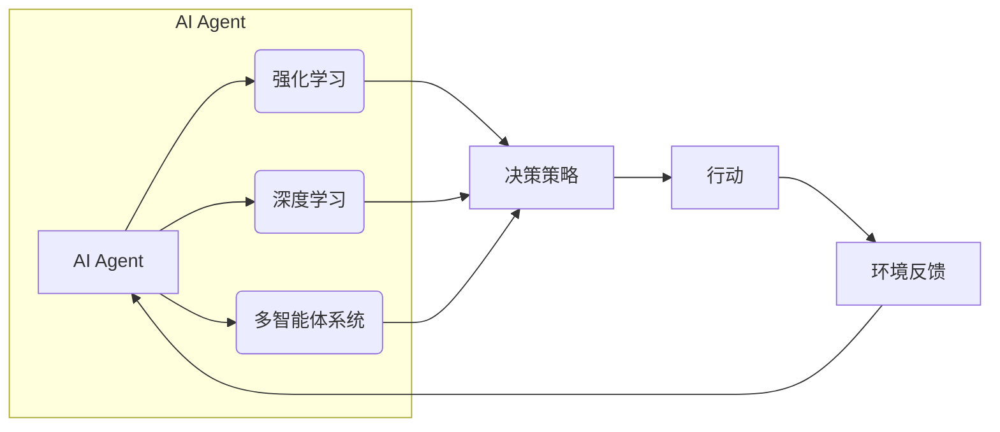

# AI Agent: AI的下一个风口 自主决策与人类的伦理界限

> 关键词：AI Agent, 机器学习, 自主决策, 伦理界限, 强化学习, 深度学习, 人工智能伦理

## 1. 背景介绍

随着人工智能技术的飞速发展，机器学习模型在各个领域取得了显著的成果。从图像识别到自然语言处理，从自动驾驶到医疗诊断，AI已经渗透到我们生活的方方面面。然而，随着AI能力的提升，一个重要的问题逐渐凸显：AI Agent——能够自主决策的智能体——如何在社会中存在，其决策过程是否遵循人类的伦理道德，以及如何界定其与人类之间的界限，成为了人工智能研究的重要议题。

### 1.1 问题的由来

AI Agent的出现，意味着AI不再仅仅是一个执行人类指令的工具，而是能够独立思考、自主行动的实体。这种能力的提升，一方面带来了前所未有的便利和效率，另一方面也引发了人们对AI潜在风险的担忧。例如，自动驾驶汽车在遇到紧急情况时，可能会面临道德困境，如“电车难题”中的抉择；AI在医疗诊断中可能因缺乏同情心而忽略患者的感受；甚至在金融领域，AI的决策可能导致市场波动，引发社会问题。

### 1.2 研究现状

目前，AI Agent的研究主要集中在以下几个方面：

- **强化学习**：通过与环境交互，学习最大化奖励的决策策略。
- **深度学习**：利用神经网络模型对数据进行学习，提高AI的智能水平。
- **多智能体系统**：研究多个AI Agent如何协同工作，实现复杂任务。
- **伦理和法律法规**：探讨AI Agent的伦理道德界限，以及相应的法律法规。

### 1.3 研究意义

研究AI Agent的自主决策与伦理界限，对于推动人工智能技术健康发展，构建和谐的人机社会具有重要意义：

- **技术进步**：推动AI Agent技术的研究，提升AI的智能水平和应用能力。
- **伦理规范**：明确AI Agent的伦理道德规范，保障AI技术的发展符合人类价值观。
- **法律法规**：制定相应的法律法规，规范AI Agent的开发和应用，防止潜在风险。

### 1.4 本文结构

本文将从AI Agent的核心概念与联系、算法原理、数学模型、项目实践、实际应用场景、工具和资源推荐等方面进行阐述，最后总结未来发展趋势与挑战。

## 2. 核心概念与联系

### 2.1 核心概念

- **AI Agent**：能够感知环境、自主决策并采取行动的智能体。
- **强化学习**：通过与环境交互，学习最大化奖励的决策策略。
- **深度学习**：利用神经网络模型对数据进行学习，提高AI的智能水平。
- **多智能体系统**：研究多个AI Agent如何协同工作，实现复杂任务。
- **伦理和法律法规**：探讨AI Agent的伦理道德界限，以及相应的法律法规。

### 2.2 核心概念原理和架构的 Mermaid 流程图



### 2.3 关系联系

如图所示，AI Agent通过强化学习、深度学习和多智能体系统等方法，学习决策策略，并采取行动。这些行动会得到环境的反馈，进而影响AI Agent的学习过程。

## 3. 核心算法原理 & 具体操作步骤

### 3.1 算法原理概述

AI Agent的核心算法主要包括强化学习、深度学习和多智能体系统等。

- **强化学习**：通过与环境交互，学习最大化奖励的决策策略。
- **深度学习**：利用神经网络模型对数据进行学习，提高AI的智能水平。
- **多智能体系统**：研究多个AI Agent如何协同工作，实现复杂任务。

### 3.2 算法步骤详解

#### 3.2.1 强化学习

1. 定义环境：定义状态空间、动作空间、奖励函数等。
2. 初始化策略：随机初始化策略参数。
3. 选择动作：根据当前状态和策略参数，选择动作。
4. 执行动作：在环境中执行动作，获得状态转移和奖励。
5. 更新策略：根据奖励和策略参数，更新策略参数。

#### 3.2.2 深度学习

1. 数据收集：收集训练数据。
2. 数据预处理：对数据进行清洗、归一化等处理。
3. 模型设计：设计神经网络模型。
4. 训练模型：使用训练数据训练模型。
5. 模型评估：使用验证数据评估模型性能。
6. 模型优化：根据评估结果，优化模型参数。

#### 3.2.3 多智能体系统

1. 定义智能体：定义每个智能体的行为规则和决策过程。
2. 环境建模：建立多智能体系统的环境模型。
3. 交互仿真：模拟多智能体系统在环境中的交互过程。
4. 结果分析：分析智能体的行为和系统性能。

### 3.3 算法优缺点

#### 3.3.1 强化学习

优点：
- 能够处理复杂决策问题。
- 能够适应动态环境。

缺点：
- 训练过程可能需要大量时间和资源。
- 难以解释决策过程。

#### 3.3.2 深度学习

优点：
- 能够处理高维数据。
- 能够自动学习特征表示。

缺点：
- 模型可解释性较差。
- 需要大量数据。

#### 3.3.3 多智能体系统

优点：
- 能够处理复杂任务。
- 能够提高系统的鲁棒性。

缺点：
- 系统设计复杂。
- 难以保证所有智能体的协同效果。

### 3.4 算法应用领域

强化学习、深度学习和多智能体系统在以下领域有广泛应用：

- 自动驾驶
- 游戏AI
- 机器人
- 金融

## 4. 数学模型和公式 & 详细讲解 & 举例说明

### 4.1 数学模型构建

#### 4.1.1 强化学习

假设状态空间为 $S$，动作空间为 $A$，奖励函数为 $R$，策略函数为 $\pi$，则强化学习的数学模型可以表示为：

$$
\pi(s) = P(a|s) \quad R(s,a,s') = R(s,a) + \gamma R(s')
$$

其中，$\gamma$ 为折扣因子，$s'$ 为动作 $a$ 后的状态。

#### 4.1.2 深度学习

假设输入数据为 $x$，输出数据为 $y$，则深度学习的数学模型可以表示为：

$$
y = f(x; \theta)
$$

其中，$f$ 为神经网络模型，$\theta$ 为模型参数。

### 4.2 公式推导过程

#### 4.2.1 强化学习

以Q学习为例，公式推导如下：

1. 初始化 $Q(s,a) = 0$，$s \in S, a \in A$。
2. 对于每个状态 $s$，随机选择动作 $a$，执行动作，获得状态转移 $s'$ 和奖励 $R$。
3. 更新 $Q(s,a)$：

$$
Q(s,a) \leftarrow Q(s,a) + \alpha [R + \gamma \max_{a'} Q(s',a') - Q(s,a)]
$$

其中，$\alpha$ 为学习率。

#### 4.2.2 深度学习

以多层感知器为例，公式推导如下：

1. 定义输入层、隐藏层和输出层。
2. 定义激活函数 $f$，如ReLU、Sigmoid等。
3. 定义损失函数，如均方误差、交叉熵等。
4. 使用梯度下降法更新模型参数。

### 4.3 案例分析与讲解

#### 4.3.1 自动驾驶

自动驾驶系统可以看作一个AI Agent，其目标是安全、高效地驾驶汽车。强化学习可以用于训练自动驾驶系统，使其学会在不同交通状况下做出正确的决策。

#### 4.3.2 机器人

机器人可以看作一个AI Agent，其目标是完成特定的任务。强化学习可以用于训练机器人，使其学会在各种环境中进行导航、抓取、组装等操作。

## 5. 项目实践：代码实例和详细解释说明

### 5.1 开发环境搭建

1. 安装Python环境。
2. 安装TensorFlow或PyTorch等深度学习框架。
3. 安装相关库，如NumPy、Scikit-learn等。

### 5.2 源代码详细实现

以下是一个简单的强化学习案例，使用PyTorch实现Q学习。

```python
import torch
import numpy as np

# 状态空间
S = np.array([[0, 0], [0, 1], [1, 0], [1, 1]])
# 动作空间
A = np.array([[0, 1], [1, 0]])
# 奖励函数
def R(s, a):
    if s[0] == 1 and a == 0:
        return -1
    else:
        return 0

# Q学习
def q_learning(S, A, R, alpha=0.1, gamma=0.9, episodes=1000):
    Q = np.zeros((len(S), len(A)))
    for episode in range(episodes):
        s = np.random.randint(0, len(S))
        a = np.random.randint(0, len(A))
        done = False
        while not done:
            s_next = np.random.randint(0, len(S))
            r = R(s, a)
            a_next = np.argmax(Q[s_next])
            Q[s, a] = Q[s, a] + alpha * (r + gamma * Q[s_next, a_next] - Q[s, a])
            a = a_next
            if a == 1:
                done = True
    return Q

Q = q_learning(S, A, R)
```

### 5.3 代码解读与分析

以上代码实现了Q学习算法。首先定义了状态空间、动作空间和奖励函数，然后使用Q学习算法训练Q值函数。最后，使用训练好的Q值函数进行决策。

## 6. 实际应用场景

AI Agent在以下领域有广泛应用：

- **自动驾驶**：自动驾驶汽车需要实时感知周围环境，做出决策，控制车辆行驶。
- **机器人**：机器人需要根据环境信息，进行导航、抓取、组装等操作。
- **游戏AI**：游戏AI可以模拟人类的智能行为，提高游戏的可玩性。
- **金融**：AI Agent可以用于风险评估、投资决策等。

### 6.4 未来应用展望

随着AI Agent技术的不断发展，未来将会有更多应用场景出现。例如：

- **智能家居**：AI Agent可以控制家庭设备，实现自动化、智能化管理。
- **教育**：AI Agent可以为学生提供个性化的学习方案，提高学习效率。
- **医疗**：AI Agent可以辅助医生进行诊断、治疗，提高医疗水平。

## 7. 工具和资源推荐

### 7.1 学习资源推荐

- 《深度学习》
- 《强化学习》
- 《人工智能：一种现代的方法》

### 7.2 开发工具推荐

- TensorFlow
- PyTorch
- OpenAI Gym

### 7.3 相关论文推荐

- Q-Learning
- Deep Q-Networks
- Policy Gradient Methods

## 8. 总结：未来发展趋势与挑战

### 8.1 研究成果总结

本文介绍了AI Agent的概念、算法原理、应用场景等，分析了AI Agent在未来发展趋势和面临的挑战。

### 8.2 未来发展趋势

- **多智能体系统**：研究多个AI Agent如何协同工作，实现更复杂的任务。
- **强化学习**：改进强化学习算法，提高AI Agent的决策能力。
- **伦理和法律法规**：制定相应的伦理和法律法规，规范AI Agent的开发和应用。

### 8.3 面临的挑战

- **伦理和道德**：如何确保AI Agent的决策符合人类的伦理道德。
- **安全性**：如何确保AI Agent的行为是安全的，避免对人类造成伤害。
- **可解释性**：如何提高AI Agent决策过程的可解释性，增强人类对AI的信任。

### 8.4 研究展望

随着AI Agent技术的不断发展，相信未来会在更多领域发挥重要作用，推动人工智能技术的进步和社会的发展。

## 9. 附录：常见问题与解答

**Q1：AI Agent是否会取代人类？**

A：AI Agent是人类创造的工具，其目的是辅助人类完成特定任务。AI Agent不会取代人类，而是与人类共同工作，提高生产效率和生活质量。

**Q2：AI Agent的决策过程如何保证其符合伦理道德？**

A：需要制定相应的伦理规范和法律法规，对AI Agent的决策过程进行约束，确保其符合人类的伦理道德。

**Q3：AI Agent是否会滥用权力？**

A：需要加强对AI Agent的监管，防止其滥用权力，对人类造成伤害。

**Q4：AI Agent的智能水平是否会超过人类？**

A：目前AI Agent的智能水平还远低于人类，但随着技术的发展，未来可能会出现超越人类的智能体。

**Q5：AI Agent是否会具有自主意识？**

A：目前AI Agent还不具备自主意识，它们仅仅是执行人类指令的工具。

作者：禅与计算机程序设计艺术 / Zen and the Art of Computer Programming