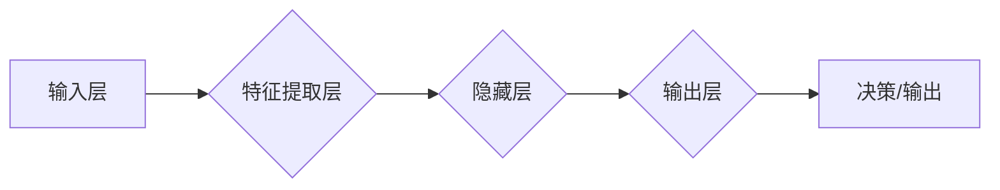

# AI与人类社会的未来发展

> 关键词：人工智能，社会发展，未来趋势，伦理挑战，技术融合，人机协作

## 1. 背景介绍

随着信息技术的飞速发展，人工智能（AI）已经渗透到人类生活的方方面面。从智能手机的语音助手到智能城市的智能交通系统，从医疗诊断的辅助工具到金融行业的风险管理，AI正在改变我们的工作方式、生活方式和思维方式。本文将探讨AI与人类社会的未来发展，分析AI带来的机遇与挑战，以及我们如何应对这些挑战。

### 1.1 人工智能的发展历程

人工智能的概念最早可追溯到20世纪50年代，经历了多个发展阶段。从早期的符号主义、连接主义到现在的深度学习，人工智能技术不断演进，逐渐从理论研究走向实际应用。

### 1.2 人工智能的当前状态

当前，深度学习已经成为人工智能领域的核心技术，并在图像识别、语音识别、自然语言处理等领域取得了突破性进展。同时，AI的硬件基础也得到了显著提升，GPU、TPU等专用硬件的普及为AI的快速发展提供了有力支撑。

### 1.3 人工智能的社会影响

AI的发展对社会产生了深远影响，既带来了巨大的经济效益，也引发了一系列社会问题。如何平衡AI的快速发展与人类社会伦理、就业、安全等方面的问题，成为我们必须面对的挑战。

## 2. 核心概念与联系

### 2.1 人工智能核心概念

- **机器学习（Machine Learning）**：使计算机通过数据和算法从经验中学习并做出决策的过程。
- **深度学习（Deep Learning）**：一种特殊的机器学习方法，通过多层神经网络模拟人脑处理信息的方式。
- **自然语言处理（Natural Language Processing，NLP）**：使计算机能够理解和生成人类语言的技术。
- **计算机视觉（Computer Vision）**：使计算机能够理解和解释视觉信息的技术。

### 2.2 AI架构Mermaid流程图



在这个流程图中，输入层接收外部数据，特征提取层提取数据特征，隐藏层通过神经网络处理特征，输出层生成决策或输出，最终实现对输入数据的理解和响应。

## 3. 核心算法原理 & 具体操作步骤

### 3.1 算法原理概述

人工智能的核心算法主要包括机器学习算法、深度学习算法等。这些算法通过学习数据中的模式和规律，实现对未知数据的预测和分类。

### 3.2 算法步骤详解

1. 数据收集：收集大量标注数据，用于训练模型。
2. 数据预处理：对数据进行清洗、归一化等处理。
3. 模型选择：选择合适的算法和模型架构。
4. 训练模型：使用标注数据训练模型。
5. 评估模型：使用测试数据评估模型性能。
6. 模型优化：根据评估结果调整模型参数。
7. 模型部署：将模型应用到实际场景中。

### 3.3 算法优缺点

- **优点**：
  - 自动化程度高，能够处理大量数据。
  - 模型可扩展性强，能够适应不同场景。
  - 模型可解释性强，有助于理解数据中的规律。
- **缺点**：
  - 需要大量标注数据。
  - 模型训练时间较长。
  - 模型可能存在过拟合问题。

### 3.4 算法应用领域

人工智能算法在众多领域都有广泛应用，如：

- **医疗健康**：疾病诊断、药物研发、健康管理等。
- **金融科技**：风险控制、欺诈检测、智能投顾等。
- **工业制造**：生产优化、质量控制、设备预测性维护等。
- **交通运输**：自动驾驶、智能交通系统、物流优化等。
- **教育**：个性化学习、智能辅导、教育评估等。

## 4. 数学模型和公式 & 详细讲解 & 举例说明

### 4.1 数学模型构建

人工智能的数学模型主要包括概率模型、决策树、支持向量机、神经网络等。

### 4.2 公式推导过程

以神经网络为例，其基本公式如下：

$$
y = f(W \cdot x + b)
$$

其中，$y$ 是输出，$W$ 是权重矩阵，$x$ 是输入向量，$b$ 是偏置向量，$f$ 是激活函数。

### 4.3 案例分析与讲解

以图像识别为例，使用卷积神经网络（CNN）进行猫狗分类。

1. 数据收集：收集大量猫狗图片数据。
2. 数据预处理：对图片进行裁剪、缩放、翻转等处理。
3. 模型选择：选择合适的CNN模型架构，如VGG、ResNet等。
4. 训练模型：使用标注数据训练模型。
5. 评估模型：使用测试数据评估模型性能。
6. 模型优化：根据评估结果调整模型参数。
7. 模型部署：将模型应用到实际场景中，实现对新图片的猫狗分类。

## 5. 项目实践：代码实例和详细解释说明

### 5.1 开发环境搭建

1. 安装Python环境。
2. 安装深度学习框架，如TensorFlow、PyTorch等。
3. 准备训练数据集。

### 5.2 源代码详细实现

以下是一个简单的CNN模型代码示例：

```python
import tensorflow as tf

model = tf.keras.Sequential([
    tf.keras.layers.Conv2D(32, kernel_size=(3, 3), activation='relu', input_shape=(28, 28, 1)),
    tf.keras.layers.MaxPooling2D(pool_size=(2, 2)),
    tf.keras.layers.Flatten(),
    tf.keras.layers.Dense(128, activation='relu'),
    tf.keras.layers.Dense(1, activation='sigmoid')
])

model.compile(optimizer='adam', loss='binary_crossentropy', metrics=['accuracy'])
```

### 5.3 代码解读与分析

- `Conv2D` 层：用于提取图像特征。
- `MaxPooling2D` 层：用于降低图像分辨率，减少参数量。
- `Flatten` 层：将特征图展平成一维向量。
- `Dense` 层：全连接层，用于分类。

### 5.4 运行结果展示

通过训练和测试，可以得到模型的准确率、召回率等指标。

## 6. 实际应用场景

### 6.1 医疗健康

AI在医疗健康领域的应用包括：

- **疾病诊断**：辅助医生进行疾病诊断，如癌症、心血管疾病等。
- **药物研发**：加速药物研发过程，降低研发成本。
- **健康管理**：提供个性化健康管理方案，预防疾病。

### 6.2 金融科技

AI在金融科技领域的应用包括：

- **风险控制**：识别和预防金融风险，如欺诈、信用风险等。
- **智能投顾**：为投资者提供个性化的投资建议。
- **客户服务**：提供智能客服，提高客户服务效率。

### 6.3 工业制造

AI在工业制造领域的应用包括：

- **生产优化**：优化生产流程，提高生产效率。
- **质量控制**：检测产品质量，提高产品质量。
- **设备预测性维护**：预测设备故障，避免生产中断。

### 6.4 未来应用展望

随着AI技术的不断发展，未来AI将在更多领域得到应用，如：

- **教育**：个性化学习、智能辅导、教育评估。
- **农业**：智能农业、精准施肥、病虫害防治。
- **环保**：环境监测、污染治理、可持续发展。

## 7. 工具和资源推荐

### 7.1 学习资源推荐

- 《深度学习》（Goodfellow等著）
- 《Python深度学习》（François Chollet著）
- 《人工智能：一种现代的方法》（Stuart Russell和Peter Norvig著）

### 7.2 开发工具推荐

- TensorFlow
- PyTorch
- Keras

### 7.3 相关论文推荐

- "LeNet5: convolutional neural networks for image recognition"（LeCun等著）
- "AlexNet: Image classification with deep convolutional neural networks"（Krizhevsky等著）
- "Visual Geometry Group – CVPR 2015 paper"（Simonyan和Zisserman著）

## 8. 总结：未来发展趋势与挑战

### 8.1 研究成果总结

AI技术在过去几十年取得了长足的发展，并在多个领域取得了突破性进展。然而，AI的发展也面临着诸多挑战，如数据隐私、算法偏见、技术融合等。

### 8.2 未来发展趋势

- **多模态学习**：融合文本、图像、语音等多模态信息，实现更全面的信息理解和处理。
- **可解释性AI**：提高AI模型的透明度和可解释性，增强用户对AI的信任。
- **伦理AI**：关注AI伦理问题，确保AI技术造福人类社会。

### 8.3 面临的挑战

- **数据隐私**：如何保护用户数据隐私，防止数据泄露。
- **算法偏见**：如何避免AI算法中的偏见，确保公平公正。
- **技术融合**：如何将AI技术与其他技术（如物联网、大数据等）融合，构建更加智能的系统。

### 8.4 研究展望

未来，AI技术将在更多领域得到应用，为人类社会带来更多福祉。同时，我们也要关注AI技术带来的挑战，积极应对，推动AI技术健康发展。

## 9. 附录：常见问题与解答

**Q1：什么是人工智能？**

A：人工智能是指使计算机能够模拟人类智能行为的技术。

**Q2：人工智能有哪些应用领域？**

A：人工智能的应用领域非常广泛，包括医疗健康、金融科技、工业制造、交通运输、教育等。

**Q3：人工智能的发展前景如何？**

A：人工智能的发展前景非常广阔，有望在未来几十年内改变人类社会的生产方式、生活方式和思维方式。

**Q4：人工智能会取代人类吗？**

A：人工智能可以辅助人类完成一些重复性、危险性的工作，但无法完全取代人类的智慧和能力。

**Q5：如何学习人工智能？**

A：学习人工智能需要具备一定的数学、计算机科学基础，可以从以下资源入手：
- 《深度学习》（Goodfellow等著）
- 《Python深度学习》（François Chollet著）
- 《人工智能：一种现代的方法》（Stuart Russell和Peter Norvig著）

---

作者：禅与计算机程序设计艺术 / Zen and the Art of Computer Programming