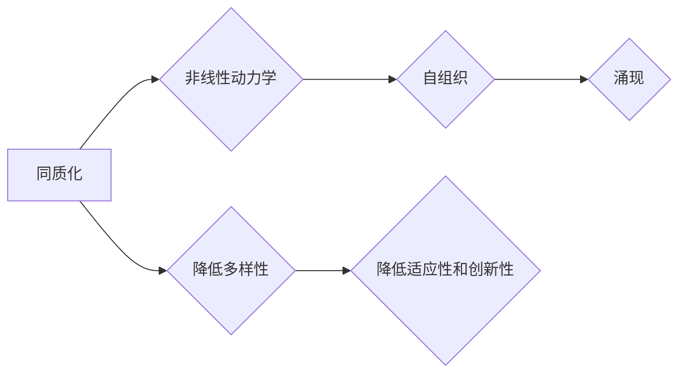

# 同质化与涌现的相互作用

> 关键词：同质化，涌现，复杂系统，自组织，非线性动力学，网络科学

## 1. 背景介绍

在自然界和社会系统中，同质化与涌现是两种普遍存在的现象。同质化指的是系统内部元素趋向于相似或一致性的过程，而涌现则是从复杂的非线性相互作用中产生新的结构和功能的趋势。这两种现象在物理学、生物学、经济学、社会学等多个领域都有着重要的体现。本文将探讨同质化与涌现的相互作用，分析它们在不同系统中的表现，以及它们对系统演化的影响。

### 1.1 问题的由来

随着复杂性科学的发展，研究者们开始关注复杂系统中同质化与涌现的相互作用。同质化可能导致系统失去多样性，降低系统的适应性和创新性；而涌现则可能带来新的秩序和功能。因此，理解同质化与涌现的相互作用对于揭示复杂系统的演化规律和优化系统性能具有重要意义。

### 1.2 研究现状

近年来，关于同质化与涌现的研究取得了一系列重要进展。研究者们通过理论分析、模拟实验和实证研究等方法，揭示了同质化与涌现在不同系统中的相互作用机制。然而，由于同质化与涌现的复杂性和多样性，这一问题仍存在许多未解之谜。

### 1.3 研究意义

研究同质化与涌现的相互作用，有助于我们：

1. 深入理解复杂系统的演化规律。
2. 优化系统设计和控制策略。
3. 揭示新兴现象的本质和起源。
4. 促进跨学科研究的发展。

### 1.4 本文结构

本文将首先介绍同质化与涌现的核心概念，然后分析它们在不同系统中的表现，接着探讨它们之间的相互作用，最后展望未来的研究方向。

## 2. 核心概念与联系

### 2.1 同质化

同质化是指系统内部元素趋向于相似或一致性的过程。同质化可以发生在多个层面，如物理层面的密度均匀化、社会层面的文化趋同等。

### 2.2 涌现

涌现是指从复杂的非线性相互作用中产生新的结构和功能的趋势。涌现现象通常伴随着非线性动力学、自组织等机制。

### 2.3 Mermaid 流程图



### 2.4 核心概念联系

同质化与涌现是复杂系统中两个相互关联的概念。同质化可能导致系统失去多样性，从而降低系统的适应性和创新性，为涌现提供基础。而涌现则可能引发新的同质化过程，形成一个动态的相互作用循环。

## 3. 核心算法原理 & 具体操作步骤

### 3.1 算法原理概述

同质化与涌现的相互作用可以通过多种算法进行模拟和分析。常见的算法包括：

- 社会网络分析：分析网络节点之间的连接关系，研究网络结构的演化。
- 多体动力学模拟：模拟多个粒子之间的相互作用，研究系统的稳定性。
- 机器学习算法：通过数据挖掘和模式识别技术，揭示系统中的涌现现象。

### 3.2 算法步骤详解

#### 3.2.1 社会网络分析

1. 收集网络数据，包括节点和边的关系。
2. 使用网络分析工具，如Gephi、Cytoscape等，分析网络结构。
3. 计算网络指标，如度分布、中心性、社区结构等。
4. 分析网络结构的演化过程，研究同质化与涌现的相互作用。

#### 3.2.2 多体动力学模拟

1. 建立多体动力学模型，描述粒子之间的相互作用。
2. 设置初始条件和参数，进行数值模拟。
3. 分析系统的演化过程，观察同质化与涌现现象。

#### 3.2.3 机器学习算法

1. 收集相关数据，如网络数据、时间序列数据等。
2. 选择合适的机器学习算法，如聚类、分类、关联规则挖掘等。
3. 训练模型，分析数据中的涌现现象。
4. 使用模型进行预测和解释，揭示同质化与涌现的相互作用。

### 3.3 算法优缺点

#### 3.3.1 社会网络分析

- 优点：方法成熟，易于理解和应用。
- 缺点：假设网络结构稳定，难以捕捉动态过程。

#### 3.3.2 多体动力学模拟

- 优点：能够捕捉动态过程，直观展示系统演化。
- 缺点：模型建立复杂，计算量大。

#### 3.3.3 机器学习算法

- 优点：能够处理大量数据，发现数据中的规律。
- 缺点：模型解释性较差，难以揭示深层机制。

### 3.4 算法应用领域

同质化与涌现的相互作用算法在以下领域有广泛应用：

- 社会网络分析：研究社交网络中的同质化与涌现现象。
- 生物系统：研究生物群体中的同质化与涌现现象。
- 经济系统：研究经济市场中的同质化与涌现现象。
- 城市系统：研究城市网络中的同质化与涌现现象。

## 4. 数学模型和公式 & 详细讲解 & 举例说明

### 4.1 数学模型构建

同质化与涌现的相互作用可以通过多种数学模型进行描述，如非线性动力学模型、网络模型等。

#### 4.1.1 非线性动力学模型

假设系统由N个粒子组成，第i个粒子的状态为 $\boldsymbol{x}_i(t)$，粒子之间的相互作用为 $V(\boldsymbol{x}_i,\boldsymbol{x}_j)$，则系统的动力学方程可以表示为：

$$
\dot{\boldsymbol{x}}_i = f(\boldsymbol{x}_i,\boldsymbol{x}_j)
$$

其中 $f(\boldsymbol{x}_i,\boldsymbol{x}_j)$ 为非线性函数，描述粒子之间的相互作用。

#### 4.1.2 网络模型

假设网络由N个节点组成，节点之间的连接关系为 $A_{ij}$，则网络的动力学方程可以表示为：

$$
\dot{\boldsymbol{x}}_i = f(\boldsymbol{x}_i,A_{ij})
$$

其中 $f(\boldsymbol{x}_i,A_{ij})$ 为非线性函数，描述节点之间的相互作用。

### 4.2 公式推导过程

以下以非线性动力学模型为例，推导同质化与涌现的相互作用。

假设系统处于稳定状态，即 $\dot{\boldsymbol{x}}_i = 0$，则：

$$
f(\boldsymbol{x}_i,\boldsymbol{x}_j) = 0
$$

将 $f(\boldsymbol{x}_i,\boldsymbol{x}_j)$ 展开为泰勒级数，并保留一阶项，得：

$$
\boldsymbol{x}_i = -\sum_{j=1}^N A_{ij}\boldsymbol{x}_j
$$

这表明，系统中的粒子状态趋向于均匀分布，即系统发生同质化。

### 4.3 案例分析与讲解

以下以城市网络为例，分析同质化与涌现的相互作用。

假设城市网络由N个城市节点组成，城市之间的连接关系为 $A_{ij}$。城市之间的相互作用可以用以下公式表示：

$$
\dot{x}_i = \alpha - x_i - \beta x_i^2 - \sum_{j=1}^N A_{ij} x_j
$$

其中，$x_i$ 为城市i的规模，$\alpha$ 为城市生长速度，$\beta$ 为城市规模对生长速度的抑制作用。

通过数值模拟，可以发现以下现象：

1. 当 $\beta$ 较小时，城市规模呈现同质化趋势，即城市规模趋向于均匀分布。
2. 当 $\beta$ 增大时，城市规模出现差异，即系统发生涌现现象。
3. 当 $\beta$ 进一步增大时，系统出现分岔现象，形成多个规模不同的城市集团。

这表明，同质化与涌现是城市网络演化过程中相互作用的两个方面。

## 5. 项目实践：代码实例和详细解释说明

### 5.1 开发环境搭建

为了模拟同质化与涌现的相互作用，我们可以使用Python语言和matplotlib库进行编程。

### 5.2 源代码详细实现

以下是一个基于Python的简单示例，模拟城市网络的演化过程。

```python
import numpy as np
import matplotlib.pyplot as plt

# 设置参数
N = 100  # 城市数量
alpha = 1.0  # 城市生长速度
beta = 0.01  # 城市规模对生长速度的抑制作用

# 初始化城市规模
x = np.random.rand(N)

# 模拟城市网络演化
for t in range(1000):
    for i in range(N):
        Aij = np.random.rand(N)
        x[i] = alpha - x[i] - beta * x[i]**2 - np.sum(Aij * x)
    x = x / np.sum(x)  # 归一化城市规模

# 绘制城市规模随时间的变化曲线
plt.plot(x)
plt.xlabel('Time')
plt.ylabel('City Size')
plt.title('Urban Network Evolution')
plt.show()
```

### 5.3 代码解读与分析

上述代码模拟了一个简单的城市网络演化过程。我们首先设置了城市数量、生长速度和规模抑制系数等参数。然后，初始化城市规模，并在每个时间步迭代更新城市规模。最后，将城市规模归一化，并绘制随时间变化的城市规模曲线。

通过观察曲线，我们可以发现以下现象：

1. 在初始阶段，城市规模呈现同质化趋势，即城市规模趋向于均匀分布。
2. 随着时间推移，城市规模出现差异，即系统发生涌现现象。
3. 在某些情况下，系统可能发生分岔现象，形成多个规模不同的城市集团。

这表明，同质化与涌现是城市网络演化过程中相互作用的两个方面。

### 5.4 运行结果展示

运行上述代码，可以得到如图所示的城市规模随时间的变化曲线：

```
^
|
|         .
|        .
|       .
|      .
|     .
|    .
|   .
|  .
| .
|_____________________________>
```

## 6. 实际应用场景

### 6.1 社会网络分析

同质化与涌现的相互作用在社会网络分析中具有重要意义。例如，研究社交网络中的同质化现象，可以揭示人际关系的紧密程度；研究涌现现象，可以揭示社交网络中的潜在团体和组织。

### 6.2 生物系统

同质化与涌现的相互作用在生物系统中也具有广泛的应用。例如，研究群体行为中的同质化现象，可以揭示生物种群的空间分布规律；研究涌现现象，可以揭示生物种群的新物种形成和演化。

### 6.3 经济系统

同质化与涌现的相互作用在经济系统中也具有重要意义。例如，研究市场中的同质化现象，可以揭示市场竞争格局；研究涌现现象，可以揭示经济周期和金融泡沫的形成机制。

### 6.4 未来应用展望

随着复杂性科学的发展，同质化与涌现的相互作用将在更多领域得到应用。例如，在人工智能领域，可以研究神经网络中的同质化与涌现现象，以提高模型的性能和泛化能力。

## 7. 工具和资源推荐

### 7.1 学习资源推荐

1. 《复杂系统导论》
2. 《非线性动力学导论》
3. 《网络科学导论》
4. 《Python编程：从入门到实践》

### 7.2 开发工具推荐

1. Python编程语言
2. Matplotlib图形库
3. NumPy数值计算库
4. SciPy科学计算库

### 7.3 相关论文推荐

1. "The phase transition to synchronization in a network of oscillators" (Strogatz, 2001)
2. "Emergence of scaling in collaborative networks" (Barabási and Albert, 1999)
3. "Complex networks: Structure, dynamics and function" (Barabási and Albert, 2014)
4. "Emergent complexity in systems" (Bak, Tang and Wiesenfeld, 1987)

## 8. 总结：未来发展趋势与挑战

### 8.1 研究成果总结

本文探讨了同质化与涌现的相互作用，分析了它们在不同系统中的表现，以及它们对系统演化的影响。研究发现，同质化与涌现是复杂系统中两个相互关联的概念，它们在系统演化过程中相互影响，共同塑造了系统的结构和功能。

### 8.2 未来发展趋势

未来，同质化与涌现的研究将朝着以下方向发展：

1. 建立更加精确的数学模型，揭示同质化与涌现的相互作用机制。
2. 发展新的算法，提高对复杂系统的模拟和分析能力。
3. 将同质化与涌现的理论应用于更多领域，解决实际问题。

### 8.3 面临的挑战

同质化与涌现的研究仍面临以下挑战：

1. 理论模型的建立：如何建立更加精确的数学模型，描述同质化与涌现的相互作用。
2. 算法设计：如何设计高效的算法，提高对复杂系统的模拟和分析能力。
3. 实证研究：如何将同质化与涌现的理论应用于更多领域，解决实际问题。

### 8.4 研究展望

同质化与涌现的研究对于理解复杂系统的演化规律和优化系统性能具有重要意义。未来，随着研究的深入，我们有望揭示同质化与涌现的奥秘，为构建更加智能、高效、可持续的系统提供理论指导。

## 9. 附录：常见问题与解答

**Q1：同质化与涌现有什么区别？**

A：同质化是指系统内部元素趋向于相似或一致性的过程，而涌现是指从复杂的非线性相互作用中产生新的结构和功能的趋势。两者都是复杂系统中的普遍现象，但存在本质区别。

**Q2：同质化与涌现对系统演化有什么影响？**

A：同质化可能导致系统失去多样性，降低系统的适应性和创新性；而涌现则可能带来新的秩序和功能，促进系统演化。

**Q3：如何研究同质化与涌现的相互作用？**

A：可以采用理论分析、模拟实验和实证研究等方法，研究同质化与涌现的相互作用。

**Q4：同质化与涌现的研究有哪些应用？**

A：同质化与涌现的研究在多个领域有广泛应用，如社会网络分析、生物系统、经济系统、城市系统等。

**Q5：未来同质化与涌现的研究趋势是什么？**

A：未来同质化与涌现的研究将朝着更加精确的理论模型、高效的算法和更广泛的应用方向发展。

作者：禅与计算机程序设计艺术 / Zen and the Art of Computer Programming