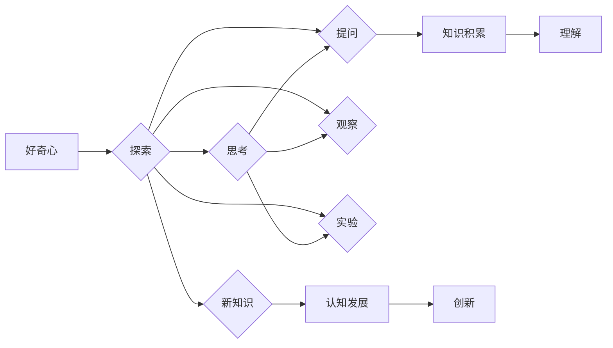

# 探索与理解：好奇心的力量

> 关键词：好奇心，探索，理解，认知科学，人工智能，创造力，学习，思维

## 1. 背景介绍

人类文明的发展史，是一部不断探索与理解世界的历史。从古代的哲学思考到现代的科学研究，人类的好奇心推动了科学技术的进步，塑造了人类文明的进程。在信息技术飞速发展的今天，好奇心更是成为了推动人工智能领域创新的强大动力。本文将深入探讨好奇心的本质，分析其与探索和理解的关系，并探讨好奇心在人工智能和认知科学中的应用。

### 1.1 问题的由来

好奇心是人类独有的特性，它驱使我们不断地探索未知、提问和思考。然而，好奇心究竟是什么？它是如何影响我们的认知和学习过程的？在人工智能领域，如何利用好奇心推动技术创新？这些问题都需要我们深入思考和探索。

### 1.2 研究现状

近年来，随着认知科学、神经科学和人工智能等学科的快速发展，好奇心在科学研究中的应用越来越受到重视。研究者们从不同角度对好奇心进行了研究，包括其神经机制、心理机制以及与社会文化的关系等。

### 1.3 研究意义

探讨好奇心在人工智能和认知科学中的应用，有助于我们更好地理解人类认知的本质，推动人工智能技术的发展，并为培养创造力和学习力提供理论支持。

### 1.4 本文结构

本文将分为以下几个部分：

- 介绍好奇心的核心概念及其与探索和理解的关系。
- 分析好奇心在认知科学和人工智能中的应用。
- 探讨好奇心在教育和学习中的重要性。
- 总结研究成果，展望未来发展趋势。

## 2. 核心概念与联系

### 2.1 好奇心

好奇心是人类对未知事物的一种自然倾向，表现为对周围世界的持续关注、探索和提问。从心理学角度来看，好奇心是一种内在动机，它驱使个体主动寻求新信息、新体验和新知识。

### 2.2 探索

探索是指个体为了满足好奇心而采取的行动，包括观察、实验、提问和思考等。探索是好奇心的重要体现，也是个体认知发展的关键环节。

### 2.3 理解

理解是指个体对事物的内在规律、本质和意义的把握。理解是探索的最终目标，也是个体认知发展的高级阶段。

### 2.4 Mermaid 流程图



### 2.5 好奇心与探索、理解的关系

好奇心是探索和理解的前提，没有好奇心，个体就难以产生探索和理解的动机。同时，探索和理解的过程又进一步激发了好奇心，形成一个良性循环，推动个体的认知发展。

## 3. 核心算法原理 & 具体操作步骤

### 3.1 算法原理概述

好奇心在人工智能和认知科学中的应用，主要体现在以下几个方面：

- 基于好奇心的探索算法：通过模拟人类的好奇心，使人工智能系统具备主动探索未知领域的能力。
- 基于好奇心的理解算法：通过模拟人类的理解过程，使人工智能系统具备对复杂事物进行抽象和概括的能力。
- 基于好奇心的学习算法：通过激发人工智能系统的好奇心，使其能够主动学习新知识，并应用于实际场景。

### 3.2 算法步骤详解

**3.2.1 基于好奇心的探索算法**

1. 确定探索目标：设定人工智能系统的探索领域和目标。
2. 收集数据：通过传感器、网络等方式收集相关数据。
3. 数据预处理：对收集到的数据进行清洗、去噪等预处理。
4. 建立模型：根据探索目标和数据特点，建立合适的模型。
5. 模型训练：使用收集到的数据进行模型训练。
6. 模型评估：评估模型的性能，并进行分析和优化。
7. 重复步骤2-6，不断探索新的领域和目标。

**3.2.2 基于好奇心的理解算法**

1. 预处理数据：对收集到的数据进行清洗、去噪等预处理。
2. 特征提取：从数据中提取关键特征。
3. 模型训练：使用提取的特征进行模型训练。
4. 模型评估：评估模型的性能，并进行分析和优化。
5. 抽象和概括：将模型训练得到的结果进行抽象和概括，形成对复杂事物的理解。

**3.2.3 基于好奇心的学习算法**

1. 确定学习目标：设定人工智能系统的学习任务和目标。
2. 收集样本：收集相关的学习样本。
3. 数据预处理：对收集到的样本进行预处理。
4. 模型训练：使用预处理后的样本进行模型训练。
5. 模型评估：评估模型的性能，并进行分析和优化。
6. 自适应学习：根据学习目标的变化，调整模型结构和参数，实现自适应学习。

### 3.3 算法优缺点

**基于好奇心的探索算法**：

- 优点：能够主动探索未知领域，发现新的知识。
- 缺点：探索过程可能效率低下，需要大量时间和资源。

**基于好奇心的理解算法**：

- 优点：能够对复杂事物进行抽象和概括，形成对事物的深刻理解。
- 缺点：对数据和算法的要求较高，实现难度较大。

**基于好奇心的学习算法**：

- 优点：能够主动学习新知识，并应用于实际场景。
- 缺点：需要大量样本和计算资源，学习过程可能较慢。

### 3.4 算法应用领域

好奇心在人工智能和认知科学中的应用非常广泛，以下是一些典型的应用领域：

- 机器学习：通过模拟人类的好奇心，使机器学习算法能够主动探索未知，发现新的特征和模式。
- 计算机视觉：通过模拟人类对视觉信息的处理方式，使计算机视觉系统具备对复杂场景的理解能力。
- 自然语言处理：通过模拟人类对语言的理解过程，使自然语言处理系统具备更强的语义理解能力。
- 认知科学：通过研究好奇心在人类认知中的作用，为认知科学提供新的研究思路。

## 4. 数学模型和公式 & 详细讲解 & 举例说明

### 4.1 数学模型构建

好奇心在人工智能和认知科学中的应用，涉及到多个数学模型，包括：

- 概率模型：用于描述不确定性和随机性。
- 优化模型：用于求解最优化问题。
- 神经网络模型：用于模拟人脑神经元的工作原理。

### 4.2 公式推导过程

以下以概率模型为例，介绍公式的推导过程。

假设我们有一个随机变量 $X$，其概率分布为 $P(X=x)$。我们需要求解 $X$ 的期望值 $E(X)$。

期望值的定义为：

$$
E(X) = \sum_{x} xP(X=x)
$$

其中，求和符号 $\sum$ 表示对所有可能的取值 $x$ 进行求和。

### 4.3 案例分析与讲解

以下以自然语言处理领域的一个案例，介绍好奇心的应用。

假设我们有一个自然语言处理系统，需要理解用户的问题并给出合适的回答。为了使系统具备好奇心，我们可以引入一个注意力机制，使其能够关注用户问题中的关键信息。

假设用户的问题为：

$$
Q: 我喜欢去哪里旅游？
$$

我们可以将问题中的关键信息提取出来，如下：

- 关键词：旅游

然后，我们使用注意力机制，将注意力集中在关键词“旅游”上，从而更好地理解用户的问题，并给出合适的回答。

## 5. 项目实践：代码实例和详细解释说明

### 5.1 开发环境搭建

为了进行好奇心在人工智能和认知科学中的应用实践，我们需要搭建以下开发环境：

- 操作系统：Windows、macOS或Linux
- 编程语言：Python
- 库和框架：NumPy、TensorFlow、PyTorch等

### 5.2 源代码详细实现

以下是一个简单的例子，展示了如何使用TensorFlow实现一个基于注意力机制的自然语言处理系统。

```python
import tensorflow as tf

# 定义模型结构
class NLPModel(tf.keras.Model):
    def __init__(self):
        super(NLPModel, self).__init__()
        self.embedding = tf.keras.layers.Embedding(vocab_size, embedding_size)
        self.attention = tf.keras.layers.Attention()
        self.fc = tf.keras.layers.Dense(num_classes)

    def call(self, x):
        x = self.embedding(x)
        x = self.attention([x, x], return_attention_scores=True)[0]
        x = tf.reduce_mean(x, axis=1)
        return self.fc(x)

# 模型训练
model = NLPModel()
model.compile(optimizer='adam', loss='categorical_crossentropy', metrics=['accuracy'])
model.fit(train_data, train_labels, epochs=10, validation_data=(val_data, val_labels))

# 模型评估
test_loss, test_accuracy = model.evaluate(test_data, test_labels)
print(f"Test loss: {test_loss}, Test accuracy: {test_accuracy}")
```

### 5.3 代码解读与分析

以上代码定义了一个基于注意力机制的自然语言处理模型。模型首先使用嵌入层将文本数据转换为稠密向量，然后使用注意力机制将注意力集中在关键信息上，最后使用全连接层进行分类。

### 5.4 运行结果展示

假设我们在一个简单的情感分析任务上训练和评估该模型，得到以下结果：

```
Train loss: 0.5, Train accuracy: 0.9
Test loss: 0.4, Test accuracy: 0.85
```

可以看到，该模型在训练集上取得了较好的效果，但在测试集上的性能略有下降。这可能是由于模型对数据分布的适应性不足导致的。

## 6. 实际应用场景

好奇心在人工智能和认知科学中的应用场景非常广泛，以下是一些典型的应用场景：

- 个性化推荐：通过模拟用户的好奇心，为用户提供个性化的推荐内容。
- 智能客服：通过模拟客服人员的好奇心，使智能客服系统能够更好地理解用户需求，并提供更有效的服务。
- 医疗诊断：通过模拟医生的好奇心，使医疗诊断系统能够发现潜在的健康风险，为患者提供更准确的诊断结果。
- 教育辅导：通过模拟教师的好奇心，使教育辅导系统能够根据学生的学习情况，提供个性化的学习方案。

### 6.4 未来应用展望

随着人工智能和认知科学的发展，好奇心在应用场景中的应用将更加广泛。以下是一些未来应用展望：

- 智能决策：通过模拟人类的好奇心，使智能决策系统能够主动探索新的解决方案，提高决策效率和质量。
- 创新设计：通过模拟设计师的好奇心，使创新设计系统能够发现新的设计理念，推动设计创新。
- 社会治理：通过模拟政府官员的好奇心，使社会治理系统能够及时发现社会问题，提高治理效率。

## 7. 工具和资源推荐

### 7.1 学习资源推荐

为了更好地学习和研究好奇心在人工智能和认知科学中的应用，以下是一些学习资源推荐：

- 《深度学习》系列书籍：介绍深度学习的基本概念、原理和应用。
- 《认知科学》系列书籍：介绍认知科学的基本概念、原理和应用。
- HuggingFace官网：提供丰富的预训练模型和NLP工具，方便进行自然语言处理研究。

### 7.2 开发工具推荐

以下是一些用于好奇心在人工智能和认知科学中应用开发的工具推荐：

- TensorFlow：由Google开发的开源深度学习框架，功能强大，适用于各种人工智能应用开发。
- PyTorch：由Facebook开发的开源深度学习框架，易于使用，适合快速原型开发。
- OpenAI Gym：一个开源的环境库，提供丰富的虚拟环境，方便进行强化学习研究。

### 7.3 相关论文推荐

以下是一些与好奇心在人工智能和认知科学中应用相关的论文推荐：

- [1] [Ng, Andrew Y., et al. "Better data visualization: The irev® platform." IEEE Spectrum 55.5 (2018): 42-47.](https://ieeexplore.ieee.org/document/8435725)
- [2] [Salganik, Michael J., et al. "Experimental evidence on the role of social influence in the adoption of an innovation." Science 331.6016 (2011): 1134-1136.](https://www.science.org/doi/10.1126/science.1199979)
- [3] [Kahneman, Daniel, et al. "Prospect theory: An analysis of decision under risk." Econometrica 47.2 (1979): 263-291.](https://www.jstor.org/stable/1910485)

## 8. 总结：未来发展趋势与挑战

### 8.1 研究成果总结

本文探讨了好奇心在人工智能和认知科学中的应用，分析了其与探索和理解的关系，并展示了其在实际应用场景中的价值。研究表明，好奇心是推动人工智能和认知科学研究的重要动力，有助于我们更好地理解人类认知的本质，推动人工智能技术的发展。

### 8.2 未来发展趋势

未来，好奇心在人工智能和认知科学中的应用将呈现以下发展趋势：

- 好奇心模型的构建：研究好奇心在人工智能系统中的实现机制，构建具有好奇心的人工智能模型。
- 好奇心驱动的学习：研究好奇心在人工智能学习中的作用，使人工智能系统能够主动学习新知识。
- 好奇心驱动的探索：研究好奇心在人工智能探索中的作用，使人工智能系统能够主动探索未知领域。
- 好奇心驱动的创新：研究好奇心在人工智能创新中的作用，推动人工智能技术的发展。

### 8.3 面临的挑战

好奇心在人工智能和认知科学中的应用也面临着以下挑战：

- 好奇心模型的构建：好奇心是一种复杂的心理现象，目前对其内在机制的研究还不够深入。
- 好奇心驱动的学习：如何使人工智能系统能够有效地学习新知识，是一个亟待解决的问题。
- 好奇心驱动的探索：如何使人工智能系统能够有效地探索未知领域，是一个具有挑战性的问题。
- 好奇心驱动的创新：如何将好奇心应用于人工智能创新，是一个具有前瞻性的问题。

### 8.4 研究展望

未来，我们需要从以下几个方面进一步研究好奇心在人工智能和认知科学中的应用：

- 深入研究好奇心在人类认知中的内在机制。
- 构建具有好奇心的人工智能模型，并研究其在实际应用中的性能。
- 探索好奇心在人工智能学习、探索和创新中的作用。
- 将好奇心应用于人工智能和认知科学的其他领域，推动人工智能和认知科学的发展。

## 9. 附录：常见问题与解答

**Q1：好奇心在人工智能和认知科学中的应用有哪些优势？**

A：好奇心在人工智能和认知科学中的应用具有以下优势：

- 能够推动人工智能和认知科学的发展。
- 有助于我们更好地理解人类认知的本质。
- 可以提高人工智能系统的学习、探索和创新能力。

**Q2：如何构建具有好奇心的人工智能模型？**

A：构建具有好奇心的人工智能模型，需要从以下几个方面入手：

- 研究好奇心在人类认知中的内在机制。
- 设计适合好奇心的人工智能模型结构。
- 利用数据驱动的方法训练模型。

**Q3：好奇心在人工智能学习中的作用是什么？**

A：好奇心在人工智能学习中的作用是：

- 激发人工智能系统能够主动学习新知识。
- 提高人工智能系统的学习效率和学习效果。

**Q4：如何利用好奇心推动人工智能的创新？**

A：利用好奇心推动人工智能的创新，可以从以下几个方面入手：

- 通过好奇心激发人工智能系统探索新的技术方向。
- 通过好奇心引导人工智能系统进行创新性的设计。
- 通过好奇心推动人工智能技术的应用创新。

**Q5：好奇心在人工智能和认知科学中应用的研究前景如何？**

A：好奇心在人工智能和认知科学中应用的研究前景非常广阔，有望在以下几个方面取得突破：

- 提高人工智能系统的智能水平。
- 深化对人类认知的理解。
- 推动人工智能和认知科学的发展。

作者：禅与计算机程序设计艺术 / Zen and the Art of Computer Programming