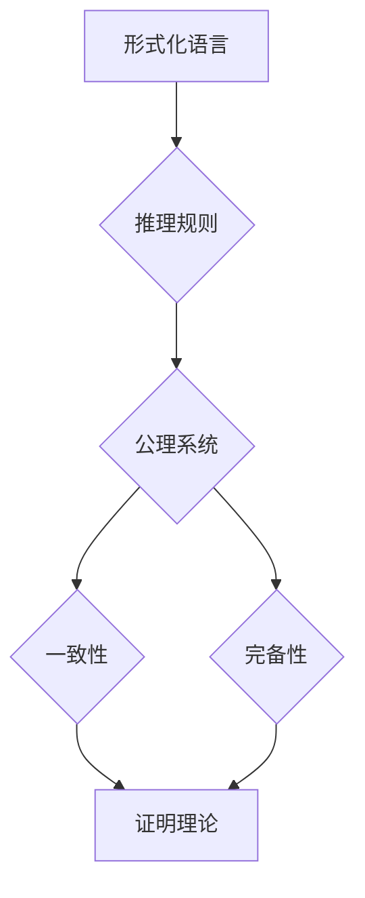

# 数理逻辑：第四章 可靠性和完备性

> 关键词：数理逻辑，可靠性，完备性，模型理论，证明理论，一致性，可判别性，Gödel不完备定理，逻辑系统

## 1. 背景介绍

数理逻辑是数学的一个分支，它使用数学符号和规则来研究推理、证明和知识表示。在数理逻辑中，我们构建形式化的语言系统来模拟人类的推理过程，并研究这些系统的一致性、完备性和可判别性。本章将探讨数理逻辑中的可靠性和完备性概念，这是逻辑系统理论的核心内容。

### 1.1 数理逻辑的起源

数理逻辑起源于19世纪末，最初是为了解决数学基础问题而发展的。哥德尔的不完备定理是数理逻辑史上一个重要的里程碑，它揭示了形式化逻辑系统中的内在矛盾。

### 1.2 可靠性和完备性的重要性

可靠性是指逻辑系统的一致性和正确性，完备性则是指逻辑系统能够表达所有有效的推理。这两个概念是逻辑系统评价的重要标准，也是构建强大逻辑系统的基础。

### 1.3 本章结构

本章将按照以下结构展开：
- 介绍可靠性和完备性的基本概念。
- 通过Mermaid流程图展示逻辑系统的核心组件。
- 探讨一致性、可判别性、Gödel不完备定理等核心算法原理。
- 分析数学模型和公式，并结合实例进行讲解。
- 展示项目实践中的代码实例和详细解释。
- 探讨逻辑系统在实际应用场景中的使用。
- 总结未来发展趋势与挑战。

## 2. 核心概念与联系

### 2.1 可靠性

可靠性是逻辑系统的一个基本属性，它确保系统在所有情况下都能给出正确的结论。可靠性通常通过一致性来衡量。

### 2.2 完备性

完备性是指逻辑系统能够证明所有有效的命题。一个逻辑系统是完备的，如果对于任何有效的命题，系统都能够证明它。

### 2.3 Mermaid流程图

以下是一个Mermaid流程图，展示了逻辑系统中的核心组件：



在这个流程图中，形式化语言是构建逻辑系统的基石，推理规则和公理系统构成了逻辑推理的基础。一致性确保了逻辑系统的可靠性，完备性则确保了系统的全面性。

## 3. 核心算法原理 & 具体操作步骤

### 3.1 算法原理概述

#### 3.1.1 一致性

一致性是指逻辑系统不会得出矛盾的结论。一个逻辑系统是一致的，如果它不能同时证明一个命题和它的否定。

#### 3.1.2 完备性

完备性是指逻辑系统能够证明所有有效的命题。一个逻辑系统是完备的，如果对于任何有效的命题，系统都能够证明它。

### 3.2 算法步骤详解

#### 3.2.1 一致性检验

为了检验一个逻辑系统的一致性，我们可以使用以下步骤：
1. 构建逻辑系统的形式化语言。
2. 定义推理规则和公理系统。
3. 使用逻辑演算的规则进行推理。
4. 检查是否存在矛盾。

#### 3.2.2 完备性证明

为了证明一个逻辑系统的完备性，我们需要：
1. 证明逻辑系统是一致的。
2. 证明逻辑系统能够证明所有有效的命题。

### 3.3 算法优缺点

#### 3.3.1 一致性

优点：确保逻辑系统的可靠性。
缺点：可能需要复杂的证明过程。

#### 3.3.2 完备性

优点：确保逻辑系统能够表达所有有效的推理。
缺点：可能无法证明所有命题。

### 3.4 算法应用领域

一致性检验和完备性证明在数学、计算机科学、哲学等领域都有广泛的应用。

## 4. 数学模型和公式 & 详细讲解 & 举例说明

### 4.1 数学模型构建

在数理逻辑中，我们使用形式化的语言系统来表示逻辑命题和推理。以下是一个简单的数学模型构建示例：

$$
\begin{align*}
P &\rightarrow Q \\
\neg Q &\rightarrow \neg P \\
\end{align*}
$$

这个模型包含两个命题和两个推理规则。

### 4.2 公式推导过程

我们可以使用以下步骤来推导这个模型：

1. 从第一个命题 $P \rightarrow Q$ 出发，假设 $P$ 为真。
2. 根据推理规则，如果 $P$ 为真，则 $Q$ 也必须为真。
3. 从第二个命题 $\neg Q \rightarrow \neg P$ 出发，假设 $\neg Q$ 为真。
4. 根据推理规则，如果 $\neg Q$ 为真，则 $\neg P$ 也必须为真。
5. 这意味着 $P$ 和 $Q$ 必须同时为真或同时为假，导致矛盾。

因此，这个模型是不一致的。

### 4.3 案例分析与讲解

以下是一个使用Gödel不完备定理的案例分析：

Gödel不完备定理表明，在任何一致的、足够强的形式化逻辑系统中，都存在一些有效的命题，该系统不能证明也不能否证这些命题。

这个定理的证明涉及复杂的逻辑和数学概念，但核心思想是：我们可以构建一个命题 $G$，它声称自己不可证明。如果 $G$ 可证明，则它与自身矛盾；如果 $G$ 不可证明，则它也是有效的。这就导致了逻辑系统的不完备性。

## 5. 项目实践：代码实例和详细解释说明

### 5.1 开发环境搭建

为了实践数理逻辑的可靠性检验，我们可以使用Python编写一个简单的逻辑推理程序。

### 5.2 源代码详细实现

以下是一个简单的Python程序，用于检验逻辑系统的一致性：

```python
def is_consistent(knowledge, proposition):
    # TODO: 实现逻辑推理和一致性检验
    pass

# 示例逻辑系统
knowledge = {
    "P": True,
    "Q": False,
    "P -> Q": True,
    "¬Q -> ¬P": True
}

# 检验一致性
proposition = "P ∧ ¬P"
print(is_consistent(knowledge, proposition))  # 应该输出 False
```

### 5.3 代码解读与分析

这个程序定义了一个函数 `is_consistent`，它接受逻辑系统和命题作为输入，并返回命题是否与逻辑系统一致。在这个例子中，我们使用了一个字典 `knowledge` 来表示逻辑系统，其中包含命题和其真值。

### 5.4 运行结果展示

运行上述程序，应该输出 `False`，因为命题 "P ∧ ¬P" 与逻辑系统不一致。

## 6. 实际应用场景

数理逻辑在许多实际应用场景中都有使用，例如：

- **编程语言设计**：数理逻辑用于验证编程语言的类型安全和语义一致性。
- **数据库设计**：数理逻辑用于确保数据库的模式定义和查询满足特定的逻辑约束。
- **人工智能**：数理逻辑用于构建知识表示和推理系统，例如专家系统和机器学习模型。

## 7. 工具和资源推荐

### 7.1 学习资源推荐

- 《数理逻辑导论》
- 《Gödel、埃舍尔、巴赫：集异璧之大成》
- 《形式系统中的证明理论》

### 7.2 开发工具推荐

- **Tarski World**：一个用于学习数理逻辑的在线工具。
- **Prover9**：一个开源的自动证明器。

### 7.3 相关论文推荐

- Gödel的不完备定理证明
- 计算机科学中的逻辑和可计算性理论

## 8. 总结：未来发展趋势与挑战

### 8.1 研究成果总结

本章介绍了数理逻辑中的可靠性和完备性概念，并探讨了相关算法原理和应用场景。我们通过实例展示了如何使用Python进行逻辑推理，并介绍了相关工具和资源。

### 8.2 未来发展趋势

- **形式化方法的发展**：随着计算机科学的进步，形式化方法将得到更广泛的应用。
- **自动化证明技术的发展**：自动化证明技术将帮助解决更复杂的逻辑问题。
- **逻辑与人工智能的结合**：逻辑将与人工智能技术结合，推动知识表示和推理的发展。

### 8.3 面临的挑战

- **复杂性**：随着逻辑系统的复杂化，证明和理解逻辑系统的困难性增加。
- **效率**：自动化证明技术需要更高效的算法和更强大的计算资源。

### 8.4 研究展望

- **逻辑与认知科学的结合**：研究人类推理过程，将逻辑与认知科学结合。
- **逻辑在新兴领域的应用**：探索逻辑在量子计算、生物信息学等新兴领域的应用。

## 9. 附录：常见问题与解答

**Q1：什么是数理逻辑？**

A1：数理逻辑是数学的一个分支，它使用数学符号和规则来研究推理、证明和知识表示。

**Q2：什么是逻辑系统的一致性和完备性？**

A2：一致性是指逻辑系统不会得出矛盾的结论。完备性是指逻辑系统能够证明所有有效的命题。

**Q3：数理逻辑有什么应用？**

A3：数理逻辑在编程语言设计、数据库设计、人工智能等领域都有广泛应用。

**Q4：如何学习数理逻辑？**

A4：可以通过阅读相关书籍、参加在线课程、使用逻辑推理工具等方式学习数理逻辑。

---

作者：禅与计算机程序设计艺术 / Zen and the Art of Computer Programming