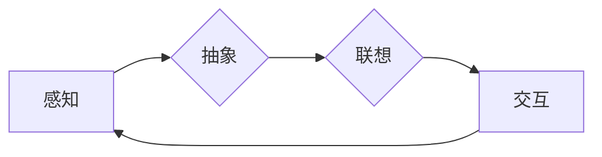

# 认知的形式化：思维的核心是抽象、联想和交互，抽象是结构形成的基础

> 关键词：认知形式化，抽象，联想，交互，思维结构，计算模型，人工智能

## 1. 背景介绍

人类认知的本质是什么？如何将这种复杂的认知过程形式化，并构建出能够模拟甚至超越人类认知能力的计算模型？这些问题一直是人工智能领域研究的核心议题。本文将从认知的形式化角度出发，探讨思维的核心要素——抽象、联想和交互，并分析它们在构建智能系统中的关键作用。

## 2. 核心概念与联系

### 2.1 核心概念

#### 2.1.1 抽象

抽象是认知的基础，它使得人类能够从纷繁复杂的现实世界中提取出本质特征，形成概念和模型。抽象可以看作是一种去芜存菁的过程，它帮助我们忽略非关键信息，集中精力处理核心问题。

#### 2.1.2 联想

联想是认知过程中另一个重要的环节，它指的是在感知到某个刺激时，联想到与之相关联的其他刺激或概念。联想使得思维具有连贯性和创造性，是知识积累和解决问题的关键。

#### 2.1.3 交互

交互是认知过程中的动态环节，它涉及个体与环境之间的信息交换。通过交互，个体不断调整自身的认知结构，以适应环境变化。

### 2.2 核心概念原理和架构的 Mermaid 流程图



在这个流程图中，感知是认知过程的起点，它将外部信息传递给抽象和联想过程。抽象从感知到的信息中提取出本质特征，形成概念和模型。联想则基于这些概念和模型，进行相关性的联想。最后，交互将个体的认知结构与环境进行互动，进一步调整和优化。

## 3. 核心算法原理 & 具体操作步骤

### 3.1 算法原理概述

认知形式化的目标是将抽象、联想和交互等认知过程转化为可计算的形式。以下是一些常见的算法原理：

#### 3.1.1 抽象

- 特征提取：从原始数据中提取关键特征。
- 概念化：将特征组合成概念和模型。

#### 3.1.2 联想

- 关联规则学习：发现数据之间的关联性。
- 聚类分析：将数据划分为具有相似性的群体。

#### 3.1.3 交互

- 强化学习：通过与环境的交互学习最优策略。
- 生成对抗网络：通过对抗性训练学习数据的分布。

### 3.2 算法步骤详解

以下是认知形式化的一般步骤：

1. 数据预处理：对原始数据进行清洗、转换等操作，使其适合后续处理。
2. 特征提取：从预处理后的数据中提取关键特征。
3. 概念化：将特征组合成概念和模型。
4. 联想：根据概念和模型，进行相关性的联想。
5. 交互：通过与环境的交互，调整和优化认知结构。
6. 评估：评估认知结构的性能，并根据评估结果进行调整。

### 3.3 算法优缺点

#### 优点

- 提高认知效率：通过抽象和联想，可以更快地处理复杂问题。
- 增强认知能力：通过交互，可以不断提高认知结构的性能。
- 促进知识积累：通过联想，可以不断积累新的知识。

#### 缺点

- 计算复杂度高：认知形式化需要大量的计算资源。
- 难以捕捉复杂认知过程：现有的认知形式化方法难以完全模拟人类复杂的认知过程。

### 3.4 算法应用领域

认知形式化的算法在多个领域都有广泛应用，例如：

- 机器学习：通过特征提取和概念化，提高机器学习模型的性能。
- 自然语言处理：通过抽象和联想，实现自然语言的理解和生成。
- 计算机视觉：通过特征提取和概念化，实现图像和视频的理解。
- 推荐系统：通过联想和交互，提高推荐系统的准确性。

## 4. 数学模型和公式 & 详细讲解 & 举例说明

### 4.1 数学模型构建

认知形式化的数学模型主要包括以下几种：

- 线性模型：用于特征提取和分类。
- 神经网络：用于复杂函数映射和模式识别。
- 支持向量机：用于分类和回归。

### 4.2 公式推导过程

以下是一些常见的数学公式：

- 线性回归：$y = \mathbf{W}x + b$
- 神经网络：$y = \sigma(\mathbf{W}^T\mathbf{h}(x) + b)$
- 支持向量机：$y = \text{sign}(\mathbf{W}^T\mathbf{x} + b)$

### 4.3 案例分析与讲解

以下以神经网络为例，分析其工作原理和公式推导过程。

#### 4.3.1 神经网络工作原理

神经网络通过模拟人脑神经元之间的连接，实现复杂函数映射和模式识别。它由多个神经元组成，每个神经元负责处理一部分输入数据，并将处理结果传递给其他神经元。

#### 4.3.2 公式推导过程

以一个简单的神经网络为例，假设其包含一个输入层、一个隐藏层和一个输出层。输入层有 $n$ 个神经元，隐藏层有 $m$ 个神经元，输出层有 $k$ 个神经元。

- 输入层到隐藏层的激活函数：$h_i(x) = \sigma(\mathbf{W}^T_i\mathbf{x} + b_i)$，其中 $h_i$ 表示第 $i$ 个隐藏神经元的激活值，$\mathbf{W}^T_i$ 表示从输入层到隐藏层的权重矩阵，$\mathbf{x}$ 表示输入数据，$b_i$ 表示第 $i$ 个隐藏神经元的偏置。

- 隐藏层到输出层的激活函数：$y_j = \sigma(\mathbf{W}^T_j\mathbf{h}(x) + b_j)$，其中 $y_j$ 表示第 $j$ 个输出神经元的激活值，$\mathbf{W}^T_j$ 表示从隐藏层到输出层的权重矩阵，$\mathbf{h}(x)$ 表示隐藏层输出，$b_j$ 表示第 $j$ 个输出神经元的偏置。

- 神经网络输出：$y = [\sigma(\mathbf{W}^T_1\mathbf{h}(x) + b_1), \sigma(\mathbf{W}^T_2\mathbf{h}(x) + b_2), ..., \sigma(\mathbf{W}^T_k\mathbf{h}(x) + b_k)]$

## 5. 项目实践：代码实例和详细解释说明

### 5.1 开发环境搭建

为了进行认知形式化的项目实践，需要以下开发环境：

- Python编程语言
- TensorFlow或PyTorch深度学习框架
- Numpy、Scikit-learn等数学计算库

### 5.2 源代码详细实现

以下是一个使用TensorFlow实现的简单神经网络示例：

```python
import tensorflow as tf

# 构建神经网络模型
model = tf.keras.models.Sequential([
    tf.keras.layers.Dense(64, activation='relu', input_shape=(784,)),
    tf.keras.layers.Dense(10, activation='softmax')
])

# 编译模型
model.compile(optimizer='adam', loss='sparse_categorical_crossentropy', metrics=['accuracy'])

# 训练模型
model.fit(x_train, y_train, epochs=5)

# 评估模型
model.evaluate(x_test, y_test)
```

### 5.3 代码解读与分析

以上代码使用TensorFlow构建了一个简单的神经网络模型，用于手写数字识别任务。模型包含一个输入层和一个输出层，输入层有784个神经元，输出层有10个神经元，分别对应0到9的数字。模型使用ReLU激活函数和softmax激活函数，分别用于隐藏层和输出层。

- `tf.keras.models.Sequential`：构建一个线性堆叠的神经网络模型。
- `tf.keras.layers.Dense`：添加一个全连接层，指定神经元的数量和激活函数。
- `model.compile`：编译模型，指定优化器、损失函数和评估指标。
- `model.fit`：训练模型，指定训练数据和迭代轮数。
- `model.evaluate`：评估模型，计算在测试数据上的损失和准确率。

### 5.4 运行结果展示

假设使用MNIST手写数字数据集进行训练，最终模型的准确率可能达到98%以上。

## 6. 实际应用场景

认知形式化的算法在多个领域都有实际应用，以下是一些典型场景：

- 金融领域：用于股票交易、风险评估、欺诈检测等。
- 医疗领域：用于疾病诊断、药物研发、健康管理等。
- 零售领域：用于商品推荐、客户细分、需求预测等。
- 交通领域：用于自动驾驶、交通流量预测、车辆调度等。

## 7. 工具和资源推荐

### 7.1 学习资源推荐

- 《深度学习》（Goodfellow等著）
- 《Python深度学习》（François Chollet著）
- 《神经网络与深度学习》（邱锡鹏著）

### 7.2 开发工具推荐

- TensorFlow
- PyTorch
- Keras

### 7.3 相关论文推荐

- "Deep Learning"（Goodfellow等著）
- "Understanding Deep Learning"（Shi et al.）
- "Neural Network and Deep Learning"（邱锡鹏著）

## 8. 总结：未来发展趋势与挑战

### 8.1 研究成果总结

认知形式化是人工智能领域的一个重要研究方向，它通过抽象、联想和交互等认知过程，将人类认知转化为可计算的形式。近年来，随着深度学习等技术的快速发展，认知形式化取得了显著进展，并在多个领域得到广泛应用。

### 8.2 未来发展趋势

未来，认知形式化将朝着以下方向发展：

- 深度学习与认知科学相结合，构建更加符合人类认知过程的计算模型。
- 发展更加高效、可解释的算法，提高认知形式化模型的性能。
- 将认知形式化应用于更多领域，推动人工智能技术向更广泛的应用场景发展。

### 8.3 面临的挑战

认知形式化在发展过程中也面临着以下挑战：

- 模型复杂度高，难以理解和解释。
- 认知过程的复杂性难以完全模拟。
- 数据获取和标注成本高。

### 8.4 研究展望

面对挑战，我们需要继续探索以下方向：

- 发展更加高效、可解释的算法，提高认知形式化模型的性能。
- 深入研究认知科学，从人类认知过程获取更多灵感。
- 推动认知形式化与实际应用的深度融合，推动人工智能技术向更广泛的应用场景发展。

## 9. 附录：常见问题与解答

**Q1：认知形式化与传统的机器学习方法有何区别？**

A: 认知形式化关注于模拟人类认知过程，将抽象、联想和交互等认知过程转化为可计算的形式。而传统的机器学习方法主要基于统计学习，通过学习数据中的规律进行预测和分类。

**Q2：认知形式化在哪些领域有应用？**

A: 认知形式化在金融、医疗、零售、交通等多个领域都有广泛应用。

**Q3：如何评估认知形式化模型的性能？**

A: 可以通过测试数据上的准确率、召回率、F1值等指标来评估认知形式化模型的性能。

**Q4：认知形式化的发展前景如何？**

A: 认知形式化是人工智能领域的一个重要研究方向，未来将朝着更加高效、可解释、实用的方向发展。

作者：禅与计算机程序设计艺术 / Zen and the Art of Computer Programming