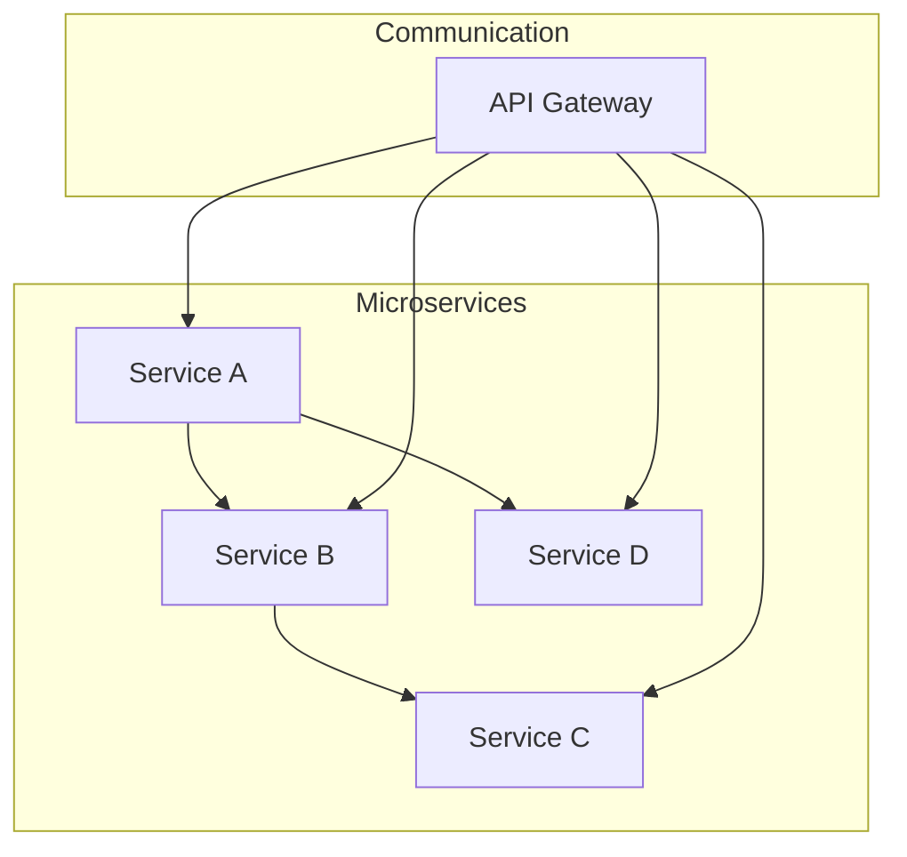
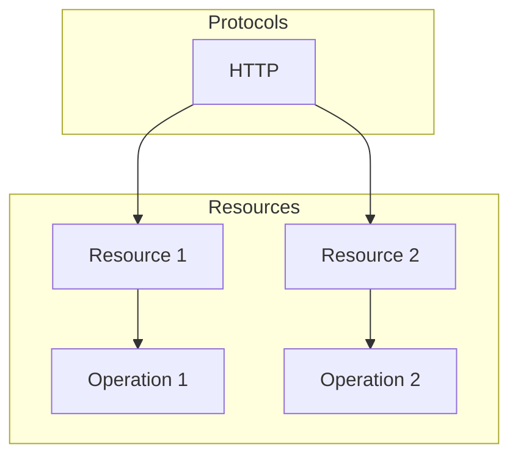
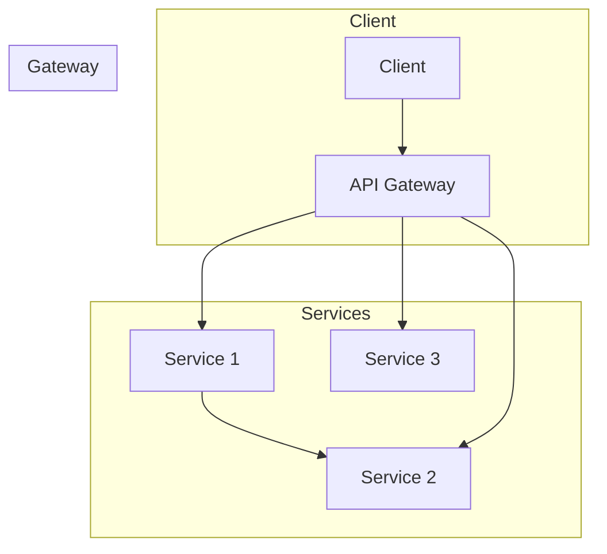
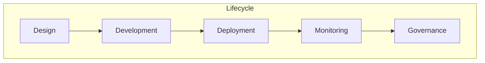

# 软件2.0的API设计与管理

> 关键词：软件2.0，API设计，RESTful API，微服务，架构设计，API管理，安全性，性能优化

## 1. 背景介绍

随着互联网的快速发展和软件架构的不断演进，软件2.0时代已经到来。软件2.0强调的是服务的解耦、组件化和可复用性，其中API（应用程序编程接口）成为了连接各种服务和组件的桥梁。优秀的API设计和管理是构建高质量软件2.0系统的基础。本文将深入探讨软件2.0的API设计与管理，包括核心概念、设计原则、实现方法以及实际应用场景。

### 1.1 问题的由来

传统的软件架构往往采用单体架构，所有功能集中在一个应用程序中，导致系统耦合度高、扩展性差、维护困难。随着业务需求的不断变化，单体架构的弊端日益显现。为了应对这些挑战，软件2.0应运而生，其核心思想是将系统分解为多个独立的微服务，通过API进行交互和通信。

### 1.2 研究现状

当前，软件2.0的API设计与管理已经形成了一系列成熟的理论和方法。RESTful API成为微服务架构的首选通信协议，API网关、API管理平台等工具和框架也得到了广泛应用。

### 1.3 研究意义

优秀的API设计和管理对于构建高质量软件2.0系统具有重要意义：
- 提高系统的可扩展性和可维护性；
- 促进系统组件的复用和集成；
- 降低开发成本和风险；
- 提升用户体验。

### 1.4 本文结构

本文将按照以下结构进行阐述：
- 第2部分，介绍软件2.0的API设计与管理的相关概念和原理；
- 第3部分，详细讲解API设计的原则、方法和工具；
- 第4部分，探讨API管理的关键技术和策略；
- 第5部分，分析API在实际应用场景中的实践案例；
- 第6部分，展望软件2.0的API设计与管理的未来发展趋势和挑战；
- 第7部分，推荐学习资源和相关工具；
- 第8部分，总结全文并展望未来。

## 2. 核心概念与联系

### 2.1 核心概念

#### 2.1.1 微服务

微服务是一种架构风格，将单个应用程序开发为一组小型服务，每个服务都在自己的进程中运行，并与轻量级通信机制（通常是HTTP RESTful API）相连接。这些服务围绕业务功能构建，可以由全自动部署机制独立部署。


#### 2.1.2 RESTful API

RESTful API是一种基于HTTP协议的API设计风格，它使用URI表示资源，使用HTTP方法（如GET、POST、PUT、DELETE等）表示操作，使用JSON或XML表示数据。RESTful API具有无状态、资源导向、无中心化等特点。


#### 2.1.3 API网关

API网关是微服务架构中的一个关键组件，它位于客户端和微服务之间，负责将客户端请求路由到相应的微服务，并处理诸如认证、授权、缓存、限流等跨域 concerns。


#### 2.1.4 API管理

API管理是确保API在整个生命周期中保持一致性和可用性的过程。它包括API设计、开发、部署、监控和治理等环节。


### 2.2 联系

上述概念之间存在着密切的联系。微服务是软件2.0的基本单元，RESTful API是微服务之间通信的方式，API网关负责管理微服务的访问和路由，而API管理则确保整个API生态系统的高效运行。

## 3. 核心算法原理 & 具体操作步骤

### 3.1 算法原理概述

软件2.0的API设计与管理涉及多种算法和原则，主要包括：

- **RESTful API设计原则**：资源导向、无状态、无中心化、统一接口等。
- **API网关路由算法**：基于路径、参数、请求头等条件进行请求路由。
- **API限流算法**：基于令牌桶、漏桶等算法控制API访问频率。
- **API监控算法**：收集API访问数据，进行性能分析和异常检测。

### 3.2 算法步骤详解

#### 3.2.1 RESTful API设计

1. **确定资源**：分析业务需求，识别系统中的核心资源。
2. **定义URI**：为资源定义统一的命名空间和访问路径。
3. **定义HTTP方法**：根据资源操作类型，选择合适的HTTP方法（GET、POST、PUT、DELETE等）。
4. **定义数据格式**：选择JSON或XML等数据格式，并定义数据结构。

#### 3.2.2 API网关路由

1. **收集请求**：从客户端接收请求。
2. **解析请求**：解析请求中的URI、参数、请求头等信息。
3. **路由决策**：根据解析结果，将请求路由到对应的微服务。
4. **执行请求**：将请求转发到微服务，并处理响应。
5. **处理跨域请求**：根据需要处理CORS（跨源资源共享）问题。

#### 3.2.3 API限流

1. **设置限流参数**：根据业务需求，设置API访问频率、并发数等限流参数。
2. **检查请求**：在API网关处检查请求是否符合限流规则。
3. **拒绝或放行请求**：根据检查结果，决定是否放行请求或拒绝访问。

#### 3.2.4 API监控

1. **数据采集**：从API网关、微服务收集访问数据。
2. **性能分析**：分析API的响应时间、错误率等指标。
3. **异常检测**：识别并处理API访问异常。

### 3.3 算法优缺点

#### 3.3.1 优势

- **提高系统可扩展性和可维护性**：通过API设计，可以将系统分解为多个独立的组件，提高系统的可扩展性和可维护性。
- **促进系统组件的复用和集成**：通过API，可以方便地集成第三方服务和内部系统，促进系统组件的复用。
- **降低开发成本和风险**：通过API，可以降低系统的耦合度，降低开发成本和风险。
- **提升用户体验**：通过API，可以提供丰富的服务接口，提升用户体验。

#### 3.3.2 劣势

- **复杂性增加**：API设计和管理需要投入更多的时间和精力，增加了系统的复杂性。
- **安全性风险**：API是系统边界，需要加强安全性设计，防止数据泄露和攻击。
- **性能瓶颈**：API调用可能成为系统的性能瓶颈，需要优化API设计，提高性能。

### 3.4 算法应用领域

软件2.0的API设计与管理在各个领域都有广泛的应用，包括：

- **金融行业**：用于构建在线银行、支付系统等金融服务。
- **电商行业**：用于构建电商平台、供应链管理等系统。
- **医疗健康行业**：用于构建医疗服务平台、远程医疗服务等系统。
- **教育行业**：用于构建在线教育平台、学习管理系统等系统。
- **物联网行业**：用于构建智能家居、智能交通等系统。

## 4. 数学模型和公式 & 详细讲解 & 举例说明

### 4.1 数学模型构建

#### 4.1.1 API性能评估模型

API性能评估模型主要关注API的响应时间、错误率等指标。以下是一个简单的API性能评估模型：

$$
P = \frac{T + \alpha \cdot E}{T + E}
$$

其中，$P$ 表示API性能评分，$T$ 表示API响应时间，$E$ 表示API错误率，$\alpha$ 为权重系数。

#### 4.1.2 API安全评估模型

API安全评估模型主要关注API的安全性，包括数据泄露、拒绝服务攻击等。以下是一个简单的API安全评估模型：

$$
S = \frac{L + \beta \cdot D}{L + D}
$$

其中，$S$ 表示API安全评分，$L$ 表示数据泄露风险，$D$ 表示拒绝服务攻击风险，$\beta$ 为权重系数。

### 4.2 公式推导过程

#### 4.2.1 API性能评估模型

API性能评估模型中的权重系数 $\alpha$ 和 $\beta$ 可以根据具体业务需求进行调整。例如，对于实时性要求较高的业务，可以增大 $\alpha$ 的值。

#### 4.2.2 API安全评估模型

API安全评估模型中的权重系数 $\beta$ 可以根据业务安全需求进行调整。例如，对于安全要求较高的业务，可以增大 $\beta$ 的值。

### 4.3 案例分析与讲解

假设一个API的响应时间为 200ms，错误率为 2%，数据泄露风险为 1%，拒绝服务攻击风险为 0.5%。根据上述模型，我们可以计算出该API的性能评分为：

$$
P = \frac{200 + 0.02 \cdot 1}{200 + 0.02 + 0.01} = 0.98
$$

该API的性能评分为 98 分，表示该API的性能表现良好。

根据上述模型，我们可以对API的性能和安全性进行评估，并根据评估结果进行优化。

## 5. 项目实践：代码实例和详细解释说明

### 5.1 开发环境搭建

为了演示API设计与管理，我们将使用Python语言和Flask框架搭建一个简单的RESTful API。

1. 安装Python和Flask：

```bash
pip install flask
```

2. 创建一个名为 `api` 的目录，并在其中创建一个名为 `app.py` 的文件。

### 5.2 源代码详细实现

```python
from flask import Flask, request, jsonify

app = Flask(__name__)

@app.route('/data', methods=['GET'])
def get_data():
    data = {
        'name': 'John Doe',
        'age': 30,
        'email': 'john.doe@example.com'
    }
    return jsonify(data)

@app.route('/data', methods=['POST'])
def create_data():
    data = request.get_json()
    return jsonify(data), 201

if __name__ == '__main__':
    app.run(debug=True)
```

### 5.3 代码解读与分析

1. 导入Flask库，创建一个名为 `api` 的Flask应用实例。
2. 定义一个名为 `get_data` 的路由，用于获取数据。
3. 定义一个名为 `create_data` 的路由，用于创建数据。
4. 使用 `app.run(debug=True)` 启动Flask应用。

这是一个简单的RESTful API，包含两个路由：一个用于获取数据，另一个用于创建数据。

### 5.4 运行结果展示

1. 在命令行中运行 `python app.py` 启动Flask应用。
2. 使用浏览器或Postman等工具访问API。

- **GET /data**：获取数据

```
HTTP/1.1 200 OK
Content-Type: application/json

{
    "name": "John Doe",
    "age": 30,
    "email": "john.doe@example.com"
}
```

- **POST /data**：创建数据

```
HTTP/1.1 201 Created
Content-Type: application/json

{
    "name": "Jane Doe",
    "age": 25,
    "email": "jane.doe@example.com"
}
```

## 6. 实际应用场景

### 6.1 金融行业

在金融行业中，API设计与管理被广泛应用于支付系统、银行账户管理系统、股票交易平台等。通过API，可以方便地集成第三方服务和内部系统，提高系统的可扩展性和可维护性。

### 6.2 电商行业

在电商行业中，API设计与管理被广泛应用于商品管理系统、订单管理系统、物流管理系统等。通过API，可以方便地与其他系统和第三方服务集成，提高系统的效率和用户体验。

### 6.3 医疗健康行业

在医疗健康行业中，API设计与管理被广泛应用于电子病历系统、健康管理系统、远程医疗服务等。通过API，可以方便地与其他系统和第三方服务集成，提高医疗服务的质量和效率。

## 7. 工具和资源推荐

### 7.1 学习资源推荐

1. 《RESTful API设计指南》
2. 《微服务设计》
3. 《API网关实战》
4. 《API设计与管理》

### 7.2 开发工具推荐

1. Postman：API测试和调试工具
2. Swagger：API文档生成工具
3. API网关：Kong、Zuul、Spring Cloud Gateway等
4. API管理平台：Apigee、IBM API Connect、Mulesoft Anypoint Platform等

### 7.3 相关论文推荐

1. "Microservices: A Define and Design Primer"
2. "Designing RESTful APIs"
3. "API Gateways: A Comprehensive Guide to API Gateway Concepts"
4. "API Management Best Practices"

## 8. 总结：未来发展趋势与挑战

### 8.1 研究成果总结

本文对软件2.0的API设计与管理进行了深入探讨，包括核心概念、设计原则、实现方法以及实际应用场景。通过API设计与管理，可以构建高质量、高效率、高可用的软件2.0系统。

### 8.2 未来发展趋势

1. **API设计更加智能化**：利用机器学习等技术，实现自动化API设计、文档生成和测试。
2. **API安全更加重视**：加强API安全防护，防止数据泄露和攻击。
3. **API性能更加优化**：通过缓存、压缩等技术，提高API性能。
4. **API管理更加开放**：开放API生态系统，促进资源共享和合作。

### 8.3 面临的挑战

1. **API安全**：随着API数量的增加，API安全风险也日益严峻，需要加强安全防护措施。
2. **API性能**：API调用可能成为系统的性能瓶颈，需要优化API设计，提高性能。
3. **API治理**：随着API数量的增加，API治理变得更加困难，需要建立完善的API管理体系。

### 8.4 研究展望

未来，软件2.0的API设计与管理将继续发展，为构建高质量、高效率、高可用的软件2.0系统提供有力支持。同时，我们也需要关注API安全、API性能和API治理等挑战，以推动API设计与管理技术的不断进步。

## 9. 附录：常见问题与解答

**Q1：什么是RESTful API？**

A：RESTful API是一种基于HTTP协议的API设计风格，它使用URI表示资源，使用HTTP方法表示操作，使用JSON或XML表示数据。

**Q2：API网关的作用是什么？**

A：API网关是微服务架构中的一个关键组件，它位于客户端和微服务之间，负责将客户端请求路由到相应的微服务，并处理诸如认证、授权、缓存、限流等跨域 concerns。

**Q3：如何设计安全的API？**

A：设计安全的API需要关注以下方面：
- 使用HTTPS协议，确保数据传输安全。
- 进行身份验证和授权，确保只有授权用户才能访问API。
- 进行数据加密，防止数据泄露。
- 定期进行安全审计，发现并修复安全漏洞。

**Q4：如何优化API性能？**

A：优化API性能需要关注以下方面：
- 使用缓存，减少数据库访问次数。
- 使用压缩，减小数据传输量。
- 优化数据库查询，提高查询效率。
- 优化服务器配置，提高服务器性能。

**Q5：如何进行API管理？**

A：进行API管理需要关注以下方面：
- 制定API管理流程，确保API的规范化和标准化。
- 使用API管理平台，实现API的生命周期管理。
- 定期进行API审核，确保API的质量和安全。
- 进行API监控，及时发现并解决问题。

作者：禅与计算机程序设计艺术 / Zen and the Art of Computer Programming