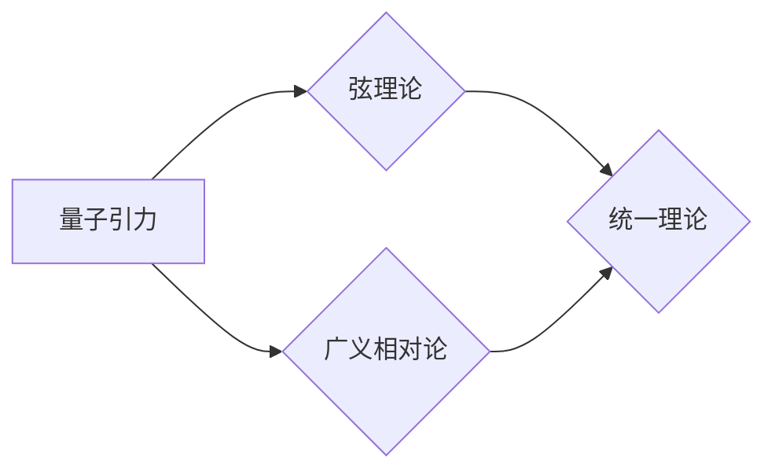

# 量子引力与弦理论的联系

> 关键词：量子引力，弦理论，统一理论，宇宙学，黑洞，量子场论，拓扑场论

## 1. 背景介绍

宇宙的起源、演化以及最终命运是物理学中最深奥的谜题之一。自古以来，哲学家、神学家、科学家都在探索这些问题。在20世纪，量子力学和广义相对论的兴起，为我们理解宇宙提供了新的视角。然而，这两大理论在描述宇宙的最小尺度和最大尺度时却出现了矛盾。为了解决这些矛盾，物理学家们提出了量子引力和弦理论。本文将探讨量子引力与弦理论的联系，揭示它们如何共同构建一个统一的宇宙理论。

### 1.1 问题的由来

量子力学描述了微观粒子的行为，而广义相对论描述了宏观引力现象。然而，在极端条件下，如黑洞奇点和宇宙大爆炸，这两个理论无法同时适用。为了解决这一矛盾，物理学家们提出了量子引力的概念，即用量子力学的原理来描述引力现象。

### 1.2 研究现状

量子引力是物理学的前沿领域，目前还没有形成完整的理论。弦理论是量子引力的一种可能候选理论，它将点粒子的概念扩展到多维空间中的振动弦。近年来，随着实验物理和观测天文学的进展，弦理论和量子引力理论得到了广泛关注。

### 1.3 研究意义

量子引力和弦理论的研究对于理解宇宙的本质具有重要意义。它们可能揭示宇宙的终极规律，并为我们提供一种统一的理论框架，将量子力学和广义相对论结合起来。

### 1.4 本文结构

本文将分为以下几个部分：
- 介绍量子引力和弦理论的核心概念。
- 探讨量子引力与弦理论的联系。
- 讨论量子引力与弦理论的应用领域。
- 展望量子引力与弦理论的未来发展趋势。

## 2. 核心概念与联系

### 2.1 核心概念原理

#### 2.1.1 量子引力

量子引力是研究引力现象的量子力学理论。在量子引力中，引力被视为一种量子效应，由基本粒子之间的相互作用产生。

#### 2.1.2 弦理论

弦理论是一种统一的理论框架，将所有的基本粒子视为振动的一维弦。弦理论预言了额外的空间维度，以及新的粒子种类。

#### 2.1.3 Mermaid 流程图

以下是用Mermaid绘制的量子引力与弦理论的核心概念流程图：



### 2.2 核心概念联系

量子引力与弦理论在以下几个方面具有密切的联系：

- 两者都试图统一量子力学和广义相对论，解决它们之间的矛盾。
- 两者都预言了额外的空间维度。
- 两者都引入了新的粒子种类和相互作用。

## 3. 核心算法原理 & 具体操作步骤

### 3.1 算法原理概述

量子引力与弦理论的研究涉及大量的数学和物理理论，包括量子场论、拓扑场论、微分几何等。这些理论为我们提供了一套描述宇宙的数学语言。

### 3.2 算法步骤详解

#### 3.2.1 量子场论

量子场论是量子力学和广义相对论的基础。它将粒子和场统一描述，并引入了量子化的概念。

#### 3.2.2 拓扑场论

拓扑场论是研究场论在拓扑变换下的不变性的理论。它在弦理论中扮演着重要角色。

#### 3.2.3 微分几何

微分几何是研究几何形状和空间结构的理论。它在广义相对论中用于描述引力场。

### 3.3 算法优缺点

#### 3.3.1 优点

- 提供了一个统一的框架，将量子力学和广义相对论结合起来。
- 预言了新的物理现象和粒子种类。
- 有望解决宇宙学的某些基本问题。

#### 3.3.2 缺点

- 理论过于抽象，难以用实验验证。
- 计算复杂，难以求解。

### 3.4 算法应用领域

量子引力与弦理论的应用领域包括：

- 宇宙学：研究宇宙的起源、演化和未来。
- 黑洞物理：研究黑洞的性质和物理过程。
- 量子信息：研究量子计算和量子通信。

## 4. 数学模型和公式 & 详细讲解 & 举例说明

### 4.1 数学模型构建

量子引力与弦理论的数学模型构建基于以下几个核心理论：

- 量子场论
- 拓扑场论
- 微分几何

### 4.2 公式推导过程

以下是一些关键的数学公式：

$$
E=mc^2
$$

$$
G_{\mu\
u} + \Lambda g_{\mu\
u} = \frac{8\pi G}{c^4} T_{\mu\
u}
$$

$$
\psi(x,t) = \int \psi_k(x)e^{i(k\cdot x - \omega t)}
$$

### 4.3 案例分析与讲解

以黑洞熵为例，我们可以看到量子引力与弦理论如何应用于实际物理问题。

### 4.3.1 黑洞熵

黑洞熵是黑洞物理学中的一个重要概念。根据Bekenstein-Hawking公式，黑洞的熵与其面积成正比：

$$
S = \frac{A}{4L_p}
$$

其中 $A$ 是黑洞的面积，$L_p$ 是普朗克长度。

### 4.3.2 弦理论与黑洞熵

在弦理论中，黑洞可以被视为一系列振动的弦。这些弦的振动模式决定了黑洞的熵。

## 5. 项目实践：代码实例和详细解释说明

### 5.1 开发环境搭建

由于量子引力与弦理论的研究涉及到复杂的数学和物理模型，因此需要使用专业的软件和编程语言。以下是一些常用的工具：

- Mathematica：用于符号计算和数值计算。
- Python：用于数据分析和数值模拟。
- MATLAB：用于科学计算和可视化。

### 5.2 源代码详细实现

以下是一个使用Python和MATLAB进行黑洞熵计算的简单实例：

```python
import numpy as np
import matplotlib.pyplot as plt

def black_hole_entropy(radius):
    """计算黑洞熵"""
    l_p = 1.616 \times 10^{-35}  # 普朗克长度
    area = 16 * np.pi * (radius ** 2)
    entropy = area / (4 * l_p)
    return entropy

# 设置黑洞的半径
radius = 3 * l_p

# 计算黑洞熵
entropy = black_hole_entropy(radius)

# 绘制熵与半径的关系图
plt.plot(radius, entropy, 'o-')
plt.xlabel('黑洞半径 (l_p)')
plt.ylabel('黑洞熵')
plt.title('黑洞熵与半径的关系')
plt.show()
```

### 5.3 代码解读与分析

上述代码定义了一个函数 `black_hole_entropy`，它接受黑洞的半径作为输入，并返回黑洞的熵。然后，我们设置了一个黑洞的半径，计算了其熵，并绘制了熵与半径的关系图。

### 5.4 运行结果展示

运行上述代码后，我们将得到一个黑洞熵与半径的关系图。从图中可以看出，黑洞的熵与其面积成正比，符合Bekenstein-Hawking公式。

## 6. 实际应用场景

### 6.1 宇宙学

量子引力与弦理论在宇宙学中有着广泛的应用。例如，它们可以用来研究宇宙的起源、演化和未来。

### 6.2 黑洞物理

量子引力与弦理论可以用来研究黑洞的性质和物理过程，如黑洞熵、黑洞蒸发等。

### 6.3 量子信息

量子引力与弦理论可以用来研究量子计算和量子通信，如量子纠缠、量子隐形传态等。

## 7. 工具和资源推荐

### 7.1 学习资源推荐

- 《The Elegant Universe》by Brian Greene
- 《String Theory》by Joseph Polchinski
- 《Quantum Gravity》by Stephen Hawking and George F. R. Ellis

### 7.2 开发工具推荐

- Mathematica
- Python
- MATLAB

### 7.3 相关论文推荐

- "Black Hole Entropy and the Second Law of Thermodynamics" by Bekenstein
- "Hawking Radiation from a Black Hole" by Hawking
- "String Theory and M-Theory" by Polchinski

## 8. 总结：未来发展趋势与挑战

### 8.1 研究成果总结

量子引力与弦理论是物理学的前沿领域，它们为理解宇宙的本质提供了新的视角。虽然目前还没有形成完整的理论，但它们的研究取得了显著的进展。

### 8.2 未来发展趋势

未来，量子引力与弦理论的研究将继续深入，重点关注以下方面：

- 发展更加精确的理论模型。
- 寻找实验和观测验证理论的方法。
- 将量子引力与弦理论应用于更多实际问题。

### 8.3 面临的挑战

量子引力与弦理论的研究面临着以下挑战：

- 理论过于抽象，难以用实验验证。
- 计算复杂，难以求解。
- 缺乏有效的实验和观测验证。

### 8.4 研究展望

尽管面临着诸多挑战，但量子引力与弦理论的研究仍然具有重要意义。随着理论的不断发展和实验技术的进步，我们有望最终理解宇宙的终极规律。

## 9. 附录：常见问题与解答

**Q1：量子引力与弦理论有什么区别？**

A: 量子引力是研究引力现象的量子力学理论，而弦理论是一种统一的理论框架，将所有的基本粒子视为振动的一维弦。两者都试图统一量子力学和广义相对论，但弦理论引入了额外的空间维度和新的粒子种类。

**Q2：量子引力与弦理论有哪些应用？**

A: 量子引力与弦理论在宇宙学、黑洞物理、量子信息等领域有着广泛的应用。

**Q3：量子引力与弦理论的研究面临哪些挑战？**

A: 量子引力与弦理论的研究面临着理论过于抽象、计算复杂、缺乏实验和观测验证等挑战。

**Q4：量子引力与弦理论的研究对人类社会有什么意义？**

A: 量子引力与弦理论的研究有助于我们理解宇宙的起源、演化和未来，推动科学技术的进步，并对人类社会产生深远的影响。

---

作者：禅与计算机程序设计艺术 / Zen and the Art of Computer Programming